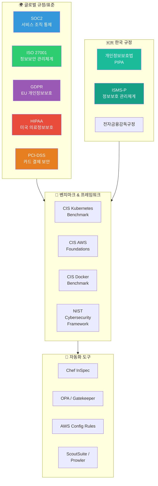
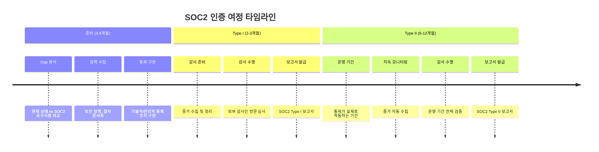
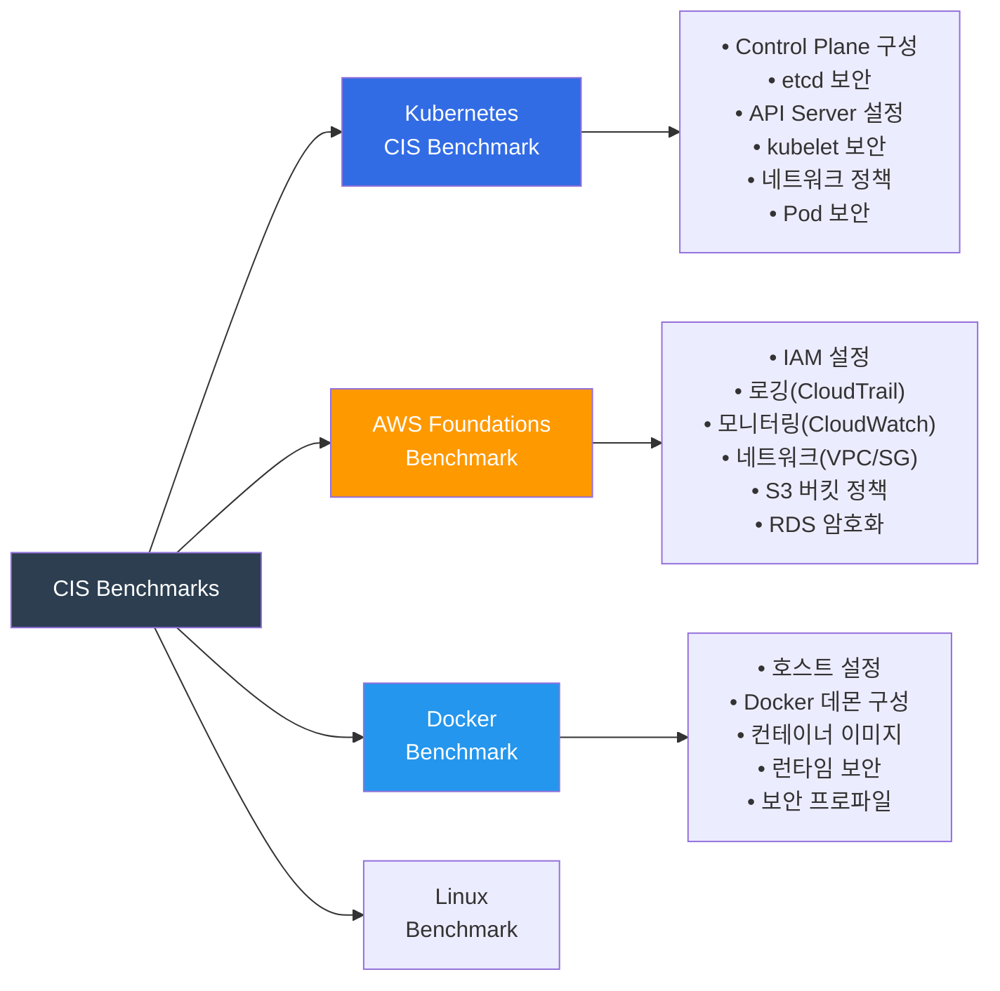
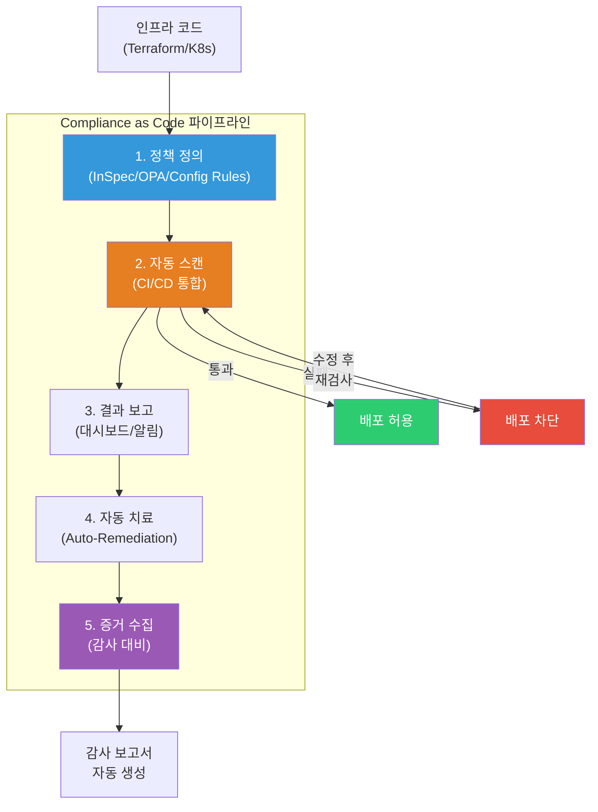
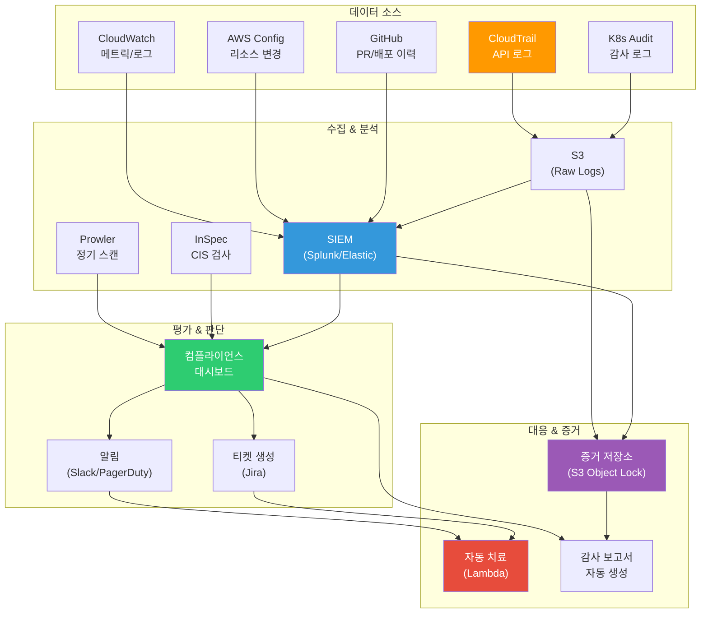

# 컴플라이언스 (Compliance)

> [이전 강의: 시크릿 관리](./02-secrets)에서 비밀 정보를 안전하게 관리하는 방법을 배웠다면, 이번에는 **우리 시스템이 법적/산업 표준을 제대로 지키고 있는지** 검증하고 자동화하는 방법을 알아볼게요. [AWS 보안 서비스](../05-cloud-aws/12-security)가 "기술적 보안 도구"였다면, 컴플라이언스는 "그 도구들을 규정에 맞게 운영하고 있음을 증명하는 것"이에요.

---

## 🎯 왜 컴플라이언스를 알아야 하나요?

```
실무에서 컴플라이언스가 필요한 순간:
• 글로벌 고객사가 "SOC2 Type II 인증 있어요?" 물어볼 때          → SOC2
• 유럽 사용자 데이터를 처리해야 해서 GDPR 준수가 필요할 때       → GDPR
• 의료 데이터를 다루는 서비스를 미국에 출시할 때                   → HIPAA
• 결제 시스템을 직접 구축해야 할 때                                → PCI-DSS
• 한국에서 일정 규모 이상 서비스를 운영할 때                       → ISMS-P / 개인정보보호법
• 보안 감사(audit)에서 "증거(evidence) 보여주세요" 할 때          → Evidence Collection
• K8s 클러스터가 보안 기준에 맞는지 자동으로 검사하고 싶을 때     → CIS Benchmarks
• 컴플라이언스 검증을 수동이 아니라 CI/CD에 넣고 싶을 때          → Compliance as Code
• 면접: "SOC2 Type I과 Type II 차이가 뭔가요?"                   → 핵심 면접 질문
```

### 왜 DevOps 엔지니어에게 중요한가요?

예전에는 컴플라이언스가 **보안팀의 일**이었어요. 하지만 클라우드와 DevOps 환경에서는 **인프라를 코드로 관리하는 사람**이 곧 **컴플라이언스를 구현하는 사람**이 되었어요.

```
전통적 방식:                          현대적 방식 (DevOps):
┌──────────┐                          ┌──────────────┐
│ 보안팀이  │ → 엑셀 체크리스트 →      │ 코드로 정책  │ → CI/CD 파이프라인 →
│ 수동 점검 │   분기별 1회 감사        │ 자동 검증    │   매 배포마다 검증
└──────────┘                          └──────────────┘
  6개월에 한 번 발견                     실시간 탐지 & 차단
```

비유하면, **건물 안전 점검**과 같아요:
- 예전: 1년에 한 번 안전 검사관이 와서 체크리스트로 점검
- 지금: 건물 곳곳에 센서가 있어서 실시간으로 안전 상태를 모니터링하고, 문제 발견 즉시 알림

---

## 🧠 핵심 개념 잡기

### 비유: 식당 위생 등급 시스템

컴플라이언스를 **식당 운영**에 비유해볼게요.

| 컴플라이언스 개념 | 식당 비유 |
|---|---|
| **규정(Regulation)** | 식품위생법 - 반드시 지켜야 하는 법률 |
| **표준(Standard)** | ISO/SOC2 - 자발적으로 받는 위생 인증 |
| **정책(Policy)** | "주방 직원은 반드시 손을 씻는다" 같은 내부 규칙 |
| **통제(Control)** | 손 세정제 설치, 온도계 부착 같은 구체적 조치 |
| **감사(Audit)** | 위생 검사관이 와서 실제로 지키고 있는지 확인 |
| **증거(Evidence)** | 온도 기록지, 세척 점검표 같은 증빙 자료 |
| **CIS Benchmark** | "냉장고 온도는 5도 이하" 같은 구체적 기준치 |
| **Compliance as Code** | IoT 센서로 온도를 자동 측정하고 기록하는 시스템 |

### 컴플라이언스 전체 지도



### 규정 vs 표준 vs 프레임워크

이 세 가지를 구분하는 것이 중요해요:

```
📜 규정 (Regulation) - 법적 강제력 있음
   GDPR, HIPAA, 개인정보보호법, 전자금융감독규정
   → 안 지키면 벌금/처벌

📋 표준 (Standard) - 자발적이지만 사실상 필수
   SOC2, ISO 27001, PCI-DSS, ISMS-P
   → 안 지키면 고객 신뢰 상실, 사업 기회 손실

📐 프레임워크/벤치마크 (Framework/Benchmark) - 가이드라인
   CIS Benchmarks, NIST CSF, OWASP
   → 구체적인 기술 기준과 베스트 프랙티스
```

---

## 🔍 하나씩 자세히 알아보기

### 1. SOC2 (Service Organization Control 2)

SOC2는 **클라우드 서비스 기업**이 가장 많이 받는 인증이에요. 미국 AICPA(공인회계사협회)가 만든 표준으로, 고객 데이터를 안전하게 처리하고 있는지 검증해요.

#### SOC2 5가지 신뢰 서비스 원칙 (Trust Service Criteria)

```
┌─────────────────────────────────────────────────────────┐
│                    SOC2 Trust Service Criteria           │
├────────────────┬────────────────────────────────────────┤
│ 보안(Security) │ 필수! 시스템 접근 통제, 방화벽,        │
│   ⭐ 필수     │ 암호화, 취약점 관리                     │
├────────────────┼────────────────────────────────────────┤
│ 가용성         │ 시스템 가동률, 재해 복구,               │
│ (Availability) │ 백업, 모니터링                          │
├────────────────┼────────────────────────────────────────┤
│ 처리 무결성    │ 데이터 처리가 정확하고 완전하며          │
│ (Processing    │ 적시에 이루어지는지                      │
│  Integrity)    │                                        │
├────────────────┼────────────────────────────────────────┤
│ 기밀성         │ 기밀 정보(영업비밀, IP)를                │
│(Confidentiality)│ 적절히 보호하는지                      │
├────────────────┼────────────────────────────────────────┤
│ 프라이버시     │ 개인정보 수집/사용/보관/폐기가           │
│ (Privacy)      │ 정책대로 이루어지는지                    │
└────────────────┴────────────────────────────────────────┘
```

#### SOC2 Type I vs Type II

이 차이를 이해하는 것이 매우 중요해요:

| 구분 | SOC2 Type I | SOC2 Type II |
|---|---|---|
| **검증 대상** | 통제가 **설계**되어 있는지 | 통제가 **실제로 운영**되고 있는지 |
| **검증 시점** | 특정 시점(snapshot) | 일정 기간(보통 6-12개월) |
| **비유** | 식당에 소화기가 **설치**되어 있는지 확인 | 소화기가 6개월간 **점검/관리** 되었는지 확인 |
| **난이도** | 상대적으로 쉬움 | 지속적 운영 증거 필요 |
| **고객 신뢰** | 기본 | 높음 (대부분 Type II 요구) |
| **소요 기간** | 2-3개월 | 6-12개월 |



#### SOC2에서 DevOps가 챙겨야 할 것들

```yaml
# SOC2 통제 항목과 DevOps 구현 매핑
access_control:
  - MFA 강제 (IAM 정책)
  - 최소 권한 원칙 (RBAC)
  - 접근 로그 기록 (CloudTrail)
  - 분기별 접근 권한 리뷰

change_management:
  - PR 리뷰 필수 (Branch Protection)
  - 배포 승인 프로세스 (GitOps)
  - 변경 이력 추적 (Git log)
  - 롤백 절차 문서화

logging_monitoring:
  - 중앙 집중식 로그 관리 (ELK/CloudWatch)
  - 이상 탐지 알림 (GuardDuty)
  - 로그 보관 기간 (최소 1년)
  - 로그 무결성 보장 (S3 Object Lock)

incident_response:
  - 인시던트 대응 절차 문서화
  - 에스컬레이션 경로 정의
  - 사후 분석(Postmortem) 프로세스
  - 정기 모의 훈련 (Tabletop Exercise)
```

---

### 2. ISO 27001

ISO 27001은 **국제 정보보안 관리체계(ISMS)** 표준이에요. SOC2가 주로 북미에서 통용된다면, ISO 27001은 **전 세계적으로** 인정받는 표준이에요.

#### ISO 27001 핵심 구조

```
ISO 27001 구조:
├── 4. 조직 맥락 (Context)
│   └── 이해관계자 요구사항, 범위 정의
├── 5. 리더십 (Leadership)
│   └── 경영진 의지, 정보보안 정책
├── 6. 기획 (Planning)
│   └── 리스크 평가, 리스크 처리 계획
├── 7. 지원 (Support)
│   └── 자원, 역량, 인식, 커뮤니케이션
├── 8. 운영 (Operation)
│   └── 리스크 처리 실행, 운영 통제
├── 9. 성과 평가 (Evaluation)
│   └── 모니터링, 내부 감사, 경영 검토
├── 10. 개선 (Improvement)
│   └── 부적합 시정, 지속적 개선
└── Annex A: 93개 통제 항목 (4개 테마)
    ├── 조직적 통제 (37개)
    ├── 인적 통제 (8개)
    ├── 물리적 통제 (14개)
    └── 기술적 통제 (34개)
```

#### ISO 27001 vs SOC2 비교

| 항목 | ISO 27001 | SOC2 |
|---|---|---|
| **발행 기관** | ISO (국제표준화기구) | AICPA (미국 공인회계사협회) |
| **지역** | 전 세계 | 주로 북미 |
| **인증 방식** | 인증서 발급 (합격/불합격) | 감사 보고서 발급 (의견 포함) |
| **유효 기간** | 3년 (매년 사후 심사) | 1년 (매년 재감사) |
| **범위** | 조직 전체 또는 특정 범위 | 특정 서비스/시스템 |
| **한국에서** | ISMS-P와 연계 가능 | 글로벌 SaaS 기업에서 주로 요구 |

---

### 3. GDPR (General Data Protection Regulation)

GDPR은 EU의 **개인정보보호 규정**이에요. 2018년부터 시행되었고, **EU 시민의 데이터를 처리하는 모든 기업**에 적용돼요 (기업 위치와 무관).

#### GDPR 핵심 원칙

```
GDPR 7대 원칙:
1. 적법성·공정성·투명성  → 합법적 근거로, 투명하게 처리
2. 목적 제한             → 수집 목적 외 사용 금지
3. 데이터 최소화         → 필요한 만큼만 수집
4. 정확성               → 부정확한 데이터 수정/삭제
5. 보관 제한             → 목적 달성 후 삭제
6. 무결성·기밀성         → 적절한 보안 조치
7. 책임성               → 위 원칙 준수를 증명할 수 있어야 함
```

#### GDPR에서 DevOps가 신경 써야 하는 것

```yaml
# GDPR 기술적 요구사항 - DevOps 구현
data_subject_rights:
  right_to_access:
    - 사용자 데이터 조회 API 구현
    - 30일 이내 응답 보장
  right_to_erasure:  # 잊힐 권리
    - 데이터 삭제 파이프라인 구축
    - 백업에서도 삭제 (주의!)
    - 로그에서 개인정보 마스킹
  data_portability:
    - 표준 포맷(JSON/CSV)으로 내보내기 기능

technical_measures:
  encryption:
    - 전송 중 암호화 (TLS 1.2+)
    - 저장 시 암호화 (AES-256)
  pseudonymization:
    - 개인 식별 불가능하게 처리
    - 토큰화 또는 해시 처리
  access_control:
    - 개인정보 접근 로그 기록
    - 최소 권한 원칙 적용

data_breach_notification:
  - 72시간 이내 감독기관 통보
  - 심각한 경우 데이터 주체에게도 통보
  - 자동 탐지 시스템 구축 필요

# 위반 시 과징금
penalties:
  tier_1: "최대 1천만 유로 또는 전 세계 매출의 2%"
  tier_2: "최대 2천만 유로 또는 전 세계 매출의 4%"
```

---

### 4. HIPAA (Health Insurance Portability and Accountability Act)

HIPAA는 미국의 **의료 정보 보호법**이에요. PHI(Protected Health Information, 보호 대상 건강 정보)를 다루는 모든 조직이 준수해야 해요.

#### HIPAA 핵심 규칙

```
HIPAA 3대 규칙:
┌─────────────────────────────────────────┐
│ 1. Privacy Rule (프라이버시 규칙)        │
│    - PHI 사용/공개에 대한 기준            │
│    - 환자 권리 (접근, 수정, 회계)         │
│    - 최소 필요 원칙                       │
├─────────────────────────────────────────┤
│ 2. Security Rule (보안 규칙)             │
│    - ePHI(전자 PHI) 보호 기준             │
│    - 관리적/물리적/기술적 보호 조치        │
│    - 위험 분석 및 관리                    │
├─────────────────────────────────────────┤
│ 3. Breach Notification Rule              │
│    - 침해 발생 시 통보 의무               │
│    - 60일 이내 개인/HHS 통보              │
│    - 500명 이상이면 미디어 통보도 필요     │
└─────────────────────────────────────────┘
```

#### HIPAA - AWS 아키텍처 고려사항

```yaml
# HIPAA 준수 AWS 아키텍처 체크리스트
aws_hipaa_requirements:
  baa:  # Business Associate Agreement
    - AWS와 BAA 체결 필수
    - BAA 대상 서비스만 PHI 저장 가능
    - "HIPAA Eligible Services" 목록 확인

  encryption:
    - S3: SSE-KMS 또는 SSE-S3 필수
    - RDS: 저장 시 암호화 활성화
    - EBS: 암호화된 볼륨만 사용
    - 전송: TLS 1.2 이상

  access_control:
    - CloudTrail: 모든 API 호출 기록
    - IAM: MFA 필수, 역할 기반 접근
    - VPC: PHI 처리 시스템 격리

  audit:
    - 로그 보관: 최소 6년
    - CloudTrail 로그 무결성 검증
    - 접근 기록 정기 리뷰
```

---

### 5. PCI-DSS (Payment Card Industry Data Security Standard)

PCI-DSS는 **카드 결제 데이터를 보호하기 위한 보안 표준**이에요. Visa, Mastercard 등 카드 브랜드가 만든 PCI SSC(Security Standards Council)에서 관리해요.

#### PCI-DSS 12가지 요구사항

```
PCI-DSS v4.0 (12개 요구사항):

🔒 네트워크 보안 구축 및 유지
  1. 네트워크 보안 통제 설치 및 유지
  2. 모든 시스템에 보안 설정 적용

🛡️ 카드 소유자 데이터 보호
  3. 저장된 카드 데이터 보호
  4. 개방형 네트워크에서 전송 시 암호화

🔍 취약점 관리 프로그램 유지
  5. 악성 소프트웨어로부터 시스템 보호
  6. 안전한 시스템 및 소프트웨어 개발/유지

👤 강력한 접근 통제 구현
  7. 비즈니스 필요에 따라 접근 제한
  8. 사용자 식별 및 인증
  9. 카드 데이터에 대한 물리적 접근 제한

📊 네트워크 모니터링 및 테스트
  10. 네트워크 리소스와 카드 데이터 접근 추적/모니터링
  11. 보안 시스템 및 프로세스 정기 테스트

📋 정보보안 정책 유지
  12. 모든 직원에 대한 정보보안 정책 유지
```

> **DevOps 팁**: 직접 카드 데이터를 처리하지 않도록 **Stripe, Toss Payments** 같은 PG사를 사용하면 PCI-DSS 범위를 크게 줄일 수 있어요. 이를 **범위 축소(scope reduction)**라고 해요.

---

### 6. 한국 규정: 개인정보보호법 & ISMS-P

#### 개인정보보호법 (PIPA)

한국의 **개인정보보호법**은 GDPR과 유사하지만 한국 특유의 요구사항이 있어요.

```
한국 개인정보보호법 주요 내용:
┌──────────────────────────────────────────────┐
│ 수집·이용                                     │
│  - 동의 기반 (Opt-in 방식, GDPR보다 엄격)     │
│  - 주민등록번호 수집 원칙적 금지               │
│  - 필수/선택 동의 구분                         │
├──────────────────────────────────────────────┤
│ 제3자 제공                                    │
│  - 별도 동의 필요                              │
│  - 해외 이전 시 추가 동의/보호조치             │
├──────────────────────────────────────────────┤
│ 파기                                          │
│  - 목적 달성 후 지체 없이 파기                  │
│  - 다른 법률에 의한 보존 기간 예외              │
├──────────────────────────────────────────────┤
│ 기술적 보호 조치                               │
│  - 암호화: 비밀번호(일방향), 고유식별정보(양방향)│
│  - 접근 통제: 접속 기록 보관 (최소 1년)         │
│  - 접속 기록 위변조 방지                        │
├──────────────────────────────────────────────┤
│ 위반 시                                       │
│  - 과징금: 매출액의 3% 이하                    │
│  - 과태료: 최대 5천만원                        │
│  - 형사 처벌: 5년 이하 징역 또는 5천만원 벌금   │
└──────────────────────────────────────────────┘
```

#### ISMS-P (정보보호 및 개인정보보호 관리체계 인증)

```
ISMS-P 인증 대상 (의무):
• 정보통신서비스 매출 100억 이상
• 일일 평균 이용자 수 100만 이상
• 의료, 교육 등 민감정보 대량 처리 기관

ISMS-P 구성:
├── 관리체계 수립 및 운영 (16개)
│   ├── 관리체계 기반 마련 (4)
│   ├── 위험 관리 (3)
│   ├── 관리체계 운영 (4)
│   └── 관리체계 점검 및 개선 (5)
├── 보호대책 요구사항 (64개)
│   ├── 정책/조직/자산 관리
│   ├── 인적 보안
│   ├── 외부자 보안
│   ├── 물리 보안
│   ├── 인증 및 권한 관리
│   ├── 접근 통제
│   ├── 암호화 적용
│   ├── 정보시스템 도입/개발 보안
│   ├── 시스템/서비스 운영 관리
│   ├── 시스템/서비스 보안 관리
│   ├── 사고 예방 및 대응
│   └── 재해 복구
└── 개인정보 처리 단계별 요구사항 (22개)
    ├── 개인정보 수집
    ├── 개인정보 보유/이용/제공/파기
    └── 정보주체 권리 보호
```

---

### 7. CIS Benchmarks

CIS(Center for Internet Security) Benchmarks는 **시스템별 보안 설정 가이드라인**이에요. "이 설정을 이렇게 해야 안전합니다"라는 **구체적인 기술 기준**을 제공해요.

#### CIS Benchmark 주요 카테고리



#### CIS Kubernetes Benchmark 주요 항목

```yaml
# CIS Kubernetes Benchmark v1.8 - 주요 점검 항목
control_plane:
  api_server:
    - "1.2.1: --anonymous-auth=false 설정"
    - "1.2.2: --token-auth-file 미사용 확인"
    - "1.2.5: --kubelet-https=true 설정"
    - "1.2.6: --authorization-mode에 AlwaysAllow 미포함"
    - "1.2.10: admission control에 EventRateLimit 포함"
    - "1.2.16: --audit-log-path 설정"
    - "1.2.17: --audit-log-maxage=30 이상"

  etcd:
    - "2.1: --cert-file, --key-file 설정"
    - "2.2: --client-cert-auth=true"
    - "2.4: --peer-cert-file, --peer-key-file 설정"

worker_nodes:
  kubelet:
    - "4.2.1: --anonymous-auth=false"
    - "4.2.2: --authorization-mode=Webhook"
    - "4.2.6: --protect-kernel-defaults=true"
    - "4.2.10: --rotate-certificates=true"

policies:
  pod_security:
    - "5.1.1: Cluster-admin 역할 최소 사용"
    - "5.1.3: 와일드카드 사용 최소화"
    - "5.2.2: 특권(privileged) 컨테이너 차단"
    - "5.2.3: HostPID 공유 차단"
    - "5.2.4: HostNetwork 사용 차단"
    - "5.2.6: root로 실행 차단"
  network:
    - "5.3.2: 모든 네임스페이스에 NetworkPolicy 적용"
```

#### CIS AWS Foundations Benchmark 주요 항목

```yaml
# CIS AWS Foundations Benchmark v3.0 - 핵심 항목
iam:
  - "1.4: root 계정 MFA 활성화"
  - "1.5: root 계정 사용하지 않음"
  - "1.8: IAM 비밀번호 정책 - 최소 14자"
  - "1.10: MFA 전체 사용자 활성화"
  - "1.12: 90일 이상 미사용 자격증명 비활성화"
  - "1.14: 액세스 키 90일마다 교체"
  - "1.16: IAM 정책이 그룹/역할에만 연결"

logging:
  - "3.1: CloudTrail 전체 리전 활성화"
  - "3.2: CloudTrail 로그 암호화"
  - "3.4: CloudTrail 로그 무결성 검증 활성화"
  - "3.7: S3 버킷 접근 로깅 활성화"

monitoring:
  - "4.1: 무단 API 호출에 대한 알림"
  - "4.3: root 계정 사용에 대한 알림"
  - "4.4: IAM 정책 변경에 대한 알림"
  - "4.5: CloudTrail 설정 변경 알림"
  - "4.12: 네트워크 게이트웨이 변경 알림"

networking:
  - "5.1: NACL이 0.0.0.0/0에서 관리 포트 허용 안 함"
  - "5.2: Security Group이 0.0.0.0/0에서 관리 포트 허용 안 함"
  - "5.3: 기본 Security Group이 모든 트래픽 차단"
  - "5.4: VPC 피어링 라우팅 최소화"
```

---

### 8. Compliance as Code

**Compliance as Code**는 컴플라이언스 요구사항을 **코드로 정의하고 자동으로 검증**하는 접근 방식이에요. 수동 점검 대신 코드가 지속적으로 규정 준수 여부를 확인해요.

#### 핵심 도구 비교

```
┌──────────────┬──────────────┬──────────────┬──────────────┐
│              │ Chef InSpec  │ OPA/Rego     │ AWS Config   │
├──────────────┼──────────────┼──────────────┼──────────────┤
│ 대상         │ OS, 클라우드,│ K8s, API,    │ AWS 리소스   │
│              │ 컨테이너     │ Terraform    │ 전용         │
├──────────────┼──────────────┼──────────────┼──────────────┤
│ 언어         │ Ruby DSL     │ Rego         │ JSON/YAML    │
├──────────────┼──────────────┼──────────────┼──────────────┤
│ 실행 방식    │ 에이전트     │ Admission    │ 관리형       │
│              │ 또는 원격    │ Controller   │ 서비스       │
├──────────────┼──────────────┼──────────────┼──────────────┤
│ 강점         │ CIS 프로파일 │ K8s 정책     │ AWS 네이티브 │
│              │ 내장         │ 강제         │ 자동 치료    │
├──────────────┼──────────────┼──────────────┼──────────────┤
│ 비용         │ 오픈소스     │ 오픈소스     │ 규칙당 과금  │
└──────────────┴──────────────┴──────────────┴──────────────┘
```



---

### 9. 데이터 분류 (Data Classification)

컴플라이언스의 기초는 **데이터 분류**예요. 어떤 데이터가 어디에 있는지 모르면 보호할 수도 없어요.

```
데이터 분류 4단계:
┌─────────────────────────────────────────────────────┐
│ Level 4: 극비 (Restricted/Critical)                  │
│   카드번호, 의료기록, 암호화 키, 주민등록번호         │
│   → 암호화 필수, 접근 로그, 가장 엄격한 통제         │
├─────────────────────────────────────────────────────┤
│ Level 3: 기밀 (Confidential)                         │
│   개인정보(이름, 이메일, 전화번호), 영업비밀          │
│   → 암호화 권장, 접근 통제, NDA 필요                 │
├─────────────────────────────────────────────────────┤
│ Level 2: 내부용 (Internal)                           │
│   내부 문서, 프로젝트 계획, 소스 코드                 │
│   → 사내에서만 접근, 외부 공유 시 승인 필요           │
├─────────────────────────────────────────────────────┤
│ Level 1: 공개 (Public)                               │
│   마케팅 자료, 공개 API 문서, 블로그 글               │
│   → 누구나 접근 가능                                 │
└─────────────────────────────────────────────────────┘
```

---

## 💻 직접 해보기

### 실습 1: Chef InSpec으로 CIS Benchmark 검사

Chef InSpec은 인프라 상태를 테스트하는 도구예요. CIS Benchmark를 코드로 검증할 수 있어요.

```ruby
# cis_aws_check.rb - InSpec 프로파일 예시
# AWS CIS Foundations Benchmark 검사

# 1.4: root 계정 MFA 활성화 확인
control 'cis-aws-foundations-1.4' do
  impact 1.0
  title 'Ensure MFA is enabled for the root account'
  desc 'The root account is the most privileged user in an AWS account.'

  describe aws_iam_root_user do
    it { should have_mfa_enabled }
  end
end

# 1.12: 90일 이상 미사용 자격증명 비활성화
control 'cis-aws-foundations-1.12' do
  impact 0.7
  title 'Ensure credentials unused for 90 days or greater are disabled'

  aws_iam_users.where(has_console_password: true).entries.each do |user|
    describe "IAM User #{user.username}" do
      subject { aws_iam_user(user.username) }
      its('password_last_used_days_ago') { should be < 90 }
    end
  end
end

# 2.1.1: S3 버킷 퍼블릭 접근 차단
control 'cis-aws-foundations-2.1.1' do
  impact 1.0
  title 'Ensure S3 Bucket Policy is set to deny HTTP requests'

  aws_s3_buckets.bucket_names.each do |bucket_name|
    describe aws_s3_bucket(bucket_name) do
      it { should_not be_public }
    end
  end
end

# 3.1: CloudTrail 전체 리전 활성화
control 'cis-aws-foundations-3.1' do
  impact 1.0
  title 'Ensure CloudTrail is enabled in all regions'

  describe aws_cloudtrail_trails do
    it { should exist }
  end

  aws_cloudtrail_trails.trail_arns.each do |trail_arn|
    describe aws_cloudtrail_trail(trail_arn) do
      it { should be_multi_region_trail }
      it { should be_logging }
    end
  end
end

# 3.2: CloudTrail 로그 암호화
control 'cis-aws-foundations-3.2' do
  impact 1.0
  title 'Ensure CloudTrail log file encryption is enabled'

  aws_cloudtrail_trails.trail_arns.each do |trail_arn|
    describe aws_cloudtrail_trail(trail_arn) do
      its('kms_key_id') { should_not be_nil }
    end
  end
end
```

InSpec 실행 방법:

```bash
# InSpec 설치
gem install inspec
# 또는
curl https://omnitruck.chef.io/install.sh | sudo bash -s -- -P inspec

# AWS 대상으로 CIS Benchmark 실행
inspec exec cis_aws_check.rb -t aws:// --reporter cli json:report.json

# CIS 공식 프로파일 사용 (InSpec Premium)
inspec exec https://github.com/mitre/aws-foundations-cis-baseline \
  -t aws:// \
  --reporter cli html:cis_report.html

# 결과 예시
# Profile Summary: 45 successful controls, 3 control failures, 2 controls skipped
```

---

### 실습 2: OPA (Open Policy Agent)로 Kubernetes 정책 강제

OPA/Gatekeeper는 Kubernetes에서 **정책을 코드로 정의하고 강제**하는 도구예요.

```bash
# Gatekeeper 설치
kubectl apply -f https://raw.githubusercontent.com/open-policy-agent/gatekeeper/v3.15.0/deploy/gatekeeper.yaml

# 설치 확인
kubectl get pods -n gatekeeper-system
```

```yaml
# constraint-template-privileged.yaml
# 특권 컨테이너를 차단하는 정책 템플릿
apiVersion: templates.gatekeeper.sh/v1
kind: ConstraintTemplate
metadata:
  name: k8spspprivilegedcontainer
spec:
  crd:
    spec:
      names:
        kind: K8sPSPPrivilegedContainer
  targets:
    - target: admission.k8s.gatekeeper.sh
      rego: |
        package k8spspprivilegedcontainer

        violation[{"msg": msg}] {
          container := input.review.object.spec.containers[_]
          container.securityContext.privileged == true
          msg := sprintf(
            "특권 컨테이너가 허용되지 않습니다: %v (컨테이너: %v)",
            [input.review.object.metadata.name, container.name]
          )
        }

        violation[{"msg": msg}] {
          container := input.review.object.spec.initContainers[_]
          container.securityContext.privileged == true
          msg := sprintf(
            "특권 init 컨테이너가 허용되지 않습니다: %v (컨테이너: %v)",
            [input.review.object.metadata.name, container.name]
          )
        }
---
# constraint-privileged.yaml
# 실제 정책 적용 (모든 네임스페이스)
apiVersion: constraints.gatekeeper.sh/v1beta1
kind: K8sPSPPrivilegedContainer
metadata:
  name: deny-privileged-containers
spec:
  match:
    kinds:
      - apiGroups: [""]
        kinds: ["Pod"]
    excludedNamespaces:
      - kube-system
      - gatekeeper-system
```

```yaml
# constraint-template-required-labels.yaml
# 필수 레이블 강제 (데이터 분류 레이블 등)
apiVersion: templates.gatekeeper.sh/v1
kind: ConstraintTemplate
metadata:
  name: k8srequiredlabels
spec:
  crd:
    spec:
      names:
        kind: K8sRequiredLabels
      validation:
        openAPIV3Schema:
          type: object
          properties:
            labels:
              type: array
              items:
                type: string
  targets:
    - target: admission.k8s.gatekeeper.sh
      rego: |
        package k8srequiredlabels

        violation[{"msg": msg}] {
          provided := {label | input.review.object.metadata.labels[label]}
          required := {label | label := input.parameters.labels[_]}
          missing := required - provided
          count(missing) > 0
          msg := sprintf(
            "필수 레이블이 누락되었습니다: %v (리소스: %v)",
            [missing, input.review.object.metadata.name]
          )
        }
---
# 데이터 분류 레이블 강제
apiVersion: constraints.gatekeeper.sh/v1beta1
kind: K8sRequiredLabels
metadata:
  name: require-data-classification
spec:
  match:
    kinds:
      - apiGroups: [""]
        kinds: ["Pod"]
      - apiGroups: ["apps"]
        kinds: ["Deployment", "StatefulSet"]
    excludedNamespaces:
      - kube-system
      - gatekeeper-system
  parameters:
    labels:
      - "data-classification"
      - "owner"
      - "compliance-scope"
```

```yaml
# constraint-template-no-latest.yaml
# :latest 태그 차단 (이미지 추적성 확보)
apiVersion: templates.gatekeeper.sh/v1
kind: ConstraintTemplate
metadata:
  name: k8sdisallowedtags
spec:
  crd:
    spec:
      names:
        kind: K8sDisallowedTags
      validation:
        openAPIV3Schema:
          type: object
          properties:
            tags:
              type: array
              items:
                type: string
  targets:
    - target: admission.k8s.gatekeeper.sh
      rego: |
        package k8sdisallowedtags

        violation[{"msg": msg}] {
          container := input.review.object.spec.containers[_]
          tag := [contains(container.image, ":latest"),
                  not contains(container.image, ":")]
          tag[_] == true
          msg := sprintf(
            "이미지 태그 '%v'는 허용되지 않습니다. 구체적인 버전 태그를 사용하세요: %v",
            ["latest", container.image]
          )
        }
---
apiVersion: constraints.gatekeeper.sh/v1beta1
kind: K8sDisallowedTags
metadata:
  name: no-latest-tag
spec:
  match:
    kinds:
      - apiGroups: [""]
        kinds: ["Pod"]
    excludedNamespaces:
      - kube-system
  parameters:
    tags: ["latest"]
```

---

### 실습 3: AWS Config Rules로 컴플라이언스 자동 검증

AWS Config는 AWS 리소스의 구성 변경을 추적하고, **규칙 위반 시 자동으로 알림/치료**할 수 있어요.

```hcl
# terraform/aws_config_compliance.tf
# AWS Config 활성화 + 컴플라이언스 규칙 설정

# AWS Config Recorder
resource "aws_config_configuration_recorder" "main" {
  name     = "compliance-recorder"
  role_arn = aws_iam_role.config_role.arn

  recording_group {
    all_supported                 = true
    include_global_resource_types = true
  }
}

resource "aws_config_delivery_channel" "main" {
  name           = "compliance-channel"
  s3_bucket_name = aws_s3_bucket.config_bucket.id

  snapshot_delivery_properties {
    delivery_frequency = "TwentyFour_Hours"
  }

  depends_on = [aws_config_configuration_recorder.main]
}

resource "aws_config_configuration_recorder_status" "main" {
  name       = aws_config_configuration_recorder.main.name
  is_enabled = true
  depends_on = [aws_config_delivery_channel.main]
}

# ─── CIS Benchmark 관련 Config Rules ───

# 1. S3 버킷 퍼블릭 접근 차단
resource "aws_config_config_rule" "s3_public_read_prohibited" {
  name = "s3-bucket-public-read-prohibited"

  source {
    owner             = "AWS"
    source_identifier = "S3_BUCKET_PUBLIC_READ_PROHIBITED"
  }

  depends_on = [aws_config_configuration_recorder.main]
}

# 2. S3 버킷 암호화 필수
resource "aws_config_config_rule" "s3_encryption" {
  name = "s3-bucket-server-side-encryption-enabled"

  source {
    owner             = "AWS"
    source_identifier = "S3_BUCKET_SERVER_SIDE_ENCRYPTION_ENABLED"
  }

  depends_on = [aws_config_configuration_recorder.main]
}

# 3. EBS 볼륨 암호화
resource "aws_config_config_rule" "ebs_encryption" {
  name = "encrypted-volumes"

  source {
    owner             = "AWS"
    source_identifier = "ENCRYPTED_VOLUMES"
  }

  depends_on = [aws_config_configuration_recorder.main]
}

# 4. RDS 암호화
resource "aws_config_config_rule" "rds_encryption" {
  name = "rds-storage-encrypted"

  source {
    owner             = "AWS"
    source_identifier = "RDS_STORAGE_ENCRYPTED"
  }

  depends_on = [aws_config_configuration_recorder.main]
}

# 5. CloudTrail 활성화
resource "aws_config_config_rule" "cloudtrail_enabled" {
  name = "cloudtrail-enabled"

  source {
    owner             = "AWS"
    source_identifier = "CLOUD_TRAIL_ENABLED"
  }

  depends_on = [aws_config_configuration_recorder.main]
}

# 6. IAM root MFA 확인
resource "aws_config_config_rule" "root_mfa" {
  name = "root-account-mfa-enabled"

  source {
    owner             = "AWS"
    source_identifier = "ROOT_ACCOUNT_MFA_ENABLED"
  }

  depends_on = [aws_config_configuration_recorder.main]
}

# 7. IAM 사용자 MFA 확인
resource "aws_config_config_rule" "iam_user_mfa" {
  name = "iam-user-mfa-enabled"

  source {
    owner             = "AWS"
    source_identifier = "IAM_USER_MFA_ENABLED"
  }

  depends_on = [aws_config_configuration_recorder.main]
}

# 8. Security Group 열린 포트 검사
resource "aws_config_config_rule" "restricted_ssh" {
  name = "restricted-ssh"

  source {
    owner             = "AWS"
    source_identifier = "INCOMING_SSH_DISABLED"
  }

  depends_on = [aws_config_configuration_recorder.main]
}

# ─── 자동 치료 (Auto-Remediation) ───

# 퍼블릭 S3 버킷 자동 차단
resource "aws_config_remediation_configuration" "s3_public_block" {
  config_rule_name = aws_config_config_rule.s3_public_read_prohibited.name
  target_type      = "SSM_DOCUMENT"
  target_id        = "AWS-DisableS3BucketPublicReadWrite"

  parameter {
    name           = "S3BucketName"
    resource_value = "RESOURCE_ID"
  }

  parameter {
    name         = "AutomationAssumeRole"
    static_value = aws_iam_role.remediation_role.arn
  }

  automatic                  = true
  maximum_automatic_attempts = 3
  retry_attempt_seconds      = 60
}
```

---

### 실습 4: Audit Logging 구성

감사 로깅은 모든 컴플라이언스의 기본이에요. **"누가, 언제, 무엇을, 어떻게 했는지"** 기록해야 해요.

```yaml
# kubernetes/audit-policy.yaml
# Kubernetes API 서버 감사 정책
apiVersion: audit.k8s.io/v1
kind: Policy
rules:
  # 메타데이터 요청은 로깅하지 않음
  - level: None
    resources:
      - group: ""
        resources: ["endpoints", "services", "services/status"]
    users: ["system:kube-proxy"]

  # 시크릿 접근은 항상 상세 로깅 (데이터 제외)
  - level: Metadata
    resources:
      - group: ""
        resources: ["secrets", "configmaps"]

  # 인증/인가 관련 이벤트 상세 로깅
  - level: RequestResponse
    resources:
      - group: "rbac.authorization.k8s.io"
        resources: ["clusterroles", "clusterrolebindings", "roles", "rolebindings"]

  # Pod 생성/삭제 상세 로깅
  - level: RequestResponse
    resources:
      - group: ""
        resources: ["pods"]
    verbs: ["create", "delete", "patch"]

  # 나머지는 메타데이터만
  - level: Metadata
    omitStages:
      - "RequestReceived"
```

```hcl
# terraform/audit_logging.tf
# 포괄적 감사 로깅 인프라

# CloudTrail - API 호출 감사
resource "aws_cloudtrail" "compliance_trail" {
  name                       = "compliance-audit-trail"
  s3_bucket_name             = aws_s3_bucket.audit_logs.id
  is_multi_region_trail      = true
  enable_log_file_validation = true
  kms_key_id                 = aws_kms_key.audit_key.arn

  cloud_watch_logs_group_arn = "${aws_cloudwatch_log_group.cloudtrail.arn}:*"
  cloud_watch_logs_role_arn  = aws_iam_role.cloudtrail_cloudwatch.arn

  event_selector {
    read_write_type           = "All"
    include_management_events = true

    data_resource {
      type   = "AWS::S3::Object"
      values = ["arn:aws:s3:::"]
    }
  }

  tags = {
    compliance = "soc2,iso27001"
    data_classification = "confidential"
  }
}

# S3 버킷 - 감사 로그 저장 (변조 방지)
resource "aws_s3_bucket" "audit_logs" {
  bucket = "company-compliance-audit-logs"
}

resource "aws_s3_bucket_versioning" "audit_logs" {
  bucket = aws_s3_bucket.audit_logs.id
  versioning_configuration {
    status = "Enabled"
  }
}

# Object Lock - 로그 변조 방지 (WORM)
resource "aws_s3_bucket_object_lock_configuration" "audit_logs" {
  bucket = aws_s3_bucket.audit_logs.id

  rule {
    default_retention {
      mode = "COMPLIANCE"
      days = 365  # 1년간 삭제/수정 불가
    }
  }
}

# 수명 주기 - 장기 보관 정책
resource "aws_s3_bucket_lifecycle_configuration" "audit_logs" {
  bucket = aws_s3_bucket.audit_logs.id

  rule {
    id     = "archive-old-logs"
    status = "Enabled"

    transition {
      days          = 90
      storage_class = "GLACIER"
    }

    transition {
      days          = 365
      storage_class = "DEEP_ARCHIVE"
    }

    # SOC2/HIPAA는 최소 6-7년 보관 권장
    expiration {
      days = 2555  # 약 7년
    }
  }
}

# CloudWatch 알림 - 의심스러운 활동 감지
resource "aws_cloudwatch_metric_alarm" "root_login" {
  alarm_name          = "root-account-usage"
  comparison_operator = "GreaterThanThreshold"
  evaluation_periods  = 1
  metric_name         = "RootAccountUsage"
  namespace           = "CloudTrailMetrics"
  period              = 300
  statistic           = "Sum"
  threshold           = 0
  alarm_description   = "Root 계정 사용이 감지되었습니다 - 즉시 확인 필요"
  alarm_actions       = [aws_sns_topic.security_alerts.arn]
}
```

---

### 실습 5: Evidence Collection 자동화

감사 때마다 수동으로 증거를 모으는 건 비효율적이에요. **자동으로 증거를 수집하고 보관**하는 시스템을 만들어 봐요.

```python
#!/usr/bin/env python3
"""
evidence_collector.py - 컴플라이언스 증거 자동 수집 스크립트
SOC2, ISO 27001, ISMS-P 감사 대비용
"""

import boto3
import json
import datetime
from pathlib import Path

class ComplianceEvidenceCollector:
    """컴플라이언스 감사 증거를 자동으로 수집하는 클래스"""

    def __init__(self, output_dir: str = "./evidence"):
        self.session = boto3.Session()
        self.output_dir = Path(output_dir)
        self.output_dir.mkdir(parents=True, exist_ok=True)
        self.timestamp = datetime.datetime.now().strftime("%Y%m%d_%H%M%S")

    def collect_all(self):
        """모든 증거를 수집합니다."""
        print(f"[{self.timestamp}] 컴플라이언스 증거 수집 시작...")

        evidence = {
            "collection_date": self.timestamp,
            "iam": self._collect_iam_evidence(),
            "encryption": self._collect_encryption_evidence(),
            "logging": self._collect_logging_evidence(),
            "network": self._collect_network_evidence(),
            "config_compliance": self._collect_config_compliance(),
        }

        # JSON 보고서 저장
        report_path = self.output_dir / f"evidence_{self.timestamp}.json"
        with open(report_path, "w", encoding="utf-8") as f:
            json.dump(evidence, f, indent=2, default=str, ensure_ascii=False)

        print(f"증거 보고서 저장 완료: {report_path}")
        return evidence

    def _collect_iam_evidence(self) -> dict:
        """IAM 관련 증거 수집 (SOC2-CC6.1, ISO27001-A.9)"""
        iam = self.session.client("iam")

        # MFA 상태 확인
        credential_report = iam.generate_credential_report()
        credential_report = iam.get_credential_report()

        # 비밀번호 정책
        try:
            password_policy = iam.get_account_password_policy()["PasswordPolicy"]
        except iam.exceptions.NoSuchEntityException:
            password_policy = {"status": "NOT_SET - 위반!"}

        # IAM 사용자 목록 및 MFA 상태
        users = iam.list_users()["Users"]
        user_mfa_status = []
        for user in users:
            mfa_devices = iam.list_mfa_devices(UserName=user["UserName"])
            user_mfa_status.append({
                "username": user["UserName"],
                "mfa_enabled": len(mfa_devices["MFADevices"]) > 0,
                "created": user["CreateDate"],
                "password_last_used": user.get("PasswordLastUsed"),
            })

        return {
            "control": "접근 통제 (Access Control)",
            "frameworks": ["SOC2-CC6.1", "ISO27001-A.9", "ISMS-P-2.5"],
            "password_policy": password_policy,
            "users_mfa_status": user_mfa_status,
            "total_users": len(users),
            "mfa_enabled_count": sum(1 for u in user_mfa_status if u["mfa_enabled"]),
        }

    def _collect_encryption_evidence(self) -> dict:
        """암호화 관련 증거 수집 (SOC2-CC6.7, PCI-DSS-3)"""
        s3 = self.session.client("s3")
        rds = self.session.client("rds")

        # S3 버킷 암호화 상태
        buckets = s3.list_buckets()["Buckets"]
        bucket_encryption = []
        for bucket in buckets:
            try:
                enc = s3.get_bucket_encryption(Bucket=bucket["Name"])
                bucket_encryption.append({
                    "bucket": bucket["Name"],
                    "encrypted": True,
                    "rules": enc["ServerSideEncryptionConfiguration"]["Rules"],
                })
            except s3.exceptions.ClientError:
                bucket_encryption.append({
                    "bucket": bucket["Name"],
                    "encrypted": False,
                    "rules": None,
                })

        # RDS 인스턴스 암호화 상태
        db_instances = rds.describe_db_instances()["DBInstances"]
        rds_encryption = [
            {
                "identifier": db["DBInstanceIdentifier"],
                "encrypted": db["StorageEncrypted"],
                "engine": db["Engine"],
            }
            for db in db_instances
        ]

        return {
            "control": "암호화 (Encryption)",
            "frameworks": ["SOC2-CC6.7", "PCI-DSS-3", "ISMS-P-2.7"],
            "s3_buckets": bucket_encryption,
            "rds_instances": rds_encryption,
            "unencrypted_buckets": [b["bucket"] for b in bucket_encryption if not b["encrypted"]],
            "unencrypted_rds": [r["identifier"] for r in rds_encryption if not r["encrypted"]],
        }

    def _collect_logging_evidence(self) -> dict:
        """로깅 관련 증거 수집 (SOC2-CC7.2, ISO27001-A.12.4)"""
        ct = self.session.client("cloudtrail")

        # CloudTrail 상태
        trails = ct.describe_trails()["trailList"]
        trail_status = []
        for trail in trails:
            status = ct.get_trail_status(Name=trail["TrailARN"])
            trail_status.append({
                "name": trail["Name"],
                "is_multi_region": trail.get("IsMultiRegionTrail", False),
                "is_logging": status["IsLogging"],
                "has_log_validation": trail.get("LogFileValidationEnabled", False),
                "has_encryption": trail.get("KmsKeyId") is not None,
                "s3_bucket": trail.get("S3BucketName"),
            })

        return {
            "control": "감사 로깅 (Audit Logging)",
            "frameworks": ["SOC2-CC7.2", "ISO27001-A.12.4", "ISMS-P-2.9.4"],
            "cloudtrail_trails": trail_status,
            "compliant": all(
                t["is_logging"] and t["has_log_validation"]
                for t in trail_status
            ),
        }

    def _collect_network_evidence(self) -> dict:
        """네트워크 보안 증거 수집 (SOC2-CC6.6, PCI-DSS-1)"""
        ec2 = self.session.client("ec2")

        # 보안 그룹에서 0.0.0.0/0 오픈된 항목 찾기
        sgs = ec2.describe_security_groups()["SecurityGroups"]
        open_sgs = []
        for sg in sgs:
            for rule in sg.get("IpPermissions", []):
                for ip_range in rule.get("IpRanges", []):
                    if ip_range.get("CidrIp") == "0.0.0.0/0":
                        from_port = rule.get("FromPort", "ALL")
                        to_port = rule.get("ToPort", "ALL")
                        open_sgs.append({
                            "sg_id": sg["GroupId"],
                            "sg_name": sg["GroupName"],
                            "port_range": f"{from_port}-{to_port}",
                            "protocol": rule.get("IpProtocol", "all"),
                        })

        return {
            "control": "네트워크 보안 (Network Security)",
            "frameworks": ["SOC2-CC6.6", "PCI-DSS-1", "CIS-AWS-5.2"],
            "publicly_accessible_sg_rules": open_sgs,
            "total_security_groups": len(sgs),
            "finding_count": len(open_sgs),
        }

    def _collect_config_compliance(self) -> dict:
        """AWS Config 규정 준수 상태 수집"""
        config = self.session.client("config")

        try:
            compliance = config.describe_compliance_by_config_rule()
            rules_status = [
                {
                    "rule_name": rule["ConfigRuleName"],
                    "compliance": rule["Compliance"]["ComplianceType"],
                }
                for rule in compliance["ComplianceByConfigRules"]
            ]
        except Exception as e:
            rules_status = [{"error": str(e)}]

        return {
            "control": "구성 관리 (Configuration Management)",
            "frameworks": ["SOC2-CC8.1", "CIS-AWS-Foundations"],
            "config_rules": rules_status,
        }


if __name__ == "__main__":
    collector = ComplianceEvidenceCollector(
        output_dir="./compliance_evidence"
    )
    evidence = collector.collect_all()

    # 요약 출력
    print("\n" + "=" * 60)
    print("컴플라이언스 증거 수집 요약")
    print("=" * 60)

    iam = evidence["iam"]
    print(f"IAM 사용자: {iam['total_users']}명, "
          f"MFA 활성: {iam['mfa_enabled_count']}명")

    enc = evidence["encryption"]
    print(f"미암호화 S3: {len(enc['unencrypted_buckets'])}개")
    print(f"미암호화 RDS: {len(enc['unencrypted_rds'])}개")

    log = evidence["logging"]
    print(f"CloudTrail 규정준수: {'통과' if log['compliant'] else '실패'}")

    net = evidence["network"]
    print(f"공개 접근 가능 SG 규칙: {net['finding_count']}개")
```

---

### 실습 6: CI/CD 파이프라인에 컴플라이언스 검증 통합

```yaml
# .github/workflows/compliance-check.yaml
name: Compliance Verification

on:
  pull_request:
    branches: [main]
  schedule:
    # 매일 새벽 2시 (KST) 정기 검사
    - cron: '0 17 * * *'

jobs:
  # 1단계: 인프라 코드 정책 검증
  policy-check:
    name: OPA Policy Check
    runs-on: ubuntu-latest
    steps:
      - uses: actions/checkout@v4

      - name: Install OPA
        run: |
          curl -L -o opa https://openpolicyagent.org/downloads/latest/opa_linux_amd64
          chmod +x opa && sudo mv opa /usr/local/bin/

      - name: Validate Terraform against policies
        run: |
          # Terraform plan을 JSON으로 변환
          cd terraform
          terraform init
          terraform plan -out=tfplan
          terraform show -json tfplan > tfplan.json

          # OPA로 정책 검증
          opa eval \
            --data policies/ \
            --input tfplan.json \
            "data.terraform.compliance.deny" \
            --format pretty

          # 위반 사항이 있으면 실패
          VIOLATIONS=$(opa eval \
            --data policies/ \
            --input tfplan.json \
            "count(data.terraform.compliance.deny)" \
            --format raw)

          if [ "$VIOLATIONS" -gt 0 ]; then
            echo "컴플라이언스 위반 $VIOLATIONS건 발견!"
            exit 1
          fi

  # 2단계: 컨테이너 이미지 보안 스캔
  container-scan:
    name: Container Security Scan
    runs-on: ubuntu-latest
    steps:
      - uses: actions/checkout@v4

      - name: Build image
        run: docker build -t app:${{ github.sha }} .

      - name: Trivy vulnerability scan
        uses: aquasecurity/trivy-action@master
        with:
          image-ref: app:${{ github.sha }}
          format: 'table'
          exit-code: '1'
          severity: 'CRITICAL,HIGH'

      - name: Dockle best practice check
        run: |
          docker run --rm -v /var/run/docker.sock:/var/run/docker.sock \
            goodwithtech/dockle:latest \
            --exit-code 1 \
            --exit-level warn \
            app:${{ github.sha }}

  # 3단계: CIS Benchmark 검사 (InSpec)
  cis-benchmark:
    name: CIS Benchmark Check
    runs-on: ubuntu-latest
    if: github.event_name == 'schedule'
    steps:
      - uses: actions/checkout@v4

      - name: Install InSpec
        run: |
          curl https://omnitruck.chef.io/install.sh | \
            sudo bash -s -- -P inspec

      - name: Run AWS CIS Benchmark
        env:
          AWS_ACCESS_KEY_ID: ${{ secrets.AWS_ACCESS_KEY_ID }}
          AWS_SECRET_ACCESS_KEY: ${{ secrets.AWS_SECRET_ACCESS_KEY }}
          AWS_REGION: ap-northeast-2
        run: |
          inspec exec compliance/cis-aws-profile/ \
            -t aws:// \
            --reporter cli json:cis-report.json

      - name: Upload CIS Report
        uses: actions/upload-artifact@v4
        with:
          name: cis-benchmark-report
          path: cis-report.json
          retention-days: 365  # 감사 증거로 1년 보관

  # 4단계: 증거 수집 및 보관
  evidence-collection:
    name: Collect Compliance Evidence
    runs-on: ubuntu-latest
    needs: [policy-check, container-scan]
    if: github.event_name == 'schedule'
    steps:
      - uses: actions/checkout@v4

      - name: Setup Python
        uses: actions/setup-python@v5
        with:
          python-version: '3.11'

      - name: Collect evidence
        env:
          AWS_ACCESS_KEY_ID: ${{ secrets.AWS_ACCESS_KEY_ID }}
          AWS_SECRET_ACCESS_KEY: ${{ secrets.AWS_SECRET_ACCESS_KEY }}
          AWS_REGION: ap-northeast-2
        run: |
          pip install boto3
          python scripts/evidence_collector.py

      - name: Upload evidence to S3
        run: |
          aws s3 cp compliance_evidence/ \
            s3://company-compliance-evidence/$(date +%Y/%m/%d)/ \
            --recursive \
            --sse aws:kms
```

---

### 실습 7: Prowler로 AWS 보안 감사

Prowler는 AWS 환경을 CIS Benchmark, PCI-DSS, GDPR, HIPAA 등 다양한 프레임워크로 검사하는 오픈소스 도구예요.

```bash
# Prowler 설치
pip install prowler

# CIS AWS Foundations Benchmark 전체 검사
prowler aws --compliance cis_2.0_aws

# 특정 프레임워크만 검사
prowler aws --compliance gdpr_aws
prowler aws --compliance hipaa_aws
prowler aws --compliance pci_3.2.1_aws

# 한국 리전만 검사
prowler aws -r ap-northeast-2 --compliance cis_2.0_aws

# HTML 보고서 생성
prowler aws --compliance cis_2.0_aws -M html json

# 특정 서비스만 검사
prowler aws --services s3 iam cloudtrail --compliance cis_2.0_aws

# 결과 예시 출력:
# ━━━━━━━━━━━━━━━━━━━━━━━━━━━━━━━━━━━━━━━━━━━━━━━━━━
# Prowler - AWS Security Assessment
# ━━━━━━━━━━━━━━━━━━━━━━━━━━━━━━━━━━━━━━━━━━━━━━━━━━
# Compliance Framework: CIS AWS Foundations v2.0
# Total Checks: 142
# Passed: 118 (83.1%)
# Failed: 21 (14.8%)
# Manual: 3 (2.1%)
# ━━━━━━━━━━━━━━━━━━━━━━━━━━━━━━━━━━━━━━━━━━━━━━━━━━
```

---

## 🏢 실무에서는?

### 스타트업 → 대기업까지 컴플라이언스 로드맵

```
Phase 1: 스타트업 초기 (0-50명)
━━━━━━━━━━━━━━━━━━━━━━━━━━━━
✅ 기본 보안 설정 (MFA, 암호화, 로깅)
✅ 개인정보보호법 기본 준수
✅ 데이터 분류 체계 수립
✅ 기본 접근 통제 (RBAC)
비용: 거의 없음 (AWS 기본 서비스 활용)

Phase 2: 성장기 (50-200명)
━━━━━━━━━━━━━━━━━━━━━━━━━━━━
✅ SOC2 Type I 준비 시작
✅ CIS Benchmark 자동 검사 도입
✅ Compliance as Code 도입 (InSpec/OPA)
✅ 중앙 집중식 로깅 + 모니터링
✅ 인시던트 대응 절차 문서화
비용: 연 $50K-150K (감사 비용 포함)

Phase 3: 확장기 (200-1000명)
━━━━━━━━━━━━━━━━━━━━━━━━━━━━
✅ SOC2 Type II 인증
✅ ISO 27001 인증
✅ ISMS-P 인증 (한국 의무 대상이면)
✅ 자동화된 증거 수집 시스템
✅ 보안 전담 조직 구성
비용: 연 $200K-500K

Phase 4: 엔터프라이즈 (1000명+)
━━━━━━━━━━━━━━━━━━━━━━━━━━━━
✅ 업계별 추가 인증 (HIPAA, PCI-DSS)
✅ GRC(Governance, Risk, Compliance) 플랫폼 도입
✅ 연속 모니터링(Continuous Monitoring)
✅ 서드파티 리스크 관리
✅ 레드팀/퍼플팀 운영
비용: 연 $1M+
```

### 실무 아키텍처: 컴플라이언스 자동화 시스템



### 규정별 DevOps 체크리스트 요약

```
┌──────────┬──────────┬──────────┬──────────┬──────────┬──────────┐
│          │  SOC2    │ ISO27001 │  GDPR    │  HIPAA   │ PCI-DSS  │
├──────────┼──────────┼──────────┼──────────┼──────────┼──────────┤
│ MFA      │  ✅      │  ✅      │  ✅      │  ✅      │  ✅      │
│ 암호화   │  ✅      │  ✅      │  ✅      │  ✅      │  ✅      │
│ 감사 로그│  ✅      │  ✅      │  ✅      │  ✅      │  ✅      │
│ 접근 통제│  ✅      │  ✅      │  ✅      │  ✅      │  ✅      │
│ 인시던트 │  ✅      │  ✅      │  72시간  │  60일    │  ✅      │
│  대응    │          │          │  이내    │  이내    │          │
│ 취약점   │  ✅      │  ✅      │  ─       │  ✅      │  분기별  │
│  스캔    │          │          │          │          │  ASV스캔 │
│ 침투     │  연 1회  │  ─       │  ─       │  ─       │  연 1회  │
│  테스트  │  권장    │          │          │          │  필수    │
│ 데이터   │  ─       │  ─       │  ✅ 필수 │  ✅ 필수 │  ─       │
│  삭제권  │          │          │          │          │          │
│ 로그 보관│  1년+    │  정책에  │  ─       │  6년+    │  1년+    │
│          │          │  따라    │          │          │          │
│ 한국 추가│  ─       │  ISMS-P  │  개인정보│  ─       │  전자    │
│  고려    │          │  연계    │  보호법  │          │  금융법  │
└──────────┴──────────┴──────────┴──────────┴──────────┴──────────┘
```

---

## ⚠️ 자주 하는 실수

### 실수 1: "인증 받으면 끝"이라고 생각하는 것

```
❌ 잘못된 생각:
"SOC2 Type II 인증 받았으니 이제 안전하다!"

✅ 올바른 이해:
인증은 "출발점"이에요. 매년 재감사를 받아야 하고,
그 사이에도 통제가 계속 작동해야 해요.

비유: 운전면허를 땄다고 사고가 안 나는 게 아닌 것처럼,
인증을 받았다고 보안 사고가 안 나는 게 아니에요.

대책:
- 연속 모니터링(Continuous Monitoring) 체계 구축
- 자동화된 컴플라이언스 검증 (Compliance as Code)
- 정기적인 내부 감사 수행
```

### 실수 2: 범위(Scope)를 너무 넓게 잡는 것

```
❌ 잘못된 접근:
"전체 인프라를 한 번에 SOC2 범위에 넣자!"
→ 비용 폭증, 기간 지연, 팀 번아웃

✅ 올바른 접근:
"핵심 서비스부터 시작하고 점진적으로 확대하자"
→ 범위 축소(scope reduction) 전략

예시:
- PCI-DSS: 직접 카드 처리 대신 PG사(Stripe) 사용 → 범위 80% 축소
- SOC2: 핵심 SaaS 서비스만 먼저 인증 → 내부 도구는 나중에
- HIPAA: PHI 처리 시스템만 격리된 VPC에 배치 → 나머지는 범위 밖
```

### 실수 3: 수동 증거 수집에 의존하는 것

```
❌ 잘못된 방식:
감사관: "지난 6개월간 접근 권한 변경 이력 보여주세요"
담당자: (수동으로 IAM 콘솔 스크린샷 100장 찍기)

✅ 올바른 방식:
감사관: "지난 6개월간 접근 권한 변경 이력 보여주세요"
담당자: (자동 수집된 증거 저장소에서 보고서 바로 출력)

대책:
- CloudTrail + S3 Object Lock으로 자동 로그 보관
- 정기 증거 수집 스크립트 자동 실행 (Lambda/CronJob)
- 증거 저장소에 태그 기반 검색 체계 구축
```

### 실수 4: 개발팀과 보안팀의 단절

```
❌ 잘못된 구조:
보안팀: "이 정책 지켜주세요" (100페이지 워드 문서)
개발팀: "읽기 싫어요..." (무시)
→ 감사 때 대량의 위반 사항 발견

✅ 올바른 구조:
보안팀: "이 정책을 OPA Constraint로 만들었어요"
개발팀: "PR에서 자동으로 체크되니까 자연스럽게 지키게 되네요"
→ Shift Left: 개발 초기 단계에서 컴플라이언스 확인

대책:
- 정책을 코드(OPA/InSpec)로 제공
- CI/CD에 자동 검증 통합
- 위반 시 명확한 안내 메시지 제공
- 보안 챔피언(Security Champion) 프로그램 운영
```

### 실수 5: 한국 규정 간과

```
❌ 잘못된 생각:
"SOC2랑 ISO 27001 받았으니 한국에서도 충분하겠지"

✅ 현실:
한국에는 추가로 지켜야 할 규정이 있어요:
- 개인정보보호법: 동의 기반(opt-in), 주민번호 수집 금지
- ISMS-P: 매출 100억 이상이면 의무
- 전자금융감독규정: 금융 서비스 운영 시 필수
- 정보통신망법: 개인정보 기술적 보호 조치

특히 주의할 점:
- 한국 개인정보보호법은 GDPR보다 동의 요건이 엄격 (opt-in)
- 접속 기록 보관 의무 (최소 1년, 5만명 이상이면 2년)
- 개인정보처리시스템 접근통제 기준 별도 존재
```

### 실수 6: 로그 보관 기간을 짧게 설정하는 것

```
❌ 잘못된 설정:
cloudwatch_log_retention: 30  # 30일만 보관

✅ 규정별 최소 보관 기간:
- SOC2:          최소 1년 권장
- ISO 27001:     조직 정책에 따라 (보통 1-3년)
- HIPAA:         최소 6년
- PCI-DSS:       최소 1년 (즉시 접근 가능: 3개월)
- 개인정보보호법: 접속 기록 최소 1년 (5만명↑: 2년)
- ISMS-P:        최소 1년

대책:
- 기본 1년 보관, 필요에 따라 연장
- 90일 이후 Glacier로 자동 전환 (비용 절감)
- S3 Object Lock으로 삭제 방지
```

---

## 📝 마무리

### 핵심 요약

```
1. 규정 이해하기
   - SOC2: 서비스 조직 신뢰성 인증 (Type I = 설계, Type II = 운영)
   - ISO 27001: 국제 정보보안 관리체계 (전 세계 인정)
   - GDPR: EU 개인정보보호 (위반 시 매출 4% 과징금)
   - HIPAA: 미국 의료정보보호 (BAA 체결 필수)
   - PCI-DSS: 카드 결제 보안 (범위 축소 전략이 핵심)
   - ISMS-P: 한국 정보보호 관리체계 (의무 대상 확인)

2. 기술 도구 활용하기
   - CIS Benchmarks: K8s, AWS, Docker 보안 기준
   - Chef InSpec: 인프라 상태 테스트 (CIS 프로파일 내장)
   - OPA/Gatekeeper: K8s 정책 강제
   - AWS Config Rules: AWS 리소스 규정 준수 자동 검증
   - Prowler: AWS 보안 종합 감사 도구

3. 자동화가 핵심
   - Compliance as Code: 정책을 코드로 관리
   - CI/CD 통합: 배포 시마다 자동 검증
   - 증거 자동 수집: 감사 대비 증거 보관 자동화
   - 자동 치료: 위반 사항 자동 수정 (Auto-Remediation)

4. 한국 규정 잊지 말기
   - 개인정보보호법 (동의 기반, 접속기록 보관)
   - ISMS-P (매출/이용자 수 기준 의무)
   - 전자금융감독규정 (금융 서비스)
```

### 자주 묻는 면접 질문

```
Q: SOC2 Type I과 Type II의 차이는?
A: Type I은 특정 시점에 통제가 "설계"되어 있는지 검증하고,
   Type II는 일정 기간(6-12개월) 동안 통제가 "실제로 운영"되는지 검증해요.
   고객 대부분은 Type II를 요구해요.

Q: Compliance as Code란?
A: 컴플라이언스 요구사항을 코드로 정의하고, CI/CD 파이프라인에서
   자동으로 검증하는 접근 방식이에요. InSpec, OPA, AWS Config Rules 등을 사용해요.
   수동 점검 대신 지속적이고 반복 가능한 검증을 할 수 있어요.

Q: GDPR과 한국 개인정보보호법의 차이는?
A: 주요 차이는 동의 방식이에요. GDPR은 6가지 적법 근거 중 하나면 되지만,
   한국법은 동의(opt-in) 중심이고 더 엄격해요. 또한 한국법은
   주민등록번호 수집을 원칙적으로 금지하고, 접속 기록 보관 의무가 있어요.

Q: CIS Benchmark가 뭔가요?
A: 특정 시스템(K8s, AWS, Docker 등)에 대한 구체적인 보안 설정 가이드라인이에요.
   "API 서버의 anonymous-auth는 false로 설정해야 한다" 같은 기술적 기준이에요.
   InSpec이나 Prowler 같은 도구로 자동 검사할 수 있어요.

Q: PCI-DSS 범위를 줄이려면?
A: 카드 데이터를 직접 처리하지 않으면 돼요.
   Stripe, Toss Payments 같은 PG사를 사용하면
   SAQ-A 수준으로 범위가 크게 줄어들어요.
   이걸 "scope reduction"이라고 해요.
```

---

## 🔗 다음 단계

### 이어서 학습하기

| 순서 | 주제 | 링크 | 연관 |
|------|------|------|------|
| 다음 | **DevSecOps** | [06-devsecops.md](./06-devsecops) | SAST, DAST, SCA, 보안 파이프라인 |
| 복습 | **시크릿 관리** | [02-secrets.md](./02-secrets) | Vault, AWS Secrets Manager |
| 참고 | **AWS 보안 서비스** | [AWS Security](../05-cloud-aws/12-security) | KMS, WAF, Shield, GuardDuty |

### 추천 학습 리소스

```
📚 공식 문서:
- CIS Benchmarks: https://www.cisecurity.org/cis-benchmarks
- SOC2 Trust Services Criteria: AICPA 공식 사이트
- GDPR 전문: https://gdpr-info.eu/
- KISA ISMS-P: https://isms.kisa.or.kr/

🛠️ 도구:
- Prowler (AWS 보안 감사): https://github.com/prowler-cloud/prowler
- Chef InSpec (인프라 테스트): https://www.inspec.io/
- OPA (정책 엔진): https://www.openpolicyagent.org/
- kube-bench (K8s CIS): https://github.com/aquasecurity/kube-bench

📖 추천 학습:
1. Prowler로 현재 AWS 계정 스캔해보기 (가장 빠른 시작)
2. OPA Playground에서 Rego 정책 작성 연습
3. AWS Config Conformance Pack으로 규정 준수 자동화
4. KISA에서 ISMS-P 인증 기준 문서 읽어보기
```

### 실습 과제

```
🔰 초급:
1. Prowler를 설치하고 본인 AWS 계정에서 CIS Benchmark 스캔 실행
2. 결과 보고서를 분석하고 상위 5개 위반 항목 정리

🔵 중급:
3. OPA/Gatekeeper로 "특권 컨테이너 차단" 정책을 K8s에 적용
4. AWS Config Rules로 S3 퍼블릭 접근 자동 차단 설정
5. InSpec 프로파일을 작성해서 EC2 인스턴스 보안 검사

🔴 고급:
6. 전체 Compliance as Code 파이프라인 구축
   (OPA + InSpec + AWS Config + 증거 자동 수집)
7. 커스텀 증거 수집 시스템 구축 (Lambda + S3 Object Lock)
8. 멀티 프레임워크 대시보드 구축 (SOC2 + CIS + ISMS-P 동시 추적)
```
