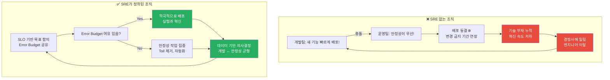
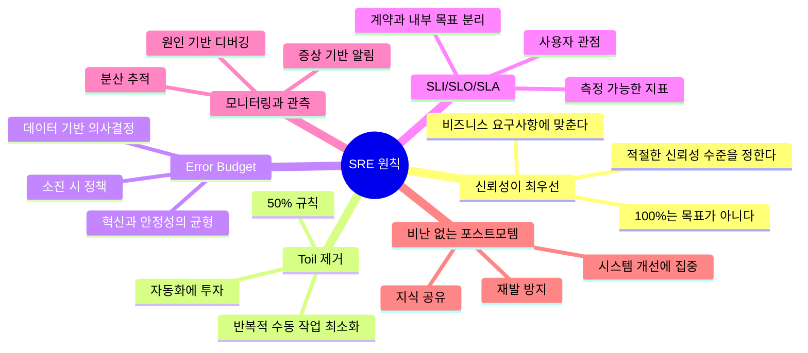
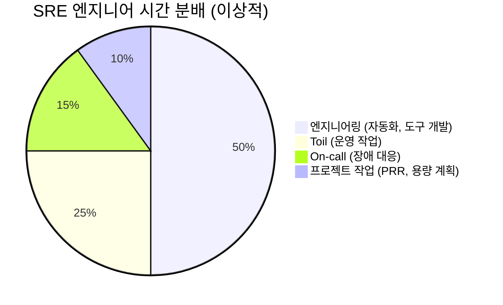
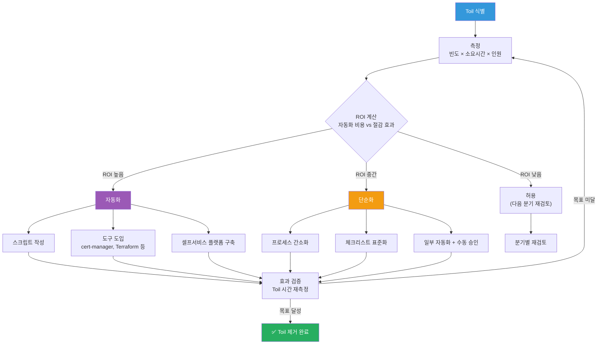
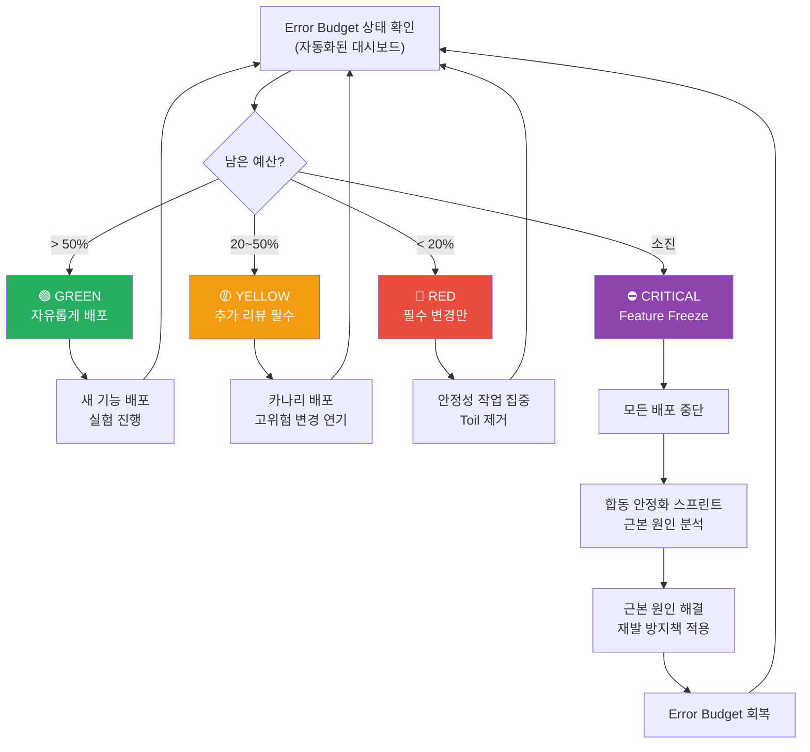
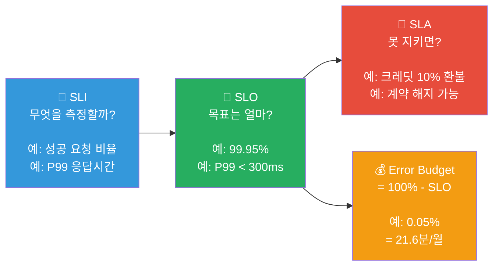
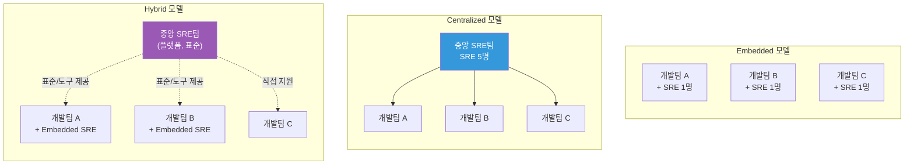

# SRE 원칙 — 신뢰성을 엔지니어링하는 방법

> 소프트웨어 엔지니어가 운영 문제를 풀면 어떻게 될까요? Google은 이 질문에서 출발해 **Site Reliability Engineering(SRE)**이라는 분야를 만들었어요. "서비스를 안정적으로 운영하는 것"을 감(感)이 아닌 **공학적 원칙과 데이터**로 접근하는 방법론이에요. [Observability](../08-observability/01-concept)에서 "시스템의 상태를 어떻게 관측하는지" 배웠고, [Alerting](../08-observability/11-alerting)에서 "문제를 어떻게 감지하는지" 배웠다면, 이제는 **"신뢰성이란 무엇이고, 어떻게 체계적으로 관리하는지"** 전체 그림을 잡아볼 차례예요.

---

## 🎯 왜 SRE 원칙을 알아야 하나요?

### 일상 비유: 병원 응급실 시스템

큰 병원의 응급실 운영을 떠올려보세요.

- **의사(개발자)**: 환자를 치료하고, 새로운 치료법을 연구해요
- **응급실 운영 시스템(SRE)**: 의사가 환자를 잘 치료할 수 있도록 환경을 관리해요
  - 응급 환자가 오면 **중증도 분류(Triage)**를 해요 → SLI/SLO로 서비스 상태 분류
  - 의료 장비가 제대로 작동하는지 **정기 점검**해요 → Production Readiness Review
  - 의료 사고가 발생하면 **원인을 분석하되 의사를 비난하지 않아요** → Blameless Post-Mortem
  - 수술실 청소 같은 **반복 작업을 자동화**해요 → Toil 제거
  - 응급실 수용 가능 인원에는 **한계가 있어요** → Error Budget

만약 이런 시스템 없이 의사 개인의 역량에만 의존한다면?

- 장비 고장 시 대응이 늦어져요
- 같은 의료 사고가 반복돼요
- 의사가 수술 외의 잡무에 시간을 빼앗겨요
- 환자가 몰리면 시스템이 붕괴돼요

**SRE가 바로 이 "응급실 운영 시스템"이에요.**

```
실무에서 SRE 원칙이 필요한 순간:

• "배포할 때마다 장애가 나서 팀이 배포를 두려워해요"         → Error Budget 정책 부재
• "서비스가 느린데 '느리다'의 기준이 사람마다 달라요"        → SLI/SLO 미정의
• "장애 때마다 범인 찾기 분위기라 솔직한 보고가 안 돼요"    → Blameless 문화 부재
• "운영팀이 반복 작업에 치여서 개선할 시간이 없어요"        → Toil 관리 미흡
• "개발팀은 빨리 배포하고 싶고, 운영팀은 안정성을 원해요"   → SRE 없는 조직 구조
• "99.99% 가용성 목표인데 근거가 뭔지 아무도 몰라요"       → SLO/SLA 혼동
• "새 서비스를 프로덕션에 올렸는데 모니터링이 하나도 없어요" → PRR(Production Readiness Review) 부재
```

### SRE 없는 조직 vs SRE가 정착된 조직



---

## 🧠 핵심 개념 잡기

### 1. SRE란 무엇인가?

> **비유**: 건물의 시설관리팀 + 건축 구조 엔지니어

SRE(Site Reliability Engineering)는 Google이 2003년에 Ben Treynor Sloss가 창시한 분야예요. 한 문장으로 정리하면:

> **"소프트웨어 엔지니어에게 운영 업무를 맡기면 생기는 결과물"**
> — Ben Treynor Sloss, Google VP of Engineering

핵심 아이디어는 단순해요. 운영(Operations) 문제를 **소프트웨어 엔지니어링**으로 해결하는 거예요.

| 전통적 운영 (Ops) | SRE 방식 |
|-------------------|----------|
| 수동으로 서버 관리 | 자동화 코드로 관리 |
| "장애 안 나게 조심하자" | "Error Budget 안에서 리스크를 감수하자" |
| 장애 → 범인 찾기 | 장애 → 시스템 개선점 찾기 |
| 변경 = 위험 | 변경 = 관리 가능한 리스크 |
| 감으로 판단 | SLI/SLO 데이터로 판단 |
| 반복 작업 = 당연한 것 | 반복 작업(Toil) = 제거 대상 |

### 2. SRE의 핵심 원칙 한눈에 보기



### 3. SRE vs DevOps vs Platform Engineering

이 세 가지는 자주 혼동돼요. 핵심 차이를 짚어볼게요.

| 구분 | DevOps | SRE | Platform Engineering |
|------|--------|-----|---------------------|
| **정의** | 개발과 운영의 문화적 통합 | 신뢰성을 공학적으로 관리 | 개발자를 위한 내부 플랫폼 구축 |
| **초점** | 협업 문화, CI/CD 파이프라인 | 신뢰성, SLO, Error Budget | 셀프서비스 플랫폼, 개발자 경험 |
| **핵심 질문** | "어떻게 더 빨리 배포할까?" | "얼마나 안정적이어야 할까?" | "어떻게 개발자가 쉽게 쓸까?" |
| **산출물** | CI/CD 파이프라인, IaC | SLO 대시보드, Error Budget 정책 | Internal Developer Platform |
| **비유** | 건설현장의 협업 문화 | 건물의 구조 안전 기준 | 건설자재 표준화 공장 |
| **측정 지표** | 배포 빈도, Lead Time | SLO 달성률, MTTR | 플랫폼 채택률, 개발자 만족도 |

> **핵심 관계**: DevOps는 **문화와 철학**이고, SRE는 DevOps를 **구체적으로 구현하는 방법론** 중 하나예요. Platform Engineering은 SRE와 DevOps의 경험을 **제품화**하는 거예요.

```
Google의 표현:
"class SRE implements interface DevOps"

→ SRE는 DevOps 인터페이스를 구현한 구체적인 클래스예요.
→ DevOps가 "무엇을(What)" 정의한다면, SRE는 "어떻게(How)"를 정의해요.
```

### 4. SRE의 핵심 용어 미리보기

| 용어 | 한줄 설명 | 비유 |
|------|----------|------|
| **SLI** (Service Level Indicator) | 서비스 품질을 측정하는 지표 | 체온계의 온도 |
| **SLO** (Service Level Objective) | SLI의 목표값 | "체온 36~37도 유지" |
| **SLA** (Service Level Agreement) | SLO + 위반 시 보상 조건 | 건강보험 약관 |
| **Error Budget** | 허용 가능한 장애 예산 | 월 용돈 |
| **Toil** | 자동화 가능한 반복 수동 작업 | 매일 수동으로 하는 설거지 |
| **Post-Mortem** | 장애 후 원인 분석 문서 | 항공 사고 조사 보고서 |
| **PRR** | 프로덕션 투입 전 준비 상태 점검 | 비행 전 안전 점검 |

---

## 🔍 하나씩 자세히 알아보기

### 1. SRE 정의 깊이 파기 (Google SRE Book)

Google의 SRE 책에서 정의하는 핵심 원칙들을 하나씩 살펴볼게요.

#### 원칙 1: 100% 신뢰성은 잘못된 목표다

이건 SRE에서 가장 중요한 통찰이에요.

```
왜 99.999%가 100%보다 나은 목표일까요?

사용자 경험 관점에서 생각해보세요:

• 서비스 가용성: 99.99% → 연간 52분 다운타임
• 사용자의 ISP 가용성: 99.9% → 연간 8.7시간 다운타임
• 사용자의 WiFi: 99% → 연간 3.6일 다운타임

→ 서비스가 99.999%여도, 사용자의 네트워크가 99%라면
   사용자가 체감하는 가용성은 최대 99%예요!

100%를 목표로 삼으면:
❌ 어떤 변경도 할 수 없어요 (변경 = 리스크)
❌ 비용이 기하급수적으로 증가해요
❌ 혁신 속도가 0에 수렴해요

적절한 신뢰성을 목표로 삼으면:
✅ Error Budget 안에서 실험할 수 있어요
✅ 비용과 신뢰성의 균형을 맞출 수 있어요
✅ 데이터 기반으로 의사결정해요
```

#### 원칙 2: SRE 엔지니어의 시간 분배 — 50% 규칙

Google SRE의 핵심 규칙 중 하나예요:

> **SRE 엔지니어의 업무 시간 중 최대 50%만 운영 작업(Ops work)에 사용하고, 나머지 50% 이상은 엔지니어링 작업에 사용해야 한다.**



만약 Toil이 50%를 넘으면?

1. 팀이 소진(Burnout)돼요
2. 자동화할 시간이 없어서 Toil이 더 늘어나요
3. 악순환에 빠져요

이때 Google에서는 **운영 작업의 일부를 개발팀에 돌려보내요.** 그래야 개발팀도 운영의 고통을 체감하고, 운영하기 쉬운 소프트웨어를 만들게 돼요.

#### 원칙 3: 엔지니어링으로 문제를 해결한다

| 전통적 운영 접근 | SRE 엔지니어링 접근 |
|-----------------|-------------------|
| 매번 수동 배포 | 자동화된 배포 파이프라인 |
| 장애 시 수동 복구 | 자동 복구(Self-healing) |
| 용량 부족 시 수동 스케일링 | 자동 스케일링 + 용량 계획 |
| 설정 변경을 직접 적용 | 코드로 관리(IaC), 리뷰 프로세스 |
| 경험에 의존한 판단 | 데이터(SLI/SLO)에 기반한 판단 |

---

### 2. Toil — 제거해야 할 반복 작업

#### Toil이란?

> **비유**: 식당에서 손님이 올 때마다 수동으로 불을 켜는 것

Toil은 다음 **모든 조건**을 만족하는 작업이에요:

| Toil의 특성 | 설명 | 예시 |
|-------------|------|------|
| **수동적(Manual)** | 사람이 직접 해야 함 | SSH 접속해서 로그 확인 |
| **반복적(Repetitive)** | 같은 작업이 계속 반복됨 | 매주 인증서 갱신 |
| **자동화 가능(Automatable)** | 기계가 대신할 수 있음 | 스크립트로 대체 가능 |
| **전술적(Tactical)** | 장기 전략이 아닌 즉각 대응 | 알림 오면 서버 재시작 |
| **비성장적(No lasting value)** | 서비스를 더 좋게 만들지 않음 | 디스크 정리 |
| **서비스 성장에 비례(O(n))** | 서비스가 커지면 작업도 늘어남 | 서버 추가 시 수동 설정 |

#### Toil vs Not Toil — 구분하기

```
✅ Toil인 것:
• 매일 아침 수동으로 배치 작업 실행
• 새 서버마다 SSH로 접속해서 에이전트 설치
• 알림 오면 서버 재시작
• 수동으로 SSL 인증서 갱신
• 매주 리포트 데이터를 수동 집계
• 새 팀원에게 권한을 하나하나 수동 설정

❌ Toil이 아닌 것:
• 장애 대응 중 원인 분석 (창의적 사고 필요)
• 새로운 서비스 아키텍처 설계 (전략적 작업)
• On-call 교대 (필요하지만 Toil은 아님)
• 코드 리뷰 (가치 있는 엔지니어링 작업)
• 포스트모템 작성 (학습과 개선)
• 자동화 도구 개발 (Toil을 줄이는 작업)
```

#### Toil 측정 방법

Toil을 줄이려면 먼저 **측정**해야 해요.

```yaml
# Toil 측정 시트 예시
toil_tracking:
  task: "수동 인증서 갱신"
  frequency: "월 1회"
  duration_per_occurrence: "30분"
  monthly_total: "30분"
  affected_engineers: 2
  total_monthly_cost: "1시간"
  automation_effort: "2일 (cert-manager 도입)"
  roi_breakeven: "2개월"
  priority: "HIGH"

  task: "디스크 용량 부족 대응"
  frequency: "주 2회"
  duration_per_occurrence: "15분"
  monthly_total: "2시간"
  affected_engineers: 3
  total_monthly_cost: "6시간"
  automation_effort: "1일 (자동 정리 + 알림 임계값 조정)"
  roi_breakeven: "1주"
  priority: "CRITICAL"
```

#### Toil 제거 전략



---

### 3. Error Budget — 혁신과 안정성의 균형추

#### Error Budget이란?

> **비유**: 월 용돈

여러분이 한 달에 30만 원 용돈을 받는다고 상상해보세요.

- 30만 원을 아예 안 쓰면? → 아무것도 못 해요 (100% 가용성 = 혁신 불가)
- 30만 원을 다 쓰면? → 이번 달은 끝이에요 (Error Budget 소진 = 배포 중단)
- 적당히 쓰면? → 필요한 것도 사고, 저축도 해요 (균형 잡힌 운영)

**Error Budget = 100% - SLO**

```
SLO가 99.9%라면:
Error Budget = 100% - 99.9% = 0.1%

한 달(30일) 기준:
0.1% × 30일 × 24시간 × 60분 = 43.2분

→ 한 달에 총 43.2분까지는 서비스가 다운되어도 괜찮아요!
→ 이 43.2분이 여러분의 "용돈"이에요.
```

#### Error Budget의 사용처

```
Error Budget으로 할 수 있는 것들:

🚀 새로운 기능 배포
   → 배포 과정에서 발생하는 짧은 다운타임

🧪 실험 (카나리 배포, A/B 테스트)
   → 새 버전에서 발생할 수 있는 에러

🔧 계획된 유지보수
   → DB 마이그레이션, 인프라 업그레이드

📦 의존성 업데이트
   → 라이브러리/프레임워크 버전 업

🏗️ 아키텍처 변경
   → 마이크로서비스 분리, 데이터베이스 교체
```

#### Error Budget 정책

Error Budget 정책은 "예산이 얼마나 남았느냐"에 따라 **팀의 행동을 자동으로 결정**하는 규칙이에요.

```yaml
# Error Budget 정책 예시
error_budget_policy:
  service: "payment-api"
  slo: 99.95%
  measurement_window: "30일 롤링"

  thresholds:
    # 예산 충분 — 공격적 혁신 모드
    - level: "GREEN"
      condition: "Error Budget > 50% 남음"
      actions:
        - "새 기능 배포 자유롭게 진행"
        - "실험적 변경 허용"
        - "카나리 배포 비율 확대 가능"

    # 예산 주의 — 신중한 모드
    - level: "YELLOW"
      condition: "Error Budget 20~50% 남음"
      actions:
        - "변경 사항에 대한 추가 리뷰 필수"
        - "카나리 배포 비율 축소"
        - "고위험 변경 연기"
        - "Toil 제거 작업 우선순위 상향"

    # 예산 위험 — 안정성 집중 모드
    - level: "RED"
      condition: "Error Budget < 20% 남음"
      actions:
        - "필수 보안 패치 외 배포 중단"
        - "안정성 개선 작업만 진행"
        - "장애 원인 집중 분석"
        - "자동화 및 회복성 강화에 집중"

    # 예산 소진 — 비상 모드
    - level: "CRITICAL"
      condition: "Error Budget 소진"
      actions:
        - "모든 배포 즉시 중단 (Feature Freeze)"
        - "경영진 에스컬레이션"
        - "SRE + 개발팀 합동 안정화 스프린트"
        - "근본 원인 분석 및 장기 대책 수립"
```

#### Error Budget 소진 시 행동 흐름



---

### 4. SLI / SLO / SLA — 신뢰성을 수치로 표현하기

이 세 가지는 SRE의 핵심 도구예요. 순서대로 알아볼게요.

#### SLI (Service Level Indicator) — 무엇을 측정할 것인가

> **비유**: 체온계, 혈압계 같은 측정 도구

SLI는 서비스 품질을 **수치로 측정한 값**이에요. 중요한 건 **사용자 관점**에서 측정해야 한다는 거예요.

```
좋은 SLI의 조건:

✅ 사용자가 직접 체감하는 것
✅ 측정 가능한 수치
✅ 비율(0~100%)로 표현 가능
✅ 의미 있는 시간 범위에서 집계

나쁜 SLI:
❌ "서버 CPU 사용률" → 사용자는 CPU를 체감하지 못해요
❌ "서비스가 느리다" → 수치가 아님
❌ "에러가 많다" → 기준이 없음
```

**서비스 유형별 권장 SLI:**

| 서비스 유형 | SLI 종류 | 측정 방법 | 예시 |
|------------|---------|----------|------|
| **API 서비스** | 가용성(Availability) | 성공 요청 / 전체 요청 | 200 응답 비율 |
| **API 서비스** | 지연시간(Latency) | P50, P99 응답 시간 | P99 < 300ms 비율 |
| **데이터 파이프라인** | 신선도(Freshness) | 최신 처리 시각 | 10분 이내 처리 비율 |
| **데이터 파이프라인** | 정확성(Correctness) | 올바른 출력 / 전체 출력 | 정확한 결과 비율 |
| **스토리지** | 내구성(Durability) | 데이터 손실률 | 연간 손실 0건 |
| **스토리지** | 처리량(Throughput) | 초당 처리 바이트 | 목표 처리량 달성 비율 |

#### SLO (Service Level Objective) — 목표를 정한다

> **비유**: "체온을 36~37도 사이로 유지하겠다"는 건강 목표

SLO는 SLI에 대한 **목표값**이에요. "이 정도면 사용자가 만족할 거야"라는 기준이에요.

```
SLO 설정 예시:

서비스: payment-api
SLO 기간: 30일 롤링 윈도우

SLI: 가용성
  → SLO: 99.95% (30일간 요청의 99.95%가 성공)
  → Error Budget: 0.05% = 약 21.6분/월

SLI: 지연시간 (P99)
  → SLO: 99% (요청의 99%가 300ms 이내 응답)
  → 나머지 1%는 300ms를 초과해도 괜찮음

SLI: 지연시간 (P50)
  → SLO: 99.9% (요청의 99.9%가 100ms 이내 응답)
  → 절반 이상의 요청은 빠르게 응답해야 함
```

**SLO 설정 시 주의사항:**

```
SLO를 너무 높게 잡으면:
❌ Error Budget이 거의 없어서 아무것도 못 함
❌ 달성 불가능해서 팀 사기 저하
❌ 비용이 기하급수적 증가

SLO를 너무 낮게 잡으면:
❌ 사용자가 불만족
❌ Error Budget이 너무 많아서 의미 없음
❌ 품질 관리 효과 없음

적절한 SLO 설정 과정:
1. 현재 실제 성능 측정 (4주간)
2. 사용자 기대치 파악 (피드백, 설문)
3. 비즈니스 요구사항 확인 (계약, 경쟁사)
4. 현재 성능보다 약간 낮은 수준에서 시작
5. 점진적으로 조정
```

#### SLA (Service Level Agreement) — 계약으로 약속한다

> **비유**: 건강보험 약관 — "이 조건을 지키지 못하면 보상합니다"

SLA는 SLO에 **법적/상업적 결과**가 붙은 거예요.

```
SLO vs SLA 핵심 차이:

SLO (내부 목표):
  "우리 서비스 가용성을 99.95%로 유지하자"
  → 못 지키면? 팀 내부에서 Error Budget 정책 발동
  → 외부 영향? 없음

SLA (외부 계약):
  "가용성 99.9%를 보장합니다. 미달 시 크레딧 환불"
  → 못 지키면? 고객에게 금전적 보상
  → 법적 구속력 있음

⚠️ 중요: SLO > SLA (내부 목표가 외부 약속보다 높아야 해요!)

이유: SLO를 지키면 SLA는 자동으로 지켜지거든요.
만약 SLO = SLA 라면, SLA 위반이 바로 금전적 손실이에요.

일반적으로:
  SLO: 99.95%  →  SLA: 99.9%  (버퍼 0.05%)
```

#### SLI → SLO → SLA 관계 정리



---

### 5. Blameless Post-Mortem — 비난 없는 사후 분석

#### 왜 "Blameless(비난 없는)"여야 할까?

> **비유**: 항공 사고 조사

비행기 사고가 나면, 조종사를 감옥에 보내는 게 아니라 **블랙박스를 분석**해요. 왜?

- 조종사를 처벌하면 → 다른 조종사들이 사고를 **숨겨요**
- 블랙박스를 분석하면 → **시스템 개선**으로 같은 사고를 **방지**해요

IT 장애도 마찬가지예요.

```
❌ Blame 문화:
  "누가 잘못된 배포를 했어?"
  → 엔지니어가 배포를 피하려 함
  → 문제를 숨기거나 늦게 보고
  → 같은 장애가 반복됨

✅ Blameless 문화:
  "어떤 시스템 조건에서 이런 결과가 발생했는가?"
  → 솔직한 정보 공유
  → 근본 원인 발견
  → 시스템 개선으로 재발 방지
```

#### Post-Mortem 작성 구조

```yaml
# Post-Mortem 템플릿
post_mortem:
  title: "2024-12-15 결제 서비스 장애"
  severity: "P1 (사용자 영향 있음)"
  duration: "14:32 ~ 15:17 (45분)"
  impact: "결제 실패율 30%, 약 1,200명의 사용자 영향"

  authors:
    - "담당 SRE 엔지니어"
    - "온콜 엔지니어"

  summary: |
    결제 서비스의 DB 커넥션 풀이 고갈되어 결제 요청이
    타임아웃으로 실패함. 직전 배포에서 DB 쿼리 최적화 없이
    새 기능이 추가되면서 커넥션 사용량이 3배 증가한 것이 원인.

  timeline:
    - time: "14:30"
      event: "v2.3.1 배포 완료"
    - time: "14:32"
      event: "Error rate 알림 발생 (Error Budget 소진 가속)"
    - time: "14:35"
      event: "온콜 엔지니어 알림 수신, 대시보드 확인"
    - time: "14:40"
      event: "DB 커넥션 풀 고갈 확인"
    - time: "14:45"
      event: "롤백 결정"
    - time: "14:55"
      event: "v2.3.0 롤백 완료"
    - time: "15:17"
      event: "Error rate 정상 복귀 확인"

  root_cause: |
    새 결제 기능에서 N+1 쿼리 문제가 있었음.
    결제 1건당 DB 쿼리가 3개에서 15개로 증가.
    부하 테스트가 새 기능을 포함하지 않았음.

  # 여기가 핵심! "누가"가 아니라 "무엇이" "왜"
  contributing_factors:
    - "부하 테스트 시나리오에 새 기능 미포함"
    - "DB 커넥션 풀 모니터링 알림 임계값이 너무 높았음"
    - "카나리 배포 비율이 낮아 문제 조기 발견 실패"
    - "코드 리뷰에서 쿼리 성능 검토가 누락됨"

  action_items:
    - action: "부하 테스트에 신규 기능 시나리오 추가"
      owner: "QA팀"
      priority: "P1"
      deadline: "2024-12-22"

    - action: "DB 커넥션 풀 알림 임계값 70%로 조정"
      owner: "SRE팀"
      priority: "P1"
      deadline: "2024-12-17"

    - action: "코드 리뷰 체크리스트에 쿼리 성능 항목 추가"
      owner: "개발팀 리드"
      priority: "P2"
      deadline: "2024-12-29"

    - action: "카나리 배포 트래픽 비율 5% → 15%로 상향"
      owner: "SRE팀"
      priority: "P2"
      deadline: "2024-12-22"

  lessons_learned:
    - "N+1 쿼리는 소량 트래픽에서는 드러나지 않음 → 부하 테스트 필수"
    - "커넥션 풀 모니터링은 사용률 70%부터 경고 필요"
    - "카나리 배포 비율이 너무 낮으면 문제 감지가 늦어짐"

  # ⚠️ 중요: "사람의 실수"가 아닌 "시스템의 빈틈"에 집중
  what_went_well:
    - "알림이 2분 만에 발생해서 빠르게 인지함"
    - "롤백 프로세스가 자동화되어 10분 만에 완료됨"
    - "온콜 엔지니어가 Runbook을 즉시 참조할 수 있었음"
```

---

### 6. Production Readiness Review (PRR)

> **비유**: 비행기 이륙 전 안전 점검 체크리스트

새로운 서비스를 프로덕션에 올리기 전에, **"이 서비스가 프로덕션에서 안정적으로 운영될 준비가 됐는가?"**를 체계적으로 검토하는 프로세스예요.

```yaml
# Production Readiness Review 체크리스트
prr_checklist:
  # 1. 관측 가능성 (Observability)
  observability:
    - "SLI가 정의되어 있는가?"
    - "SLO가 합의되었는가?"
    - "메트릭이 수집되고 있는가? (RED/USE 방법론)"
    - "대시보드가 구축되었는가?"
    - "구조화된 로깅이 적용되었는가?"
    - "분산 트레이싱이 설정되었는가?"
    - "알림 규칙이 설정되었는가?"
    # 참고: ../08-observability/ 시리즈

  # 2. 장애 대응 (Incident Response)
  incident_response:
    - "온콜 로테이션이 설정되어 있는가?"
    - "에스컬레이션 경로가 명확한가?"
    - "Runbook이 작성되어 있는가?"
    - "롤백 절차가 문서화되어 있는가?"
    - "장애 커뮤니케이션 채널이 있는가?"
    # 참고: ../09-security/07-incident-response.md

  # 3. 용량 계획 (Capacity Planning)
  capacity:
    - "현재 트래픽 패턴이 파악되어 있는가?"
    - "예상 성장률이 계산되어 있는가?"
    - "오토스케일링이 설정되어 있는가?"
    - "부하 테스트가 수행되었는가?"
    - "리소스 한계치를 알고 있는가?"

  # 4. 변경 관리 (Change Management)
  change_management:
    - "배포 파이프라인이 자동화되어 있는가?"
    - "카나리/블루-그린 배포가 가능한가?"
    - "롤백이 자동화되어 있는가?"
    - "기능 플래그(Feature Flag)를 사용하는가?"
    - "설정 변경이 코드로 관리되는가?"

  # 5. 보안 (Security)
  security:
    - "인증/인가가 적용되어 있는가?"
    - "시크릿이 안전하게 관리되는가?"
    - "취약점 스캔이 CI에 포함되어 있는가?"
    - "네트워크 정책이 적용되어 있는가?"

  # 6. 의존성 (Dependencies)
  dependencies:
    - "외부 의존성이 문서화되어 있는가?"
    - "의존성 장애 시 fallback이 있는가?"
    - "서킷 브레이커가 적용되어 있는가?"
    - "타임아웃이 적절히 설정되어 있는가?"
```

---

### 7. SRE 팀 구조

SRE 팀을 조직하는 방식은 크게 세 가지예요.

#### Embedded SRE vs Centralized SRE vs Hybrid

| 모델 | 설명 | 장점 | 단점 |
|------|------|------|------|
| **Embedded** | 각 개발팀에 SRE가 소속 | 도메인 이해도 높음, 빠른 대응 | SRE 간 지식 공유 어려움 |
| **Centralized** | 별도 SRE 팀이 전체 서비스 담당 | 일관된 표준, 전문성 집중 | 도메인 이해도 낮을 수 있음 |
| **Hybrid** | 중앙 SRE팀 + 각 팀에 SRE 임베드 | 균형 잡힌 접근 | 조직 복잡도 증가 |



**조직 규모별 권장 모델:**

```
스타트업 (엔지니어 < 20명):
  → 별도 SRE 팀 필요 없음
  → 개발자 전원이 SRE 원칙을 적용
  → On-call도 개발자가 로테이션

성장기 (엔지니어 20~100명):
  → Embedded 모델 시작
  → 핵심 서비스에 SRE 역할을 가진 엔지니어 배치
  → SRE 프랙티스를 점진적으로 도입

대규모 (엔지니어 100명+):
  → Hybrid 모델 권장
  → 중앙 SRE팀: 플랫폼, 도구, 표준 관리
  → Embedded SRE: 핵심 서비스에 배치
  → 비핵심 서비스: 중앙 SRE팀이 자문 역할
```

---

### 8. Reliability 엔지니어링 문화

SRE는 도구나 프로세스만으로 완성되지 않아요. **문화**가 핵심이에요.

#### SRE 문화의 4가지 기둥

```
1. 데이터 기반 의사결정 (Data-Driven)
   ─────────────────────
   "느낌상 서비스가 느려요" → ❌
   "P99 응답시간이 지난주 대비 40% 증가했어요" → ✅

   모든 판단은 SLI/SLO 데이터에 기반해요.

2. 비난 없는 문화 (Blameless)
   ─────────────────────
   "누가 이 코드를 배포했어?" → ❌
   "어떤 시스템 조건에서 이 문제가 발생했는가?" → ✅

   사람이 아닌 시스템을 개선해요.

3. 공유 소유권 (Shared Ownership)
   ─────────────────────
   "그건 운영팀 일이잖아요" → ❌
   "우리가 만든 서비스니까 함께 책임져요" → ✅

   개발팀과 SRE가 서비스의 신뢰성을 공동으로 책임져요.

4. 지속적 개선 (Continuous Improvement)
   ─────────────────────
   "장애 났으니 다시는 안 그러면 돼" → ❌
   "이번 장애에서 3가지를 배웠고, 2주 안에 개선해요" → ✅

   Post-Mortem의 Action Item을 실제로 수행해요.
```

---

### 9. SRE Practices Overview — 전체 그림

SRE의 주요 프랙티스를 전체적으로 조망해볼게요.

```mermaid
flowchart TD
    SRE["🏗️ SRE Practices"]

    SRE --> MEASURE["📏 측정"]
    SRE --> RESPOND["🚨 대응"]
    SRE --> PREVENT["🛡️ 예방"]
    SRE --> IMPROVE["🔄 개선"]

    MEASURE --> M1["SLI/SLO 정의"]
    MEASURE --> M2["Error Budget 추적"]
    MEASURE --> M3["Toil 측정"]
    MEASURE --> M4["용량 계획"]

    RESPOND --> R1["On-call 체계"]
    RESPOND --> R2["Incident Management"]
    RESPOND --> R3["Runbook 관리"]
    RESPOND --> R4["에스컬레이션"]

    PREVENT --> P1["PRR"]
    PREVENT --> P2["Chaos Engineering"]
    PREVENT --> P3["부하 테스트"]
    PREVENT --> P4["보안 리뷰"]

    IMPROVE --> I1["Blameless Post-Mortem"]
    IMPROVE --> I2["Toil 제거 자동화"]
    IMPROVE --> I3["아키텍처 개선"]
    IMPROVE --> I4["프로세스 개선"]

    style SRE fill:#2c3e50,color:#fff
    style MEASURE fill:#3498db,color:#fff
    style RESPOND fill:#e74c3c,color:#fff
    style PREVENT fill:#27ae60,color:#fff
    style IMPROVE fill:#f39c12,color:#fff
```



| 영역 | 프랙티스 | 설명 | 이 시리즈 참고 |
|------|---------|------|--------------|
| 측정 | SLI/SLO/SLA | 신뢰성 목표 정의 | [다음 강의](./02-sli-slo) |
| 측정 | Error Budget | 혁신과 안정성 균형 | 이 강의 |
| 측정 | Toil 측정 | 반복 작업 추적 | 이 강의 |
| 대응 | On-call | 장애 대응 로테이션 | [Alerting](../08-observability/11-alerting) |
| 대응 | Incident Mgmt | 장애 관리 프로세스 | [Incident Response](../09-security/07-incident-response) |
| 예방 | PRR | 프로덕션 준비 상태 점검 | 이 강의 |
| 예방 | Chaos Engineering | 의도적 장애 주입 | 추후 강의 |
| 개선 | Post-Mortem | 비난 없는 사후 분석 | 이 강의 |
| 개선 | 자동화 | Toil 제거 | 이 강의 |

---

## 💻 직접 해보기

### 실습 1: SLI/SLO 정의하기

여러분이 운영하는 서비스의 SLI/SLO를 직접 정의해 보세요.

```yaml
# 실습: 쇼핑몰 서비스의 SLI/SLO 정의
# 아래 템플릿을 복사해서 여러분의 서비스에 맞게 수정해보세요

service:
  name: "shopping-api"
  description: "쇼핑몰 상품 조회 및 주문 API"
  owner: "commerce-team"
  tier: "Tier 1 (핵심 서비스)"

slis:
  # SLI 1: 가용성
  - name: "availability"
    description: "성공적으로 처리된 요청의 비율"
    formula: "count(http_status < 500) / count(total_requests)"
    measurement_point: "로드밸런서 접근 로그"
    good_event: "HTTP 5xx가 아닌 모든 응답"
    valid_event: "모든 HTTP 요청"

  # SLI 2: 지연시간
  - name: "latency"
    description: "요청 응답 시간이 기준치 이내인 비율"
    formula: "count(response_time < 300ms) / count(total_requests)"
    measurement_point: "서버 사이드 측정 (미들웨어)"
    good_event: "300ms 이내 응답"
    valid_event: "모든 HTTP 요청 (헬스체크 제외)"

slos:
  - sli: "availability"
    target: 99.95%
    window: "30일 롤링"
    error_budget: "0.05% = 약 21.6분/월"

  - sli: "latency"
    target: 99.0%
    window: "30일 롤링"
    error_budget: "1% = 요청의 1%는 느려도 허용"

error_budget_policy:
  green: "> 50% 남음 → 자유롭게 배포"
  yellow: "20-50% → 추가 리뷰 필수"
  red: "< 20% → 안정성 작업만"
  critical: "소진 → Feature Freeze"
```

### 실습 2: Toil 식별 및 측정

현재 팀에서 수행하고 있는 운영 작업을 Toil 관점에서 분류해보세요.

```yaml
# 실습: Toil 식별 시트
# 팀에서 수행하는 운영 작업을 나열하고 분류해보세요

toil_assessment:
  team: "platform-team"
  assessment_date: "2024-12-15"
  assessment_period: "최근 4주"

  tasks:
    - name: "SSL 인증서 수동 갱신"
      is_toil: true
      frequency: "월 1회"
      time_per_occurrence: "30분"
      monthly_hours: 0.5
      toil_characteristics:
        manual: true          # 사람이 직접 해야 함
        repetitive: true      # 매번 같은 작업
        automatable: true     # 자동화 가능 (cert-manager)
        tactical: true        # 전략적 가치 없음
        no_lasting_value: true # 서비스를 개선하지 않음
        scales_with_service: true  # 인증서가 많아지면 작업도 늘어남
      automation_plan: "cert-manager 도입 (예상 2일)"
      priority: "HIGH"

    - name: "장애 원인 분석"
      is_toil: false
      reason: "창의적 사고가 필요하고, 매번 다른 상황이며, 서비스 개선에 기여함"

    - name: "매일 아침 로그 확인"
      is_toil: true
      frequency: "일 1회"
      time_per_occurrence: "20분"
      monthly_hours: 6.7
      automation_plan: "로그 기반 알림 설정 + 이상 탐지 (예상 3일)"
      priority: "CRITICAL"

    # 여러분의 작업을 추가해보세요!
    - name: "_______________"
      is_toil: _____
      frequency: "___"
      time_per_occurrence: "___"
      automation_plan: "___"

  summary:
    total_tasks_assessed: 3
    toil_tasks: 2
    total_monthly_toil_hours: 7.2
    toil_percentage: "___% (전체 업무 시간 대비)"
    # 목표: 50% 미만으로 유지!
```

### 실습 3: Error Budget 계산기

```python
# error_budget_calculator.py
# 실행: python error_budget_calculator.py

def calculate_error_budget(slo_percent, window_days=30):
    """SLO에서 Error Budget을 계산해요."""

    error_budget_percent = 100 - slo_percent
    total_minutes = window_days * 24 * 60
    error_budget_minutes = total_minutes * (error_budget_percent / 100)

    print(f"{'=' * 50}")
    print(f"  Error Budget Calculator")
    print(f"{'=' * 50}")
    print(f"  SLO:            {slo_percent}%")
    print(f"  측정 기간:       {window_days}일")
    print(f"  Error Budget:   {error_budget_percent}%")
    print(f"  허용 다운타임:   {error_budget_minutes:.1f}분")
    print(f"                  ({error_budget_minutes/60:.1f}시간)")
    print(f"{'=' * 50}")

    return error_budget_minutes

def check_budget_status(slo_percent, actual_downtime_minutes, window_days=30):
    """현재 Error Budget 소진 상태를 확인해요."""

    budget = calculate_error_budget(slo_percent, window_days)
    remaining = budget - actual_downtime_minutes
    remaining_percent = (remaining / budget) * 100 if budget > 0 else 0

    print(f"\n  실제 다운타임:   {actual_downtime_minutes}분")
    print(f"  남은 예산:       {remaining:.1f}분 ({remaining_percent:.1f}%)")

    if remaining_percent > 50:
        status = "GREEN - 자유롭게 배포하세요!"
    elif remaining_percent > 20:
        status = "YELLOW - 추가 리뷰가 필요해요"
    elif remaining_percent > 0:
        status = "RED - 안정성 작업에 집중하세요"
    else:
        status = "CRITICAL - Feature Freeze! 모든 배포를 중단하세요"

    print(f"  상태:            {status}")
    print(f"{'=' * 50}")

# 직접 값을 바꿔보세요!
print("\n--- 예시 1: 결제 서비스 ---")
check_budget_status(
    slo_percent=99.95,
    actual_downtime_minutes=10,
    window_days=30
)

print("\n--- 예시 2: 관리자 페이지 ---")
check_budget_status(
    slo_percent=99.5,
    actual_downtime_minutes=200,
    window_days=30
)

print("\n--- 예시 3: 핵심 API ---")
check_budget_status(
    slo_percent=99.99,
    actual_downtime_minutes=4,
    window_days=30
)
```

### 실습 4: Blameless Post-Mortem 작성 연습

아래 가상 장애 시나리오를 읽고, Post-Mortem을 작성해보세요.

```
📋 장애 시나리오:

날짜: 2024-12-10 (화요일)
시간: 오후 2시 ~ 오후 3시 30분
서비스: 사용자 인증 서비스 (auth-service)
영향: 모든 사용자가 로그인 불가

사건 경위:
  14:00 - 개발자 A가 Redis 캐시 설정을 변경하는 코드를 배포함
  14:05 - Redis 커넥션 에러 로그 급증 (하지만 알림 설정이 안 되어 있었음)
  14:30 - 고객 지원팀에 "로그인이 안 된다" 문의 급증
  14:35 - 고객 지원팀이 개발팀 슬랙 채널에 보고
  14:40 - 온콜 엔지니어가 확인 시작
  14:50 - Redis 커넥션 설정 오류 발견
  15:00 - 코드 롤백 시작 (수동 롤백)
  15:20 - 롤백 완료
  15:30 - 서비스 정상 복귀 확인

여러분이 작성할 Post-Mortem:
  1. 타임라인을 정리하세요
  2. 근본 원인(Root Cause)을 식별하세요
  3. 기여 요인(Contributing Factors)을 나열하세요 — 사람이 아닌 시스템!
  4. 잘한 점(What Went Well)을 적으세요
  5. 개선 조치(Action Items)를 우선순위와 함께 적으세요
```

```yaml
# 여러분의 Post-Mortem을 여기에 작성해보세요!

post_mortem:
  title: "2024-12-10 인증 서비스 장애"
  severity: "___"
  duration: "___"
  impact: "___"

  timeline:
    - time: "14:00"
      event: "___"
    # 계속 작성해보세요...

  root_cause: |
    ___

  contributing_factors:
    - "___"
    - "___"
    - "___"

  what_went_well:
    - "___"

  action_items:
    - action: "___"
      owner: "___"
      priority: "___"
      deadline: "___"
```

### 실습 5: PRR 체크리스트 적용

여러분의 서비스에 PRR 체크리스트를 적용해보세요.

```yaml
# 실습: 여러분의 서비스에 PRR 수행하기
# 각 항목을 평가하고, 부족한 부분에 대한 개선 계획을 세워보세요

prr_assessment:
  service: "my-service"
  date: "2024-12-15"
  reviewer: "___"

  categories:
    observability:
      - item: "SLI가 정의되어 있는가?"
        status: "YES / NO / PARTIAL"
        gap: "___"
        action: "___"

      - item: "대시보드가 구축되었는가?"
        status: "___"
        gap: "___"
        action: "___"

      - item: "알림이 설정되어 있는가?"
        status: "___"
        gap: "___"
        action: "___"

    incident_response:
      - item: "온콜 로테이션이 있는가?"
        status: "___"
        gap: "___"
        action: "___"

      - item: "Runbook이 있는가?"
        status: "___"
        gap: "___"
        action: "___"

    # 나머지 항목도 작성해보세요...

  overall_readiness: "READY / NOT READY / CONDITIONALLY READY"
  blocking_issues:
    - "___"
  target_resolution_date: "___"
```

---

## 🏢 실무에서는?

### 시나리오 1: "우리 회사에 SRE를 도입하고 싶어요"

```
상황:
  - 50명 규모의 개발 조직
  - 마이크로서비스 15개 운영 중
  - 장애가 월 2~3회 발생
  - 배포 후 장애 비율이 높음
  - 개발팀과 운영팀 사이에 갈등이 있음

단계적 도입 방법:

[1단계] 기반 마련 (1~2개월)
  ├─ 핵심 서비스 3개에 SLI/SLO 정의
  ├─ 기존 모니터링 데이터로 SLI 측정 시작
  ├─ Error Budget 대시보드 구축 (Grafana)
  └─ 팀 전체에 SRE 원칙 교육

[2단계] 프로세스 도입 (2~3개월)
  ├─ Error Budget 정책 합의 (개발팀 + 운영팀)
  ├─ Blameless Post-Mortem 프로세스 시작
  ├─ Toil 측정 시작 (주간 추적)
  ├─ On-call 로테이션 정비
  └─ PRR 체크리스트 작성

[3단계] 문화 정착 (3~6개월)
  ├─ SLO 기반으로 배포 의사결정
  ├─ Toil 제거 프로젝트 분기별 진행
  ├─ Post-Mortem 공유 문화 정착
  ├─ PRR을 프로덕션 배포 게이트로 적용
  └─ 나머지 서비스로 SLI/SLO 확대

[4단계] 성숙 (6개월+)
  ├─ Embedded SRE 또는 Hybrid 모델 도입
  ├─ Chaos Engineering 시작
  ├─ SLO 기반 자동 롤백
  ├─ Error Budget 기반 자동 배포 게이트
  └─ Platform Engineering으로 확장
```

### 시나리오 2: "Error Budget이 소진됐어요!"

```
상황:
  - 결제 서비스 SLO: 99.95%
  - 이번 달 30일 중 20일째에 Error Budget 소진
  - 원인: 지난주 배포 실패로 2시간 다운타임 발생

대응 프로세스:

1. 즉시 조치
   ├─ Feature Freeze 선언 (모든 기능 배포 중단)
   ├─ Slack/Email로 전체 팀에 공지
   └─ 경영진에 상황 보고

2. 원인 분석 (1~2일)
   ├─ Post-Mortem 작성 (장애 원인 분석)
   ├─ 근본 원인 식별
   └─ 기여 요인 나열

3. 안정화 스프린트 (1~2주)
   ├─ Action Item 수행 (근본 원인 해결)
   ├─ 안정성 개선 작업만 진행
   │   ├─ 자동 롤백 기능 추가
   │   ├─ 카나리 배포 비율 조정
   │   ├─ 모니터링 알림 강화
   │   └─ 부하 테스트 보강
   └─ Toil 제거 작업 병행

4. 복구 확인
   ├─ Error Budget이 다음 측정 기간에 리셋
   ├─ 개선 조치의 효과 확인
   └─ Feature Freeze 해제 조건 합의
```

### 시나리오 3: "개발팀이 SLO를 무시해요"

```
상황:
  - SLO를 정했는데 개발팀이 Error Budget을 신경 쓰지 않음
  - "빨리 배포하는 게 중요하지, SLO가 뭐가 중요해요?"

해결 방법:

1. Error Budget을 "공동 소유"로 만들기
   ├─ 개발팀 대시보드에 Error Budget 위젯 추가
   ├─ 매주 스탠드업에서 Error Budget 현황 공유
   └─ Error Budget 소진 시 개발팀도 안정화 작업 참여

2. 인센티브 설계
   ├─ SLO 달성률을 팀 OKR에 포함
   ├─ Error Budget 여유가 많으면 더 빠른 배포 허용
   └─ Error Budget 소진 시 배포 중단이 팀 전체에 적용

3. 데이터로 설득
   ├─ "지난 분기 장애로 인한 비용: 2,000만 원"
   ├─ "장애 때마다 개발 속도가 2주 늦어짐"
   └─ "SLO 도입 후 장애 복구 시간 70% 감소"

4. 경영진 지원 확보
   ├─ SLO 목표를 조직 전체 OKR로 올리기
   ├─ 장애 비용(수익 손실, 고객 이탈)을 정량화
   └─ CTO/VP급 스폰서 확보
```

### 시나리오 4: 다양한 가용성 수준 비교

실무에서 자주 만나는 가용성 수준과 그 의미를 비교해볼게요.

```
가용성 수준별 연간 허용 다운타임:

가용성      다운타임/년     다운타임/월     다운타임/주     적용 사례
─────────  ────────────  ────────────  ────────────  ──────────────
99%        3.65일         7.3시간        1.68시간       내부 도구, 배치 시스템
99.9%      8.77시간       43.8분         10.1분         일반 웹 서비스, B2B SaaS
99.95%     4.38시간       21.9분         5.0분          이커머스, 사용자 대면 API
99.99%     52.6분         4.4분          1.0분          결제 시스템, 금융 서비스
99.999%    5.26분         26초           6초            응급 서비스, 핵심 인프라

비용 곡선:
  99%    → 💰
  99.9%  → 💰💰
  99.95% → 💰💰💰
  99.99% → 💰💰💰💰💰💰💰
  99.999% → 💰💰💰💰💰💰💰💰💰💰💰💰💰

→ 9가 하나 추가될 때마다 비용은 약 10배 증가해요!
→ 비즈니스 요구에 맞는 "적절한" 수준을 선택하는 게 핵심이에요.
```

### 실무 팁: SRE 도입 시 흔한 안티패턴

```
안티패턴 1: "SRE 팀 = 새 이름의 운영팀"
  ❌ 기존 운영팀 이름만 SRE로 바꿈
  ❌ 하는 일은 여전히 수동 서버 관리
  ✅ SRE는 엔지니어링으로 운영 문제를 해결해야 해요

안티패턴 2: "SLO를 정했지만 아무도 안 봐요"
  ❌ SLO 대시보드를 만들었지만 확인하는 사람이 없음
  ❌ Error Budget 소진돼도 아무 일도 안 일어남
  ✅ Error Budget 정책이 실제 행동 변화로 이어져야 해요

안티패턴 3: "Post-Mortem은 쓰지만 Action Item은 안 해요"
  ❌ Post-Mortem 문서만 쌓이고 개선은 안 됨
  ❌ 같은 장애가 3개월 후 다시 발생
  ✅ Action Item을 티켓으로 만들고 추적해야 해요

안티패턴 4: "모든 서비스에 99.99% SLO"
  ❌ 비즈니스 중요도와 관계없이 일괄 높은 SLO
  ❌ Error Budget이 너무 적어서 아무것도 못 함
  ✅ 서비스 티어별로 차등 SLO를 적용해야 해요

안티패턴 5: "SRE가 모든 것을 책임져요"
  ❌ 장애 나면 SRE만 대응
  ❌ 개발팀은 "내 코드는 괜찮아"
  ✅ 공유 소유권 — 개발팀도 On-call과 Post-Mortem에 참여해야 해요
```

---

## ⚠️ 자주 하는 실수

### 실수 1: SLO를 너무 높게 잡는다

```
❌ 잘못된 예:
  "우리 서비스는 99.999% 가용성을 목표로 합니다!"

  → 월간 Error Budget: 26초
  → 배포 한 번 할 때마다 제로 다운타임이 보장되어야 함
  → 사실상 아무것도 변경할 수 없음
  → 비용은 천문학적으로 증가

✅ 올바른 접근:
  1. 현재 실제 성능을 4주간 측정
  2. 사용자 기대치와 비즈니스 요구사항 확인
  3. 현재 성능보다 약간 낮은 수준에서 SLO 시작
  4. 분기마다 재검토하며 점진적 조정

  예: 현재 실제 가용성이 99.97%라면 → SLO는 99.95%로 시작
```

### 실수 2: SLO와 SLA를 혼동한다

```
❌ 잘못된 예:
  SLO = SLA = 99.9%

  → SLO 달성 실패 = 즉시 금전적 손실
  → 안전 마진이 전혀 없음

✅ 올바른 접근:
  SLO: 99.95% (내부 목표, 더 엄격)
  SLA: 99.9%  (외부 약속, 버퍼 있음)

  → SLO를 지키면 SLA는 자동으로 지켜짐
  → SLO 위반 시에도 SLA 위반까지는 여유가 있음
```

### 실수 3: Toil을 모든 운영 작업으로 오해한다

```
❌ 잘못된 생각:
  "온콜도 Toil이고, 코드 리뷰도 Toil이고, 회의도 Toil이다"
  → 모든 걸 자동화하려다 정작 중요한 걸 놓침

✅ 올바른 이해:
  Toil은 6가지 조건을 모두 만족해야 해요:
  수동적 + 반복적 + 자동화 가능 + 전술적 + 비성장적 + O(n)

  Toil이 아닌 것:
  • 장애 분석 (창의적 사고 필요)
  • 아키텍처 설계 (전략적 가치)
  • 코드 리뷰 (서비스 품질 향상)
  • 팀 미팅 (커뮤니케이션)
```

### 실수 4: Post-Mortem에서 사람을 탓한다

```
❌ 잘못된 Post-Mortem:
  근본 원인: "개발자 A가 코드를 잘못 작성했다"
  조치: "개발자 A에게 더 주의하라고 했다"

  → 다음에 개발자 B가 같은 실수를 할 것
  → 엔지니어들이 장애를 숨기려 할 것

✅ 올바른 Post-Mortem:
  근본 원인: "코드 리뷰 프로세스에서 이 유형의 버그를 잡지 못했다"
  기여 요인:
    - "자동화된 테스트에서 이 시나리오가 커버되지 않았다"
    - "배포 전 검증 단계가 불충분했다"
  조치:
    - "린터 규칙 추가 (자동 감지)"
    - "통합 테스트에 해당 시나리오 추가"
    - "카나리 배포 단계에서 이 메트릭 확인"
```

### 실수 5: Error Budget을 형식적으로만 운영한다

```
❌ 잘못된 운영:
  - Error Budget 대시보드는 있지만 아무도 안 봄
  - Budget이 소진되어도 배포는 계속됨
  - "Error Budget? 그거 대시보드에 있긴 한데..."

✅ 올바른 운영:
  - Error Budget 상태가 슬랙/이메일로 매일 공유됨
  - Budget 임계값 도달 시 자동 알림
  - Budget 소진 시 실제로 Feature Freeze가 시행됨
  - 주간 미팅에서 Error Budget 현황 리뷰
  - Budget 정책을 개발팀과 SRE팀이 함께 합의
```

### 실수 6: 처음부터 완벽하게 도입하려 한다

```
❌ 잘못된 접근:
  "Google처럼 완벽한 SRE를 한 번에 구축하겠다!"
  → 3개월간 SLI/SLO/SLA/Error Budget/Post-Mortem/PRR 전부 도입 시도
  → 팀이 지쳐서 포기
  → "SRE는 우리 회사에 안 맞아"

✅ 올바른 접근:
  "작게 시작해서 점진적으로 확장한다"
  → 1개월차: 핵심 서비스 1개에 SLI/SLO만 정의
  → 2개월차: Error Budget 추적 시작
  → 3개월차: 첫 번째 Blameless Post-Mortem 실시
  → 4개월차: Toil 측정 시작
  → 6개월차: PRR 도입
  → 이후: 다른 서비스로 확장
```

---

## 📝 마무리

### 핵심 요약 체크리스트

```
SRE 원칙 핵심 체크리스트:

□ SRE의 정의
  ├─ "소프트웨어 엔지니어가 운영 문제를 풀 때 생기는 결과물"
  ├─ 100% 신뢰성은 잘못된 목표
  └─ 엔지니어링으로 운영 문제를 해결

□ SRE vs DevOps vs Platform Engineering
  ├─ DevOps = 문화/철학 (What)
  ├─ SRE = DevOps의 구체적 구현 (How)
  └─ Platform Engineering = SRE 경험의 제품화

□ Toil
  ├─ 수동적 + 반복적 + 자동화 가능 + 전술적 + 비성장적 + O(n)
  ├─ 측정 → 우선순위 → 자동화/단순화
  └─ 50% 규칙: Toil이 50%를 넘으면 안 됨

□ Error Budget
  ├─ Error Budget = 100% - SLO
  ├─ 혁신과 안정성의 균형을 맞추는 도구
  ├─ GREEN → YELLOW → RED → CRITICAL 정책
  └─ 소진 시 Feature Freeze

□ SLI / SLO / SLA
  ├─ SLI: 무엇을 측정할까 (사용자 관점)
  ├─ SLO: 목표는 얼마 (내부 목표)
  ├─ SLA: 못 지키면 어떻게 (외부 계약)
  └─ SLO > SLA (버퍼 필요)

□ Blameless Post-Mortem
  ├─ 사람이 아닌 시스템을 개선
  ├─ Action Item을 실제로 수행
  └─ 지식 공유로 조직 학습

□ PRR (Production Readiness Review)
  ├─ 프로덕션 배포 전 체계적 점검
  └─ 관측 가능성, 장애 대응, 용량, 보안, 의존성 검토

□ SRE 팀 구조
  ├─ Embedded / Centralized / Hybrid
  └─ 조직 규모에 맞는 모델 선택

□ SRE 문화
  ├─ 데이터 기반 의사결정
  ├─ 비난 없는 문화
  ├─ 공유 소유권
  └─ 지속적 개선
```

### SRE 핵심 공식 한눈에 보기

```
┌─────────────────────────────────────────────────┐
│                 SRE 핵심 공식                      │
├─────────────────────────────────────────────────┤
│                                                 │
│  Error Budget = 100% - SLO                      │
│                                                 │
│  SLO > SLA (항상 내부 목표가 더 엄격)                │
│                                                 │
│  Toil < 50% (엔지니어 업무 시간 대비)                │
│                                                 │
│  SLI = Good Events / Total Events × 100%        │
│                                                 │
│  허용 다운타임 = 측정기간 × Error Budget %           │
│                                                 │
│  MTTR ↓ = 좋은 Observability + 좋은 Runbook       │
│                                                 │
│  장애 재발률 ↓ = Post-Mortem + Action Item 이행     │
│                                                 │
└─────────────────────────────────────────────────┘
```

### SRE 성숙도 모델

```
Level 0: 없음
  → 장애 대응 체계 없음, 감으로 운영

Level 1: 기초
  → SLI 정의, 기본 모니터링, 수동 대응

Level 2: 체계화
  → SLO 합의, Error Budget 추적, Post-Mortem 시작

Level 3: 자동화
  → Toil 자동화, 자동 롤백, PRR 프로세스

Level 4: 최적화
  → SLO 기반 의사결정, Chaos Engineering, 예측적 용량 계획

Level 5: 문화
  → Blameless가 DNA화, 조직 전체가 신뢰성을 공동 책임
```

---

## 🔗 다음 단계

### 바로 다음 강의

- **[SLI/SLO 실전](./02-sli-slo)**: SLI 선정 방법, SLO 윈도우 설계, Error Budget 대시보드 구축을 실전 코드와 함께 깊이 있게 다뤄요.

### 관련 강의 (복습/선행)

| 강의 | 관계 | 링크 |
|------|------|------|
| Observability 개념 | SRE가 "무엇을" 관측하는지 | [../08-observability/01-concept.md](../08-observability/01-concept) |
| Prometheus | SLI를 실제로 측정하는 도구 | [../08-observability/02-prometheus.md](../08-observability/02-prometheus) |
| Grafana | SLO/Error Budget 대시보드 구축 | [../08-observability/03-grafana.md](../08-observability/03-grafana) |
| Alerting | SLO 기반 알림 설정 | [../08-observability/11-alerting.md](../08-observability/11-alerting) |
| Incident Response | 장애 대응 프로세스 | [../09-security/07-incident-response.md](../09-security/07-incident-response) |

### 더 깊이 공부하기

```
추천 자료:

📚 도서
  • "Site Reliability Engineering" (Google SRE Book) — O'Reilly
    → SRE의 바이블. Google의 실제 운영 경험을 담고 있어요.
    → 무료 온라인: https://sre.google/sre-book/table-of-contents/

  • "The Site Reliability Workbook" — O'Reilly
    → SRE Book의 실전 편. 구체적인 구현 방법을 다뤄요.
    → 무료 온라인: https://sre.google/workbook/table-of-contents/

  • "Implementing Service Level Objectives" — Alex Hidalgo
    → SLI/SLO 설계에 특화된 책이에요.

🌐 웹 자료
  • Google SRE 공식 사이트: https://sre.google/
  • SLO Generator (Google 오픈소스): SLO 계산 도구
  • Atlassian SRE Guide: 실무적인 SRE 도입 가이드

🎬 영상
  • "Keys to SRE" — Ben Treynor Sloss (Google)
  • "SRE vs DevOps" — Google Cloud Tech (YouTube)
```

---

> **다음 강의 예고**: [SLI/SLO 실전](./02-sli-slo)에서는 이번에 배운 SLI/SLO 개념을 실제 Prometheus 쿼리와 Grafana 대시보드로 구현해볼 거예요. Error Budget 소진율을 실시간으로 추적하는 대시보드를 함께 만들어봐요!
