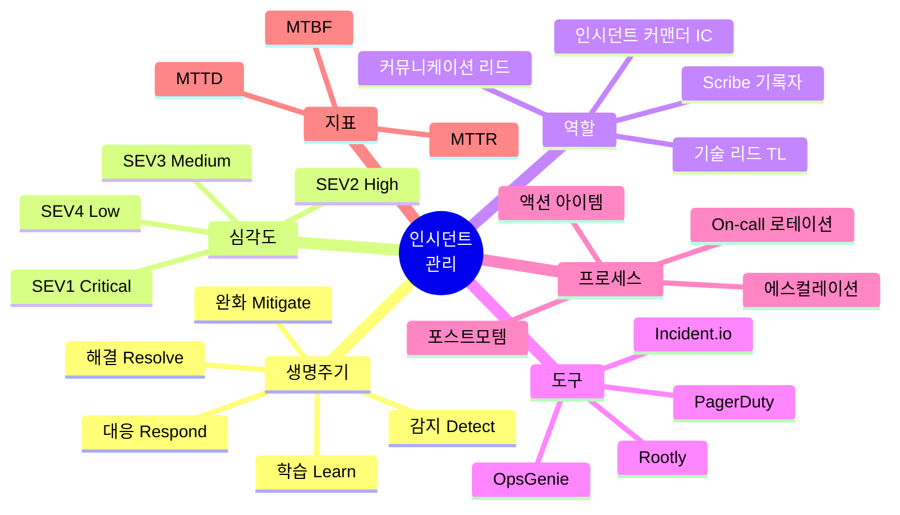
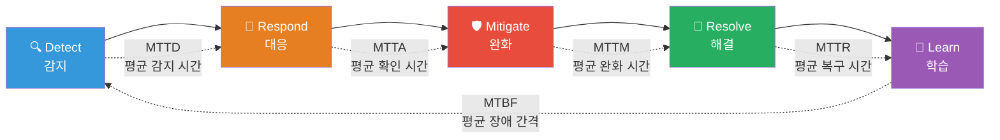
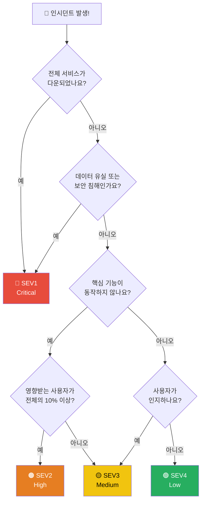
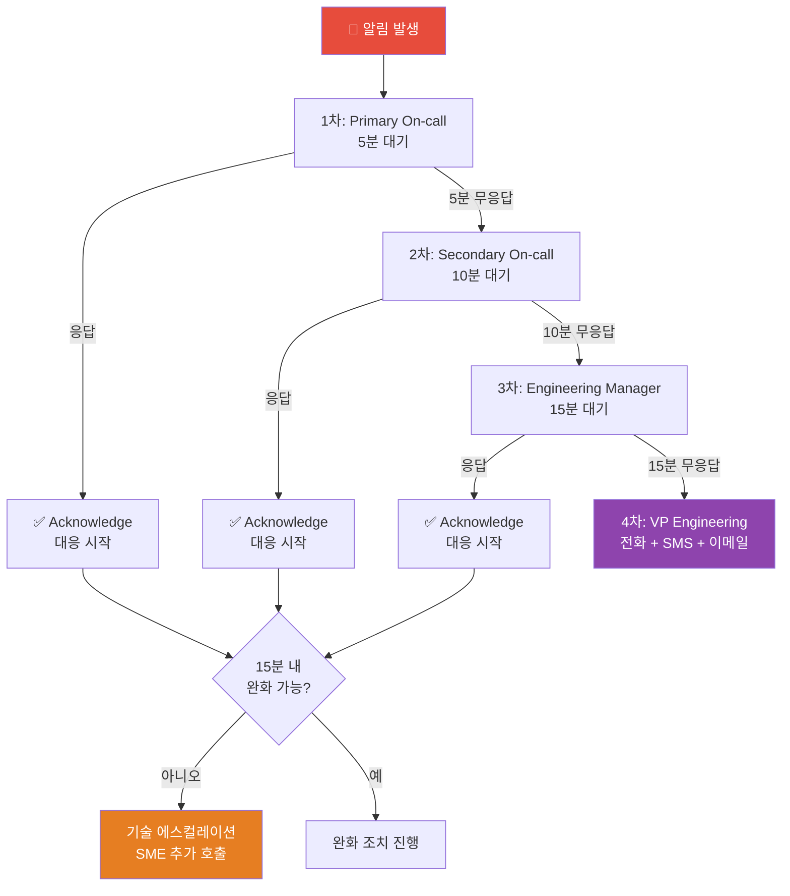
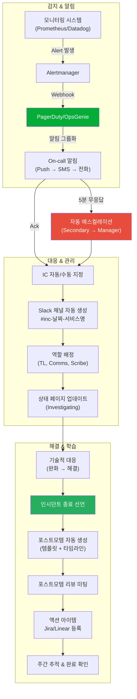

# 인시던트 관리 완전 정복 — 장애는 막을 수 없지만, 대응은 설계할 수 있어요

> 서비스 장애는 **"언제 일어나느냐"의 문제이지, "일어나느냐 마느냐"의 문제가 아니에요.** [SRE 원칙](./01-principles)에서 Error Budget 개념을 배웠고, [알림(Alerting)](../08-observability/11-alerting)에서 이상 징후를 감지하는 방법을 익혔다면, 이제 **알림이 울린 그 순간부터 끝까지** — 인시던트의 전체 생명주기를 체계적으로 관리하는 방법을 알아볼 차례예요.

---

## 🎯 왜 인시던트 관리를 알아야 하나요?

### 일상 비유: 응급실 시스템

병원 응급실을 떠올려보세요.

- 환자가 실려 와요 (인시던트 감지)
- 트리아지 간호사가 **중증도를 분류**해요 — 심정지? 골절? 감기? (심각도 분류)
- 중증 환자에게는 **전담 의료팀**이 바로 배정돼요 (인시던트 커맨더)
- 담당 의사가 없으면 **다른 의사를 호출**해요 (에스컬레이션)
- 치료하면서 **보호자에게 상황을 알려줘요** (커뮤니케이션)
- 치료가 끝나면 **의무 기록을 작성**해요 (포스트모템)
- 비슷한 환자가 다시 오면 **더 빠르게 대응**할 수 있어요 (개선)

응급실이 체계 없이 운영되면 어떻게 될까요?

```
인시던트 관리가 없는 팀에서 벌어지는 일:

  "새벽 3시에 서비스 다운됐는데 아무도 몰랐어요"           → 감지 체계 부재
  "알림 받았는데 누가 대응해야 하는지 몰랐어요"            → On-call 부재
  "10명이 동시에 같은 문제 보고 있었어요"                  → 인시던트 커맨더 부재
  "장애 중인데 고객사에서 '어떻게 된 거냐' 전화 폭주"      → 커뮤니케이션 부재
  "같은 장애가 3개월 만에 또 터졌어요"                     → 포스트모템 부재
  "장애 보고서에 '김개발이 실수함'이라고 적혀있어요"        → Blameless 문화 부재
```

### 체계 없는 팀 vs 인시던트 관리가 있는 팀

```mermaid
flowchart TD
    subgraph "❌ 체계 없는 팀"
        A1["장애 발생!<br/>고객 문의 접수"] -->|"30분 뒤 인지"| A2["'누가 봐야 하지?'<br/>슬랙에서 혼란"]
        A2 -->|"담당자 찾기 15분"| A3["여러 명이 동시에<br/>같은 문제 조사"]
        A3 -->|"소통 없이 각자 작업"| A4["한 명이 롤백하고<br/>다른 한 명이 핫픽스"]
        A4 -->|"총 MTTR: 3시간"| A5["고객 이탈<br/>팀 소진<br/>재발 예정"]
    end

    subgraph "✅ 인시던트 관리 팀"
        B1["모니터링 자동 감지<br/>PagerDuty 알림"] -->|"2분 내 인지"| B2["On-call 엔지니어<br/>인시던트 선언"]
        B2 -->|"IC가 역할 배정"| B3["분석/완화/소통<br/>역할 분리 대응"]
        B3 -->|"Runbook 따라 조치"| B4["완화 후 근본 원인<br/>수정 및 배포"]
        B4 -->|"총 MTTR: 20분"| B5["빠른 복구<br/>포스트모템<br/>재발 방지"]
    end

    style A5 fill:#e74c3c,color:#fff
    style B5 fill:#27ae60,color:#fff
```



### 비즈니스 관점에서 인시던트 관리가 중요한 이유

```
📊 다운타임의 비용 (업계 평균):

  SEV1 장애 1시간 = $100,000 ~ $1,000,000+ 손실
  평균 MTTR 10분 단축 = 연간 수억 원 절감
  고객 신뢰도 하락 → 이탈률 25% 증가

📈 인시던트 관리 도입 효과:
  MTTD (감지 시간)     : 30분 → 2분     (93% 개선)
  MTTR (복구 시간)     : 3시간 → 20분   (89% 개선)
  재발률               : 40% → 8%       (80% 개선)
  On-call 번아웃       : 높음 → 관리가능 (팀 유지율 향상)
```

---

## 🧠 핵심 개념 잡기

### 인시던트란 무엇인가요?

**인시던트(Incident)**는 서비스의 정상 운영을 방해하거나 위협하는 이벤트예요. 단순한 버그나 개선 사항과는 구분해야 해요.

```
🔥 인시던트 (Incident)
   - 서비스에 영향을 주고 있거나 곧 줄 예정인 상황
   - 즉시 대응이 필요해요
   - 예: API 응답 시간 10초, 결제 실패율 급증, 데이터베이스 다운

🐛 버그 (Bug)
   - 서비스는 동작하지만 기대와 다른 동작
   - 일반 티켓으로 처리해요
   - 예: 특정 브라우저에서 UI 깨짐, 잘못된 에러 메시지

💡 개선 (Improvement)
   - 현재 동작은 하지만 더 좋게 만들 수 있는 것
   - 백로그로 관리해요
   - 예: API 응답 속도 최적화, 로그 포맷 개선
```

### 핵심 용어 한눈에 보기



### 인시던트 관리의 5가지 기둥

| 기둥 | 설명 | 비유 |
|------|------|------|
| **감지 (Detection)** | 문제를 빠르게 발견하기 | 화재 감지기 |
| **대응 (Response)** | 적절한 사람이 즉시 행동하기 | 소방관 출동 |
| **소통 (Communication)** | 이해관계자에게 상황 전달하기 | 대피 안내 방송 |
| **해결 (Resolution)** | 문제의 근본 원인을 제거하기 | 불 끄기 |
| **학습 (Learning)** | 재발 방지 대책 수립하기 | 화재 원인 조사 보고서 |

---

## 🔍 하나씩 자세히 알아보기

### 1. 인시던트 생명주기 (Incident Lifecycle)

모든 인시던트는 5단계를 거쳐요. 각 단계를 건너뛰면 문제가 생겨요.



#### Stage 1: Detect (감지)

문제를 인지하는 단계예요. 감지 방법은 여러 가지가 있어요.

```
감지 소스별 우선순위:

  1순위: 자동 모니터링 알림     ← 가장 이상적 (Proactive)
    - Prometheus Alert Rules
    - SLO 기반 Error Budget Burn Rate 알림
    - APM 이상 탐지

  2순위: 내부 보고               ← 괜찮음
    - 개발자가 배포 후 이상 발견
    - QA 팀 테스트 중 발견
    - 내부 도구 모니터링

  3순위: 고객 보고               ← 개선 필요
    - CS 팀 접수
    - 소셜 미디어 멘션
    - 직접 문의
```

감지 품질을 높이는 방법은 [알림(Alerting)](../08-observability/11-alerting)에서 자세히 다뤘어요. 핵심은 **증상 기반 알림(Symptom-based Alerting)**과 **SLO 기반 알림**을 사용하는 거예요.

#### Stage 2: Respond (대응)

감지 후 적절한 인력이 투입되는 단계예요.

```yaml
# 대응 단계 체크리스트
respond_checklist:
  - "On-call 엔지니어가 알림을 확인(Acknowledge)했는가?"
  - "인시던트 채널(Slack/Teams)을 생성했는가?"
  - "인시던트 심각도를 판정했는가?"
  - "인시던트 커맨더(IC)를 지정했는가?"
  - "필요한 역할(TL, 커뮤니케이션 리드)을 배정했는가?"
  - "상태 페이지를 업데이트했는가?"
```

#### Stage 3: Mitigate (완화)

사용자 영향을 최소화하는 **응급 처치** 단계예요. 근본 원인 수정이 아니라 **출혈을 멈추는 것**이 목표예요.

```
완화(Mitigation) 전략 모음:

  🔄 롤백 (Rollback)
     - 최근 배포가 원인일 때 가장 빠른 대응
     - "배포 후 30분 내 문제 → 무조건 롤백부터"

  📈 스케일 아웃 (Scale Out)
     - 트래픽 급증이 원인일 때
     - Auto Scaling 또는 수동 인스턴스 추가

  🚫 기능 비활성화 (Feature Flag Off)
     - 특정 기능이 원인일 때
     - Feature Flag로 해당 기능만 끄기

  🔀 트래픽 전환 (Traffic Shift)
     - 특정 리전/AZ에 문제가 있을 때
     - DNS 또는 로드밸런서로 트래픽 우회

  🗄️ 캐시 무효화 (Cache Invalidation)
     - 잘못된 캐시 데이터가 원인일 때
     - 캐시 플러시 후 재생성

  ⏸️ 큐 일시 중지 (Queue Pause)
     - 비동기 처리가 폭주할 때
     - 큐 소비 중단 후 정리
```

#### Stage 4: Resolve (해결)

근본 원인(Root Cause)을 찾아 수정하는 단계예요.

```
완화 vs 해결의 차이:

  완화(Mitigate): "일단 롤백해서 서비스 복구했어요"
  해결(Resolve):  "메모리 누수 코드를 수정하고 배포했어요"

  완화(Mitigate): "문제 서버를 격리했어요"
  해결(Resolve):  "디스크 교체하고 데이터 복구 완료했어요"

  ⚠️ 완화만 하고 해결을 안 하면 → 같은 장애 반복!
```

#### Stage 5: Learn (학습)

포스트모템을 통해 재발을 방지하는 단계예요. **가장 중요하지만 가장 많이 건너뛰는 단계**이기도 해요.

```
학습 단계의 핵심 활동:

  📝 포스트모템 작성 (72시간 이내)
  👥 포스트모템 리뷰 미팅 (1주일 이내)
  📋 액션 아이템 등록 및 추적
  📊 인시던트 메트릭 업데이트
  📚 Runbook 업데이트
  🔔 알림 규칙 개선
```

---

### 2. 심각도 분류 (Severity Classification)

모든 인시던트를 동일하게 대응하면 안 돼요. **심각도에 따라 대응 수준이 달라져야** 해요.

#### SEV 레벨 정의

```
┌─────────┬─────────────────────────────────────────────────────────────────┐
│  Level  │  정의 및 기준                                                   │
├─────────┼─────────────────────────────────────────────────────────────────┤
│  SEV1   │  🔴 Critical — 서비스 전체 장애                                 │
│ (P1)    │  • 전체 사용자 영향                                             │
│         │  • 데이터 유실 위험                                             │
│         │  • 매출 직접 영향                                               │
│         │  • 예: 전체 API 다운, 결제 시스템 장애, 데이터베이스 장애        │
│         │  • 대응: 즉시, 24/7, 경영진 보고                                │
├─────────┼─────────────────────────────────────────────────────────────────┤
│  SEV2   │  🟠 High — 주요 기능 장애                                       │
│ (P2)    │  • 다수 사용자 영향                                             │
│         │  • 핵심 기능 동작 불가                                          │
│         │  • 우회 방법 없거나 불편함                                       │
│         │  • 예: 검색 기능 장애, 특정 리전 접속 불가, 로그인 간헐적 실패   │
│         │  • 대응: 30분 내, 업무시간 외 포함                              │
├─────────┼─────────────────────────────────────────────────────────────────┤
│  SEV3   │  🟡 Medium — 부분적 기능 저하                                   │
│ (P3)    │  • 일부 사용자 영향                                             │
│         │  • 비핵심 기능 장애                                             │
│         │  • 우회 방법 존재                                               │
│         │  • 예: 알림 지연, 리포트 생성 느림, 특정 브라우저 오류           │
│         │  • 대응: 업무시간 내, 당일 처리                                 │
├─────────┼─────────────────────────────────────────────────────────────────┤
│  SEV4   │  🟢 Low — 경미한 이슈                                           │
│ (P4)    │  • 최소 사용자 영향                                             │
│         │  • 미관상 문제 또는 사소한 불편                                  │
│         │  • 예: 오타, UI 미세 깨짐, 로그 경고 메시지                     │
│         │  • 대응: 백로그, 다음 스프린트에 처리                            │
└─────────┴─────────────────────────────────────────────────────────────────┘
```

#### 심각도 판정 매트릭스

어떤 SEV 레벨을 부여해야 할지 헷갈릴 때 이 매트릭스를 사용하세요.



#### SEV 레벨별 대응 기준

```yaml
# incident-severity-policy.yaml
severity_levels:
  SEV1:
    response_time: "5분 이내"
    resolution_target: "1시간 이내"
    on_call: "즉시 호출 (24/7)"
    escalation: "15분 무응답 시 자동 에스컬레이션"
    communication: "10분마다 상태 업데이트"
    stakeholders: "CTO, VP Engineering, CS 리드"
    postmortem: "필수 (48시간 이내)"
    ic_required: true
    war_room: true

  SEV2:
    response_time: "15분 이내"
    resolution_target: "4시간 이내"
    on_call: "즉시 호출 (업무시간 외 포함)"
    escalation: "30분 무응답 시 자동 에스컬레이션"
    communication: "30분마다 상태 업데이트"
    stakeholders: "Engineering Manager, CS 팀"
    postmortem: "필수 (1주일 이내)"
    ic_required: true
    war_room: false

  SEV3:
    response_time: "1시간 이내"
    resolution_target: "1영업일 이내"
    on_call: "업무시간 내 대응"
    escalation: "2시간 무응답 시"
    communication: "해결 시 1회 공지"
    stakeholders: "팀 리드"
    postmortem: "선택 (개선점 있을 경우)"
    ic_required: false
    war_room: false

  SEV4:
    response_time: "1영업일 이내"
    resolution_target: "1주일 이내"
    on_call: "해당 없음"
    escalation: "1주일 미처리 시"
    communication: "해당 없음"
    stakeholders: "해당 없음"
    postmortem: "해당 없음"
    ic_required: false
    war_room: false
```

---

### 3. 인시던트 역할 (Incident Roles)

큰 인시던트에서는 한 사람이 모든 일을 하면 안 돼요. **역할 분리**가 효율적인 대응의 핵심이에요.

#### Incident Commander (IC) — 인시던트 지휘관

인시던트의 **총괄 책임자**예요. 직접 코드를 고치는 사람이 아니라, **전체 상황을 조율하는 사람**이에요.

```
IC의 역할 (응급실 수석의와 같아요):

  ✅ IC가 하는 일:
    • 인시던트 심각도 판정 및 선언
    • 역할 배정 (TL, 커뮤니케이션 리드 등)
    • 전체 진행 상황 파악 및 의사결정
    • 에스컬레이션 판단
    • 타임라인 관리 ("10분 후 진행 상황 공유해주세요")
    • 리소스 추가 투입 결정

  ❌ IC가 하지 않는 일:
    • 직접 코드 수정이나 디버깅
    • 세부 기술 분석
    • 고객 응대
    • 포스트모템 작성 (별도 담당)

  💡 비유: 소방서 지휘관은 직접 불을 끄지 않아요.
           전체 상황을 보면서 인력과 장비를 배치하는 역할이에요.
```

#### 전체 역할 구조

```
┌──────────────────────────────────────────────────────────────┐
│                    Incident Commander (IC)                     │
│              전체 조율, 의사결정, 에스컬레이션                   │
├───────────────┬──────────────────┬───────────────────────────┤
│  Tech Lead    │  Comms Lead      │  Scribe (기록자)           │
│  기술 분석     │  커뮤니케이션     │  타임라인 기록             │
│               │                  │                           │
│  • 근본 원인   │  • 상태 페이지    │  • 시간별 이벤트           │
│    분석       │    업데이트       │    기록                   │
│  • 완화 방안   │  • 슬랙 공지     │  • 조치 내용               │
│    실행       │  • 이해관계자     │    기록                   │
│  • 기술적     │    커뮤니케이션   │  • 포스트모템              │
│    의사결정   │  • CS팀 지원      │    초안 준비              │
│               │                  │                           │
│  Subject      │                  │                           │
│  Matter       │                  │                           │
│  Experts      │                  │                           │
│  (SME 호출)   │                  │                           │
└───────────────┴──────────────────┴───────────────────────────┘
```

#### 소규모 팀에서의 역할 조합

```
팀 규모별 역할 배분:

  2~3명 팀:
    • IC + Comms = 한 사람 (On-call 엔지니어)
    • TL + Scribe = 한 사람 (지원 엔지니어)

  4~6명 팀:
    • IC = 시니어 엔지니어 또는 EM
    • TL = On-call 엔지니어
    • Comms = EM 또는 PM
    • Scribe = 주니어 엔지니어 (좋은 학습 기회!)

  7명+ 팀:
    • 모든 역할 별도 지정
    • SME를 필요에 따라 추가 호출
```

---

### 4. On-call 운영

On-call은 **서비스를 24/7 보호하는 방패**예요. 하지만 잘못 운영하면 팀을 소진시키는 독이 되기도 해요.

#### On-call 로테이션 설계

```yaml
# on-call-rotation.yaml
rotation:
  name: "Backend Primary On-call"
  type: "weekly"            # weekly, daily, follow-the-sun
  handoff_time: "10:00 KST" # 업무 시작 시간에 인수인계
  handoff_day: "Monday"

  participants:
    - name: "김엔지니어"
      contact:
        phone: "+82-10-xxxx-xxxx"
        slack: "@kim-eng"
    - name: "이엔지니어"
      contact:
        phone: "+82-10-xxxx-xxxx"
        slack: "@lee-eng"
    - name: "박엔지니어"
      contact:
        phone: "+82-10-xxxx-xxxx"
        slack: "@park-eng"

  # 최소 3명이 로테이션에 참여해야 해요
  # 한 사람이 연속 2주 이상 On-call 금지

  layers:
    primary:
      escalation_timeout: 5m    # 5분 무응답 시 Secondary로
    secondary:
      escalation_timeout: 10m   # 10분 무응답 시 Manager로
    manager:
      escalation_timeout: 15m   # 15분 무응답 시 VP로
```

#### On-call 모범 사례

```
✅ On-call이 잘 되려면:

  📋 Runbook 준비
    • 모든 알림에 대응 절차가 문서화되어 있어야 해요
    • "알림 받으면 뭘 해야 하나요?" → Runbook에 답이 있어야 해요
    • 알림 → Runbook 링크 자동 연결

  👥 적절한 로테이션
    • 최소 3명 (이상적으로는 5~6명)
    • 1주일 On-call → 최소 2주 Off
    • Follow-the-Sun: 글로벌 팀이면 시간대별 분배

  💰 보상 체계
    • On-call 수당 (대기 수당 + 호출 수당)
    • 야간/주말 호출 시 추가 보상
    • 대체 휴무 제공
    • "보상 없는 On-call = 번아웃 예약"

  📱 인수인계
    • 교대 시 현재 이슈, 주의 사항 전달
    • 진행 중인 인시던트가 있으면 교대 미루기
    • 인수인계 체크리스트 사용

  🧘 번아웃 방지
    • 주당 알림 2회 이하 목표
    • 불필요한 알림 적극 제거
    • On-call이 야간 호출 받으면 다음 날 늦은 출근
    • 정기적으로 알림 품질 리뷰
```

#### On-call 인수인계 템플릿

```markdown
## On-call 인수인계 — 2024-W03 (김엔지니어 → 이엔지니어)

### 지난주 주요 인시던트
- [INC-0042] 화요일 결제 API 지연 → 해결됨 (DB 인덱스 추가)
- [INC-0043] 금요일 CDN 캐시 오류 → 모니터링 중

### 현재 주의 사항
- [ ] 수요일 DB 마이그레이션 예정 — 알림 증가 가능
- [ ] 신규 결제 모듈 카나리 배포 중 — 에러율 주시
- [ ] Redis 메모리 사용량 80% — 임계치 근접

### 알려진 Flaky 알림
- `disk-usage-high` on node-07: 임시 볼륨 이슈, 무시 가능
- `pod-restart` on cronjob-cleanup: 정상 동작, 알림 수정 예정

### 에스컬레이션 연락처
- DB 이슈: @박DBA (010-xxxx-xxxx)
- 인프라 이슈: @최인프라 (010-xxxx-xxxx)
- 결제 이슈: @정결제팀장 (010-xxxx-xxxx)
```

---

### 5. 에스컬레이션 정책 (Escalation Policies)

에스컬레이션은 **"더 높은 수준의 대응이 필요하다"는 신호**예요. 에스컬레이션을 주저하면 안 돼요.



#### 에스컬레이션의 두 가지 유형

```
📈 기능적 에스컬레이션 (Functional Escalation)
   = "이 문제는 내 전문 분야가 아니에요"
   → 해당 분야 전문가(SME)에게 넘기기
   예: 백엔드 On-call이 네트워크 문제 발견 → 네트워크 엔지니어 호출

📊 계층적 에스컬레이션 (Hierarchical Escalation)
   = "이 문제는 더 높은 의사결정 권한이 필요해요"
   → 관리자/임원에게 보고
   예: 전체 서비스 다운 → CTO 보고, 고객 공지 승인 필요
```

#### 에스컬레이션 판단 기준

```
언제 에스컬레이션해야 할까요?

  즉시 에스컬레이션:
    ⬆️ SEV1 인시던트는 무조건
    ⬆️ 데이터 유실 가능성
    ⬆️ 보안 침해 (→ 보안 인시던트 대응도 참고)
    ⬆️ 법적/규정 관련 영향

  15분 후 에스컬레이션:
    ⬆️ 원인 파악이 안 될 때
    ⬆️ 완화 방법을 모를 때
    ⬆️ 영향 범위가 커지고 있을 때

  30분 후 에스컬레이션:
    ⬆️ 완화가 안 될 때
    ⬆️ 추가 리소스가 필요할 때
    ⬆️ SEV2가 SEV1으로 악화될 조짐

  ⚠️ "에스컬레이션은 실패가 아니에요. 늦은 에스컬레이션이 실패예요."
```

---

### 6. 커뮤니케이션 (Communication)

장애 중 커뮤니케이션은 기술적 대응만큼 중요해요. **침묵은 불안을 키워요.**

#### 커뮤니케이션 채널별 역할

```
채널별 용도 분리:

  🔴 인시던트 Slack 채널 (#inc-20240115-payment-failure)
     • 기술적 대응 소통만
     • 구경꾼 금지 — 관련자만
     • 핵심 결정 사항 기록

  🟡 상태 페이지 (status.company.com)
     • 외부 고객용 공지
     • 기술적 세부사항 최소화
     • 정기적 업데이트 (10~30분 간격)

  🔵 내부 공지 채널 (#engineering-incidents)
     • 전사 엔지니어링 팀 공유
     • 진행 상황 요약
     • 도움 요청

  🟢 이해관계자 커뮤니케이션 (이메일/Slack DM)
     • CTO, PM, CS 리드에게 직접
     • 비즈니스 영향 중심
     • 복구 예상 시간 포함
```

#### 상태 페이지 업데이트 템플릿

```markdown
## [Investigating] 결제 처리 지연 발생
📅 2024-01-15 14:30 KST

현재 결제 처리에 지연이 발생하고 있습니다.
원인을 조사 중이며, 업데이트가 있으면 공유드리겠습니다.

영향 범위: 결제 서비스
영향: 결제 처리 시 평소보다 시간이 오래 걸릴 수 있습니다.

---

## [Identified] 결제 처리 지연 — 원인 파악
📅 2024-01-15 14:45 KST

원인이 파악되었습니다. 결제 게이트웨이의 연결 풀 고갈로 인한
처리 지연입니다. 현재 완화 조치를 진행 중입니다.

---

## [Monitoring] 결제 처리 지연 — 조치 완료, 모니터링 중
📅 2024-01-15 15:00 KST

완화 조치가 완료되었습니다. 결제 처리 속도가 정상으로
돌아오고 있으며, 안정성을 모니터링 중입니다.

---

## [Resolved] 결제 처리 지연 — 해결됨
📅 2024-01-15 15:30 KST

결제 처리가 완전히 정상화되었습니다.
원인: 결제 게이트웨이 연결 풀 설정 오류
조치: 연결 풀 크기 조정 및 자동 회복 로직 추가
이용에 불편을 드려 죄송합니다.
```

#### Slack 인시던트 채널 운영 템플릿

```markdown
🚨 **인시던트 선언** — INC-2024-0115-001

**심각도**: SEV2
**영향**: 결제 API 응답 지연 (p99 > 10초)
**인시던트 커맨더**: @김IC
**기술 리드**: @이TL
**커뮤니케이션 리드**: @박Comms

**타임라인**:
• 14:25 — 결제 API 지연 알림 발생
• 14:30 — On-call @이TL 확인, 인시던트 선언
• 14:35 — DB 커넥션 풀 고갈 확인
• 14:40 — 커넥션 풀 사이즈 증가 조치
• 14:50 — 응답 시간 정상화 확인

**현재 상태**: 모니터링 중
**다음 업데이트**: 15:00

⚠️ 이 채널은 인시던트 대응 전용입니다.
   질문/구경은 #engineering-incidents 에서 부탁드려요.
```

#### 이해관계자 커뮤니케이션 가이드

```
이해관계자별 관심사가 달라요:

  CTO / VP Engineering:
    "비즈니스 영향이 얼마나 큰가?"
    "언제 복구되나?"
    "재발 방지할 수 있나?"
    → 비즈니스 영향 + 복구 시간 중심으로 소통

  PM / 제품팀:
    "고객이 뭘 경험하고 있나?"
    "우회 방법이 있나?"
    "로드맵 일정에 영향이 있나?"
    → 사용자 영향 + 우회 방법 중심으로 소통

  CS / 고객 지원팀:
    "고객에게 뭐라고 안내하면 되나?"
    "언제까지 기다리라고 하면 되나?"
    "보상이 필요한가?"
    → 안내 멘트 + 복구 예상 시간 제공

  법무 / 컴플라이언스:
    "데이터 유실이 있었나?"
    "규정 위반 사항이 있나?"
    "외부 보고가 필요한가?"
    → 데이터 영향 + 규정 관련 사항 중심으로 소통
```

---

### 7. Blameless 포스트모템 (Post-Mortem)

포스트모템은 **"누가 잘못했나"가 아니라 "시스템이 왜 이것을 허용했나"**를 찾는 과정이에요.

#### Blameless 문화란?

```
❌ Blame 문화:
   "김개발이 프로덕션에 잘못된 설정을 배포했습니다."
   → 결과: 사람들이 실수를 숨기고, 문제를 보고하지 않아요

✅ Blameless 문화:
   "프로덕션 설정 변경에 대한 검증 절차가 없어서,
    잘못된 설정이 리뷰 없이 배포될 수 있었습니다."
   → 결과: 시스템 개선에 집중하고, 솔직하게 공유해요

핵심 원칙:
  • 사람은 실수해요. 시스템이 실수를 방지해야 해요.
  • "누가"가 아니라 "왜/어떻게"를 물어보세요.
  • 동일한 실수를 두 번째 사람도 할 수 있다면, 그건 시스템 문제예요.
  • 실수한 사람이 가장 많이 배운 사람이에요. 처벌하면 학습을 잃어요.
```

#### 포스트모템 템플릿

```markdown
# 포스트모템: [INC-2024-0115-001] 결제 API 장애

## 기본 정보
| 항목 | 내용 |
|------|------|
| 인시던트 ID | INC-2024-0115-001 |
| 심각도 | SEV2 |
| 인시던트 커맨더 | 김IC |
| 작성자 | 이TL |
| 작성일 | 2024-01-17 |
| 리뷰 예정일 | 2024-01-22 |

## 요약
2024년 1월 15일 14:25~15:30 (약 65분간) 결제 API에서 응답 지연이
발생했습니다. 데이터베이스 연결 풀 고갈이 원인이었으며, 전체 결제
요청의 약 30%가 타임아웃 에러를 경험했습니다.

## 영향
- **지속 시간**: 65분 (14:25 ~ 15:30 KST)
- **영향받은 사용자**: 약 12,000명
- **실패한 결제 건수**: 약 850건
- **매출 영향**: 약 ₩15,000,000 (대부분 재시도로 복구)
- **SLA 영향**: 월간 가용성 99.95% → 99.91%로 하락

## 타임라인
| 시각 (KST) | 이벤트 |
|------------|--------|
| 14:20 | DB 커넥션 풀 사용률 증가 시작 |
| 14:25 | 결제 API p99 지연시간 10초 초과 알림 발생 |
| 14:28 | On-call @이TL PagerDuty 알림 확인(Ack) |
| 14:30 | 인시던트 선언, #inc-20240115-payment Slack 채널 생성 |
| 14:35 | DB 커넥션 풀 100% 고갈 확인 |
| 14:38 | 원인 파악: 신규 배치 작업이 커넥션을 과다 점유 |
| 14:40 | 완화: 배치 작업 중지 |
| 14:45 | 커넥션 풀 회복 시작 |
| 14:50 | 결제 API 응답 시간 정상화 |
| 15:00 | 배치 작업 커넥션 제한 설정 후 재시작 |
| 15:30 | 안정화 확인, 인시던트 종료 선언 |

## 근본 원인 (Root Cause)
신규 배치 작업(일일 정산 리포트)이 DB 커넥션 풀에서 별도 제한 없이
커넥션을 획득하여, 전체 커넥션 풀을 고갈시켰습니다.

**기여 요인 (Contributing Factors)**:
1. 배치 작업에 대한 커넥션 풀 분리가 없었음
2. 배치 작업 배포 시 부하 테스트를 수행하지 않았음
3. 커넥션 풀 사용률 알림 임계치가 90%로 너무 높았음

## 무엇이 잘 됐나요?
- 알림이 5분 내에 정확하게 발생했어요
- On-call 엔지니어가 3분 내에 확인했어요
- 원인 파악이 비교적 빠르게 이루어졌어요 (8분)
- 상태 페이지 업데이트가 적시에 이루어졌어요

## 무엇이 안 됐나요?
- 배치 작업과 서비스 워크로드의 커넥션 풀이 분리되지 않았어요
- 배치 작업에 대한 리소스 제한 정책이 없었어요
- 커넥션 풀 사용률 알림이 너무 늦게 울렸어요 (90%)

## 우리가 운이 좋았던 것
- 피크 시간대가 아니었어요 (14시). 만약 저녁 8시였다면 영향이 5배였을 거예요
- 실패한 결제 대부분이 클라이언트 자동 재시도로 복구됐어요

## 액션 아이템
| # | 액션 | 우선순위 | 담당자 | 기한 | 상태 |
|---|------|---------|--------|------|------|
| 1 | 배치/서비스 커넥션 풀 분리 | P1 | @이TL | 01/22 | 🔴 진행 중 |
| 2 | 배치 작업 커넥션 제한 설정 | P1 | @김BE | 01/19 | ✅ 완료 |
| 3 | 커넥션 풀 알림 임계치 70%로 조정 | P2 | @박SRE | 01/22 | 🔴 진행 중 |
| 4 | 배치 작업 배포 시 부하 테스트 프로세스 수립 | P2 | @이TL | 01/29 | ⬜ 미시작 |
| 5 | 커넥션 풀 자동 회복 로직 추가 | P3 | @김BE | 02/05 | ⬜ 미시작 |
```

#### 포스트모템 프로세스

```
포스트모템 진행 순서:

  1️⃣ 초안 작성 (인시던트 종료 후 48시간 이내)
     • IC 또는 TL이 위 템플릿 기반으로 작성
     • 타임라인은 최대한 상세하게

  2️⃣ 리뷰 요청
     • 인시던트 참여자 전원에게 공유
     • 빠진 내용이나 부정확한 내용 보완

  3️⃣ 포스트모템 리뷰 미팅 (30~60분)
     • 참여자: IC, TL, 관련 엔지니어, EM
     • 타임라인 리뷰
     • 근본 원인 합의
     • 액션 아이템 우선순위 결정
     • ⚠️ 비난 금지, 시스템 개선에 집중

  4️⃣ 액션 아이템 등록
     • Jira/Linear 티켓으로 등록
     • 담당자 + 기한 반드시 명시
     • 스프린트에 반영

  5️⃣ 추적 및 완료 확인
     • 주간 미팅에서 액션 아이템 진행 상황 확인
     • 완료되지 않은 P1 액션은 에스컬레이션
     • 전체 액션 완료 시 포스트모템 종료
```

---

### 8. 인시던트 메트릭 (Incident Metrics)

"측정할 수 없으면 개선할 수 없어요." 인시던트 관리의 효과를 측정하는 핵심 지표들이에요.

#### 핵심 메트릭 4가지

```
┌─────────────────────────────────────────────────────────────────┐
│                      인시던트 타임라인                            │
│                                                                  │
│  장애 발생        감지         확인       완화        해결        │
│     │             │           │          │           │           │
│     ├─── MTTD ───►├── MTTA ──►├── TTM ──►├── TTR ───►│           │
│     │             │           │          │           │           │
│     ├──────────── MTTR (전체 복구 시간) ─────────────►│           │
│     │                                                 │           │
│     │◄─────────── MTBF (장애 간격) ──────────────────►│           │
│                                                                  │
└─────────────────────────────────────────────────────────────────┘

  MTTD (Mean Time To Detect) — 평균 감지 시간
    장애 발생 → 감지까지 걸린 시간
    좋은 기준: < 5분
    "얼마나 빨리 알아채는가?"

  MTTA (Mean Time To Acknowledge) — 평균 확인 시간
    알림 발생 → 담당자 확인까지 걸린 시간
    좋은 기준: < 5분
    "얼마나 빨리 대응을 시작하는가?"

  MTTR (Mean Time To Resolve) — 평균 복구 시간
    장애 발생 → 완전 해결까지 걸린 시간
    좋은 기준: SEV1 < 1시간, SEV2 < 4시간
    "얼마나 빨리 고치는가?"

  MTBF (Mean Time Between Failures) — 평균 장애 간격
    이전 장애 해결 → 다음 장애 발생까지의 시간
    좋은 기준: 길수록 좋음
    "얼마나 안정적인가?"
```

#### 추가 유용한 메트릭

```yaml
# incident-metrics.yaml
operational_metrics:
  # 알림 품질
  alert_noise_ratio:
    description: "전체 알림 중 실제 인시던트 비율"
    target: "> 50%"
    warning: "< 30%이면 Alert Fatigue 위험"

  false_positive_rate:
    description: "False Positive 알림 비율"
    target: "< 10%"

  # On-call 건강성
  pages_per_shift:
    description: "On-call 교대당 호출 횟수"
    target: "< 2회/주"
    critical: "> 5회/주 = 번아웃 위험"

  off_hours_pages:
    description: "업무시간 외 호출 비율"
    target: "< 30%"

  # 프로세스 건강성
  postmortem_completion_rate:
    description: "SEV1/2 인시던트 대비 포스트모템 완료율"
    target: "100%"

  action_item_completion_rate:
    description: "포스트모템 액션 아이템 기한 내 완료율"
    target: "> 80%"

  recurrence_rate:
    description: "동일 근본 원인으로 재발한 인시던트 비율"
    target: "< 10%"

  escalation_rate:
    description: "에스컬레이션이 필요했던 인시던트 비율"
    target: "< 20%"
```

#### 메트릭 대시보드 구성

```
인시던트 메트릭 대시보드 권장 구성:

  🔴 실시간 패널 (상단)
    • 현재 진행 중인 인시던트 수 + 심각도
    • 현재 On-call 담당자
    • 최근 24시간 알림 수

  📊 주간 트렌드 (중단)
    • MTTD / MTTA / MTTR 추세
    • 심각도별 인시던트 수
    • On-call 호출 빈도

  📈 월간 리포트 (하단)
    • MTBF 추세
    • 포스트모템 액션 아이템 완료율
    • 재발률
    • 알림 노이즈 비율
    • Top 5 인시던트 원인 (카테고리별)
```

---

### 9. 인시던트 관리 도구 (Incident Management Tools)

#### PagerDuty

업계 표준 On-call 및 인시던트 관리 플랫폼이에요.

```yaml
# pagerduty-service-config.yaml (개념 예시)
service:
  name: "Payment API"
  description: "결제 처리 서비스"

  escalation_policy:
    name: "Payment Team Escalation"
    rules:
      - targets:
          - type: "schedule"
            id: "payment-primary-oncall"
        escalation_delay_in_minutes: 5

      - targets:
          - type: "schedule"
            id: "payment-secondary-oncall"
        escalation_delay_in_minutes: 10

      - targets:
          - type: "user"
            id: "engineering-manager"
        escalation_delay_in_minutes: 15

  integrations:
    - type: "prometheus"
      name: "Prometheus Alertmanager"
    - type: "slack"
      name: "#incidents"
    - type: "jira"
      name: "JIRA Incident Project"

  # 알림 그룹화: 5분 이내 동일 서비스 알림은 하나로 묶기
  alert_grouping:
    type: "intelligent"
    config:
      time_window: 300  # 5분
```

```
PagerDuty 핵심 기능:

  📞 On-call 스케줄링
    • 주간/일간 로테이션
    • 공휴일/휴가 오버라이드
    • Follow-the-Sun 지원

  🔔 알림 전달
    • 푸시 알림 → SMS → 전화 (단계적)
    • Acknowledge / Resolve 관리
    • 자동 에스컬레이션

  📊 분석 리포트
    • MTTA/MTTR 자동 측정
    • On-call 부하 분석
    • 알림 빈도 추세

  🔗 통합
    • 600+ 통합 지원 (Prometheus, Datadog, Slack, Jira 등)
    • Terraform Provider 제공 (IaC)
```

#### OpsGenie (Atlassian)

Atlassian 생태계(Jira, Confluence)와의 통합이 강점인 인시던트 관리 도구예요.

```
OpsGenie 특징:

  ✅ Jira와 네이티브 통합
    • 인시던트 → Jira 티켓 자동 생성
    • 포스트모템 → Confluence 페이지 자동 생성
    • 양방향 동기화

  ✅ 유연한 알림 정책
    • 팀별/서비스별 차별화된 에스컬레이션
    • 심야 시간 알림 필터링
    • 알림 컨텐츠 커스터마이징

  ✅ 경쟁력 있는 가격
    • PagerDuty 대비 저렴 (특히 소규모 팀)
    • Atlassian 번들 할인
```

#### Incident.io

Slack 네이티브 인시던트 관리 플랫폼이에요. 모든 인시던트 워크플로를 Slack 안에서 처리할 수 있어요.

```
Incident.io의 접근 방식:

  💬 Slack-First 워크플로
    • /incident 슬래시 명령어로 인시던트 선언
    • 자동으로 전용 Slack 채널 생성
    • 역할 배정, 상태 업데이트 모두 Slack에서
    • 타임라인이 Slack 메시지에서 자동 생성

  🔄 자동화
    • 인시던트 선언 → 채널 생성 → 역할 배정 → 상태 페이지 업데이트
    • 해결 → 포스트모템 템플릿 자동 생성
    • 액션 아이템 → Jira/Linear 자동 등록

  📊 인사이트
    • 인시던트 트렌드 분석
    • 팀별/서비스별 MTTR 비교
    • 액션 아이템 완료율 추적
```

#### Rootly

Incident.io와 비슷하게 Slack 기반 인시던트 관리를 제공하면서, 워크플로 자동화에 더 초점을 맞춘 도구예요.

```
Rootly 특징:

  🤖 워크플로 자동화 (강점)
    • "SEV1이면 자동으로 Zoom 미팅 생성"
    • "인시던트 종료 후 자동으로 포스트모템 초안 생성"
    • "특정 서비스 장애 시 관련 Runbook 자동 첨부"
    • No-code 워크플로 빌더

  🏷️ 서비스 카탈로그 통합
    • 서비스별 On-call, Runbook, 대시보드 매핑
    • 인시던트 발생 시 관련 정보 자동 제공

  💰 가격 경쟁력
    • 스타트업 무료 플랜 제공
```

#### 도구 비교

```
┌──────────────┬────────────┬─────────────┬──────────────┬────────────┐
│   기능       │ PagerDuty  │ OpsGenie    │ Incident.io  │ Rootly     │
├──────────────┼────────────┼─────────────┼──────────────┼────────────┤
│ On-call      │ ⭐⭐⭐⭐⭐ │ ⭐⭐⭐⭐    │ ⭐⭐⭐       │ ⭐⭐⭐     │
│ 에스컬레이션 │ ⭐⭐⭐⭐⭐ │ ⭐⭐⭐⭐    │ ⭐⭐⭐       │ ⭐⭐⭐     │
│ Slack 통합   │ ⭐⭐⭐     │ ⭐⭐⭐      │ ⭐⭐⭐⭐⭐   │ ⭐⭐⭐⭐⭐ │
│ 워크플로     │ ⭐⭐⭐⭐   │ ⭐⭐⭐      │ ⭐⭐⭐⭐     │ ⭐⭐⭐⭐⭐ │
│ 포스트모템   │ ⭐⭐⭐     │ ⭐⭐⭐⭐    │ ⭐⭐⭐⭐⭐   │ ⭐⭐⭐⭐   │
│ 분석/리포트  │ ⭐⭐⭐⭐⭐ │ ⭐⭐⭐      │ ⭐⭐⭐⭐     │ ⭐⭐⭐⭐   │
│ 가격         │ $$$        │ $$          │ $$$          │ $$         │
│ 적합한 팀    │ 대기업     │ Atlassian팀 │ Slack 중심   │ 스타트업   │
└──────────────┴────────────┴─────────────┴──────────────┴────────────┘

추천 조합:
  소규모 팀 (5-15명):  OpsGenie 또는 Rootly
  중규모 팀 (15-50명): PagerDuty + Incident.io
  대규모 팀 (50명+):   PagerDuty + Incident.io + 커스텀 통합
```

---

### 10. PagerDuty / OpsGenie 워크플로

실제 인시던트 관리 도구를 사용한 전체 워크플로를 살펴볼게요.



#### Alertmanager → PagerDuty 연동 설정

```yaml
# alertmanager.yml
global:
  resolve_timeout: 5m

route:
  receiver: 'default-receiver'
  group_by: ['alertname', 'service']
  group_wait: 30s        # 알림 그룹화 대기 시간
  group_interval: 5m     # 같은 그룹 재알림 간격
  repeat_interval: 4h    # 미해결 알림 재알림 간격

  routes:
    # SEV1: 즉시 PagerDuty로 (Critical)
    - match:
        severity: critical
      receiver: 'pagerduty-critical'
      group_wait: 0s      # 즉시 전달
      continue: true       # Slack에도 동시 전달

    # SEV2: PagerDuty High
    - match:
        severity: warning
        impact: high
      receiver: 'pagerduty-high'
      continue: true

    # SEV3: Slack만
    - match:
        severity: warning
      receiver: 'slack-warning'

    # SEV4: 이메일
    - match:
        severity: info
      receiver: 'email-info'

receivers:
  - name: 'pagerduty-critical'
    pagerduty_configs:
      - service_key: '<PAGERDUTY_SERVICE_KEY>'
        severity: 'critical'
        description: '{{ .CommonAnnotations.summary }}'
        details:
          firing: '{{ .Alerts.Firing | len }}'
          dashboard: '{{ .CommonAnnotations.dashboard }}'
          runbook: '{{ .CommonAnnotations.runbook_url }}'

  - name: 'pagerduty-high'
    pagerduty_configs:
      - service_key: '<PAGERDUTY_SERVICE_KEY>'
        severity: 'error'

  - name: 'slack-warning'
    slack_configs:
      - api_url: '<SLACK_WEBHOOK_URL>'
        channel: '#alerts-warning'
        title: '{{ .CommonAnnotations.summary }}'
        text: '{{ .CommonAnnotations.description }}'

  - name: 'email-info'
    email_configs:
      - to: 'team@company.com'
```

#### Terraform으로 PagerDuty IaC 관리

```hcl
# pagerduty.tf
# On-call 스케줄
resource "pagerduty_schedule" "primary" {
  name      = "Backend Primary On-call"
  time_zone = "Asia/Seoul"

  layer {
    name                         = "Weekly Rotation"
    start                        = "2024-01-01T10:00:00+09:00"
    rotation_virtual_start       = "2024-01-01T10:00:00+09:00"
    rotation_turn_length_seconds = 604800  # 1주일

    users = [
      pagerduty_user.kim.id,
      pagerduty_user.lee.id,
      pagerduty_user.park.id,
    ]
  }
}

# 에스컬레이션 정책
resource "pagerduty_escalation_policy" "backend" {
  name      = "Backend Escalation Policy"
  num_loops = 2  # 전체 2회 반복

  rule {
    escalation_delay_in_minutes = 5
    target {
      type = "schedule_reference"
      id   = pagerduty_schedule.primary.id
    }
  }

  rule {
    escalation_delay_in_minutes = 10
    target {
      type = "schedule_reference"
      id   = pagerduty_schedule.secondary.id
    }
  }

  rule {
    escalation_delay_in_minutes = 15
    target {
      type = "user_reference"
      id   = pagerduty_user.engineering_manager.id
    }
  }
}

# 서비스
resource "pagerduty_service" "payment_api" {
  name              = "Payment API"
  escalation_policy = pagerduty_escalation_policy.backend.id

  alert_creation = "create_alerts_and_incidents"

  # 알림 그룹화 (Intelligent)
  alert_grouping_parameters {
    type = "intelligent"
    config {
      time_window = 300  # 5분
    }
  }

  # 자동 해결: 4시간 Ack 없으면 자동 해결
  auto_resolve_timeout = 14400

  # Ack 타임아웃: 30분 Ack 없으면 다시 알림
  acknowledgement_timeout = 1800
}
```

---

## 💻 직접 해보기

### 실습 1: 인시던트 대응 시뮬레이션 (Tabletop Exercise)

실제 장애 없이 **인시던트 대응을 연습**하는 가장 좋은 방법이에요.

```markdown
## 🎮 Tabletop Exercise: "결제 시스템 장애 시나리오"

### 준비물
- 참여자: 3~6명 (IC, TL, Comms, Scribe 역할 배정)
- Slack 채널: #tabletop-exercise-001
- 시간: 30~45분

### 시나리오 카드 (진행자가 순서대로 제시)

---

📋 [T+0분] 시나리오 시작
"PagerDuty에서 알림이 왔습니다.
 'Payment API - Error rate > 5%'
 현재 시각: 화요일 오후 2시"

질문:
  - 가장 먼저 무엇을 하나요?
  - 어떤 도구를 확인하나요?

---

📋 [T+5분] 상황 업데이트
"확인해보니 결제 API의 에러율이 15%까지 올라가고 있습니다.
 에러 로그: 'Connection timeout to payment-gateway.external.com'
 외부 결제 게이트웨이가 응답하지 않는 것 같습니다."

질문:
  - 심각도를 몇으로 설정하나요? 왜?
  - 어떤 완화 조치를 취하나요?
  - 누구에게 알려야 하나요?

---

📋 [T+10분] 상황 악화
"에러율이 40%에 도달했습니다.
 고객 CS 팀에서 '결제가 안 됩니다' 문의가 쏟아지고 있습니다.
 외부 결제 게이트웨이 상태 페이지에는 '정상 운영 중'이라고 되어 있습니다."

질문:
  - SEV를 올려야 하나요?
  - 외부 게이트웨이에 연락해야 하나요?
  - 상태 페이지에 뭐라고 적나요?
  - 고객에게 뭐라고 안내하나요?

---

📋 [T+20분] 새로운 정보
"네트워크 팀이 확인해보니, 오늘 오전에 방화벽 규칙이
 변경되었고, 결제 게이트웨이로 나가는 트래픽이
 간헐적으로 차단되고 있었습니다."

질문:
  - 근본 원인을 찾았나요?
  - 어떤 완화 조치를 취하나요?
  - 방화벽 변경은 누가 했나요? (Blameless!)

---

📋 [T+30분] 해결
"방화벽 규칙을 원복했고, 결제 에러율이 0%로 돌아왔습니다.
 모니터링 15분 후 안정 확인."

질문:
  - 인시던트를 종료하나요?
  - 어떤 후속 작업이 필요한가요?
  - 포스트모템에 어떤 액션 아이템을 넣을 건가요?
```

### 실습 2: 포스트모템 작성 연습

위의 시나리오를 기반으로 포스트모템을 작성해보세요. 앞서 다룬 템플릿을 활용하세요.

```markdown
## 연습 과제

위 Tabletop Exercise 시나리오를 기반으로:

1. 포스트모템 템플릿의 각 섹션을 채워보세요
2. 특히 다음에 집중하세요:
   - 타임라인을 정확하게 기록
   - 근본 원인과 기여 요인을 구분
   - "무엇이 잘 됐나" vs "무엇이 안 됐나" 균형있게
   - 액션 아이템을 구체적으로 (담당자 + 기한 + 측정 가능)
3. 비난하지 않는(Blameless) 언어를 사용했는지 확인하세요

❌ "네트워크 팀의 최개발이 방화벽 규칙을 잘못 변경했습니다"
✅ "방화벽 규칙 변경 프로세스에 결제 서비스에 대한 영향 검증 단계가 없었습니다"
```

### 실습 3: On-call Runbook 작성

자주 발생하는 알림에 대한 Runbook을 작성해보세요.

```markdown
# Runbook: Payment API — High Error Rate

## 알림 조건
- `payment_api_error_rate > 5%` for 5 minutes

## 심각도 판단
| 에러율 | 심각도 | 대응 |
|--------|--------|------|
| 5~10%  | SEV3   | 조사 시작, 업무시간 내 |
| 10~30% | SEV2   | 인시던트 선언, 즉시 대응 |
| 30%+   | SEV1   | 인시던트 선언, 경영진 보고 |

## 진단 순서

### Step 1: 영향 범위 확인
```bash
# Grafana 대시보드 확인
# URL: https://grafana.company.com/d/payment-overview

# 또는 CLI로 직접 확인
curl -s https://api.company.com/payment/health | jq .
```

### Step 2: 에러 유형 확인
```bash
# 최근 에러 로그 확인
kubectl logs -l app=payment-api --since=10m | grep ERROR | head -20

# 에러 유형별 분류
kubectl logs -l app=payment-api --since=10m | grep ERROR | \
  awk '{print $NF}' | sort | uniq -c | sort -rn
```

### Step 3: 원인별 조치

#### Case A: 외부 게이트웨이 장애
- 증상: `ConnectionTimeout`, `ServiceUnavailable`
- 조치:
  1. 외부 게이트웨이 상태 페이지 확인
  2. 보조 게이트웨이로 트래픽 전환
  ```bash
  kubectl set env deployment/payment-api GATEWAY=secondary
  ```
  3. 외부 게이트웨이 서포트에 연락

#### Case B: 내부 DB 연결 문제
- 증상: `DatabaseConnectionError`, `ConnectionPoolExhausted`
- 조치:
  1. DB 커넥션 풀 상태 확인
  2. 문제되는 쿼리/배치 작업 확인 및 중지
  3. 필요시 커넥션 풀 사이즈 증가

#### Case C: 최근 배포 관련
- 증상: 배포 직후 에러 급증
- 조치:
  1. 최근 배포 히스토리 확인
  ```bash
  kubectl rollout history deployment/payment-api
  ```
  2. 즉시 롤백
  ```bash
  kubectl rollout undo deployment/payment-api
  ```

## 에스컬레이션
- 15분 내 원인 파악 불가 시 → Secondary On-call 호출
- 외부 게이트웨이 + 보조 게이트웨이 모두 장애 시 → CTO 보고
```

### 실습 4: 인시던트 메트릭 계산

```
📝 연습 문제:

지난 달 인시던트 데이터:

  INC-001: 발생 03:00, 감지 03:08, Ack 03:12, 완화 03:25, 해결 04:00
  INC-002: 발생 14:00, 감지 14:02, Ack 14:05, 완화 14:15, 해결 15:30
  INC-003: 발생 10:30, 감지 10:31, Ack 10:33, 완화 10:40, 해결 11:00
  INC-004: 발생 22:00, 감지 22:15, Ack 22:25, 완화 22:45, 해결 23:30

문제:
  1. 각 인시던트의 MTTD, MTTA, MTTR을 계산하세요
  2. 전체 평균 MTTD, MTTA, MTTR을 계산하세요
  3. 어떤 인시던트의 대응이 가장 좋았고, 어떤 것이 개선이 필요한가요?
  4. 개선 포인트를 3가지 이상 제안해보세요

정답 (직접 풀어본 후 확인):
  INC-001: MTTD=8m,  MTTA=12m, MTTR=60m  ← 야간, 감지 느림
  INC-002: MTTD=2m,  MTTA=5m,  MTTR=90m  ← 감지 빠름, 해결 오래 걸림
  INC-003: MTTD=1m,  MTTA=3m,  MTTR=30m  ← 가장 좋은 대응!
  INC-004: MTTD=15m, MTTA=25m, MTTR=90m  ← 야간, 전체적으로 느림

  평균: MTTD=6.5m, MTTA=11.25m, MTTR=67.5m

  개선 포인트:
    • 야간 감지 시간이 길다 → 야간 알림 채널 점검
    • INC-004 Ack 25분 → On-call이 알림을 못 봤을 가능성
    • INC-002 해결 90분 → Runbook 부족 또는 근본 원인 파악 지연
```

---

## 🏢 실무에서는?

### 회사 규모별 인시던트 관리

```
🏠 스타트업 (5~15명)
  도구: OpsGenie Free/Essentials 또는 Rootly
  프로세스:
    • 전원 On-call (2~3명 로테이션)
    • Slack 채널에서 비정형적 대응
    • 포스트모템은 SEV1만
    • Runbook은 Notion/Wiki에 간단히
  현실:
    • "CTO가 직접 새벽에 서버 고치는" 단계
    • 프로세스보다 빠른 대응이 우선
    • 포스트모템 건너뛰기 쉬움 → 최소한 간단한 메모라도!

🏢 중소기업 (15~100명)
  도구: PagerDuty + Slack (또는 OpsGenie + Jira)
  프로세스:
    • 팀별 On-call 로테이션 (주간)
    • 인시던트 선언 → 채널 생성 → IC 배정
    • SEV1/2 필수 포스트모템
    • Runbook 체계적 관리 시작
  현실:
    • On-call 보상 체계 필요
    • 알림 폭주와의 싸움 (Alert Fatigue)
    • 포스트모템 문화 정착이 핵심 과제

🏗️ 대기업 (100명+)
  도구: PagerDuty + Incident.io + 커스텀 통합
  프로세스:
    • 서비스별 On-call 팀
    • 전담 IC 로테이션 (IC 자격증 제도)
    • 모든 SEV1/2/3 포스트모템
    • 자동화된 인시던트 워크플로
    • 분기별 인시던트 메트릭 리뷰
  현실:
    • 조직 간 에스컬레이션 복잡성
    • 인시던트 관리 팀(Reliability Team) 존재
    • Chaos Engineering으로 사전 예방
```

### 실제 기업들의 인시던트 관리 사례

```
📌 Google (SRE 교과서)
  • Error Budget 기반 의사결정
  • On-call 엔지니어는 엔지니어링 시간의 50% 이하만 운영 업무
  • 모든 인시던트에 Blameless 포스트모템
  • 포스트모템 리뷰어 제도 (작성 품질 관리)

📌 Netflix (Chaos Engineering 선구자)
  • Chaos Monkey: 프로덕션에서 랜덤 인스턴스 종료
  • "항상 장애에 준비된 상태"를 문화로
  • 인시던트 대응 자체를 자동화

📌 Atlassian (투명한 포스트모템)
  • 포스트모템을 외부에 공개 (statuspage.io에서 확인 가능)
  • 인시던트 핸드북을 오픈소스로 공개
  • IC 트레이닝 프로그램 운영

📌 PagerDuty (자사 독스프드)
  • Incident Response Guide 오픈소스 공개
  • "Full Service Ownership" 모델
  • 만든 팀이 운영도 책임 (You Build It, You Run It)

📌 Shopify
  • "Incident Commander" 자격 시험 제도
  • 매주 Tabletop Exercise 시행
  • 포스트모템 액션 아이템 완료율 90%+ 유지
```

### 인시던트 관리 성숙도 모델

```
Level 1: 반응적 (Reactive)
  ████████████████████████████████████████
  • 고객이 알려줘야 장애를 인지
  • On-call 없음, 누가 대응할지 모름
  • 포스트모템 없음
  • "불 끄기"에 급급

Level 2: 기본 (Basic)
  ████████████████████████████████
  • 기본 모니터링 + 알림 있음
  • On-call 존재하지만 비체계적
  • 가끔 포스트모템 작성
  • "체계를 잡기 시작"

Level 3: 체계적 (Structured)
  ████████████████████████
  • 심각도 분류 + 에스컬레이션 정책
  • 정기적 On-call 로테이션
  • 모든 주요 인시던트 포스트모템
  • IC 역할 정착
  • "프로세스가 동작하기 시작"

Level 4: 예방적 (Proactive)
  ████████████████
  • SLO 기반 알림으로 사전 감지
  • Chaos Engineering으로 취약점 발견
  • 포스트모템 액션 아이템 추적 체계
  • 인시던트 메트릭 정기 리뷰
  • "장애를 예방하는 단계"

Level 5: 최적화 (Optimized)
  ████████
  • 자동 복구 (Self-healing)
  • 인시던트 대응 대부분 자동화
  • 데이터 기반 의사결정
  • 지속적 개선 문화 정착
  • "장애가 일어나도 자동으로 복구"
```

### 인시던트 관리와 보안 인시던트의 관계

보안 관련 인시던트는 일반 인시던트와 대응 프로세스가 다를 수 있어요. 보안 인시던트 대응에 대한 자세한 내용은 [보안 인시던트 대응](../09-security/07-incident-response)을 참고하세요.

```
일반 인시던트 vs 보안 인시던트:

  일반 인시던트:
    • 목표: 서비스 복구 (가용성 우선)
    • 소통: 투명하게 공유
    • 완화: 롤백, 스케일아웃 등

  보안 인시던트:
    • 목표: 피해 최소화 + 증거 보전
    • 소통: Need-to-know 기반 (제한적 공유)
    • 완화: 격리, 접근 차단, 포렌식
    • 추가: 법적 보고 의무 (GDPR, 개인정보보호법 등)
```

---

## ⚠️ 자주 하는 실수

### 실수 1: 포스트모템을 건너뛰기

```
❌ "바빠서 포스트모템 나중에 쓰려고 했는데... 잊어버렸어요"
   → 같은 장애가 3개월 후 재발

✅ 인시던트 종료 시 자동으로 포스트모템 티켓 생성
   → 48시간 내 작성, 1주일 내 리뷰 완료
   → 도구(Incident.io/Rootly)로 자동화하면 더 좋아요

💡 최소한의 포스트모템이라도 쓰세요:
   "뭐가 터졌고, 왜 터졌고, 뭘 하면 다시 안 터지는지"
   이 세 줄이면 충분해요.
```

### 실수 2: Blame 문화

```
❌ "이번 장애는 김개발이 코드 리뷰를 대충 해서 발생했습니다"
   → 김개발은 다음부터 실수를 숨길 거예요
   → 팀 전체의 심리적 안전감이 무너져요

✅ "코드 리뷰 프로세스에서 설정 파일 변경에 대한 자동 검증이 없어서,
    잘못된 설정이 프로덕션에 배포될 수 있었습니다."
   → 시스템 개선에 집중
   → 같은 실수를 누구도 할 수 없게 만들기

💡 Blameless 체크리스트:
   □ 포스트모템에 개인 이름 대신 "역할"을 사용했나요?
   □ "왜 그렇게 했나요?"를 비난이 아닌 호기심으로 물었나요?
   □ 시스템적 개선 방안이 도출되었나요?
   □ 포스트모템 참여자가 심리적으로 안전하다고 느꼈나요?
```

### 실수 3: Alert Fatigue (알림 피로)

```
❌ 하루에 알림 50개 → 진짜 중요한 알림을 놓침

✅ 알림 정리 규칙:
   • 2주간 한 번도 조치를 안 한 알림 → 삭제
   • 자동으로 해결되는 알림 → 삭제 또는 자동 Ack
   • On-call이 "무시해도 되는" 알림 → 삭제
   • 주당 On-call 호출 목표: 2회 이하

💡 "모든 알림은 사람의 행동이 필요할 때만 울려야 해요"
```

### 실수 4: 에스컬레이션을 주저하기

```
❌ "혼자 해결해보려고 1시간 동안 삽질했어요..."
   → 그 1시간 동안 고객은 서비스를 못 쓰고 있었어요

✅ "15분 규칙": 15분 안에 방향이 안 잡히면 무조건 에스컬레이션
   → 에스컬레이션은 실패가 아니에요
   → 빠른 에스컬레이션 = 빠른 해결

💡 "에스컬레이션 했는데 별거 아니었어요" > "에스컬레이션 안 했는데 큰일났어요"
```

### 실수 5: On-call을 보상 없이 운영하기

```
❌ "On-call은 시니어의 당연한 의무야"
   → 번아웃, 퇴사, 팀 붕괴

✅ On-call 보상 체계:
   • 대기 수당: On-call 주간당 기본급의 X%
   • 호출 수당: 야간/주말 호출 시 추가 수당
   • 대체 휴무: 야간 호출 시 다음 날 반일/전일 휴무
   • 피드백: 불필요한 호출 줄이기 위한 지속적 개선

💡 보상은 돈만이 아니에요.
   "네 시간을 존중한다"는 메시지가 중요해요.
```

### 실수 6: 액션 아이템을 추적하지 않기

```
❌ 포스트모템에 액션 아이템 10개 적었는데... 아무도 안 했어요
   → 3개월 후 같은 장애 재발 → "우리 포스트모템 왜 하는 거야?"

✅ 액션 아이템 관리 원칙:
   • 반드시 담당자 + 기한 명시
   • Jira/Linear 티켓으로 등록 (구두 합의 금지)
   • 주간 미팅에서 진행 상황 리뷰
   • P1 액션이 기한 초과 시 자동 에스컬레이션
   • 완료율을 팀 메트릭으로 추적 (목표: 80%+)
```

### 실수 7: 모든 인시던트를 SEV1으로 분류하기

```
❌ "중요해 보이니까 일단 SEV1로..."
   → SEV1이 자주 선언되면 진짜 SEV1에 무감각해져요
   → "양치기 소년" 효과

✅ 심각도 분류 기준을 명확하게 정의하고 따르기
   → 판정 매트릭스 활용 (위의 Severity 판정 플로차트 참고)
   → 초기에 SEV를 올리는 건 괜찮지만, 정보가 확인되면 조정
   → "SEV2로 시작했는데 상황이 악화되면 SEV1으로 올리기"
```

---

## 📝 마무리

### 핵심 요약

```
인시던트 관리의 핵심:

  1️⃣ 생명주기: Detect → Respond → Mitigate → Resolve → Learn
     • 어떤 단계도 건너뛰면 안 돼요
     • 특히 Learn(포스트모템)이 가장 중요해요

  2️⃣ 심각도 분류: SEV1~4
     • 모든 인시던트가 똑같이 급한 게 아니에요
     • 심각도에 따라 대응 수준이 달라져야 해요

  3️⃣ 역할 분리: IC, TL, Comms, Scribe
     • 한 사람이 다 하면 안 돼요
     • IC는 조율하는 사람이지, 코드 고치는 사람이 아니에요

  4️⃣ On-call: 로테이션 + 보상 + Runbook
     • 체계적 운영이 팀 건강의 핵심이에요
     • 보상 없는 On-call = 번아웃

  5️⃣ 에스컬레이션: 빠른 게 늦은 것보다 항상 나아요
     • 15분 규칙을 지키세요
     • 에스컬레이션은 약점이 아니에요

  6️⃣ 커뮤니케이션: 침묵은 불안을 키워요
     • 채널별 소통 분리
     • 이해관계자별 관심사에 맞춘 메시지

  7️⃣ Blameless 포스트모템: "누가"가 아니라 "왜/어떻게"
     • 사람이 아닌 시스템을 고치세요
     • 액션 아이템은 반드시 추적하세요

  8️⃣ 메트릭: MTTD/MTTR/MTBF
     • 측정해야 개선할 수 있어요
     • 트렌드를 보는 것이 중요해요
```

### 인시던트 관리 도입 로드맵

```
Week 1~2: 기본 체계 수립
  □ 심각도 레벨 정의 (SEV1~4)
  □ On-call 로테이션 설정 (최소 3명)
  □ 에스컬레이션 정책 수립
  □ PagerDuty/OpsGenie 설정

Week 3~4: 프로세스 정착
  □ 인시던트 대응 프로세스 문서화
  □ 커뮤니케이션 템플릿 준비
  □ 포스트모템 템플릿 준비
  □ 첫 Tabletop Exercise 시행

Month 2~3: 문화 형성
  □ Blameless 포스트모템 문화 도입
  □ Runbook 체계적 작성 시작
  □ 인시던트 메트릭 대시보드 구축
  □ 알림 품질 첫 리뷰

Month 4~6: 성숙화
  □ 포스트모템 액션 아이템 추적 체계
  □ 정기 인시던트 메트릭 리뷰 (월간)
  □ On-call 건강성 모니터링
  □ Chaos Engineering 도입 검토
```

### 기억해야 할 한 마디

> **"장애는 반드시 일어나요. 중요한 건 장애가 일어났을 때 얼마나 체계적으로 대응하고, 같은 장애가 반복되지 않도록 배우는 거예요."**

---

## 🔗 다음 단계

### 이전에 배운 내용과의 연결
- [SRE 원칙](./01-principles) — Error Budget이 소진되면 인시던트가 되는 거예요
- [알림(Alerting)](../08-observability/11-alerting) — 좋은 알림이 빠른 감지의 핵심이에요
- [보안 인시던트 대응](../09-security/07-incident-response) — 보안 관련 인시던트는 추가 고려사항이 있어요

### 다음으로 배울 내용
- [용량 계획(Capacity Planning)](./04-capacity-planning) — 용량 부족으로 인한 인시던트를 예방하는 방법

### 더 깊이 공부하고 싶다면

```
📚 추천 자료:

  필독서:
    • "Site Reliability Engineering" (Google SRE Book)
      - Chapter 14: Managing Incidents
      - Chapter 15: Postmortem Culture
    • "The Site Reliability Workbook" (Google SRE Workbook)
      - Chapter 9: Incident Response

  온라인 자료:
    • PagerDuty Incident Response Guide (오픈소스)
      → https://response.pagerduty.com/
    • Atlassian Incident Management Handbook
    • incident.io "Practical Guide to Incident Management"

  연습:
    • 매월 1회 Tabletop Exercise 시행
    • 포스트모템 작성 피어 리뷰
    • On-call 건강성 메트릭 주간 리뷰
```

---

> **다음 장에서는** [용량 계획(Capacity Planning)](./04-capacity-planning)을 배워요. 인시던트가 발생하기 **전에** 리소스 부족을 예측하고 대비하는 방법을 알아볼게요. 인시던트 관리가 "사후 대응"이라면, 용량 계획은 "사전 예방"이에요.
