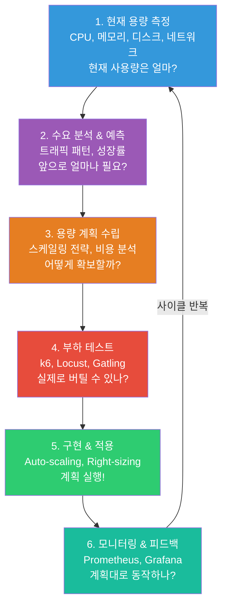
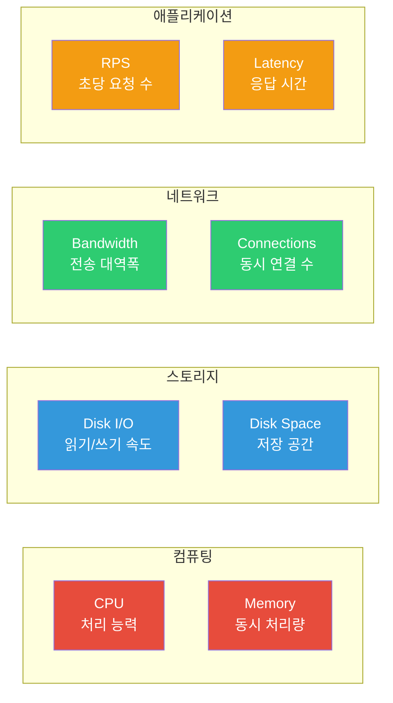
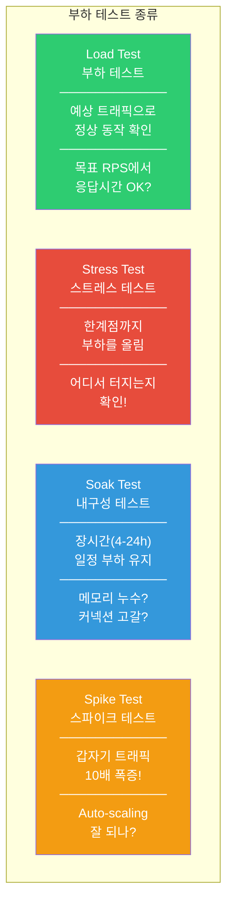
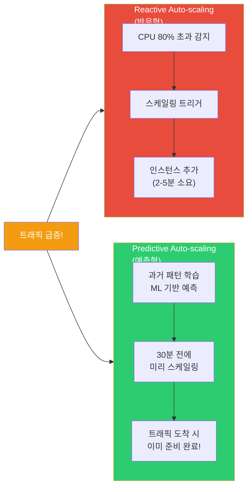
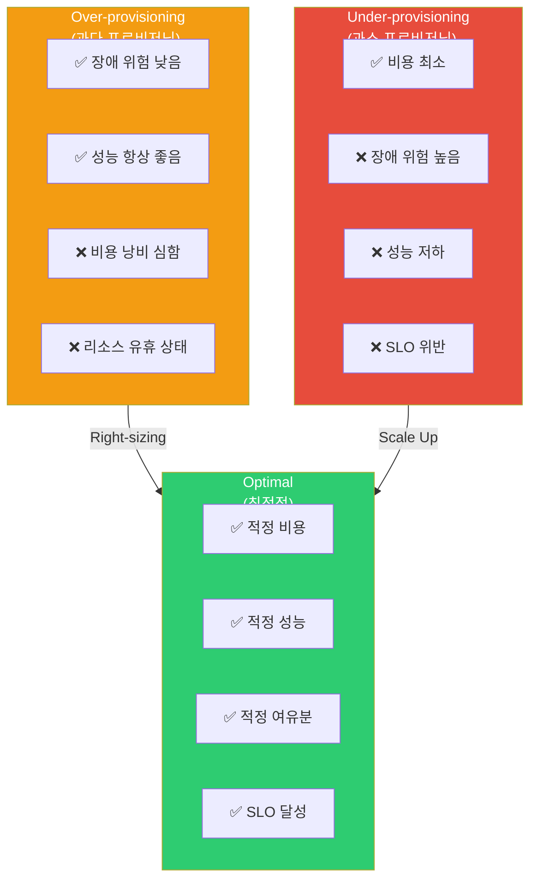

# 용량 계획 (Capacity Planning)

> 서비스가 성장하면 트래픽도, 데이터도, 비용도 함께 성장해요. "서버 늘리면 되지 않나요?"라고 하기엔, 얼마나 늘려야 하는지, 언제 늘려야 하는지, 비용은 감당할 수 있는지를 모르면 결국 **장애 아니면 낭비** 둘 중 하나예요. 용량 계획은 이 모든 질문에 답하는 체계적인 프로세스예요. [EC2 & Auto Scaling](../05-cloud-aws/03-ec2-autoscaling)에서 배운 인프라 스케일링, [비용 최적화](../05-cloud-aws/14-cost)에서 배운 비용 관리, [Prometheus](../08-observability/02-prometheus)에서 배운 메트릭 수집이 여기서 하나로 합쳐져요.

---

## 🎯 왜 용량 계획을/를 알아야 하나요?

### 일상 비유: 식당 운영과 용량 계획

동네에서 인기 있는 식당을 운영한다고 생각해보세요.

- 평일 점심에는 30명, 금요일 저녁에는 80명이 와요 (**트래픽 패턴 분석**)
- 매달 손님이 10%씩 늘고 있어요 (**성장률 예측**)
- 주방이 한 번에 50인분까지만 가능해요 (**현재 용량 파악**)
- 직원을 더 뽑으면 인건비가 올라가요 (**비용-용량 트레이드오프**)
- 금요일 저녁만 바쁜데 매일 알바 10명을 쓰면 낭비예요 (**Right-sizing**)
- "다음 달 크리스마스 특수에 120명이 올 수 있을까?" (**부하 예측**)
- 미리 좌석을 늘리고, 재료를 준비하고, 알바를 구해요 (**용량 확보**)

**용량 계획이 바로 이거예요.** 시스템의 수요를 예측하고, 적절한 리소스를 적시에 확보하는 것.

```
실무에서 용량 계획이 필요한 순간:

• "블랙프라이데이에 트래픽이 5배 늘 텐데 서버가 버틸까?"  → 부하 테스트
• "매달 데이터가 50GB씩 늘고 있어요, 디스크 언제 차나?"   → 성장 예측
• "CPU는 항상 20%인데 인스턴스가 너무 큰 것 같아요"       → Right-sizing
• "갑자기 트래픽 폭증! 스케일링이 너무 느려요"             → Auto-scaling 전략
• "비용을 줄이라는데 성능은 유지해야 해요"                  → 비용-용량 최적화
• "K8s Pod 리소스 설정을 얼마로 해야 하나요?"               → requests/limits 최적화
• "서비스 출시 전에 얼마나 준비해야 하나요?"                 → 용량 산정
• 면접: "대규모 트래픽 대비 경험 말씀해주세요"               → 이 강의 전체
```

---

## 🧠 핵심 개념 잡기

### 용량 계획의 전체 흐름

용량 계획은 한 번 하고 끝나는 게 아니라, **지속적인 사이클**이에요.



### 핵심 용어 정리

| 용어 | 설명 | 비유 |
|------|------|------|
| **Capacity** | 시스템이 처리할 수 있는 최대 부하 | 식당의 최대 좌석 수 |
| **Demand** | 실제로 들어오는 부하(트래픽) | 오늘 온 손님 수 |
| **Headroom** | 여유 용량 (Capacity - Demand) | 빈 좌석 수 |
| **Saturation** | 자원 포화도 (Demand / Capacity) | 좌석 점유율 |
| **Right-sizing** | 실제 사용량에 맞게 리소스 조정 | 큰 매장 → 적절한 크기로 이사 |
| **Forecasting** | 미래 수요 예측 | 크리스마스 손님 수 예상 |
| **Load Testing** | 실제 부하를 시뮬레이션하는 테스트 | 오픈 전 리허설 |
| **Auto-scaling** | 부하에 따라 자동으로 리소스 조절 | 바쁠 때 알바 자동 호출 |

### 용량의 4가지 차원



---

## 🔍 하나씩 자세히 알아보기

### 1. 수요 예측 (Demand Forecasting)

용량 계획의 시작은 **"앞으로 얼마나 필요할까?"** 를 예측하는 거예요.

#### 트래픽 패턴 분석

대부분의 서비스는 예측 가능한 패턴을 가지고 있어요.

```
일간 패턴 (Diurnal Pattern):
────────────────────────────────────────
    ▲ 트래픽
    │
    │              ┌──────┐
    │         ┌────┘      └────┐
    │    ┌────┘                └────┐
    │────┘                          └────
    └──────────────────────────────────────▶ 시간
    0   3   6   9   12  15  18  21  24

    → 출근 시간(9시)부터 올라가고, 점심(12시) 피크, 퇴근 후(18-21시) 두 번째 피크
    → 새벽(0-6시)에는 트래픽이 거의 없음

주간 패턴 (Weekly Pattern):
────────────────────────────────────────
    ▲ 트래픽
    │  ┌──┐ ┌──┐ ┌──┐ ┌──┐ ┌──┐
    │  │  │ │  │ │  │ │  │ │  │ ┌────┐
    │  │  │ │  │ │  │ │  │ │  │ │    │
    │──┘  └─┘  └─┘  └─┘  └─┘  └─┘    └──
    └──────────────────────────────────────▶
    월  화  수  목  금  토  일

    → 쇼핑몰: 주말 트래픽 2-3배
    → B2B SaaS: 평일만 트래픽, 주말은 한산

계절/이벤트 패턴 (Seasonal Pattern):
────────────────────────────────────────
    ▲ 트래픽
    │                              ┌────┐
    │                              │    │  ← 블프/크리스마스
    │  ──────────────────────────┐ │    │
    │                            └─┘    └──
    └──────────────────────────────────────▶
    1월  3월  6월  9월  11월  12월

    → e-커머스: 11-12월 트래픽 5-10배
    → 교육: 3월, 9월 신학기 피크
    → 게임: 여름 방학, 겨울 방학 피크
```

#### 성장률 예측 (Growth Projection)

```python
# 성장률 기반 용량 예측 공식

# 1. 선형 성장 (Linear Growth)
# 매달 일정량 증가
future_demand = current_demand + (growth_per_month * months)
# 예: 현재 1000 RPS, 매달 100 RPS씩 증가
# 6개월 후: 1000 + (100 * 6) = 1600 RPS

# 2. 지수 성장 (Exponential Growth) — 스타트업에 흔함
# 매달 일정 비율 증가
future_demand = current_demand * (1 + growth_rate) ** months
# 예: 현재 1000 RPS, 매달 20% 증가
# 6개월 후: 1000 * (1.2)^6 = 2986 RPS

# 3. 안전 마진 포함 (Production에서는 필수!)
required_capacity = future_demand * safety_margin
# 보통 safety_margin = 1.3 ~ 1.5 (30-50% 여유)
# 2986 * 1.5 = 4479 RPS 용량 필요
```

#### Prometheus를 활용한 수요 예측

```promql
# 지난 30일간 일별 최대 RPS 추세
max_over_time(
  rate(http_requests_total[5m])[1d:]
)

# 선형 회귀로 2주 후 예측 (predict_linear 함수!)
predict_linear(
  node_filesystem_avail_bytes{mountpoint="/"}[30d],
  14 * 24 * 3600    # 14일 후
)
# → "14일 후 디스크 잔여 용량" 예측
# → 0 이하면 디스크가 가득 찬다는 의미!

# CPU 사용량 2주 후 예측
predict_linear(
  avg_over_time(
    node_cpu_seconds_total{mode="idle"}[1h]
  )[30d:1h],
  14 * 24 * 3600
)

# 메모리 사용량 성장 추세
deriv(
  avg_over_time(
    container_memory_usage_bytes{namespace="production"}[1h]
  )[7d:1h]
)
# → 초당 메모리 증가량 (양수면 증가 추세)
```

---

### 2. 부하 테스트 (Load Testing)

예측만으로는 부족해요. **실제로 부하를 걸어봐야** 시스템의 한계를 알 수 있어요.

#### 부하 테스트의 종류



| 테스트 유형 | 부하 수준 | 시간 | 목적 | 질문 |
|------------|----------|------|------|------|
| **Load Test** | 예상 피크의 100% | 15-60분 | 정상 동작 확인 | "1000 RPS에서 응답 500ms 이내?" |
| **Stress Test** | 예상 피크의 150-200% | 15-30분 | 한계점(Breaking Point) 발견 | "어디서 먼저 터지나?" |
| **Soak Test** | 예상 피크의 70-80% | 4-24시간 | 장기 안정성 확인 | "메모리 누수 없나?" |
| **Spike Test** | 순간 5-10배 급증 | 5-10분 | 탄력성 확인 | "Auto-scaling 속도 충분?" |

#### k6로 부하 테스트하기

k6는 JavaScript로 시나리오를 작성하는 현대적인 부하 테스트 도구예요.

```javascript
// load-test.js — k6 부하 테스트 스크립트
import http from 'k6/http';
import { check, sleep } from 'k6';
import { Rate, Trend } from 'k6/metrics';

// 커스텀 메트릭 정의
const errorRate = new Rate('errors');
const apiDuration = new Trend('api_duration');

// ⭐ 시나리오별 부하 패턴 정의
export const options = {
  scenarios: {
    // 시나리오 1: 점진적 증가 (Load Test)
    load_test: {
      executor: 'ramping-vus',
      startVUs: 0,
      stages: [
        { duration: '2m', target: 100 },   // 2분간 0 → 100 VU로 증가
        { duration: '5m', target: 100 },   // 5분간 100 VU 유지
        { duration: '2m', target: 200 },   // 2분간 200 VU로 증가
        { duration: '5m', target: 200 },   // 5분간 200 VU 유지 (피크!)
        { duration: '2m', target: 0 },     // 2분간 점진적 감소
      ],
    },

    // 시나리오 2: 스파이크 테스트
    spike_test: {
      executor: 'ramping-vus',
      startVUs: 0,
      startTime: '16m',                    // load_test 끝난 후 시작
      stages: [
        { duration: '10s', target: 500 },  // 10초 만에 500 VU로 폭증!
        { duration: '1m', target: 500 },   // 1분간 유지
        { duration: '10s', target: 0 },    // 빠르게 감소
      ],
    },
  },

  // ⭐ 성공/실패 기준 (SLO 기반)
  thresholds: {
    http_req_duration: ['p(95)<500'],       // 95% 요청이 500ms 이내
    http_req_duration: ['p(99)<1000'],      // 99% 요청이 1000ms 이내
    errors: ['rate<0.01'],                  // 에러율 1% 미만
    http_req_failed: ['rate<0.01'],         // HTTP 실패율 1% 미만
  },
};

// VU(가상 유저)가 반복 실행하는 함수
export default function () {
  // 1. 메인 페이지 요청
  const mainRes = http.get('https://api.myapp.com/');
  check(mainRes, {
    'status is 200': (r) => r.status === 200,
    'response time < 500ms': (r) => r.timings.duration < 500,
  });

  // 2. API 호출 (검색)
  const searchRes = http.get('https://api.myapp.com/search?q=test');
  apiDuration.add(searchRes.timings.duration);
  check(searchRes, {
    'search status 200': (r) => r.status === 200,
    'search < 300ms': (r) => r.timings.duration < 300,
  });
  errorRate.add(searchRes.status !== 200);

  // 3. POST 요청 (주문)
  const payload = JSON.stringify({
    product_id: Math.floor(Math.random() * 1000),
    quantity: 1,
  });
  const orderRes = http.post('https://api.myapp.com/orders', payload, {
    headers: { 'Content-Type': 'application/json' },
  });
  check(orderRes, {
    'order created': (r) => r.status === 201,
  });

  sleep(1); // 1초 대기 (실제 사용자 행동 시뮬레이션)
}
```

```bash
# k6 설치
brew install k6            # macOS
choco install k6           # Windows
sudo apt install k6        # Linux (snap)

# 부하 테스트 실행
k6 run load-test.js

# 결과를 Prometheus로 보내기 (Grafana 대시보드 연동)
k6 run --out experimental-prometheus-rw load-test.js

# 결과를 InfluxDB로 보내기
k6 run --out influxdb=http://localhost:8086/k6 load-test.js

# 클라우드 실행 (분산 부하 테스트)
k6 cloud load-test.js
```

```
# k6 실행 결과 예시
     ✓ status is 200
     ✓ response time < 500ms
     ✗ search < 300ms
      ↳ 92% — ✓ 18400 / ✗ 1600        ← 8%가 300ms 초과!

     checks.........................: 97.33% ✓ 58400  ✗ 1600
     data_received..................: 125 MB  1.2 MB/s
     data_sent......................: 15 MB   150 kB/s
     http_req_duration..............: avg=187ms  min=12ms  max=2.3s  p(90)=350ms  p(95)=480ms
     http_req_failed................: 0.50%   ✓ 300    ✗ 59700
     http_reqs......................: 60000   600/s     ← 초당 600 요청 처리
     iteration_duration.............: avg=3.2s  min=2.1s  max=8.5s
     vus............................: 200     min=0    max=200
     vus_max........................: 500     min=500  max=500

     # 분석:
     # ✅ 에러율 0.5% < 1% (OK)
     # ✅ p(95) 480ms < 500ms (겨우 통과!)
     # ⚠️ 검색 API가 8%나 300ms 초과 → 최적화 필요!
     # ⚠️ 최대 응답시간 2.3초 → 이상치 확인 필요
```

#### Locust로 부하 테스트하기

Python 기반이라 복잡한 시나리오 작성이 쉬워요.

```python
# locustfile.py — Locust 부하 테스트 스크립트
from locust import HttpUser, task, between, events
import random
import logging

class WebUser(HttpUser):
    """일반 웹 사용자 시뮬레이션"""
    wait_time = between(1, 3)  # 1~3초 사이 대기 (실제 사용자처럼)

    def on_start(self):
        """테스트 시작 시 로그인"""
        self.client.post("/login", json={
            "username": f"user_{random.randint(1, 10000)}",
            "password": "test123"
        })

    @task(5)  # 가중치 5 — 가장 자주 호출
    def browse_products(self):
        """상품 목록 조회"""
        self.client.get("/api/products?page=1&limit=20")

    @task(3)  # 가중치 3
    def search_product(self):
        """상품 검색"""
        keywords = ["laptop", "phone", "tablet", "headphones"]
        self.client.get(f"/api/search?q={random.choice(keywords)}")

    @task(1)  # 가중치 1 — 가끔 호출
    def place_order(self):
        """주문하기"""
        self.client.post("/api/orders", json={
            "product_id": random.randint(1, 1000),
            "quantity": random.randint(1, 3),
        })

class ApiUser(HttpUser):
    """API 클라이언트 시뮬레이션 (모바일 앱 등)"""
    wait_time = between(0.5, 1)  # API 호출은 더 빈번함
    weight = 3                    # WebUser보다 3배 많이 생성

    @task
    def health_check(self):
        self.client.get("/health")

    @task(10)
    def get_data(self):
        self.client.get(f"/api/data/{random.randint(1, 10000)}")
```

```bash
# Locust 설치 및 실행
pip install locust

# 웹 UI 모드 (http://localhost:8089에서 제어)
locust -f locustfile.py --host=https://api.myapp.com

# 헤드리스 모드 (CI/CD 파이프라인용)
locust -f locustfile.py \
  --host=https://api.myapp.com \
  --headless \
  --users 500 \
  --spawn-rate 10 \
  --run-time 10m \
  --csv=results

# 분산 모드 (여러 머신에서 부하 생성)
# Master:
locust -f locustfile.py --master
# Workers:
locust -f locustfile.py --worker --master-host=192.168.1.100
```

#### Gatling으로 부하 테스트하기

JVM 기반으로 높은 성능, 아름다운 HTML 리포트가 특징이에요.

```scala
// GatlingSimulation.scala
import io.gatling.core.Predef._
import io.gatling.http.Predef._
import scala.concurrent.duration._

class CapacityTest extends Simulation {

  val httpProtocol = http
    .baseUrl("https://api.myapp.com")
    .acceptHeader("application/json")
    .userAgentHeader("Gatling/CapacityTest")

  // 시나리오 정의
  val browseScenario = scenario("Browse Products")
    .exec(
      http("Get Products")
        .get("/api/products")
        .check(status.is(200))
        .check(responseTimeInMillis.lte(500))
    )
    .pause(1, 3)  // 1-3초 대기
    .exec(
      http("Search")
        .get("/api/search?q=laptop")
        .check(status.is(200))
    )

  // 부하 프로필 설정
  setUp(
    browseScenario.inject(
      // 스텝 부하: 30초마다 50명씩 증가, 최대 500명
      incrementUsersPerSec(50)
        .times(10)
        .eachLevelLasting(30.seconds)
        .separatedByRampsLasting(10.seconds)
        .startingFrom(10)
    )
  ).protocols(httpProtocol)
   .assertions(
     global.responseTime.percentile3.lt(1000),  // p95 < 1000ms
     global.successfulRequests.percent.gt(99)    // 성공률 > 99%
   )
}
```

#### 부하 테스트 도구 비교

| 기능 | k6 | Locust | Gatling |
|------|-----|--------|---------|
| **언어** | JavaScript | Python | Scala/Java |
| **프로토콜** | HTTP, gRPC, WS | HTTP, 커스텀 | HTTP, WS, JMS |
| **리소스 효율** | 매우 좋음 (Go) | 보통 (Python) | 좋음 (JVM) |
| **CI/CD 통합** | 매우 쉬움 | 쉬움 | 보통 |
| **분산 테스트** | k6 Cloud | Master-Worker | 자체 지원 |
| **리포트** | CLI + 연동 | 웹 UI | HTML (아름다움!) |
| **학습 곡선** | 낮음 | 매우 낮음 | 높음 |
| **추천 상황** | CI/CD 파이프라인, SRE | 빠른 프로토타이핑 | 대규모 엔터프라이즈 |

---

### 3. Auto-scaling 전략

부하 테스트로 한계를 알았으니, 이제 **자동으로 대응하는 전략**을 세워야 해요.

#### Reactive vs Predictive Auto-scaling



| 전략 | 동작 방식 | 장점 | 단점 | 적합한 상황 |
|------|----------|------|------|------------|
| **Reactive** | 메트릭 임계값 초과 시 스케일링 | 구현 쉬움, 범용적 | 지연 발생 (2-5분) | 점진적 증가 패턴 |
| **Predictive** | 과거 패턴 기반 미리 스케일링 | 지연 없음 | 예측 오류 가능 | 규칙적 패턴 (출퇴근) |
| **Scheduled** | 시간 기반 스케줄 스케일링 | 확실한 제어 | 유연성 부족 | 알려진 이벤트 (세일) |
| **Mixed** | 위 전략 조합 | 최적의 대응 | 복잡한 설정 | 프로덕션 환경 |

#### AWS Auto Scaling 설정

```yaml
# CloudFormation - Predictive + Reactive 혼합 전략
AWSTemplateFormatVersion: '2010-09-09'

Resources:
  # Auto Scaling Group
  WebASG:
    Type: AWS::AutoScaling::AutoScalingGroup
    Properties:
      LaunchTemplate:
        LaunchTemplateId: !Ref WebLaunchTemplate
        Version: !GetAtt WebLaunchTemplate.LatestVersionNumber
      MinSize: 2                           # 최소 2대 (가용성)
      MaxSize: 20                          # 최대 20대 (비용 상한)
      DesiredCapacity: 4                   # 평상시 4대
      VPCZoneIdentifier:                   # Multi-AZ 배치
        - !Ref SubnetA
        - !Ref SubnetB
      HealthCheckType: ELB
      HealthCheckGracePeriod: 300          # 5분간 헬스체크 유예

  # 1. Reactive: Target Tracking (CPU 기반)
  CPUScalingPolicy:
    Type: AWS::AutoScaling::ScalingPolicy
    Properties:
      AutoScalingGroupName: !Ref WebASG
      PolicyType: TargetTrackingScaling
      TargetTrackingConfiguration:
        PredefinedMetricSpecification:
          PredefinedMetricType: ASGAverageCPUUtilization
        TargetValue: 60                    # CPU 60% 유지 목표
        ScaleInCooldown: 300               # 스케일 다운 쿨다운 5분
        ScaleOutCooldown: 60               # 스케일 업 쿨다운 1분 (빠르게!)

  # 2. Reactive: Target Tracking (요청 수 기반)
  RequestScalingPolicy:
    Type: AWS::AutoScaling::ScalingPolicy
    Properties:
      AutoScalingGroupName: !Ref WebASG
      PolicyType: TargetTrackingScaling
      TargetTrackingConfiguration:
        PredefinedMetricSpecification:
          PredefinedMetricType: ALBRequestCountPerTarget
          ResourceLabel: !Sub "${ALB}/${TargetGroup}"
        TargetValue: 1000                  # 인스턴스당 1000 요청/분

  # 3. Scheduled: 출근 시간 전 미리 스케일 업
  MorningScaleUp:
    Type: AWS::AutoScaling::ScheduledAction
    Properties:
      AutoScalingGroupName: !Ref WebASG
      DesiredCapacity: 8                   # 08:30에 8대로!
      Recurrence: "30 8 * * MON-FRI"       # 평일 08:30

  # 4. Scheduled: 퇴근 후 스케일 다운
  NightScaleDown:
    Type: AWS::AutoScaling::ScheduledAction
    Properties:
      AutoScalingGroupName: !Ref WebASG
      DesiredCapacity: 2                   # 22:00에 2대로
      Recurrence: "0 22 * * *"             # 매일 22:00
```

```bash
# AWS Predictive Scaling 활성화 (AWS CLI)
aws autoscaling put-scaling-policy \
  --auto-scaling-group-name web-asg \
  --policy-name predictive-scaling \
  --policy-type PredictiveScaling \
  --predictive-scaling-configuration '{
    "MetricSpecifications": [{
      "TargetValue": 60,
      "PredefinedMetricPairSpecification": {
        "PredefinedMetricType": "ASGCPUUtilization"
      }
    }],
    "Mode": "ForecastAndScale",
    "SchedulingBufferTime": 300
  }'
# → AWS가 과거 14일 데이터를 학습해서 미래 48시간을 예측!
# → SchedulingBufferTime: 5분 전에 미리 스케일링
```

---

### 4. Right-sizing (적정 크기 조정)

Auto-scaling으로 "개수"를 조절했다면, Right-sizing은 각 인스턴스의 **"크기"를 최적화**하는 거예요.

#### Right-sizing이 필요한 신호

```
Right-sizing이 필요한 신호들:

✅ CPU 사용률이 항상 10-20%         → 인스턴스 크기를 줄이세요!
✅ 메모리 사용률이 항상 80-90%       → 메모리 최적화 인스턴스로 변경
✅ 디스크 I/O 대기가 길다            → SSD(gp3) 또는 io2로 업그레이드
✅ 네트워크가 자주 병목              → 네트워크 최적화 인스턴스 고려
✅ m5.xlarge인데 CPU만 높다          → c5.large가 더 효율적

비용 절감 예시:
┌──────────────────────────────────────────────┐
│ Before: m5.2xlarge × 10대                    │
│ CPU: 20%, Memory: 30%                        │
│ 비용: $0.384/h × 10 = $3.84/h = $2,764/월   │
│                                              │
│ After: m5.large × 10대                       │
│ CPU: 60%, Memory: 70%  (적정 수준!)          │
│ 비용: $0.096/h × 10 = $0.96/h = $691/월     │
│                                              │
│ 절감: $2,073/월 (75% 절감!)                  │
└──────────────────────────────────────────────┘
```

#### AWS Compute Optimizer 활용

```bash
# Compute Optimizer 권장 사항 조회
aws compute-optimizer get-ec2-instance-recommendations \
  --filters Name=Finding,Values=OVER_PROVISIONED \
  --output table

# 결과 예시:
# ┌─────────────────────┬─────────────┬───────────────┬─────────────┐
# │ Instance ID         │ Current     │ Recommended   │ Savings     │
# ├─────────────────────┼─────────────┼───────────────┼─────────────┤
# │ i-0abc123def456     │ m5.2xlarge  │ m5.large      │ $198/month  │
# │ i-0def789abc012     │ r5.xlarge   │ t3.xlarge     │ $89/month   │
# │ i-0ghi345jkl678     │ c5.4xlarge  │ c5.2xlarge    │ $245/month  │
# └─────────────────────┴─────────────┴───────────────┴─────────────┘

# EBS 볼륨 최적화 권장 사항
aws compute-optimizer get-ebs-volume-recommendations \
  --filters Name=Finding,Values=NOT_OPTIMIZED
```

---

### 5. Kubernetes 리소스 최적화

K8s에서는 `requests`와 `limits` 설정이 곧 용량 계획이에요.

#### requests와 limits 이해하기

```yaml
# Pod 리소스 설정 — 올바른 예시
apiVersion: v1
kind: Pod
metadata:
  name: myapp
spec:
  containers:
  - name: app
    image: myapp:latest
    resources:
      requests:                    # ⭐ "최소한 이만큼은 필요해요"
        cpu: "250m"                # 0.25 vCPU (스케줄링 기준)
        memory: "256Mi"            # 256MB (스케줄링 기준)
      limits:                      # ⭐ "최대 이만큼까지만 허용"
        cpu: "1000m"               # 1 vCPU (초과 시 throttling)
        memory: "512Mi"            # 512MB (초과 시 OOMKilled!)

# requests vs limits 비유:
# ────────────────────────────────────────────────────────
# requests = 식당 예약 (이만큼은 보장해주세요)
# limits   = 신용카드 한도 (이 이상은 안 돼요!)
#
# requests가 너무 크면? → 노드에 Pod를 적게 배치 → 리소스 낭비
# requests가 너무 작으면? → 과다 배치 → 성능 저하, OOM
# limits가 너무 크면? → 한 Pod가 노드 자원 독점 가능
# limits가 너무 작으면? → 불필요한 throttling, OOMKilled 빈발
```

#### 최적 requests/limits 찾기

```bash
# 1. 현재 실제 사용량 확인 (kubectl top)
kubectl top pods -n production --sort-by=cpu
# NAME              CPU(cores)   MEMORY(bytes)
# myapp-abc-123     45m          180Mi
# myapp-def-456     52m          175Mi
# myapp-ghi-789     38m          190Mi
# → 평균 CPU: ~45m, 평균 Memory: ~182Mi

# 2. Prometheus로 장기 사용량 분석
```

```promql
# CPU 사용량 p95 (지난 7일)
quantile_over_time(0.95,
  rate(container_cpu_usage_seconds_total{
    namespace="production",
    container="app"
  }[5m])[7d:]
) * 1000
# → 결과: 85m (85 밀리코어)
# → requests를 100m 정도로 설정하면 적절

# CPU 사용량 p99 (limits 설정 참고)
quantile_over_time(0.99,
  rate(container_cpu_usage_seconds_total{
    namespace="production",
    container="app"
  }[5m])[7d:]
) * 1000
# → 결과: 250m
# → limits를 300-500m 정도로 설정

# 메모리 사용량 최대값 (OOM 방지)
max_over_time(
  container_memory_working_set_bytes{
    namespace="production",
    container="app"
  }[7d]
) / 1024 / 1024
# → 결과: 320Mi
# → limits를 400-512Mi로 설정 (여유분 포함)

# 리소스 낭비율 확인 (requests 대비 실제 사용률)
avg(
  rate(container_cpu_usage_seconds_total{namespace="production"}[5m])
) by (pod)
/
avg(
  kube_pod_container_resource_requests{resource="cpu", namespace="production"}
) by (pod)
# → 0.3이면 requests의 30%만 사용 중 → 70% 낭비!
```

#### VPA (Vertical Pod Autoscaler)

리소스 requests/limits를 자동으로 최적화해줘요.

```yaml
# VPA 설치 후 설정
apiVersion: autoscaling.k8s.io/v1
kind: VerticalPodAutoscaler
metadata:
  name: myapp-vpa
  namespace: production
spec:
  targetRef:
    apiVersion: apps/v1
    kind: Deployment
    name: myapp

  updatePolicy:
    updateMode: "Auto"          # ⭐ Off / Initial / Auto
    # Off: 권장값만 보여줌 (안전, 시작은 이걸로!)
    # Initial: Pod 생성 시에만 적용
    # Auto: 실행 중인 Pod도 재시작하면서 적용

  resourcePolicy:
    containerPolicies:
    - containerName: app
      minAllowed:               # 최소 보장
        cpu: "50m"
        memory: "128Mi"
      maxAllowed:               # 최대 한도
        cpu: "2000m"
        memory: "2Gi"
      controlledResources:
        - cpu
        - memory
```

```bash
# VPA 권장값 확인 (updateMode: Off일 때 유용!)
kubectl describe vpa myapp-vpa
# Recommendation:
#   Container Recommendations:
#     Container Name: app
#     Lower Bound:                    # 최소 권장
#       Cpu:     50m
#       Memory:  180Mi
#     Target:                         # ⭐ 권장값 (이걸 쓰세요!)
#       Cpu:     120m
#       Memory:  256Mi
#     Upper Bound:                    # 최대 권장
#       Cpu:     300m
#       Memory:  512Mi
#     Uncapped Target:                # 제한 없는 권장값
#       Cpu:     120m
#       Memory:  256Mi

# → requests: cpu=120m, memory=256Mi로 설정하면 최적!
```

#### HPA + VPA + KEDA 조합 전략

```yaml
# ⚠️ 주의: HPA(CPU 기반)와 VPA는 동시에 쓰면 충돌!
# → HPA는 커스텀 메트릭으로, VPA는 CPU/Memory로 분리하거나
# → KEDA를 HPA 대신 사용

# KEDA: 이벤트 기반 오토스케일링 (0→N 가능!)
apiVersion: keda.sh/v1alpha1
kind: ScaledObject
metadata:
  name: myapp-scaler
  namespace: production
spec:
  scaleTargetRef:
    name: myapp
  pollingInterval: 15                 # 15초마다 체크
  cooldownPeriod: 60                  # 스케일다운 대기 60초
  idleReplicaCount: 0                 # ⭐ 트래픽 없으면 0으로! (비용 절감)
  minReplicaCount: 1                  # 트래픽 있을 때 최소 1개
  maxReplicaCount: 50                 # 최대 50개

  triggers:
  # 1. Prometheus 메트릭 기반
  - type: prometheus
    metadata:
      serverAddress: http://prometheus.monitoring:9090
      metricName: http_requests_per_second
      query: |
        sum(rate(http_requests_total{service="myapp"}[2m]))
      threshold: "100"                # 100 RPS당 Pod 1개

  # 2. AWS SQS 큐 길이 기반
  - type: aws-sqs-queue
    metadata:
      queueURL: https://sqs.ap-northeast-2.amazonaws.com/123456789/orders
      queueLength: "5"               # 메시지 5개당 Pod 1개
      awsRegion: ap-northeast-2

  # 3. Cron 기반 (시간대별 스케일링)
  - type: cron
    metadata:
      timezone: Asia/Seoul
      start: "0 8 * * MON-FRI"       # 평일 08:00 시작
      end: "0 20 * * MON-FRI"        # 평일 20:00 종료
      desiredReplicas: "5"            # 업무 시간에는 최소 5개
```

```
HPA vs VPA vs KEDA — 언제 뭘 쓸까?

┌──────────────────────────────────────────────────────────────┐
│ 상황                           │ 추천 도구                   │
├──────────────────────────────────────────────────────────────┤
│ CPU/메모리 기반 수평 확장       │ HPA                        │
│ requests/limits 자동 최적화    │ VPA (Off 모드로 시작)       │
│ 이벤트/큐 기반 확장            │ KEDA                       │
│ 0→N 스케일링 (비용 절감)       │ KEDA (idleReplicaCount: 0) │
│ 커스텀 메트릭 기반 확장         │ HPA v2 또는 KEDA           │
│ ML 기반 예측 스케일링           │ KEDA + Prometheus 조합     │
│                                                              │
│ ⭐ 실무 추천 조합:                                           │
│ VPA(Off) → 권장값 확인 → requests/limits 수동 설정           │
│ + KEDA → 이벤트 기반 수평 확장                               │
│ + Cluster Autoscaler → 노드 자동 확장                        │
└──────────────────────────────────────────────────────────────┘
```

---

### 6. 비용-용량 트레이드오프 (Cost-Capacity Tradeoffs)

용량과 비용은 항상 줄다리기 관계예요. **적절한 균형점**을 찾는 게 핵심이에요.



#### 비용 최적화 전략 계층

```
비용 최적화 피라미드 (아래부터 적용!):

Level 5: 아키텍처 최적화
         ┌───────────────┐
         │  서버리스 전환  │  ← 가장 큰 절감, 가장 큰 노력
         │  캐싱 레이어   │
         └───────────────┘
Level 4: 요금제 최적화
       ┌───────────────────┐
       │ Savings Plans / RI │
       │ Spot Instance      │
       └───────────────────┘
Level 3: Auto-scaling
     ┌───────────────────────┐
     │ HPA / KEDA / Predictive│
     │ 야간/주말 스케일 다운   │
     └───────────────────────┘
Level 2: Right-sizing
   ┌───────────────────────────┐
   │ 인스턴스 타입 최적화        │
   │ Over-provisioned 줄이기    │
   └───────────────────────────┘
Level 1: 유휴 리소스 제거            ← 가장 쉬움, 즉시 효과!
 ┌───────────────────────────────┐
 │ 안 쓰는 EC2, EBS, EIP 삭제    │
 │ 개발 환경 야간 중지            │
 └───────────────────────────────┘
```

#### 비용-용량 계산 시트

```python
# 용량 계획 비용 시뮬레이션 스크립트
import math

# ===== 입력 파라미터 =====
current_rps = 500                # 현재 초당 요청 수
growth_rate = 0.15               # 월 15% 성장
months_ahead = 6                 # 6개월 예측
safety_margin = 1.3              # 30% 안전 마진

# 인스턴스 성능 (부하 테스트 결과 기반)
rps_per_instance = {
    "t3.medium":  150,           # $0.0416/h
    "m5.large":   300,           # $0.096/h
    "c5.xlarge":  500,           # $0.17/h
    "c5.2xlarge": 900,           # $0.34/h
}

instance_cost_per_hour = {
    "t3.medium":  0.0416,
    "m5.large":   0.096,
    "c5.xlarge":  0.17,
    "c5.2xlarge": 0.34,
}

# ===== 계산 =====
# 6개월 후 예상 RPS
future_rps = current_rps * (1 + growth_rate) ** months_ahead
required_rps = future_rps * safety_margin

print(f"현재 RPS: {current_rps}")
print(f"{months_ahead}개월 후 예상 RPS: {future_rps:.0f}")
print(f"안전 마진 포함 필요 RPS: {required_rps:.0f}")
print(f"\n{'인스턴스 타입':<15} {'필요 수량':>8} {'월 비용':>12} {'RPS당 비용':>12}")
print("-" * 55)

for instance_type, rps_cap in rps_per_instance.items():
    count = math.ceil(required_rps / rps_cap)
    monthly_cost = count * instance_cost_per_hour[instance_type] * 730  # 730h/월
    cost_per_rps = monthly_cost / required_rps
    print(f"{instance_type:<15} {count:>8}대 ${monthly_cost:>10,.0f} ${cost_per_rps:>10.3f}")

# 출력 예시:
# 현재 RPS: 500
# 6개월 후 예상 RPS: 1156
# 안전 마진 포함 필요 RPS: 1503
#
# 인스턴스 타입    필요 수량       월 비용      RPS당 비용
# -------------------------------------------------------
# t3.medium          11대      $334        $0.222
# m5.large            6대      $420        $0.280
# c5.xlarge           4대      $496        $0.330
# c5.2xlarge          2대      $496        $0.330
#
# → t3.medium 11대가 가장 저렴하지만, 관리 오버헤드가 큼
# → m5.large 6대가 비용 대비 관리 효율 최적!
```

#### Spot + On-Demand + Reserved 혼합 전략

```
인스턴스 혼합 전략 (Fleet 구성):

┌─────────────────────────────────────────────────────────┐
│                                                         │
│  ┌─────────────────┐  ← Reserved/Savings Plans (40%)   │
│  │ 기본 부하 처리   │     항상 필요한 최소 용량           │
│  │ On-Demand 가격   │     1-3년 약정 → 30-60% 할인      │
│  │ 의 40-60% 비용   │                                   │
│  ├─────────────────┤  ← On-Demand (30%)                │
│  │ 안정적 추가 부하  │     예측 불가 기본 트래픽 처리      │
│  │ 100% 가격       │     언제든 사용 가능                │
│  ├─────────────────┤  ← Spot Instance (30%)            │
│  │ 피크 부하 처리   │     최대 90% 할인!                 │
│  │ On-Demand 가격   │     중단 가능 → stateless 워크로드  │
│  │ 의 10-30% 비용   │     배치 처리, 부하 테스트에 적합   │
│  └─────────────────┘                                    │
│                                                         │
│  예시) 10대 필요:                                        │
│  - Reserved: 4대 (항상 켜짐) → $0.06/h × 4 = $0.24/h   │
│  - On-Demand: 3대 (기본)    → $0.096/h × 3 = $0.288/h  │
│  - Spot: 3대 (피크)          → $0.03/h × 3 = $0.09/h   │
│  합계: $0.618/h vs 전부 On-Demand: $0.96/h              │
│  → 약 36% 절감!                                         │
└─────────────────────────────────────────────────────────┘
```

---

### 7. 용량 계획 도구 & 대시보드

#### Grafana 용량 계획 대시보드

```promql
# ===== 용량 계획 대시보드용 PromQL 쿼리 모음 =====

# 1. CPU Saturation (포화도) — 노드별
1 - avg(rate(node_cpu_seconds_total{mode="idle"}[5m])) by (instance)
# → 0.7 이상이면 주의, 0.85 이상이면 위험!

# 2. Memory Saturation — 노드별
1 - (node_memory_MemAvailable_bytes / node_memory_MemTotal_bytes)
# → 0.8 이상이면 주의

# 3. Disk Space 예측 — 언제 차나?
predict_linear(node_filesystem_avail_bytes{mountpoint="/"}[7d], 30*24*3600)
# → 30일 후 남은 디스크 용량 예측
# → 음수면 30일 내에 디스크가 가득 참!

# 4. Pod별 리소스 낭비율 (Waste Ratio)
# CPU 낭비
1 - (
  sum(rate(container_cpu_usage_seconds_total{namespace="production"}[5m])) by (pod)
  /
  sum(kube_pod_container_resource_requests{resource="cpu",namespace="production"}) by (pod)
)
# → 0.7이면 70% 낭비 (requests 대비 30%만 사용)

# 5. Cluster 전체 용량 현황
# 할당 가능 CPU 대비 요청된 CPU
sum(kube_pod_container_resource_requests{resource="cpu"})
/
sum(kube_node_status_allocatable{resource="cpu"})
# → 0.8 이상이면 노드 추가 필요!

# 6. Namespace별 비용 추정 (CPU 기준)
sum(
  rate(container_cpu_usage_seconds_total[5m])
) by (namespace) * 730 * 0.033
# 730시간/월 × $0.033/vCPU/h (대략적인 단가)
# → namespace별 월간 CPU 비용 추정

# 7. HPA 상태 모니터링
kube_horizontalpodautoscaler_status_current_replicas
  / kube_horizontalpodautoscaler_spec_max_replicas
# → 1.0이면 이미 최대! maxReplicas 늘려야 할 수도
```

#### 용량 계획 Alerting Rules

```yaml
# prometheus-capacity-alerts.yaml
apiVersion: monitoring.coreos.com/v1
kind: PrometheusRule
metadata:
  name: capacity-planning-alerts
  namespace: monitoring
spec:
  groups:
  - name: capacity-planning
    interval: 5m
    rules:
    # 1. 디스크 30일 내 소진 예측
    - alert: DiskWillFillIn30Days
      expr: |
        predict_linear(
          node_filesystem_avail_bytes{mountpoint="/"}[7d],
          30*24*3600
        ) < 0
      for: 1h
      labels:
        severity: warning
        team: sre
      annotations:
        summary: "디스크가 30일 내 가득 찰 예정 ({{ $labels.instance }})"
        description: "현재 추세로 30일 후 디스크 부족 예상. 용량 확장 계획 필요."

    # 2. CPU 포화도 높음
    - alert: HighCPUSaturation
      expr: |
        1 - avg(rate(node_cpu_seconds_total{mode="idle"}[5m])) by (instance) > 0.85
      for: 15m
      labels:
        severity: warning
      annotations:
        summary: "CPU 사용률 85% 이상 ({{ $labels.instance }})"

    # 3. HPA가 max에 도달
    - alert: HPAAtMaxReplicas
      expr: |
        kube_horizontalpodautoscaler_status_current_replicas
        == kube_horizontalpodautoscaler_spec_max_replicas
      for: 10m
      labels:
        severity: critical
      annotations:
        summary: "HPA {{ $labels.horizontalpodautoscaler }}가 최대 복제본에 도달"
        description: "maxReplicas 증가 또는 Pod당 성능 최적화 필요."

    # 4. Cluster 용량 80% 이상 사용
    - alert: ClusterCPUCapacityHigh
      expr: |
        sum(kube_pod_container_resource_requests{resource="cpu"})
        / sum(kube_node_status_allocatable{resource="cpu"}) > 0.8
      for: 10m
      labels:
        severity: warning
      annotations:
        summary: "클러스터 CPU 용량 80% 이상 사용"
        description: "노드 추가 또는 requests 최적화 필요."

    # 5. 메모리 OOM 위험
    - alert: PodMemoryNearLimit
      expr: |
        container_memory_working_set_bytes{container!=""}
        / container_spec_memory_limit_bytes{container!=""} > 0.9
      for: 5m
      labels:
        severity: warning
      annotations:
        summary: "Pod {{ $labels.pod }}가 메모리 한도의 90% 사용 중"
        description: "OOMKilled 위험. limits 증가 또는 메모리 누수 확인 필요."
```

---

## 💻 직접 해보기

### 실습 1: k6로 API 부하 테스트

```bash
# 1. k6 설치 (macOS 기준)
brew install k6

# 2. 간단한 테스트 애플리케이션 준비 (Docker)
docker run -d --name test-api -p 8080:8080 \
  kennethreitz/httpbin

# 3. 부하 테스트 스크립트 작성
```

```javascript
// quick-load-test.js
import http from 'k6/http';
import { check, sleep } from 'k6';

export const options = {
  stages: [
    { duration: '30s', target: 20 },    // Ramp up
    { duration: '1m',  target: 20 },    // 유지
    { duration: '30s', target: 50 },    // 피크
    { duration: '1m',  target: 50 },    // 피크 유지
    { duration: '30s', target: 0 },     // Ramp down
  ],
  thresholds: {
    http_req_duration: ['p(95)<500'],
    http_req_failed: ['rate<0.01'],
  },
};

export default function () {
  const res = http.get('http://localhost:8080/get');
  check(res, {
    'status 200': (r) => r.status === 200,
    'fast response': (r) => r.timings.duration < 200,
  });
  sleep(0.5);
}
```

```bash
# 4. 부하 테스트 실행
k6 run quick-load-test.js

# 5. 결과 분석
# → p(95) 응답시간, 에러율, 초당 처리량 확인
# → threshold 통과 여부 확인

# 6. 결과를 JSON으로 내보내기 (대시보드 연동용)
k6 run --out json=results.json quick-load-test.js
```

### 실습 2: Kubernetes VPA로 리소스 최적화

```bash
# 1. VPA 설치
git clone https://github.com/kubernetes/autoscaler.git
cd autoscaler/vertical-pod-autoscaler
./hack/vpa-up.sh

# 2. 테스트 Deployment 생성
kubectl apply -f - << 'EOF'
apiVersion: apps/v1
kind: Deployment
metadata:
  name: capacity-test
spec:
  replicas: 3
  selector:
    matchLabels:
      app: capacity-test
  template:
    metadata:
      labels:
        app: capacity-test
    spec:
      containers:
      - name: app
        image: nginx
        resources:
          requests:
            cpu: "500m"          # 일부러 크게 설정
            memory: "512Mi"      # 일부러 크게 설정
          limits:
            cpu: "1000m"
            memory: "1Gi"
EOF

# 3. VPA 생성 (Off 모드 — 권장값만 확인)
kubectl apply -f - << 'EOF'
apiVersion: autoscaling.k8s.io/v1
kind: VerticalPodAutoscaler
metadata:
  name: capacity-test-vpa
spec:
  targetRef:
    apiVersion: apps/v1
    kind: Deployment
    name: capacity-test
  updatePolicy:
    updateMode: "Off"
EOF

# 4. 잠시 후 VPA 권장값 확인
kubectl describe vpa capacity-test-vpa

# 5. 권장값에 따라 수동으로 requests/limits 조정
# (실습에서는 VPA 권장값을 확인하는 것만으로도 큰 의미가 있어요!)
```

### 실습 3: 용량 계획 계산기

```python
#!/usr/bin/env python3
"""capacity_calculator.py — 간단한 용량 계획 계산기"""
import math

def calculate_capacity(
    current_rps: float,
    growth_rate_monthly: float,
    months: int,
    safety_margin: float,
    rps_per_pod: float,
    cost_per_pod_hour: float,
):
    """용량 계획을 계산해요."""

    print("=" * 60)
    print("          용량 계획 계산 결과")
    print("=" * 60)

    for m in range(0, months + 1):
        future_rps = current_rps * (1 + growth_rate_monthly) ** m
        required_rps = future_rps * safety_margin
        pods_needed = math.ceil(required_rps / rps_per_pod)
        monthly_cost = pods_needed * cost_per_pod_hour * 730

        bar = "#" * min(pods_needed, 40)
        status = ""
        if m == 0:
            status = " ← 현재"

        print(f"  {m:>2}개월 후 | RPS: {future_rps:>7.0f} | "
              f"Pod: {pods_needed:>3}개 | "
              f"비용: ${monthly_cost:>7,.0f}/월 | "
              f"{bar}{status}")

    print("=" * 60)

    # 최종 요약
    final_rps = current_rps * (1 + growth_rate_monthly) ** months
    final_pods = math.ceil(final_rps * safety_margin / rps_per_pod)
    final_cost = final_pods * cost_per_pod_hour * 730
    current_pods = math.ceil(current_rps * safety_margin / rps_per_pod)
    current_cost = current_pods * cost_per_pod_hour * 730

    print(f"\n  현재 → {months}개월 후:")
    print(f"    RPS:   {current_rps:.0f} → {final_rps:.0f} "
          f"({(final_rps/current_rps - 1)*100:.0f}% 증가)")
    print(f"    Pod:   {current_pods}개 → {final_pods}개")
    print(f"    비용:  ${current_cost:,.0f}/월 → ${final_cost:,.0f}/월")
    print(f"    증가분: ${final_cost - current_cost:,.0f}/월")

# 실행 예시
calculate_capacity(
    current_rps=500,           # 현재 500 RPS
    growth_rate_monthly=0.15,  # 월 15% 성장
    months=12,                 # 12개월 예측
    safety_margin=1.3,         # 30% 안전 마진
    rps_per_pod=100,           # Pod당 100 RPS 처리
    cost_per_pod_hour=0.05,    # Pod당 시간당 $0.05
)
```

```
# 출력 예시:
# ============================================================
#           용량 계획 계산 결과
# ============================================================
#    0개월 후 | RPS:     500 | Pod:   7개 | 비용: $    256/월 | ####### ← 현재
#    1개월 후 | RPS:     575 | Pod:   8개 | 비용: $    292/월 | ########
#    2개월 후 | RPS:     661 | Pod:   9개 | 비용: $    329/월 | #########
#    3개월 후 | RPS:     760 | Pod:  10개 | 비용: $    365/월 | ##########
#    6개월 후 | RPS:   1156 | Pod:  16개 | 비용: $    584/월 | ################
#    9개월 후 | RPS:   1759 | Pod:  23개 | 비용: $    840/월 | #######################
#   12개월 후 | RPS:   2676 | Pod:  35개 | 비용: $  1,278/월 | ###################################
# ============================================================
#
#   현재 → 12개월 후:
#     RPS:   500 → 2676 (435% 증가)
#     Pod:   7개 → 35개
#     비용:  $256/월 → $1,278/월
#     증가분: $1,022/월
```

---

## 🏢 실무에서는?

### 실무 용량 계획 프로세스

```
실제 기업에서의 용량 계획 사이클:

분기별 (Quarterly):
────────────────────────────────────────────────────────
1주차: 데이터 수집
  - 지난 분기 트래픽 추세 분석
  - 서비스별 리소스 사용률 리포트
  - 비용 리포트 (Cost Explorer)

2주차: 예측 및 계획
  - 다음 분기 트래픽 예측
  - 신규 기능/서비스 런칭 일정 반영
  - 마케팅 이벤트 캘린더 반영

3주차: 부하 테스트 & 검증
  - 예측된 부하로 스테이징 환경 테스트
  - 병목 구간 확인 및 최적화
  - Auto-scaling 정책 검증

4주차: 실행 및 예산
  - 인프라 확장/축소 계획 확정
  - 비용 예산 승인
  - Savings Plans 구매/갱신
────────────────────────────────────────────────────────

주간 (Weekly):
- 리소스 사용률 리뷰 (Grafana 대시보드)
- Auto-scaling 이벤트 확인
- 이상 징후 확인 (갑작스런 트래픽 증가 등)

이벤트 전 (Event-Driven):
- 블랙프라이데이 2주 전: 예상 트래픽 5배 → 미리 스케일 업
- 신규 서비스 런칭 1주 전: 부하 테스트 + 용량 확보
- 대규모 마케팅 캠페인 전: 스파이크 테스트
```

### 실무 사례: 이커머스 용량 계획

```yaml
# 실무 Auto-scaling 정책 예시 (이커머스)
# ─────────────────────────────────────────
# 서비스: 상품 검색 API
# 평상시: 2000 RPS
# 피크: 10,000 RPS (프로모션)
# SLO: p99 < 200ms, 가용성 99.95%

# HPA 설정
apiVersion: autoscaling/v2
kind: HorizontalPodAutoscaler
metadata:
  name: search-api-hpa
  namespace: production
spec:
  scaleTargetRef:
    apiVersion: apps/v1
    kind: Deployment
    name: search-api
  minReplicas: 10                         # 최소 10개 (2000 RPS / 200 RPS per pod)
  maxReplicas: 60                         # 최대 60개 (12000 RPS 대응)
  metrics:
  - type: Pods
    pods:
      metric:
        name: http_requests_per_second
      target:
        type: AverageValue
        averageValue: "150"               # Pod당 150 RPS 목표 (200 한계의 75%)
  behavior:
    scaleUp:
      stabilizationWindowSeconds: 30      # 빠르게 스케일 업
      policies:
      - type: Percent
        value: 100                        # 한 번에 2배까지!
        periodSeconds: 30
    scaleDown:
      stabilizationWindowSeconds: 600     # 10분 관찰 후 스케일 다운
      policies:
      - type: Pods
        value: 2                          # 한 번에 2개씩만 줄임
        periodSeconds: 60
```

### 실무 Right-sizing 워크플로

```bash
# ===== 실무 Right-sizing 체크리스트 =====

# Step 1: 낭비 리소스 식별 (Prometheus)
# CPU requests 대비 사용률이 30% 미만인 Pod 찾기
# → PromQL로 대시보드에 표시

# Step 2: VPA 권장값 수집
kubectl get vpa -A -o jsonpath='{range .items[*]}{.metadata.namespace}/{.metadata.name}: CPU={.status.recommendation.containerRecommendations[0].target.cpu}, Mem={.status.recommendation.containerRecommendations[0].target.memory}{"\n"}{end}'

# Step 3: 변경 계획 작성
# ┌──────────────┬──────────────┬──────────────┬──────────────┐
# │ Service      │ Current Req  │ VPA Target   │ New Req      │
# ├──────────────┼──────────────┼──────────────┼──────────────┤
# │ search-api   │ cpu:500m     │ cpu:120m     │ cpu:150m     │
# │              │ mem:512Mi    │ mem:256Mi    │ mem:300Mi    │
# ├──────────────┼──────────────┼──────────────┼──────────────┤
# │ order-svc    │ cpu:1000m    │ cpu:350m     │ cpu:400m     │
# │              │ mem:1Gi      │ mem:400Mi    │ mem:512Mi    │
# └──────────────┴──────────────┴──────────────┴──────────────┘
# → VPA 권장값보다 20-30% 여유를 두고 설정 (안전 마진)

# Step 4: 점진적 적용 (한꺼번에 바꾸지 않기!)
# - 1단계: 개발 환경에서 적용 → 1주일 모니터링
# - 2단계: 스테이징 환경에서 적용 → 부하 테스트
# - 3단계: 프로덕션에서 카나리 적용 (20% 먼저)
# - 4단계: 프로덕션 전체 롤아웃

# Step 5: 결과 측정
# - 비용 변화 확인 (Cost Explorer)
# - 성능 영향 확인 (p99 latency)
# - OOMKilled 발생 여부 확인
```

### 대기업 사례 참고

```
Google의 용량 계획 원칙 (SRE Book 기반):
─────────────────────────────────────────────
1. "N+2" 원칙: 최소 2개의 여분 서빙 유닛 확보
   → 1개는 장애 대비, 1개는 롤아웃 대비

2. 다양한 시나리오 부하 테스트:
   → 예상 피크의 150% 테스트
   → 특정 구성요소 장애 상태에서 테스트
   → 종속 서비스 느려진 상태에서 테스트

3. 용량은 "희망"이 아닌 "데이터"로:
   → 트래픽 예측 ≠ 감으로 때리기
   → 부하 테스트 결과 ≠ 이론상 처리량
   → 실제 프로덕션 데이터가 진실

Netflix의 용량 계획:
─────────────────────────────────────────────
1. Chaos Engineering으로 실제 장애 상황 테스트
   → 카오스 몽키가 임의로 서버를 죽여도 서비스 유지

2. 리전 전체 장애 대비:
   → 한 리전이 사라져도 다른 리전에서 전체 트래픽 처리
   → 각 리전에 최소 50% 여유 용량

3. Auto-scaling + Pre-warming:
   → 피크 전에 미리 서버 준비 (부팅 + 캐시 워밍 시간 고려)
```

---

## ⚠️ 자주 하는 실수

### 실수 1: 부하 테스트 없이 용량 산정

```
❌ "이론상 이 인스턴스는 3000 RPS 처리 가능하니까 3대면 충분해요"

실제로는:
- DB 쿼리가 느려서 500 RPS에서 병목
- 커넥션 풀이 부족해서 동시 요청 100개에서 대기열 발생
- 메모리 누수로 4시간 후 OOM 발생
- 외부 API 호출 타임아웃으로 Thread 고갈

✅ 반드시 실제 부하 테스트를 돌리고, 그 결과로 용량을 산정하세요.
   이론값의 50-60%가 실제 처리량인 경우가 많아요.
```

### 실수 2: 평균값으로 용량 계획

```
❌ "평균 CPU가 40%이니까 여유가 있어요"

문제점:
  평균 40%    = 새벽 10% + 점심 85% + 오후 60% + 저녁 30% ...
  피크 시간에 이미 85%로 위험 상태!

  p50 (중앙값) = 35%    → 절반 시간은 괜찮아 보임
  p95          = 82%    → ⚠️ 5% 시간은 위험
  p99          = 95%    → 🔥 1% 시간은 거의 포화!

✅ 용량 계획에는 p95 또는 p99를 기준으로 사용하세요.
   평균은 최악의 순간을 숨겨요.
```

### 실수 3: Auto-scaling에만 의존

```
❌ "Auto-scaling 설정했으니 알아서 되겠지"

Auto-scaling이 못 따라가는 경우:
- EC2 인스턴스 부팅에 3-5분 → 그 사이 트래픽 폭주로 장애
- Pod가 시작됐지만 캐시가 비어서 DB 직접 쿼리 → DB 과부하
- 스케일링 쿨다운 중에 두 번째 트래픽 급증
- maxReplicas에 도달했지만 여전히 부하 초과
- 종속 서비스(DB, Redis)는 스케일링 안 됨 → 그쪽에서 병목

✅ Auto-scaling은 "보험"이지 "전략"이 아니에요.
   미리 충분한 Headroom을 확보하고, Auto-scaling은 안전장치로 두세요.
   Predictive scaling + Scheduled scaling으로 보완하세요.
```

### 실수 4: K8s requests/limits를 대충 설정

```
❌ 흔한 실수 패턴들:

1. requests = limits 동일하게 (너무 보수적)
   resources:
     requests:
       cpu: "1000m"
       memory: "1Gi"
     limits:
       cpu: "1000m"     # Burstable 불가, 노드 당 Pod 수 적음
       memory: "1Gi"    # 약간의 스파이크에도 대응 불가

2. limits만 설정, requests 없음 (스케줄링 문제)
   resources:
     limits:
       cpu: "1000m"
       memory: "1Gi"
   # → requests가 자동으로 limits와 같아짐!
   # → 실제 100m만 쓰는데 1000m을 예약 → 낭비

3. 모든 Pod에 같은 값 (서비스 특성 무시)
   # API 서버: CPU 집약적 → CPU 높게, Memory 낮게
   # 데이터 처리: Memory 집약적 → CPU 낮게, Memory 높게
   # 둘 다 cpu:500m, memory:512Mi? → 둘 다 비효율

✅ VPA(Off 모드)로 실제 사용량을 관찰한 뒤,
   requests = VPA Target × 1.2 (20% 여유)
   limits = requests × 2~3배 (burst 허용)
   으로 설정하세요.
```

### 실수 5: 비용만 보고 용량을 줄임

```
❌ "비용 절감 KPI 달성!" → 다음 달: "왜 장애가 늘었지?"

비용 절감 vs 안정성의 균형:
─────────────────────────────────────────────
  비용 $$$  ──────┐
                  │
                  ▼
  ┌──────────────────────────────────────┐
  │     🎯 Sweet Spot                    │
  │     비용 효율적 + SLO 충족           │
  │     Headroom 20-30%                  │
  └──────────────────────────────────────┘
                  ▲
                  │
  안정성 ─────────┘

✅ 비용 절감 목표를 세울 때, SLO와 함께 설정하세요.
   "비용 20% 절감하되, p99 latency 200ms 이내 유지"
   비용과 SLO를 함께 대시보드에 표시해서 트레이드오프를 가시화하세요.
```

---

## 📝 마무리

### 핵심 요약

```
용량 계획 핵심 체크리스트:

□ 현재 용량 파악
  └ CPU, Memory, Disk, Network 사용률 모니터링 (Prometheus)
  └ 서비스별 처리량(RPS), 응답시간(Latency) 기준선 확보

□ 수요 예측
  └ 트래픽 패턴 분석 (일간, 주간, 계절)
  └ 성장률 기반 미래 수요 예측
  └ predict_linear()으로 리소스 소진 시점 예측

□ 부하 테스트
  └ Load Test → 정상 부하에서 동작 확인
  └ Stress Test → 한계점(Breaking Point) 발견
  └ Soak Test → 장시간 안정성 확인
  └ Spike Test → 급증 대응력 확인

□ Auto-scaling 전략
  └ Reactive: HPA (CPU/메모리/커스텀 메트릭)
  └ Predictive: 과거 패턴 기반 미리 스케일링
  └ Scheduled: 알려진 이벤트 대비 예약 스케일링
  └ Event-driven: KEDA (큐, 크론, 외부 메트릭)

□ Right-sizing
  └ VPA(Off 모드)로 권장값 확인
  └ Compute Optimizer로 인스턴스 타입 최적화
  └ Over-provisioned 리소스 축소

□ 비용 최적화
  └ 유휴 리소스 제거 (Level 1)
  └ Right-sizing (Level 2)
  └ Auto-scaling (Level 3)
  └ Savings Plans/Spot (Level 4)
  └ 아키텍처 최적화 (Level 5)
```

### 한 줄 정리

> **용량 계획 = 측정 → 예측 → 테스트 → 자동화 → 최적화**의 반복이에요. "감"이 아닌 "데이터"로, "한 번"이 아닌 "지속적으로" 하는 게 핵심이에요.

---

## 🔗 다음 단계

### 이전 강의 복습

| 주제 | 링크 | 연관성 |
|------|------|--------|
| EC2 & Auto Scaling | [바로가기](../05-cloud-aws/03-ec2-autoscaling) | AWS Auto Scaling 상세 설정 |
| AWS 비용 최적화 | [바로가기](../05-cloud-aws/14-cost) | Cost Explorer, Savings Plans |
| Prometheus | [바로가기](../08-observability/02-prometheus) | 메트릭 수집, PromQL, 알림 |

### 다음 강의

- [카오스 엔지니어링 (Chaos Engineering)](./05-chaos-engineering) — 용량 계획이 "충분한가?"를 검증하는 방법! 의도적으로 장애를 주입해서 시스템의 복원력을 테스트해요.

### 더 깊이 공부하기

```
추천 자료:

📖 읽을거리:
- Google SRE Book - Chapter 18: Software Engineering in SRE (무료 온라인)
- "The Art of Capacity Planning" by John Allspaw

🔧 도구 공식 문서:
- k6: https://k6.io/docs/
- Locust: https://locust.io/
- KEDA: https://keda.sh/docs/
- VPA: https://github.com/kubernetes/autoscaler/tree/master/vertical-pod-autoscaler

📊 실습 추천:
- k6로 사이드 프로젝트 부하 테스트 → p95 응답시간 기록
- VPA(Off)를 K8s 클러스터에 설치 → 권장값 확인
- Grafana에 용량 계획 대시보드 만들기 → predict_linear 활용
- 이번 달 vs 3개월 전 트래픽 비교 → 성장률 계산
```
