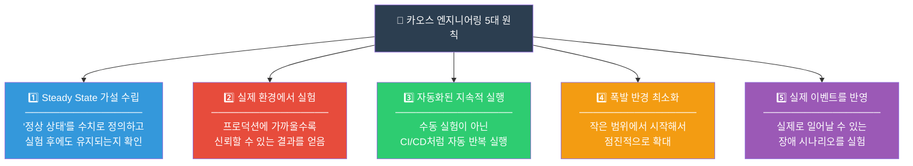
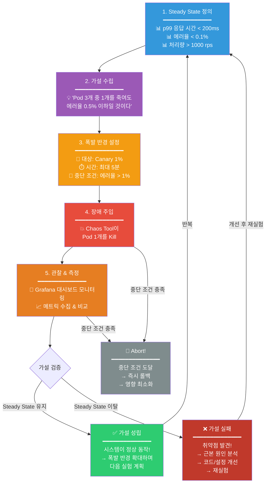
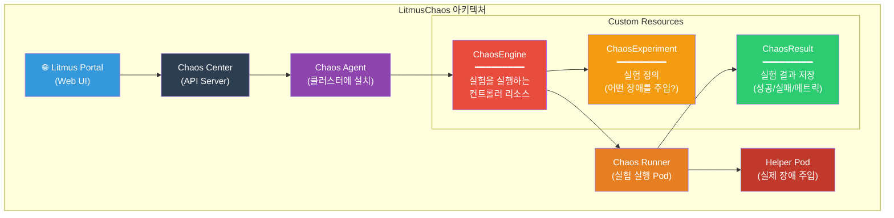
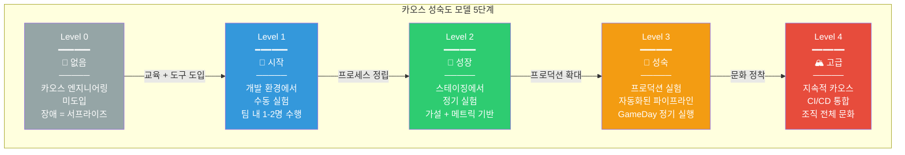

# 카오스 엔지니어링 — 일부러 장애를 만들어서 시스템을 강하게 만드는 기술

> [인시던트 관리](./03-incident-management)에서 장애가 터졌을 때 **대응하는 방법**을 배웠어요. 하지만 장애가 터진 다음에 대응하는 건 이미 늦은 거예요. **미리 일부러 장애를 만들어서 시스템의 약점을 찾아내는 것** — 그게 바로 카오스 엔지니어링이에요. [DR 전략](../05-cloud-aws/17-disaster-recovery)에서 AWS FIS를 잠깐 만져봤다면, 이번에는 카오스 엔지니어링의 **원칙, 도구, 실무 적용**을 처음부터 끝까지 깊이 파고들어볼게요.

---

## 🎯 왜 카오스 엔지니어링을/를 알아야 하나요?

### 일상 비유: 소방 훈련과 지진 대피 훈련

학교에서 하는 **지진 대피 훈련**을 떠올려보세요.

- 실제 지진이 아닌데도 일부러 **경보를 울려요** (장애 주입)
- 학생들이 책상 밑으로 들어가는지, 비상구로 대피하는지 **관찰해요** (시스템 반응 관찰)
- "3층 비상구가 잠겨 있었다", "방송이 4반 교실에서 안 들렸다" 같은 **약점을 찾아요** (취약점 발견)
- 다음 훈련 전까지 비상구 잠금장치를 고치고, 방송 스피커를 교체해요 (개선)
- 다음 훈련에서 개선이 되었는지 **다시 검증해요** (반복)

만약 이런 훈련을 한 번도 안 했다면? 진짜 지진이 왔을 때 학생들이 어디로 가야 할지 모르고, 비상구가 잠겨 있어서 대피할 수 없는 상황이 벌어져요.

**카오스 엔지니어링이 바로 이 대피 훈련이에요.** 다만, 대상이 학교가 아니라 **프로덕션 시스템**이라는 점이 다를 뿐이에요.

```
실무에서 카오스 엔지니어링이 필요한 순간:

• "서버 한 대가 죽으면 서비스가 자동으로 복구될까요?"     → Pod kill 실험
• "네트워크가 느려지면 타임아웃이 제대로 동작할까요?"     → Network delay 실험
• "CPU가 100%가 되면 오토스케일링이 작동할까요?"          → CPU stress 실험
• "디스크가 가득 차면 로그 시스템이 어떻게 되나요?"       → Disk fill 실험
• "AZ 하나가 통째로 죽어도 서비스가 유지될까요?"          → AZ failure 실험
• "장애 발생 시 알림이 제대로 오는지 검증했나요?"         → Alerting 검증
• "DR 시나리오가 실제로 작동하는지 테스트해봤나요?"       → GameDay 실행
• 면접: "카오스 엔지니어링 경험이 있나요?"                → Chaos Maturity Model
```

### 카오스 엔지니어링 없는 팀 vs 있는 팀

```mermaid
flowchart TD
    subgraph NO["❌ 카오스 엔지니어링 없는 팀"]
        N1["'우리 시스템은<br/>잘 설계했으니까 괜찮아'"] --> N2["예상치 못한 장애 발생!<br/>새벽 3시 Pod 크래시"]
        N2 --> N3["회로 차단기가<br/>설정 안 되어 있었음"]
        N3 --> N4["연쇄 장애로<br/>전체 서비스 다운"]
        N4 --> N5["MTTR 4시간<br/>매출 손실 + 고객 이탈"]
    end

    subgraph YES["✅ 카오스 엔지니어링 하는 팀"]
        Y1["정기적으로 장애 주입<br/>Pod kill, 네트워크 지연"] --> Y2["회로 차단기 미설정<br/>사전 발견!"]
        Y2 --> Y3["Circuit Breaker 설정<br/>+ Fallback 구현"]
        Y3 --> Y4["실제 장애 발생 시<br/>Graceful Degradation"]
        Y4 --> Y5["MTTR 5분<br/>고객 영향 최소"]
    end

    style N5 fill:#e74c3c,color:#fff
    style Y5 fill:#2ecc71,color:#fff
    style N1 fill:#f39c12,color:#fff
    style Y1 fill:#3498db,color:#fff
```



---

## 🧠 핵심 개념 잡기

### Netflix가 시작한 이야기

2010년, Netflix가 자체 데이터센터에서 AWS 클라우드로 마이그레이션하면서 모든 것이 시작되었어요. 클라우드 환경에서는 서버가 언제든 죽을 수 있고, 네트워크가 불안정할 수 있어요. Netflix 엔지니어들은 이렇게 생각했어요:

> "장애는 **반드시** 일어난다. 그렇다면 **미리 일부러** 장애를 일으켜서, 우리 시스템이 제대로 견디는지 확인하자."

이 철학에서 **Chaos Monkey**가 태어났고, 이후 이것이 하나의 엔지니어링 분야로 발전했어요.

### 카오스 엔지니어링의 5대 원칙

Netflix가 정리한 [Principles of Chaos Engineering](https://principlesofchaos.org/)에는 5가지 핵심 원칙이 있어요.



### 핵심 용어 한눈에 보기

| 용어 | 비유 | 설명 |
|------|------|------|
| **Steady State** | 건강한 사람의 체온 36.5도 | 시스템이 정상일 때의 측정 가능한 지표 (응답 시간, 에러율, 처리량) |
| **Steady State Hypothesis** | "운동해도 체온은 36~37도일 것이다" | 장애를 주입해도 Steady State가 유지될 것이라는 가설 |
| **Blast Radius** | 훈련 폭발의 영향 범위 | 실험이 영향을 미치는 시스템의 범위. 작게 시작해서 점진적으로 확대 |
| **Abort Condition** | 훈련 중 진짜 부상자가 발생하면 즉시 중단 | 실험을 즉시 중단해야 하는 조건 |
| **GameDay** | 전사 차원의 대규모 재난 훈련 | 팀 전체가 참여하는 체계적인 장애 시뮬레이션 행사 |
| **Chaos Maturity** | 수영 초급 → 중급 → 고급 단계 | 조직의 카오스 엔지니어링 성숙도 수준 |

### 카오스 엔지니어링 실험 생명주기



---

## 🔍 하나씩 자세히 알아보기

### 1. Steady State Hypothesis (정상 상태 가설)

카오스 엔지니어링에서 가장 중요한 개념이에요. 실험을 시작하기 전에 **"정상 상태가 뭔지"** 를 수치로 정의해야 해요.

**나쁜 가설과 좋은 가설 비교:**

```
❌ 나쁜 가설:
  "서버 하나가 죽어도 시스템이 잘 동작할 것이다"
  → "잘 동작"이 뭔지 측정할 수 없어요

✅ 좋은 가설:
  "Pod 3개 중 1개를 Kill해도,
   - p99 응답 시간이 300ms 이하이고
   - 에러율이 0.5% 이하이며
   - 초당 처리량이 800 rps 이상일 것이다"
  → 구체적인 수치로 검증할 수 있어요
```

**Steady State 지표 예시:**

| 계층 | 지표 | 정상 범위 | 출처 |
|------|------|----------|------|
| 사용자 경험 | p99 응답 시간 | < 200ms | APM |
| 사용자 경험 | 에러율 | < 0.1% | 로드밸런서 메트릭 |
| 애플리케이션 | 초당 처리량 | > 1000 rps | Prometheus |
| 인프라 | CPU 사용률 | < 70% | CloudWatch |
| 인프라 | 메모리 사용률 | < 80% | Node Exporter |
| 데이터 | DB 쿼리 응답 시간 | < 50ms | Slow Query Log |
| 비즈니스 | 주문 성공률 | > 99.5% | 비즈니스 메트릭 |

> **SLO와의 연계**: 이미 [SLO](./02-sli-slo)를 정의해둔 팀이라면, SLI/SLO 지표를 그대로 Steady State 지표로 사용할 수 있어요. 실제로 이것이 가장 효과적인 방법이에요. 카오스 실험의 성공/실패 기준이 곧 **"SLO를 위반하느냐 마느냐"**가 되는 거죠.

### 2. Blast Radius (폭발 반경) 제어

카오스 엔지니어링에서 가장 무서운 건 **"실험이 진짜 장애가 되는 것"**이에요. 그래서 폭발 반경을 제어하는 것이 핵심이에요.

**폭발 반경 확대 전략:**

```
📍 Level 1 — 개발 환경
   대상: dev/staging 환경
   시간: 제한 없음
   위험도: ⭐☆☆☆☆
   → 아무리 망가져도 고객에게 영향 없음

📍 Level 2 — 프로덕션 단일 인스턴스
   대상: 프로덕션 서버 1대
   시간: 5분 이내
   위험도: ⭐⭐☆☆☆
   → 로드밸런서가 자동으로 트래픽 분산

📍 Level 3 — 프로덕션 서비스 단위
   대상: 특정 마이크로서비스 전체
   시간: 10분 이내
   위험도: ⭐⭐⭐☆☆
   → Circuit Breaker, Retry 로직 검증

📍 Level 4 — 인프라 단위
   대상: AZ 하나 또는 리전 일부
   시간: 30분 이내
   위험도: ⭐⭐⭐⭐☆
   → DR 전략 실제 검증

📍 Level 5 — 전체 리전
   대상: 리전 페일오버
   시간: 1시간+
   위험도: ⭐⭐⭐⭐⭐
   → 완전한 DR 시나리오 테스트
```

**Abort Condition (중단 조건) 설정:**

```yaml
# 카오스 실험 abort 조건 예시
abort_conditions:
  - metric: error_rate
    threshold: "> 5%"
    duration: "30s"
    action: "immediate_rollback"

  - metric: p99_latency
    threshold: "> 2000ms"
    duration: "1m"
    action: "immediate_rollback"

  - metric: customer_impact
    threshold: "> 100 affected users"
    action: "immediate_rollback"

  - metric: revenue_impact
    threshold: "> $1000/min loss"
    action: "immediate_rollback + page oncall"
```

### 3. Chaos Experiment 유형

실무에서 자주 사용하는 카오스 실험 유형을 정리했어요.

| 유형 | 설명 | 검증 대상 | 난이도 |
|------|------|----------|--------|
| **Pod Kill** | 컨테이너/프로세스 강제 종료 | 자동 복구, 헬스체크, 리스타트 정책 | 초급 |
| **Network Delay** | 네트워크 지연 주입 (100~500ms) | 타임아웃 설정, Circuit Breaker | 초급 |
| **Network Loss** | 패킷 손실 주입 (10~50%) | Retry 로직, 멱등성 | 중급 |
| **Network Partition** | 서비스 간 통신 차단 | Fallback 로직, Graceful Degradation | 중급 |
| **CPU Stress** | CPU 사용률 100% 강제 | 오토스케일링, 리소스 제한 | 초급 |
| **Memory Stress** | 메모리 사용량 강제 증가 | OOM Killer 동작, 메모리 제한 | 중급 |
| **Disk Fill** | 디스크 공간 가득 채우기 | 로그 로테이션, 디스크 알림 | 초급 |
| **DNS Failure** | DNS 해석 실패 주입 | DNS 캐싱, 직접 IP 폴백 | 중급 |
| **AZ Failure** | 가용영역 전체 장애 시뮬레이션 | Multi-AZ 배포, DR 전환 | 고급 |
| **Time Travel** | 시스템 시간 변경 | 인증서 만료, Cron 작업, 캐시 TTL | 고급 |

### 4. Chaos Monkey와 Simian Army

Netflix가 만든 최초의 카오스 도구 체계예요.

**Simian Army (원숭이 군단):**

```
🐒 Chaos Monkey
   "프로덕션 서버를 랜덤으로 종료"
   → 단일 인스턴스 장애에 대한 복원력 검증

🦍 Chaos Gorilla
   "AZ(가용영역) 전체를 다운"
   → Multi-AZ 아키텍처의 실제 동작 검증

🐵 Chaos Kong
   "리전 전체를 다운"
   → Multi-Region DR 전략 검증

🕐 Latency Monkey
   "네트워크에 인위적 지연 주입"
   → 타임아웃/Retry 로직 검증

👨‍⚕️ Doctor Monkey
   "인스턴스 헬스체크 수행"
   → 비정상 인스턴스 자동 탐지

🧹 Janitor Monkey
   "미사용 리소스 자동 정리"
   → 비용 최적화

🔒 Security Monkey
   "보안 설정 위반 탐지"
   → 보안 컴플라이언스 확인

📐 Conformity Monkey
   "모범 사례 미준수 탐지"
   → 표준 아키텍처 패턴 검증
```

> 현재 Netflix는 Simian Army를 더 이상 유지보수하지 않고, 자체 내부 도구로 전환했어요. 하지만 이 개념들은 현대의 모든 카오스 도구에 영향을 줬어요.

### 5. LitmusChaos (CNCF 프로젝트)

LitmusChaos는 **쿠버네티스 네이티브** 카오스 엔지니어링 플랫폼이에요. CNCF 인큐베이팅 프로젝트로, 커뮤니티가 활발해요.

**핵심 컴포넌트:**



**ChaosEngine 예시 — Pod Kill 실험:**

```yaml
apiVersion: litmuschaos.io/v1alpha1
kind: ChaosEngine
metadata:
  name: nginx-pod-kill
  namespace: default
spec:
  # 대상 애플리케이션
  appinfo:
    appns: default
    applabel: "app=nginx"
    appkind: deployment

  # 실험 목록
  experiments:
    - name: pod-delete
      spec:
        components:
          env:
            # 삭제할 Pod 수
            - name: TOTAL_CHAOS_DURATION
              value: "30"        # 30초간 실험
            - name: CHAOS_INTERVAL
              value: "10"        # 10초마다 Pod 삭제
            - name: FORCE
              value: "false"     # graceful 종료

        # Steady State 검증 (Probe)
        probe:
          - name: "check-nginx-health"
            type: "httpProbe"
            httpProbe/inputs:
              url: "http://nginx-service:80/health"
              expectedResponseCode: "200"
            mode: "Continuous"
            runProperties:
              probeTimeout: 5
              interval: 2
              retry: 3

  # 실험 실행 조건
  engineState: "active"
  chaosServiceAccount: litmus-admin

  # Abort 조건
  annotationCheck: "true"
```

**ChaosExperiment 정의:**

```yaml
apiVersion: litmuschaos.io/v1alpha1
kind: ChaosExperiment
metadata:
  name: pod-delete
  namespace: default
spec:
  definition:
    scope: Namespaced
    permissions:
      - apiGroups: [""]
        resources: ["pods"]
        verbs: ["delete", "list", "get"]
    image: "litmuschaos/go-runner:latest"
    args:
      - -c
      - ./experiments -name pod-delete
    command:
      - /bin/bash
    env:
      - name: TOTAL_CHAOS_DURATION
        value: "30"
      - name: CHAOS_INTERVAL
        value: "10"
      - name: FORCE
        value: "false"
    labels:
      name: pod-delete
      app.kubernetes.io/part-of: litmus
```

### 6. Chaos Mesh (K8s 네이티브)

Chaos Mesh는 **PingCAP**이 개발한 쿠버네티스 네이티브 카오스 플랫폼이에요. CNCF 인큐베이팅 프로젝트이며, CRD 기반으로 매우 직관적이에요.

**Chaos Mesh가 지원하는 장애 유형:**

```
📦 Pod Chaos
   ├── pod-kill         : Pod 강제 종료
   ├── pod-failure      : Pod를 일정 시간 동안 사용 불가 상태로
   └── container-kill   : 특정 컨테이너만 종료

🌐 Network Chaos
   ├── delay            : 네트워크 지연 추가
   ├── loss             : 패킷 손실 주입
   ├── duplicate         : 패킷 중복 발생
   ├── corrupt          : 패킷 손상 주입
   ├── partition         : 네트워크 파티션 (서비스 간 통신 차단)
   └── bandwidth         : 대역폭 제한

💾 IO Chaos
   ├── latency          : 디스크 I/O 지연
   ├── fault            : I/O 에러 주입
   └── attrOverride     : 파일 속성 변경

⏰ Time Chaos
   └── time-offset      : 시스템 시간 변경 (인증서 만료 테스트 등)

🖥️ Stress Chaos
   ├── cpu-stress       : CPU 부하 주입
   └── memory-stress    : 메모리 부하 주입

🧬 Kernel Chaos
   └── kernel-fault     : 커널 레벨 장애 주입 (고급)

📡 DNS Chaos
   ├── dns-error        : DNS 해석 실패
   └── dns-random       : 잘못된 DNS 응답 반환

☁️ AWS/GCP/Azure Chaos
   ├── aws-ec2-stop     : EC2 인스턴스 정지
   ├── aws-ec2-restart  : EC2 인스턴스 재시작
   └── aws-detach-volume: EBS 볼륨 분리
```

**Chaos Mesh 설치 (Helm):**

```bash
# Chaos Mesh 설치
helm repo add chaos-mesh https://charts.chaos-mesh.org
helm repo update

# 네임스페이스 생성 후 설치
kubectl create ns chaos-mesh

helm install chaos-mesh chaos-mesh/chaos-mesh \
  -n chaos-mesh \
  --set chaosDaemon.runtime=containerd \
  --set chaosDaemon.socketPath=/run/containerd/containerd.sock \
  --version 2.7.0

# 설치 확인
kubectl get pods -n chaos-mesh
```

**Network Delay 실험 예시:**

```yaml
apiVersion: chaos-mesh.org/v1alpha1
kind: NetworkChaos
metadata:
  name: network-delay-payment
  namespace: default
spec:
  action: delay
  mode: all
  selector:
    namespaces:
      - default
    labelSelectors:
      app: payment-service
  delay:
    latency: "200ms"       # 200ms 지연 추가
    jitter: "50ms"         # ±50ms 변동
    correlation: "25"      # 25% 상관관계
  direction: to            # 아웃바운드 트래픽에 적용
  target:
    selector:
      namespaces:
        - default
      labelSelectors:
        app: order-service  # order-service로 가는 트래픽만
    mode: all
  duration: "5m"           # 5분간 실험
  scheduler:
    cron: "@every 24h"     # 매일 자동 실행 (선택)
```

**Pod Kill 실험 예시:**

```yaml
apiVersion: chaos-mesh.org/v1alpha1
kind: PodChaos
metadata:
  name: pod-kill-nginx
  namespace: default
spec:
  action: pod-kill
  mode: one                # Pod 1개만 종료
  selector:
    namespaces:
      - default
    labelSelectors:
      app: nginx
  gracePeriod: 0           # 즉시 종료 (SIGKILL)
  duration: "1m"           # 1분간 실험 (1분마다 Pod kill 반복)
```

**CPU Stress 실험 예시:**

```yaml
apiVersion: chaos-mesh.org/v1alpha1
kind: StressChaos
metadata:
  name: cpu-stress-api
  namespace: default
spec:
  mode: one
  selector:
    namespaces:
      - default
    labelSelectors:
      app: api-server
  stressors:
    cpu:
      workers: 2          # CPU 코어 2개를 100% 사용
      load: 80            # 80% 부하
  duration: "3m"           # 3분간 실행
```

### 7. AWS Fault Injection Simulator (FIS)

AWS FIS는 AWS 관리형 카오스 엔지니어링 서비스예요. EC2, ECS, EKS, RDS 등 AWS 서비스에 직접 장애를 주입할 수 있어요.

**지원 액션:**

```
📌 EC2 Actions
   • aws:ec2:stop-instances          — 인스턴스 중지
   • aws:ec2:terminate-instances     — 인스턴스 종료
   • aws:ec2:reboot-instances        — 인스턴스 재부팅

📌 ECS Actions
   • aws:ecs:drain-container-instances — 컨테이너 드레인
   • aws:ecs:stop-task                — ECS 태스크 중지

📌 EKS Actions
   • aws:eks:terminate-nodegroup-instances — 노드 종료

📌 RDS Actions
   • aws:rds:reboot-db-instances     — DB 인스턴스 재부팅
   • aws:rds:failover-db-cluster     — RDS 클러스터 페일오버

📌 Network Actions
   • aws:network:disrupt-connectivity — 네트워크 연결 차단
   • aws:network:route-table         — 라우트 테이블 변경

📌 S3 Actions
   • aws:s3:bucket-pause-replication — S3 복제 일시 중지

📌 SSM Actions
   • aws:ssm:send-command            — SSM 명령 실행 (범용)
   • aws:ssm:send-command/AWSFIS-Run-CPU-Stress  — CPU 스트레스
   • aws:ssm:send-command/AWSFIS-Run-Memory-Stress — 메모리 스트레스
```

**FIS 실험 템플릿 (Terraform):**

```hcl
resource "aws_fis_experiment_template" "az_failure" {
  description = "AZ-a 가용영역 장애 시뮬레이션"
  role_arn    = aws_iam_role.fis_role.arn

  # 중단 조건
  stop_condition {
    source = "aws:cloudwatch:alarm"
    value  = aws_cloudwatch_metric_alarm.high_error_rate.arn
  }

  # 액션 1: EC2 인스턴스 중지
  action {
    name      = "stop-ec2-in-az-a"
    action_id = "aws:ec2:stop-instances"

    parameter {
      key   = "startAfter"
      value = ""
    }

    target {
      key   = "Instances"
      value = "ec2-in-az-a"
    }
  }

  # 액션 2: 네트워크 차단
  action {
    name      = "disrupt-network-az-a"
    action_id = "aws:network:disrupt-connectivity"

    parameter {
      key   = "duration"
      value = "PT10M"   # 10분
    }
    parameter {
      key   = "scope"
      value = "availability-zone"
    }

    target {
      key   = "Subnets"
      value = "subnets-in-az-a"
    }
  }

  # 대상: AZ-a의 EC2 인스턴스
  target {
    name           = "ec2-in-az-a"
    resource_type  = "aws:ec2:instance"
    selection_mode = "ALL"

    resource_tag {
      key   = "Environment"
      value = "production"
    }

    filter {
      path   = "Placement.AvailabilityZone"
      values = ["ap-northeast-2a"]
    }
  }

  # 대상: AZ-a의 서브넷
  target {
    name           = "subnets-in-az-a"
    resource_type  = "aws:ec2:subnet"
    selection_mode = "ALL"

    resource_tag {
      key   = "AvailabilityZone"
      value = "ap-northeast-2a"
    }
  }

  tags = {
    Name        = "az-failure-experiment"
    Environment = "production"
    Team        = "sre"
  }
}

# FIS 실행 역할
resource "aws_iam_role" "fis_role" {
  name = "fis-experiment-role"

  assume_role_policy = jsonencode({
    Version = "2012-10-17"
    Statement = [{
      Effect = "Allow"
      Principal = {
        Service = "fis.amazonaws.com"
      }
      Action = "sts:AssumeRole"
    }]
  })
}

# 중단 조건용 CloudWatch 알람
resource "aws_cloudwatch_metric_alarm" "high_error_rate" {
  alarm_name          = "fis-abort-high-error-rate"
  comparison_operator = "GreaterThanThreshold"
  evaluation_periods  = 1
  metric_name         = "5XXError"
  namespace           = "AWS/ApplicationELB"
  period              = 60
  statistic           = "Sum"
  threshold           = 100
  alarm_description   = "FIS 실험 abort - 5XX 에러 100건 초과"

  dimensions = {
    LoadBalancer = "app/my-alb/1234567890"
  }
}
```

### 8. Gremlin

Gremlin은 **상용 카오스 엔지니어링 SaaS 플랫폼**이에요. 설치형 에이전트를 통해 K8s, VM, 베어메탈 등 다양한 환경에서 사용할 수 있어요.

**Gremlin의 특징:**

```
✅ 직관적인 Web UI — 비개발자도 실험 가능
✅ 시나리오 기반 실험 — 여러 공격을 시퀀스로 조합
✅ 자동 감지 및 권장 — 인프라 스캔 후 실험 추천
✅ Status Check — 실험 전 안전성 자동 검증
✅ 팀/RBAC 관리 — 누가 어떤 실험을 할 수 있는지 제어
✅ Reliability Score — 시스템 신뢰성 점수 대시보드

⚠️ 유료 서비스 (무료 티어 있음)
⚠️ 에이전트 설치 필요
```

**Gremlin CLI 사용 예시:**

```bash
# Pod Kill
gremlin attack kubernetes pod \
  --namespace default \
  --label app=nginx \
  --count 1

# Network Latency
gremlin attack kubernetes network latency \
  --namespace default \
  --label app=payment \
  --length 300 \       # 5분간
  --delay 200          # 200ms 지연

# CPU Stress
gremlin attack kubernetes resource cpu \
  --namespace default \
  --label app=api \
  --length 180 \       # 3분간
  --cores 2 \          # 2코어
  --percent 80         # 80% 부하
```

### 9. 카오스 도구 비교

| 기능 | Chaos Mesh | LitmusChaos | AWS FIS | Gremlin |
|------|-----------|-------------|---------|---------|
| **라이선스** | Apache 2.0 | Apache 2.0 | AWS 관리형 | 상용 (유료) |
| **K8s 네이티브** | CRD 기반 | CRD 기반 | EKS 지원 | 에이전트 |
| **VM/베어메탈** | 제한적 | 지원 | EC2 지원 | 전체 지원 |
| **AWS 서비스 통합** | 일부 | 일부 | 완전 통합 | 지원 |
| **Web UI** | 내장 대시보드 | Litmus Portal | AWS 콘솔 | SaaS 대시보드 |
| **CI/CD 통합** | GitHub Actions | GitHub Actions | CloudFormation | API/CLI |
| **난이도** | 중간 | 중간 | 낮음 | 낮음 |
| **커뮤니티** | CNCF 활발 | CNCF 활발 | AWS 지원 | 상용 지원 |
| **추천 환경** | K8s 중심 | K8s + 멀티 환경 | AWS 올인 | 엔터프라이즈 |

### 10. Chaos Maturity Model (카오스 성숙도 모델)

조직이 카오스 엔지니어링을 어디까지 도입했는지 평가하는 모델이에요.



**각 레벨별 체크리스트:**

```
Level 0 → Level 1 (시작하기)
  □ 카오스 엔지니어링 교육 완료
  □ 개발 환경에 Chaos Mesh 또는 LitmusChaos 설치
  □ 첫 번째 Pod Kill 실험 수행
  □ 실험 결과 문서화

Level 1 → Level 2 (프로세스 정립)
  □ Steady State 가설 수립 프로세스 정의
  □ Blast Radius 제어 정책 수립
  □ 스테이징 환경에서 정기 실험 (월 1회+)
  □ 실험 결과를 Jira/티켓으로 추적

Level 2 → Level 3 (프로덕션 진출)
  □ 프로덕션 카오스 실험 정책 승인
  □ Abort Condition 자동화
  □ GameDay 분기별 실행
  □ SLO와 카오스 실험 연계

Level 3 → Level 4 (문화 정착)
  □ CI/CD 파이프라인에 카오스 테스트 통합
  □ 모든 팀이 자체 카오스 실험 수행
  □ 카오스 실험 결과가 아키텍처 결정에 반영
  □ 신규 서비스 론칭 전 카오스 실험 필수
```

### 11. 카오스 엔지니어링과 SLO 연계

카오스 엔지니어링과 SLO는 떼려야 뗄 수 없는 관계예요.

```
SLO 설정 → 카오스 실험 설계 → 취약점 발견 → 개선 → SLO 달성 확신

구체적으로:

1. SLO: "주문 API의 가용성은 99.95% 이상이어야 한다"
   → 월간 허용 다운타임: 약 22분

2. 카오스 가설: "DB 프라이머리가 죽어도 주문 API 가용성 99.95% 유지"

3. 실험: RDS 프라이머리 페일오버 주입
   → 결과: 페일오버에 45초 소요, 그 동안 주문 실패

4. 분석: 월 1회 장애 가정 시, 월 45초 다운 = SLO 범위 내
   → 하지만 월 2회 이상이면 SLO 위반 가능

5. 개선: Read Replica 활용 + Connection Pool 설정 최적화
   → 페일오버 시간 45초 → 5초로 단축

6. 재실험: 검증 완료, SLO 달성 확신 증가
```

---

## 💻 직접 해보기

### 실습 1: Chaos Mesh로 Pod Kill 실험

**사전 준비:**

```bash
# 1. 테스트 대상 애플리케이션 배포
kubectl create namespace chaos-test

cat <<EOF | kubectl apply -f -
apiVersion: apps/v1
kind: Deployment
metadata:
  name: nginx-target
  namespace: chaos-test
spec:
  replicas: 3
  selector:
    matchLabels:
      app: nginx-target
  template:
    metadata:
      labels:
        app: nginx-target
    spec:
      containers:
      - name: nginx
        image: nginx:1.25
        ports:
        - containerPort: 80
        readinessProbe:
          httpGet:
            path: /
            port: 80
          initialDelaySeconds: 5
          periodSeconds: 5
        livenessProbe:
          httpGet:
            path: /
            port: 80
          initialDelaySeconds: 10
          periodSeconds: 10
---
apiVersion: v1
kind: Service
metadata:
  name: nginx-target
  namespace: chaos-test
spec:
  selector:
    app: nginx-target
  ports:
  - port: 80
    targetPort: 80
  type: ClusterIP
EOF

# 2. Pod가 모두 Running인지 확인
kubectl get pods -n chaos-test -w
```

**실험 실행:**

```bash
# 3. Chaos Mesh가 설치되어 있는지 확인
kubectl get pods -n chaos-mesh

# 4. Pod Kill 실험 정의
cat <<EOF | kubectl apply -f -
apiVersion: chaos-mesh.org/v1alpha1
kind: PodChaos
metadata:
  name: pod-kill-test
  namespace: chaos-test
spec:
  action: pod-kill
  mode: one
  selector:
    namespaces:
      - chaos-test
    labelSelectors:
      app: nginx-target
  duration: "60s"
EOF

# 5. 실험 상태 확인
kubectl get podchaos -n chaos-test
kubectl describe podchaos pod-kill-test -n chaos-test

# 6. Pod 상태 관찰 (다른 터미널에서)
kubectl get pods -n chaos-test -w

# 7. 실험 완료 후 정리
kubectl delete podchaos pod-kill-test -n chaos-test
```

**확인 포인트:**

```
✅ Pod가 Kill된 후 Deployment가 자동으로 새 Pod를 생성하는가?
✅ Service 엔드포인트가 정상 Pod로만 라우팅되는가?
✅ 새 Pod가 Ready 상태가 되기까지 얼마나 걸리는가?
✅ 잠깐의 다운타임 동안 5XX 에러가 발생했는가?
```

### 실습 2: Network Delay로 타임아웃 검증

```bash
# 1. Network Delay 실험 정의
cat <<EOF | kubectl apply -f -
apiVersion: chaos-mesh.org/v1alpha1
kind: NetworkChaos
metadata:
  name: network-delay-test
  namespace: chaos-test
spec:
  action: delay
  mode: all
  selector:
    namespaces:
      - chaos-test
    labelSelectors:
      app: nginx-target
  delay:
    latency: "500ms"
    jitter: "100ms"
    correlation: "50"
  duration: "3m"
EOF

# 2. 지연 확인 (다른 터미널에서 반복 요청)
kubectl run curl-test --image=curlimages/curl -i --tty --rm \
  --namespace chaos-test -- sh

# curl-test Pod 안에서:
while true; do
  time curl -s -o /dev/null -w "%{http_code} %{time_total}s\n" \
    http://nginx-target.chaos-test.svc.cluster.local/
  sleep 1
done

# 3. 실험 상태 확인
kubectl get networkchaos -n chaos-test
kubectl describe networkchaos network-delay-test -n chaos-test

# 4. 정리
kubectl delete networkchaos network-delay-test -n chaos-test
```

### 실습 3: LitmusChaos로 체계적인 실험

```bash
# 1. LitmusChaos 설치
helm repo add litmuschaos https://litmuschaos.github.io/litmus-helm/
helm repo update

kubectl create ns litmus

helm install litmus litmuschaos/litmus \
  --namespace litmus \
  --set portal.frontend.service.type=NodePort

# 2. Litmus Portal 접속 (기본 계정: admin / litmus)
kubectl get svc -n litmus

# 3. ChaosHub에서 실험 가져오기 (CLI 방식)
# Pod Delete 실험 설치
kubectl apply -f https://hub.litmuschaos.io/api/chaos/3.0.0\
?file=charts/generic/pod-delete/experiment.yaml \
-n chaos-test

# 4. RBAC 설정
kubectl apply -f https://hub.litmuschaos.io/api/chaos/3.0.0\
?file=charts/generic/pod-delete/rbac.yaml \
-n chaos-test

# 5. ChaosEngine 실행
cat <<EOF | kubectl apply -f -
apiVersion: litmuschaos.io/v1alpha1
kind: ChaosEngine
metadata:
  name: nginx-chaos-engine
  namespace: chaos-test
spec:
  appinfo:
    appns: chaos-test
    applabel: "app=nginx-target"
    appkind: deployment
  engineState: "active"
  chaosServiceAccount: pod-delete-sa
  experiments:
    - name: pod-delete
      spec:
        components:
          env:
            - name: TOTAL_CHAOS_DURATION
              value: "30"
            - name: CHAOS_INTERVAL
              value: "10"
            - name: FORCE
              value: "false"
EOF

# 6. 결과 확인
kubectl get chaosresult -n chaos-test
kubectl describe chaosresult nginx-chaos-engine-pod-delete -n chaos-test
```

### 실습 4: AWS FIS로 EC2 장애 주입

```bash
# 1. AWS CLI로 FIS 실험 템플릿 생성
aws fis create-experiment-template \
  --cli-input-json '{
    "description": "EC2 인스턴스 1대 중지 실험",
    "roleArn": "arn:aws:iam::ACCOUNT_ID:role/FISExperimentRole",
    "stopConditions": [
      {
        "source": "aws:cloudwatch:alarm",
        "value": "arn:aws:cloudwatch:ap-northeast-2:ACCOUNT_ID:alarm:high-5xx-errors"
      }
    ],
    "targets": {
      "myInstances": {
        "resourceType": "aws:ec2:instance",
        "selectionMode": "COUNT(1)",
        "resourceTags": {
          "Environment": "staging",
          "Team": "sre"
        }
      }
    },
    "actions": {
      "stopInstances": {
        "actionId": "aws:ec2:stop-instances",
        "parameters": {
          "startInstancesAfterDuration": "PT5M"
        },
        "targets": {
          "Instances": "myInstances"
        }
      }
    },
    "tags": {
      "Name": "ec2-stop-experiment"
    }
  }'

# 2. 실험 실행
aws fis start-experiment \
  --experiment-template-id EXT_TEMPLATE_ID

# 3. 실험 상태 확인
aws fis get-experiment \
  --id EXP_ID

# 4. 실험 강제 중단 (필요 시)
aws fis stop-experiment \
  --id EXP_ID
```

### 실습 5: Disk Fill 실험 (Chaos Mesh)

```bash
# 디스크 가득 채우기 실험
cat <<EOF | kubectl apply -f -
apiVersion: chaos-mesh.org/v1alpha1
kind: IOChaos
metadata:
  name: disk-fill-test
  namespace: chaos-test
spec:
  action: fault
  mode: one
  selector:
    namespaces:
      - chaos-test
    labelSelectors:
      app: nginx-target
  volumePath: /var/log
  path: "/var/log/**"
  errno: 28              # ENOSPC (No space left on device)
  percent: 100
  duration: "2m"
EOF

# 확인 포인트:
# - 로그 기록이 중단될 때 애플리케이션이 어떻게 반응하는가?
# - 알림이 제대로 발생하는가?
# - 디스크 정리 자동화가 동작하는가?
```

---

## 🏢 실무에서는?

### GameDay: 전사 차원의 카오스 훈련

GameDay는 단순한 기술 실험이 아니라, **팀 전체가 참여하는 체계적인 장애 대응 훈련**이에요.

**GameDay 실행 프로세스:**

```mermaid
flowchart TD
    subgraph PLAN["📋 Phase 1: 계획 (1-2주 전)"]
        P1["시나리오 선정<br/>━━━━━━━━━━<br/>AZ 장애? DB 페일오버?<br/>네트워크 파티션?"]
        P2["참가자 확정<br/>━━━━━━━━━━<br/>SRE, 개발, PM, 임원<br/>역할 배정"]
        P3["성공 기준 정의<br/>━━━━━━━━━━<br/>RTO 5분, 에러율 1% 이하<br/>알림 1분 내 수신"]
        P4["롤백 계획 수립<br/>━━━━━━━━━━<br/>실험 중단 절차<br/>긴급 복구 방법"]
    end

    subgraph PREP["🔧 Phase 2: 준비 (1-3일 전)"]
        PP1["도구 점검<br/>━━━━━━━━━━<br/>Chaos 도구 동작 확인<br/>모니터링 대시보드 준비"]
        PP2["커뮤니케이션 채널<br/>━━━━━━━━━━<br/>Slack 채널, War Room<br/>에스컬레이션 경로"]
        PP3["사전 알림<br/>━━━━━━━━━━<br/>관련 팀, CS팀, 경영진<br/>시간대 공지"]
    end

    subgraph EXEC["🔥 Phase 3: 실행 (당일)"]
        E1["Steady State 측정<br/>(실험 전 기준선)"]
        E2["장애 주입 시작<br/>(Chaos Tool 실행)"]
        E3["관찰 & 대응<br/>(팀이 장애 대응)"]
        E4["타임라인 기록<br/>(모든 이벤트 로깅)"]
    end

    subgraph REVIEW["📊 Phase 4: 리뷰 (1-3일 후)"]
        R1["결과 분석<br/>━━━━━━━━━━<br/>가설 vs 실제 결과<br/>발견된 취약점"]
        R2["개선 항목 도출<br/>━━━━━━━━━━<br/>우선순위 정리<br/>담당자 배정"]
        R3["문서화 & 공유<br/>━━━━━━━━━━<br/>전사 공유<br/>다음 GameDay 계획"]
    end

    P1 --> P2 --> P3 --> P4
    P4 --> PP1 --> PP2 --> PP3
    PP3 --> E1 --> E2 --> E3 --> E4
    E4 --> R1 --> R2 --> R3

    style P1 fill:#3498db,color:#fff
    style E2 fill:#e74c3c,color:#fff
    style R1 fill:#2ecc71,color:#fff
    style PP1 fill:#f39c12,color:#fff
```



**GameDay 시나리오 템플릿:**

```markdown
# GameDay 시나리오: AZ-a 가용영역 장애

## 기본 정보
- 일시: 2026-03-20 (금) 14:00-16:00 KST
- 참가자: SRE팀 (리드), 백엔드팀, 프론트엔드팀, CS팀
- 도구: AWS FIS + Chaos Mesh
- 대상: 프로덕션 환경 (ap-northeast-2a)

## 시나리오
AZ-a에서 네트워크 연결이 완전히 끊기는 상황.
AZ-a에 있는 EC2, RDS Read Replica, ElastiCache 노드가
모두 접근 불가 상태가 된다.

## Steady State Hypothesis
- 주문 API 에러율: 1% 이하
- p99 응답 시간: 500ms 이하
- 알림 수신: 장애 발생 2분 이내
- Auto Scaling: AZ-b, AZ-c에서 자동 확장 5분 이내

## 폭발 반경
- 영향 범위: AZ-a만 (전체 트래픽의 ~33%)
- 실험 시간: 최대 15분
- Abort 조건: 에러율 5% 초과 OR 매출 영향 감지 시

## 롤백 계획
1. FIS 실험 즉시 중단 (AWS 콘솔 또는 CLI)
2. AZ-a 리소스 자동 복구 확인
3. 수동 개입 필요 시 runbook-023 참조

## 관찰 포인트
□ ALB가 AZ-a 타겟을 자동으로 제외하는가?
□ RDS가 AZ-b Read Replica로 자동 전환하는가?
□ ElastiCache 클러스터가 다른 AZ 노드로 페일오버하는가?
□ Auto Scaling이 AZ-b, AZ-c에서 새 인스턴스를 생성하는가?
□ PagerDuty 알림이 2분 이내에 On-call에게 도착하는가?
□ Grafana 대시보드에서 이상 징후가 즉시 보이는가?
```

### 실무 Best Practices

**1. 점진적 도입 전략:**

```
Month 1-2: 기반 구축
  ├── 카오스 엔지니어링 교육 (전 엔지니어)
  ├── 개발 환경에 Chaos Mesh 설치
  ├── 첫 번째 Pod Kill 실험 (개발 환경)
  └── 결과 문서화 + 팀 공유

Month 3-4: 스테이징 확대
  ├── 스테이징 환경으로 범위 확대
  ├── Network Delay, CPU Stress 실험 추가
  ├── Steady State Hypothesis 프로세스 정립
  └── 월 1회 정기 실험 시작

Month 5-6: 프로덕션 진출
  ├── 프로덕션 카오스 정책 승인
  ├── Blast Radius 제한된 프로덕션 실험
  ├── 첫 번째 GameDay 실행
  └── SLO와 카오스 실험 연계

Month 7+: 자동화 + 문화
  ├── CI/CD 파이프라인에 카오스 테스트 통합
  ├── 분기별 GameDay 정례화
  ├── 신규 서비스 론칭 전 카오스 실험 필수화
  └── 카오스 성숙도 Level 3-4 도달
```

**2. 카오스 실험을 CI/CD에 통합:**

```yaml
# .github/workflows/chaos-test.yaml
name: Chaos Test Pipeline

on:
  schedule:
    - cron: "0 3 * * 1"  # 매주 월요일 새벽 3시
  workflow_dispatch:       # 수동 실행도 가능

jobs:
  chaos-test:
    runs-on: ubuntu-latest
    steps:
      - name: Configure kubectl
        uses: azure/k8s-set-context@v3
        with:
          kubeconfig: ${{ secrets.KUBE_CONFIG }}

      - name: Measure Steady State (Before)
        run: |
          echo "측정 시작: $(date)"
          # p99 응답 시간 측정
          P99=$(kubectl exec -n monitoring prometheus-0 -- \
            promtool query instant \
            'histogram_quantile(0.99, rate(http_request_duration_seconds_bucket[5m]))')
          echo "P99 Latency: ${P99}"

          # 에러율 측정
          ERROR_RATE=$(kubectl exec -n monitoring prometheus-0 -- \
            promtool query instant \
            'rate(http_requests_total{code=~"5.."}[5m]) / rate(http_requests_total[5m])')
          echo "Error Rate: ${ERROR_RATE}"

      - name: Run Pod Kill Experiment
        run: |
          cat <<EOF | kubectl apply -f -
          apiVersion: chaos-mesh.org/v1alpha1
          kind: PodChaos
          metadata:
            name: ci-pod-kill
            namespace: staging
          spec:
            action: pod-kill
            mode: one
            selector:
              namespaces: [staging]
              labelSelectors:
                app: api-server
            duration: "60s"
          EOF

      - name: Wait and Observe
        run: sleep 90

      - name: Measure Steady State (After)
        run: |
          P99_AFTER=$(kubectl exec -n monitoring prometheus-0 -- \
            promtool query instant \
            'histogram_quantile(0.99, rate(http_request_duration_seconds_bucket[5m]))')
          echo "P99 Latency After: ${P99_AFTER}"

          # 임계값 검증
          if (( $(echo "${P99_AFTER} > 0.5" | bc -l) )); then
            echo "FAIL: p99 latency exceeded 500ms"
            exit 1
          fi

      - name: Cleanup
        if: always()
        run: |
          kubectl delete podchaos ci-pod-kill -n staging --ignore-not-found

      - name: Notify Results
        if: failure()
        uses: slackapi/slack-github-action@v1
        with:
          payload: |
            {
              "text": "카오스 테스트 실패! p99 응답 시간이 SLO를 초과했습니다.",
              "channel": "#sre-alerts"
            }
        env:
          SLACK_WEBHOOK_URL: ${{ secrets.SLACK_WEBHOOK }}
```

**3. 카오스 실험 결과 추적:**

```
📊 카오스 실험 결과 레지스트리 (예시)

| 날짜 | 실험 | 대상 | 가설 | 결과 | 발견 | 개선 | 상태 |
|------|------|------|------|------|------|------|------|
| 03-01 | Pod Kill | payment | SLO 유지 | ✅ Pass | - | - | 완료 |
| 03-05 | Net Delay | order→DB | p99<300ms | ❌ Fail | 커넥션 풀 고갈 | 풀 사이즈 증가 | 개선 완료 |
| 03-10 | AZ Failure | AZ-a | 자동 전환 | ❌ Fail | DNS TTL 300초 | TTL 60초로 단축 | 재실험 필요 |
| 03-15 | CPU Stress | api | 오토스케일링 | ✅ Pass | - | - | 완료 |
```

---

## ⚠️ 자주 하는 실수

### 실수 1: Steady State 없이 실험하기

```
❌ 잘못된 방법:
"Pod 하나 죽여보자!" → Kill → "음... 괜찮은 것 같은데?"
→ "괜찮다"의 기준이 없으니 실험의 의미가 없어요

✅ 올바른 방법:
1. 먼저 Steady State 측정 (p99 < 200ms, 에러율 < 0.1%)
2. 가설 수립 ("Pod Kill 후에도 p99 < 300ms일 것이다")
3. 실험 실행
4. 결과와 가설 비교
```

### 실수 2: 프로덕션에서 바로 시작하기

```
❌ 잘못된 방법:
"카오스 엔지니어링은 프로덕션에서 해야 의미 있다!"
→ 첫 실험을 프로덕션에서 → 예상치 못한 장애 → 실제 사고

✅ 올바른 방법:
개발 → 스테이징 → 프로덕션 (Canary) → 프로덕션 (확대)
단계별로 신뢰를 쌓으면서 점진적으로 확대해요
```

### 실수 3: Abort Condition 설정 안 하기

```
❌ 잘못된 방법:
"5분만 실험할 거니까 괜찮겠지"
→ 5분 안에 에러율 50% 도달 → 수천 건의 주문 실패

✅ 올바른 방법:
반드시 자동 중단 조건을 설정해요:
- 에러율 > 1% → 즉시 중단
- p99 > 1초 → 즉시 중단
- 고객 불만 접수 → 즉시 중단
CloudWatch Alarm이나 Prometheus Alert를 abort 트리거로 연결하세요
```

### 실수 4: 실험 결과를 문서화하지 않기

```
❌ 잘못된 방법:
"실험했는데 통과했어. 끝!"
→ 3개월 후 같은 실험을 또 하고 같은 결과를 얻음

✅ 올바른 방법:
모든 실험을 기록해요:
- 언제, 누가, 어떤 실험을, 어떤 가설로
- 결과: 성공/실패
- 발견된 문제
- 개선 항목과 담당자
- 재실험 날짜
```

### 실수 5: 도구에만 집중하기

```
❌ 잘못된 방법:
"Chaos Mesh 설치했으니까 카오스 엔지니어링 하는 거 아닌가?"
→ 도구를 깔아놓고 아무도 안 씀

✅ 올바른 방법:
도구보다 중요한 것:
1. 문화: "장애는 반드시 일어난다"는 인식
2. 프로세스: 가설 → 실험 → 검증 → 개선 사이클
3. 사람: 팀 전체가 참여하는 GameDay
4. 도구: 위 3가지가 갖춰진 후에 선택
```

### 실수 6: 업무 시간에만 실험하기

```
❌ 잘못된 방법:
"카오스 실험은 평일 오후에만 해야지"
→ 실제 장애는 주말 새벽에 발생... On-call 대응 못함

✅ 올바른 방법:
점진적으로 실험 시간을 확대해요:
Phase 1: 업무 시간 (안전)
Phase 2: 업무 시간 외 (On-call 대응 검증)
Phase 3: 예고 없는 실험 (실제 상황에 가장 가까움)
```

### 실수 7: 카오스와 SLO를 따로 관리하기

```
❌ 잘못된 방법:
SRE팀: "SLO 관리합니다"
카오스팀: "카오스 실험합니다"
→ 카오스 실험 결과가 SLO 개선에 반영되지 않음

✅ 올바른 방법:
- 카오스 실험의 성공/실패 기준 = SLO 위반 여부
- 카오스 실험에서 발견된 취약점 → Error Budget 소진 예측에 반영
- SLO가 위험할 때 → 카오스 실험 일시 중단 (Error Budget 보호)
- SLO에 여유가 있을 때 → 더 공격적인 카오스 실험 시도
```

---

## 📝 마무리

### 한눈에 보는 핵심 정리

```
카오스 엔지니어링 = "일부러 장애를 만들어서 시스템의 약점을 찾는 기술"

5대 원칙:
1. Steady State 가설 수립 — 정상 상태를 수치로 정의
2. 실제 환경에서 실험 — 프로덕션에 가까울수록 좋음
3. 자동화된 지속적 실행 — CI/CD처럼 반복
4. 폭발 반경 최소화 — 작게 시작, 점진적 확대
5. 실제 이벤트 반영 — 실제 장애 시나리오 기반

도구 선택:
• K8s 중심 → Chaos Mesh 또는 LitmusChaos
• AWS 올인 → AWS FIS
• 엔터프라이즈 → Gremlin
• 시작 단계 → Chaos Mesh (가장 쉬움)

실험 순서:
Pod Kill → Network Delay → CPU Stress
→ Disk Fill → AZ Failure → Region Failure

성숙도:
Level 0 (없음) → Level 1 (시작) → Level 2 (성장)
→ Level 3 (성숙) → Level 4 (고급)

핵심 기억:
• Steady State 없는 카오스 실험은 의미 없어요
• Abort Condition 없는 카오스 실험은 위험해요
• 도구보다 문화가 먼저예요
• SLO와 카오스 실험은 함께 가야 해요
```

### 면접 빈출 질문과 답변 가이드

```
Q: "카오스 엔지니어링이 무엇인가요?"
A: "프로덕션 시스템에 의도적으로 장애를 주입해서, 시스템이 예상대로
   동작하는지 검증하는 엔지니어링 분야입니다. Netflix가 시작했고,
   핵심은 Steady State Hypothesis를 수립하고 실험으로 검증하는 것입니다."

Q: "Steady State Hypothesis가 뭔가요?"
A: "시스템의 정상 상태를 측정 가능한 수치로 정의한 것입니다.
   예를 들어 'p99 응답 시간 200ms 이하, 에러율 0.1% 이하'처럼요.
   장애를 주입한 후에도 이 상태가 유지되는지 검증합니다."

Q: "Blast Radius는 어떻게 제어하나요?"
A: "세 가지로 제어합니다.
   1) 범위: 단일 Pod → 서비스 → AZ → 리전으로 점진 확대
   2) 시간: 짧은 시간부터 시작
   3) Abort Condition: 임계값 초과 시 자동 중단"

Q: "GameDay는 무엇이고 어떻게 진행하나요?"
A: "팀 전체가 참여하는 체계적인 장애 시뮬레이션 훈련입니다.
   계획(시나리오+참가자+기준) → 준비(도구+채널) →
   실행(주입+관찰+대응) → 리뷰(분석+개선) 4단계로 진행합니다."

Q: "Chaos Mesh와 LitmusChaos의 차이는?"
A: "둘 다 CNCF K8s 네이티브 카오스 도구입니다.
   Chaos Mesh는 PingCAP이 개발했고 CRD가 직관적이며,
   LitmusChaos는 ChaosHub 에코시스템이 강점입니다.
   작은 팀은 Chaos Mesh, 큰 조직은 LitmusChaos가 더 맞을 수 있어요."
```

---

## 🔗 다음 단계

### 이어서 공부할 내용

| 다음 주제 | 연결점 |
|-----------|--------|
| [플랫폼 엔지니어링](./06-platform-engineering) | 카오스 실험을 셀프서비스로 제공하는 내부 플랫폼 |
| [인시던트 관리](./03-incident-management) | 카오스 실험에서 발견한 취약점 → 인시던트 예방 |
| [DR 전략](../05-cloud-aws/17-disaster-recovery) | GameDay로 DR 전략이 실제로 동작하는지 검증 |

### 추천 학습 자료

```
📚 필독 자료:
• Principles of Chaos Engineering — principlesofchaos.org
• "Chaos Engineering" (O'Reilly) — Casey Rosenthal, Nora Jones
• Netflix Tech Blog — Chaos Engineering 관련 포스트
• CNCF Chaos Engineering Whitepaper

🛠️ 실습 자료:
• Chaos Mesh 공식 문서 — chaos-mesh.org
• LitmusChaos 공식 문서 — litmuschaos.io
• AWS FIS Workshop — catalog.workshops.aws
• Gremlin Free Tier — gremlin.com

🎯 도전 과제:
1. 개발 환경에 Chaos Mesh 설치하고 Pod Kill 실험 수행
2. Steady State Hypothesis를 작성하고 Network Delay 실험
3. GameDay 계획서를 작성하고 팀원과 함께 실행
4. CI/CD 파이프라인에 카오스 테스트 1개 통합
5. 카오스 성숙도 모델로 현재 조직을 평가하고 개선 계획 수립
```
