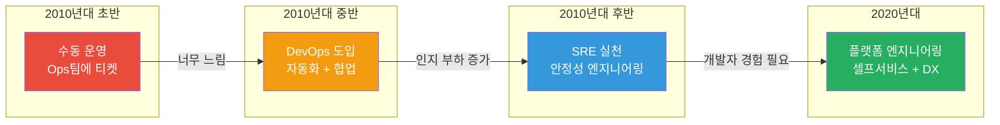
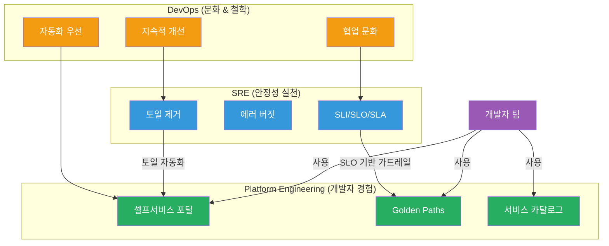
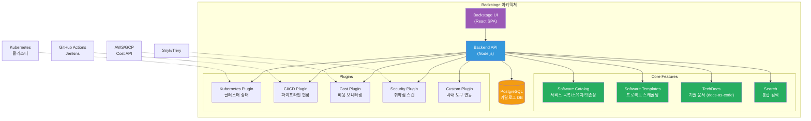
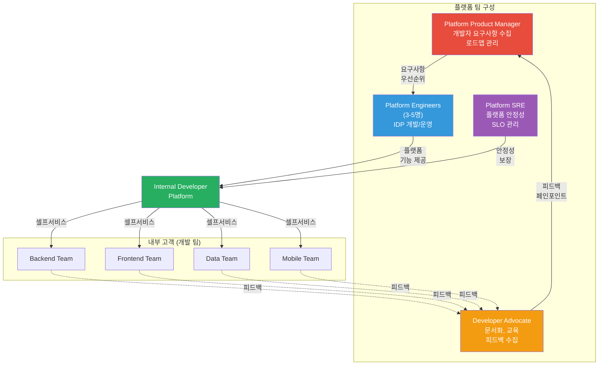
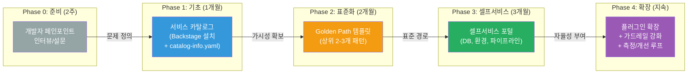

# 플랫폼 엔지니어링 (Platform Engineering)

> 개발자가 인프라를 직접 만지지 않아도, 필요한 환경을 셀프서비스로 뚝딱 만들 수 있는 세상 — 마치 사내 앱스토어처럼요. DevOps와 SRE의 원칙([SRE 원칙](./01-principles))을 배웠다면, 이제 그 위에 **개발자 경험(Developer Experience)** 을 올려볼 차례예요. [IaC](../06-iac/)로 인프라를 코드화하고, [CI/CD](../07-cicd/)로 배포를 자동화했다면, 플랫폼 엔지니어링은 이 모든 것을 **하나의 셀프서비스 포털**로 묶어주는 접착제예요.

---

## 🎯 왜 플랫폼 엔지니어링을 알아야 하나요?

### 일상 비유: 회사 구내식당 vs 각자 도시락

100명이 일하는 회사를 상상해보세요.

**도시락 방식 (플랫폼 없음)**:
- 매일 아침 각자 장을 보고, 요리하고, 도시락을 싸와요
- 누구는 요리를 잘하고, 누구는 매일 라면만 먹어요
- 식재료 비용도 제각각, 영양 균형도 들쭉날쭉
- "어제 먹고 탈났어요" — 문제가 생겨도 각자 알아서 해결

**구내식당 방식 (플랫폼 있음)**:
- 전문 셰프 팀이 메뉴를 기획하고, 식재료를 관리해요
- 직원들은 식당에 가서 원하는 메뉴를 골라 먹기만 하면 돼요
- 영양사가 균형 잡힌 메뉴를 설계하고, 위생 관리도 전담
- "새 메뉴 추가해주세요" — 요청하면 셰프 팀이 검토 후 추가

**이게 바로 플랫폼 엔지니어링의 핵심이에요.**

구내식당 = Internal Developer Platform (IDP)
셰프 팀 = Platform Team
메뉴 = Golden Paths (표준화된 기술 경로)
식당 키오스크 = Self-Service Portal

```
실무에서 플랫폼 엔지니어링이 필요한 순간:

• 개발자가 인프라 티켓 올리고 3일째 기다리는 중        → 셀프서비스 필요
• 팀마다 CI/CD 파이프라인이 제각각이라 유지보수 지옥    → 표준화 필요
• 새 입사자가 개발 환경 세팅에 일주일 소요              → 온보딩 자동화 필요
• "그 서비스 누가 관리해요?" 아무도 모름                → 서비스 카탈로그 필요
• 보안팀이 각 팀 설정을 일일이 감사하느라 지침          → 가드레일 내장 필요
• 인프라팀 5명이 개발자 200명의 요청을 처리 중          → 확장 불가능한 구조
• K8s 매니페스트 복사-붙여넣기로 장애 발생              → 템플릿화 필요
```

### DevOps 진화의 자연스러운 다음 단계



### 인지 부하(Cognitive Load) 문제

DevOps가 "You build it, you run it"을 외쳤지만, 현실에서는 개발자에게 너무 많은 것을 요구하게 됐어요.

```
현대 개발자가 알아야 하는 것들:

코드 작성          ████████████████████████████  ← 본업
Git/브랜칭         ████████████                  ← 필수
Docker/컨테이너    ████████████                  ← 필수
Kubernetes         ████████████████              ← 복잡
Terraform/IaC      ████████████                  ← 또 배워야?
CI/CD 파이프라인   ████████████                  ← 또?
모니터링/알림      ████████████                  ← 또?!
보안/네트워크      ████████████                  ← 😫
클라우드 서비스    ████████████████              ← 서비스가 200개...

→ 플랫폼 엔지니어링의 목표: 개발자가 코드 작성에 집중할 수 있게
  나머지는 플랫폼이 추상화해서 제공
```

---

## 🧠 핵심 개념 잡기

### 1. Platform Engineering 정의

> **비유**: 건물의 공용 인프라 (전기, 수도, 엘리베이터)

아파트에 살면 전기 배선, 수도관, 엘리베이터를 직접 설치하지 않아요. 건물 관리팀이 이 모든 것을 제공하고, 입주자는 스위치를 켜고 수도꼭지를 틀기만 하면 되죠.

**플랫폼 엔지니어링**이란, 소프트웨어 엔지니어링 조직 내에서 **셀프서비스 역량을 갖춘 Internal Developer Platform(IDP)을 설계하고 구축하는 분야**예요.

핵심 원칙 3가지:

- **추상화 (Abstraction)**: 복잡한 인프라를 단순한 인터페이스 뒤에 숨기기
- **셀프서비스 (Self-Service)**: 개발자가 티켓 없이 직접 필요한 것을 프로비저닝
- **가드레일 (Guardrails)**: 자유를 주되, 위험한 행동은 미리 방지

### 2. DevOps / SRE / Platform Engineering 관계

> **비유**: 축구팀의 감독 / 골키퍼 / 구장 관리팀

- **DevOps** = 감독의 철학 (공격수와 수비수가 협력해야 한다는 문화)
- **SRE** = 골키퍼 (시스템 안정성을 지키는 전문 포지션)
- **Platform Engineering** = 구장 관리팀 (선수들이 최고의 경기를 할 수 있도록 잔디, 조명, 시설을 관리)



| 구분 | DevOps | SRE | Platform Engineering |
|------|--------|-----|---------------------|
| **성격** | 문화/철학 | 역할/실천방법 | 제품/조직 |
| **핵심 질문** | "어떻게 협업할까?" | "어떻게 안정적으로 운영할까?" | "어떻게 개발자가 빠르게 움직일까?" |
| **주요 산출물** | CI/CD, 자동화 | SLO, 에러 버짓, 런북 | IDP, 서비스 카탈로그, 템플릿 |
| **대상 고객** | 조직 전체 | 프로덕션 서비스 | 내부 개발자 |
| **성공 지표** | 배포 빈도, 리드 타임 | 가용성, MTTR | 개발자 만족도, 온보딩 시간 |

### 3. Internal Developer Platform (IDP)

> **비유**: 사내 앱스토어

스마트폰의 앱스토어를 생각해보세요. 앱 개발자는 복잡한 운영체제 내부를 몰라도, API와 SDK를 이용해서 앱을 만들 수 있어요. IDP는 이런 경험을 **사내 인프라**에 적용한 거예요.

IDP의 5가지 핵심 계층:

```
┌─────────────────────────────────────────────────┐
│              Developer Portal (UI)               │  ← 개발자가 보는 화면
│         (Backstage, Port, Cortex 등)             │
├─────────────────────────────────────────────────┤
│            Service Catalog                       │  ← 뭐가 있는지 검색
│      (서비스, API, 문서, 소유자 정보)             │
├─────────────────────────────────────────────────┤
│         Self-Service Actions                     │  ← 직접 실행
│    (환경 생성, DB 프로비저닝, 파이프라인 설정)     │
├─────────────────────────────────────────────────┤
│           Golden Paths / Templates               │  ← 표준 경로
│     (프로젝트 템플릿, 아키텍처 가이드)            │
├─────────────────────────────────────────────────┤
│         Integration Layer                        │  ← 기존 도구 연결
│  (K8s, Terraform, GitHub, ArgoCD, Datadog 등)    │
└─────────────────────────────────────────────────┘
```

### 4. Platform as a Product

> **비유**: B2B SaaS처럼 내부 고객을 대하는 것

플랫폼 팀은 내부 개발자를 **고객**으로 봐야 해요. "우리가 만들었으니 써라"가 아니라, "개발자가 원하는 걸 만들자"가 되어야 해요.

- **제품 매니저**: 개발자 요구사항 수집, 우선순위 결정
- **UX 리서치**: 개발자 워크플로우 관찰, 페인 포인트 파악
- **릴리스 주기**: 플랫폼도 버전 관리, 체인지로그 제공
- **SLA 제공**: "셀프서비스 포털 가용성 99.9%" 같은 약속
- **피드백 루프**: NPS, 설문, 사용 패턴 분석

### 5. Golden Paths / Paved Roads

> **비유**: 국립공원의 정비된 등산로

국립공원에 가면 잘 정비된 등산로가 있어요. 표지판도 있고, 위험한 구간에는 울타리도 있죠. 등산객은 이 길을 따라가면 안전하게 정상에 도달할 수 있어요. 물론 숲을 가로질러 갈 수도 있지만, 길을 잃거나 다칠 위험이 커요.

Golden Path란, **조직이 추천하는 표준화된 기술 경로**예요.

- **강제가 아닌 권장**: "이 길을 따라가면 가장 빠르고 안전해요"
- **사전 검증**: 보안, 성능, 운영 측면에서 이미 검증된 경로
- **자유 보장**: 필요하면 벗어날 수 있지만, 그에 따른 책임도 본인이

```
Golden Path 예시:

새 마이크로서비스 만들기:
1. Backstage 템플릿에서 "Spring Boot 서비스" 선택
2. 서비스 이름, 팀, 의존성 입력
3. → 자동 생성: Git repo + CI/CD + K8s manifest + 모니터링 대시보드
4. → 코드만 작성하면 끝!

Golden Path가 없으면:
1. Git repo 수동 생성
2. Dockerfile 직접 작성 (검색해서 복붙)
3. K8s manifest 다른 팀꺼 복사 (오래된 버전일 수도...)
4. CI/CD 설정 직접 작성 (2일 소요)
5. 모니터링? "나중에 하자..."
6. 보안 스캔? "그게 뭔데?"
```

### 6. Developer Experience (DevEx) 지표

> **비유**: 고객 만족도 조사와 같은 것

DevEx를 측정하는 세 가지 핵심 차원 (SPACE 프레임워크에서 발전):

| 차원 | 설명 | 측정 방법 |
|------|------|-----------|
| **Flow State** | 몰입 상태에 들어가기 쉬운가 | 설문, 인터럽트 횟수 |
| **Feedback Loop** | 피드백이 빠르게 오는가 | CI 시간, PR 리뷰 시간 |
| **Cognitive Load** | 불필요한 복잡성이 적은가 | 설문, 온보딩 시간 |

---

## 🔍 하나씩 자세히 알아보기

### 1. Backstage (Spotify OSS)

Spotify가 만들고 CNCF에 기증한 오픈소스 개발자 포털 프레임워크예요. 현재 가장 널리 사용되는 IDP 프레임워크로, 플러그인 기반 아키텍처가 핵심이에요.

#### Backstage 핵심 구성 요소



#### (1) Software Catalog

모든 소프트웨어 자산(서비스, 웹사이트, 라이브러리, 데이터 파이프라인)을 한 곳에서 관리해요. "이 서비스 누가 담당이지?", "이 API 의존성이 뭐지?"를 즉시 답할 수 있게 해줘요.

카탈로그 등록은 `catalog-info.yaml` 파일을 통해 이루어져요:

```yaml
# catalog-info.yaml (서비스 루트에 위치)
apiVersion: backstage.io/v1alpha1
kind: Component
metadata:
  name: payment-service
  description: "결제 처리 마이크로서비스"
  annotations:
    github.com/project-slug: myorg/payment-service
    backstage.io/techdocs-ref: dir:.
    pagerduty.com/service-id: P12345
  tags:
    - java
    - spring-boot
    - payments
  links:
    - url: https://grafana.internal/d/payment
      title: "Grafana 대시보드"
      icon: dashboard
spec:
  type: service
  lifecycle: production
  owner: team-payments
  system: checkout-system
  providesApis:
    - payment-api
  consumesApis:
    - user-api
    - inventory-api
  dependsOn:
    - resource:default/payments-db
    - component:default/notification-service
```

```yaml
# 시스템 수준 정의
apiVersion: backstage.io/v1alpha1
kind: System
metadata:
  name: checkout-system
  description: "주문/결제 시스템"
spec:
  owner: team-commerce
  domain: e-commerce
```

#### (2) Software Templates (Scaffolder)

새 프로젝트를 표준화된 방식으로 생성하는 기능이에요. "New Project" 버튼 하나로 Git repo, CI/CD, 모니터링, 문서 구조까지 한 번에 만들어줘요.

```yaml
# template.yaml - Spring Boot 서비스 템플릿
apiVersion: scaffolder.backstage.io/v1beta3
kind: Template
metadata:
  name: spring-boot-service
  title: Spring Boot 마이크로서비스
  description: |
    Spring Boot 기반 마이크로서비스를 생성합니다.
    포함: CI/CD 파이프라인, Dockerfile, K8s manifests,
    Grafana 대시보드, 알림 설정
  tags:
    - java
    - spring-boot
    - recommended
spec:
  owner: team-platform
  type: service

  # Step 1: 사용자 입력 수집
  parameters:
    - title: 서비스 기본 정보
      required:
        - serviceName
        - owner
        - description
      properties:
        serviceName:
          title: 서비스 이름
          type: string
          description: "예: payment-service"
          pattern: "^[a-z][a-z0-9-]*$"
          ui:autofocus: true
        owner:
          title: 담당 팀
          type: string
          ui:field: OwnerPicker
          ui:options:
            catalogFilter:
              kind: Group
        description:
          title: 서비스 설명
          type: string

    - title: 기술 옵션
      properties:
        javaVersion:
          title: Java 버전
          type: string
          enum: ["17", "21"]
          default: "21"
        database:
          title: 데이터베이스
          type: string
          enum: ["postgresql", "mysql", "none"]
          default: "postgresql"
        messaging:
          title: 메시징
          type: string
          enum: ["kafka", "rabbitmq", "none"]
          default: "none"

  # Step 2: 실행 단계
  steps:
    # 템플릿에서 코드 생성
    - id: fetch-template
      name: 프로젝트 스캐폴딩
      action: fetch:template
      input:
        url: ./skeleton
        values:
          serviceName: ${{ parameters.serviceName }}
          owner: ${{ parameters.owner }}
          javaVersion: ${{ parameters.javaVersion }}
          database: ${{ parameters.database }}

    # GitHub 리포지토리 생성
    - id: publish
      name: GitHub 리포 생성
      action: publish:github
      input:
        repoUrl: github.com?owner=myorg&repo=${{ parameters.serviceName }}
        description: ${{ parameters.description }}
        defaultBranch: main
        protectDefaultBranch: true
        requireCodeOwnerReviews: true

    # Backstage 카탈로그에 등록
    - id: register
      name: 카탈로그 등록
      action: catalog:register
      input:
        repoContentsUrl: ${{ steps['publish'].output.repoContentsUrl }}
        catalogInfoPath: /catalog-info.yaml

    # ArgoCD 앱 등록
    - id: argocd
      name: ArgoCD 앱 생성
      action: argocd:create-app
      input:
        appName: ${{ parameters.serviceName }}
        repoUrl: ${{ steps['publish'].output.remoteUrl }}
        path: k8s/overlays/dev

  # Step 3: 완료 후 안내
  output:
    links:
      - title: GitHub 리포지토리
        url: ${{ steps['publish'].output.remoteUrl }}
      - title: Backstage 카탈로그
        url: ${{ steps['register'].output.catalogInfoUrl }}
      - title: ArgoCD 앱
        url: https://argocd.internal/${{ parameters.serviceName }}
```

#### (3) TechDocs

Docs-as-Code 방식으로, `mkdocs.yml`과 마크다운 파일을 Git 리포에 넣으면 Backstage에서 자동으로 렌더링해줘요.

```yaml
# mkdocs.yml (서비스 리포 루트)
site_name: Payment Service
nav:
  - Home: index.md
  - Architecture: architecture.md
  - API Reference: api.md
  - Runbook: runbook.md
  - ADR:
    - "001: DB 선택": adr/001-database.md
    - "002: 인증 방식": adr/002-authentication.md

plugins:
  - techdocs-core
```

#### (4) Plugins 생태계

Backstage의 진짜 힘은 플러그인 아키텍처에 있어요. 오픈소스 커뮤니티 플러그인과 사내 커스텀 플러그인을 자유롭게 조합할 수 있어요.

```
자주 사용하는 Backstage 플러그인:

인프라/배포:
├── @backstage/plugin-kubernetes       → K8s 클러스터 상태 표시
├── @backstage/plugin-github-actions   → GitHub Actions 파이프라인 현황
├── @roadiehq/backstage-plugin-argo-cd → ArgoCD 배포 상태
└── @backstage/plugin-techdocs         → 기술 문서 렌더링

모니터링/관찰:
├── @backstage/plugin-grafana          → Grafana 대시보드 임베드
├── @backstage/plugin-pagerduty        → 온콜 스케줄 / 인시던트
└── @backstage/plugin-datadog          → Datadog 메트릭 연동

보안/품질:
├── @backstage/plugin-sonarqube        → 코드 품질 분석
├── @backstage/plugin-snyk             → 보안 취약점 스캔
└── @backstage/plugin-lighthouse       → 웹 성능 점수

비용/거버넌스:
├── @backstage/plugin-cost-insights    → 클라우드 비용 분석
└── @backstage/plugin-tech-radar       → 기술 레이더 시각화
```

### 2. Self-Service Portal

셀프서비스의 핵심은 **"티켓 없이, 승인 대기 없이, 개발자가 직접"** 이에요.

#### 셀프서비스 액션 예시

```yaml
# Backstage Scaffolder Action: 데이터베이스 프로비저닝
apiVersion: scaffolder.backstage.io/v1beta3
kind: Template
metadata:
  name: provision-database
  title: PostgreSQL 데이터베이스 생성
  description: "RDS PostgreSQL 인스턴스를 셀프서비스로 프로비저닝합니다"
spec:
  owner: team-platform
  type: resource

  parameters:
    - title: 데이터베이스 설정
      required:
        - dbName
        - environment
        - size
      properties:
        dbName:
          title: 데이터베이스 이름
          type: string
          pattern: "^[a-z][a-z0-9_]*$"
        environment:
          title: 환경
          type: string
          enum: ["dev", "staging"]
          enumNames: ["개발", "스테이징"]
          description: "프로덕션은 별도 승인 필요"
        size:
          title: 인스턴스 크기
          type: string
          enum: ["small", "medium", "large"]
          enumNames:
            - "Small (2 vCPU, 8GB) - 개발/테스트용"
            - "Medium (4 vCPU, 16GB) - 소규모 서비스"
            - "Large (8 vCPU, 32GB) - 중규모 서비스"
        backup:
          title: 자동 백업
          type: boolean
          default: true

  steps:
    - id: create-terraform
      name: Terraform 코드 생성
      action: fetch:template
      input:
        url: ./terraform-rds-template
        values:
          dbName: ${{ parameters.dbName }}
          environment: ${{ parameters.environment }}
          instanceClass: ${{ parameters.size }}

    - id: create-pr
      name: 인프라 PR 생성
      action: publish:github:pull-request
      input:
        repoUrl: github.com?owner=myorg&repo=infrastructure
        branchName: provision-db-${{ parameters.dbName }}
        title: "[Self-Service] DB 프로비저닝: ${{ parameters.dbName }}"
        description: |
          자동 생성된 PR입니다.
          - DB: ${{ parameters.dbName }}
          - 환경: ${{ parameters.environment }}
          - 크기: ${{ parameters.size }}
```

#### 셀프서비스 성숙도 모델

```
레벨 0: 티켓 기반 (Ticket-Based)
├── 개발자가 Jira 티켓 생성
├── Ops 팀이 수동 처리
└── 평균 대기 시간: 3-5일

레벨 1: 문서 기반 (Documented)
├── Wiki에 절차 문서화
├── 개발자가 문서 보고 직접 시도
└── 평균 대기 시간: 1-2일 (+ 실수 가능)

레벨 2: 자동화 (Automated)
├── CLI 도구나 스크립트 제공
├── 개발자가 명령어로 실행
└── 평균 대기 시간: 30분 - 1시간

레벨 3: 셀프서비스 (Self-Service)
├── 웹 포털에서 폼 입력
├── 자동 프로비저닝 + 가드레일
└── 평균 대기 시간: 5-15분

레벨 4: 자율 (Autonomous)
├── 코드 커밋 시 필요한 리소스 자동 감지
├── AI 기반 추천 + 자동 프로비저닝
└── 평균 대기 시간: 0 (선제적)
```

### 3. Crossplane과 Kratix

#### Crossplane: Kubernetes-Native 인프라 관리

Crossplane은 Kubernetes의 선언적 모델을 클라우드 인프라 관리로 확장한 도구예요. Terraform이 별도의 상태 파일을 관리한다면, Crossplane은 Kubernetes의 etcd를 그대로 활용해요.

```yaml
# Crossplane Composite Resource Definition (XRD)
# 개발자에게 노출할 추상화된 인터페이스 정의
apiVersion: apiextensions.crossplane.io/v1
kind: CompositeResourceDefinition
metadata:
  name: xdatabases.platform.myorg.com
spec:
  group: platform.myorg.com
  names:
    kind: XDatabase
    plural: xdatabases
  claimNames:
    kind: Database
    plural: databases
  versions:
    - name: v1alpha1
      served: true
      referenceable: true
      schema:
        openAPIV3Schema:
          type: object
          properties:
            spec:
              type: object
              properties:
                # 개발자가 선택할 수 있는 간단한 파라미터만 노출
                size:
                  type: string
                  enum: ["small", "medium", "large"]
                  description: "데이터베이스 크기"
                engine:
                  type: string
                  enum: ["postgresql", "mysql"]
                  default: "postgresql"
              required:
                - size
---
# Composition: 추상화 뒤에 숨겨진 실제 클라우드 리소스
apiVersion: apiextensions.crossplane.io/v1
kind: Composition
metadata:
  name: xdatabases.aws.platform.myorg.com
  labels:
    provider: aws
spec:
  compositeTypeRef:
    apiVersion: platform.myorg.com/v1alpha1
    kind: XDatabase
  resources:
    - name: rds-instance
      base:
        apiVersion: rds.aws.crossplane.io/v1alpha1
        kind: DBInstance
        spec:
          forProvider:
            region: ap-northeast-2
            dbInstanceClass: db.t3.medium
            engine: postgres
            engineVersion: "15"
            masterUsername: admin
            allocatedStorage: 20
            vpcSecurityGroupIds:
              - sg-xxxxxxxx
            dbSubnetGroupName: default-subnet-group
            backupRetentionPeriod: 7
            storageEncrypted: true  # 보안 가드레일: 암호화 강제
          providerConfigRef:
            name: aws-provider
      patches:
        - fromFieldPath: "spec.size"
          toFieldPath: "spec.forProvider.dbInstanceClass"
          transforms:
            - type: map
              map:
                small: db.t3.small
                medium: db.t3.medium
                large: db.r6g.large
```

개발자가 실제로 사용할 때는 이렇게 간단해요:

```yaml
# 개발자가 작성하는 Claim (간단!)
apiVersion: platform.myorg.com/v1alpha1
kind: Database
metadata:
  name: my-app-db
  namespace: team-payments
spec:
  size: medium
  engine: postgresql
```

이 한 줄의 Claim 뒤에서 Crossplane이 RDS 인스턴스, 서브넷, 시큐리티 그룹, 모니터링까지 자동으로 구성해줘요.

#### Kratix: Platform as a Product 프레임워크

Kratix는 "Promise"라는 개념으로 플랫폼 API를 정의해요. 약속(Promise)이란, "이런 요청을 하면 이런 것을 제공하겠다"는 계약이에요.

```yaml
# Kratix Promise: PostgreSQL 서비스
apiVersion: platform.kratix.io/v1alpha1
kind: Promise
metadata:
  name: postgresql
spec:
  api:
    apiVersion: apiextensions.k8s.io/v1
    kind: CustomResourceDefinition
    metadata:
      name: postgresqls.marketplace.myorg.com
    spec:
      group: marketplace.myorg.com
      names:
        kind: PostgreSQL
        plural: postgresqls
      scope: Namespaced
      versions:
        - name: v1
          served: true
          storage: true
          schema:
            openAPIV3Schema:
              type: object
              properties:
                spec:
                  type: object
                  properties:
                    teamId:
                      type: string
                    size:
                      type: string
                      enum: ["small", "medium", "large"]

  # Promise Pipeline: 요청 처리 워크플로우
  workerClusterResources:
    - apiVersion: apps/v1
      kind: Deployment
      metadata:
        name: postgres-operator
      # ... PostgreSQL Operator 배포

  workflows:
    resource:
      configure:
        - apiVersion: platform.kratix.io/v1alpha1
          kind: Pipeline
          metadata:
            name: configure-postgresql
          spec:
            containers:
              - name: provision
                image: myorg/postgresql-provisioner:latest
                # 보안 검사, 네이밍 규칙, 백업 설정 등 자동 적용
```

#### Crossplane vs Kratix vs Terraform

| 특성 | Crossplane | Kratix | Terraform |
|------|-----------|--------|-----------|
| **실행 모델** | K8s 컨트롤러 (지속적 조정) | K8s Promise 파이프라인 | CLI (일회성 실행) |
| **상태 관리** | K8s etcd | K8s etcd + GitOps | 별도 state 파일 |
| **추상화 수준** | XRD/Composition | Promise/Pipeline | Module |
| **자가 치유** | 있음 (drift 자동 수정) | 있음 | 없음 (수동 apply 필요) |
| **학습 곡선** | K8s 경험 필요 | K8s 경험 필요 | 독립적 학습 가능 |
| **적합한 상황** | K8s 중심 조직 | 플랫폼 팀 초기 구축 | 범용 IaC |

### 4. 플랫폼 팀 구성과 역할

#### 팀 구조



#### 역할별 책임

| 역할 | 핵심 책임 | 주요 활동 |
|------|-----------|-----------|
| **Platform PM** | 제품 전략, 로드맵 | 개발자 인터뷰, 백로그 관리, 우선순위 결정 |
| **Platform Engineer** | IDP 개발/운영 | Backstage 개발, 자동화 구현, 인프라 추상화 |
| **Developer Advocate** | 개발자 지원, 교육 | 문서 작성, 워크숍, 피드백 채널 운영 |
| **Platform SRE** | 플랫폼 안정성 | SLO 설정, 인시던트 대응, 용량 계획 |

#### 플랫폼 팀 안티패턴

```
❌ 피해야 할 안티패턴:

1. "빌드 앤 호프" (Build and Hope)
   → 플랫폼을 만들어놓고 알아서 쓰겠지 기대
   → 해결: Developer Advocate가 적극적으로 온보딩, 교육

2. "강제 채택" (Forced Adoption)
   → "앞으로 이것만 써야 합니다" 통보
   → 해결: Golden Path는 권장, 강제가 아님. 가치를 증명해야 함

3. "기능 공장" (Feature Factory)
   → 개발자 요청 그대로 다 만들어주기
   → 해결: PM이 우선순위 정리, 80%가 쓸 기능에 집중

4. "두꺼운 플랫폼" (Thick Platform)
   → 모든 것을 추상화해서 개발자가 아무것도 이해 못함
   → 해결: 얇은 추상화, 필요하면 내부를 볼 수 있게

5. "섬 팀" (Island Team)
   → 개발 팀과 단절된 채 독자적으로 개발
   → 해결: Embedded 모델로 정기적으로 개발 팀에 합류
```

### 5. Platform Adoption Metrics

플랫폼의 성공을 어떻게 측정할까요?

#### DORA 메트릭과 플랫폼 메트릭

```
DORA 4 Metrics (조직 수준):
├── 배포 빈도 (Deployment Frequency)
├── 리드 타임 (Lead Time for Changes)
├── 변경 실패율 (Change Failure Rate)
└── 복구 시간 (MTTR)

Platform Adoption Metrics (플랫폼 수준):
├── 채택률 (Adoption Rate)
│   ├── 전체 팀 중 플랫폼 사용 팀 비율
│   ├── Golden Path 사용률
│   └── 셀프서비스 요청 vs 티켓 요청 비율
│
├── 개발자 생산성 (Developer Productivity)
│   ├── 온보딩 시간 (새 입사자가 첫 커밋까지)
│   ├── 새 서비스 생성 시간
│   ├── 환경 프로비저닝 시간
│   └── 개발자당 배포 횟수
│
├── 개발자 만족도 (Developer Satisfaction)
│   ├── 플랫폼 NPS (Net Promoter Score)
│   ├── 개발자 설문 점수
│   └── 지원 티켓 감소율
│
├── 플랫폼 안정성 (Platform Reliability)
│   ├── 플랫폼 SLO 달성률
│   ├── 셀프서비스 성공률
│   └── 플랫폼 인시던트 횟수
│
└── 비용 효율성 (Cost Efficiency)
    ├── 팀당 인프라 비용
    ├── 플랫폼 운영 비용 대비 절감 효과
    └── 토일(Toil) 시간 감소율
```

#### 핵심 측정 대시보드 예시

```
╔══════════════════════════════════════════════════════════════╗
║                 Platform Health Dashboard                    ║
╠══════════════════════════════════════════════════════════════╣
║                                                              ║
║  📊 채택률         📈 85% (전월 대비 +5%)                    ║
║  ├── 전체 50개 팀 중 42개 팀 사용                            ║
║  ├── Golden Path 사용률: 78%                                 ║
║  └── 셀프서비스 비율: 91% (티켓: 9%)                         ║
║                                                              ║
║  ⚡ 생산성         📈 개선 중                                ║
║  ├── 온보딩 시간: 2일 (이전: 5일)       -60%                 ║
║  ├── 서비스 생성: 15분 (이전: 3일)      -99%                 ║
║  ├── 환경 생성: 10분 (이전: 2일)        -99%                 ║
║  └── 개발자당 월 배포: 45회 (이전: 12회) +275%               ║
║                                                              ║
║  😊 만족도         NPS: +45 (이전: +22)                      ║
║  ├── "플랫폼 없이는 못 살겠다": 67%                          ║
║  ├── "개선이 필요하다": 28%                                  ║
║  └── "안 쓰고 싶다": 5%                                     ║
║                                                              ║
║  🔒 안정성         SLO: 99.95% (목표: 99.9%)                ║
║  ├── 셀프서비스 성공률: 97.2%                                ║
║  ├── 이번 달 인시던트: 2건 (P3)                              ║
║  └── 평균 복구 시간: 12분                                    ║
║                                                              ║
╚══════════════════════════════════════════════════════════════╝
```

---

## 💻 직접 해보기

### 실습 1: Backstage 로컬 설치 및 실행

```bash
# 사전 준비: Node.js 18+, yarn 필요
node --version  # v18 이상 확인
npm install -g yarn

# Backstage 앱 생성
npx @backstage/create-app@latest

# 프롬프트에서 앱 이름 입력
# ? Enter a name for the app [required] my-platform

# 디렉토리 이동 및 실행
cd my-platform
yarn dev

# 브라우저에서 확인
# http://localhost:3000 → Backstage UI
# http://localhost:7007 → Backstage Backend API
```

실행하면 기본적으로 샘플 컴포넌트가 등록된 카탈로그를 볼 수 있어요.

### 실습 2: 나만의 서비스를 카탈로그에 등록하기

```bash
# 기존 프로젝트 루트에 catalog-info.yaml 생성
cat > catalog-info.yaml << 'EOF'
apiVersion: backstage.io/v1alpha1
kind: Component
metadata:
  name: my-awesome-api
  description: "학습용 API 서비스"
  annotations:
    github.com/project-slug: my-username/my-awesome-api
  tags:
    - python
    - fastapi
spec:
  type: service
  lifecycle: experimental
  owner: guests
EOF
```

Backstage UI에서 등록하는 방법:

```
1. 좌측 메뉴 → "Create..." 클릭
2. "Register Existing Component" 선택
3. URL 입력: https://github.com/my-username/my-repo/blob/main/catalog-info.yaml
4. "Analyze" → "Import" 클릭
5. 카탈로그에서 내 서비스 확인!
```

### 실습 3: Software Template 만들기

```bash
# Backstage 프로젝트 내에 템플릿 디렉토리 생성
mkdir -p packages/backend/templates/python-fastapi

# 템플릿 정의 파일 생성
cat > packages/backend/templates/python-fastapi/template.yaml << 'TEMPLATE_EOF'
apiVersion: scaffolder.backstage.io/v1beta3
kind: Template
metadata:
  name: python-fastapi-service
  title: Python FastAPI 서비스
  description: "FastAPI 기반 REST API 서비스 템플릿"
  tags:
    - python
    - fastapi
    - recommended
spec:
  owner: team-platform
  type: service

  parameters:
    - title: 서비스 정보
      required:
        - name
        - description
      properties:
        name:
          title: 서비스 이름
          type: string
          pattern: "^[a-z][a-z0-9-]*$"
        description:
          title: 설명
          type: string
        port:
          title: 포트 번호
          type: number
          default: 8000

  steps:
    - id: fetch
      name: 템플릿 생성
      action: fetch:template
      input:
        url: ./skeleton
        values:
          name: ${{ parameters.name }}
          description: ${{ parameters.description }}
          port: ${{ parameters.port }}

  output:
    links:
      - title: 생성된 프로젝트
        url: ${{ steps['fetch'].output.repoContentsUrl }}
TEMPLATE_EOF

# 스켈레톤 디렉토리 생성 (실제 생성될 파일들)
mkdir -p packages/backend/templates/python-fastapi/skeleton

cat > packages/backend/templates/python-fastapi/skeleton/main.py << 'SKELETON_EOF'
"""${{ values.description }}"""
from fastapi import FastAPI

app = FastAPI(title="${{ values.name }}")


@app.get("/health")
def health():
    return {"status": "healthy", "service": "${{ values.name }}"}


@app.get("/")
def root():
    return {"message": "Welcome to ${{ values.name }}"}


if __name__ == "__main__":
    import uvicorn
    uvicorn.run(app, host="0.0.0.0", port=${{ values.port }})
SKELETON_EOF

cat > packages/backend/templates/python-fastapi/skeleton/Dockerfile << 'DOCKER_EOF'
FROM python:3.11-slim

WORKDIR /app
COPY requirements.txt .
RUN pip install --no-cache-dir -r requirements.txt
COPY . .

EXPOSE ${{ values.port }}
CMD ["uvicorn", "main:app", "--host", "0.0.0.0", "--port", "${{ values.port }}"]
DOCKER_EOF

cat > packages/backend/templates/python-fastapi/skeleton/catalog-info.yaml << 'CATALOG_EOF'
apiVersion: backstage.io/v1alpha1
kind: Component
metadata:
  name: ${{ values.name }}
  description: ${{ values.description }}
  tags:
    - python
    - fastapi
spec:
  type: service
  lifecycle: experimental
  owner: guests
CATALOG_EOF
```

### 실습 4: Crossplane으로 셀프서비스 DB 프로비저닝

```bash
# 1. Crossplane 설치 (Helm)
helm repo add crossplane-stable https://charts.crossplane.io/stable
helm repo update
helm install crossplane \
  crossplane-stable/crossplane \
  --namespace crossplane-system \
  --create-namespace

# 2. AWS Provider 설치
cat <<EOF | kubectl apply -f -
apiVersion: pkg.crossplane.io/v1
kind: Provider
metadata:
  name: provider-aws-rds
spec:
  package: xpkg.upbound.io/upbound/provider-aws-rds:v1.1.0
EOF

# 3. Provider 설정 (AWS 자격증명)
cat <<EOF | kubectl apply -f -
apiVersion: aws.upbound.io/v1beta1
kind: ProviderConfig
metadata:
  name: default
spec:
  credentials:
    source: Secret
    secretRef:
      namespace: crossplane-system
      name: aws-creds
      key: credentials
EOF

# 4. Composite Resource Definition 적용
kubectl apply -f xrd-database.yaml

# 5. Composition 적용 (실제 AWS 리소스 매핑)
kubectl apply -f composition-database-aws.yaml

# 6. 개발자가 사용 — 이것만 작성하면 끝!
cat <<EOF | kubectl apply -f -
apiVersion: platform.myorg.com/v1alpha1
kind: Database
metadata:
  name: orders-db
  namespace: team-orders
spec:
  size: small
  engine: postgresql
EOF

# 7. 상태 확인
kubectl get databases -n team-orders
kubectl get managed  # 실제 생성된 AWS 리소스 확인
```

### 실습 5: 간단한 플랫폼 CLI 도구 만들기

Backstage 없이도 셀프서비스의 핵심을 체험할 수 있어요. 간단한 CLI 도구를 만들어봐요.

```bash
#!/bin/bash
# platform-cli.sh - 미니 셀프서비스 CLI

set -euo pipefail

TEMPLATES_DIR="./platform-templates"
OUTPUT_DIR="./generated"

show_menu() {
    echo "============================================"
    echo "   🏗️  Internal Developer Platform CLI"
    echo "============================================"
    echo ""
    echo "사용 가능한 액션:"
    echo "  1) 새 마이크로서비스 생성"
    echo "  2) 데이터베이스 프로비저닝"
    echo "  3) CI/CD 파이프라인 추가"
    echo "  4) 모니터링 대시보드 생성"
    echo "  5) 서비스 카탈로그 조회"
    echo "  q) 종료"
    echo ""
}

create_microservice() {
    local name=$1
    local language=$2
    local team=$3

    echo ">>> 마이크로서비스 생성 중: ${name}"

    local service_dir="${OUTPUT_DIR}/${name}"
    mkdir -p "${service_dir}"/{src,tests,k8s,docs,.github/workflows}

    # catalog-info.yaml 생성
    cat > "${service_dir}/catalog-info.yaml" << EOF
apiVersion: backstage.io/v1alpha1
kind: Component
metadata:
  name: ${name}
  description: "${name} 서비스"
  tags:
    - ${language}
spec:
  type: service
  lifecycle: experimental
  owner: ${team}
EOF

    # Dockerfile 생성
    cat > "${service_dir}/Dockerfile" << EOF
FROM python:3.11-slim
WORKDIR /app
COPY requirements.txt .
RUN pip install --no-cache-dir -r requirements.txt
COPY src/ ./src/
CMD ["python", "-m", "src.main"]
EOF

    # K8s manifest 생성
    cat > "${service_dir}/k8s/deployment.yaml" << EOF
apiVersion: apps/v1
kind: Deployment
metadata:
  name: ${name}
  labels:
    app: ${name}
    team: ${team}
spec:
  replicas: 2
  selector:
    matchLabels:
      app: ${name}
  template:
    metadata:
      labels:
        app: ${name}
        team: ${team}
    spec:
      containers:
        - name: ${name}
          image: registry.myorg.com/${team}/${name}:latest
          ports:
            - containerPort: 8080
          resources:
            requests:
              cpu: 100m
              memory: 128Mi
            limits:
              cpu: 500m
              memory: 512Mi
          livenessProbe:
            httpGet:
              path: /health
              port: 8080
            initialDelaySeconds: 10
          readinessProbe:
            httpGet:
              path: /ready
              port: 8080
            initialDelaySeconds: 5
EOF

    # GitHub Actions CI 파이프라인 생성
    cat > "${service_dir}/.github/workflows/ci.yaml" << EOF
name: CI Pipeline
on:
  push:
    branches: [main]
  pull_request:
    branches: [main]

jobs:
  build-and-test:
    runs-on: ubuntu-latest
    steps:
      - uses: actions/checkout@v4
      - name: Build
        run: docker build -t ${name}:test .
      - name: Test
        run: docker run ${name}:test python -m pytest tests/
      - name: Security Scan
        uses: aquasecurity/trivy-action@master
        with:
          image-ref: ${name}:test
EOF

    echo ">>> 완료! 생성된 파일:"
    find "${service_dir}" -type f | sort
    echo ""
    echo ">>> Golden Path 체크리스트:"
    echo "  [x] 소스 코드 구조"
    echo "  [x] Dockerfile"
    echo "  [x] K8s manifests"
    echo "  [x] CI/CD 파이프라인"
    echo "  [x] 카탈로그 등록 파일"
    echo "  [ ] 모니터링 대시보드 (별도 설정 필요)"
    echo "  [ ] 알림 규칙 (별도 설정 필요)"
}

# 메인 실행
main() {
    while true; do
        show_menu
        read -p "선택: " choice
        case ${choice} in
            1)
                read -p "서비스 이름: " svc_name
                read -p "언어 (python/go/java): " svc_lang
                read -p "담당 팀: " svc_team
                create_microservice "${svc_name}" "${svc_lang}" "${svc_team}"
                ;;
            5)
                echo ">>> 등록된 서비스 목록:"
                if [ -d "${OUTPUT_DIR}" ]; then
                    for dir in "${OUTPUT_DIR}"/*/; do
                        if [ -f "${dir}catalog-info.yaml" ]; then
                            name=$(basename "${dir}")
                            owner=$(grep "owner:" "${dir}catalog-info.yaml" | tail -1 | awk '{print $2}')
                            echo "  - ${name} (owner: ${owner})"
                        fi
                    done
                else
                    echo "  (등록된 서비스 없음)"
                fi
                ;;
            q|Q) echo "종료합니다."; exit 0 ;;
            *) echo "잘못된 선택이에요." ;;
        esac
        echo ""
    done
}

main
```

---

## 🏢 실무에서는?

### 사례 1: Spotify (Backstage 탄생 배경)

```
문제 상황:
- 엔지니어 수백 명, 마이크로서비스 수천 개
- "이 서비스 누가 담당이지?" → 슬랙에서 물어보기
- "새 서비스 만들려면 뭐부터 하지?" → 위키 찾아다니기
- "저 API 문서 어디 있어?" → 팀마다 다른 장소

해결:
- Backstage를 내부 도구로 개발
- Software Catalog으로 모든 서비스/API/문서를 한 곳에
- Software Templates로 10분 만에 새 서비스 생성
- 2020년 CNCF에 오픈소스로 기증

결과:
- 새 서비스 생성: 몇 시간 → 10분
- 온보딩: 1주 → 1일
- "누가 담당이지?": 즉시 확인 가능
- CNCF Incubating 프로젝트로 성장 (2024년 Graduated)
```

### 사례 2: 중소규모 스타트업 (개발자 30명)

```
상황:
- 개발자 30명, 마이크로서비스 15개
- DevOps 전담 1명이 모든 인프라 요청 처리
- 티켓 처리 평균 2일, DevOps 엔지니어 번아웃 위기

단계적 도입:
Phase 1 (1개월): 서비스 카탈로그
├── Backstage 설치
├── 기존 15개 서비스 catalog-info.yaml 등록
└── 서비스 소유자, 의존성 시각화

Phase 2 (2개월): Golden Path 템플릿
├── "Spring Boot 서비스" 템플릿 1개 제작
├── "React 프론트엔드" 템플릿 1개 제작
└── 신규 서비스는 템플릿으로만 생성

Phase 3 (3개월): 셀프서비스 기본
├── 개발/스테이징 환경 셀프서비스 (Crossplane 또는 Terraform)
├── RDS, ElastiCache 프로비저닝 자동화
└── 프로덕션은 여전히 승인 필요 (가드레일)

결과:
- DevOps 티켓: 월 80건 → 월 15건 (-81%)
- 새 서비스 생성: 2일 → 30분
- DevOps 엔지니어가 전략적 작업에 집중 가능
```

### 사례 3: 대규모 기업 (개발자 500명+)

```
상황:
- 개발자 500명+, 마이크로서비스 200개+
- 팀마다 다른 CI/CD, 다른 모니터링, 다른 배포 방식
- 보안팀이 각 팀 설정을 감사하기 불가능
- 새 규제 대응(SOC2, GDPR)에 팀별 대응 불가능

플랫폼 팀 구성:
├── Platform PM 1명
├── Platform Engineer 5명
├── Developer Advocate 1명
├── Platform SRE 2명
└── 총 9명

구축 내용:
├── Backstage 기반 Developer Portal
├── Crossplane 기반 인프라 셀프서비스
├── ArgoCD + GitOps 표준 배포 파이프라인
├── OPA(Open Policy Agent) 기반 가드레일
├── 통합 모니터링 대시보드 (Grafana + Datadog)
└── 보안 스캔 자동화 (Trivy + Snyk + SonarQube)

가드레일 예시 (OPA):
- 컨테이너 이미지는 반드시 사내 레지스트리에서만
- CPU/메모리 리밋 필수 설정
- 퍼블릭 인그레스에는 반드시 WAF 적용
- 시크릿은 반드시 Vault에서 주입
- 모든 서비스에 health check 엔드포인트 필수

결과:
- SOC2 감사 대응: 3개월 → 2주 (가드레일이 증거 자동 수집)
- 보안 취약점 발견: 배포 후 → 커밋 시점 (Shift Left)
- 팀 간 기술 표준화: 자발적 채택률 92%
```

### 실무 도구 비교

```
Developer Portal 도구:
├── Backstage (CNCF, Spotify)     → OSS, 커스터마이징 자유도 높음
├── Port (port.io)                → SaaS, 빠른 도입, 코드 불필요
├── Cortex (cortex.io)            → SaaS, 스코어카드 강점
├── Humanitec (humanitec.com)     → SaaS, Score 기반 추상화
└── OpsLevel (opslevel.com)       → SaaS, 서비스 성숙도 관리

선택 기준:
├── 엔지니어 10명 미만    → Port 또는 Cortex (SaaS, 빠른 시작)
├── 엔지니어 10-100명     → Backstage (OSS, 투자 가치 있음)
├── 엔지니어 100명+       → Backstage + 커스텀 플러그인
└── 규제 산업             → Backstage (온프레미스 가능) 또는 Humanitec
```

### 기존 도구와의 통합 아키텍처

```
┌────────────────────────────────────────────────────────────┐
│                    Developer Portal (Backstage)             │
├────────────────────────────────────────────────────────────┤
│                                                            │
│  ┌──────────┐  ┌──────────┐  ┌──────────┐  ┌──────────┐  │
│  │ Catalog  │  │Templates │  │ TechDocs │  │ Search   │  │
│  └────┬─────┘  └────┬─────┘  └────┬─────┘  └────┬─────┘  │
│       │              │              │              │        │
├───────┼──────────────┼──────────────┼──────────────┼────────┤
│       │         Plugin Layer        │              │        │
│  ┌────┴─────┐  ┌────┴─────┐  ┌────┴─────┐  ┌────┴─────┐  │
│  │K8s       │  │ArgoCD    │  │Grafana   │  │PagerDuty │  │
│  │Plugin    │  │Plugin    │  │Plugin    │  │Plugin    │  │
│  └────┬─────┘  └────┬─────┘  └────┬─────┘  └────┬─────┘  │
└───────┼──────────────┼──────────────┼──────────────┼────────┘
        │              │              │              │
        ▼              ▼              ▼              ▼
   ┌─────────┐   ┌─────────┐   ┌─────────┐   ┌─────────┐
   │ K8s     │   │ ArgoCD  │   │ Grafana │   │PagerDuty│
   │Clusters │   │ Server  │   │ Server  │   │  API    │
   └─────────┘   └─────────┘   └─────────┘   └─────────┘

   ┌─────────┐   ┌─────────┐   ┌─────────┐   ┌─────────┐
   │ GitHub  │   │Terraform│   │ Vault   │   │ Snyk    │
   │ API     │   │ Cloud   │   │ Server  │   │  API    │
   └─────────┘   └─────────┘   └─────────┘   └─────────┘
```

---

## ⚠️ 자주 하는 실수

### 실수 1: "도구 먼저, 문제 나중에"

```
❌ 잘못된 접근:
"Backstage가 트렌드니까 도입하자!"
→ 설치했지만 아무도 안 씀
→ 플랫폼 팀만 관리하느라 바쁨
→ 6개월 후 "실패한 프로젝트"로 분류

✅ 올바른 접근:
"개발자들이 뭘 힘들어하지?" → 인터뷰/설문
→ "인프라 티켓 대기가 가장 큰 병목이다" 발견
→ 셀프서비스 DB 프로비저닝부터 시작 (Backstage 없이도 가능)
→ 가치 증명 후 포털 확장
```

### 실수 2: "한 번에 모든 것을 만들기"

```
❌ 잘못된 접근:
6개월 동안 완벽한 IDP를 개발
├── 서비스 카탈로그
├── 20개 템플릿
├── 모든 클라우드 리소스 셀프서비스
├── 커스텀 플러그인 10개
└── → 6개월 후 출시했더니 요구사항이 바뀌어 있음

✅ 올바른 접근 (MVP → 반복):
Week 1-2: 서비스 카탈로그만 (catalog-info.yaml)
Week 3-4: 가장 많이 쓰는 템플릿 1개
Month 2:  셀프서비스 1개 (가장 티켓 많은 것)
Month 3:  피드백 기반 개선 + 다음 기능
→ 매 2주마다 개발자 피드백 수집
```

### 실수 3: "추상화를 너무 두껍게"

```
❌ 잘못된 접근:
개발자에게 K8s를 완전히 숨김
→ "왜 내 서비스가 느리지?" 디버깅 불가
→ "메모리 늘리고 싶은데 어디서 설정하지?" 알 수 없음
→ 문제 생길 때마다 플랫폼 팀에 의존

✅ 올바른 접근 ("얇은 추상화"):
기본은 간단하게, 필요하면 내부를 볼 수 있게
├── 기본 배포: "서비스 이름 + 크기" 만 입력 (Happy Path)
├── 커스텀 필요: K8s manifest를 직접 수정할 수 있는 escape hatch
├── 디버깅: "kubectl 접근"이나 "로그 직접 확인" 가능
└── 교육: "원하면 내부 구조를 이해할 수 있는" 문서 제공
```

### 실수 4: "플랫폼 사용을 강제하기"

```
❌ 잘못된 접근:
"다음 분기부터 모든 팀은 반드시 플랫폼을 사용해야 합니다"
→ 반발과 우회
→ "쓰라고 해서 쓰긴 하는데 불편해요"
→ 신뢰 상실

✅ 올바른 접근:
가치를 증명해서 자발적 채택 유도
├── 얼리어답터 팀 2-3개와 함께 시작
├── "이 팀은 서비스 생성이 3일→15분으로 줄었어요" 성공 사례 공유
├── 다른 팀이 "우리도 쓰고 싶어요" 요청
└── 점진적 확산 (Viral adoption)
```

### 실수 5: "피드백 루프 없이 운영"

```
❌ 잘못된 접근:
플랫폼 만들고 운영만 함
→ 사용률 점점 떨어짐
→ "왜 안 쓰지?" 원인 모름
→ 개발자와 괴리 발생

✅ 올바른 접근:
├── 월 1회 개발자 설문 (5분 이내로 짧게)
├── 분기 1회 Developer Advocate가 팀 방문 (Listening Tour)
├── Slack 채널 #platform-support로 실시간 피드백
├── 사용 패턴 데이터 분석 (어떤 기능이 많이/적게 쓰이는지)
└── 분기별 NPS 측정 및 공유
```

### 실수 6: "측정 없이 운영"

```
❌ 잘못된 접근:
"플랫폼 잘 되고 있는 것 같아요" (감에 의존)
→ 경영진에게 ROI 증명 불가
→ 예산/인력 확보 어려움
→ 플랫폼 팀 축소

✅ 올바른 접근:
도입 전후를 명확히 측정
├── Before: "새 서비스 생성에 평균 3일 소요" (데이터 수집)
├── After:  "새 서비스 생성에 평균 15분 소요" (자동 측정)
├── 절감 효과: "월 960시간 절감 = 엔지니어 6명분"
└── ROI: "플랫폼 팀 4명 투자 → 6명분 효과 = 150% ROI"
```

---

## 📝 마무리

### 핵심 요약

```
플랫폼 엔지니어링 = DevOps + SRE + Developer Experience

핵심 구성 요소:
├── IDP (Internal Developer Platform)
│   ├── 서비스 카탈로그 → "뭐가 있는지 알기"
│   ├── 셀프서비스 포털 → "직접 하기"
│   ├── Golden Paths    → "잘 정비된 길 따라가기"
│   └── 가드레일       → "안전하게 자유롭게"
│
├── Platform as a Product
│   ├── 개발자가 고객
│   ├── PM이 로드맵 관리
│   └── 피드백 기반 개선
│
├── 도구 생태계
│   ├── Backstage → Developer Portal
│   ├── Crossplane → K8s-native 인프라 관리
│   ├── Kratix → Platform API 프레임워크
│   └── OPA → 정책 가드레일
│
└── 성공 지표
    ├── 채택률 (자발적!)
    ├── 개발자 생산성 (온보딩, 배포 시간)
    ├── 개발자 만족도 (NPS)
    └── 비용 효율성 (ROI)
```

### 3줄 핵심

1. **플랫폼 엔지니어링은 개발자의 인지 부하를 줄이고, 셀프서비스를 통해 생산성을 높이는 분야**예요.
2. **"도구 도입"이 아니라 "개발자 문제 해결"에서 시작**해야 해요. Backstage는 수단이지 목적이 아니에요.
3. **"Platform as a Product" 마인드셋**이 핵심이에요. 내부 개발자를 고객으로 대하고, 측정하고, 개선해야 해요.

### 플랫폼 엔지니어링 도입 로드맵



### 플랫폼 엔지니어링 체크리스트

```
도입 전 점검:
[ ] 개발자 페인포인트를 인터뷰/설문으로 파악했는가?
[ ] 가장 큰 병목 3개를 식별했는가?
[ ] 경영진 지원(스폰서)을 확보했는가?
[ ] 플랫폼 팀 역할(PM, Engineer, Advocate)을 정의했는가?
[ ] 성공 지표(KPI)를 정의했는가?

MVP 구축 후 점검:
[ ] 서비스 카탈로그에 주요 서비스가 등록되었는가?
[ ] Golden Path 템플릿이 최소 1개 존재하는가?
[ ] 얼리어답터 팀의 피드백을 수집하고 있는가?
[ ] 셀프서비스 성공률을 측정하고 있는가?
[ ] 플랫폼 자체의 SLO를 설정했는가?

성숙 단계 점검:
[ ] 자발적 채택률이 70% 이상인가?
[ ] 플랫폼 NPS가 양수인가?
[ ] 온보딩 시간이 측정 가능하게 줄었는가?
[ ] 인프라 티켓이 의미 있게 감소했는가?
[ ] 플랫폼 로드맵이 개발자 피드백 기반으로 관리되는가?
```

---

## 🔗 다음 강의

🎉 **10-SRE 카테고리 완료!**

6개 강의를 통해 SRE 원칙, SLI/SLO, 인시던트 관리, 용량 계획, 카오스 엔지니어링, 그리고 플랫폼 엔지니어링까지 — 서비스 신뢰성의 모든 것을 배웠어요.

다음은 **[11-scripting/01-bash — Bash 스크립팅](../11-scripting/01-bash)** 으로 넘어가요.

플랫폼 CLI 도구와 자동화 스크립트를 만들려면 스크립팅 실력이 필수예요. 지금까지 배운 모든 것을 코드로 자동화하는 방법을 배워볼게요!

### 연관 학습 경로

```
현재 위치: 플랫폼 엔지니어링 ✅

선수 지식 (이미 학습한 내용):
├── SRE 원칙 → ./01-principles.md
├── IaC (Terraform, Ansible) → ../06-iac/
└── CI/CD 파이프라인 → ../07-cicd/

다음 학습:
├── Bash 스크립팅 → ../11-scripting/01-bash.md
│   (플랫폼 CLI 도구, 자동화 스크립트 작성)
│
├── GitOps 심화 → ../07-cicd/11-gitops.md
│   (ArgoCD/Flux와 플랫폼의 통합)
│
└── 보안 → ../09-security/
    (OPA, 가드레일, Policy as Code)
```

### 더 깊이 공부하기

```
공식 문서:
├── Backstage 공식 문서: https://backstage.io/docs
├── Crossplane 공식 문서: https://docs.crossplane.io
├── Kratix 공식 문서: https://kratix.io/docs
└── CNCF Platform White Paper: https://tag-app-delivery.cncf.io/whitepapers/platforms/

추천 도서:
├── "Team Topologies" - Matthew Skelton & Manuel Pais
│   (팀 구조와 플랫폼 팀의 역할 이해)
├── "Platform Engineering on Kubernetes" - Mauricio Salatino
│   (K8s 기반 플랫폼 구축 실습)
└── "Designing Delivery" - Jeff Sussna
    (서비스 디자인과 Developer Experience)

커뮤니티:
├── Platform Engineering Slack: platformengineering.org
├── CNCF TAG App Delivery
├── Backstage Community: github.com/backstage/community
└── PlatformCon (연례 컨퍼런스): platformcon.com
```

### 핵심 기억 포인트

> **플랫폼 엔지니어링의 성공은 도구의 완성도가 아니라, 개발자가 "이거 없으면 못 살겠다"고 말할 때 증명돼요.**

---

> **이전**: [SRE 원칙](./01-principles) | **다음**: [Bash 스크립팅](../11-scripting/01-bash)
