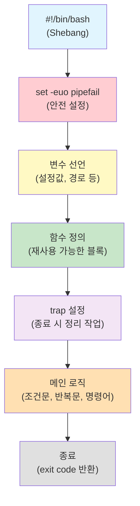
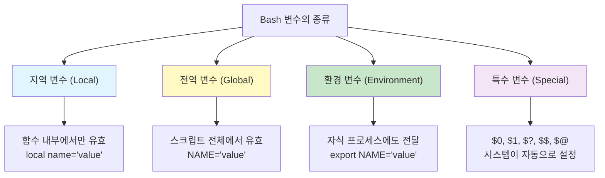
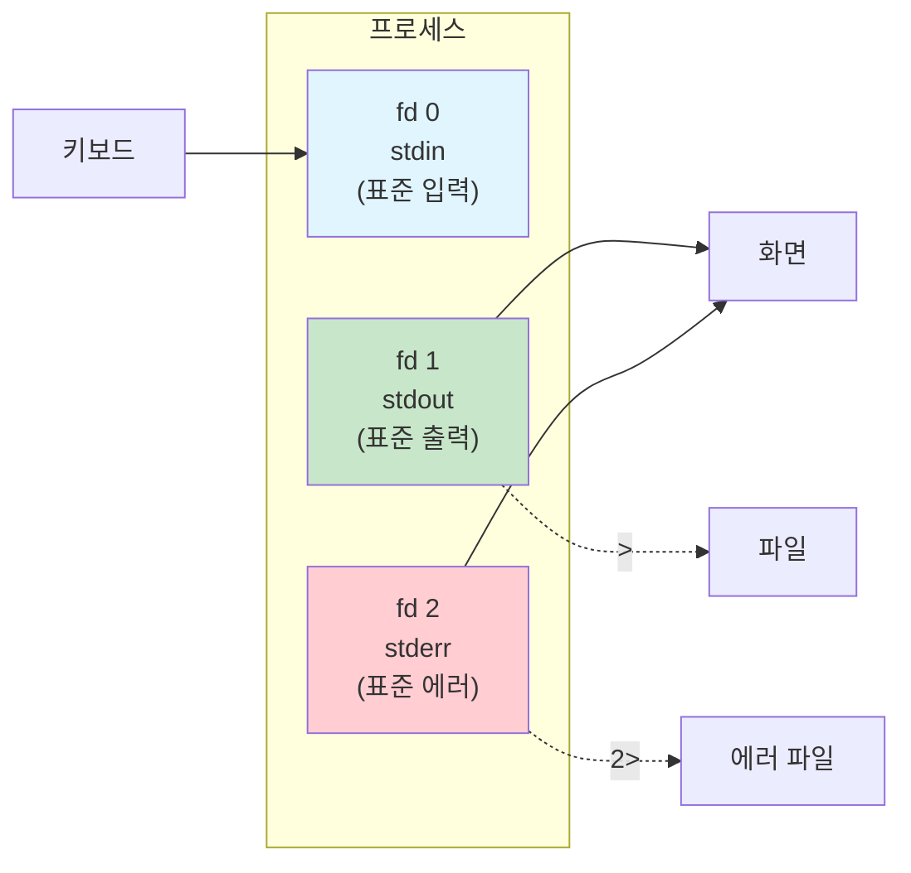
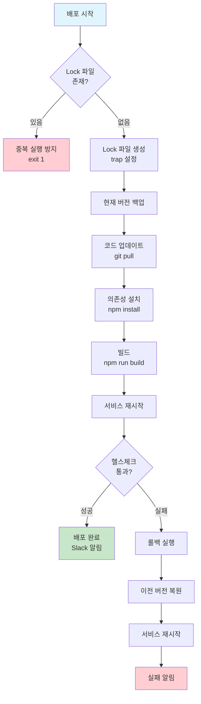

# Bash 스크립팅 완전 정복

> 서버 10대에 똑같은 작업을 해야 하는데 하나씩 접속해서 명령어를 치고 있나요? 매일 새벽에 백업을 해야 하는데 알람 맞춰놓고 일어나고 있나요? Bash 스크립트를 배우면 이런 반복 작업을 자동화할 수 있어요. DevOps 엔지니어의 가장 기본이 되는 무기, Bash 스크립팅을 기초부터 심화까지 완전히 정복해 봐요.

---

## 🎯 왜 Bash 스크립팅을/를 알아야 하나요?

### 자동화 없이는 DevOps가 아니에요

DevOps의 핵심은 **자동화**예요. 그리고 그 자동화의 출발점이 바로 Bash 스크립팅이에요. 아무리 Terraform, Ansible, Kubernetes를 잘 다뤄도, 결국 그 아래에서 돌아가는 건 셸 스크립트인 경우가 많아요.

```
실무에서 Bash 스크립트가 쓰이는 곳들:

 배포 자동화        → deploy.sh (git pull → build → restart)
 서버 상태 체크      → health-check.sh (CPU, 메모리, 디스크)
 로그 관리          → log-rotate.sh (오래된 로그 압축/삭제)
 DB 백업           → backup.sh (덤프 → 압축 → S3 업로드)
 환경 초기화        → setup.sh (패키지 설치, 설정 파일 배포)
 CI/CD 파이프라인   → GitHub Actions, Jenkins의 step들
 모니터링 알림      → alert.sh (임계값 초과 시 Slack 알림)
 보안 점검          → audit.sh (권한, 포트, 프로세스 검사)
```

### Python이 있는데 왜 Bash를 배워야 하나요?

좋은 질문이에요. Python은 복잡한 로직에 강하지만, Bash는 **시스템 명령어를 조합**하는 데 압도적으로 편해요.


> **경험 법칙**: 100줄 이하의 시스템 자동화는 Bash, 그 이상이거나 복잡한 데이터 처리가 필요하면 Python으로 넘어가세요. 자세한 Python 스크립팅은 [다음 강의](./02-python)에서 다뤄요.

---

## 🧠 핵심 개념 잡기

### 비유: 요리 레시피

Bash 스크립트를 이해하는 가장 쉬운 비유는 **요리 레시피**예요.

| 요리 | Bash 스크립팅 |
|------|--------------|
| 재료 | 변수 (데이터) |
| 레시피 순서 | 스크립트의 흐름 (위에서 아래로) |
| "소금이 부족하면 추가" | 조건문 (`if`) |
| "5분간 저어주세요" | 반복문 (`for`, `while`) |
| "반죽 만들기" (별도 공정) | 함수 |
| "불이 꺼지면 가스 잠그기" | trap (시그널 처리) |
| 파이프로 물 연결 | 파이프 (`\|`) |
| 완성된 요리 사진 | 출력 / 리다이렉션 |

### Bash 스크립트의 전체 구조



### 핵심 키워드 한눈에 보기

| 개념 | 설명 | 예시 |
|------|------|------|
| Shebang | 스크립트 해석기 지정 | `#!/bin/bash` |
| 변수 | 데이터를 이름에 저장 | `NAME="hello"` |
| 조건문 | 분기 처리 | `if [ -f file ]; then ...` |
| 반복문 | 여러 번 실행 | `for i in 1 2 3; do ...` |
| 함수 | 코드 재사용 단위 | `my_func() { ... }` |
| 배열 | 여러 값을 하나에 저장 | `ARR=(a b c)` |
| trap | 시그널/종료 시 처리 | `trap cleanup EXIT` |
| 파이프 | 명령어 출력을 다음 입력으로 | `cmd1 \| cmd2` |
| 리다이렉션 | 입출력 방향 변경 | `cmd > file 2>&1` |

---

## 🔍 하나씩 자세히 알아보기

### 1. Shebang과 환경 설정

#### Shebang (`#!`)이란?

스크립트 파일의 첫 줄에 적는 `#!`로 시작하는 줄이에요. **이 스크립트를 어떤 프로그램으로 실행할지** 알려주는 역할이에요.

```bash
#!/bin/bash
# → 이 스크립트를 /bin/bash로 실행해 주세요

#!/usr/bin/env bash
# → 환경 변수에서 bash를 찾아서 실행해 주세요 (이식성 좋음)

#!/usr/bin/env python3
# → Python 스크립트일 때
```

> **팁**: `#!/usr/bin/env bash`가 더 이식성이 좋아요. 시스템마다 bash 경로가 다를 수 있거든요 (예: macOS는 `/usr/local/bin/bash`).

#### `set` 옵션 — 안전한 스크립트의 시작

```bash
#!/bin/bash
set -euo pipefail
```

이 한 줄이 **수많은 사고를 방지**해 줘요. 각 옵션을 하나씩 볼게요.

| 옵션 | 의미 | 없으면 일어나는 일 |
|------|------|-------------------|
| `-e` (errexit) | 명령어가 실패하면 즉시 중단 | 에러를 무시하고 다음 줄 계속 실행 |
| `-u` (nounset) | 정의되지 않은 변수 사용 시 에러 | 빈 문자열로 조용히 대체 |
| `-o pipefail` | 파이프 중간 명령어 실패도 감지 | 마지막 명령어만 성공하면 OK 취급 |

```bash
# -e 없이 일어나는 재앙
#!/bin/bash
cd /nonexistent/path    # 실패해도 계속 진행!
rm -rf *                 # 현재 디렉토리(/)의 모든 파일 삭제!!!

# -e 있으면 안전
#!/bin/bash
set -e
cd /nonexistent/path    # 실패 → 즉시 스크립트 중단
rm -rf *                 # 이 줄은 절대 실행되지 않음
```

```bash
# -o pipefail 없으면 놓치는 에러
#!/bin/bash
cat /nonexistent/file | grep "pattern" | wc -l
# → cat은 실패하지만, wc -l은 0을 반환하며 성공 처리됨

#!/bin/bash
set -o pipefail
cat /nonexistent/file | grep "pattern" | wc -l
# → cat 실패가 전체 파이프라인 실패로 전파됨
```

#### 추가 유용한 set 옵션

```bash
set -x    # 디버그 모드: 실행되는 명령어를 모두 출력
          # + echo hello  ← 이런 식으로 보여줘요
set +x    # 디버그 모드 끄기

set -v    # 스크립트 줄 자체를 출력 (변수 치환 전)
```

---

### 2. 변수 (Variables)

#### 변수의 종류



#### 변수 선언과 사용

```bash
#!/bin/bash

# === 기본 변수 선언 (= 양쪽에 공백 없음!) ===
NAME="ubuntu"
PORT=8080
LOG_DIR="/var/log/myapp"

# 이렇게 하면 에러예요!
# NAME = "ubuntu"    # 'NAME'이라는 명령어를 실행하려는 것으로 해석됨

# === 변수 사용 ===
echo "사용자: $NAME"
echo "포트: ${PORT}"
echo "로그 경로: ${LOG_DIR}/app.log"

# ${} 를 쓰는 이유 — 변수명 경계가 모호할 때
FILE="report"
echo "${FILE}_2025.txt"    # report_2025.txt  (의도한 결과)
echo "$FILE_2025.txt"      # 빈 값 (FILE_2025라는 변수를 찾음!)
```

#### 환경 변수 vs 셸 변수

```bash
# 셸 변수: 현재 셸에서만 유효
MY_VAR="hello"

# 환경 변수: 자식 프로세스에도 전달됨
export APP_ENV="production"

# 확인
bash -c 'echo $MY_VAR'     # (빈 줄) — 자식 프로세스에서 안 보임
bash -c 'echo $APP_ENV'    # production — 자식 프로세스에서도 보임

# 자주 쓰는 환경 변수
echo "홈 디렉토리: $HOME"       # /home/ubuntu
echo "현재 사용자: $USER"       # ubuntu
echo "PATH: $PATH"             # /usr/local/bin:/usr/bin:...
echo "현재 셸: $SHELL"         # /bin/bash
echo "호스트명: $HOSTNAME"     # web01
```

#### 기본값 설정 (Parameter Expansion)

실무에서 정말 많이 쓰는 패턴이에요.

```bash
# ${변수:-기본값} : 변수가 비어있거나 미정의면 기본값 사용
DB_HOST="${DB_HOST:-localhost}"
DB_PORT="${DB_PORT:-3306}"
LOG_LEVEL="${LOG_LEVEL:-info}"

echo "DB: $DB_HOST:$DB_PORT"
# DB: localhost:3306  (환경 변수가 없으면 기본값)

# ${변수:=기본값} : 기본값을 사용하면서 변수에도 할당
: "${CONFIG_DIR:=/etc/myapp}"
echo "$CONFIG_DIR"
# /etc/myapp

# ${변수:?에러메시지} : 변수가 비어있으면 에러 발생 후 종료
DB_PASSWORD="${DB_PASSWORD:?DB_PASSWORD 환경 변수를 설정해 주세요}"
# → DB_PASSWORD가 없으면: bash: DB_PASSWORD: DB_PASSWORD 환경 변수를 설정해 주세요

# ${변수:+대체값} : 변수가 설정되어 있으면 대체값 사용
VERBOSE="${DEBUG:+--verbose}"
# DEBUG가 있으면 --verbose, 없으면 빈 문자열
```

#### 특수 변수

```bash
#!/bin/bash
# special-vars.sh arg1 arg2 arg3

echo "스크립트 이름: $0"       # ./special-vars.sh
echo "첫 번째 인자: $1"       # arg1
echo "두 번째 인자: $2"       # arg2
echo "모든 인자: $@"          # arg1 arg2 arg3
echo "인자 개수: $#"          # 3
echo "직전 종료 코드: $?"      # 0 (성공)
echo "현재 PID: $$"           # 12345
echo "백그라운드 PID: $!"     # 마지막 백그라운드 프로세스 PID
```

#### 읽기 전용 변수

```bash
readonly VERSION="1.0.0"
readonly APP_NAME="myapp"

VERSION="2.0.0"    # 에러! bash: VERSION: readonly variable
```

---

### 3. 문자열 연산 (String Operations)

```bash
STR="Hello, DevOps World!"

# 길이
echo "${#STR}"                # 20

# 부분 문자열 (offset:length)
echo "${STR:0:5}"             # Hello
echo "${STR:7}"               # DevOps World!
echo "${STR: -6}"             # orld!  (뒤에서부터, 공백 필수)

# 치환
echo "${STR/DevOps/SRE}"      # Hello, SRE World!      (첫 번째만)
echo "${STR//o/0}"            # Hell0, Dev0ps W0rld!   (모두 치환)

# 삭제 (패턴 매칭)
FILE="/var/log/nginx/access.log"
echo "${FILE##*/}"            # access.log     (마지막 /까지 삭제 → 파일명)
echo "${FILE%/*}"             # /var/log/nginx  (마지막 /부터 삭제 → 디렉토리)

# 확장자 처리
FILENAME="backup_2025.tar.gz"
echo "${FILENAME%.gz}"        # backup_2025.tar    (짧은 매칭: 마지막 .gz만)
echo "${FILENAME%%.*}"        # backup_2025        (긴 매칭: 첫 번째 .부터 전부)

# 대소문자 변환 (Bash 4+)
NAME="devops"
echo "${NAME^}"               # Devops   (첫 글자 대문자)
echo "${NAME^^}"              # DEVOPS   (전체 대문자)
UPPER="HELLO"
echo "${UPPER,,}"             # hello    (전체 소문자)
```

---

### 4. 조건문 (Conditionals)

#### if 문 기본 구조

```bash
if [ 조건 ]; then
    # 참일 때 실행
elif [ 조건2 ]; then
    # 조건2가 참일 때
else
    # 모두 거짓일 때
fi
```

#### `[ ]` vs `[[ ]]` 차이

| 기능 | `[ ]` (POSIX) | `[[ ]]` (Bash 전용) |
|------|---------------|---------------------|
| 이식성 | 모든 셸에서 동작 | Bash, Zsh 등만 지원 |
| 패턴 매칭 | 불가 | `[[ $a == hello* ]]` |
| 정규식 | 불가 | `[[ $a =~ ^[0-9]+$ ]]` |
| AND/OR | `-a` / `-o` | `&&` / `\|\|` |
| 변수 따옴표 | 필수 (`"$VAR"`) | 선택 (안 써도 안전) |
| 단어 분리 | 발생함 | 발생 안 함 |

```bash
# 문자열 비교
NAME="ubuntu"
if [[ "$NAME" == "ubuntu" ]]; then
    echo "Ubuntu입니다"
fi

# 패턴 매칭 ([ ]에서는 불가)
if [[ "$NAME" == *buntu* ]]; then
    echo "buntu가 포함됨"
fi

# 정규식 매칭
EMAIL="user@example.com"
if [[ "$EMAIL" =~ ^[a-zA-Z0-9._%+-]+@[a-zA-Z0-9.-]+\.[a-zA-Z]{2,}$ ]]; then
    echo "유효한 이메일 형식"
fi

# 숫자 비교
COUNT=10
if [[ "$COUNT" -gt 5 ]]; then echo "5보다 큼"; fi
if [[ "$COUNT" -eq 10 ]]; then echo "10임"; fi
if [[ "$COUNT" -le 20 ]]; then echo "20 이하"; fi

# 산술 비교는 (( ))가 더 직관적
if (( COUNT > 5 )); then echo "5보다 큼"; fi
if (( COUNT == 10 )); then echo "10임"; fi
if (( COUNT >= 5 && COUNT <= 20 )); then echo "5~20 사이"; fi

# 파일 검사
if [[ -f "/etc/nginx/nginx.conf" ]]; then echo "파일 존재"; fi
if [[ -d "/var/log" ]]; then echo "디렉토리 존재"; fi
if [[ -x "/usr/local/bin/docker" ]]; then echo "실행 권한 있음"; fi
if [[ ! -s "/tmp/empty.txt" ]]; then echo "파일이 비어있거나 없음"; fi
if [[ -r "$FILE" && -w "$FILE" ]]; then echo "읽기/쓰기 가능"; fi
```

#### case 문 — 다중 분기

```bash
#!/bin/bash
# service-ctl.sh — 서비스 제어 스크립트

ACTION="${1:-help}"
SERVICE="${2:-nginx}"

case "$ACTION" in
    start)
        echo "$SERVICE 시작 중..."
        systemctl start "$SERVICE"
        ;;
    stop)
        echo "$SERVICE 중지 중..."
        systemctl stop "$SERVICE"
        ;;
    restart)
        echo "$SERVICE 재시작 중..."
        systemctl restart "$SERVICE"
        ;;
    status)
        systemctl status "$SERVICE"
        ;;
    start|stop|restart)
        # 위에서 이미 처리됨 (이 줄은 실행 안 됨)
        ;;
    *)
        echo "사용법: $0 {start|stop|restart|status} [서비스명]"
        exit 1
        ;;
esac

# 패턴 매칭도 가능
read -rp "계속하시겠습니까? (y/n): " answer
case "$answer" in
    [yY]|[yY][eE][sS])
        echo "계속합니다"
        ;;
    [nN]|[nN][oO])
        echo "취소합니다"
        exit 0
        ;;
    *)
        echo "y 또는 n으로 답해 주세요"
        exit 1
        ;;
esac
```

---

### 5. 반복문 (Loops)

#### for 문

```bash
#!/bin/bash

# 리스트 순회
for server in web01 web02 web03 db01; do
    echo "처리 중: $server"
done

# 범위 (brace expansion)
for i in {1..5}; do
    echo "번호: $i"
done

# C 스타일
for ((i = 0; i < 10; i++)); do
    echo "인덱스: $i"
done

# 파일 목록 순회
for file in /var/log/*.log; do
    if [[ -f "$file" ]]; then
        size=$(du -sh "$file" 2>/dev/null | awk '{print $1}')
        echo "$file: $size"
    fi
done

# 명령어 결과로 순회
for user in $(cut -d: -f1 /etc/passwd | head -5); do
    echo "사용자: $user"
done
```

#### while 문

```bash
#!/bin/bash

# 카운터
count=0
while [[ $count -lt 5 ]]; do
    echo "카운트: $count"
    ((count++))
done

# 파일 한 줄씩 읽기 (가장 많이 쓰는 패턴!)
while IFS= read -r line; do
    echo "서버: $line"
done < servers.txt

# 무한 루프 (모니터링 용도)
while true; do
    echo "$(date '+%H:%M:%S') - 디스크: $(df -h / | tail -1 | awk '{print $5}')"
    sleep 60
done

# 조건부 반복
retry=0
max_retry=5
while [[ $retry -lt $max_retry ]]; do
    if curl -sf http://localhost:8080/health > /dev/null 2>&1; then
        echo "서비스 정상!"
        break
    fi
    ((retry++))
    echo "재시도 $retry/$max_retry..."
    sleep 3
done

if [[ $retry -eq $max_retry ]]; then
    echo "서비스 응답 없음 - 헬스체크 실패!"
    exit 1
fi
```

#### until 문

```bash
# while의 반대: 조건이 참이 될 때까지 반복
count=0
until [[ $count -ge 5 ]]; do
    echo "카운트: $count"
    ((count++))
done

# 서비스가 올라올 때까지 대기
until systemctl is-active --quiet nginx; do
    echo "Nginx가 아직 시작되지 않았어요. 대기 중..."
    sleep 2
done
echo "Nginx가 시작되었어요!"
```

#### 반복문 제어: break와 continue

```bash
# break: 루프 탈출
for i in {1..100}; do
    if [[ $i -eq 10 ]]; then
        echo "10에서 중단"
        break
    fi
    echo "$i"
done

# continue: 다음 반복으로 건너뛰기
for file in /var/log/*.log; do
    # 빈 파일은 건너뛰기
    if [[ ! -s "$file" ]]; then
        continue
    fi
    echo "분석: $file ($(wc -l < "$file") 줄)"
done
```

---

### 6. 함수 (Functions)

#### 함수 정의와 호출

```bash
#!/bin/bash

# 함수 정의 방법 1 (권장)
log_info() {
    echo "[$(date '+%Y-%m-%d %H:%M:%S')] [INFO] $*"
}

# 함수 정의 방법 2 (function 키워드)
function log_error() {
    echo "[$(date '+%Y-%m-%d %H:%M:%S')] [ERROR] $*" >&2
}

# 호출
log_info "서버 상태 체크를 시작합니다"
log_error "디스크 사용률이 90%를 초과했습니다"
```

#### 인자와 반환값

```bash
#!/bin/bash

# 함수 인자: $1, $2, ... / $@ (전체) / $# (개수)
greet() {
    local name=$1           # local: 함수 내부에서만 유효
    local greeting=${2:-"안녕하세요"}
    echo "${greeting}, ${name}님!"
}

greet "DevOps팀"                # 안녕하세요, DevOps팀님!
greet "SRE팀" "반갑습니다"       # 반갑습니다, SRE팀님!

# return은 종료 코드(0~255)만 반환 가능
# 값을 돌려주려면 echo + 명령어 치환을 사용
check_disk_usage() {
    local mount_point=${1:-"/"}
    local usage
    usage=$(df -h "$mount_point" | tail -1 | awk '{gsub(/%/,""); print $5}')
    echo "$usage"    # 값을 stdout으로 출력
    return 0         # 성공 상태
}

# 함수의 출력을 변수에 캡처
disk_usage=$(check_disk_usage "/")
echo "디스크 사용률: ${disk_usage}%"

# 성공/실패 판단에 return 활용
is_service_running() {
    local service=$1
    systemctl is-active --quiet "$service" 2>/dev/null
    return $?    # systemctl의 종료 코드를 그대로 반환
}

if is_service_running "nginx"; then
    echo "Nginx 실행 중"
else
    echo "Nginx 중지됨"
fi
```

#### local 변수의 중요성

```bash
#!/bin/bash

# local 없이 — 전역 변수를 오염시킴
bad_function() {
    result="함수 내부 값"    # 전역 변수!
}

result="원래 값"
bad_function
echo "$result"    # "함수 내부 값" — 원래 값이 사라졌어요!

# local 사용 — 안전
good_function() {
    local result="함수 내부 값"    # 함수 내부에서만 유효
}

result="원래 값"
good_function
echo "$result"    # "원래 값" — 안전하게 유지됨
```

---

### 7. 배열 (Arrays)

#### 인덱스 배열 (Indexed Array)

```bash
#!/bin/bash

# 선언
SERVERS=("web01" "web02" "web03" "db01" "db02")

# 접근
echo "${SERVERS[0]}"        # web01 (첫 번째 요소)
echo "${SERVERS[2]}"        # web03 (세 번째 요소)
echo "${SERVERS[-1]}"       # db02 (마지막 요소, Bash 4.3+)

# 전체 요소
echo "${SERVERS[@]}"        # web01 web02 web03 db01 db02
echo "${SERVERS[*]}"        # web01 web02 web03 db01 db02

# 요소 개수
echo "${#SERVERS[@]}"       # 5

# 요소 추가
SERVERS+=("cache01")
echo "${#SERVERS[@]}"       # 6

# 요소 삭제
unset 'SERVERS[1]'          # web02 삭제 (인덱스 유지됨!)

# 배열 순회
for server in "${SERVERS[@]}"; do
    echo "서버: $server"
done

# 인덱스와 함께 순회
for i in "${!SERVERS[@]}"; do
    echo "인덱스 $i: ${SERVERS[$i]}"
done

# 슬라이스
echo "${SERVERS[@]:1:3}"    # 인덱스 1부터 3개
```

#### 연관 배열 (Associative Array) — Bash 4+

```bash
#!/bin/bash

# 선언 (declare -A 필수!)
declare -A SERVER_IPS
SERVER_IPS=(
    ["web01"]="10.0.1.10"
    ["web02"]="10.0.1.11"
    ["db01"]="10.0.2.10"
)

# 접근
echo "${SERVER_IPS[web01]}"    # 10.0.1.10

# 추가/수정
SERVER_IPS["cache01"]="10.0.3.10"

# 모든 키
echo "${!SERVER_IPS[@]}"       # web01 web02 db01 cache01

# 모든 값
echo "${SERVER_IPS[@]}"        # 10.0.1.10 10.0.1.11 10.0.2.10 10.0.3.10

# 키-값 순회
for server in "${!SERVER_IPS[@]}"; do
    echo "$server → ${SERVER_IPS[$server]}"
done

# 키 존재 여부 확인
if [[ -v SERVER_IPS["web01"] ]]; then
    echo "web01이 등록되어 있어요"
fi

# 실무 예: 서비스별 포트 매핑
declare -A SERVICE_PORTS=(
    ["nginx"]="80"
    ["api"]="8080"
    ["redis"]="6379"
    ["postgres"]="5432"
)

for svc in "${!SERVICE_PORTS[@]}"; do
    port=${SERVICE_PORTS[$svc]}
    if ss -tlnp | grep -q ":${port} "; then
        echo "$svc (포트 $port): 실행 중"
    else
        echo "$svc (포트 $port): 중지됨"
    fi
done
```

---

### 8. I/O 리다이렉션과 파이프

#### 파일 디스크립터 이해하기



#### 리다이렉션 총정리

```bash
# === 출력 리다이렉션 ===
echo "hello" > file.txt       # stdout을 파일에 (덮어쓰기)
echo "world" >> file.txt      # stdout을 파일에 (추가)

# === 에러 리다이렉션 ===
find / -name "*.conf" 2> errors.txt      # stderr만 파일에
find / -name "*.conf" 2>/dev/null        # stderr 버리기 (블랙홀)

# === stdout + stderr 합치기 ===
command > output.txt 2>&1    # stdout과 stderr 모두 파일에 (전통 방식)
command &> output.txt        # 위와 동일 (Bash 단축 표현)

# === 입력 리다이렉션 ===
wc -l < /etc/passwd          # 파일 내용을 stdin으로
mysql < backup.sql           # SQL 파일을 MySQL에 입력

# === Here Document (여러 줄 입력) ===
cat << 'EOF'
이 안의 내용은 변수 치환이 되지 않아요.
$HOME 이 그대로 출력돼요.
EOF

cat << EOF
이 안의 내용은 변수 치환이 돼요.
홈 디렉토리: $HOME
EOF

# === Here String ===
grep "pattern" <<< "검색할 문자열"

# === /dev/null — 출력 블랙홀 ===
# cron에서 자주 씀
command > /dev/null 2>&1     # 모든 출력 무시
```

#### 파이프와 프로세스 치환

```bash
# 파이프: 앞 명령어의 stdout → 뒤 명령어의 stdin
ps aux | grep nginx | grep -v grep | wc -l

# tee: stdout을 파일에도 저장하면서 화면에도 출력
deploy_command 2>&1 | tee -a deploy.log

# 프로세스 치환 <() — 명령어 출력을 파일처럼 사용
# 두 파일의 차이점 비교 (정렬된 상태로)
diff <(sort file1.txt) <(sort file2.txt)

# 실행 중인 프로세스 목록 비교 (전/후)
comm -13 <(ps -eo comm --sort=comm | sort -u) \
         <(sleep 60 && ps -eo comm --sort=comm | sort -u)

# 프로세스 치환 vs 파이프의 차이
# 파이프: while이 서브셸에서 실행됨 → 변수 변경이 유지 안 됨
count=0
cat servers.txt | while read -r line; do
    ((count++))
done
echo "$count"    # 0! (서브셸에서 변경됨)

# 프로세스 치환: while이 현재 셸에서 실행됨 → 변수 변경 유지
count=0
while read -r line; do
    ((count++))
done < <(cat servers.txt)
echo "$count"    # 정확한 줄 수!
```

---

### 9. trap과 시그널 처리

#### 시그널이란?

프로세스에 보내는 **알림 메시지**예요. "너 종료해", "잠깐 멈춰" 같은 신호를 보내는 거예요.

```bash
# 자주 쓰는 시그널
# SIGINT  (2)   — Ctrl+C
# SIGTERM (15)  — kill 명령어 기본값
# SIGKILL (9)   — 강제 종료 (trap 불가)
# SIGHUP  (1)   — 터미널 연결 끊김
# EXIT          — 스크립트 종료 시 (Bash 전용 pseudo-signal)
# ERR           — 명령어 실패 시 (set -e와 함께)
```

#### trap 기본 사용법

```bash
#!/bin/bash
set -euo pipefail

# trap 형식: trap '명령어' 시그널
# 스크립트 종료 시 정리 작업
cleanup() {
    local exit_code=$?
    echo "정리 작업 실행 중..."
    rm -f /tmp/myapp.lock
    rm -f /tmp/myapp_*.tmp
    if [[ $exit_code -ne 0 ]]; then
        echo "스크립트가 에러로 종료됨 (exit code: $exit_code)"
    fi
}
trap cleanup EXIT

# Ctrl+C (SIGINT) 처리
trap 'echo "Ctrl+C가 눌렸어요. 정리 후 종료합니다."; exit 130' INT

# SIGTERM 처리 (kill 명령어)
trap 'echo "종료 시그널을 받았어요."; exit 143' TERM
```

#### 실무 패턴: Lock 파일 + trap

```bash
#!/bin/bash
set -euo pipefail

LOCK_FILE="/tmp/deploy.lock"
LOG_FILE="/var/log/deploy.log"

# 정리 함수
cleanup() {
    local exit_code=$?
    rm -f "$LOCK_FILE"
    if [[ $exit_code -ne 0 ]]; then
        echo "[$(date)] 배포 실패 (exit: $exit_code)" >> "$LOG_FILE"
        # Slack 알림 등...
    fi
}
trap cleanup EXIT

# 중복 실행 방지
if [[ -f "$LOCK_FILE" ]]; then
    pid=$(cat "$LOCK_FILE")
    if kill -0 "$pid" 2>/dev/null; then
        echo "이미 실행 중입니다! (PID: $pid)"
        exit 1
    else
        echo "잔여 Lock 파일 제거 (PID $pid는 이미 종료됨)"
        rm -f "$LOCK_FILE"
    fi
fi
echo $$ > "$LOCK_FILE"

# 메인 로직...
echo "배포를 시작합니다"
sleep 5
echo "배포가 완료되었습니다"
```

#### trap으로 임시 디렉토리 관리

```bash
#!/bin/bash
set -euo pipefail

# mktemp으로 안전한 임시 디렉토리 생성
TEMP_DIR=$(mktemp -d)
trap 'rm -rf "$TEMP_DIR"' EXIT

echo "임시 디렉토리: $TEMP_DIR"

# 이 디렉토리에서 작업...
cp important_file.txt "$TEMP_DIR/"
# 작업 수행...

# 스크립트가 정상 종료든 에러 종료든
# trap이 임시 디렉토리를 자동으로 삭제해 줘요
```

---

### 10. 정규식과 텍스트 처리 (grep/sed/awk)

#### grep — 패턴 검색

```bash
# 기본 검색
grep "error" /var/log/syslog

# 자주 쓰는 옵션
grep -i "error" /var/log/syslog          # 대소문자 무시
grep -n "error" /var/log/syslog          # 줄 번호 표시
grep -c "error" /var/log/syslog          # 매칭 줄 수만 출력
grep -r "TODO" /opt/app/                 # 재귀 검색
grep -v "debug" /var/log/syslog          # 패턴 제외 (반전)
grep -l "password" /etc/*.conf           # 파일 이름만 출력
grep -A 3 "error" /var/log/syslog        # 매칭 줄 + 뒤 3줄
grep -B 2 "error" /var/log/syslog        # 매칭 줄 + 앞 2줄
grep -C 2 "error" /var/log/syslog        # 매칭 줄 + 앞뒤 2줄

# 확장 정규식 (-E 또는 egrep)
grep -E "error|warning|critical" /var/log/syslog
grep -E "^[0-9]{1,3}\.[0-9]{1,3}\.[0-9]{1,3}\.[0-9]{1,3}" access.log
```

#### sed — 스트림 편집기

```bash
# 기본 치환: s/찾기/바꾸기/
sed 's/old/new/' file.txt         # 각 줄 첫 번째만 치환
sed 's/old/new/g' file.txt        # 모든 매칭 치환 (global)
sed -i 's/old/new/g' file.txt     # 파일 직접 수정 (in-place)
sed -i.bak 's/old/new/g' file.txt # 백업 파일 생성 후 수정

# 줄 삭제
sed '/^#/d' config.txt            # 주석 줄 삭제
sed '/^$/d' config.txt            # 빈 줄 삭제
sed '1,5d' config.txt             # 1~5번째 줄 삭제

# 줄 추가/삽입
sed '3a\새로운 줄' file.txt       # 3번째 줄 뒤에 추가 (after)
sed '3i\새로운 줄' file.txt       # 3번째 줄 앞에 삽입 (insert)

# 실무 예: 설정 파일 수정
# Nginx worker 수 변경
sed -i 's/worker_processes.*/worker_processes 4;/' /etc/nginx/nginx.conf

# IP 주소 변경
sed -i "s/server_name .*/server_name ${NEW_DOMAIN};/" /etc/nginx/conf.d/app.conf

# 여러 치환 한 번에
sed -e 's/foo/bar/g' -e 's/baz/qux/g' file.txt
```

#### awk — 필드 기반 텍스트 처리

```bash
# 기본: 공백으로 구분된 필드 접근
# $1 = 첫 번째 필드, $2 = 두 번째, ... $NF = 마지막 필드, $0 = 전체 줄
echo "hello world bash" | awk '{print $2}'     # world

# 구분자 지정 (-F)
awk -F: '{print $1}' /etc/passwd               # 사용자 이름만

# 조건부 출력
awk '$3 > 1000 {print $1}' /etc/passwd         # UID > 1000인 사용자
df -h | awk 'NR>1 {gsub(/%/,""); if($5>80) print $6, $5"%"}'  # 80% 초과 마운트

# 연산
awk '{sum += $1} END {print "합계:", sum}' numbers.txt
awk '{sum += $1; count++} END {print "평균:", sum/count}' numbers.txt

# 내장 변수
# NR = 현재 줄 번호, NF = 현재 줄 필드 수
# FS = 필드 구분자, OFS = 출력 필드 구분자
awk 'NR >= 10 && NR <= 20' file.txt    # 10~20번째 줄
awk '{print NR": "$0}' file.txt        # 줄 번호 붙이기

# 실무 예: Nginx 로그 분석
# Top 10 접속 IP
awk '{print $1}' access.log | sort | uniq -c | sort -rn | head -10

# 상태 코드별 집계
awk '{print $9}' access.log | sort | uniq -c | sort -rn

# 평균 응답 시간 (마지막 필드가 응답 시간이라 가정)
awk '{sum += $NF; count++} END {printf "평균: %.3f초\n", sum/count}' access.log
```

> **참고**: Linux 기본 명령어 파이프라인에 대한 더 자세한 내용은 [리눅스 Bash 스크립팅 기초](../01-linux/11-bash-scripting)를 참고하세요.

---

### 11. 디버깅 (Debugging)

#### set -x (Trace 모드)

```bash
#!/bin/bash
set -euo pipefail

# 전체 스크립트 디버깅
set -x

NAME="DevOps"
echo "Hello, $NAME"
# 출력:
# + NAME=DevOps
# + echo 'Hello, DevOps'
# Hello, DevOps

set +x    # 디버깅 끄기

# 특정 구간만 디버깅
echo "디버깅 시작 전"
set -x
# 디버깅할 부분
result=$((1 + 2))
echo "$result"
set +x
echo "디버깅 끝난 후"
```

#### PS4 — 디버그 출력 형식 커스터마이징

```bash
#!/bin/bash
# 디버그 출력에 파일명, 줄 번호, 함수명 표시
export PS4='+${BASH_SOURCE}:${LINENO}:${FUNCNAME[0]:+${FUNCNAME[0]}(): }'
set -x

my_function() {
    local x=10
    echo "$x"
}

my_function
# 출력:
# +script.sh:8:my_function(): local x=10
# +script.sh:9:my_function(): echo 10
# 10
```

#### ShellCheck — 정적 분석 도구

```bash
# 설치
# Ubuntu/Debian
sudo apt install shellcheck

# macOS
brew install shellcheck

# 사용
shellcheck myscript.sh
# In myscript.sh line 3:
# echo $foo
#      ^--^ SC2086: Double quote to prevent globbing and word splitting.
#
# In myscript.sh line 5:
# cat file | grep pattern
#     ^---^ SC2002: Useless use of cat.
```

ShellCheck가 잡아주는 흔한 문제들:

| 코드 | 문제 | 해결 |
|------|------|------|
| SC2086 | 변수에 따옴표 없음 | `echo "$var"` |
| SC2046 | 명령어 치환에 따옴표 없음 | `"$(command)"` |
| SC2002 | 쓸모없는 cat 사용 | `grep pattern file` |
| SC2034 | 사용되지 않는 변수 | 변수 제거 또는 export |
| SC2155 | `local`과 값 할당 분리 | `local x; x=$(cmd)` |

#### bash -n (문법 검사)

```bash
# 실행하지 않고 문법만 검사
bash -n myscript.sh

# 에러 있으면:
# myscript.sh: line 10: syntax error near unexpected token `fi'
# myscript.sh: line 10: `fi'
```

---

## 💻 직접 해보기

### 실습 1: 서버 헬스체크 스크립트

> 여러 항목을 체크하고, 문제가 있으면 경고를 출력하는 스크립트를 만들어 보세요.

```bash
#!/bin/bash
#====================================================================
# health-check.sh — 서버 종합 상태 점검 스크립트
#====================================================================
set -euo pipefail

# --- 설정 ---
DISK_THRESHOLD=80
MEM_THRESHOLD=85
LOAD_THRESHOLD=$(nproc)    # CPU 코어 수를 임계값으로
TIMESTAMP=$(date '+%Y-%m-%d %H:%M:%S')
HOSTNAME=$(hostname)
WARNINGS=0

# --- 함수 ---
log_ok() {
    printf "  [OK]      %s\n" "$1"
}

log_warn() {
    printf "  [WARNING] %s\n" "$1"
    ((WARNINGS++)) || true
}

check_disk() {
    echo "--- 디스크 ---"
    while IFS= read -r line; do
        usage=$(echo "$line" | awk '{gsub(/%/,""); print $5}')
        mount=$(echo "$line" | awk '{print $6}')
        if [[ $usage -gt $DISK_THRESHOLD ]]; then
            log_warn "$mount: ${usage}% (임계값: ${DISK_THRESHOLD}%)"
        else
            log_ok "$mount: ${usage}%"
        fi
    done < <(df -h 2>/dev/null | grep "^/dev" || true)
}

check_memory() {
    echo "--- 메모리 ---"
    local total used percent
    total=$(free -m | awk '/Mem:/ {print $2}')
    used=$(free -m | awk '/Mem:/ {print $3}')
    percent=$(( used * 100 / total ))

    if [[ $percent -gt $MEM_THRESHOLD ]]; then
        log_warn "메모리: ${used}MB / ${total}MB (${percent}%)"
    else
        log_ok "메모리: ${used}MB / ${total}MB (${percent}%)"
    fi
}

check_load() {
    echo "--- CPU 부하 ---"
    local load1
    load1=$(awk '{print $1}' /proc/loadavg)
    local load_int=${load1%.*}    # 소수점 제거

    if [[ $load_int -ge $LOAD_THRESHOLD ]]; then
        log_warn "Load Average: $load1 (코어 수: $LOAD_THRESHOLD)"
    else
        log_ok "Load Average: $load1 (코어 수: $LOAD_THRESHOLD)"
    fi
}

check_services() {
    echo "--- 서비스 ---"
    local services=("sshd" "cron")

    for svc in "${services[@]}"; do
        if systemctl is-active --quiet "$svc" 2>/dev/null; then
            log_ok "$svc: 실행 중"
        else
            log_warn "$svc: 중지됨"
        fi
    done
}

# --- 메인 ---
echo "========================================"
echo " 서버 상태 리포트"
echo " 호스트: $HOSTNAME"
echo " 시각:   $TIMESTAMP"
echo "========================================"
echo ""

check_disk
echo ""
check_memory
echo ""
check_load
echo ""
check_services

echo ""
echo "========================================"
if [[ $WARNINGS -gt 0 ]]; then
    echo " 경고 ${WARNINGS}건 발견!"
    exit 1
else
    echo " 모든 항목 정상"
    exit 0
fi
```

### 실습 2: 로그 로테이션 스크립트

> 오래된 로그를 압축하고 일정 기간이 지나면 삭제하는 스크립트예요.

```bash
#!/bin/bash
#====================================================================
# log-rotate.sh — 수동 로그 로테이션 스크립트
# 사용법: ./log-rotate.sh [로그디렉토리] [보관일수]
#====================================================================
set -euo pipefail

# --- 설정 ---
LOG_DIR="${1:-/var/log/myapp}"
KEEP_DAYS="${2:-30}"
COMPRESS_DAYS=1     # 1일 지난 로그는 압축
TIMESTAMP=$(date '+%Y%m%d_%H%M%S')

# --- 함수 ---
log() {
    echo "[$(date '+%Y-%m-%d %H:%M:%S')] $1"
}

# --- 검증 ---
if [[ ! -d "$LOG_DIR" ]]; then
    log "에러: 디렉토리가 없어요 — $LOG_DIR"
    exit 1
fi

# --- 메인 ---
log "로그 로테이션 시작: $LOG_DIR"
log "보관 기간: ${KEEP_DAYS}일"

# 1. 1일 지난 .log 파일 압축
compressed=0
while IFS= read -r -d '' file; do
    if [[ ! -f "${file}.gz" ]]; then
        gzip -9 "$file"
        ((compressed++)) || true
        log "  압축: $(basename "$file")"
    fi
done < <(find "$LOG_DIR" -name "*.log" -mtime +$COMPRESS_DAYS -print0 2>/dev/null)
log "압축된 파일: ${compressed}개"

# 2. 보관 기간 지난 압축 파일 삭제
deleted=0
while IFS= read -r -d '' file; do
    rm -f "$file"
    ((deleted++)) || true
    log "  삭제: $(basename "$file")"
done < <(find "$LOG_DIR" -name "*.gz" -mtime +$KEEP_DAYS -print0 2>/dev/null)
log "삭제된 파일: ${deleted}개"

# 3. 빈 파일 정리
find "$LOG_DIR" -empty -type f -delete 2>/dev/null || true

# 4. 현재 디스크 사용량
usage=$(du -sh "$LOG_DIR" 2>/dev/null | awk '{print $1}')
log "현재 디스크 사용: $usage"
log "로그 로테이션 완료"
```

### 실습 3: 인자 처리 패턴 (getopt 스타일)

```bash
#!/bin/bash
#====================================================================
# deploy.sh — 배포 스크립트 (인자 처리 예제)
# 사용법: ./deploy.sh -e staging -b feature/auth -r
#====================================================================
set -euo pipefail

# --- 사용법 ---
usage() {
    cat << EOF
사용법: $0 [옵션]

옵션:
  -e, --env ENV      배포 환경 (dev|staging|prod) [필수]
  -b, --branch NAME  브랜치 이름 (기본: main)
  -r, --restart       서비스 재시작 여부
  -d, --dry-run       실제 실행 없이 시뮬레이션
  -h, --help          도움말

예시:
  $0 -e staging -b feature/auth -r
  $0 --env prod --branch main --dry-run
EOF
    exit 1
}

# --- 기본값 ---
ENV=""
BRANCH="main"
RESTART=false
DRY_RUN=false

# --- 인자 파싱 ---
while [[ $# -gt 0 ]]; do
    case $1 in
        -e|--env)
            ENV="$2"
            shift 2
            ;;
        -b|--branch)
            BRANCH="$2"
            shift 2
            ;;
        -r|--restart)
            RESTART=true
            shift
            ;;
        -d|--dry-run)
            DRY_RUN=true
            shift
            ;;
        -h|--help)
            usage
            ;;
        *)
            echo "알 수 없는 옵션: $1"
            usage
            ;;
    esac
done

# --- 필수 인자 검증 ---
if [[ -z "$ENV" ]]; then
    echo "에러: --env 옵션은 필수예요!"
    usage
fi

if [[ "$ENV" != "dev" && "$ENV" != "staging" && "$ENV" != "prod" ]]; then
    echo "에러: 환경은 dev, staging, prod 중 하나여야 해요."
    exit 1
fi

# --- 실행 ---
echo "환경:    $ENV"
echo "브랜치:  $BRANCH"
echo "재시작:  $RESTART"
echo "시뮬레이션: $DRY_RUN"

if [[ "$DRY_RUN" == "true" ]]; then
    echo "[DRY-RUN] 실제 배포는 실행하지 않아요."
else
    echo "배포를 시작합니다..."
    # 실제 배포 로직...
fi
```

### 실습 4: 배열과 연관 배열 활용

```bash
#!/bin/bash
#====================================================================
# multi-server-check.sh — 여러 서버 상태 체크
#====================================================================
set -euo pipefail

# 연관 배열: 서버 역할별 IP
declare -A SERVERS=(
    ["web01"]="10.0.1.10"
    ["web02"]="10.0.1.11"
    ["api01"]="10.0.2.10"
    ["db01"]="10.0.3.10"
)

# 역할별 체크할 포트
declare -A CHECK_PORTS=(
    ["web01"]="80"
    ["web02"]="80"
    ["api01"]="8080"
    ["db01"]="5432"
)

# 결과 저장 배열
declare -a FAILED_SERVERS=()

check_server() {
    local name=$1
    local ip=${SERVERS[$name]}
    local port=${CHECK_PORTS[$name]}

    printf "%-8s (%s:%s) ... " "$name" "$ip" "$port"

    # 포트 체크 (timeout 3초)
    if timeout 3 bash -c "echo >/dev/tcp/$ip/$port" 2>/dev/null; then
        echo "OK"
        return 0
    else
        echo "FAIL"
        FAILED_SERVERS+=("$name")
        return 1
    fi
}

echo "===== 서버 상태 체크 ====="
echo ""

for server in "${!SERVERS[@]}"; do
    check_server "$server" || true
done

echo ""
echo "===== 결과 ====="
if [[ ${#FAILED_SERVERS[@]} -eq 0 ]]; then
    echo "모든 서버 정상 (${#SERVERS[@]}대)"
else
    echo "장애 서버: ${FAILED_SERVERS[*]} (${#FAILED_SERVERS[@]}/${#SERVERS[@]}대)"
    exit 1
fi
```

---

## 🏢 실무에서는?

### 시나리오 1: 무중단 배포 스크립트

실제 운영 환경에서 사용하는 배포 스크립트의 구조예요.



```bash
#!/bin/bash
#====================================================================
# deploy-production.sh — 프로덕션 배포 스크립트
#====================================================================
set -euo pipefail

# --- 설정 ---
readonly APP_DIR="/opt/myapp"
readonly BACKUP_DIR="/opt/backups"
readonly LOCK_FILE="/tmp/deploy.lock"
readonly LOG_FILE="/var/log/deploy.log"
readonly SERVICE_NAME="myapp"
readonly HEALTH_URL="http://localhost:8080/health"
readonly HEALTH_TIMEOUT=30
readonly HEALTH_INTERVAL=3

BRANCH="${1:-main}"
TIMESTAMP=$(date +%Y%m%d_%H%M%S)

# --- 로깅 ---
log() {
    local level=$1
    shift
    echo "[$(date '+%Y-%m-%d %H:%M:%S')] [$level] $*" | tee -a "$LOG_FILE"
}

# --- 정리/롤백 ---
cleanup() {
    local exit_code=$?
    rm -f "$LOCK_FILE"
    if [[ $exit_code -ne 0 ]]; then
        log "ERROR" "배포 실패 (exit: $exit_code). 롤백을 시작합니다."
        rollback
        notify_slack "failure"
    fi
}
trap cleanup EXIT

rollback() {
    local backup_path="${BACKUP_DIR}/${SERVICE_NAME}_${TIMESTAMP}"
    if [[ -d "$backup_path" ]]; then
        log "WARN" "롤백: $backup_path → $APP_DIR"
        rm -rf "$APP_DIR"
        cp -r "$backup_path" "$APP_DIR"
        systemctl restart "$SERVICE_NAME" 2>/dev/null || true
        log "INFO" "롤백 완료"
    else
        log "ERROR" "롤백 실패: 백업이 없어요 ($backup_path)"
    fi
}

notify_slack() {
    local status=$1
    local color icon message
    if [[ "$status" == "success" ]]; then
        color="good"; icon="white_check_mark"
        message="배포 성공: $BRANCH ($TIMESTAMP)"
    else
        color="danger"; icon="x"
        message="배포 실패: $BRANCH ($TIMESTAMP)"
    fi
    # curl -s -X POST "$SLACK_WEBHOOK_URL" \
    #     -H 'Content-type: application/json' \
    #     -d "{\"attachments\":[{\"color\":\"$color\",\"text\":\":$icon: $message\"}]}"
    log "INFO" "Slack 알림: $message"
}

health_check() {
    local elapsed=0
    log "INFO" "헬스체크 시작 (최대 ${HEALTH_TIMEOUT}초)"
    while [[ $elapsed -lt $HEALTH_TIMEOUT ]]; do
        if curl -sf "$HEALTH_URL" > /dev/null 2>&1; then
            log "INFO" "헬스체크 통과 (${elapsed}초)"
            return 0
        fi
        sleep $HEALTH_INTERVAL
        elapsed=$((elapsed + HEALTH_INTERVAL))
    done
    log "ERROR" "헬스체크 실패 (${HEALTH_TIMEOUT}초 초과)"
    return 1
}

# --- 중복 실행 방지 ---
if [[ -f "$LOCK_FILE" ]]; then
    log "ERROR" "이미 배포가 진행 중 (PID: $(cat "$LOCK_FILE"))"
    exit 1
fi
echo $$ > "$LOCK_FILE"

# --- 배포 시작 ---
log "INFO" "========== 배포 시작: $BRANCH =========="

# 1. 백업
log "INFO" "1단계: 백업"
mkdir -p "$BACKUP_DIR"
cp -r "$APP_DIR" "${BACKUP_DIR}/${SERVICE_NAME}_${TIMESTAMP}"

# 2. 코드 업데이트
log "INFO" "2단계: 코드 업데이트 ($BRANCH)"
cd "$APP_DIR"
git fetch origin
git checkout "$BRANCH"
git pull origin "$BRANCH"

# 3. 의존성 설치
log "INFO" "3단계: 의존성 설치"
npm ci --production 2>&1 | tail -5

# 4. 빌드
log "INFO" "4단계: 빌드"
npm run build 2>&1 | tail -5

# 5. 서비스 재시작
log "INFO" "5단계: 서비스 재시작"
systemctl restart "$SERVICE_NAME"

# 6. 헬스체크
log "INFO" "6단계: 헬스체크"
health_check

# 7. 오래된 백업 정리 (7일)
find "$BACKUP_DIR" -maxdepth 1 -name "${SERVICE_NAME}_*" -mtime +7 -exec rm -rf {} + 2>/dev/null || true

log "INFO" "========== 배포 성공! =========="
notify_slack "success"
```

### 시나리오 2: DB 백업 + S3 업로드 + 보관 관리

```bash
#!/bin/bash
#====================================================================
# db-backup.sh — DB 백업 스크립트
# cron: 0 2 * * * /opt/scripts/db-backup.sh >> /var/log/db-backup.log 2>&1
#====================================================================
set -euo pipefail

# --- 설정 ---
DB_HOST="${DB_HOST:-localhost}"
DB_PORT="${DB_PORT:-5432}"
DB_NAME="${DB_NAME:?DB_NAME 환경 변수가 필요해요}"
DB_USER="${DB_USER:-backup_user}"
S3_BUCKET="${S3_BUCKET:-s3://mycompany-backups/database}"
LOCAL_BACKUP_DIR="/tmp/db-backups"
KEEP_LOCAL_DAYS=3
KEEP_S3_DAYS=30
TIMESTAMP=$(date +%Y%m%d_%H%M%S)
BACKUP_FILE="${DB_NAME}_${TIMESTAMP}.sql.gz"

log() { echo "[$(date '+%Y-%m-%d %H:%M:%S')] $1"; }

# --- 정리 ---
cleanup() {
    local exit_code=$?
    rm -f "${LOCAL_BACKUP_DIR}/${DB_NAME}_${TIMESTAMP}.sql" 2>/dev/null || true
    if [[ $exit_code -ne 0 ]]; then
        log "백업 실패! (exit: $exit_code)"
    fi
}
trap cleanup EXIT

# --- 실행 ---
mkdir -p "$LOCAL_BACKUP_DIR"

# 1. 덤프 + 압축
log "DB 덤프 시작: $DB_NAME"
pg_dump -h "$DB_HOST" -p "$DB_PORT" -U "$DB_USER" -Fc "$DB_NAME" \
    > "${LOCAL_BACKUP_DIR}/${BACKUP_FILE}"
DUMP_SIZE=$(du -h "${LOCAL_BACKUP_DIR}/${BACKUP_FILE}" | awk '{print $1}')
log "덤프 완료: $BACKUP_FILE ($DUMP_SIZE)"

# 2. S3 업로드
log "S3 업로드 시작"
aws s3 cp "${LOCAL_BACKUP_DIR}/${BACKUP_FILE}" \
    "${S3_BUCKET}/${BACKUP_FILE}" \
    --storage-class STANDARD_IA
log "S3 업로드 완료"

# 3. 로컬 오래된 백업 삭제
deleted=$(find "$LOCAL_BACKUP_DIR" -name "${DB_NAME}_*.sql.gz" \
    -mtime +$KEEP_LOCAL_DAYS -delete -print | wc -l)
log "로컬 정리: ${deleted}개 삭제 (${KEEP_LOCAL_DAYS}일 초과)"

# 4. S3 오래된 백업 정리
cutoff_date=$(date -d "${KEEP_S3_DAYS} days ago" +%Y-%m-%d 2>/dev/null || \
    date -v-${KEEP_S3_DAYS}d +%Y-%m-%d)
aws s3 ls "${S3_BUCKET}/" | while read -r line; do
    file_date=$(echo "$line" | awk '{print $1}')
    file_name=$(echo "$line" | awk '{print $4}')
    if [[ "$file_date" < "$cutoff_date" && -n "$file_name" ]]; then
        aws s3 rm "${S3_BUCKET}/${file_name}"
        log "S3 삭제: $file_name"
    fi
done

log "백업 완료: $BACKUP_FILE ($DUMP_SIZE)"
```

### 시나리오 3: CI/CD 파이프라인에서의 Bash

GitHub Actions나 Jenkins에서 실제로 쓰이는 셸 스크립트 패턴이에요.

```bash
#!/bin/bash
#====================================================================
# ci-test.sh — CI 파이프라인용 테스트 스크립트
#====================================================================
set -euo pipefail

# CI 환경 감지
CI="${CI:-false}"
if [[ "$CI" == "true" ]]; then
    echo "CI 환경에서 실행 중"
    # CI에서는 색상 비활성화
    RED="" GREEN="" YELLOW="" RESET=""
else
    RED='\033[0;31m'
    GREEN='\033[0;32m'
    YELLOW='\033[0;33m'
    RESET='\033[0m'
fi

pass() { echo -e "${GREEN}PASS${RESET} $1"; }
fail() { echo -e "${RED}FAIL${RESET} $1"; }
warn() { echo -e "${YELLOW}WARN${RESET} $1"; }

TOTAL=0
PASSED=0
FAILED=0

run_test() {
    local test_name=$1
    shift
    ((TOTAL++)) || true

    echo -n "  $test_name ... "
    if "$@" > /dev/null 2>&1; then
        pass ""
        ((PASSED++)) || true
    else
        fail ""
        ((FAILED++)) || true
    fi
}

echo "===== 테스트 실행 ====="

# 린트 검사
echo "[1/3] ShellCheck"
for script in scripts/*.sh; do
    if [[ -f "$script" ]]; then
        run_test "$(basename "$script")" shellcheck "$script"
    fi
done

# 유닛 테스트
echo "[2/3] Unit Tests"
run_test "lib_utils" bash -c "source lib/utils.sh && test_utils"
run_test "lib_config" bash -c "source lib/config.sh && test_config"

# 통합 테스트
echo "[3/3] Integration Tests"
run_test "health_endpoint" curl -sf http://localhost:8080/health
run_test "metrics_endpoint" curl -sf http://localhost:8080/metrics

echo ""
echo "===== 결과 ====="
echo "전체: $TOTAL / 통과: $PASSED / 실패: $FAILED"

if [[ $FAILED -gt 0 ]]; then
    exit 1
fi
```

> **참고**: CI/CD 파이프라인 구축에 대한 자세한 내용은 [Platform Engineering](../10-sre/06-platform-engineering)과 [CI Pipeline](../07-cicd/03-ci-pipeline)을 참고하세요.

---

## ⚠️ 자주 하는 실수

### 실수 1: `set -euo pipefail` 안 쓰기

```bash
# 위험한 스크립트
#!/bin/bash
cd /opt/app/release        # 디렉토리가 없으면?
rm -rf *                    # 현재 위치(/)의 모든 파일 삭제!

# 안전한 스크립트
#!/bin/bash
set -euo pipefail
cd /opt/app/release        # 실패 → 즉시 중단
rm -rf *                    # 실행 안 됨
```

### 실수 2: 변수 따옴표 누락

```bash
# 이건 가장 흔한 실수예요
FILE="my report.txt"

# 잘못된 사용
rm $FILE            # rm my report.txt → "my"와 "report.txt" 2개 삭제 시도!
if [ -f $FILE ]     # 공백 때문에 조건문 깨짐

# 올바른 사용
rm "$FILE"          # rm "my report.txt" → 정확히 한 파일
if [ -f "$FILE" ]   # 안전
```

### 실수 3: = 양쪽 공백

```bash
# Bash에서 변수 할당은 공백이 없어야 해요!
NAME = "ubuntu"     # 에러! 'NAME'이라는 명령어를 실행하려 함
NAME="ubuntu"       # 올바른 할당

# 반면, 조건문 [ ] 안에서는 공백이 필수예요!
if [ "$NAME"="ubuntu" ]    # 항상 참 (문자열 비어있지 않으니까)
if [ "$NAME" = "ubuntu" ]  # 올바른 비교
```

### 실수 4: 배열을 따옴표 없이 사용

```bash
FILES=("file one.txt" "file two.txt" "file three.txt")

# 잘못된 순회 — 공백에서 깨짐
for f in ${FILES[@]}; do
    echo "$f"
done
# file
# one.txt
# file
# two.txt
# ...

# 올바른 순회
for f in "${FILES[@]}"; do
    echo "$f"
done
# file one.txt
# file two.txt
# file three.txt
```

### 실수 5: 파이프에서 변수 변경

```bash
# 파이프의 while은 서브셸에서 실행돼요
count=0
cat file.txt | while read -r line; do
    ((count++))
done
echo "$count"    # 0 — 서브셸에서 변경된 건 유지 안 돼요!

# 해결 1: 리다이렉션 사용
count=0
while read -r line; do
    ((count++))
done < file.txt
echo "$count"    # 정확한 줄 수

# 해결 2: 프로세스 치환
count=0
while read -r line; do
    ((count++))
done < <(some_command)
echo "$count"    # 정확한 값
```

### 실수 6: local과 명령어 치환 한 줄에 쓰기

```bash
# 잘못된 사용 — local이 종료 코드를 덮어씀
my_func() {
    local result=$(false)    # false는 실패(1)를 반환하지만
    echo $?                  # 0! local 자체가 성공했으니까
}

# 올바른 사용 — 분리해서 쓰기
my_func() {
    local result
    result=$(false)          # 이제 false의 종료 코드가 유지됨
    echo $?                  # 1 (set -e에서 잡힘)
}
```

### 실수 7: 명령어 치환에서 따옴표 누락

```bash
# 파일명에 공백이 있으면 깨짐
for file in $(find . -name "*.log"); do
    echo "$file"    # 공백이 포함된 파일명이 쪼개짐
done

# 안전한 방법: -print0 + read
while IFS= read -r -d '' file; do
    echo "$file"
done < <(find . -name "*.log" -print0)
```

---

## 📝 마무리

### 핵심 정리 — Bash 스크립팅 체크리스트

```
스크립트 시작할 때:
  #!/usr/bin/env bash         → Shebang 설정
  set -euo pipefail           → 안전 옵션 필수

변수 다룰 때:
  "$변수"                     → 항상 따옴표로 감싸기
  local 변수                  → 함수 안에서는 local 사용
  ${변수:-기본값}             → 기본값 패턴 활용

코드 품질:
  shellcheck script.sh        → 정적 분석 돌리기
  set -x / set +x            → 디버그 구간 설정
  trap cleanup EXIT           → 정리 작업 설정

배열 다룰 때:
  "${ARR[@]}"                → 배열 순회 시 따옴표
  declare -A MAP             → 연관 배열 선언

파일 읽을 때:
  while IFS= read -r line    → 안전한 줄 읽기 패턴
  find ... -print0 | read -d '' → 특수 문자 안전 처리
```

### 이 강의에서 배운 것

| 주제 | 핵심 내용 |
|------|----------|
| Shebang / set | `#!/usr/bin/env bash` + `set -euo pipefail`이 기본 |
| 변수 | local/global/environment 구분, 따옴표 필수, 기본값 패턴 |
| 조건문 | `[[ ]]` 선호, 파일/문자열/숫자 비교, case로 다중 분기 |
| 반복문 | for (리스트/범위/C스타일), while (파일 읽기), until |
| 함수 | local 변수, return (종료코드), echo (값 반환) |
| 배열 | 인덱스 배열, 연관 배열 (declare -A), `"${ARR[@]}"` |
| I/O | 리다이렉션, 파이프, 프로세스 치환, Here Document |
| trap | EXIT/INT/TERM 시그널 처리, Lock 파일, 임시 디렉토리 관리 |
| 정규식 | grep (검색), sed (치환), awk (필드 처리) |
| 디버깅 | set -x, PS4, ShellCheck, bash -n |
| 실무 패턴 | 배포, 백업, 헬스체크, 로그 로테이션, CI 스크립트 |

### Best Practices 요약

```bash
# 1. 모든 스크립트의 시작
#!/usr/bin/env bash
set -euo pipefail

# 2. 변수는 항상 따옴표
echo "$variable"
rm "$file"

# 3. 함수 안에서는 local
my_func() {
    local name=$1
    local result
    result=$(some_command)
}

# 4. trap으로 정리 작업
trap cleanup EXIT

# 5. 의미 있는 종료 코드
exit 0    # 성공
exit 1    # 일반 에러
exit 2    # 사용법 에러

# 6. 로깅 함수 사용
log() { echo "[$(date '+%Y-%m-%d %H:%M:%S')] $*"; }

# 7. 안전한 파일 처리
while IFS= read -r -d '' file; do
    process "$file"
done < <(find . -print0)

# 8. ShellCheck 통과 필수
shellcheck myscript.sh
```

---

## 🔗 다음 단계

### 바로 이어서 학습하기

| 순서 | 주제 | 링크 |
|------|------|------|
| **다음** | Python 스크립팅 | [02-python.md](./02-python) |
| **복습** | Linux Bash 기초 | [Linux Bash Scripting](../01-linux/11-bash-scripting) |
| **심화** | CI/CD 파이프라인 | [CI Pipeline](../07-cicd/03-ci-pipeline) |
| **응용** | Platform Engineering | [SRE Platform Engineering](../10-sre/06-platform-engineering) |

### 더 깊이 알고 싶다면

- **Advanced Bash-Scripting Guide**: Bash의 모든 기능을 다루는 레퍼런스
- **ShellCheck Wiki**: 각 경고 코드별 설명과 해결법
- **Google Shell Style Guide**: 구글의 셸 스크립트 코딩 스타일 가이드
- **Bash Pitfalls (Greg's Wiki)**: 자주 빠지는 함정 모음

### 연습 과제

1. **초급**: 현재 시스템의 CPU, 메모리, 디스크 정보를 한 화면에 보여주는 `sysinfo.sh`를 만들어 보세요.
2. **중급**: 여러 서버의 `/var/log/syslog`에서 ERROR를 검색하고 결과를 요약하는 `log-search.sh`를 만들어 보세요 (서버 목록은 파일로 받기).
3. **고급**: 배포 스크립트에 롤백, 헬스체크, Slack 알림, 동시 실행 방지를 모두 갖춘 `deploy-full.sh`를 만들어 보세요.
