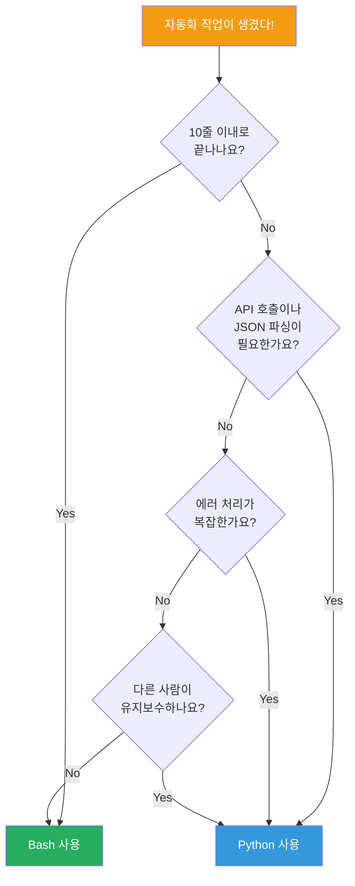
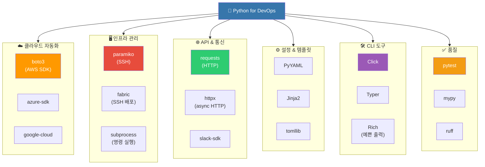
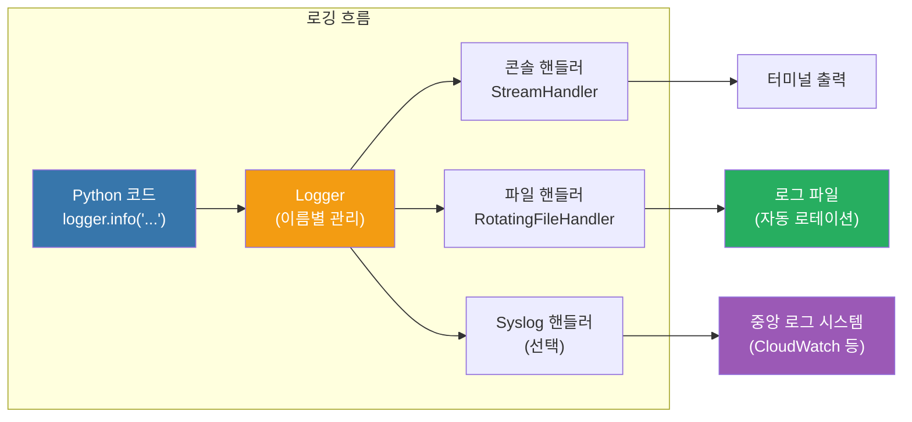
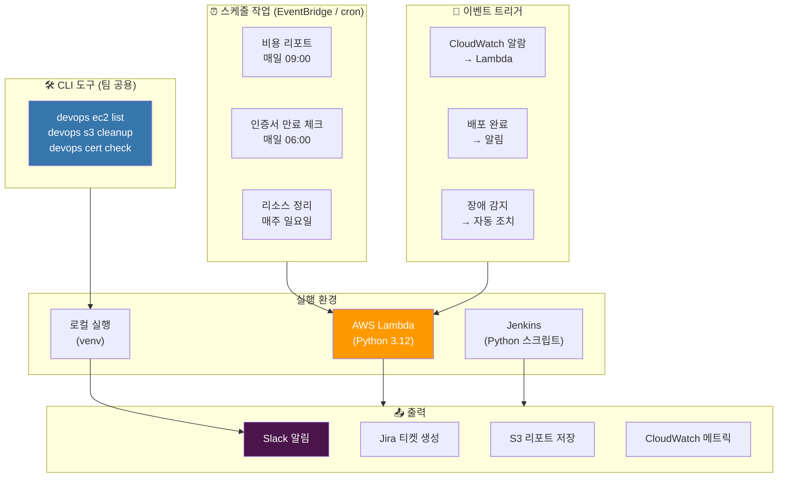

# Python for DevOps

> [이전 강의](./01-bash)에서 Bash 스크립트로 서버 자동화를 배웠어요. 이제 **한 단계 더 복잡한 자동화**가 필요한 순간을 위해, Python이라는 강력한 무기를 장착할 차례예요. "Bash로 10줄이면 Bash, 50줄 넘어가면 Python"이라는 DevOps 현장의 격언이 있어요.

---

## 🎯 왜 Python for DevOps를 알아야 하나요?

```
실무에서 Python이 필요한 순간:
• "AWS 리소스 수백 개를 한번에 정리해야 해요"           → boto3 자동화
• "100대 서버에 동시에 SSH로 명령 실행해야 해요"        → paramiko / fabric
• "Slack/PagerDuty API 연동 스크립트 만들어야 해요"     → requests / httpx
• "팀 전용 CLI 도구가 필요해요"                         → Click / Typer
• "Jinja2로 설정 파일 100개를 자동 생성해야 해요"       → PyYAML + Jinja2
• "매일 비용 리포트를 자동으로 Slack에 보내고 싶어요"   → boto3 + requests
• "인증서 만료 7일 전에 알림 보내야 해요"               → ssl + datetime
• 면접: "Bash vs Python, 어떤 걸 쓰세요?"              → 상황별 선택 기준
```

[Bash 스크립트](./01-bash)가 "주방 칼"이라면, Python은 "스위스 아미 나이프"예요. Bash는 빠르고 단순한 작업에 딱이지만, 복잡한 로직, API 연동, 에러 처리가 필요하면 Python이 훨씬 생산적이에요.

---

## 🧠 핵심 개념 잡기

### 비유: 건설 현장의 도구들

DevOps 자동화를 건설 현장에 비유해볼게요.

| 도구 | DevOps 대응 | 언제 쓰나요? |
|------|-------------|-------------|
| 망치 (Bash) | 간단한 파일 조작, 파이프라인 | 못 하나 박을 때 |
| 전동 드릴 (Python) | 복잡한 자동화, API 연동 | 체계적인 시공이 필요할 때 |
| 크레인 (Terraform/Ansible) | IaC, 대규모 프로비저닝 | 건물 전체를 올릴 때 |

Python은 "전동 드릴"이에요. 망치(Bash)로도 할 수 있지만, 나사를 100개 박아야 하면 전동 드릴이 압도적으로 효율적이죠.

### Bash vs Python 선택 기준



### DevOps Python 도구 생태계



---

## 🔍 하나씩 자세히 알아보기

### 1. 환경 설정: venv와 Poetry

Python 프로젝트의 첫 번째 규칙은 **가상 환경을 만드는 것**이에요. 시스템 Python에 직접 패키지를 설치하면 버전 충돌 지옥에 빠져요.

#### venv (내장 도구)

```bash
# 프로젝트 폴더 생성 및 이동
mkdir devops-tools && cd devops-tools

# 가상 환경 생성
python -m venv .venv

# 활성화 (Linux/Mac)
source .venv/bin/activate

# 활성화 (Windows PowerShell)
.venv\Scripts\Activate.ps1

# 패키지 설치
pip install boto3 requests paramiko click pyyaml jinja2

# 현재 설치된 패키지 기록
pip freeze > requirements.txt

# 다른 환경에서 복원
pip install -r requirements.txt
```

#### Poetry (현대적 패키지 관리)

```bash
# Poetry 설치
pip install poetry

# 새 프로젝트 시작
poetry init

# 패키지 추가 (자동으로 pyproject.toml 업데이트)
poetry add boto3 requests paramiko
poetry add --group dev pytest ruff mypy

# 가상 환경에서 실행
poetry run python my_script.py

# 의존성 설치
poetry install
```

#### pyproject.toml (프로젝트 표준 설정)

```toml
[project]
name = "devops-tools"
version = "1.0.0"
description = "팀 DevOps 자동화 도구 모음"
requires-python = ">=3.11"
dependencies = [
    "boto3>=1.34.0",
    "requests>=2.31.0",
    "paramiko>=3.4.0",
    "click>=8.1.0",
    "pyyaml>=6.0",
    "jinja2>=3.1.0",
    "rich>=13.0.0",
]

[project.optional-dependencies]
dev = [
    "pytest>=8.0.0",
    "ruff>=0.3.0",
    "mypy>=1.8.0",
    "boto3-stubs[ec2,s3,lambda]",
]

[project.scripts]
devops = "devops_tools.cli:app"

[tool.ruff]
line-length = 100
target-version = "py311"

[tool.pytest.ini_options]
testpaths = ["tests"]

[tool.mypy]
python_version = "3.11"
strict = true
```

**venv vs Poetry 비교:**

```
venv + pip:
  ✅ Python 내장, 설치 불필요
  ✅ 단순한 스크립트에 적합
  ❌ lock 파일 없음 (버전 고정 어려움)
  ❌ 의존성 해결이 불완전

Poetry:
  ✅ lock 파일로 정확한 버전 고정
  ✅ 패키지 배포까지 지원
  ✅ 그룹별 의존성 관리 (dev, test)
  ❌ 별도 설치 필요
  ❌ 학습 곡선
```

---

### 2. boto3: AWS SDK로 클라우드 자동화

boto3는 AWS의 공식 Python SDK예요. [AWS 클라우드 서비스](../05-cloud-aws/)를 코드로 제어하는 핵심 라이브러리예요.

#### 기본 사용법

```python
import boto3
from botocore.exceptions import ClientError

# 세션 생성 (프로필 기반)
session = boto3.Session(profile_name="dev-account")

# 리소스 방식 (고수준, 객체지향)
s3_resource = session.resource("s3")

# 클라이언트 방식 (저수준, API 직접 호출)
ec2_client = session.client("ec2", region_name="ap-northeast-2")
```

#### EC2 인스턴스 관리

```python
"""EC2 인스턴스 관리 스크립트"""
import boto3
from datetime import datetime, timezone


def get_ec2_client(region: str = "ap-northeast-2"):
    return boto3.client("ec2", region_name=region)


def list_instances(client, filters: list | None = None) -> list[dict]:
    """모든 EC2 인스턴스 조회"""
    params = {}
    if filters:
        params["Filters"] = filters

    instances = []
    paginator = client.get_paginator("describe_instances")

    for page in paginator.paginate(**params):
        for reservation in page["Reservations"]:
            for instance in reservation["Instances"]:
                # 태그에서 이름 추출
                name = "N/A"
                for tag in instance.get("Tags", []):
                    if tag["Key"] == "Name":
                        name = tag["Value"]
                        break

                instances.append({
                    "id": instance["InstanceId"],
                    "name": name,
                    "type": instance["InstanceType"],
                    "state": instance["State"]["Name"],
                    "launch_time": instance["LaunchTime"],
                    "private_ip": instance.get("PrivateIpAddress", "N/A"),
                })

    return instances


def stop_instances_by_tag(client, tag_key: str, tag_value: str) -> list[str]:
    """특정 태그를 가진 인스턴스 중지"""
    instances = list_instances(client, filters=[
        {"Name": f"tag:{tag_key}", "Values": [tag_value]},
        {"Name": "instance-state-name", "Values": ["running"]},
    ])

    if not instances:
        print("중지할 인스턴스가 없어요.")
        return []

    instance_ids = [inst["id"] for inst in instances]
    print(f"중지 대상: {instance_ids}")

    client.stop_instances(InstanceIds=instance_ids)
    print(f"{len(instance_ids)}개 인스턴스 중지 요청 완료!")
    return instance_ids


# 사용 예시
if __name__ == "__main__":
    client = get_ec2_client()

    # 전체 인스턴스 조회
    for inst in list_instances(client):
        print(f"  {inst['id']} | {inst['name']:20s} | {inst['state']:10s} | {inst['type']}")

    # 개발 환경 인스턴스 퇴근 시 자동 중지
    stop_instances_by_tag(client, "Environment", "dev")
```

#### S3 버킷 관리

```python
"""S3 버킷 관리 및 정리 스크립트"""
import boto3
from datetime import datetime, timezone, timedelta


def cleanup_old_objects(
    bucket_name: str,
    prefix: str,
    days_old: int = 90,
    dry_run: bool = True,
) -> dict:
    """지정 기간보다 오래된 S3 객체 삭제

    Args:
        bucket_name: S3 버킷 이름
        prefix: 검색할 경로 접두사
        days_old: 이 일수보다 오래된 객체를 삭제
        dry_run: True면 삭제 없이 대상만 확인
    """
    s3 = boto3.client("s3")
    cutoff = datetime.now(timezone.utc) - timedelta(days=days_old)

    deleted = []
    total_size = 0

    paginator = s3.get_paginator("list_objects_v2")
    for page in paginator.paginate(Bucket=bucket_name, Prefix=prefix):
        for obj in page.get("Contents", []):
            if obj["LastModified"] < cutoff:
                deleted.append(obj["Key"])
                total_size += obj["Size"]

                if not dry_run:
                    s3.delete_object(Bucket=bucket_name, Key=obj["Key"])

    result = {
        "bucket": bucket_name,
        "prefix": prefix,
        "objects_found": len(deleted),
        "total_size_mb": round(total_size / (1024 * 1024), 2),
        "dry_run": dry_run,
    }

    if dry_run:
        print(f"[DRY RUN] 삭제 대상: {len(deleted)}개, {result['total_size_mb']}MB")
    else:
        print(f"삭제 완료: {len(deleted)}개, {result['total_size_mb']}MB 절약!")

    return result


# 사용 예시
if __name__ == "__main__":
    # 먼저 dry_run으로 확인
    cleanup_old_objects("my-app-logs", "logs/2025/", days_old=90, dry_run=True)

    # 확인 후 실제 삭제
    # cleanup_old_objects("my-app-logs", "logs/2025/", days_old=90, dry_run=False)
```

#### Lambda 함수 배포

```python
"""Lambda 함수 배포 자동화"""
import boto3
import zipfile
import io
from pathlib import Path


def deploy_lambda(
    function_name: str,
    source_dir: str,
    handler: str = "lambda_function.lambda_handler",
    runtime: str = "python3.12",
    role_arn: str | None = None,
) -> dict:
    """Lambda 함수 패키징 및 배포

    소스 디렉토리를 ZIP으로 압축하여 Lambda에 배포해요.
    함수가 없으면 생성, 있으면 코드만 업데이트해요.
    """
    client = boto3.client("lambda", region_name="ap-northeast-2")

    # ZIP 패키징 (메모리에서 처리)
    zip_buffer = io.BytesIO()
    source_path = Path(source_dir)

    with zipfile.ZipFile(zip_buffer, "w", zipfile.ZIP_DEFLATED) as zf:
        for file in source_path.rglob("*.py"):
            arcname = file.relative_to(source_path)
            zf.write(file, arcname)

    zip_buffer.seek(0)
    zip_bytes = zip_buffer.read()
    print(f"ZIP 크기: {len(zip_bytes) / 1024:.1f}KB")

    try:
        # 기존 함수 업데이트
        response = client.update_function_code(
            FunctionName=function_name,
            ZipFile=zip_bytes,
        )
        print(f"함수 업데이트 완료: {function_name}")
    except client.exceptions.ResourceNotFoundException:
        # 새 함수 생성
        if not role_arn:
            raise ValueError("새 함수 생성 시 role_arn이 필요해요!")

        response = client.create_function(
            FunctionName=function_name,
            Runtime=runtime,
            Role=role_arn,
            Handler=handler,
            Code={"ZipFile": zip_bytes},
            Timeout=30,
            MemorySize=256,
            Environment={
                "Variables": {
                    "STAGE": "production",
                    "LOG_LEVEL": "INFO",
                }
            },
        )
        print(f"함수 생성 완료: {function_name}")

    return response
```

---

### 3. paramiko / fabric: SSH 자동화

원격 서버에 SSH로 접속해서 명령을 실행하는 건 DevOps의 일상이에요. paramiko는 SSH의 Python 구현체이고, fabric은 그 위에 만들어진 고수준 배포 도구예요.

#### paramiko로 SSH 자동화

```python
"""paramiko를 사용한 SSH 자동화"""
import paramiko
from pathlib import Path


class SSHManager:
    """SSH 연결 관리자

    비유: 전화 교환원 - 여러 서버에 전화를 걸어 명령을 전달하고 결과를 받아요.
    """

    def __init__(self, hostname: str, username: str, key_path: str | None = None):
        self.hostname = hostname
        self.username = username
        self.key_path = key_path
        self.client = paramiko.SSHClient()
        self.client.set_missing_host_key_policy(paramiko.AutoAddPolicy())

    def connect(self):
        """SSH 연결 수립"""
        connect_kwargs = {
            "hostname": self.hostname,
            "username": self.username,
        }
        if self.key_path:
            connect_kwargs["key_filename"] = self.key_path
        self.client.connect(**connect_kwargs)
        print(f"[연결] {self.username}@{self.hostname}")

    def run_command(self, command: str) -> tuple[str, str, int]:
        """명령 실행 후 stdout, stderr, exit_code 반환"""
        stdin, stdout, stderr = self.client.exec_command(command)
        exit_code = stdout.channel.recv_exit_status()

        out = stdout.read().decode().strip()
        err = stderr.read().decode().strip()

        return out, err, exit_code

    def upload_file(self, local_path: str, remote_path: str):
        """파일 업로드 (SCP)"""
        sftp = self.client.open_sftp()
        sftp.put(local_path, remote_path)
        sftp.close()
        print(f"[업로드] {local_path} → {self.hostname}:{remote_path}")

    def download_file(self, remote_path: str, local_path: str):
        """파일 다운로드"""
        sftp = self.client.open_sftp()
        sftp.get(remote_path, local_path)
        sftp.close()
        print(f"[다운로드] {self.hostname}:{remote_path} → {local_path}")

    def close(self):
        self.client.close()
        print(f"[연결 종료] {self.hostname}")

    def __enter__(self):
        self.connect()
        return self

    def __exit__(self, exc_type, exc_val, exc_tb):
        self.close()


def run_on_multiple_servers(
    servers: list[dict],
    command: str,
) -> dict[str, dict]:
    """여러 서버에 동시 명령 실행"""
    results = {}

    for server in servers:
        host = server["host"]
        try:
            with SSHManager(
                hostname=host,
                username=server["user"],
                key_path=server.get("key"),
            ) as ssh:
                out, err, code = ssh.run_command(command)
                results[host] = {
                    "stdout": out,
                    "stderr": err,
                    "exit_code": code,
                    "success": code == 0,
                }
        except Exception as e:
            results[host] = {
                "stdout": "",
                "stderr": str(e),
                "exit_code": -1,
                "success": False,
            }

    return results


# 사용 예시
if __name__ == "__main__":
    servers = [
        {"host": "web-01.example.com", "user": "ubuntu", "key": "~/.ssh/prod.pem"},
        {"host": "web-02.example.com", "user": "ubuntu", "key": "~/.ssh/prod.pem"},
        {"host": "web-03.example.com", "user": "ubuntu", "key": "~/.ssh/prod.pem"},
    ]

    # 모든 서버의 디스크 사용량 확인
    results = run_on_multiple_servers(servers, "df -h / | tail -1")
    for host, result in results.items():
        status = "OK" if result["success"] else "FAIL"
        print(f"[{status}] {host}: {result['stdout']}")
```

#### fabric으로 배포 자동화

```python
"""fabric을 사용한 배포 스크립트 (fabfile.py)"""
from fabric import Connection, task
from invoke import Context


@task
def deploy(ctx, host, branch="main"):
    """애플리케이션 배포

    사용법: fab deploy --host web-01.example.com --branch main
    """
    conn = Connection(host, user="ubuntu", connect_kwargs={"key_filename": "~/.ssh/prod.pem"})

    with conn.cd("/opt/myapp"):
        # 1. 코드 가져오기
        conn.run(f"git fetch origin && git checkout {branch} && git pull origin {branch}")

        # 2. 의존성 설치
        conn.run("poetry install --no-dev")

        # 3. 마이그레이션
        conn.run("poetry run python manage.py migrate")

        # 4. 서비스 재시작
        conn.sudo("systemctl restart myapp")

        # 5. 헬스 체크
        result = conn.run("curl -sf http://localhost:8000/health || echo 'FAIL'")
        if "FAIL" in result.stdout:
            print(f"[경고] {host} 헬스 체크 실패! 롤백이 필요할 수 있어요.")
        else:
            print(f"[성공] {host} 배포 완료!")
```

---

### 4. requests / httpx: API 호출

외부 서비스와 통신하는 건 DevOps 자동화의 필수 스킬이에요.

#### requests 기본 사용법

```python
"""API 호출 유틸리티"""
import requests
from requests.adapters import HTTPAdapter
from urllib3.util.retry import Retry


def create_session(
    retries: int = 3,
    backoff_factor: float = 0.5,
    timeout: int = 30,
) -> requests.Session:
    """재시도 로직이 포함된 HTTP 세션 생성

    비유: 전화가 안 받으면 3번까지 다시 거는 비서
    """
    session = requests.Session()

    retry_strategy = Retry(
        total=retries,
        backoff_factor=backoff_factor,
        status_forcelist=[429, 500, 502, 503, 504],
    )

    adapter = HTTPAdapter(max_retries=retry_strategy)
    session.mount("http://", adapter)
    session.mount("https://", adapter)
    session.timeout = timeout

    return session


def send_slack_notification(
    webhook_url: str,
    title: str,
    message: str,
    color: str = "#36a64f",
) -> bool:
    """Slack 웹훅으로 알림 보내기"""
    payload = {
        "attachments": [
            {
                "color": color,
                "title": title,
                "text": message,
                "footer": "DevOps Bot",
            }
        ]
    }

    try:
        response = requests.post(webhook_url, json=payload, timeout=10)
        response.raise_for_status()
        return True
    except requests.RequestException as e:
        print(f"Slack 알림 실패: {e}")
        return False


def check_endpoint_health(urls: list[str]) -> list[dict]:
    """여러 엔드포인트의 헬스 상태 확인"""
    session = create_session(retries=2, timeout=5)
    results = []

    for url in urls:
        try:
            response = session.get(url)
            results.append({
                "url": url,
                "status": response.status_code,
                "latency_ms": round(response.elapsed.total_seconds() * 1000),
                "healthy": response.status_code == 200,
            })
        except requests.RequestException as e:
            results.append({
                "url": url,
                "status": 0,
                "latency_ms": -1,
                "healthy": False,
                "error": str(e),
            })

    return results


# 사용 예시
if __name__ == "__main__":
    endpoints = [
        "https://api.example.com/health",
        "https://web.example.com/status",
        "https://admin.example.com/ping",
    ]

    results = check_endpoint_health(endpoints)
    for r in results:
        icon = "OK" if r["healthy"] else "FAIL"
        print(f"[{icon}] {r['url']} - {r['status']} ({r['latency_ms']}ms)")
```

#### httpx로 비동기 API 호출

```python
"""httpx를 사용한 비동기 API 호출"""
import asyncio
import httpx


async def check_endpoints_async(urls: list[str]) -> list[dict]:
    """여러 엔드포인트를 동시에 체크 (비동기)

    requests는 하나씩 순차적으로 확인하지만,
    httpx의 async는 모든 URL을 동시에 확인해요.
    10개 URL × 1초 = requests는 10초, httpx async는 ~1초!
    """
    results = []

    async with httpx.AsyncClient(timeout=5.0) as client:
        tasks = [client.get(url) for url in urls]
        responses = await asyncio.gather(*tasks, return_exceptions=True)

        for url, response in zip(urls, responses):
            if isinstance(response, Exception):
                results.append({"url": url, "healthy": False, "error": str(response)})
            else:
                results.append({
                    "url": url,
                    "status": response.status_code,
                    "healthy": response.status_code == 200,
                })

    return results


# 사용 예시
if __name__ == "__main__":
    urls = [f"https://server-{i}.example.com/health" for i in range(1, 11)]
    results = asyncio.run(check_endpoints_async(urls))
```

---

### 5. Click / Typer: CLI 도구 만들기

팀 전용 CLI 도구를 만들면 "그 스크립트 어디 있었지?" 대신 `devops ec2 list` 한 방이면 돼요.

#### Click으로 CLI 만들기

```python
"""Click 기반 DevOps CLI 도구"""
import click
import boto3
from datetime import datetime


@click.group()
@click.option("--profile", default=None, help="AWS 프로필 이름")
@click.option("--region", default="ap-northeast-2", help="AWS 리전")
@click.pass_context
def cli(ctx, profile, region):
    """DevOps 팀 자동화 CLI 도구"""
    ctx.ensure_object(dict)
    session = boto3.Session(profile_name=profile, region_name=region)
    ctx.obj["session"] = session


@cli.group()
@click.pass_context
def ec2(ctx):
    """EC2 인스턴스 관리"""
    pass


@ec2.command("list")
@click.option("--state", type=click.Choice(["running", "stopped", "all"]), default="all")
@click.option("--output", "fmt", type=click.Choice(["table", "json"]), default="table")
@click.pass_context
def ec2_list(ctx, state, fmt):
    """EC2 인스턴스 목록 조회"""
    client = ctx.obj["session"].client("ec2")

    filters = []
    if state != "all":
        filters.append({"Name": "instance-state-name", "Values": [state]})

    response = client.describe_instances(Filters=filters)

    instances = []
    for res in response["Reservations"]:
        for inst in res["Instances"]:
            name = next(
                (t["Value"] for t in inst.get("Tags", []) if t["Key"] == "Name"),
                "N/A",
            )
            instances.append({
                "ID": inst["InstanceId"],
                "Name": name,
                "Type": inst["InstanceType"],
                "State": inst["State"]["Name"],
            })

    if fmt == "table":
        click.echo(f"{'ID':20s} {'Name':25s} {'Type':15s} {'State':10s}")
        click.echo("-" * 72)
        for inst in instances:
            click.echo(f"{inst['ID']:20s} {inst['Name']:25s} {inst['Type']:15s} {inst['State']:10s}")
    else:
        import json
        click.echo(json.dumps(instances, indent=2))

    click.echo(f"\n총 {len(instances)}개 인스턴스")


@ec2.command("stop")
@click.argument("instance_ids", nargs=-1, required=True)
@click.option("--yes", "-y", is_flag=True, help="확인 없이 바로 중지")
@click.pass_context
def ec2_stop(ctx, instance_ids, yes):
    """EC2 인스턴스 중지"""
    if not yes:
        click.confirm(f"{len(instance_ids)}개 인스턴스를 중지할까요?", abort=True)

    client = ctx.obj["session"].client("ec2")
    client.stop_instances(InstanceIds=list(instance_ids))
    click.echo(f"{len(instance_ids)}개 인스턴스 중지 요청 완료!")


@cli.group()
@click.pass_context
def s3(ctx):
    """S3 버킷 관리"""
    pass


@s3.command("size")
@click.argument("bucket_name")
@click.option("--prefix", default="", help="검색할 경로 접두사")
@click.pass_context
def s3_size(ctx, bucket_name, prefix):
    """S3 버킷/경로의 전체 크기 계산"""
    client = ctx.obj["session"].client("s3")
    paginator = client.get_paginator("list_objects_v2")

    total_size = 0
    total_count = 0

    for page in paginator.paginate(Bucket=bucket_name, Prefix=prefix):
        for obj in page.get("Contents", []):
            total_size += obj["Size"]
            total_count += 1

    size_gb = total_size / (1024 ** 3)
    click.echo(f"버킷: {bucket_name}")
    click.echo(f"경로: {prefix or '/'}")
    click.echo(f"객체 수: {total_count:,}개")
    click.echo(f"총 크기: {size_gb:.2f} GB")


if __name__ == "__main__":
    cli()
```

사용법:

```bash
# EC2 인스턴스 목록
devops ec2 list --state running

# EC2 인스턴스 중지
devops ec2 stop i-0123456789 i-9876543210 --yes

# S3 버킷 크기 확인
devops s3 size my-bucket --prefix logs/

# 다른 프로필/리전 사용
devops --profile prod-account --region us-east-1 ec2 list
```

#### Typer (더 현대적인 CLI 프레임워크)

```python
"""Typer 기반 CLI (타입 힌트로 자동 생성)"""
import typer
from typing import Optional
from enum import Enum

app = typer.Typer(help="DevOps 자동화 도구")
ec2_app = typer.Typer(help="EC2 관리")
app.add_typer(ec2_app, name="ec2")


class OutputFormat(str, Enum):
    table = "table"
    json = "json"


@ec2_app.command("list")
def ec2_list(
    state: str = typer.Option("all", help="인스턴스 상태 필터"),
    region: str = typer.Option("ap-northeast-2", help="AWS 리전"),
    fmt: OutputFormat = typer.Option(OutputFormat.table, help="출력 형식"),
):
    """EC2 인스턴스 목록 조회

    Typer는 타입 힌트만으로 CLI를 자동 생성해요.
    Click보다 코드가 간결하고, 자동 완성도 지원해요.
    """
    import boto3

    client = boto3.client("ec2", region_name=region)
    # ... (나머지 로직은 Click 예시와 동일)
    typer.echo(f"[{region}] EC2 인스턴스 조회 중...")


@ec2_app.command("cleanup")
def ec2_cleanup(
    days: int = typer.Option(7, help="이 일수 이상 중지된 인스턴스 정리"),
    dry_run: bool = typer.Option(True, help="테스트 모드 (실제 삭제 안 함)"),
):
    """오래 중지된 EC2 인스턴스 정리"""
    mode = "DRY RUN" if dry_run else "LIVE"
    typer.echo(f"[{mode}] {days}일 이상 중지된 인스턴스 검색 중...")


if __name__ == "__main__":
    app()
```

**Click vs Typer 비교:**

```
Click:
  ✅ 성숙한 생태계, 레퍼런스 풍부
  ✅ Flask와 같은 Pallets 프로젝트
  ❌ 데코레이터가 많아 코드가 길어짐

Typer:
  ✅ 타입 힌트 기반 자동 CLI 생성
  ✅ 자동 완성(shell completion) 기본 지원
  ✅ FastAPI 저자가 만듦
  ❌ Click 의존 (내부적으로 Click 사용)
```

---

### 6. PyYAML / Jinja2: 설정 파일 자동 생성

인프라 설정 파일을 수동으로 만드는 건 실수의 원인이에요. 템플릿 + 데이터 = 자동 생성이 정답이에요.

#### PyYAML: YAML 파일 읽기/쓰기

```python
"""YAML 설정 관리"""
import yaml
from pathlib import Path


def load_config(config_path: str) -> dict:
    """YAML 설정 파일 로드"""
    with open(config_path) as f:
        return yaml.safe_load(f)


def save_config(config: dict, output_path: str):
    """YAML 설정 파일 저장"""
    with open(output_path, "w") as f:
        yaml.dump(config, f, default_flow_style=False, allow_unicode=True)


# 예시: 환경별 설정 병합
def merge_configs(base_path: str, env_path: str) -> dict:
    """base 설정에 환경별 설정을 덮어쓰기 (overlay 패턴)

    base.yaml:
      app:
        port: 8080
        log_level: INFO

    production.yaml:
      app:
        log_level: WARNING
        replicas: 3

    결과:
      app:
        port: 8080         ← base에서 유지
        log_level: WARNING  ← production이 덮어씀
        replicas: 3         ← production에서 추가
    """
    base = load_config(base_path)
    env = load_config(env_path)

    def deep_merge(base_dict: dict, override_dict: dict) -> dict:
        result = base_dict.copy()
        for key, value in override_dict.items():
            if key in result and isinstance(result[key], dict) and isinstance(value, dict):
                result[key] = deep_merge(result[key], value)
            else:
                result[key] = value
        return result

    return deep_merge(base, env)
```

#### Jinja2: 템플릿 엔진

```python
"""Jinja2로 설정 파일 자동 생성"""
from jinja2 import Environment, FileSystemLoader
from pathlib import Path


def generate_nginx_configs(
    services: list[dict],
    template_dir: str = "templates",
    output_dir: str = "output",
):
    """서비스 목록에서 nginx 설정 파일을 자동 생성

    비유: 우편물 대량 발송 - 템플릿(편지 양식) + 데이터(주소록) = 완성된 편지들
    """
    env = Environment(loader=FileSystemLoader(template_dir))
    template = env.get_template("nginx.conf.j2")

    output_path = Path(output_dir)
    output_path.mkdir(parents=True, exist_ok=True)

    for service in services:
        rendered = template.render(service=service)
        config_file = output_path / f"{service['name']}.conf"
        config_file.write_text(rendered)
        print(f"생성: {config_file}")
```

Jinja2 템플릿 (`templates/nginx.conf.j2`):

```nginx
# 자동 생성됨 - 직접 수정하지 마세요!
# 서비스: {{ service.name }}
# 생성 시각: {{ now() }}

upstream {{ service.name }}_backend {

    server {{ server.host }}:{{ server.port }} weight={{ server.weight | default(1) }};

}

server {
    listen {{ service.listen_port | default(80) }};
    server_name {{ service.domain }};


    listen 443 ssl;
    ssl_certificate /etc/nginx/ssl/{{ service.name }}.crt;
    ssl_certificate_key /etc/nginx/ssl/{{ service.name }}.key;


    location / {
        proxy_pass http://{{ service.name }}_backend;
        proxy_set_header Host $host;
        proxy_set_header X-Real-IP $remote_addr;

        proxy_http_version 1.1;
        proxy_set_header Upgrade $http_upgrade;
        proxy_set_header Connection "upgrade";

    }


    location {{ location.path }} {
        {{ location.directive }};
    }

}
```

데이터 파일 (`services.yaml`):

```yaml
services:
  - name: api-gateway
    domain: api.example.com
    listen_port: 80
    ssl: true
    websocket: false
    servers:
      - host: 10.0.1.10
        port: 8080
        weight: 3
      - host: 10.0.1.11
        port: 8080
        weight: 2

  - name: websocket-service
    domain: ws.example.com
    ssl: true
    websocket: true
    servers:
      - host: 10.0.2.10
        port: 9090
```

---

### 7. subprocess / os / pathlib: 시스템 제어

Python에서 시스템 명령을 실행하고 파일을 다루는 기본 도구들이에요.

#### subprocess: 외부 명령 실행

```python
"""subprocess로 시스템 명령 안전하게 실행"""
import subprocess
import shlex
from pathlib import Path


def run_command(
    command: str | list[str],
    cwd: str | None = None,
    timeout: int = 60,
    capture: bool = True,
) -> dict:
    """시스템 명령을 안전하게 실행

    Args:
        command: 실행할 명령 (문자열 또는 리스트)
        cwd: 작업 디렉토리
        timeout: 타임아웃(초)
        capture: 출력 캡처 여부
    """
    if isinstance(command, str):
        # 문자열이면 안전하게 분할 (shell injection 방지)
        cmd_list = shlex.split(command)
    else:
        cmd_list = command

    try:
        result = subprocess.run(
            cmd_list,
            capture_output=capture,
            text=True,
            cwd=cwd,
            timeout=timeout,
        )

        return {
            "stdout": result.stdout.strip() if capture else "",
            "stderr": result.stderr.strip() if capture else "",
            "returncode": result.returncode,
            "success": result.returncode == 0,
        }
    except subprocess.TimeoutExpired:
        return {"stdout": "", "stderr": "TIMEOUT", "returncode": -1, "success": False}
    except FileNotFoundError:
        return {"stdout": "", "stderr": "COMMAND NOT FOUND", "returncode": -1, "success": False}


# Docker 명령 예시
def docker_cleanup():
    """사용하지 않는 Docker 리소스 정리"""
    commands = [
        "docker container prune -f",
        "docker image prune -f",
        "docker volume prune -f",
        "docker network prune -f",
    ]

    for cmd in commands:
        result = run_command(cmd)
        if result["success"]:
            print(f"[OK] {cmd}")
        else:
            print(f"[FAIL] {cmd}: {result['stderr']}")
```

#### pathlib: 파일 시스템 다루기

```python
"""pathlib으로 파일 시스템 작업"""
from pathlib import Path
from datetime import datetime, timedelta


def find_large_log_files(
    log_dir: str,
    min_size_mb: int = 100,
    extensions: tuple = (".log", ".gz"),
) -> list[dict]:
    """큰 로그 파일 찾기"""
    log_path = Path(log_dir)
    large_files = []

    for file in log_path.rglob("*"):
        if file.is_file() and file.suffix in extensions:
            size_mb = file.stat().st_size / (1024 * 1024)
            if size_mb >= min_size_mb:
                large_files.append({
                    "path": str(file),
                    "size_mb": round(size_mb, 2),
                    "modified": datetime.fromtimestamp(file.stat().st_mtime),
                })

    return sorted(large_files, key=lambda x: x["size_mb"], reverse=True)


def rotate_logs(log_dir: str, keep_days: int = 30):
    """오래된 로그 파일 정리"""
    log_path = Path(log_dir)
    cutoff = datetime.now() - timedelta(days=keep_days)
    deleted_count = 0
    freed_bytes = 0

    for file in log_path.rglob("*.log"):
        if file.is_file():
            mtime = datetime.fromtimestamp(file.stat().st_mtime)
            if mtime < cutoff:
                size = file.stat().st_size
                file.unlink()
                deleted_count += 1
                freed_bytes += size

    freed_mb = freed_bytes / (1024 * 1024)
    print(f"정리 완료: {deleted_count}개 파일 삭제, {freed_mb:.1f}MB 확보")
```

---

### 8. logging 모듈: 운영 스크립트의 필수품

`print()`로 디버깅하면 운영 환경에서 로그 추적이 불가능해요. logging 모듈을 써야 해요.

```python
"""운영 환경에 적합한 로깅 설정"""
import logging
import logging.handlers
from pathlib import Path


def setup_logger(
    name: str,
    log_file: str | None = None,
    level: str = "INFO",
    max_bytes: int = 10 * 1024 * 1024,  # 10MB
    backup_count: int = 5,
) -> logging.Logger:
    """운영용 로거 설정

    - 콘솔 + 파일 동시 출력
    - 파일 자동 로테이션 (10MB마다)
    - JSON 형식으로 로그 구조화 가능
    """
    logger = logging.getLogger(name)
    logger.setLevel(getattr(logging, level.upper()))

    formatter = logging.Formatter(
        "%(asctime)s | %(name)s | %(levelname)-8s | %(funcName)s:%(lineno)d | %(message)s",
        datefmt="%Y-%m-%d %H:%M:%S",
    )

    # 콘솔 핸들러
    console_handler = logging.StreamHandler()
    console_handler.setFormatter(formatter)
    logger.addHandler(console_handler)

    # 파일 핸들러 (로테이션 포함)
    if log_file:
        Path(log_file).parent.mkdir(parents=True, exist_ok=True)
        file_handler = logging.handlers.RotatingFileHandler(
            log_file,
            maxBytes=max_bytes,
            backupCount=backup_count,
        )
        file_handler.setFormatter(formatter)
        logger.addHandler(file_handler)

    return logger


# 사용 예시
logger = setup_logger("devops-tools", log_file="/var/log/devops/tools.log")

logger.info("EC2 정리 작업 시작")
logger.warning("인스턴스 i-0123456789가 2주 이상 중지 상태예요")
logger.error("S3 접근 권한 부족: AccessDenied")
logger.debug("API 응답: %s", response_data)  # DEBUG 레벨에서만 출력
```



---

## 💻 직접 해보기

### 실습 1: AWS 비용 리포트 자동 생성

매일 AWS 비용을 확인하고 Slack에 리포트를 보내는 실무 스크립트예요.

```python
"""AWS 일일 비용 리포트 - Slack 자동 알림"""
import boto3
import requests
import logging
from datetime import datetime, timedelta, timezone

logger = logging.getLogger(__name__)


def get_daily_cost(days: int = 7) -> list[dict]:
    """최근 N일간 일별 AWS 비용 조회"""
    client = boto3.client("ce", region_name="us-east-1")  # Cost Explorer는 us-east-1 고정

    end = datetime.now(timezone.utc).date()
    start = end - timedelta(days=days)

    response = client.get_cost_and_usage(
        TimePeriod={
            "Start": start.isoformat(),
            "End": end.isoformat(),
        },
        Granularity="DAILY",
        Metrics=["UnblendedCost"],
        GroupBy=[
            {"Type": "DIMENSION", "Key": "SERVICE"},
        ],
    )

    daily_costs = []
    for result in response["ResultsByTime"]:
        date = result["TimePeriod"]["Start"]
        services = {}
        total = 0.0

        for group in result["Groups"]:
            service_name = group["Keys"][0]
            amount = float(group["Metrics"]["UnblendedCost"]["Amount"])
            if amount > 0.01:  # 1센트 이하 무시
                services[service_name] = round(amount, 2)
                total += amount

        daily_costs.append({
            "date": date,
            "total": round(total, 2),
            "top_services": dict(
                sorted(services.items(), key=lambda x: x[1], reverse=True)[:5]
            ),
        })

    return daily_costs


def format_cost_report(costs: list[dict]) -> str:
    """비용 데이터를 Slack 메시지 형식으로 변환"""
    lines = ["*AWS 일일 비용 리포트*\n"]

    for day in costs[-3:]:  # 최근 3일
        lines.append(f"*{day['date']}* — 총 ${day['total']:,.2f}")
        for svc, amount in day["top_services"].items():
            bar = "█" * min(int(amount / 5), 20)  # 간단한 바 차트
            lines.append(f"  {svc[:30]:30s} ${amount:>8,.2f} {bar}")
        lines.append("")

    # 추세 분석
    if len(costs) >= 2:
        yesterday = costs[-1]["total"]
        day_before = costs[-2]["total"]
        change = ((yesterday - day_before) / day_before * 100) if day_before > 0 else 0
        emoji = "📈" if change > 10 else ("📉" if change < -10 else "➡️")
        lines.append(f"{emoji} 전일 대비: {change:+.1f}%")

    return "\n".join(lines)


def send_to_slack(webhook_url: str, message: str):
    """Slack으로 리포트 전송"""
    payload = {
        "text": message,
        "mrkdwn": True,
    }
    response = requests.post(webhook_url, json=payload, timeout=10)
    response.raise_for_status()
    logger.info("Slack 전송 완료")


def main():
    """메인 실행 함수"""
    import os

    webhook_url = os.environ.get("SLACK_WEBHOOK_URL")
    if not webhook_url:
        logger.error("SLACK_WEBHOOK_URL 환경 변수가 설정되지 않았어요!")
        return

    costs = get_daily_cost(days=7)
    report = format_cost_report(costs)
    print(report)

    send_to_slack(webhook_url, report)


if __name__ == "__main__":
    logging.basicConfig(level=logging.INFO)
    main()
```

---

### 실습 2: 인증서 만료 체크

SSL 인증서가 만료되면 서비스 장애가 발생해요. 자동 체크로 미리 알림을 받아야 해요.

```python
"""SSL 인증서 만료 체크 스크립트"""
import ssl
import socket
from datetime import datetime, timezone
import logging

logger = logging.getLogger(__name__)


def check_certificate(hostname: str, port: int = 443) -> dict:
    """SSL 인증서 만료일 확인

    비유: 여권 만료일을 미리 확인하는 것과 같아요.
    만료 후에 공항(사용자)에서 발견하면 이미 늦어요!
    """
    context = ssl.create_default_context()

    try:
        with socket.create_connection((hostname, port), timeout=10) as sock:
            with context.wrap_socket(sock, server_hostname=hostname) as ssock:
                cert = ssock.getpeercert()

        # 만료일 파싱
        not_after = datetime.strptime(
            cert["notAfter"], "%b %d %H:%M:%S %Y %Z"
        ).replace(tzinfo=timezone.utc)

        now = datetime.now(timezone.utc)
        days_remaining = (not_after - now).days

        return {
            "hostname": hostname,
            "issuer": dict(x[0] for x in cert["issuer"]),
            "subject": dict(x[0] for x in cert["subject"]),
            "not_after": not_after.isoformat(),
            "days_remaining": days_remaining,
            "status": _get_status(days_remaining),
        }
    except Exception as e:
        return {
            "hostname": hostname,
            "error": str(e),
            "days_remaining": -1,
            "status": "ERROR",
        }


def _get_status(days: int) -> str:
    """잔여 일수에 따른 상태 판단"""
    if days < 0:
        return "EXPIRED"
    elif days <= 7:
        return "CRITICAL"
    elif days <= 30:
        return "WARNING"
    else:
        return "OK"


def check_all_certificates(domains: list[str]) -> list[dict]:
    """여러 도메인의 인증서를 한번에 체크"""
    results = []

    for domain in domains:
        logger.info(f"인증서 확인 중: {domain}")
        result = check_certificate(domain)
        results.append(result)

        # 상태별 로그 레벨
        if result["status"] == "EXPIRED":
            logger.error(f"[만료됨] {domain}")
        elif result["status"] == "CRITICAL":
            logger.warning(f"[긴급] {domain} - {result['days_remaining']}일 남음!")
        elif result["status"] == "WARNING":
            logger.warning(f"[주의] {domain} - {result['days_remaining']}일 남음")
        else:
            logger.info(f"[정상] {domain} - {result['days_remaining']}일 남음")

    return results


# 사용 예시
if __name__ == "__main__":
    logging.basicConfig(level=logging.INFO)

    domains = [
        "api.example.com",
        "web.example.com",
        "admin.example.com",
        "cdn.example.com",
    ]

    results = check_all_certificates(domains)

    # 위험한 도메인만 필터링
    alerts = [r for r in results if r["status"] in ("CRITICAL", "EXPIRED", "ERROR")]
    if alerts:
        print(f"\n[알림 필요] {len(alerts)}개 도메인에 조치가 필요해요!")
        for alert in alerts:
            print(f"  - {alert['hostname']}: {alert['status']} ({alert['days_remaining']}일)")
```

---

### 실습 3: 로그 분석 도구

서버 로그를 분석해서 패턴을 찾는 스크립트예요.

```python
"""로그 분석 도구"""
import re
from collections import Counter
from pathlib import Path
from datetime import datetime


def analyze_nginx_log(log_path: str, top_n: int = 10) -> dict:
    """Nginx 접근 로그 분석

    분석 항목:
    - 상태 코드별 요청 수
    - 가장 많이 접근한 IP
    - 가장 많이 요청된 경로
    - 5xx 에러 상세
    """
    # Nginx 로그 형식 파싱
    pattern = re.compile(
        r'(?P<ip>[\d.]+)\s+-\s+-\s+\[(?P<time>[^\]]+)\]\s+'
        r'"(?P<method>\w+)\s+(?P<path>[^\s]+)\s+[^"]+"\s+'
        r'(?P<status>\d{3})\s+(?P<size>\d+)'
    )

    status_counts = Counter()
    ip_counts = Counter()
    path_counts = Counter()
    errors_5xx = []
    total_bytes = 0
    total_lines = 0

    with open(log_path) as f:
        for line in f:
            total_lines += 1
            match = pattern.match(line)
            if not match:
                continue

            data = match.groupdict()
            status = int(data["status"])
            size = int(data["size"])

            status_counts[status] += 1
            ip_counts[data["ip"]] += 1
            path_counts[data["path"]] += 1
            total_bytes += size

            # 5xx 에러 기록
            if status >= 500:
                errors_5xx.append({
                    "time": data["time"],
                    "ip": data["ip"],
                    "method": data["method"],
                    "path": data["path"],
                    "status": status,
                })

    return {
        "total_requests": total_lines,
        "total_size_mb": round(total_bytes / (1024 * 1024), 2),
        "status_codes": dict(status_counts.most_common()),
        "top_ips": dict(ip_counts.most_common(top_n)),
        "top_paths": dict(path_counts.most_common(top_n)),
        "errors_5xx": errors_5xx[-50:],  # 최근 50개
        "error_rate": round(
            sum(v for k, v in status_counts.items() if k >= 500) / max(total_lines, 1) * 100, 2
        ),
    }


def print_report(report: dict):
    """분석 결과를 보기 좋게 출력"""
    print("=" * 60)
    print("Nginx 로그 분석 리포트")
    print("=" * 60)

    print(f"\n총 요청 수: {report['total_requests']:,}")
    print(f"총 전송량: {report['total_size_mb']:,.2f} MB")
    print(f"5xx 에러율: {report['error_rate']}%")

    print("\n--- 상태 코드별 ---")
    for code, count in sorted(report["status_codes"].items()):
        bar = "█" * min(count // 100, 40)
        print(f"  {code}: {count:>8,} {bar}")

    print(f"\n--- Top {len(report['top_ips'])} IP ---")
    for ip, count in report["top_ips"].items():
        print(f"  {ip:20s} {count:>8,} 요청")

    print(f"\n--- Top {len(report['top_paths'])} 경로 ---")
    for path, count in report["top_paths"].items():
        print(f"  {path:40s} {count:>8,} 요청")

    if report["errors_5xx"]:
        print(f"\n--- 최근 5xx 에러 (최대 10개) ---")
        for err in report["errors_5xx"][-10:]:
            print(f"  [{err['time']}] {err['status']} {err['method']} {err['path']}")


# 사용 예시
if __name__ == "__main__":
    report = analyze_nginx_log("/var/log/nginx/access.log")
    print_report(report)
```

---

### 실습 4: AWS 리소스 정리 자동화 (종합)

사용하지 않는 AWS 리소스를 찾아서 정리하는 종합 스크립트예요.

```python
"""AWS 리소스 정리 자동화 (종합)"""
import boto3
import logging
from datetime import datetime, timezone, timedelta
from dataclasses import dataclass

logger = logging.getLogger(__name__)


@dataclass
class CleanupResult:
    resource_type: str
    resource_id: str
    reason: str
    action: str  # "deleted" | "flagged" | "skipped"
    savings_monthly_usd: float = 0.0


class AWSResourceCleaner:
    """사용하지 않는 AWS 리소스를 찾아서 정리

    비유: 연말 대청소 - 안 쓰는 물건을 찾아서 버리거나 정리 목록에 올려요.
    """

    def __init__(self, region: str = "ap-northeast-2", dry_run: bool = True):
        self.region = region
        self.dry_run = dry_run
        self.session = boto3.Session(region_name=region)
        self.results: list[CleanupResult] = []

    def find_unused_ebs_volumes(self) -> list[CleanupResult]:
        """사용하지 않는(연결되지 않은) EBS 볼륨 찾기"""
        ec2 = self.session.client("ec2")
        results = []

        paginator = ec2.get_paginator("describe_volumes")
        for page in paginator.paginate(Filters=[{"Name": "status", "Values": ["available"]}]):
            for vol in page["Volumes"]:
                vol_id = vol["VolumeId"]
                size_gb = vol["Size"]
                # 대략적인 월 비용 계산 (gp3 기준 $0.08/GB)
                monthly_cost = size_gb * 0.08

                result = CleanupResult(
                    resource_type="EBS Volume",
                    resource_id=vol_id,
                    reason=f"미연결 상태, {size_gb}GB",
                    action="flagged",
                    savings_monthly_usd=monthly_cost,
                )

                if not self.dry_run:
                    # 스냅샷 생성 후 삭제
                    ec2.create_snapshot(
                        VolumeId=vol_id,
                        Description=f"Backup before cleanup: {vol_id}",
                    )
                    ec2.delete_volume(VolumeId=vol_id)
                    result.action = "deleted"

                results.append(result)
                logger.info(f"[EBS] {vol_id}: {size_gb}GB, ${monthly_cost:.2f}/월")

        return results

    def find_unused_elastic_ips(self) -> list[CleanupResult]:
        """사용하지 않는 Elastic IP 찾기"""
        ec2 = self.session.client("ec2")
        results = []

        response = ec2.describe_addresses()
        for addr in response["Addresses"]:
            if "AssociationId" not in addr:
                eip = addr["PublicIp"]
                alloc_id = addr["AllocationId"]
                # 미사용 EIP 비용: $3.65/월
                result = CleanupResult(
                    resource_type="Elastic IP",
                    resource_id=eip,
                    reason="미연결 상태",
                    action="flagged",
                    savings_monthly_usd=3.65,
                )

                if not self.dry_run:
                    ec2.release_address(AllocationId=alloc_id)
                    result.action = "deleted"

                results.append(result)

        return results

    def find_old_snapshots(self, days: int = 90) -> list[CleanupResult]:
        """오래된 EBS 스냅샷 찾기"""
        ec2 = self.session.client("ec2")
        cutoff = datetime.now(timezone.utc) - timedelta(days=days)
        results = []

        paginator = ec2.get_paginator("describe_snapshots")
        for page in paginator.paginate(OwnerIds=["self"]):
            for snap in page["Snapshots"]:
                if snap["StartTime"] < cutoff:
                    size_gb = snap["VolumeSize"]
                    # 스냅샷 비용: $0.05/GB/월
                    monthly_cost = size_gb * 0.05

                    result = CleanupResult(
                        resource_type="EBS Snapshot",
                        resource_id=snap["SnapshotId"],
                        reason=f"{days}일 이상 경과, {size_gb}GB",
                        action="flagged",
                        savings_monthly_usd=monthly_cost,
                    )

                    if not self.dry_run:
                        ec2.delete_snapshot(SnapshotId=snap["SnapshotId"])
                        result.action = "deleted"

                    results.append(result)

        return results

    def run_full_cleanup(self) -> dict:
        """전체 정리 실행"""
        mode = "DRY RUN" if self.dry_run else "LIVE"
        logger.info(f"[{mode}] AWS 리소스 정리 시작 - 리전: {self.region}")

        all_results = []
        all_results.extend(self.find_unused_ebs_volumes())
        all_results.extend(self.find_unused_elastic_ips())
        all_results.extend(self.find_old_snapshots())

        total_savings = sum(r.savings_monthly_usd for r in all_results)

        summary = {
            "region": self.region,
            "dry_run": self.dry_run,
            "total_resources": len(all_results),
            "total_monthly_savings_usd": round(total_savings, 2),
            "by_type": {},
        }

        for result in all_results:
            rt = result.resource_type
            if rt not in summary["by_type"]:
                summary["by_type"][rt] = {"count": 0, "savings": 0.0}
            summary["by_type"][rt]["count"] += 1
            summary["by_type"][rt]["savings"] += result.savings_monthly_usd

        # 요약 출력
        print(f"\n{'=' * 60}")
        print(f"AWS 리소스 정리 리포트 [{mode}]")
        print(f"{'=' * 60}")
        print(f"리전: {self.region}")
        print(f"발견된 리소스: {len(all_results)}개")
        print(f"예상 월 절약액: ${total_savings:,.2f}")
        print(f"\n리소스 유형별:")
        for rt, info in summary["by_type"].items():
            print(f"  {rt}: {info['count']}개 (${info['savings']:,.2f}/월)")

        return summary


# 사용 예시
if __name__ == "__main__":
    logging.basicConfig(level=logging.INFO)

    # 1단계: dry_run으로 확인
    cleaner = AWSResourceCleaner(dry_run=True)
    summary = cleaner.run_full_cleanup()

    # 2단계: 확인 후 실제 삭제
    # cleaner = AWSResourceCleaner(dry_run=False)
    # cleaner.run_full_cleanup()
```

---

### 실습 5: pytest로 DevOps 스크립트 테스트

자동화 스크립트도 테스트가 필요해요. `pytest`와 `moto`(AWS 모킹)를 사용한 테스트 예시예요.

```python
"""tests/test_cleanup.py - AWS 리소스 정리 스크립트 테스트"""
import pytest
import boto3
from moto import mock_aws


@pytest.fixture
def aws_credentials(monkeypatch):
    """테스트용 AWS 자격 증명 설정"""
    monkeypatch.setenv("AWS_ACCESS_KEY_ID", "testing")
    monkeypatch.setenv("AWS_SECRET_ACCESS_KEY", "testing")
    monkeypatch.setenv("AWS_SECURITY_TOKEN", "testing")
    monkeypatch.setenv("AWS_DEFAULT_REGION", "ap-northeast-2")


@pytest.fixture
def ec2_client(aws_credentials):
    """EC2 클라이언트 (모킹)"""
    with mock_aws():
        yield boto3.client("ec2", region_name="ap-northeast-2")


@pytest.fixture
def s3_client(aws_credentials):
    """S3 클라이언트 (모킹)"""
    with mock_aws():
        yield boto3.client("s3", region_name="ap-northeast-2")


class TestEBSCleanup:
    """EBS 볼륨 정리 테스트"""

    @mock_aws
    def test_find_unused_volumes(self, aws_credentials):
        """미연결 EBS 볼륨을 찾을 수 있어야 해요"""
        ec2 = boto3.client("ec2", region_name="ap-northeast-2")

        # 미연결 볼륨 생성
        vol = ec2.create_volume(
            AvailabilityZone="ap-northeast-2a",
            Size=100,
            VolumeType="gp3",
        )

        # 정리 실행
        from devops_tools.cleanup import AWSResourceCleaner

        cleaner = AWSResourceCleaner(dry_run=True)
        results = cleaner.find_unused_ebs_volumes()

        assert len(results) == 1
        assert results[0].resource_id == vol["VolumeId"]
        assert results[0].savings_monthly_usd == 8.0  # 100GB × $0.08

    @mock_aws
    def test_dry_run_does_not_delete(self, aws_credentials):
        """dry_run 모드에서는 실제로 삭제하면 안 돼요"""
        ec2 = boto3.client("ec2", region_name="ap-northeast-2")

        ec2.create_volume(
            AvailabilityZone="ap-northeast-2a",
            Size=50,
            VolumeType="gp3",
        )

        from devops_tools.cleanup import AWSResourceCleaner

        cleaner = AWSResourceCleaner(dry_run=True)
        cleaner.find_unused_ebs_volumes()

        # 볼륨이 아직 존재하는지 확인
        volumes = ec2.describe_volumes(
            Filters=[{"Name": "status", "Values": ["available"]}]
        )
        assert len(volumes["Volumes"]) == 1


class TestCertificateCheck:
    """인증서 만료 체크 테스트"""

    def test_status_classification(self):
        """잔여 일수에 따라 상태가 올바르게 분류되어야 해요"""
        from devops_tools.cert_check import _get_status

        assert _get_status(-1) == "EXPIRED"
        assert _get_status(0) == "EXPIRED"
        assert _get_status(3) == "CRITICAL"
        assert _get_status(7) == "CRITICAL"
        assert _get_status(15) == "WARNING"
        assert _get_status(30) == "WARNING"
        assert _get_status(31) == "OK"
        assert _get_status(365) == "OK"


class TestLogAnalyzer:
    """로그 분석 테스트"""

    def test_parse_nginx_log_line(self, tmp_path):
        """Nginx 로그를 올바르게 파싱해야 해요"""
        log_content = (
            '192.168.1.1 - - [13/Mar/2026:10:00:00 +0900] '
            '"GET /api/health HTTP/1.1" 200 512\n'
            '192.168.1.2 - - [13/Mar/2026:10:00:01 +0900] '
            '"POST /api/users HTTP/1.1" 500 128\n'
        )
        log_file = tmp_path / "test.log"
        log_file.write_text(log_content)

        from devops_tools.log_analyzer import analyze_nginx_log

        report = analyze_nginx_log(str(log_file))

        assert report["total_requests"] == 2
        assert report["status_codes"][200] == 1
        assert report["status_codes"][500] == 1
        assert report["error_rate"] == 50.0
        assert "192.168.1.1" in report["top_ips"]
```

테스트 실행:

```bash
# 전체 테스트 실행
pytest tests/ -v

# 특정 테스트만 실행
pytest tests/test_cleanup.py::TestEBSCleanup -v

# 커버리지 확인
pytest tests/ --cov=devops_tools --cov-report=term-missing
```

---

## 🏢 실무에서는?

### 실제 DevOps 팀의 Python 활용 아키텍처



### 프로젝트 구조 (실무 표준)

```
devops-tools/
├── pyproject.toml           # 프로젝트 설정 + 의존성
├── poetry.lock              # 정확한 버전 고정
├── src/
│   └── devops_tools/
│       ├── __init__.py
│       ├── cli.py           # CLI 진입점 (Click/Typer)
│       ├── aws/
│       │   ├── __init__.py
│       │   ├── ec2.py       # EC2 관련 함수
│       │   ├── s3.py        # S3 관련 함수
│       │   ├── cost.py      # 비용 분석
│       │   └── cleanup.py   # 리소스 정리
│       ├── monitoring/
│       │   ├── __init__.py
│       │   ├── cert_check.py
│       │   ├── health.py
│       │   └── log_analyzer.py
│       ├── notifications/
│       │   ├── __init__.py
│       │   └── slack.py
│       └── utils/
│           ├── __init__.py
│           ├── config.py
│           └── logging.py
├── templates/               # Jinja2 템플릿
│   └── nginx.conf.j2
├── configs/                 # YAML 설정
│   ├── base.yaml
│   └── production.yaml
├── tests/
│   ├── conftest.py          # 공통 fixture
│   ├── test_cleanup.py
│   ├── test_cert_check.py
│   └── test_log_analyzer.py
├── scripts/                 # 단독 실행 스크립트
│   ├── daily_cost_report.py
│   └── weekly_cleanup.py
├── Dockerfile               # Lambda/컨테이너 배포용
└── Makefile                 # 자주 쓰는 명령 모음
```

### 실무 Makefile

```makefile
.PHONY: install test lint format deploy

install:
	poetry install

test:
	poetry run pytest tests/ -v --cov=devops_tools

lint:
	poetry run ruff check src/ tests/
	poetry run mypy src/

format:
	poetry run ruff format src/ tests/

deploy-lambda:
	poetry export -f requirements.txt --without-hashes > requirements.txt
	pip install -r requirements.txt -t package/
	cp -r src/devops_tools package/
	cd package && zip -r ../deployment.zip .
	aws lambda update-function-code \
		--function-name devops-daily-report \
		--zip-file fileb://deployment.zip
```

### Bash vs Python 실무 사용 비율

```
일반적인 DevOps 팀의 스크립트 비율:

Bash (40%):
  ✅ CI/CD 파이프라인 스텝
  ✅ Docker 빌드 스크립트
  ✅ 간단한 서버 초기화
  ✅ crontab 한 줄짜리 작업
  ✅ systemd 서비스 스크립트

Python (50%):
  ✅ AWS/클라우드 자동화
  ✅ API 연동 (Slack, Jira, PagerDuty)
  ✅ 복잡한 로직 (비용 분석, 로그 파싱)
  ✅ 팀 CLI 도구
  ✅ Lambda 함수

Go (10%):
  ✅ 고성능 CLI 도구
  ✅ Kubernetes Operator
  ✅ 바이너리 배포가 필요한 경우
```

---

## ⚠️ 자주 하는 실수

### 실수 1: 시스템 Python에 직접 설치

```python
# ❌ 이러면 안 돼요!
# sudo pip install boto3    ← 시스템 Python 오염

# ✅ 항상 가상 환경을 사용하세요!
python -m venv .venv
source .venv/bin/activate
pip install boto3
```

**왜 위험한가요?** 시스템 Python의 패키지를 바꾸면 OS 도구(yum, apt 등)가 깨질 수 있어요.

---

### 실수 2: 하드코딩된 자격 증명

```python
# ❌ 절대 이러면 안 돼요!
client = boto3.client(
    "s3",
    aws_access_key_id="AKIA1234567890",      # ← 코드에 비밀 넣기 금지!
    aws_secret_access_key="wJalrXUtnFEMI...", # ← Git에 올라가면 대형 사고!
)

# ✅ 환경 변수 또는 프로필 사용
client = boto3.client("s3")  # 환경 변수 또는 IAM Role 자동 사용

# ✅ 또는 명시적으로 프로필 지정
session = boto3.Session(profile_name="dev-account")
client = session.client("s3")
```

---

### 실수 3: 에러 처리 누락

```python
# ❌ 에러가 나면 스크립트가 그냥 죽어요
response = requests.get("https://api.example.com/data")
data = response.json()

# ✅ 적절한 에러 처리
try:
    response = requests.get("https://api.example.com/data", timeout=10)
    response.raise_for_status()  # 4xx, 5xx 에러를 예외로 변환
    data = response.json()
except requests.Timeout:
    logger.error("API 타임아웃 (10초 초과)")
except requests.HTTPError as e:
    logger.error(f"API 에러: {e.response.status_code}")
except requests.RequestException as e:
    logger.error(f"네트워크 에러: {e}")
```

---

### 실수 4: Paginator 미사용

```python
# ❌ 1000개까지만 반환됨! (대부분의 AWS API는 페이징 적용)
response = client.describe_instances()
instances = response["Reservations"]  # ← 1000개 넘으면 잘림!

# ✅ Paginator 사용하면 모든 결과를 가져와요
paginator = client.get_paginator("describe_instances")
instances = []
for page in paginator.paginate():
    for reservation in page["Reservations"]:
        instances.extend(reservation["Instances"])
```

---

### 실수 5: print() 대신 logging 사용하지 않기

```python
# ❌ print는 운영 환경에서 쓸모없어요
print("작업 시작")
print(f"에러 발생: {error}")

# ✅ logging 모듈 사용
import logging
logger = logging.getLogger(__name__)

logger.info("작업 시작")
logger.error(f"에러 발생: {error}", exc_info=True)  # 스택 트레이스 포함
```

---

### 실수 6: shell=True 사용

```python
# ❌ shell injection 위험!
import subprocess
user_input = "some_file; rm -rf /"  # ← 악의적 입력
subprocess.run(f"cat {user_input}", shell=True)  # 모든 파일 삭제!

# ✅ 리스트로 전달하면 안전해요
subprocess.run(["cat", user_input])  # "some_file; rm -rf /"를 파일명으로 해석
```

---

### 실수 7: dry_run 없이 바로 실행

```python
# ❌ 바로 삭제하면 복구 불가!
def cleanup_resources():
    for resource in find_unused():
        resource.delete()  # ← 되돌릴 수 없어요!

# ✅ 항상 dry_run 옵션을 만들어요
def cleanup_resources(dry_run: bool = True):
    for resource in find_unused():
        if dry_run:
            logger.info(f"[DRY RUN] 삭제 대상: {resource.id}")
        else:
            resource.delete()
            logger.info(f"[삭제 완료] {resource.id}")
```

---

## 📝 마무리

### 이 강의에서 배운 핵심을 정리해볼게요.

```
Python for DevOps 핵심 요약:

1. 환경 관리     → venv/Poetry로 격리된 환경 사용
2. AWS 자동화    → boto3 (Paginator 필수!)
3. SSH 자동화    → paramiko/fabric
4. API 연동      → requests (재시도 로직), httpx (비동기)
5. CLI 도구      → Click (성숙), Typer (현대적)
6. 설정 생성     → PyYAML + Jinja2 조합
7. 시스템 제어   → subprocess (shell=True 금지!), pathlib
8. 로깅          → logging 모듈 (print 금지!)
9. 테스트        → pytest + moto (AWS 모킹)
10. 패키징       → pyproject.toml 기반
```

### Bash vs Python 판단 기준 요약

```
Bash를 쓰세요:
  • 파이프라인으로 끝나는 한 줄 명령
  • 파일 이동/복사/권한 변경
  • systemctl, docker 같은 CLI 래핑
  • 10줄 이내의 간단한 스크립트

Python을 쓰세요:
  • API 호출 (REST, GraphQL)
  • JSON/YAML 파싱 및 데이터 처리
  • 에러 처리가 복잡한 경우
  • 다른 사람이 유지보수해야 하는 경우
  • 50줄 이상의 로직이 필요한 경우
  • AWS SDK (boto3) 사용
  • 테스트가 필요한 경우
```

### Python DevOps 스킬 로드맵

```mermaid
flowchart LR
    subgraph BEGINNER["🟢 입문"]
        B1["Python 기본 문법"]
        B2["venv + pip"]
        B3["subprocess"]
        B4["pathlib / os"]
    end

    subgraph INTERMEDIATE["🟡 중급"]
        I1["boto3"]
        I2["requests"]
        I3["Click / Typer"]
        I4["logging"]
        I5["PyYAML"]
    end

    subgraph ADVANCED["🔴 고급"]
        A1["paramiko / fabric"]
        A2["httpx (async)"]
        A3["Jinja2 템플릿"]
        A4["pytest + moto"]
        A5["Poetry + 패키징"]
    end

    subgraph EXPERT["⭐ 전문가"]
        E1["Lambda 배포 자동화"]
        E2["팀 CLI 도구 배포"]
        E3["모니터링 자동화"]
        E4["비용 최적화 봇"]
    end

    BEGINNER --> INTERMEDIATE --> ADVANCED --> EXPERT

    style BEGINNER fill:#27ae60,color:#fff
    style INTERMEDIATE fill:#f39c12,color:#fff
    style ADVANCED fill:#e74c3c,color:#fff
    style EXPERT fill:#9b59b6,color:#fff
```



---

## 🔗 다음 단계

| 다음 학습 | 설명 |
|-----------|------|
| [Go for DevOps](./03-go) | 고성능 CLI 도구, Kubernetes Operator 개발 |
| [AWS 클라우드 서비스](../05-cloud-aws/) | boto3로 다룰 AWS 서비스 상세 학습 |
| [IaC (Terraform)](../06-iac/) | Python 스크립트 → 선언형 인프라 관리 |
| [CI/CD](../07-cicd/) | Python 스크립트를 파이프라인에 통합 |
| [Observability](../08-observability/) | 모니터링 자동화와 로그 분석 심화 |

**추천 학습 순서:**

```
현재: Python for DevOps (이 강의)
  ↓
다음: Go for DevOps (./03-go)
  → Python으로 부족한 고성능/바이너리 배포 영역
  ↓
그 다음: AWS 서비스 심화 (../05-cloud-aws/)
  → boto3로 다룰 실제 AWS 서비스들
```

> **실무 팁:** Python 스크립트는 항상 `if __name__ == "__main__":` 가드를 넣고, `--dry-run` 옵션을 기본으로 만드세요. "먼저 확인, 그다음 실행"이 운영 자동화의 황금 규칙이에요!
