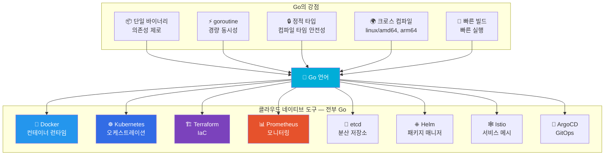
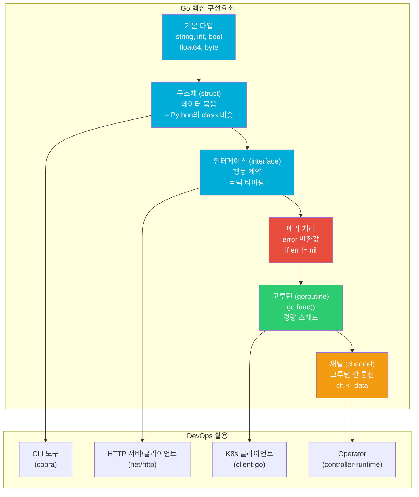
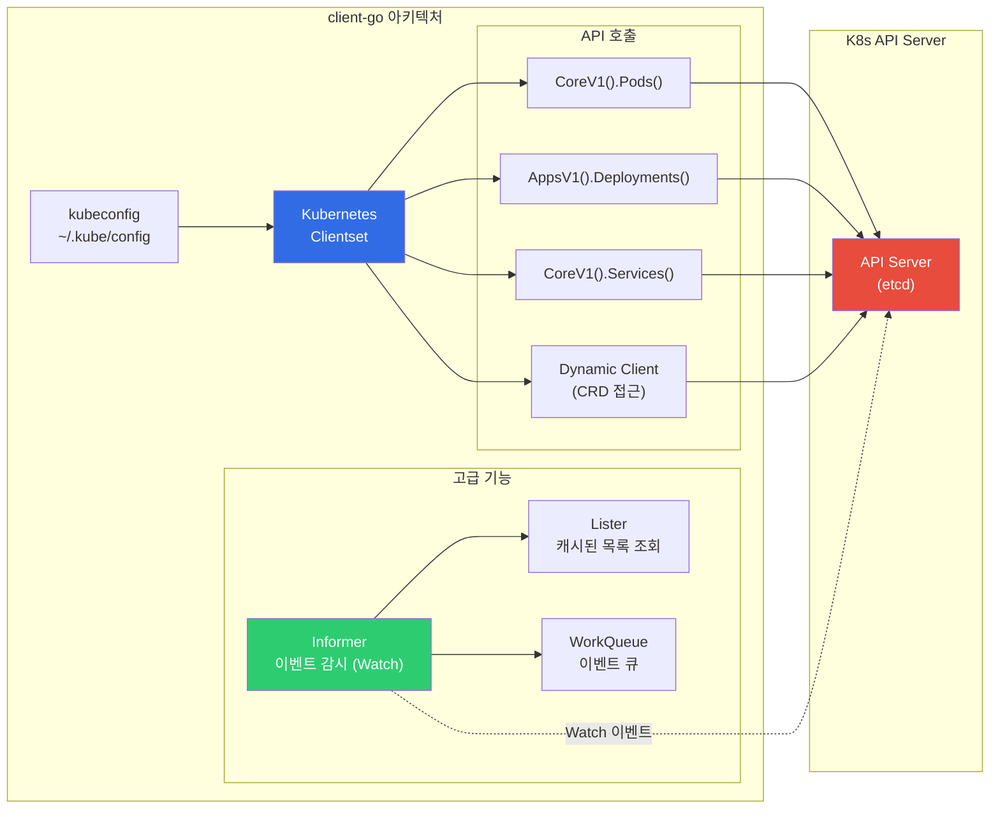

# Go for DevOps

> DevOps 세계에서 Go는 "클라우드 네이티브의 모국어"예요. Docker, Kubernetes, Terraform, Prometheus — 이 핵심 도구들이 전부 Go로 만들어졌어요. [Python 자동화](./02-python)가 스크립팅과 자동화의 만능 도구라면, Go는 **고성능 CLI 도구와 K8s 생태계 확장**에 특화된 언어예요. 단일 바이너리로 컴파일되고, goroutine으로 동시성을 쉽게 처리하며, 강력한 타입 시스템으로 안정적인 인프라 도구를 만들 수 있어요.

---

## 🎯 왜 Go를 알아야 하나요?

### 일상 비유: 스위스 군용 칼 vs 전동 드릴

[Python](./02-python)이 "스위스 군용 칼"처럼 다재다능한 도구라면, Go는 **"전동 드릴"** 이에요. 특정 작업에 최적화되어 있고, 한번 충전하면(컴파일하면) 어디서든 전원 없이 바로 사용할 수 있어요.

- Python으로 만든 스크립트는 "이 서버에 Python 설치되어 있나?" 확인해야 해요
- Go로 만든 도구는 **바이너리 하나만 복사**하면 끝이에요 (kubectl, terraform처럼!)
- 1000개의 서버에 배포할 때 의존성 걱정이 없어요

### 실무에서 Go가 필요한 순간

```
DevOps 엔지니어가 Go를 쓰는 현실적인 상황:

• "kubectl 플러그인 만들어주세요"                    → Go CLI (cobra)
• "K8s CRD에 맞는 Operator 개발해주세요"            → Operator SDK (Go)
• "배포 자동화 CLI 도구가 필요해요"                  → Go + cobra + client-go
• "멀티 클라우드 리소스 점검 도구 만들어주세요"       → Go + AWS/GCP SDK
• "Prometheus exporter 커스텀으로 만들어야 해요"     → Go + prometheus/client_golang
• "Terraform provider 개발해야 해요"                → Go (Terraform Plugin SDK)
• "이 도구(kubectl, helm 등) 소스를 분석해주세요"    → Go 읽기 능력 필수
• 면접: "Go를 왜 DevOps에서 쓰나요?" (시니어 필수 질문!)
```

### Go가 DevOps의 공용어가 된 이유



### Python vs Go 비교 (DevOps 관점)

| 비교 항목 | Python | Go |
|-----------|--------|-----|
| **배포 방식** | 인터프리터 + 패키지 필요 | 단일 바이너리 |
| **실행 속도** | 느림 (인터프리터) | 빠름 (네이티브 컴파일) |
| **동시성** | asyncio / threading (GIL) | goroutine (진짜 동시성) |
| **타입 시스템** | 동적 타입 (런타임 에러) | 정적 타입 (컴파일 에러) |
| **K8s 생태계** | kubernetes 라이브러리 | client-go (1급 시민) |
| **학습 곡선** | 낮음 | 중간 |
| **주 용도** | 스크립팅, 자동화, ML | CLI 도구, 시스템 프로그래밍 |
| **대표 도구** | Ansible, AWS CLI | Docker, K8s, Terraform |

> **핵심**: Python은 "빠르게 자동화 스크립트 작성"에, Go는 "배포 가능한 인프라 도구 개발"에 최적이에요. 둘 다 알면 최강이에요!

---

## 🧠 핵심 개념 잡기

### 1. Go의 설계 철학

Go는 Google에서 2009년에 만들었어요. 핵심 철학은 **"심플함(Simplicity)"** 이에요.

- 키워드가 25개밖에 없어요 (Java는 50개 이상)
- 상속(inheritance)이 없어요 — 합성(composition)만 써요
- 예외(exception)가 없어요 — 에러를 값으로 반환해요
- 제네릭(generics)은 1.18에서야 추가됐어요 (최소한만)

```
Go의 설계 원칙:

"Less is more"
• 기능이 적을수록 코드가 일관적이에요
• 모든 Go 코드가 비슷하게 생겨서 읽기 쉬워요
• 컨벤션 논쟁이 없어요 (gofmt가 강제해요)
```

### 2. Go 기초 문법 한눈에 보기



### 3. Go 모듈 시스템

Python의 pip/virtualenv처럼, Go도 의존성 관리 시스템이 있어요.

```
Go Modules 구조:

my-cli-tool/
├── go.mod              ← pip의 requirements.txt 역할
├── go.sum              ← 의존성 해시 (무결성 보장)
├── main.go             ← 진입점
├── cmd/                ← CLI 명령어들
│   ├── root.go
│   ├── deploy.go
│   └── status.go
├── internal/           ← 내부 패키지 (외부 import 불가)
│   ├── k8s/
│   └── aws/
└── pkg/                ← 외부 공개 패키지
    └── config/
```

---

## 🔍 하나씩 자세히 알아보기

### 1. Go 기초 — 변수, 타입, 함수

```go
// === Go 기본 문법 ===
package main    // 모든 Go 파일은 패키지에 속해요

import (
    "fmt"       // 출력 (Python의 print)
    "strings"   // 문자열 처리
    "os"        // OS 관련 (환경변수, 파일 등)
)

func main() {
    // --- 변수 선언 ---

    // 방법 1: var 키워드 (타입 명시)
    var name string = "devops-engineer"
    var age int = 5        // 경력 연수
    var isReady bool = true

    // 방법 2: := 짧은 선언 (타입 추론 — 가장 많이 씀!)
    cluster := "production"
    replicas := 3
    cpuLimit := 0.5    // float64로 추론

    fmt.Println(name, age, isReady)
    fmt.Printf("Cluster: %s, Replicas: %d, CPU: %.1f\n",
        cluster, replicas, cpuLimit)

    // --- 배열/슬라이스 (Python의 list 비슷) ---
    regions := []string{"ap-northeast-2", "us-east-1", "eu-west-1"}
    regions = append(regions, "ap-southeast-1")   // 추가
    fmt.Println("Regions:", regions)
    fmt.Println("First:", regions[0])             // 인덱싱
    fmt.Println("Count:", len(regions))           // 길이

    // --- 맵 (Python의 dict 비슷) ---
    labels := map[string]string{
        "app":     "web-server",
        "env":     "production",
        "team":    "platform",
    }
    labels["version"] = "v2.1.0"    // 추가

    for key, value := range labels {
        fmt.Printf("  %s: %s\n", key, value)
    }

    // --- 환경변수 읽기 ---
    home := os.Getenv("HOME")
    if home == "" {
        home = "/root"    // 기본값
    }
    fmt.Println("HOME:", home)

    // --- 문자열 처리 ---
    image := "nginx:1.25-alpine"
    parts := strings.Split(image, ":")
    fmt.Printf("Image: %s, Tag: %s\n", parts[0], parts[1])
}
```

### 2. 구조체(struct)와 메서드

```go
// === 구조체 — Go의 핵심 데이터 타입 ===
// Python의 class와 비슷하지만 상속이 없어요
// "데이터 + 동작"을 함께 정의해요

package main

import (
    "fmt"
    "time"
)

// --- 구조체 정의 ---
type Pod struct {
    Name      string            `json:"name" yaml:"name"`
    Namespace string            `json:"namespace" yaml:"namespace"`
    Image     string            `json:"image" yaml:"image"`
    Replicas  int               `json:"replicas" yaml:"replicas"`
    Labels    map[string]string `json:"labels" yaml:"labels"`
    CreatedAt time.Time         `json:"created_at" yaml:"createdAt"`
}

// --- 메서드 정의 (구조체에 함수를 붙이는 방법) ---
// (p Pod) — 값 리시버 (원본 변경 안됨)
func (p Pod) FullName() string {
    return fmt.Sprintf("%s/%s", p.Namespace, p.Name)
}

// (*p Pod) — 포인터 리시버 (원본 변경 가능)
func (p *Pod) Scale(newReplicas int) {
    fmt.Printf("Scaling %s: %d → %d\n", p.Name, p.Replicas, newReplicas)
    p.Replicas = newReplicas
}

func (p Pod) IsOlderThan(duration time.Duration) bool {
    return time.Since(p.CreatedAt) > duration
}

func main() {
    // 구조체 생성
    pod := Pod{
        Name:      "web-server",
        Namespace: "production",
        Image:     "nginx:1.25",
        Replicas:  3,
        Labels: map[string]string{
            "app": "web",
            "env": "prod",
        },
        CreatedAt: time.Now(),
    }

    fmt.Println("Pod:", pod.FullName())     // production/web-server
    pod.Scale(5)                             // Scaling web-server: 3 → 5
    fmt.Println("New replicas:", pod.Replicas) // 5
}
```

### 3. 인터페이스(interface) — Go의 핵심 추상화

```go
// === 인터페이스 — 행동 기반 추상화 ===
// Python의 ABC(Abstract Base Class)와 비슷하지만
// "암시적 구현" — implements 키워드가 필요 없어요!

package main

import "fmt"

// --- 인터페이스 정의 ---
// "이 메서드들을 가지면 이 타입이야"
type Deployer interface {
    Deploy(image string, replicas int) error
    Rollback() error
    Status() string
}

// --- K8s 배포 구현체 ---
type K8sDeployer struct {
    Cluster   string
    Namespace string
}

// K8sDeployer는 Deployer 인터페이스를 "자동으로" 만족해요
// (Deploy, Rollback, Status 메서드를 모두 가지고 있으니까)
func (d K8sDeployer) Deploy(image string, replicas int) error {
    fmt.Printf("[K8s] %s/%s에 %s (%d replicas) 배포\n",
        d.Cluster, d.Namespace, image, replicas)
    return nil
}

func (d K8sDeployer) Rollback() error {
    fmt.Printf("[K8s] %s/%s 롤백 실행\n", d.Cluster, d.Namespace)
    return nil
}

func (d K8sDeployer) Status() string {
    return fmt.Sprintf("K8s Cluster: %s, NS: %s — Running", d.Cluster, d.Namespace)
}

// --- ECS 배포 구현체 ---
type ECSDeployer struct {
    Cluster string
    Service string
}

func (d ECSDeployer) Deploy(image string, replicas int) error {
    fmt.Printf("[ECS] %s/%s에 %s (%d tasks) 배포\n",
        d.Cluster, d.Service, image, replicas)
    return nil
}

func (d ECSDeployer) Rollback() error {
    fmt.Printf("[ECS] %s/%s 이전 Task Definition으로 롤백\n",
        d.Cluster, d.Service)
    return nil
}

func (d ECSDeployer) Status() string {
    return fmt.Sprintf("ECS Cluster: %s, Service: %s — Running", d.Cluster, d.Service)
}

// --- 인터페이스를 받는 함수 (다형성!) ---
func runDeployment(d Deployer, image string) {
    fmt.Println("Status:", d.Status())
    if err := d.Deploy(image, 3); err != nil {
        fmt.Println("Deploy failed:", err)
        return
    }
    fmt.Println("Deploy 완료!")
}

func main() {
    // 같은 함수에 다른 구현체를 넘길 수 있어요!
    k8s := K8sDeployer{Cluster: "prod-eks", Namespace: "app"}
    ecs := ECSDeployer{Cluster: "prod-ecs", Service: "web"}

    runDeployment(k8s, "myapp:v2.0")
    fmt.Println("---")
    runDeployment(ecs, "myapp:v2.0")
}
```

### 4. 에러 처리 — Go의 가장 독특한 부분

```go
// === Go의 에러 처리 철학 ===
// Python: try/except (예외를 던지고 잡음)
// Go: 에러를 "값"으로 반환 (if err != nil 패턴)

package main

import (
    "errors"
    "fmt"
    "os"
    "strconv"
)

// --- 기본 에러 반환 패턴 ---
func readConfig(path string) ([]byte, error) {
    data, err := os.ReadFile(path)
    if err != nil {
        // 에러를 감싸서 컨텍스트 추가 (Go 1.13+)
        return nil, fmt.Errorf("config 파일 읽기 실패 (%s): %w", path, err)
    }
    return data, nil
}

// --- 커스텀 에러 타입 ---
type ValidationError struct {
    Field   string
    Message string
}

func (e *ValidationError) Error() string {
    return fmt.Sprintf("validation failed: %s — %s", e.Field, e.Message)
}

func validateReplicas(input string) (int, error) {
    replicas, err := strconv.Atoi(input)
    if err != nil {
        return 0, &ValidationError{
            Field:   "replicas",
            Message: fmt.Sprintf("숫자가 아닙니다: %s", input),
        }
    }
    if replicas < 1 || replicas > 100 {
        return 0, &ValidationError{
            Field:   "replicas",
            Message: fmt.Sprintf("1~100 사이여야 해요 (입력값: %d)", replicas),
        }
    }
    return replicas, nil
}

func main() {
    // 에러 처리 패턴 1: 기본
    data, err := readConfig("/etc/myapp/config.yaml")
    if err != nil {
        fmt.Println("Error:", err)
        // Error: config 파일 읽기 실패 (/etc/myapp/config.yaml):
        //        open /etc/myapp/config.yaml: no such file or directory
    } else {
        fmt.Println("Config loaded:", len(data), "bytes")
    }

    // 에러 처리 패턴 2: 에러 타입 확인 (errors.As)
    _, err = validateReplicas("abc")
    var valErr *ValidationError
    if errors.As(err, &valErr) {
        fmt.Printf("Field: %s, Message: %s\n", valErr.Field, valErr.Message)
        // Field: replicas, Message: 숫자가 아닙니다: abc
    }

    // 에러 처리 패턴 3: Sentinel 에러 비교 (errors.Is)
    _, err = readConfig("/nonexistent")
    if errors.Is(err, os.ErrNotExist) {
        fmt.Println("파일이 존재하지 않아요")
    }
}
```

### 5. goroutine과 channel — 동시성 처리

```go
// === goroutine — Go의 킬러 피처 ===
// 스레드보다 1000배 가벼운 "경량 실행 단위"
// 1개 goroutine = 약 2KB 메모리 (스레드 = 1~8MB)
// 수십만 개를 동시에 실행할 수 있어요!

package main

import (
    "fmt"
    "net/http"
    "sync"
    "time"
)

// --- 기본 goroutine ---
func checkServer(url string, wg *sync.WaitGroup, results chan<- string) {
    defer wg.Done()    // 함수 끝나면 WaitGroup 카운터 감소

    start := time.Now()
    resp, err := http.Get(url)
    elapsed := time.Since(start)

    if err != nil {
        results <- fmt.Sprintf("❌ %s — Error: %v (%v)", url, err, elapsed)
        return
    }
    defer resp.Body.Close()

    results <- fmt.Sprintf("✅ %s — Status: %d (%v)", url, resp.StatusCode, elapsed)
}

func main() {
    urls := []string{
        "https://httpbin.org/get",
        "https://httpbin.org/delay/1",
        "https://httpbin.org/status/500",
        "https://httpbin.org/delay/2",
    }

    var wg sync.WaitGroup
    results := make(chan string, len(urls))   // 버퍼 채널

    fmt.Println("=== 서버 헬스체크 시작 (동시 실행) ===")
    start := time.Now()

    // 모든 URL을 동시에 체크! (goroutine)
    for _, url := range urls {
        wg.Add(1)
        go checkServer(url, &wg, results)    // go 키워드 하나로 동시 실행!
    }

    // 모든 goroutine이 끝나면 채널 닫기
    go func() {
        wg.Wait()
        close(results)
    }()

    // 결과 수집
    for result := range results {
        fmt.Println(result)
    }

    fmt.Printf("\n총 소요시간: %v (순차 실행이었다면 ~6초)\n", time.Since(start))
    // 총 소요시간: ~2초 (가장 느린 요청 기준)
}
```

```
goroutine vs thread 비교:

              goroutine         OS Thread
메모리        ~2KB              ~1-8MB
생성 비용     매우 낮음          높음 (syscall)
동시 개수     수십만 개          수천 개
스케줄링     Go 런타임 (M:N)    OS 커널
통신 방법     channel            lock/mutex
```

### 6. JSON/YAML 처리

DevOps에서 JSON과 YAML은 매일 다루는 포맷이에요.

```go
// === JSON / YAML 마샬링/언마샬링 ===
package main

import (
    "encoding/json"
    "fmt"
    "os"

    "gopkg.in/yaml.v3"     // 외부 패키지 (go get 필요)
)

// struct tag로 JSON/YAML 필드명을 지정해요
type Deployment struct {
    APIVersion string            `json:"apiVersion" yaml:"apiVersion"`
    Kind       string            `json:"kind" yaml:"kind"`
    Metadata   Metadata          `json:"metadata" yaml:"metadata"`
    Spec       DeploymentSpec    `json:"spec" yaml:"spec"`
}

type Metadata struct {
    Name      string            `json:"name" yaml:"name"`
    Namespace string            `json:"namespace" yaml:"namespace"`
    Labels    map[string]string `json:"labels" yaml:"labels"`
}

type DeploymentSpec struct {
    Replicas int           `json:"replicas" yaml:"replicas"`
    Template PodTemplate   `json:"template" yaml:"template"`
}

type PodTemplate struct {
    Spec PodSpec `json:"spec" yaml:"spec"`
}

type PodSpec struct {
    Containers []Container `json:"containers" yaml:"containers"`
}

type Container struct {
    Name  string `json:"name" yaml:"name"`
    Image string `json:"image" yaml:"image"`
    Port  int    `json:"port" yaml:"port"`
}

func main() {
    // --- Go 구조체 → JSON ---
    deploy := Deployment{
        APIVersion: "apps/v1",
        Kind:       "Deployment",
        Metadata: Metadata{
            Name:      "web-server",
            Namespace: "production",
            Labels: map[string]string{
                "app": "web",
                "env": "prod",
            },
        },
        Spec: DeploymentSpec{
            Replicas: 3,
            Template: PodTemplate{
                Spec: PodSpec{
                    Containers: []Container{
                        {Name: "nginx", Image: "nginx:1.25", Port: 80},
                    },
                },
            },
        },
    }

    // JSON 출력 (예쁘게)
    jsonData, _ := json.MarshalIndent(deploy, "", "  ")
    fmt.Println("=== JSON ===")
    fmt.Println(string(jsonData))

    // YAML 출력
    yamlData, _ := yaml.Marshal(deploy)
    fmt.Println("\n=== YAML ===")
    fmt.Println(string(yamlData))

    // --- YAML 파일 읽기 → Go 구조체 ---
    yamlFile := `
apiVersion: apps/v1
kind: Deployment
metadata:
  name: api-server
  namespace: staging
  labels:
    app: api
    env: staging
spec:
  replicas: 2
  template:
    spec:
      containers:
        - name: api
          image: myapp:v1.0
          port: 8080
`
    var parsed Deployment
    if err := yaml.Unmarshal([]byte(yamlFile), &parsed); err != nil {
        fmt.Println("YAML 파싱 에러:", err)
        os.Exit(1)
    }
    fmt.Printf("\n=== Parsed YAML ===\n")
    fmt.Printf("Name: %s, Replicas: %d, Image: %s\n",
        parsed.Metadata.Name,
        parsed.Spec.Replicas,
        parsed.Spec.Template.Spec.Containers[0].Image)
}
```

### 7. HTTP 서버와 클라이언트

```go
// === HTTP 서버 — 헬스체크 엔드포인트 만들기 ===
package main

import (
    "encoding/json"
    "fmt"
    "log"
    "net/http"
    "os"
    "runtime"
    "time"
)

type HealthResponse struct {
    Status    string `json:"status"`
    Timestamp string `json:"timestamp"`
    Version   string `json:"version"`
    GoVersion string `json:"go_version"`
    Uptime    string `json:"uptime"`
}

var startTime = time.Now()

func healthHandler(w http.ResponseWriter, r *http.Request) {
    resp := HealthResponse{
        Status:    "healthy",
        Timestamp: time.Now().Format(time.RFC3339),
        Version:   os.Getenv("APP_VERSION"),
        GoVersion: runtime.Version(),
        Uptime:    time.Since(startTime).String(),
    }

    w.Header().Set("Content-Type", "application/json")
    json.NewEncoder(w).Encode(resp)
}

func readyHandler(w http.ResponseWriter, r *http.Request) {
    // K8s readiness probe용
    // 실제로는 DB 연결, 캐시 연결 등을 확인해요
    w.WriteHeader(http.StatusOK)
    fmt.Fprintln(w, "ready")
}

func main() {
    mux := http.NewServeMux()
    mux.HandleFunc("/healthz", healthHandler)     // liveness probe
    mux.HandleFunc("/readyz", readyHandler)        // readiness probe

    server := &http.Server{
        Addr:         ":8080",
        Handler:      mux,
        ReadTimeout:  5 * time.Second,
        WriteTimeout: 10 * time.Second,
    }

    log.Println("Server starting on :8080")
    log.Fatal(server.ListenAndServe())
}

// --- HTTP 클라이언트 (외부 API 호출) ---
// 별도 파일: client.go

/*
func callAPI(url string) ([]byte, error) {
    client := &http.Client{
        Timeout: 10 * time.Second,
    }

    req, err := http.NewRequest("GET", url, nil)
    if err != nil {
        return nil, fmt.Errorf("request 생성 실패: %w", err)
    }
    req.Header.Set("Authorization", "Bearer "+os.Getenv("API_TOKEN"))
    req.Header.Set("Content-Type", "application/json")

    resp, err := client.Do(req)
    if err != nil {
        return nil, fmt.Errorf("API 호출 실패: %w", err)
    }
    defer resp.Body.Close()

    if resp.StatusCode != http.StatusOK {
        return nil, fmt.Errorf("unexpected status: %d", resp.StatusCode)
    }

    return io.ReadAll(resp.Body)
}
*/
```

### 8. Cobra — CLI 프레임워크

kubectl, helm, gh 같은 CLI 도구가 모두 cobra를 사용해요.

```go
// === Cobra CLI 도구 만들기 ===
// 프로젝트 구조:
// myctl/
// ├── go.mod
// ├── main.go
// └── cmd/
//     ├── root.go
//     ├── deploy.go
//     └── status.go

// --- main.go ---
package main

import "myctl/cmd"

func main() {
    cmd.Execute()
}
```

```go
// --- cmd/root.go ---
package cmd

import (
    "fmt"
    "os"

    "github.com/spf13/cobra"
)

var (
    verbose   bool
    namespace string
)

var rootCmd = &cobra.Command{
    Use:   "myctl",
    Short: "My DevOps CLI tool",
    Long: `myctl은 K8s 배포와 상태 확인을 위한 CLI 도구예요.

사용 예:
  myctl deploy --image nginx:1.25 --replicas 3
  myctl status --namespace production
  myctl logs --pod web-server-abc123`,
}

func init() {
    // 글로벌 플래그 (모든 서브커맨드에서 사용 가능)
    rootCmd.PersistentFlags().BoolVarP(&verbose, "verbose", "v", false, "상세 출력")
    rootCmd.PersistentFlags().StringVarP(&namespace, "namespace", "n", "default", "K8s 네임스페이스")
}

func Execute() {
    if err := rootCmd.Execute(); err != nil {
        fmt.Fprintln(os.Stderr, err)
        os.Exit(1)
    }
}
```

```go
// --- cmd/deploy.go ---
package cmd

import (
    "fmt"

    "github.com/spf13/cobra"
)

var (
    image    string
    replicas int
    dryRun   bool
)

var deployCmd = &cobra.Command{
    Use:   "deploy",
    Short: "애플리케이션을 배포해요",
    Long:  "지정된 이미지와 레플리카 수로 K8s에 배포해요",
    Example: `  myctl deploy --image nginx:1.25 --replicas 3
  myctl deploy --image myapp:v2.0 -n production --dry-run`,
    RunE: func(cmd *cobra.Command, args []string) error {
        if image == "" {
            return fmt.Errorf("--image 플래그는 필수예요")
        }

        fmt.Printf("📦 배포 설정:\n")
        fmt.Printf("  Namespace: %s\n", namespace)
        fmt.Printf("  Image:     %s\n", image)
        fmt.Printf("  Replicas:  %d\n", replicas)
        fmt.Printf("  Dry-run:   %v\n", dryRun)

        if dryRun {
            fmt.Println("\n🔍 Dry-run 모드 — 실제 배포하지 않아요")
            return nil
        }

        // 여기에 실제 K8s 배포 로직 (client-go 사용)
        fmt.Println("\n✅ 배포 완료!")
        return nil
    },
}

func init() {
    // 로컬 플래그 (deploy 명령어에서만 사용)
    deployCmd.Flags().StringVar(&image, "image", "", "컨테이너 이미지 (필수)")
    deployCmd.Flags().IntVar(&replicas, "replicas", 1, "레플리카 수")
    deployCmd.Flags().BoolVar(&dryRun, "dry-run", false, "실제 실행하지 않고 확인만")

    deployCmd.MarkFlagRequired("image")

    rootCmd.AddCommand(deployCmd)    // rootCmd에 등록
}
```

```bash
# CLI 사용 예시
$ myctl --help
# myctl은 K8s 배포와 상태 확인을 위한 CLI 도구예요.
#
# Usage:
#   myctl [command]
#
# Available Commands:
#   deploy      애플리케이션을 배포해요
#   status      배포 상태를 확인해요
#   help        Help about any command
#
# Flags:
#   -h, --help              help for myctl
#   -n, --namespace string  K8s 네임스페이스 (default "default")
#   -v, --verbose           상세 출력

$ myctl deploy --image nginx:1.25 --replicas 3 -n production
# 📦 배포 설정:
#   Namespace: production
#   Image:     nginx:1.25
#   Replicas:  3
#   Dry-run:   false
#
# ✅ 배포 완료!

$ myctl deploy --image nginx:1.25 --dry-run
# 📦 배포 설정:
#   Namespace: default
#   Image:     nginx:1.25
#   Replicas:  1
#   Dry-run:   true
#
# 🔍 Dry-run 모드 — 실제 배포하지 않아요
```

### 9. client-go — K8s API 접근

[Operator/CRD](../04-kubernetes/17-operator-crd)에서 배운 K8s API를 Go로 직접 호출하는 라이브러리예요. kubectl이 내부적으로 사용하는 것과 동일한 라이브러리예요.



```go
// === client-go 기본 사용법 ===
package main

import (
    "context"
    "fmt"
    "os"
    "path/filepath"

    metav1 "k8s.io/apimachinery/pkg/apis/meta/v1"
    "k8s.io/client-go/kubernetes"
    "k8s.io/client-go/tools/clientcmd"
)

func main() {
    // --- 1. kubeconfig 로드 ---
    home, _ := os.UserHomeDir()
    kubeconfig := filepath.Join(home, ".kube", "config")

    config, err := clientcmd.BuildConfigFromFlags("", kubeconfig)
    if err != nil {
        // 클러스터 내부에서 실행 중이라면 InClusterConfig 사용
        // config, err = rest.InClusterConfig()
        fmt.Printf("kubeconfig 로드 실패: %v\n", err)
        os.Exit(1)
    }

    // --- 2. clientset 생성 ---
    clientset, err := kubernetes.NewForConfig(config)
    if err != nil {
        fmt.Printf("clientset 생성 실패: %v\n", err)
        os.Exit(1)
    }

    ctx := context.Background()

    // --- 3. Pod 목록 조회 ---
    fmt.Println("=== All Pods in default namespace ===")
    pods, err := clientset.CoreV1().Pods("default").List(ctx, metav1.ListOptions{})
    if err != nil {
        fmt.Printf("Pod 목록 조회 실패: %v\n", err)
        os.Exit(1)
    }

    for _, pod := range pods.Items {
        fmt.Printf("  Pod: %-40s Status: %-10s Node: %s\n",
            pod.Name, string(pod.Status.Phase), pod.Spec.NodeName)
    }

    // --- 4. Deployment 목록 조회 ---
    fmt.Println("\n=== Deployments in all namespaces ===")
    deployments, err := clientset.AppsV1().Deployments("").List(ctx, metav1.ListOptions{})
    if err != nil {
        fmt.Printf("Deployment 조회 실패: %v\n", err)
        os.Exit(1)
    }

    for _, deploy := range deployments.Items {
        fmt.Printf("  %s/%s — Ready: %d/%d\n",
            deploy.Namespace, deploy.Name,
            deploy.Status.ReadyReplicas, *deploy.Spec.Replicas)
    }

    // --- 5. Namespace별 Pod 수 집계 ---
    fmt.Println("\n=== Pods per Namespace ===")
    allPods, _ := clientset.CoreV1().Pods("").List(ctx, metav1.ListOptions{})
    nsCount := make(map[string]int)
    for _, pod := range allPods.Items {
        nsCount[pod.Namespace]++
    }
    for ns, count := range nsCount {
        fmt.Printf("  %-30s %d pods\n", ns, count)
    }

    // --- 6. 특정 레이블로 Pod 필터링 ---
    fmt.Println("\n=== Pods with label app=web ===")
    webPods, _ := clientset.CoreV1().Pods("").List(ctx, metav1.ListOptions{
        LabelSelector: "app=web",
    })
    for _, pod := range webPods.Items {
        fmt.Printf("  %s/%s\n", pod.Namespace, pod.Name)
    }
}
```

```bash
# client-go 의존성 설치
go get k8s.io/client-go@latest
go get k8s.io/apimachinery@latest

# 실행
go run main.go
# === All Pods in default namespace ===
#   Pod: web-server-6d8f9b7c4-abc12        Status: Running    Node: worker-1
#   Pod: web-server-6d8f9b7c4-def34        Status: Running    Node: worker-2
#   Pod: redis-0                            Status: Running    Node: worker-1
#
# === Deployments in all namespaces ===
#   default/web-server — Ready: 3/3
#   kube-system/coredns — Ready: 2/2
#   monitoring/prometheus — Ready: 1/1
```

### 10. Operator SDK 기초

[Operator/CRD](../04-kubernetes/17-operator-crd)에서 배운 Operator를 Go로 직접 만들어볼게요.

```mermaid
flowchart TD
    subgraph "Operator 개발 과정"
        INIT["1. operator-sdk init<br/>프로젝트 초기화"]
        API["2. operator-sdk create api<br/>CRD + Controller 생성"]
        TYPE["3. types.go 수정<br/>CR 스펙 정의"]
        CTRL["4. controller.go 수정<br/>Reconcile 로직 구현"]
        TEST["5. 테스트<br/>make test"]
        BUILD["6. 빌드 & 배포<br/>make docker-build<br/>make deploy"]
    end

    INIT --> API
    API --> TYPE
    TYPE --> CTRL
    CTRL --> TEST
    TEST --> BUILD

    subgraph "Reconcile Loop (핵심)"
        WATCH["Watch<br/>CR 변경 감시"]
        FETCH["Fetch<br/>현재 CR 조회"]
        CHECK["Check<br/>하위 리소스 확인"]
        CREATE["Create/Update<br/>원하는 상태로 맞추기"]
        STATUS["Status Update<br/>상태 기록"]
    end

    WATCH --> FETCH
    FETCH --> CHECK
    CHECK --> CREATE
    CREATE --> STATUS
    STATUS -.->|"다시 Watch"| WATCH

    style INIT fill:#00ADD8,color:#fff
    style CTRL fill:#e74c3c,color:#fff
    style WATCH fill:#2ecc71,color:#fff
    style CREATE fill:#f39c12,color:#fff
```



```bash
# === Operator SDK로 프로젝트 생성 ===

# 1. 프로젝트 초기화
mkdir website-operator && cd website-operator
operator-sdk init --domain example.com --repo github.com/myorg/website-operator

# 2. API (CRD) + Controller 생성
operator-sdk create api --group webapp --version v1 --kind Website --resource --controller

# 생성된 프로젝트 구조:
# website-operator/
# ├── Dockerfile              ← Operator 컨테이너 이미지
# ├── Makefile                ← 빌드/배포 자동화
# ├── api/
# │   └── v1/
# │       ├── website_types.go    ← ⭐ CRD 스펙 정의
# │       └── zz_generated_*      ← 자동 생성 코드
# ├── config/
# │   ├── crd/                    ← 생성된 CRD YAML
# │   ├── rbac/                   ← RBAC 권한
# │   └── manager/                ← Operator Deployment
# └── internal/
#     └── controller/
#         └── website_controller.go  ← ⭐ Reconcile 로직
```

```go
// === api/v1/website_types.go — CRD 스펙 정의 ===
package v1

import (
    metav1 "k8s.io/apimachinery/pkg/apis/meta/v1"
)

// WebsiteSpec은 Website의 "원하는 상태"를 정의해요
type WebsiteSpec struct {
    // 컨테이너 이미지
    // +kubebuilder:validation:Required
    Image string `json:"image"`

    // 레플리카 수
    // +kubebuilder:validation:Minimum=1
    // +kubebuilder:validation:Maximum=10
    // +kubebuilder:default=1
    Replicas int32 `json:"replicas,omitempty"`

    // 서비스 포트
    // +kubebuilder:default=80
    Port int32 `json:"port,omitempty"`
}

// WebsiteStatus는 Website의 "현재 상태"를 나타내요
type WebsiteStatus struct {
    // 현재 사용 가능한 레플리카 수
    AvailableReplicas int32 `json:"availableReplicas,omitempty"`

    // 상태 조건들
    Conditions []metav1.Condition `json:"conditions,omitempty"`

    // 접속 URL
    URL string `json:"url,omitempty"`
}

// +kubebuilder:object:root=true
// +kubebuilder:subresource:status
// +kubebuilder:printcolumn:name="Image",type=string,JSONPath=`.spec.image`
// +kubebuilder:printcolumn:name="Replicas",type=integer,JSONPath=`.spec.replicas`
// +kubebuilder:printcolumn:name="Available",type=integer,JSONPath=`.status.availableReplicas`
// +kubebuilder:printcolumn:name="URL",type=string,JSONPath=`.status.url`
// +kubebuilder:printcolumn:name="Age",type=date,JSONPath=`.metadata.creationTimestamp`
type Website struct {
    metav1.TypeMeta   `json:",inline"`
    metav1.ObjectMeta `json:"metadata,omitempty"`

    Spec   WebsiteSpec   `json:"spec,omitempty"`
    Status WebsiteStatus `json:"status,omitempty"`
}

// +kubebuilder:object:root=true
type WebsiteList struct {
    metav1.TypeMeta `json:",inline"`
    metav1.ListMeta `json:"metadata,omitempty"`
    Items           []Website `json:"items"`
}
```

```go
// === internal/controller/website_controller.go — Reconcile 로직 ===
package controller

import (
    "context"
    "fmt"

    appsv1 "k8s.io/api/apps/v1"
    corev1 "k8s.io/api/core/v1"
    "k8s.io/apimachinery/pkg/api/errors"
    metav1 "k8s.io/apimachinery/pkg/apis/meta/v1"
    "k8s.io/apimachinery/pkg/runtime"
    "k8s.io/apimachinery/pkg/types"
    ctrl "sigs.k8s.io/controller-runtime"
    "sigs.k8s.io/controller-runtime/pkg/client"
    "sigs.k8s.io/controller-runtime/pkg/log"

    webappv1 "github.com/myorg/website-operator/api/v1"
)

type WebsiteReconciler struct {
    client.Client
    Scheme *runtime.Scheme
}

// Reconcile — Operator의 핵심! 원하는 상태와 현재 상태를 맞춰요
func (r *WebsiteReconciler) Reconcile(ctx context.Context, req ctrl.Request) (ctrl.Result, error) {
    logger := log.FromContext(ctx)

    // 1. Website CR 조회
    var website webappv1.Website
    if err := r.Get(ctx, req.NamespacedName, &website); err != nil {
        if errors.IsNotFound(err) {
            logger.Info("Website 리소스가 삭제됨", "name", req.NamespacedName)
            return ctrl.Result{}, nil
        }
        return ctrl.Result{}, err
    }

    logger.Info("Reconciling Website", "name", website.Name)

    // 2. Deployment가 존재하는지 확인
    var deploy appsv1.Deployment
    deployName := types.NamespacedName{
        Name:      website.Name + "-deployment",
        Namespace: website.Namespace,
    }

    err := r.Get(ctx, deployName, &deploy)
    if errors.IsNotFound(err) {
        // 3. 없으면 생성
        logger.Info("Deployment 생성", "name", deployName)
        deploy = *r.buildDeployment(&website)
        if err := ctrl.SetControllerReference(&website, &deploy, r.Scheme); err != nil {
            return ctrl.Result{}, err
        }
        if err := r.Create(ctx, &deploy); err != nil {
            return ctrl.Result{}, err
        }
    } else if err != nil {
        return ctrl.Result{}, err
    } else {
        // 4. 있으면 스펙이 맞는지 확인하고 업데이트
        if *deploy.Spec.Replicas != website.Spec.Replicas ||
           deploy.Spec.Template.Spec.Containers[0].Image != website.Spec.Image {
            logger.Info("Deployment 업데이트",
                "replicas", website.Spec.Replicas,
                "image", website.Spec.Image)
            deploy.Spec.Replicas = &website.Spec.Replicas
            deploy.Spec.Template.Spec.Containers[0].Image = website.Spec.Image
            if err := r.Update(ctx, &deploy); err != nil {
                return ctrl.Result{}, err
            }
        }
    }

    // 5. Status 업데이트
    website.Status.AvailableReplicas = deploy.Status.AvailableReplicas
    website.Status.URL = fmt.Sprintf("http://%s.%s.svc:%d",
        website.Name, website.Namespace, website.Spec.Port)
    if err := r.Status().Update(ctx, &website); err != nil {
        return ctrl.Result{}, err
    }

    return ctrl.Result{}, nil
}

// buildDeployment — Website CR로부터 Deployment를 생성해요
func (r *WebsiteReconciler) buildDeployment(website *webappv1.Website) *appsv1.Deployment {
    labels := map[string]string{
        "app":                  website.Name,
        "app.kubernetes.io/managed-by": "website-operator",
    }
    replicas := website.Spec.Replicas

    return &appsv1.Deployment{
        ObjectMeta: metav1.ObjectMeta{
            Name:      website.Name + "-deployment",
            Namespace: website.Namespace,
            Labels:    labels,
        },
        Spec: appsv1.DeploymentSpec{
            Replicas: &replicas,
            Selector: &metav1.LabelSelector{
                MatchLabels: labels,
            },
            Template: corev1.PodTemplateSpec{
                ObjectMeta: metav1.ObjectMeta{Labels: labels},
                Spec: corev1.PodSpec{
                    Containers: []corev1.Container{
                        {
                            Name:  "web",
                            Image: website.Spec.Image,
                            Ports: []corev1.ContainerPort{
                                {ContainerPort: website.Spec.Port},
                            },
                        },
                    },
                },
            },
        },
    }
}

// SetupWithManager — Controller를 Manager에 등록해요
func (r *WebsiteReconciler) SetupWithManager(mgr ctrl.Manager) error {
    return ctrl.NewControllerManagedBy(mgr).
        For(&webappv1.Website{}).              // Website CR 감시
        Owns(&appsv1.Deployment{}).            // 소유한 Deployment도 감시
        Complete(r)
}
```

```bash
# Operator 빌드 & 배포
make manifests      # CRD YAML 생성
make generate       # DeepCopy 등 코드 생성
make test           # 단위 테스트
make docker-build IMG=myorg/website-operator:v1.0
make docker-push IMG=myorg/website-operator:v1.0
make deploy IMG=myorg/website-operator:v1.0

# CR 생성
kubectl apply -f - <<EOF
apiVersion: webapp.example.com/v1
kind: Website
metadata:
  name: my-blog
  namespace: default
spec:
  image: nginx:1.25-alpine
  replicas: 3
  port: 80
EOF

# 결과 확인
kubectl get websites
# NAME      IMAGE               REPLICAS   AVAILABLE   URL                              AGE
# my-blog   nginx:1.25-alpine   3          3           http://my-blog.default.svc:80    30s
```

### 11. 크로스 컴파일

Go의 가장 강력한 기능 중 하나예요. 한 번 작성하면 모든 플랫폼용 바이너리를 만들 수 있어요.

```bash
# === 크로스 컴파일 — 어디서든 빌드, 어디서든 실행 ===

# 현재 플랫폼 확인
go env GOOS GOARCH
# linux
# amd64

# Linux AMD64 (일반 서버/컨테이너)
GOOS=linux GOARCH=amd64 go build -o myctl-linux-amd64 .

# Linux ARM64 (AWS Graviton, Apple Silicon VM)
GOOS=linux GOARCH=arm64 go build -o myctl-linux-arm64 .

# macOS ARM64 (Apple Silicon)
GOOS=darwin GOARCH=arm64 go build -o myctl-darwin-arm64 .

# macOS AMD64 (Intel Mac)
GOOS=darwin GOARCH=amd64 go build -o myctl-darwin-amd64 .

# Windows
GOOS=windows GOARCH=amd64 go build -o myctl-windows-amd64.exe .

# 크기 최적화 빌드 (디버그 정보 제거)
CGO_ENABLED=0 GOOS=linux GOARCH=amd64 \
  go build -ldflags="-s -w" -o myctl .
# CGO_ENABLED=0 — C 라이브러리 의존 제거 (순수 Go 바이너리)
# -s — 심볼 테이블 제거
# -w — DWARF 디버그 정보 제거
# → 바이너리 크기 30~50% 감소!

# 버전 정보 빌드 시 주입
go build -ldflags="-X main.version=v1.2.3 -X main.commit=$(git rev-parse --short HEAD) -X main.buildDate=$(date -u +%Y-%m-%dT%H:%M:%SZ)" -o myctl .
```

```go
// 빌드 시 주입되는 변수 (main.go에 선언)
package main

var (
    version   = "dev"
    commit    = "none"
    buildDate = "unknown"
)

// cobra의 version 플래그에 연결
var versionCmd = &cobra.Command{
    Use:   "version",
    Short: "버전 정보를 출력해요",
    Run: func(cmd *cobra.Command, args []string) {
        fmt.Printf("Version:    %s\n", version)
        fmt.Printf("Commit:     %s\n", commit)
        fmt.Printf("Build Date: %s\n", buildDate)
        fmt.Printf("Go Version: %s\n", runtime.Version())
        fmt.Printf("OS/Arch:    %s/%s\n", runtime.GOOS, runtime.GOARCH)
    },
}
```

```dockerfile
# === 멀티스테이지 Dockerfile (Go 프로젝트 표준) ===
# Stage 1: 빌드
FROM golang:1.22-alpine AS builder

WORKDIR /app
COPY go.mod go.sum ./
RUN go mod download           # 의존성 캐시 (레이어 최적화)

COPY . .
RUN CGO_ENABLED=0 GOOS=linux go build \
    -ldflags="-s -w" \
    -o /myctl .

# Stage 2: 실행 (scratch = 빈 이미지!)
FROM scratch
COPY --from=builder /myctl /myctl
COPY --from=builder /etc/ssl/certs/ca-certificates.crt /etc/ssl/certs/

ENTRYPOINT ["/myctl"]

# 결과 이미지 크기: ~10MB (golang 이미지는 ~800MB)
```

### 12. Go 모듈 시스템 상세

```bash
# === Go Modules 핵심 명령어 ===

# 새 프로젝트 초기화
go mod init github.com/myorg/myctl

# 의존성 추가 (import만 하면 자동으로 추가됨)
go get github.com/spf13/cobra@latest
go get k8s.io/client-go@v0.29.0    # 특정 버전
go get gopkg.in/yaml.v3

# 사용하지 않는 의존성 정리
go mod tidy

# 의존성 다운로드 (CI에서 캐시용)
go mod download

# 의존성 그래프 보기
go mod graph

# vendor 디렉토리 생성 (오프라인 빌드용)
go mod vendor
```

```
go.mod 파일 예시:

module github.com/myorg/myctl

go 1.22

require (
    github.com/spf13/cobra v1.8.0
    k8s.io/client-go v0.29.0
    k8s.io/apimachinery v0.29.0
    gopkg.in/yaml.v3 v3.0.1
    github.com/prometheus/client_golang v1.18.0
)

require (
    // indirect 의존성 (직접 import하지 않지만 필요한 것들)
    github.com/spf13/pflag v1.0.5 // indirect
    golang.org/x/net v0.19.0 // indirect
    ...
)
```

---

## 💻 직접 해보기

### 실습 1: K8s Pod 상태 모니터링 CLI 만들기

```go
// === 실습: podmon — Pod 상태 모니터링 도구 ===
// 기능: 지정한 namespace의 Pod 상태를 실시간으로 모니터링

package main

import (
    "context"
    "fmt"
    "os"
    "os/signal"
    "path/filepath"
    "strings"
    "syscall"
    "text/tabwriter"
    "time"

    corev1 "k8s.io/api/core/v1"
    metav1 "k8s.io/apimachinery/pkg/apis/meta/v1"
    "k8s.io/client-go/kubernetes"
    "k8s.io/client-go/tools/clientcmd"
)

func main() {
    // 네임스페이스 인자
    namespace := "default"
    if len(os.Args) > 1 {
        namespace = os.Args[1]
    }

    // kubeconfig 로드
    home, _ := os.UserHomeDir()
    config, err := clientcmd.BuildConfigFromFlags("",
        filepath.Join(home, ".kube", "config"))
    if err != nil {
        fmt.Fprintf(os.Stderr, "kubeconfig 에러: %v\n", err)
        os.Exit(1)
    }

    clientset, err := kubernetes.NewForConfig(config)
    if err != nil {
        fmt.Fprintf(os.Stderr, "client 생성 에러: %v\n", err)
        os.Exit(1)
    }

    // Ctrl+C 시그널 처리
    ctx, cancel := context.WithCancel(context.Background())
    defer cancel()

    sigCh := make(chan os.Signal, 1)
    signal.Notify(sigCh, syscall.SIGINT, syscall.SIGTERM)
    go func() {
        <-sigCh
        fmt.Println("\n종료 중...")
        cancel()
    }()

    // 주기적으로 Pod 상태 출력
    ticker := time.NewTicker(5 * time.Second)
    defer ticker.Stop()

    fmt.Printf("📡 Monitoring pods in namespace '%s' (Ctrl+C to stop)\n\n", namespace)

    // 첫 번째 즉시 실행
    printPodStatus(ctx, clientset, namespace)

    for {
        select {
        case <-ctx.Done():
            return
        case <-ticker.C:
            printPodStatus(ctx, clientset, namespace)
        }
    }
}

func printPodStatus(ctx context.Context, clientset *kubernetes.Clientset, namespace string) {
    pods, err := clientset.CoreV1().Pods(namespace).List(ctx, metav1.ListOptions{})
    if err != nil {
        fmt.Fprintf(os.Stderr, "Pod 조회 에러: %v\n", err)
        return
    }

    // 화면 지우기
    fmt.Print("\033[2J\033[H")
    fmt.Printf("=== Pod Monitor | Namespace: %s | %s ===\n\n",
        namespace, time.Now().Format("15:04:05"))

    w := tabwriter.NewWriter(os.Stdout, 0, 0, 2, ' ', 0)
    fmt.Fprintln(w, "NAME\tSTATUS\tRESTARTS\tAGE\tNODE\tIP")
    fmt.Fprintln(w, "----\t------\t--------\t---\t----\t--")

    var running, pending, failed int

    for _, pod := range pods.Items {
        status := string(pod.Status.Phase)
        restarts := int32(0)

        for _, cs := range pod.Status.ContainerStatuses {
            restarts += cs.RestartCount
        }

        age := time.Since(pod.CreationTimestamp.Time).Truncate(time.Second)

        // 상태별 이모지
        indicator := "⚪"
        switch pod.Status.Phase {
        case corev1.PodRunning:
            indicator = "🟢"
            running++
        case corev1.PodPending:
            indicator = "🟡"
            pending++
        case corev1.PodFailed:
            indicator = "🔴"
            failed++
        }

        // 재시작 횟수가 높으면 경고
        restartStr := fmt.Sprintf("%d", restarts)
        if restarts > 5 {
            restartStr = fmt.Sprintf("%d ⚠️", restarts)
        }

        name := pod.Name
        if len(name) > 45 {
            name = name[:42] + "..."
        }

        fmt.Fprintf(w, "%s %s\t%s\t%s\t%s\t%s\t%s\n",
            indicator, name, status, restartStr,
            formatDuration(age), pod.Spec.NodeName,
            pod.Status.PodIP)
    }

    w.Flush()

    fmt.Printf("\nTotal: %d | Running: %d | Pending: %d | Failed: %d\n",
        len(pods.Items), running, pending, failed)
}

func formatDuration(d time.Duration) string {
    if d.Hours() > 24 {
        return fmt.Sprintf("%dd", int(d.Hours()/24))
    }
    if d.Hours() >= 1 {
        return fmt.Sprintf("%dh", int(d.Hours()))
    }
    if d.Minutes() >= 1 {
        return fmt.Sprintf("%dm", int(d.Minutes()))
    }
    return fmt.Sprintf("%ds", int(d.Seconds()))
}
```

```bash
# 실행
go run main.go production

# === Pod Monitor | Namespace: production | 14:30:05 ===
#
# NAME                                STATUS     RESTARTS  AGE   NODE       IP
# ----                                ------     --------  ---   ----       --
# 🟢 web-server-6d8f9b7c4-abc12      Running    0         3d    worker-1   10.0.1.15
# 🟢 web-server-6d8f9b7c4-def34      Running    0         3d    worker-2   10.0.2.20
# 🟢 api-server-7f9a8b6c5-ghi56      Running    2         5d    worker-1   10.0.1.16
# 🟡 batch-job-x9z8y7-jkl78          Pending    0         30s   <none>     <none>
# 🟢 redis-0                          Running    0         14d   worker-3   10.0.3.10
# 🔴 worker-crash-abc123              Failed     12 ⚠️     1h    worker-2   10.0.2.25
#
# Total: 6 | Running: 4 | Pending: 1 | Failed: 1
```

### 실습 2: 멀티 클러스터 헬스체크 도구

```go
// === 실습: 여러 URL을 동시에 헬스체크하는 Go 도구 ===

package main

import (
    "encoding/json"
    "fmt"
    "net/http"
    "os"
    "sync"
    "time"

    "gopkg.in/yaml.v3"
)

// --- 설정 파일 구조 ---
type Config struct {
    Targets  []Target `yaml:"targets"`
    Timeout  int      `yaml:"timeout_seconds"`
    Interval int      `yaml:"interval_seconds"`
}

type Target struct {
    Name string `yaml:"name"`
    URL  string `yaml:"url"`
    // 기대하는 상태 코드 (기본: 200)
    ExpectedStatus int `yaml:"expected_status"`
}

type Result struct {
    Name       string        `json:"name"`
    URL        string        `json:"url"`
    Status     int           `json:"status"`
    Latency    time.Duration `json:"latency_ms"`
    Healthy    bool          `json:"healthy"`
    Error      string        `json:"error,omitempty"`
    CheckedAt  time.Time     `json:"checked_at"`
}

func checkHealth(target Target, timeout time.Duration) Result {
    result := Result{
        Name:      target.Name,
        URL:       target.URL,
        CheckedAt: time.Now(),
    }

    client := &http.Client{Timeout: timeout}
    start := time.Now()

    resp, err := client.Get(target.URL)
    result.Latency = time.Since(start)

    if err != nil {
        result.Error = err.Error()
        result.Healthy = false
        return result
    }
    defer resp.Body.Close()

    result.Status = resp.StatusCode

    expected := target.ExpectedStatus
    if expected == 0 {
        expected = 200
    }
    result.Healthy = resp.StatusCode == expected

    return result
}

func runChecks(config Config) []Result {
    var wg sync.WaitGroup
    results := make([]Result, len(config.Targets))
    timeout := time.Duration(config.Timeout) * time.Second

    // 모든 타겟을 동시에 체크 (goroutine)
    for i, target := range config.Targets {
        wg.Add(1)
        go func(idx int, t Target) {
            defer wg.Done()
            results[idx] = checkHealth(t, timeout)
        }(i, target)
    }

    wg.Wait()
    return results
}

func main() {
    // 설정 파일 읽기
    configFile := "healthcheck.yaml"
    if len(os.Args) > 1 {
        configFile = os.Args[1]
    }

    data, err := os.ReadFile(configFile)
    if err != nil {
        fmt.Fprintf(os.Stderr, "설정 파일 읽기 실패: %v\n", err)
        os.Exit(1)
    }

    var config Config
    if err := yaml.Unmarshal(data, &config); err != nil {
        fmt.Fprintf(os.Stderr, "설정 파일 파싱 실패: %v\n", err)
        os.Exit(1)
    }

    // 헬스체크 실행
    results := runChecks(config)

    // 결과 출력
    fmt.Println("=== Health Check Results ===")
    healthy := 0
    for _, r := range results {
        icon := "🔴"
        if r.Healthy {
            icon = "🟢"
            healthy++
        }
        fmt.Printf("%s %-20s  Status: %d  Latency: %v\n",
            icon, r.Name, r.Status, r.Latency.Truncate(time.Millisecond))
        if r.Error != "" {
            fmt.Printf("   Error: %s\n", r.Error)
        }
    }

    fmt.Printf("\nTotal: %d | Healthy: %d | Unhealthy: %d\n",
        len(results), healthy, len(results)-healthy)

    // JSON 출력 (파이프라인 연동용)
    jsonData, _ := json.MarshalIndent(results, "", "  ")
    os.WriteFile("healthcheck-results.json", jsonData, 0644)
}
```

```yaml
# healthcheck.yaml — 설정 파일
targets:
  - name: "Production API"
    url: "https://api.example.com/healthz"
  - name: "Staging API"
    url: "https://staging-api.example.com/healthz"
  - name: "Grafana"
    url: "https://grafana.example.com/api/health"
  - name: "ArgoCD"
    url: "https://argocd.example.com/healthz"
  - name: "Prometheus"
    url: "https://prometheus.example.com/-/healthy"

timeout_seconds: 5
interval_seconds: 30
```

### 실습 3: Go 프로젝트 시작하기 (Step by Step)

```bash
# === Go 개발 환경 설정 ===

# 1. Go 설치 확인
go version
# go version go1.22.0 linux/amd64

# 2. 새 프로젝트 생성
mkdir -p ~/projects/myctl && cd ~/projects/myctl
go mod init github.com/myorg/myctl

# 3. Cobra CLI 프레임워크 설치
go get github.com/spf13/cobra@latest

# 4. 기본 파일 구조 생성
mkdir -p cmd internal/k8s

# 5. main.go 작성 (위의 Cobra 예제 참고)

# 6. 빌드 & 실행
go build -o myctl .
./myctl --help

# 7. 테스트 실행
go test ./...

# 8. 코드 포맷팅 (gofmt — Go 표준 포매터)
gofmt -w .

# 9. 린트 검사 (golangci-lint 권장)
golangci-lint run

# 10. 크로스 컴파일로 배포
CGO_ENABLED=0 GOOS=linux GOARCH=amd64 go build -ldflags="-s -w" -o myctl .
```

---

## 🏢 실무에서는?

### Go로 이해하는 클라우드 네이티브 도구

DevOps 엔지니어로서 매일 사용하는 도구들이 Go로 만들어져 있다는 것을 이해하면, 문제 해결과 커스터마이징이 훨씬 쉬워져요.

```mermaid
flowchart TD
    subgraph "컨테이너/오케스트레이션"
        DOCKER["🐳 Docker<br/>moby/moby<br/>컨테이너 런타임"]
        CONTAINERD["containerd<br/>컨테이너 데몬"]
        K8S["☸️ Kubernetes<br/>kubernetes/kubernetes<br/>오케스트레이션"]
        HELM["⎈ Helm<br/>패키지 매니저"]
        KUSTOMIZE["Kustomize<br/>YAML 커스터마이징"]
    end

    subgraph "인프라/IaC"
        TF["🏗️ Terraform<br/>hashicorp/terraform<br/>IaC 도구"]
        VAULT["🔐 Vault<br/>시크릿 관리"]
        CONSUL["Consul<br/>서비스 디스커버리"]
        PACKER["Packer<br/>이미지 빌드"]
    end

    subgraph "모니터링/관측"
        PROM["📊 Prometheus<br/>메트릭 수집"]
        GRAFANA_AGENT["Grafana Agent<br/>텔레메트리"]
        JAEGER["Jaeger<br/>트레이싱"]
        LOKI["Loki<br/>로그 수집"]
    end

    subgraph "CI/CD & GitOps"
        ARGO["🔄 ArgoCD<br/>GitOps"]
        FLUX["Flux<br/>GitOps"]
        TEKTON["Tekton<br/>CI/CD 파이프라인"]
        DRONE["Drone<br/>CI/CD"]
    end

    subgraph "서비스 메시 & 네트워킹"
        ISTIO["🕸️ Istio<br/>서비스 메시"]
        ENVOY["Envoy<br/>프록시"]
        COREDNS["CoreDNS<br/>K8s DNS"]
        TRAEFIK["Traefik<br/>인그레스"]
    end

    GO_LANG["🐹 Go 언어<br/>이 모든 도구의 공통점"] --> DOCKER
    GO_LANG --> K8S
    GO_LANG --> TF
    GO_LANG --> PROM
    GO_LANG --> ARGO
    GO_LANG --> ISTIO

    style GO_LANG fill:#00ADD8,color:#fff,stroke-width:3px
    style K8S fill:#326CE5,color:#fff
    style DOCKER fill:#2496ED,color:#fff
    style TF fill:#7B42BC,color:#fff
    style PROM fill:#E6522C,color:#fff
    style ARGO fill:#EF7B4D,color:#fff
```



### 실무 시나리오별 Go 활용

```
시나리오 1: kubectl 플러그인 개발
─────────────────────────────────────
상황: "특정 label의 Pod들만 로그를 한번에 볼 수 있는 도구가 필요해요"
해결: Go + client-go + cobra로 kubectl-logview 플러그인 제작
     → kubectl logview -l app=web --since 1h
효과: 반복 작업 10분 → 1초

시나리오 2: Prometheus Exporter 개발
─────────────────────────────────────
상황: "사내 레거시 시스템의 메트릭을 Prometheus로 수집해야 해요"
해결: Go + prometheus/client_golang으로 커스텀 exporter 개발
     → /metrics 엔드포인트에 커스텀 메트릭 노출
효과: 레거시 시스템도 Grafana 대시보드로 모니터링

시나리오 3: Terraform Provider 개발
─────────────────────────────────────
상황: "사내 PaaS 리소스를 Terraform으로 관리하고 싶어요"
해결: Go + Terraform Plugin SDK로 커스텀 provider 개발
     → resource "internal_app" "web" { ... }
효과: 사내 모든 리소스를 IaC로 통합 관리

시나리오 4: Admission Webhook 개발
─────────────────────────────────────
상황: "특정 조건의 Pod 생성을 자동으로 막거나 수정해야 해요"
해결: Go + net/http로 Webhook 서버 개발
     → 모든 Pod에 자동으로 사이드카 주입, 특정 이미지 차단
효과: 보안 정책 자동 적용

시나리오 5: 배포 자동화 CLI
─────────────────────────────────────
상황: "여러 환경에 대한 배포를 통합하는 CLI가 필요해요"
해결: Go + cobra로 deploy CLI 개발
     → myctl deploy --env prod --version v2.1.0 --canary 10%
     → K8s, ECS, Lambda 등 멀티 플랫폼 지원
효과: 배포 프로세스 표준화, 실수 방지
```

### 실무 Go 프로젝트 구조 (표준)

```
myctl/
├── main.go                     # 진입점 (최소한의 코드)
├── go.mod                      # 의존성 정의
├── go.sum                      # 의존성 해시
├── Makefile                    # 빌드 자동화
├── Dockerfile                  # 컨테이너 빌드
├── .goreleaser.yml             # 릴리스 자동화
│
├── cmd/                        # CLI 명령어 (cobra)
│   ├── root.go                 # 루트 명령어
│   ├── deploy.go               # deploy 서브명령어
│   ├── status.go               # status 서브명령어
│   └── version.go              # version 서브명령어
│
├── internal/                   # 내부 패키지 (외부 import 불가)
│   ├── k8s/                    # K8s 관련 로직
│   │   ├── client.go
│   │   └── deploy.go
│   ├── config/                 # 설정 관리
│   │   └── config.go
│   └── output/                 # 출력 포맷팅
│       ├── table.go
│       └── json.go
│
├── pkg/                        # 외부 공개 패키지 (선택)
│   └── healthcheck/
│       └── checker.go
│
└── test/                       # 통합 테스트
    └── integration_test.go
```

### Makefile 예시 (Go 프로젝트 표준)

```makefile
# === Makefile — Go 프로젝트 빌드 자동화 ===

BINARY_NAME=myctl
VERSION=$(shell git describe --tags --always --dirty)
COMMIT=$(shell git rev-parse --short HEAD)
BUILD_DATE=$(shell date -u +%Y-%m-%dT%H:%M:%SZ)
LDFLAGS=-ldflags "-s -w -X main.version=$(VERSION) -X main.commit=$(COMMIT) -X main.buildDate=$(BUILD_DATE)"

.PHONY: all build test lint clean docker

all: lint test build

build:
	CGO_ENABLED=0 go build $(LDFLAGS) -o bin/$(BINARY_NAME) .

build-all:   ## 모든 플랫폼용 빌드
	GOOS=linux   GOARCH=amd64 go build $(LDFLAGS) -o bin/$(BINARY_NAME)-linux-amd64 .
	GOOS=linux   GOARCH=arm64 go build $(LDFLAGS) -o bin/$(BINARY_NAME)-linux-arm64 .
	GOOS=darwin  GOARCH=arm64 go build $(LDFLAGS) -o bin/$(BINARY_NAME)-darwin-arm64 .
	GOOS=windows GOARCH=amd64 go build $(LDFLAGS) -o bin/$(BINARY_NAME)-windows-amd64.exe .

test:
	go test -race -coverprofile=coverage.out ./...
	go tool cover -func=coverage.out

lint:
	golangci-lint run ./...
	go vet ./...

fmt:
	gofmt -s -w .
	goimports -w .

clean:
	rm -rf bin/ coverage.out

docker:
	docker build -t $(BINARY_NAME):$(VERSION) .

run: build
	./bin/$(BINARY_NAME)
```

---

## ⚠️ 자주 하는 실수

### 실수 1: 에러 무시하기

```go
// ❌ 나쁜 예 — 에러를 무시하면 디버깅이 불가능해요
data, _ := os.ReadFile("config.yaml")    // 에러 무시!
json.Unmarshal(data, &config)             // data가 nil이면 패닉!

// ✅ 좋은 예 — 항상 에러를 체크해요
data, err := os.ReadFile("config.yaml")
if err != nil {
    return fmt.Errorf("config 읽기 실패: %w", err)
}
if err := json.Unmarshal(data, &config); err != nil {
    return fmt.Errorf("config 파싱 실패: %w", err)
}
```

### 실수 2: goroutine 누수 (Leak)

```go
// ❌ 나쁜 예 — goroutine이 영원히 종료되지 않아요
func startWorker() {
    go func() {
        for {
            // 종료 조건이 없음! → goroutine 누수
            doWork()
            time.Sleep(5 * time.Second)
        }
    }()
}

// ✅ 좋은 예 — context로 종료 신호를 전달해요
func startWorker(ctx context.Context) {
    go func() {
        ticker := time.NewTicker(5 * time.Second)
        defer ticker.Stop()

        for {
            select {
            case <-ctx.Done():
                fmt.Println("Worker 종료")
                return    // 깨끗하게 종료!
            case <-ticker.C:
                doWork()
            }
        }
    }()
}
```

### 실수 3: nil 포인터 접근

```go
// ❌ 나쁜 예 — nil 체크 없이 접근하면 패닉!
func getContainerImage(pod *corev1.Pod) string {
    return pod.Spec.Containers[0].Image    // pod이 nil이면? Containers가 비어있으면?
}

// ✅ 좋은 예 — 방어적 프로그래밍
func getContainerImage(pod *corev1.Pod) string {
    if pod == nil {
        return ""
    }
    if len(pod.Spec.Containers) == 0 {
        return ""
    }
    return pod.Spec.Containers[0].Image
}
```

### 실수 4: HTTP 응답 Body 닫지 않기

```go
// ❌ 나쁜 예 — Body를 닫지 않으면 연결이 재사용되지 않아요 (리소스 누수)
resp, err := http.Get(url)
if err != nil {
    return err
}
body, _ := io.ReadAll(resp.Body)    // Body를 닫지 않았어요!

// ✅ 좋은 예 — defer로 반드시 닫아요
resp, err := http.Get(url)
if err != nil {
    return err
}
defer resp.Body.Close()    // 함수 끝나면 자동으로 닫힘
body, err := io.ReadAll(resp.Body)
```

### 실수 5: 슬라이스 append의 함정

```go
// ❌ 혼란스러운 예 — append는 새 슬라이스를 반환할 수 있어요
func addLabel(labels []string, newLabel string) {
    labels = append(labels, newLabel)    // 원본이 변경되지 않을 수 있어요!
}

// ✅ 좋은 예 — 반환값을 사용해요
func addLabel(labels []string, newLabel string) []string {
    return append(labels, newLabel)
}

// 사용
myLabels := []string{"app=web", "env=prod"}
myLabels = addLabel(myLabels, "team=platform")
```

### 실수 6: 동시성에서 race condition

```go
// ❌ 나쁜 예 — map은 동시 접근에 안전하지 않아요
results := make(map[string]int)
for _, url := range urls {
    go func(u string) {
        results[u] = checkStatus(u)    // 동시 쓰기 → 패닉!
    }(url)
}

// ✅ 좋은 예 — sync.Mutex 또는 채널 사용
var mu sync.Mutex
results := make(map[string]int)
var wg sync.WaitGroup

for _, url := range urls {
    wg.Add(1)
    go func(u string) {
        defer wg.Done()
        status := checkStatus(u)
        mu.Lock()                // 잠금
        results[u] = status
        mu.Unlock()              // 해제
    }(url)
}
wg.Wait()

// 또는 sync.Map 사용 (읽기가 많은 경우 더 효율적)
var results sync.Map
```

---

## 📝 마무리

### Go for DevOps 핵심 정리

```
Go가 DevOps에서 중요한 이유:

1. 단일 바이너리     → 배포가 간단해요 (의존성 없음)
2. 정적 타입         → 컴파일 시점에 버그를 잡아요
3. goroutine        → 동시성 처리가 간단해요
4. 크로스 컴파일     → 어디서든 빌드, 어디서든 실행
5. K8s 1급 시민     → client-go, operator-sdk가 Go 네이티브
6. 클라우드 생태계   → 주요 도구가 전부 Go로 작성됨
```

### DevOps 엔지니어의 Go 학습 로드맵

```
단계별 학습 경로:

[1주차] Go 기초
├── 변수, 타입, 함수, 구조체
├── 에러 처리 (if err != nil)
├── 슬라이스, 맵
└── JSON/YAML 처리

[2주차] CLI 도구 개발
├── cobra 프레임워크
├── HTTP 클라이언트/서버
├── 파일 I/O
└── goroutine/channel 기초

[3주차] K8s 연동
├── client-go 기본
├── Pod/Deployment CRUD
├── Watch/Informer
└── kubectl 플러그인

[4주차] Operator 개발
├── Operator SDK 설치 & 초기화
├── CRD 타입 정의
├── Reconcile 로직 구현
└── 테스트 & 배포
```

### 오늘 배운 핵심 요약

| 주제 | 핵심 내용 | 실무 활용 |
|------|-----------|-----------|
| Go 기초 | 정적 타입, 구조체, 인터페이스 | 모든 Go 도구의 기반 |
| 에러 처리 | `if err != nil` 패턴 | 안정적인 도구 개발 |
| goroutine | 경량 동시성 | 병렬 API 호출, 헬스체크 |
| cobra | CLI 프레임워크 | kubectl 플러그인, 배포 CLI |
| client-go | K8s API 접근 | Pod 모니터링, 자동화 |
| Operator SDK | CRD + Controller | 운영 자동화 |
| 크로스 컴파일 | 멀티 플랫폼 빌드 | 어디서든 실행 가능한 도구 |
| Go Modules | 의존성 관리 | 재현 가능한 빌드 |

---

## 🔗 다음 단계

### 이어서 학습하면 좋은 내용

- **[정규표현식과 jq](./04-regex-jq)** — Go 도구의 출력을 파싱하고 필터링하는 방법을 배워요
- **[Operator/CRD 심화](../04-kubernetes/17-operator-crd)** — 오늘 배운 Go Operator의 K8s 측 개념을 더 깊이 파헤쳐요
- **[Python 자동화](./02-python)** — Go와 Python을 상황에 맞게 조합하는 방법을 비교해요

### 추가 학습 리소스

```
공식 문서:
• Go 공식 튜토리얼: https://go.dev/tour/
• Go by Example: https://gobyexample.com/
• Effective Go: https://go.dev/doc/effective_go

DevOps 특화:
• client-go 예제: https://github.com/kubernetes/client-go/tree/master/examples
• Operator SDK 가이드: https://sdk.operatorframework.io/docs/
• cobra 문서: https://cobra.dev/
• Go Dockerfile 모범 사례: https://docs.docker.com/language/golang/

실전 프로젝트 소스 (읽기 추천):
• kubectl 소스: https://github.com/kubernetes/kubectl
• Terraform 소스: https://github.com/hashicorp/terraform
• Prometheus 소스: https://github.com/prometheus/prometheus
• ArgoCD 소스: https://github.com/argoproj/argo-cd
```

> **기억하세요**: DevOps 엔지니어에게 Go는 "반드시 전문가가 되어야 하는 언어"가 아니라, **"읽고 수정하고 간단한 도구를 만들 수 있는 수준"** 이면 충분해요. Python으로 빠르게 자동화하고, Go로 배포 가능한 도구를 만드는 조합이 가장 실용적이에요!
