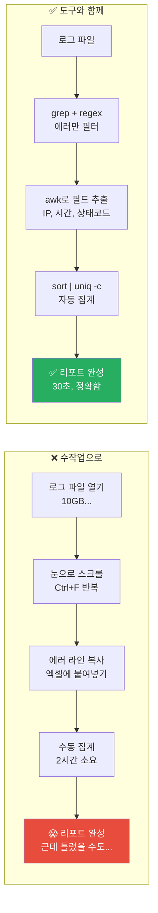
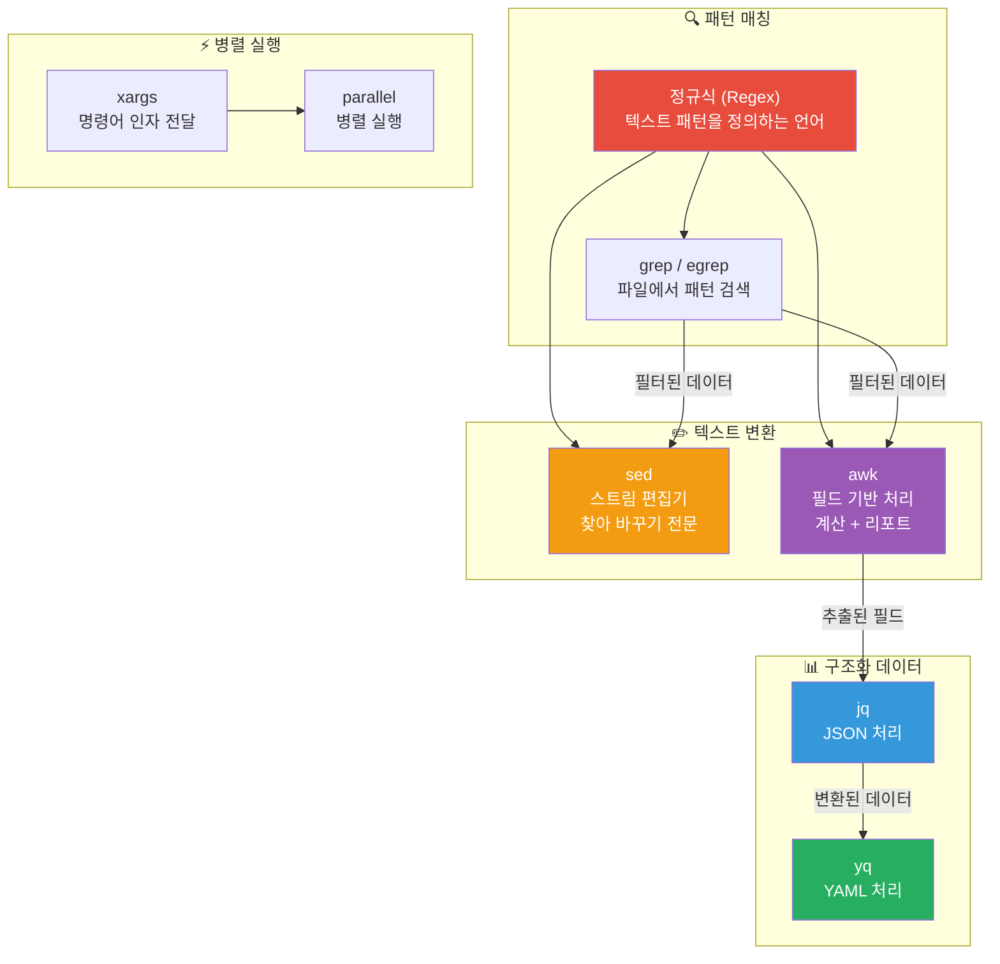
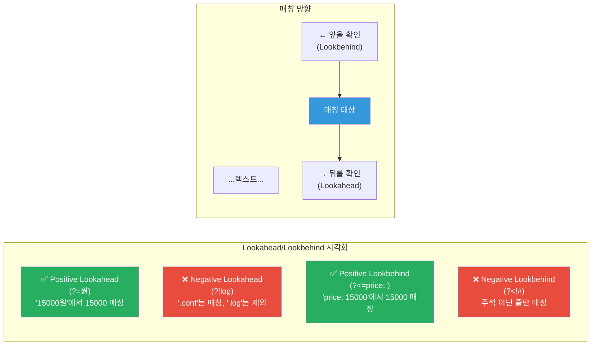
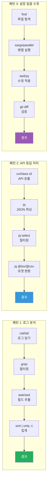
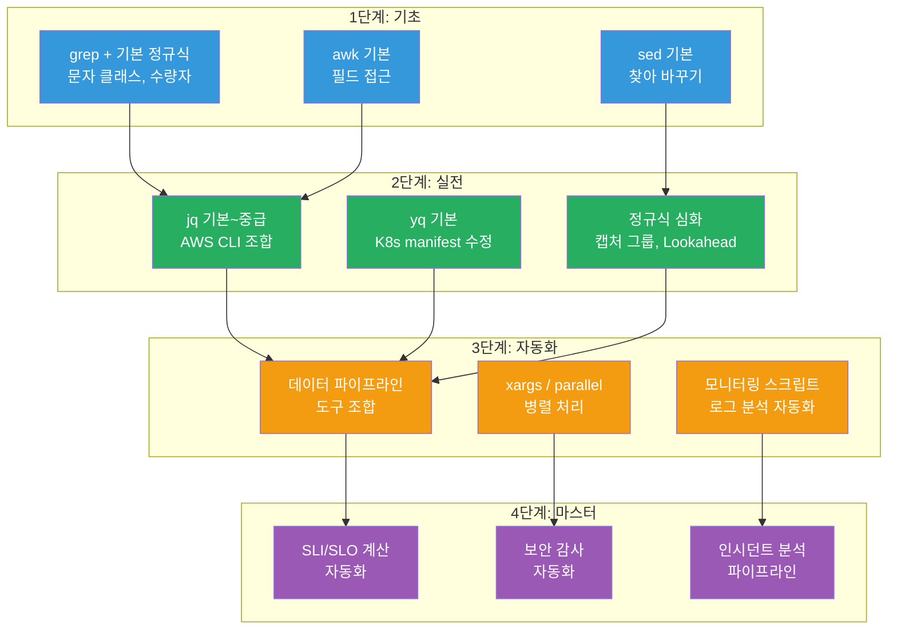

# 정규식과 데이터 처리 (Regex, jq, yq, sed, awk)

> DevOps 엔지니어의 하루는 **텍스트 데이터와의 싸움**이에요. 로그에서 에러를 찾고, JSON 응답에서 필요한 값을 뽑고, YAML 설정을 자동으로 수정하고, CSV 리포트를 만들어야 해요. 이 모든 작업의 기반이 되는 도구가 바로 **정규식(Regex)** 과 **데이터 처리 도구(jq, yq, sed, awk)** 예요. [Bash 스크립팅](./01-bash)에서 쉘의 기초를 배웠다면, 이제는 텍스트를 **정밀하게 다루는 기술**을 익혀볼게요.

---

## 🎯 왜 정규식과 데이터 처리를 알아야 하나요?

### 일상 비유: 도서관 사서의 검색 기술

거대한 도서관을 상상해보세요. 책이 100만 권 있어요.

- **일반 검색** (단순 문자열 매칭): "파이썬"이 들어간 책 → 요리책 "파이썬 뱀 요리"도 나와요
- **정밀 검색** (정규식): "프로그래밍 언어로서의 파이썬"만 찾기 → 딱 원하는 것만 나와요
- **데이터 정리** (jq/sed/awk): 검색 결과를 표로 만들고, 통계를 내고, 리포트를 생성해요

DevOps에서는 매일 이런 **정밀 검색과 데이터 가공**이 필요해요.

```
실무에서 이 기술이 필요한 순간:

• "Nginx 로그에서 5xx 에러만 뽑아서 IP별로 집계해줘"    → grep + awk
• "AWS CLI 응답 JSON에서 인스턴스 ID만 뽑아야 해"       → jq
• "K8s manifest 100개의 이미지 태그를 일괄 변경해줘"     → yq + sed
• "로그에서 이메일 주소를 마스킹해서 저장해야 해"        → sed + regex
• "액세스 로그를 분석해서 시간대별 트래픽 리포트를 만들어" → awk
• "CI/CD 파이프라인에서 테스트 결과를 파싱해야 해"       → grep + regex
• "설정 파일에서 민감 정보를 환경변수로 치환해야 해"      → sed + envsubst
```

### 도구 없이 vs 도구와 함께



---

## 🧠 핵심 개념 잡기

### 1. 텍스트 처리 도구 생태계

DevOps에서 사용하는 텍스트 처리 도구들은 각자 역할이 달라요. 마치 주방의 칼처럼 용도에 맞는 도구를 선택해야 해요.



### 2. 도구별 역할 요약

| 도구 | 한마디 설명 | 비유 | 대표 사용 사례 |
|------|------------|------|---------------|
| **Regex** | 텍스트 패턴 정의 언어 | 검색 필터의 문법 | IP 주소, 이메일 추출 |
| **grep** | 패턴으로 행 검색 | "이 단어가 포함된 줄 찾아줘" | 로그에서 ERROR 행 찾기 |
| **sed** | 스트림 편집기 | "찾아서 바꿔줘" | 설정 파일 일괄 수정 |
| **awk** | 필드 기반 처리기 | "표 데이터를 처리해줘" | 로그 필드별 집계 |
| **jq** | JSON 처리기 | "JSON에서 원하는 값 뽑아줘" | AWS CLI 응답 파싱 |
| **yq** | YAML 처리기 | "YAML에서 원하는 값 뽑아줘" | K8s manifest 수정 |
| **xargs** | 인자 전달기 | "이 목록을 하나씩 실행해줘" | 파일 목록 일괄 처리 |

### 3. 데이터 파이프라인의 핵심: 유닉스 철학

```
"한 가지 일을 잘 하는 작은 도구들을 파이프(|)로 연결한다"
```

```bash
# 실제 데이터 파이프라인 예시:
# Nginx 로그 → 5xx 에러만 → IP 추출 → 집계 → 상위 10개
cat /var/log/nginx/access.log \
  | grep -E ' (5[0-9]{2}) '        \  # 정규식: 5xx 상태코드
  | awk '{print $1}'                \  # awk: 첫 번째 필드(IP) 추출
  | sort | uniq -c | sort -rn       \  # 정렬 + 집계
  | head -10                            # 상위 10개
```

---

## 🔍 하나씩 자세히 알아보기

### 1. 정규식 (Regular Expression) 기초부터 심화까지

#### 1.1 정규식이란?

정규식은 **텍스트 패턴을 표현하는 미니 언어**예요. "숫자 3개-숫자 4개" 같은 패턴을 `\d{3}-\d{4}`로 표현할 수 있어요.

```bash
# 정규식 없이: 전화번호를 찾으려면?
# "010-1234-5678"도 찾고 "02-123-4567"도 찾고... 경우의 수가 너무 많아요

# 정규식으로: 하나의 패턴으로 모든 전화번호를 매칭
echo "연락처: 010-1234-5678, 02-123-4567" | grep -oE '[0-9]{2,3}-[0-9]{3,4}-[0-9]{4}'
# 출력:
# 010-1234-5678
# 02-123-4567
```

#### 1.2 기본 메타문자 (문자 클래스)

```bash
# === 기본 메타문자 ===

.       # 아무 문자 하나 (줄바꿈 제외)
\d      # 숫자 하나 [0-9]
\D      # 숫자가 아닌 문자 하나 [^0-9]
\w      # 단어 문자 하나 [a-zA-Z0-9_]
\W      # 단어 문자가 아닌 문자 하나
\s      # 공백 문자 (스페이스, 탭, 줄바꿈)
\S      # 공백이 아닌 문자
\b      # 단어 경계 (word boundary)

# === 문자 클래스 (대괄호) ===

[abc]       # a, b, c 중 하나
[a-z]       # 소문자 하나
[A-Z]       # 대문자 하나
[0-9]       # 숫자 하나
[a-zA-Z]    # 알파벳 하나
[^abc]      # a, b, c가 아닌 문자 하나 (^ = 부정)

# === 위치 앵커 ===

^       # 줄의 시작
$       # 줄의 끝
\b      # 단어 경계
```

실제 사용 예시를 볼게요:

```bash
# IP 주소 찾기
echo "서버 192.168.1.100에서 에러 발생" | grep -oE '[0-9]+\.[0-9]+\.[0-9]+\.[0-9]+'
# 192.168.1.100

# 이메일 찾기
echo "문의: admin@example.com으로" | grep -oE '[a-zA-Z0-9._%+-]+@[a-zA-Z0-9.-]+\.[a-zA-Z]{2,}'
# admin@example.com

# ERROR로 시작하는 줄 찾기
grep '^ERROR' /var/log/app.log

# .conf로 끝나는 줄 찾기
ls -la | grep '\.conf$'
```

#### 1.3 수량자 (Quantifiers)

수량자는 "몇 번 반복되는지"를 지정해요.

```bash
# === 기본 수량자 ===

*       # 0번 이상 (욕심쟁이 - 최대한 많이 매칭)
+       # 1번 이상
?       # 0번 또는 1번
{n}     # 정확히 n번
{n,}    # n번 이상
{n,m}   # n번 이상 m번 이하

# === 실제 예시 ===

# 전화번호: 숫자 2~3개 - 숫자 3~4개 - 숫자 4개
echo "010-1234-5678" | grep -oE '[0-9]{2,3}-[0-9]{3,4}-[0-9]{4}'

# HTTP 상태 코드 (3자리 숫자)
echo "HTTP/1.1 200 OK" | grep -oE '[0-9]{3}'

# 선택적 www 포함 URL
echo "https://www.example.com" | grep -oE 'https?://(www\.)?[a-zA-Z0-9.-]+'
# https?  → http 또는 https (s가 0번 또는 1번)
# (www\.)? → www.이 있어도 되고 없어도 됨
```

#### 1.4 탐욕적 vs 비탐욕적 매칭

이 부분은 실수하기 정말 쉬운 곳이에요. **탐욕적(greedy)** 매칭은 가능한 한 많이, **비탐욕적(lazy)** 매칭은 가능한 한 적게 매칭해요.

```bash
# === 탐욕적 (Greedy) - 기본 동작 ===
echo '<b>Hello</b> and <b>World</b>' | grep -oP '<b>.*</b>'
# 결과: <b>Hello</b> and <b>World</b>   ← 전체를 하나로 매칭!

# === 비탐욕적 (Lazy) - ? 추가 ===
echo '<b>Hello</b> and <b>World</b>' | grep -oP '<b>.*?</b>'
# 결과:
# <b>Hello</b>    ← 첫 번째 태그만
# <b>World</b>    ← 두 번째 태그만

# 비유: 뷔페에서
# 탐욕적 = 접시에 올릴 수 있는 만큼 다 올리기
# 비탐욕적 = 딱 필요한 만큼만 담기
```

```bash
# 실무 예시: JSON에서 값 추출
LOG='{"name":"kim","role":"admin","name":"lee","role":"user"}'

# 탐욕적: 첫 "name"부터 마지막 따옴표까지 다 매칭
echo "$LOG" | grep -oP '"name":".*"'
# "name":"kim","role":"admin","name":"lee","role":"user"

# 비탐욕적: 각 name의 값만 정확히 매칭
echo "$LOG" | grep -oP '"name":".*?"'
# "name":"kim"
# "name":"lee"
```

#### 1.5 캡처 그룹 (Capture Groups)

캡처 그룹은 매칭된 텍스트의 **일부분만 추출**할 때 사용해요. 괄호 `()`로 감싸면 돼요.

```bash
# === 기본 캡처 그룹 ===

# 로그에서 날짜와 레벨 분리 추출
LOG="2024-03-12 14:23:45 ERROR Connection timeout"

echo "$LOG" | grep -oP '(\d{4}-\d{2}-\d{2}) (\d{2}:\d{2}:\d{2}) (\w+)'
# 그룹1: 2024-03-12 (날짜)
# 그룹2: 14:23:45 (시간)
# 그룹3: ERROR (레벨)

# sed에서 캡처 그룹 사용 (역참조)
echo "2024-03-12" | sed -E 's/([0-9]{4})-([0-9]{2})-([0-9]{2})/\3\/\2\/\1/'
# 12/03/2024  ← 날짜 형식 변환

# === 이름 있는 캡처 그룹 (Named Groups) ===
echo "$LOG" | grep -oP '(?P<date>\d{4}-\d{2}-\d{2}) (?P<time>\d{2}:\d{2}:\d{2}) (?P<level>\w+)'

# === 비캡처 그룹 (Non-capturing) ===
# (?:...) → 그룹화하지만 캡처하지 않음 (성능 최적화)
echo "http://example.com https://example.com" | grep -oP '(?:https?://)(\S+)'
# 프로토콜은 캡처하지 않고, 도메인만 캡처
```

#### 1.6 Lookahead와 Lookbehind

**"내 앞/뒤에 이것이 있는 경우만 매칭해줘"** - 실제로 매칭에 포함하지 않고 조건만 확인해요.

```bash
# === Positive Lookahead (?=...) ===
# "뒤에 이것이 오는 경우"

# 금액 뒤에 '원'이 오는 숫자만 매칭
echo "가격 15000원, 수량 3개, 할인 2000원" | grep -oP '\d+(?=원)'
# 15000
# 2000
# (3은 "개"가 뒤에 오므로 매칭 안됨)

# === Negative Lookahead (?!...) ===
# "뒤에 이것이 오지 않는 경우"

# .log로 끝나지 않는 파일 찾기
echo -e "app.log\napp.conf\napp.yaml\nerror.log" | grep -P '\.(?!log$)\w+$'
# app.conf
# app.yaml

# === Positive Lookbehind (?<=...) ===
# "앞에 이것이 오는 경우"

# "price:" 뒤의 숫자만 추출
echo '{"price": 15000, "count": 3}' | grep -oP '(?<=price": )\d+'
# 15000

# === Negative Lookbehind (?<!...) ===
# "앞에 이것이 오지 않는 경우"

# 주석(#)으로 시작하지 않는 설정 줄
grep -P '(?<!#)\bserver\b' /etc/nginx/nginx.conf
```



#### 1.7 정규식 실전 패턴 모음

DevOps 현장에서 가장 많이 쓰는 패턴들이에요:

```bash
# === 네트워크 관련 ===

# IPv4 주소 (엄격한 버전)
grep -oP '\b(?:(?:25[0-5]|2[0-4]\d|1?\d\d?)\.){3}(?:25[0-5]|2[0-4]\d|1?\d\d?)\b'

# IPv4 주소 (실용적 버전 - 대부분의 경우 충분)
grep -oE '\b[0-9]{1,3}\.[0-9]{1,3}\.[0-9]{1,3}\.[0-9]{1,3}\b'

# CIDR 표기
grep -oE '[0-9]{1,3}\.[0-9]{1,3}\.[0-9]{1,3}\.[0-9]{1,3}/[0-9]{1,2}'

# MAC 주소
grep -oEi '([0-9a-f]{2}:){5}[0-9a-f]{2}'

# === 로그 관련 ===

# ISO 8601 타임스탬프
grep -oP '\d{4}-\d{2}-\d{2}T\d{2}:\d{2}:\d{2}(\.\d+)?(Z|[+-]\d{2}:\d{2})?'

# 일반 타임스탬프
grep -oP '\d{4}[-/]\d{2}[-/]\d{2}\s+\d{2}:\d{2}:\d{2}'

# HTTP 상태 코드 (로그에서)
grep -oP '(?<=\s)[2-5]\d{2}(?=\s)'

# === 보안 관련 ===

# 이메일 주소
grep -oP '[a-zA-Z0-9._%+-]+@[a-zA-Z0-9.-]+\.[a-zA-Z]{2,}'

# JWT 토큰 (3파트 base64)
grep -oP 'eyJ[a-zA-Z0-9_-]+\.eyJ[a-zA-Z0-9_-]+\.[a-zA-Z0-9_-]+'

# AWS Access Key
grep -oP '(?<![A-Z0-9])AKIA[0-9A-Z]{16}(?![A-Z0-9])'

# 환경변수 참조
grep -oP '\$\{?[A-Z_][A-Z0-9_]*\}?'
```

---

### 2. jq - JSON 데이터 처리의 핵심

#### 2.1 jq가 필요한 이유

AWS CLI, Kubernetes, Docker API, REST API... 현대 DevOps에서 만나는 데이터의 대부분이 JSON이에요. `jq`는 JSON을 위한 **sed + awk** 같은 도구예요.

```bash
# jq 없이 AWS CLI 응답 처리하기 (고통...)
aws ec2 describe-instances | python3 -c "import sys,json; print(json.load(sys.stdin)['Reservations'][0]['Instances'][0]['InstanceId'])"

# jq로 같은 작업 (깔끔!)
aws ec2 describe-instances | jq -r '.Reservations[].Instances[].InstanceId'
```

#### 2.2 jq 기본 문법

```bash
# === 기본 접근 ===

# 단일 필드 접근
echo '{"name": "web-server", "status": "running"}' | jq '.name'
# "web-server"

# -r 옵션: 따옴표 없이 raw 출력
echo '{"name": "web-server"}' | jq -r '.name'
# web-server

# 중첩 필드 접근
echo '{"server": {"host": "10.0.1.5", "port": 8080}}' | jq '.server.host'
# "10.0.1.5"

# === 배열 처리 ===

# 배열의 모든 요소
echo '[1, 2, 3]' | jq '.[]'
# 1
# 2
# 3

# 배열의 특정 인덱스
echo '["a", "b", "c"]' | jq '.[1]'
# "b"

# 배열 슬라이싱
echo '[1, 2, 3, 4, 5]' | jq '.[2:4]'
# [3, 4]

# 배열 길이
echo '[1, 2, 3]' | jq 'length'
# 3
```

#### 2.3 jq 필터링과 조건

```bash
# === select() - 조건으로 필터링 ===

DATA='[
  {"name": "web-1", "status": "running", "cpu": 45},
  {"name": "web-2", "status": "stopped", "cpu": 0},
  {"name": "db-1", "status": "running", "cpu": 78}
]'

# running 상태인 것만 필터링
echo "$DATA" | jq '.[] | select(.status == "running")'

# CPU 50% 이상인 서버만
echo "$DATA" | jq '.[] | select(.cpu > 50) | .name'
# "db-1"

# 이름이 "web"으로 시작하는 것만
echo "$DATA" | jq '.[] | select(.name | startswith("web"))'

# 여러 조건 AND
echo "$DATA" | jq '.[] | select(.status == "running" and .cpu > 40)'

# 여러 조건 OR
echo "$DATA" | jq '.[] | select(.status == "stopped" or .cpu > 70)'

# === map() - 배열 변환 ===

# 모든 서버의 이름만 배열로
echo "$DATA" | jq '[.[] | .name]'
# ["web-1", "web-2", "db-1"]

# 모든 서버의 CPU에 10을 더하기
echo "$DATA" | jq '[.[] | .cpu + 10]'
# [55, 10, 88]

# map() 사용 (더 간결)
echo "$DATA" | jq 'map(.name)'
# ["web-1", "web-2", "db-1"]
```

#### 2.4 jq 데이터 변환과 생성

```bash
# === 새로운 객체 생성 ===

echo "$DATA" | jq '.[] | {server_name: .name, is_healthy: (.status == "running")}'
# {"server_name": "web-1", "is_healthy": true}
# {"server_name": "web-2", "is_healthy": false}
# {"server_name": "db-1", "is_healthy": true}

# === 집계 함수 ===

# 평균 CPU
echo "$DATA" | jq '[.[].cpu] | add / length'
# 41

# 최대/최소
echo "$DATA" | jq '[.[].cpu] | max'
# 78

# 개수 세기
echo "$DATA" | jq '[.[] | select(.status == "running")] | length'
# 2

# === group_by - 그룹화 ===
echo "$DATA" | jq 'group_by(.status) | map({status: .[0].status, count: length})'
# [{"status": "running", "count": 2}, {"status": "stopped", "count": 1}]

# === 문자열 보간 ===
echo "$DATA" | jq -r '.[] | "\(.name) → \(.status) (CPU: \(.cpu)%)"'
# web-1 → running (CPU: 45%)
# web-2 → stopped (CPU: 0%)
# db-1 → running (CPU: 78%)

# === if-then-else ===
echo "$DATA" | jq '.[] | {name, alert: (if .cpu > 70 then "HIGH" elif .cpu > 40 then "MEDIUM" else "LOW" end)}'
```

#### 2.5 AWS CLI + jq 실전 조합

DevOps에서 가장 많이 쓰는 패턴이에요:

```bash
# === EC2 인스턴스 관리 ===

# 모든 running 인스턴스의 ID, 이름, IP
aws ec2 describe-instances \
  --filters "Name=instance-state-name,Values=running" \
  | jq -r '.Reservations[].Instances[] | [
      .InstanceId,
      (.Tags[] | select(.Key == "Name") | .Value) // "N/A",
      .PrivateIpAddress
    ] | @tsv'
# i-0123456789abcdef0    web-server-1    10.0.1.100
# i-0123456789abcdef1    web-server-2    10.0.1.101

# 인스턴스 타입별 개수
aws ec2 describe-instances \
  | jq '[.Reservations[].Instances[].InstanceType] | group_by(.) | map({type: .[0], count: length})'

# 태그가 없는 인스턴스 찾기
aws ec2 describe-instances \
  | jq '.Reservations[].Instances[] | select(.Tags == null or (.Tags | length == 0)) | .InstanceId'

# === S3 버킷 관리 ===

# 모든 버킷의 이름과 생성일
aws s3api list-buckets | jq -r '.Buckets[] | "\(.Name)\t\(.CreationDate)"'

# 특정 접두사의 버킷만
aws s3api list-buckets | jq -r '.Buckets[] | select(.Name | startswith("prod-")) | .Name'

# === ELB 헬스체크 ===

# unhealthy 타겟 찾기
aws elbv2 describe-target-health \
  --target-group-arn "$TG_ARN" \
  | jq -r '.TargetHealthDescriptions[] | select(.TargetHealth.State != "healthy") | .Target.Id'

# === CloudWatch 메트릭 ===

# 비용 상위 서비스 (Cost Explorer 결과 파싱)
aws ce get-cost-and-usage \
  --time-period Start=2024-03-01,End=2024-03-31 \
  --granularity MONTHLY \
  --metrics BlendedCost \
  --group-by Type=DIMENSION,Key=SERVICE \
  | jq -r '.ResultsByTime[].Groups[] | [.Keys[0], .Metrics.BlendedCost.Amount] | @tsv' \
  | sort -t$'\t' -k2 -rn | head -10

# === Lambda 함수 관리 ===

# 메모리 128MB인 Lambda 함수 목록
aws lambda list-functions \
  | jq -r '.Functions[] | select(.MemorySize == 128) | "\(.FunctionName)\t\(.Runtime)\t\(.MemorySize)MB"'

# 최근 수정된 함수 (7일 이내)
aws lambda list-functions \
  | jq -r --arg cutoff "$(date -d '7 days ago' -Iseconds)" \
    '.Functions[] | select(.LastModified > $cutoff) | .FunctionName'
```

---

### 3. yq - YAML 데이터 처리

#### 3.1 왜 yq가 필요한가?

Kubernetes manifest, Docker Compose, Ansible playbook, Helm values... DevOps의 설정 파일 대부분이 YAML이에요. `yq`는 YAML을 위한 `jq`예요.

```bash
# yq 설치 (mikefarah/yq - 가장 널리 쓰이는 버전)
# Linux
wget https://github.com/mikefarah/yq/releases/latest/download/yq_linux_amd64 -O /usr/local/bin/yq
chmod +x /usr/local/bin/yq

# macOS
brew install yq
```

#### 3.2 yq 기본 사용법

```bash
# === 값 읽기 ===

# deployment.yaml 내용:
# apiVersion: apps/v1
# kind: Deployment
# metadata:
#   name: web-app
#   labels:
#     app: web
# spec:
#   replicas: 3
#   template:
#     spec:
#       containers:
#         - name: web
#           image: nginx:1.25
#           resources:
#             limits:
#               cpu: "500m"
#               memory: "256Mi"

# 기본 필드 읽기
yq '.metadata.name' deployment.yaml
# web-app

# 배열 요소 접근
yq '.spec.template.spec.containers[0].image' deployment.yaml
# nginx:1.25

# === 값 수정 ===

# replicas 변경
yq -i '.spec.replicas = 5' deployment.yaml

# 이미지 태그 변경
yq -i '.spec.template.spec.containers[0].image = "nginx:1.26"' deployment.yaml

# 새 라벨 추가
yq -i '.metadata.labels.version = "v2"' deployment.yaml

# 리소스 제한 수정
yq -i '.spec.template.spec.containers[0].resources.limits.memory = "512Mi"' deployment.yaml

# === 여러 파일 일괄 수정 ===

# 모든 Deployment의 이미지 태그를 v2.0으로 변경
for f in manifests/*.yaml; do
  yq -i 'select(.kind == "Deployment") | .spec.template.spec.containers[0].image |= sub(":[^:]+$", ":v2.0")' "$f"
done
```

#### 3.3 K8s Manifest 실전 수정

```bash
# === 환경별 설정 오버라이드 ===

# base.yaml + prod-overlay.yaml 병합
yq eval-all 'select(fileIndex == 0) * select(fileIndex == 1)' base.yaml prod-overlay.yaml

# === 복잡한 수정 패턴 ===

# 모든 컨테이너에 환경변수 추가
yq -i '(.spec.template.spec.containers[] | .env) += [{"name": "ENV", "value": "production"}]' deployment.yaml

# 특정 조건의 요소만 수정
# CPU limit이 "500m"인 컨테이너만 "1000m"으로 변경
yq -i '(.spec.template.spec.containers[] | select(.resources.limits.cpu == "500m") | .resources.limits.cpu) = "1000m"' deployment.yaml

# annotation 추가/수정
yq -i '.metadata.annotations["prometheus.io/scrape"] = "true"' deployment.yaml
yq -i '.metadata.annotations["prometheus.io/port"] = "9090"' deployment.yaml

# === YAML ↔ JSON 변환 ===

# YAML → JSON
yq -o=json deployment.yaml

# JSON → YAML
cat config.json | yq -P

# === 멀티 도큐먼트 YAML 처리 ===

# 여러 리소스가 ---로 구분된 파일에서 Deployment만 추출
yq 'select(.kind == "Deployment")' all-resources.yaml

# 모든 도큐먼트의 namespace 변경
yq -i '(select(.metadata) | .metadata.namespace) = "production"' all-resources.yaml
```

---

### 4. sed - 스트림 편집기

#### 4.1 sed 기본 문법

`sed`는 **텍스트를 흐르는 대로 변환하는 도구**예요. 파일을 열지 않고도 내용을 바꿀 수 있어요.

```bash
# === 기본 치환 (substitute) ===

# 첫 번째 매칭만 치환
echo "hello world hello" | sed 's/hello/hi/'
# hi world hello

# 모든 매칭 치환 (g 플래그)
echo "hello world hello" | sed 's/hello/hi/g'
# hi world hi

# 대소문자 무시 (i 플래그)
echo "Hello HELLO hello" | sed 's/hello/hi/gi'
# hi hi hi

# === 구분자 변경 ===
# / 대신 다른 문자 사용 가능 (URL 등에서 유용)
echo "/usr/local/bin" | sed 's|/usr/local|/opt|'
# /opt/bin

echo "https://old.example.com" | sed 's#old.example.com#new.example.com#'
# https://new.example.com
```

#### 4.2 sed 주소 지정 (Address)

```bash
# === 행 번호로 지정 ===

# 3번째 줄만 치환
sed '3s/old/new/' file.txt

# 2~5번째 줄 치환
sed '2,5s/old/new/g' file.txt

# 마지막 줄에 추가
sed '$a\# End of file' file.txt

# === 패턴으로 지정 ===

# ERROR가 포함된 줄만 치환
sed '/ERROR/s/old/new/g' file.txt

# server 블록 안에서만 치환
sed '/server {/,/}/s/listen 80/listen 443/g' nginx.conf

# === 삭제 ===

# 빈 줄 삭제
sed '/^$/d' file.txt

# 주석(#)과 빈 줄 삭제
sed '/^#/d; /^$/d' file.txt

# 특정 패턴의 줄 삭제
sed '/DEBUG/d' app.log

# === 삽입과 추가 ===

# 특정 줄 앞에 삽입 (i)
sed '/server_name/i\    # Added by automation' nginx.conf

# 특정 줄 뒤에 추가 (a)
sed '/server_name/a\    proxy_set_header X-Forwarded-For $remote_addr;' nginx.conf
```

#### 4.3 sed in-place 편집

```bash
# === 파일 직접 수정 (-i 옵션) ===

# Linux: 바로 수정
sed -i 's/old/new/g' file.txt

# macOS: 백업 필수 (빈 문자열이라도)
sed -i '' 's/old/new/g' file.txt

# 백업 파일 생성하면서 수정
sed -i.bak 's/old/new/g' file.txt
# file.txt → 수정됨
# file.txt.bak → 원본 백업

# === 실무 활용 패턴 ===

# 설정 파일에서 변수 치환
sed -i "s|DB_HOST=.*|DB_HOST=${DB_HOST}|" .env

# Nginx 포트 변경
sed -i 's/listen 80;/listen 8080;/g' /etc/nginx/conf.d/default.conf

# Docker Compose 이미지 태그 변경
sed -i "s|image: myapp:.*|image: myapp:${NEW_TAG}|" docker-compose.yml

# SSL 인증서 경로 일괄 변경
sed -i 's|/etc/ssl/old-cert|/etc/ssl/new-cert|g' /etc/nginx/conf.d/*.conf

# 여러 파일에서 일괄 치환
find /etc/nginx -name "*.conf" -exec sed -i 's/old-domain/new-domain/g' {} +
```

#### 4.4 sed + 정규식 고급 패턴

```bash
# === 캡처 그룹 활용 ===

# IP 주소 마스킹 (개인정보 보호)
echo "User 192.168.1.100 accessed /api" | sed -E 's/([0-9]+\.[0-9]+\.[0-9]+\.)[0-9]+/\1***/g'
# User 192.168.1.*** accessed /api

# 이메일 마스킹
echo "Email: user@example.com" | sed -E 's/([a-zA-Z])[a-zA-Z]+(@)/\1***\2/g'
# Email: u***@example.com

# 로그 타임스탬프 형식 변환
echo "03/12/2024 14:30:00" | sed -E 's|([0-9]{2})/([0-9]{2})/([0-9]{4})|\3-\1-\2|'
# 2024-03-12 14:30:00

# === 멀티라인 처리 ===

# 연속된 빈 줄을 하나로 줄이기
sed '/^$/N;/^\n$/d' file.txt

# JSON 한 줄로 펴기 (간단한 경우)
sed ':a;N;$!ba;s/\n//g' data.json
```

---

### 5. awk - 필드 기반 데이터 처리

#### 5.1 awk 기본 개념

`awk`는 **텍스트를 행(row)과 열(column)로 나눠서 처리하는 프로그래밍 언어**예요. 로그 분석, 리포트 생성에 매우 강력해요.

```bash
# awk의 기본 구조
# awk 'pattern { action }' file

# === 필드 접근 ===
# $0 = 전체 줄
# $1 = 첫 번째 필드
# $2 = 두 번째 필드
# $NF = 마지막 필드
# NR = 현재 줄 번호
# NF = 현재 줄의 필드 개수

# 예시 데이터 (공백으로 구분)
echo "web-1 running 45% 10.0.1.5" | awk '{print $1, $4}'
# web-1 10.0.1.5

# 특정 구분자 지정 (-F)
echo "root:x:0:0:root:/root:/bin/bash" | awk -F: '{print $1, $7}'
# root /bin/bash

# 필드 개수와 줄 번호
echo -e "a b c\nd e" | awk '{print NR": "$0" (fields: "NF")"}'
# 1: a b c (fields: 3)
# 2: d e (fields: 2)
```

#### 5.2 awk 패턴과 조건

```bash
# === 조건부 처리 ===

# 3번째 필드가 50 이상인 줄만 출력
awk '$3 >= 50 {print $1, $3}' server_stats.txt

# 특정 패턴이 포함된 줄
awk '/ERROR/ {print}' app.log

# 패턴 + 조건 조합
awk '/web/ && $3 > 80 {print $1 " is overloaded: " $3 "%"}' stats.txt

# === BEGIN/END 블록 ===
# BEGIN: 데이터 처리 전에 실행
# END: 데이터 처리 후에 실행

awk '
  BEGIN { print "=== Server Report ===" }
  /running/ { count++ }
  END { print "Running servers: " count }
' servers.txt

# === 변수와 계산 ===

# CPU 사용률 합계와 평균
awk '
  BEGIN { sum=0; count=0 }
  { sum += $3; count++ }
  END { printf "Total: %d, Average: %.1f%%\n", sum, sum/count }
' cpu_stats.txt
```

#### 5.3 awk 실전: 로그 분석과 리포트 생성

```bash
# === Nginx 액세스 로그 분석 ===
# 로그 형식: IP - - [timestamp] "METHOD URL HTTP/ver" STATUS SIZE

# 상태 코드별 요청 수
awk '{print $9}' /var/log/nginx/access.log | sort | uniq -c | sort -rn
#  15234 200
#   3421 304
#    892 404
#    123 500

# 시간대별 요청 수 (시간만 추출)
awk '{
  split($4, a, ":");
  hour = a[2];
  requests[hour]++
}
END {
  for (h in requests)
    printf "%s:00 - %d requests\n", h, requests[h]
}' /var/log/nginx/access.log | sort

# 가장 많이 요청된 URL Top 10
awk '{print $7}' /var/log/nginx/access.log \
  | sort | uniq -c | sort -rn | head -10

# IP별 대역폭 사용량
awk '{
  ip=$1; bytes=$10
  if (bytes ~ /^[0-9]+$/) {
    traffic[ip] += bytes
  }
}
END {
  for (ip in traffic)
    printf "%s\t%.2f MB\n", ip, traffic[ip]/1024/1024
}' /var/log/nginx/access.log | sort -t$'\t' -k2 -rn | head -10

# === 5xx 에러 리포트 생성 ===
awk '$9 ~ /^5[0-9]{2}$/ {
  url = $7
  status = $9
  ip = $1
  errors[url][status]++
  error_ips[url][ip]++
  total++
}
END {
  printf "=== 5xx Error Report ===\n"
  printf "Total 5xx errors: %d\n\n", total
  printf "%-40s %-10s %-10s\n", "URL", "Status", "Count"
  printf "%-40s %-10s %-10s\n", "---", "------", "-----"
  for (url in errors)
    for (status in errors[url])
      printf "%-40s %-10s %-10d\n", url, status, errors[url][status]
}' /var/log/nginx/access.log
```

#### 5.4 awk 고급 패턴

```bash
# === CSV 처리 ===

# CSV → 깔끔한 테이블
awk -F, '
  NR==1 {
    for (i=1; i<=NF; i++) header[i] = $i
    next
  }
  {
    for (i=1; i<=NF; i++) printf "%-20s: %s\n", header[i], $i
    print "---"
  }
' data.csv

# === 다중 파일 처리 ===

# 두 파일 조인 (공통 키 기준)
awk 'NR==FNR { name[$1]=$2; next } $1 in name { print $0, name[$1] }' \
  names.txt data.txt

# === 조건부 출력 포맷팅 ===

# 디스크 사용량 경고
df -h | awk '
  NR > 1 {
    usage = $5
    gsub(/%/, "", usage)
    if (usage+0 > 90)
      printf "🔴 CRITICAL: %s at %s%%\n", $6, usage
    else if (usage+0 > 70)
      printf "🟡 WARNING:  %s at %s%%\n", $6, usage
    else
      printf "🟢 OK:       %s at %s%%\n", $6, usage
  }
'

# === Printf 포맷팅 ===

# 정렬된 테이블 출력
ps aux | awk '
  NR==1 { printf "%-10s %6s %6s  %s\n", "USER", "%CPU", "%MEM", "COMMAND" }
  NR>1 && $3>1.0 { printf "%-10s %6.1f %6.1f  %s\n", $1, $3, $4, $11 }
' | head -20
```

---

### 6. 로그 파싱 실무

#### 6.1 주요 로그 형식과 파싱 패턴

```bash
# === Nginx Combined Log Format ===
# 172.16.0.1 - admin [12/Mar/2024:14:23:45 +0900] "GET /api/users HTTP/1.1" 200 1234 "https://example.com" "Mozilla/5.0"

# 정규식으로 파싱
NGINX_REGEX='^(\S+) \S+ (\S+) \[([^\]]+)\] "(\S+) (\S+) \S+" (\d+) (\d+) "([^"]*)" "([^"]*)"'

# 각 캡처 그룹:
# \1 = IP (172.16.0.1)
# \2 = 사용자 (admin)
# \3 = 타임스탬프 (12/Mar/2024:14:23:45 +0900)
# \4 = HTTP 메서드 (GET)
# \5 = URL (/api/users)
# \6 = 상태 코드 (200)
# \7 = 바이트 수 (1234)
# \8 = 리퍼러 (https://example.com)
# \9 = User-Agent (Mozilla/5.0)

# sed로 원하는 필드 추출
cat access.log | sed -E "s|$NGINX_REGEX|\1 \6 \5|"
# 172.16.0.1 200 /api/users

# === Apache Error Log ===
# [Mon Mar 12 14:23:45.123456 2024] [error] [pid 1234] [client 172.16.0.1:56789] message

grep -oP '\[client \K[0-9.]+' /var/log/apache2/error.log | sort | uniq -c | sort -rn

# === Kubernetes Pod Log ===
# kubectl logs를 파싱

# JSON 로그인 경우
kubectl logs deployment/web-app | jq -r 'select(.level == "error") | "\(.timestamp) \(.message)"'

# 일반 텍스트 로그인 경우
kubectl logs deployment/web-app | grep -E 'ERROR|FATAL' | tail -20

# 여러 Pod의 로그를 동시에 (stern 또는 kubectl)
kubectl logs -l app=web-app --all-containers --timestamps | \
  awk '/ERROR/ {
    split($1, ts, "T");
    print ts[1], $0
  }'
```

#### 6.2 실전 로그 분석 파이프라인

```bash
# === 종합 예제: Nginx 로그 완전 분석 ===

LOG_FILE="/var/log/nginx/access.log"

# 1. 시간대별 트래픽
echo "=== 시간대별 요청 수 ==="
awk '{
  match($4, /\[.+:([0-9]{2}):/, arr)
  hour = arr[1]
  count[hour]++
}
END {
  for (h=0; h<24; h++) {
    hh = sprintf("%02d", h)
    bar = ""
    for (i=0; i<count[hh]/100; i++) bar = bar "█"
    printf "%s:00 | %6d | %s\n", hh, count[hh]+0, bar
  }
}' "$LOG_FILE"

# 2. 상태 코드 분포
echo -e "\n=== 상태 코드 분포 ==="
awk '{print $9}' "$LOG_FILE" | sort | uniq -c | sort -rn | \
  awk '{
    total += $1
    codes[$2] = $1
  }
  END {
    for (c in codes)
      printf "%s: %d (%.1f%%)\n", c, codes[c], codes[c]*100/total
  }'

# 3. 느린 응답 탐지 (응답 시간이 로그에 포함된 경우)
echo -e "\n=== 느린 응답 Top 10 (>1초) ==="
awk '$NF > 1.0 {
  printf "%.2fs | %s %s | %s\n", $NF, $6, $7, $1
}' "$LOG_FILE" | sort -rn | head -10

# 4. 의심스러운 활동 탐지
echo -e "\n=== 의심 활동 ==="
# 404를 많이 발생시키는 IP (스캐닝 의심)
awk '$9 == 404 {ip[$1]++} END {for (i in ip) if (ip[i] > 50) print ip[i], i}' "$LOG_FILE" | sort -rn

# 비정상적으로 많은 요청을 보내는 IP (DDoS 의심)
awk '{ip[$1]++} END {for (i in ip) if (ip[i] > 10000) print ip[i], i}' "$LOG_FILE" | sort -rn
```

#### 6.3 JSON 로그 + jq 분석

```bash
# 구조화 로그(JSON) 분석

LOG_FILE="app.json.log"

# 에러 로그만 필터링 후 분석
cat "$LOG_FILE" | jq -r 'select(.level == "error")' | \
  jq -s 'group_by(.error_code) | map({
    error: .[0].error_code,
    count: length,
    last_seen: (sort_by(.timestamp) | last | .timestamp),
    sample_message: .[0].message
  }) | sort_by(-.count)'

# 서비스별 에러율
cat "$LOG_FILE" | jq -s '
  group_by(.service) | map({
    service: .[0].service,
    total: length,
    errors: [.[] | select(.level == "error")] | length,
    error_rate: (([.[] | select(.level == "error")] | length) * 100 / length)
  }) | sort_by(-.error_rate)'

# 특정 Trace ID로 요청 추적
TRACE_ID="abc-123-def"
cat "$LOG_FILE" | jq -r "select(.traceId == \"$TRACE_ID\") | \"\(.timestamp) [\(.service)] \(.message)\""
```

---

### 7. xargs와 parallel - 병렬 처리

#### 7.1 xargs 기본

```bash
# === xargs 기본 사용법 ===

# 파일 목록을 한 줄씩 처리
find /var/log -name "*.log" -mtime +30 | xargs rm -f

# 안전한 xargs (-0과 print0 조합, 파일명에 공백이 있어도 OK)
find /tmp -name "*.tmp" -print0 | xargs -0 rm -f

# 인자 개수 제한 (-n)
echo "a b c d e f" | xargs -n 2 echo
# a b
# c d
# e f

# 치환 문자열 (-I)
cat servers.txt | xargs -I {} ssh {} "uptime"
# ssh web-1 "uptime"
# ssh web-2 "uptime"
# ssh db-1 "uptime"

# === 실무 패턴 ===

# 여러 Docker 이미지 한번에 삭제
docker images --format '{{.ID}}' --filter "dangling=true" | xargs docker rmi

# 여러 K8s Pod의 로그 수집
kubectl get pods -o name | xargs -I {} kubectl logs {} --tail=100

# 여러 S3 버킷에서 파일 다운로드
aws s3 ls s3://my-bucket/ --recursive | awk '{print $4}' | \
  xargs -I {} -P 4 aws s3 cp "s3://my-bucket/{}" "./backup/{}"
# -P 4: 4개까지 병렬 실행
```

#### 7.2 GNU parallel

```bash
# === parallel 설치 ===
# Ubuntu/Debian
sudo apt-get install parallel
# macOS
brew install parallel

# === 기본 사용법 ===

# 여러 서버에 동시에 SSH 명령 실행
parallel ssh {} "df -h /" ::: web-1 web-2 web-3 db-1

# 여러 파일 동시 압축
parallel gzip ::: *.log

# 파일에서 서버 목록 읽기
parallel --jobs 10 ssh {} "systemctl status nginx" :::: servers.txt

# === 실무 패턴 ===

# 여러 Docker 이미지 병렬 빌드
ls services/*/Dockerfile | parallel -j4 'dir=$(dirname {}); name=$(basename $dir); docker build -t $name $dir'

# 여러 테스트 파일 병렬 실행
find tests/ -name "test_*.py" | parallel -j$(nproc) python -m pytest {}

# 대량 API 호출 (속도 제한 포함)
cat urls.txt | parallel --jobs 5 --delay 0.2 'curl -s {} | jq .status'

# 대용량 로그 병렬 분석
find /var/log/nginx/ -name "access.log.*" | \
  parallel "zcat {} | grep '500' | wc -l" | \
  awk '{sum+=$1} END {print "Total 500 errors:", sum}'
```

---

### 8. 데이터 파이프라인 패턴

#### 8.1 자주 쓰는 파이프라인 조합



```bash
# === 패턴 1: ETL (Extract-Transform-Load) 스타일 ===

# Extract: 여러 소스에서 데이터 수집
# Transform: 정제/변환
# Load: 결과 저장

# 예시: 여러 서버의 디스크 사용량을 수집해서 리포트 생성
for server in $(cat servers.txt); do
  ssh "$server" "df -h / | tail -1" 2>/dev/null
done | awk '{
  gsub(/%/, "", $5)
  printf "%-20s %s used (%s total)\n", $1, $5"%", $2
}' | sort -t'(' -k1 -rn > disk_report.txt

# === 패턴 2: 모니터링 파이프라인 ===

# K8s Pod 상태 + 리소스 사용량 통합 리포트
paste <(
  kubectl top pods --no-headers | awk '{print $1, $2, $3}'
) <(
  kubectl get pods --no-headers | awk '{print $3, $5}'
) | awk '{
  printf "%-40s CPU:%-8s MEM:%-8s STATUS:%-12s AGE:%s\n", $1, $2, $3, $4, $5
}'

# === 패턴 3: CI/CD 파이프라인 데이터 처리 ===

# 테스트 결과 파싱 → Slack 메시지 생성
TEST_RESULT=$(pytest --tb=short 2>&1)
PASSED=$(echo "$TEST_RESULT" | grep -oP '\d+(?= passed)')
FAILED=$(echo "$TEST_RESULT" | grep -oP '\d+(?= failed)')
TOTAL=$((PASSED + FAILED))

jq -n --arg passed "$PASSED" --arg failed "$FAILED" --arg total "$TOTAL" '{
  text: "Test Results: \($passed)/\($total) passed, \($failed) failed",
  color: (if ($failed | tonumber) > 0 then "danger" else "good" end)
}' | curl -X POST -H 'Content-type: application/json' -d @- "$SLACK_WEBHOOK_URL"
```

#### 8.2 도구 선택 가이드

```
데이터 형식이 뭔가요?
│
├─ JSON → jq
│   ├─ AWS CLI 응답? → aws ... | jq '.필드'
│   └─ REST API 응답? → curl ... | jq
│
├─ YAML → yq
│   ├─ K8s manifest? → yq '.spec.replicas' deployment.yaml
│   └─ Docker Compose? → yq '.services.web.image' docker-compose.yml
│
├─ 비정형 텍스트 (로그 등) → grep + sed/awk
│   ├─ 행 필터링만? → grep 'pattern'
│   ├─ 찾아 바꾸기? → sed 's/old/new/g'
│   ├─ 필드 기반 처리? → awk '{print $1}'
│   └─ 복잡한 집계? → awk (변수, 배열, 함수)
│
└─ 여러 파일/서버 동시 처리 → xargs / parallel
    ├─ 단순 반복? → xargs -I {}
    └─ 병렬 + 속도? → parallel -j N
```

---

## 💻 직접 해보기

### 실습 1: 정규식으로 로그 파싱

```bash
# 실습용 로그 파일 생성
cat > /tmp/sample_access.log << 'EOF'
192.168.1.100 - - [12/Mar/2024:14:23:45 +0900] "GET /api/users HTTP/1.1" 200 1234
10.0.0.55 - admin [12/Mar/2024:14:23:46 +0900] "POST /api/orders HTTP/1.1" 201 567
172.16.0.1 - - [12/Mar/2024:14:23:47 +0900] "GET /favicon.ico HTTP/1.1" 404 0
192.168.1.100 - - [12/Mar/2024:14:24:00 +0900] "GET /api/products HTTP/1.1" 200 8901
10.0.0.55 - - [12/Mar/2024:14:24:01 +0900] "DELETE /api/users/123 HTTP/1.1" 500 89
192.168.1.200 - - [12/Mar/2024:14:24:02 +0900] "GET /api/users HTTP/1.1" 200 1234
172.16.0.1 - - [12/Mar/2024:14:24:03 +0900] "GET /admin/login HTTP/1.1" 403 45
10.0.0.55 - admin [12/Mar/2024:14:24:04 +0900] "PUT /api/orders/456 HTTP/1.1" 200 234
192.168.1.100 - - [12/Mar/2024:14:24:05 +0900] "GET /api/health HTTP/1.1" 200 12
10.0.0.55 - - [12/Mar/2024:14:24:10 +0900] "POST /api/login HTTP/1.1" 500 78
EOF

# 과제 1: 5xx 에러만 추출해보세요
grep -E '" [5][0-9]{2} ' /tmp/sample_access.log

# 과제 2: IP별 요청 횟수를 구해보세요
awk '{print $1}' /tmp/sample_access.log | sort | uniq -c | sort -rn

# 과제 3: /api로 시작하는 URL만 추출해보세요
grep -oP '(?<=")[A-Z]+ /api\S+' /tmp/sample_access.log

# 과제 4: POST, PUT, DELETE 요청만 필터링
grep -E '"(POST|PUT|DELETE) ' /tmp/sample_access.log

# 과제 5: 403, 404, 500 에러의 IP와 URL을 깔끔하게 출력
awk '$9 ~ /^(403|404|500)$/ {
  printf "%-16s %-6s %s %s\n", $1, $9, $6, $7
}' /tmp/sample_access.log
```

### 실습 2: jq로 AWS 스타일 JSON 처리

```bash
# 실습용 JSON 생성 (EC2 describe-instances 형태)
cat > /tmp/instances.json << 'ENDJSON'
{
  "Reservations": [
    {
      "Instances": [
        {
          "InstanceId": "i-0a1b2c3d4e5f6g7h8",
          "InstanceType": "t3.medium",
          "State": {"Name": "running"},
          "PrivateIpAddress": "10.0.1.100",
          "Tags": [
            {"Key": "Name", "Value": "web-server-1"},
            {"Key": "Environment", "Value": "production"},
            {"Key": "Team", "Value": "platform"}
          ]
        },
        {
          "InstanceId": "i-1a2b3c4d5e6f7g8h9",
          "InstanceType": "t3.large",
          "State": {"Name": "running"},
          "PrivateIpAddress": "10.0.1.101",
          "Tags": [
            {"Key": "Name", "Value": "web-server-2"},
            {"Key": "Environment", "Value": "production"},
            {"Key": "Team", "Value": "platform"}
          ]
        }
      ]
    },
    {
      "Instances": [
        {
          "InstanceId": "i-2a3b4c5d6e7f8g9h0",
          "InstanceType": "r5.xlarge",
          "State": {"Name": "running"},
          "PrivateIpAddress": "10.0.2.50",
          "Tags": [
            {"Key": "Name", "Value": "db-primary"},
            {"Key": "Environment", "Value": "production"},
            {"Key": "Team", "Value": "data"}
          ]
        },
        {
          "InstanceId": "i-3a4b5c6d7e8f9g0h1",
          "InstanceType": "t3.micro",
          "State": {"Name": "stopped"},
          "PrivateIpAddress": "10.0.3.10",
          "Tags": [
            {"Key": "Name", "Value": "dev-test"},
            {"Key": "Environment", "Value": "development"},
            {"Key": "Team", "Value": "platform"}
          ]
        }
      ]
    }
  ]
}
ENDJSON

# 과제 1: 모든 인스턴스 ID 출력
jq -r '.Reservations[].Instances[].InstanceId' /tmp/instances.json

# 과제 2: running 상태인 인스턴스만 이름과 IP 출력
jq -r '.Reservations[].Instances[]
  | select(.State.Name == "running")
  | (.Tags[] | select(.Key == "Name") | .Value) + "\t" + .PrivateIpAddress' /tmp/instances.json

# 과제 3: 인스턴스 타입별 개수
jq '[.Reservations[].Instances[].InstanceType] | group_by(.) | map({type: .[0], count: length})' /tmp/instances.json

# 과제 4: production 환경의 인스턴스만 필터링
jq '.Reservations[].Instances[]
  | select(.Tags[] | select(.Key == "Environment" and .Value == "production"))
  | {id: .InstanceId, name: (.Tags[] | select(.Key == "Name") | .Value)}' /tmp/instances.json

# 과제 5: TSV 형태로 깔끔하게 출력
jq -r '.Reservations[].Instances[] | [
  .InstanceId,
  .InstanceType,
  .State.Name,
  .PrivateIpAddress,
  (.Tags[] | select(.Key == "Name") | .Value)
] | @tsv' /tmp/instances.json
```

### 실습 3: sed + awk 설정 파일 자동화

```bash
# 실습용 Nginx 설정 파일 생성
cat > /tmp/nginx.conf << 'EOF'
# Main Nginx Config
worker_processes auto;

http {
    server {
        listen 80;
        server_name old-app.example.com;

        location / {
            proxy_pass http://localhost:3000;
            proxy_set_header Host $host;
        }

        location /api {
            proxy_pass http://localhost:8080;
            proxy_set_header Host $host;
            proxy_connect_timeout 30s;
        }
    }

    server {
        listen 80;
        server_name old-admin.example.com;

        location / {
            proxy_pass http://localhost:4000;
        }
    }
}
EOF

# 과제 1: 도메인 일괄 변경 (old → new)
sed 's/old-app\.example\.com/new-app.example.com/g; s/old-admin\.example\.com/new-admin.example.com/g' /tmp/nginx.conf

# 과제 2: 모든 proxy_pass의 포트 번호 추출
grep -oP 'proxy_pass http://localhost:\K[0-9]+' /tmp/nginx.conf

# 과제 3: listen 80을 listen 443 ssl로 변경
sed 's/listen 80;/listen 443 ssl;/g' /tmp/nginx.conf

# 과제 4: 모든 location 블록에 rate limiting 추가
sed '/location.*{/a\            limit_req zone=api burst=20;' /tmp/nginx.conf

# 과제 5: 주석 줄 수와 설정 줄 수 세기
awk '
  /^[[:space:]]*#/ { comments++ }
  /^[[:space:]]*$/ { empty++ }
  !/^[[:space:]]*#/ && !/^[[:space:]]*$/ { config++ }
  END {
    printf "Comments: %d, Config: %d, Empty: %d, Total: %d\n", comments, config, empty, NR
  }
' /tmp/nginx.conf
```

### 실습 4: 종합 - 인시던트 분석 파이프라인

```bash
# 시나리오: 새벽 3시에 500 에러가 급증했다는 알림을 받았어요
# 로그를 분석해서 인시던트 리포트를 만들어보세요

cat > /tmp/incident_log.json << 'ENDJSON'
{"ts":"2024-03-12T02:58:00Z","level":"info","service":"api-gw","msg":"Request processed","path":"/api/orders","status":200,"duration_ms":45,"client_ip":"10.0.1.50"}
{"ts":"2024-03-12T02:59:00Z","level":"info","service":"order-svc","msg":"Order created","order_id":"ORD-001","status":200,"duration_ms":120}
{"ts":"2024-03-12T03:00:00Z","level":"error","service":"order-svc","msg":"DB connection failed","error":"connection refused","status":500,"duration_ms":5002,"client_ip":"10.0.1.50"}
{"ts":"2024-03-12T03:00:05Z","level":"error","service":"order-svc","msg":"DB connection failed","error":"connection refused","status":500,"duration_ms":5001,"client_ip":"10.0.1.51"}
{"ts":"2024-03-12T03:00:10Z","level":"error","service":"payment-svc","msg":"Upstream timeout","error":"order-svc unreachable","status":502,"duration_ms":30000}
{"ts":"2024-03-12T03:01:00Z","level":"error","service":"order-svc","msg":"DB connection failed","error":"connection refused","status":500,"duration_ms":5003,"client_ip":"10.0.1.52"}
{"ts":"2024-03-12T03:01:30Z","level":"warn","service":"api-gw","msg":"Circuit breaker opened","target":"order-svc"}
{"ts":"2024-03-12T03:02:00Z","level":"error","service":"api-gw","msg":"Service unavailable","error":"circuit breaker open","status":503,"path":"/api/orders"}
{"ts":"2024-03-12T03:05:00Z","level":"info","service":"order-svc","msg":"DB connection restored","status":200}
{"ts":"2024-03-12T03:05:30Z","level":"info","service":"api-gw","msg":"Circuit breaker closed","target":"order-svc"}
ENDJSON

# 분석 1: 에러 타임라인
echo "=== Error Timeline ==="
cat /tmp/incident_log.json | jq -r 'select(.level == "error" or .level == "warn") | "\(.ts) [\(.level | ascii_upcase)] \(.service): \(.msg)"'

# 분석 2: 서비스별 에러 수
echo -e "\n=== Errors by Service ==="
cat /tmp/incident_log.json | jq -r 'select(.level == "error") | .service' | sort | uniq -c | sort -rn

# 분석 3: 에러 유형별 분류
echo -e "\n=== Error Types ==="
cat /tmp/incident_log.json | jq -s '[.[] | select(.level == "error")] | group_by(.error) | map({error: .[0].error, count: length, services: [.[].service] | unique})'

# 분석 4: 인시던트 지속 시간 계산
echo -e "\n=== Incident Duration ==="
cat /tmp/incident_log.json | jq -s '
  ([.[] | select(.level == "error")] | sort_by(.ts) | .[0].ts) as $start |
  ([.[] | select(.msg | test("restored|closed"))] | sort_by(.ts) | last | .ts) as $end |
  "Start: \($start)\nEnd:   \($end)"
'

# 분석 5: 영향 받은 클라이언트 IP
echo -e "\n=== Affected Clients ==="
cat /tmp/incident_log.json | jq -r 'select(.level == "error" and .client_ip != null) | .client_ip' | sort -u
```

---

## 🏢 실무에서는?

### 시나리오 1: CI/CD 파이프라인에서 테스트 결과 파싱

```bash
# GitHub Actions에서 테스트 결과를 파싱해서 PR 코멘트 생성

# pytest 결과 파싱
PYTEST_OUTPUT=$(pytest --junitxml=results.xml --tb=short 2>&1)

# XML → JSON 변환 후 jq로 처리
# (yq로 XML도 읽을 수 있어요)
yq -p=xml -o=json results.xml | jq '{
  tests: .testsuites.testsuite["+@tests"] | tonumber,
  failures: .testsuites.testsuite["+@failures"] | tonumber,
  errors: .testsuites.testsuite["+@errors"] | tonumber,
  time: .testsuites.testsuite["+@time"]
}'

# 실패한 테스트만 추출
yq -p=xml -o=json results.xml | jq -r '
  .testsuites.testsuite.testcase[]
  | select(.failure != null)
  | "FAIL: \(."+@classname").\(."+@name")\n  \(.failure["+content"])\n"
'
```

### 시나리오 2: 인프라 비용 리포트 자동화

```bash
#!/bin/bash
# AWS 비용 분석 스크립트

MONTH_START=$(date -d "$(date +%Y-%m-01)" +%Y-%m-%d)
MONTH_END=$(date -d "$(date +%Y-%m-01) +1 month -1 day" +%Y-%m-%d)

# 서비스별 비용 조회
aws ce get-cost-and-usage \
  --time-period Start="$MONTH_START",End="$MONTH_END" \
  --granularity MONTHLY \
  --metrics BlendedCost \
  --group-by Type=DIMENSION,Key=SERVICE \
  | jq -r '
    .ResultsByTime[0].Groups
    | sort_by(-.Metrics.BlendedCost.Amount | tonumber)
    | .[:10]
    | .[]
    | [.Keys[0], (.Metrics.BlendedCost.Amount | tonumber | . * 100 | round / 100 | tostring + " USD")]
    | @tsv
  ' | awk -F'\t' '
    BEGIN { printf "%-40s %12s\n%-40s %12s\n", "Service", "Cost", "-------", "----" }
    { printf "%-40s %12s\n", $1, $2; total += $2 }
    END { printf "%-40s %12.2f USD\n", "TOTAL", total }
  '
```

### 시나리오 3: K8s 클러스터 헬스체크 스크립트

```bash
#!/bin/bash
# 클러스터 건강 상태 종합 체크

echo "=== Kubernetes Cluster Health Report ==="
echo "Date: $(date '+%Y-%m-%d %H:%M:%S')"
echo ""

# 노드 상태
echo "--- Nodes ---"
kubectl get nodes -o json | jq -r '
  .items[] | [
    .metadata.name,
    (.status.conditions[] | select(.type == "Ready") | .status),
    (.status.allocatable.cpu),
    (.status.allocatable.memory)
  ] | @tsv
' | awk -F'\t' '
  BEGIN { printf "%-25s %-8s %-8s %-12s\n", "Node", "Ready", "CPU", "Memory" }
  { printf "%-25s %-8s %-8s %-12s\n", $1, $2, $3, $4 }'

# Pod 상태 집계
echo ""
echo "--- Pod Status Summary ---"
kubectl get pods --all-namespaces -o json | jq -r '
  [.items[] | .status.phase] | group_by(.) | map({phase: .[0], count: length}) | .[] | [.phase, .count] | @tsv
' | awk -F'\t' '{ printf "%-15s %d\n", $1, $2 }'

# 재시작 많은 Pod (상위 5개)
echo ""
echo "--- Top 5 Most Restarting Pods ---"
kubectl get pods --all-namespaces -o json | jq -r '
  [.items[] | {
    ns: .metadata.namespace,
    name: .metadata.name,
    restarts: ([.status.containerStatuses[]?.restartCount] | add // 0)
  }] | sort_by(-.restarts) | .[:5] | .[] | [.ns, .name, .restarts] | @tsv
' | awk -F'\t' '
  BEGIN { printf "%-20s %-40s %s\n", "Namespace", "Pod", "Restarts" }
  { printf "%-20s %-40s %d\n", $1, $2, $3 }'

# 리소스 사용량 (kubectl top)
echo ""
echo "--- Resource Usage ---"
kubectl top nodes --no-headers 2>/dev/null | awk '{
  printf "%-25s CPU: %-6s (%s)  MEM: %-8s (%s)\n", $1, $2, $3, $4, $5
}'
```

### 시나리오 4: 보안 감사 - 민감 정보 탐지

```bash
#!/bin/bash
# 코드베이스에서 민감 정보 탐지

TARGET_DIR="${1:-.}"

echo "=== Sensitive Data Scan ==="
echo "Scanning: $TARGET_DIR"
echo ""

# AWS 키 탐지
echo "--- AWS Access Keys ---"
grep -rnP 'AKIA[0-9A-Z]{16}' "$TARGET_DIR" --include="*.{py,js,ts,yaml,yml,json,env,conf}" 2>/dev/null | \
  sed -E 's/(AKIA[0-9A-Z]{4})[0-9A-Z]{12}/\1************/g'

# 비밀번호 패턴 탐지
echo ""
echo "--- Hardcoded Passwords ---"
grep -rnPi '(password|passwd|pwd)\s*[=:]\s*["\x27][^\s]+["\x27]' "$TARGET_DIR" \
  --include="*.{py,js,ts,yaml,yml,json,conf}" 2>/dev/null | \
  sed -E "s/(password|passwd|pwd)([=:]\s*[\"'])[^\"']+/\1\2********/gi"

# JWT 토큰 탐지
echo ""
echo "--- JWT Tokens ---"
grep -rnP 'eyJ[a-zA-Z0-9_-]{10,}\.eyJ[a-zA-Z0-9_-]{10,}\.' "$TARGET_DIR" \
  --include="*.{py,js,ts,yaml,yml,json,log}" 2>/dev/null | \
  sed -E 's/(eyJ[a-zA-Z0-9_-]{8})[a-zA-Z0-9_.-]+/\1...REDACTED/g'

# Private Key 파일 탐지
echo ""
echo "--- Private Keys ---"
grep -rnl 'BEGIN.*PRIVATE KEY' "$TARGET_DIR" 2>/dev/null

echo ""
echo "Scan complete."
```

### 시나리오 5: 로그 기반 SLI/SLO 계산

```bash
#!/bin/bash
# Nginx 로그에서 SLI(Service Level Indicator) 계산

LOG_FILE="${1:-/var/log/nginx/access.log}"
WINDOW_HOURS="${2:-24}"

echo "=== SLI Report (Last ${WINDOW_HOURS}h) ==="

# 지정된 시간 윈도우의 로그만 처리
CUTOFF=$(date -d "${WINDOW_HOURS} hours ago" '+%d/%b/%Y:%H:%M:%S')

awk -v cutoff="$CUTOFF" '
  {
    # 타임스탬프 추출
    match($4, /\[(.+)\]/, ts)
    if (ts[1] >= cutoff) {
      total++
      status = $9

      if (status >= 200 && status < 500) success++
      if (status >= 500) errors_5xx++
      if (status == 404) errors_404++

      # 응답 시간 (마지막 필드라고 가정)
      rt = $NF
      if (rt+0 <= 0.5) fast++
      total_rt += rt
    }
  }
  END {
    if (total == 0) { print "No data in time window"; exit }

    availability = (success / total) * 100
    latency_sli = (fast / total) * 100
    avg_rt = total_rt / total
    error_rate = (errors_5xx / total) * 100

    printf "\n%-25s %12s %12s\n", "Metric", "Value", "SLO Target"
    printf "%-25s %12s %12s\n", "---", "---", "---"
    printf "%-25s %11.3f%% %12s\n", "Availability", availability, "99.9%"
    printf "%-25s %11.3f%% %12s\n", "Latency (<500ms)", latency_sli, "95%"
    printf "%-25s %10.0fms %12s\n", "Avg Response Time", avg_rt*1000, "<200ms"
    printf "%-25s %11.3f%% %12s\n", "Error Rate (5xx)", error_rate, "<0.1%"
    printf "%-25s %12d\n", "Total Requests", total
    printf "%-25s %12d\n", "5xx Errors", errors_5xx
    printf "%-25s %12d\n", "404 Errors", errors_404

    # SLO 위반 여부
    printf "\n--- SLO Status ---\n"
    if (availability < 99.9) printf "🔴 Availability SLO VIOLATED (%.3f%% < 99.9%%)\n", availability
    else printf "✅ Availability SLO OK\n"

    if (latency_sli < 95) printf "🔴 Latency SLO VIOLATED (%.3f%% < 95%%)\n", latency_sli
    else printf "✅ Latency SLO OK\n"

    if (error_rate > 0.1) printf "🔴 Error Rate SLO VIOLATED (%.3f%% > 0.1%%)\n", error_rate
    else printf "✅ Error Rate SLO OK\n"
  }
' "$LOG_FILE"
```

---

## ⚠️ 자주 하는 실수

### 실수 1: 탐욕적 매칭의 함정

```bash
# ❌ 잘못된 예: HTML 태그 내용 추출
echo '<div>Hello</div><div>World</div>' | grep -o '<div>.*</div>'
# <div>Hello</div><div>World</div>  ← 전체가 하나로 매칭!

# ✅ 올바른 예: 비탐욕적 매칭 사용
echo '<div>Hello</div><div>World</div>' | grep -oP '<div>.*?</div>'
# <div>Hello</div>
# <div>World</div>

# 또는 부정 문자 클래스 사용 (PCRE 없이도 가능)
echo '<div>Hello</div><div>World</div>' | grep -o '<div>[^<]*</div>'
```

### 실수 2: jq에서 null 처리 안 하기

```bash
# ❌ 잘못된 예: Tags가 없는 인스턴스에서 에러
echo '{"Tags": null}' | jq '.Tags[] | select(.Key == "Name")'
# 에러: Cannot iterate over null

# ✅ 올바른 예: null 체크 추가
echo '{"Tags": null}' | jq '(.Tags // [])[] | select(.Key == "Name")'

# ✅ 또는 try 사용
echo '{"Tags": null}' | jq 'try (.Tags[] | select(.Key == "Name")) catch "N/A"'

# ✅ alternative operator (//) 활용
echo '{"name": null}' | jq '.name // "unknown"'
# "unknown"
```

### 실수 3: sed에서 특수문자 이스케이프 안 하기

```bash
# ❌ 잘못된 예: URL에 / 포함
sed 's/http://old.com/http://new.com/' file.txt
# 에러! / 가 구분자와 충돌

# ✅ 올바른 예: 다른 구분자 사용
sed 's|http://old.com|http://new.com|' file.txt
sed 's#http://old.com#http://new.com#' file.txt

# ❌ 잘못된 예: 변수에 특수문자 포함
URL="http://example.com/path?a=1&b=2"
sed "s|old|$URL|" file.txt
# & 가 sed에서 "매칭된 전체 문자열"을 의미하므로 오류

# ✅ 올바른 예: 변수의 특수문자 이스케이프
ESCAPED_URL=$(printf '%s\n' "$URL" | sed 's/[&/\]/\\&/g')
sed "s|old|$ESCAPED_URL|" file.txt
```

### 실수 4: awk에서 필드 구분자 실수

```bash
# ❌ 잘못된 예: CSV 파일을 공백으로 분할
awk '{print $2}' data.csv
# "Kim, Seoul" 같은 값이 있으면 잘못 분할됨

# ✅ 올바른 예: 구분자를 명시적으로 지정
awk -F, '{print $2}' data.csv

# ❌ 잘못된 예: /etc/passwd 처리 시
awk '{print $1}' /etc/passwd
# root:x:0:0:root:/root:/bin/bash 가 통째로 $1

# ✅ 올바른 예:
awk -F: '{print $1}' /etc/passwd
# root
```

### 실수 5: 파이프라인에서 에러 무시

```bash
# ❌ 잘못된 예: 중간 단계 실패를 모르고 넘어감
cat nonexistent.log | grep ERROR | wc -l
# cat이 실패해도 wc -l은 0을 출력 → "에러 없음"으로 착각

# ✅ 올바른 예: pipefail 설정
set -o pipefail
cat nonexistent.log | grep ERROR | wc -l
# cat 실패 시 전체 파이프라인이 실패로 처리됨

# ✅ 또는 파일 존재 확인 먼저
if [[ -f "$LOG_FILE" ]]; then
  grep ERROR "$LOG_FILE" | wc -l
else
  echo "Error: Log file not found: $LOG_FILE" >&2
  exit 1
fi
```

### 실수 6: 큰 따옴표 vs 작은 따옴표 혼동

```bash
# ❌ 잘못된 예: 변수 확장이 필요한데 작은 따옴표 사용
NAME="web-server"
echo '{"name": "$NAME"}' | jq .
# {"name": "$NAME"}  ← 변수가 확장 안 됨!

# ✅ 올바른 예: 큰 따옴표 사용
echo "{\"name\": \"$NAME\"}" | jq .
# {"name": "web-server"}

# ✅ 더 나은 예: jq --arg 사용 (injection 방지)
jq -n --arg name "$NAME" '{"name": $name}'
# {"name": "web-server"}
```

### 실수 7: 정규식 엔진 차이 무시

```bash
# ❌ 잘못된 예: grep에서 \d 사용 (기본 grep은 POSIX BRE)
echo "123" | grep '\d+'
# 매칭 안 됨!

# ✅ 올바른 예: POSIX 문법 사용
echo "123" | grep '[0-9]\+'      # BRE
echo "123" | grep -E '[0-9]+'    # ERE

# ✅ 또는 PCRE 모드 사용 (-P)
echo "123" | grep -P '\d+'

# 정리: grep 모드별 차이
# grep       → BRE (Basic Regular Expression): +, ?, |, () 앞에 \ 필요
# grep -E    → ERE (Extended Regular Expression): +, ?, |, () 바로 사용
# grep -P    → PCRE (Perl Compatible): \d, \w, lookahead 등 사용 가능
```

---

## 📝 마무리

### 핵심 정리

```
1. 정규식 (Regex)
   - 문자 클래스: [a-z], \d, \w, \s
   - 수량자: *, +, ?, {n,m}
   - 캡처 그룹: () 로 부분 추출, \1 로 역참조
   - Lookahead/Lookbehind: (?=...), (?<=...) 으로 조건부 매칭
   - 비탐욕적 매칭: .*? 로 최소 매칭

2. jq (JSON 처리)
   - 기본 접근: .field, .nested.field, .[0]
   - 필터링: select(.status == "running")
   - 변환: map(), group_by(), sort_by()
   - AWS CLI와 조합이 핵심

3. yq (YAML 처리)
   - jq와 비슷한 문법으로 YAML 처리
   - K8s manifest 일괄 수정에 필수
   - YAML ↔ JSON 변환

4. sed (스트림 편집)
   - 찾아 바꾸기: s/old/new/g
   - in-place 수정: -i 옵션
   - 구분자 변경: s|old|new| (URL 처리 시)

5. awk (필드 처리)
   - 필드 접근: $1, $2, $NF
   - 구분자: -F: (콜론), -F, (쉼표)
   - 집계: BEGIN/END 블록, 배열, printf

6. xargs/parallel (병렬 처리)
   - xargs -I {}: 치환 문자열
   - xargs -P N: N개 병렬 실행
   - parallel: 더 강력한 병렬 처리
```

### 도구 선택 치트시트

```bash
# JSON 다루기 → jq
aws ec2 describe-instances | jq -r '.Reservations[].Instances[].InstanceId'

# YAML 다루기 → yq
yq '.spec.replicas = 5' deployment.yaml

# 행 필터링 → grep + regex
grep -E 'ERROR|FATAL' /var/log/app.log

# 찾아 바꾸기 → sed
sed -i 's/old-version/new-version/g' config.yaml

# 필드별 처리/집계 → awk
awk '{print $1}' access.log | sort | uniq -c | sort -rn

# 반복 실행 → xargs
cat servers.txt | xargs -I {} -P 5 ssh {} "uptime"

# 병렬 처리 → parallel
find . -name "*.log" | parallel gzip
```

### 학습 로드맵



---

## 🔗 다음 단계

### 연결되는 주제들

| 다음 학습 | 왜 필요한가요? | 링크 |
|-----------|---------------|------|
| **자동화 스크립팅** | 이 도구들을 조합해서 완전한 자동화 스크립트를 만들어요 | [자동화 스크립팅](./05-automation) |
| **로깅 시스템** | 로그를 수집/검색/분석하는 시스템을 구축해요 | [로깅](../08-observability/04-logging) |
| **Bash 스크립팅** | 쉘 스크립트의 기초를 복습해요 | [Bash 스크립팅](./01-bash) |

### 추천 연습 과제

```
1. [초급] /var/log/syslog에서 오늘 날짜의 ERROR 로그만 추출해서 에러 유형별로 집계하기
2. [초급] AWS CLI로 모든 S3 버킷 목록을 가져와서 이름과 생성일을 표 형태로 출력하기
3. [중급] Nginx 액세스 로그에서 시간대별 요청 수 + 에러율 리포트 생성하기
4. [중급] K8s Deployment YAML 파일 10개에서 이미지 태그를 일괄 변경하는 스크립트 작성하기
5. [고급] 여러 서버의 로그를 수집해서 종합 인시던트 타임라인을 자동 생성하는 파이프라인 만들기
6. [고급] 코드베이스에서 민감 정보(API 키, 비밀번호, 토큰)를 탐지하고 마스킹하는 스크립트 작성하기
```

### 유용한 참고 자료

```
온라인 도구:
• regex101.com      - 정규식 테스트 및 디버깅 (실시간 매칭 확인)
• jqplay.org        - jq 쿼리 온라인 테스트
• regexr.com        - 정규식 시각적 설명

치트시트:
• jq Manual         - https://stedolan.github.io/jq/manual/
• yq Manual         - https://mikefarah.gitbook.io/yq/
• GNU sed Manual    - https://www.gnu.org/software/sed/manual/
• GNU awk Manual    - https://www.gnu.org/software/gawk/manual/
```
