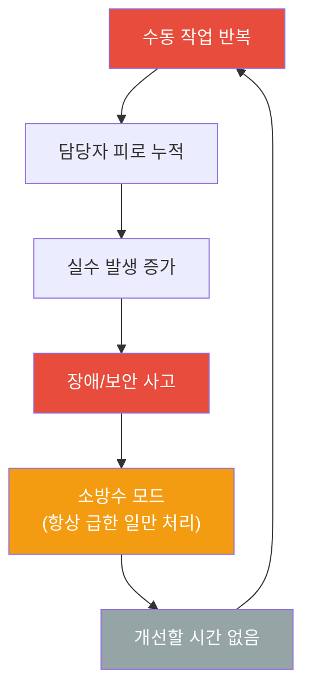
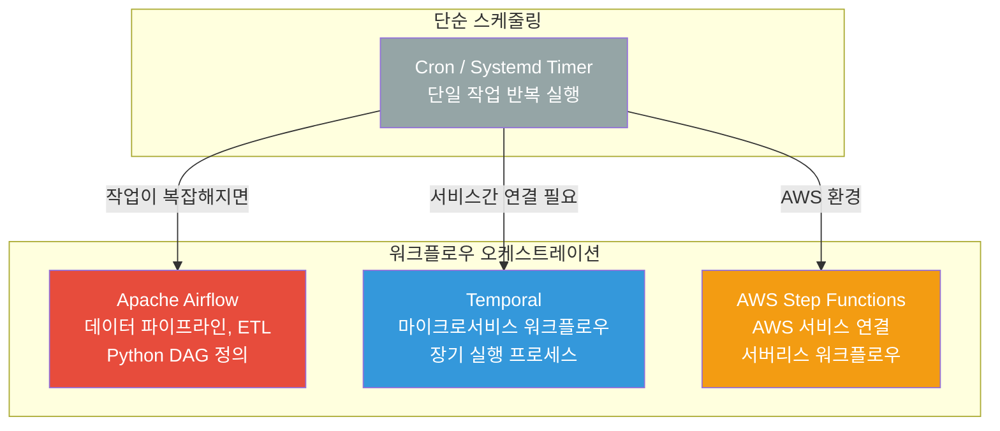
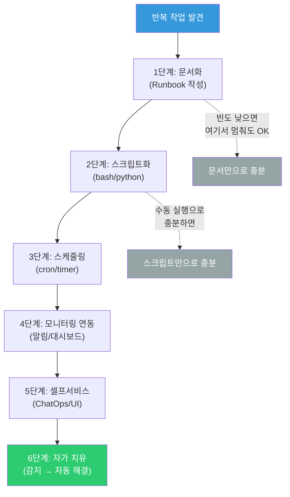

# 자동화 전략 (Automation Strategy)

> "매일 아침 서버 상태 체크하고, 로그 정리하고, 배포하고... 이걸 언제까지 수동으로 할 건가요?" — 자동화는 DevOps의 핵심이에요. 반복 작업을 없애고, 사람의 실수를 줄이고, 팀의 시간을 가치 있는 일에 쓸 수 있게 해줘요. [Bash 스크립트](./01-bash)와 [Python 스크립트](./02-python)를 배웠으니, 이제 이것들을 **언제, 어떻게, 무엇을 자동화할지** 전략적으로 접근해볼게요.

---

## 🎯 왜 자동화 전략을 알아야 하나요?

### 일상 비유: 식당 주방의 자동화

작은 식당을 운영한다고 생각해보세요.

- **초기**: 사장님이 직접 주문 받고, 요리하고, 서빙하고, 설거지해요
- **성장기**: 직원을 뽑아서 역할을 나눠요 (주문=홀직원, 요리=주방, 설거지=알바)
- **확장기**: 키오스크(주문 자동화), 식기세척기(설거지 자동화), POS 시스템(매출 자동 집계)

식당이 커질수록 **사람이 하던 반복 작업을 기계가 대신**해요. DevOps도 마찬가지예요.

```
실무에서 자동화가 필요한 순간들:

매일 반복하는 작업:
• 서버 상태 체크                    → 모니터링 자동화
• 로그 정리/백업                    → Cron job
• 배포 실행                        → CI/CD 파이프라인

사람이 하면 실수하는 작업:
• 서버 설정 변경                    → IaC (Terraform/Ansible)
• 보안 패치 적용                    → 자동 업데이트
• 인증서 갱신                      → certbot + timer

시간을 많이 잡아먹는 작업:
• 환경 구성 (dev/staging/prod)      → Docker + IaC
• 코드 리뷰 사전 체크               → Lint/Test 자동화
• 인시던트 초기 대응                → Runbook 자동화
```

### 자동화를 안 하면 생기는 일



이 악순환에서 벗어나는 유일한 방법이 **자동화**예요.

---

## 🧠 핵심 개념 잡기

### 1. Toil (반복 노동) — SRE의 핵심 개념

> **비유**: 식당에서 매일 같은 방식으로 감자 100개를 깎는 일

[SRE 원칙](../10-sre/01-principles)에서 말하는 **Toil**은 다음 특성을 가진 작업이에요:

| 특성 | 설명 | 예시 |
|------|------|------|
| **수동적** | 사람이 직접 실행해야 함 | SSH 접속해서 로그 확인 |
| **반복적** | 같은 작업이 계속 반복됨 | 매일 아침 서버 상태 체크 |
| **자동화 가능** | 기계가 대신할 수 있음 | 스크립트로 충분히 가능 |
| **전술적** | 장기적 가치가 없음 | 임시 디스크 정리 |
| **O(n) 증가** | 서비스가 커지면 비례 증가 | 서버 10대 → 100대 |

**Google SRE의 목표**: 엔지니어 업무 시간의 50% 이상이 Toil이 되면 안 돼요.

### 2. 자동화 ROI (투자 대비 효과)

> **비유**: 식기세척기를 살지 말지 결정하는 것

```
자동화 ROI 계산 공식:

ROI = (절약되는 시간 x 빈도 x 기간) - (개발 시간 + 유지보수 시간)

예시 1: 로그 정리 자동화
  - 수동 소요: 15분/회 x 365일/년 = 91시간/년
  - 자동화 개발: 4시간
  - 유지보수: 2시간/년
  - ROI = 91 - (4 + 2) = 85시간/년 절약  --> 반드시 자동화!

예시 2: 연 1회 마이그레이션 스크립트
  - 수동 소요: 2시간/회 x 1회/년 = 2시간/년
  - 자동화 개발: 16시간
  - 유지보수: 4시간/년
  - ROI = 2 - (16 + 4) = -18시간  --> 문서화가 나아요!
```

### 3. 자동화 vs 문서화 결정 매트릭스

모든 걸 자동화할 필요는 없어요. 때로는 **잘 작성된 문서(Runbook)**가 더 효율적이에요.


### 4. 자동화 성숙도 모델

조직의 자동화 수준을 5단계로 나눌 수 있어요.


| 레벨 | 이름 | 설명 | 예시 |
|------|------|------|------|
| 1 | 수동 (Manual) | 모든 작업을 사람이 수동으로 실행 | SSH 접속해서 명령어 직접 입력 |
| 2 | 스크립트 (Scripted) | 반복 작업을 스크립트로 만듦 | deploy.sh, backup.sh |
| 3 | 스케줄링 (Scheduled) | 스크립트를 자동으로 정기 실행 | Cron, Systemd timer |
| 4 | 오케스트레이션 (Orchestrated) | 여러 작업을 워크플로우로 연결 | Airflow, Step Functions |
| 5 | 자가 치유 (Self-Healing) | 문제 감지부터 해결까지 자동 | Auto-remediation |

**대부분의 팀은 Level 2~3에 있어요.** Level 4~5를 목표로 점진적으로 올라가면 돼요.

### 5. 자동화 우선순위 정하기

뭘 먼저 자동화해야 할지 모르겠다면, 이 기준으로 정렬하세요.

```
자동화 우선순위 점수 = (빈도 x 3) + (소요시간 x 2) + (실수 위험 x 3) + (영향도 x 2)
                                                            (각 1~5점)

예시:
┌──────────────────────┬──────┬──────────┬──────────┬────────┬────────┐
│ 작업                 │ 빈도 │ 소요시간 │ 실수위험 │ 영향도 │ 총점   │
├──────────────────────┼──────┼──────────┼──────────┼────────┼────────┤
│ 배포 프로세스        │  5   │    4     │    5     │   5    │   48   │
│ 로그 정리            │  5   │    2     │    2     │   2    │   29   │
│ DB 백업              │  4   │    3     │    4     │   5    │   40   │
│ SSL 인증서 갱신      │  2   │    2     │    4     │   5    │   32   │
│ 서버 프로비저닝      │  2   │    5     │    4     │   4    │   36   │
│ 보안 패치            │  3   │    3     │    4     │   5    │   37   │
└──────────────────────┴──────┴──────────┴──────────┴────────┴────────┘

→ 배포 프로세스(48점)가 가장 우선! 다음은 DB 백업(40점)
```

---

## 🔍 하나씩 자세히 알아보기

### 1. Makefile — 빌드 자동화의 클래식

> **비유**: 요리 레시피 모음집. "파스타 만들어줘"라고 하면 필요한 재료 준비부터 완성까지 순서대로 진행

Makefile은 1976년에 만들어진 빌드 자동화 도구인데, 아직도 현역이에요. DevOps에서는 **프로젝트의 공통 명령어를 정리하는 인터페이스**로 많이 써요.

#### 기본 구조

```makefile
# Makefile의 기본 구조
# target: dependencies
#     recipe (명령어) — 반드시 TAB으로 들여쓰기!

build: src/main.go
	go build -o app src/main.go

test: build
	go test ./...

clean:
	rm -f app
```

```
Makefile 핵심 용어:

target (타겟)     = 만들려는 것 (또는 실행할 작업 이름)
dependencies      = 타겟을 만들기 전에 필요한 것
recipe (레시피)   = 실제 실행할 명령어 (반드시 TAB 들여쓰기!)
```

#### 변수와 패턴

```makefile
# === 변수 정의 ===
APP_NAME := my-service
VERSION  := $(shell git describe --tags --always)
DOCKER_IMAGE := myregistry/$(APP_NAME):$(VERSION)
GO_FILES := $(shell find . -name '*.go' -not -path './vendor/*')

# 환경별 설정
ENV ?= dev
# ?= 는 "값이 없을 때만 이 값을 쓰겠다"는 의미
# make deploy ENV=prod 로 오버라이드 가능

# === .PHONY ===
# "이 타겟은 파일이 아니라 작업 이름이에요" 라고 알려주는 것
# 같은 이름의 파일이 있어도 항상 실행됨
.PHONY: build test deploy clean lint help

# === 타겟 정의 ===
build: lint test  ## 앱 빌드 (lint, test 먼저 실행)
	@echo "Building $(APP_NAME) version $(VERSION)..."
	go build -ldflags "-X main.version=$(VERSION)" -o bin/$(APP_NAME) .
	@echo "Build complete!"

test:  ## 테스트 실행
	go test -v -cover ./...

lint:  ## 코드 린트
	golangci-lint run ./...

# === Docker 관련 ===
docker-build:  ## Docker 이미지 빌드
	docker build -t $(DOCKER_IMAGE) .

docker-push: docker-build  ## Docker 이미지 push
	docker push $(DOCKER_IMAGE)

# === 배포 ===
deploy:  ## 배포 (ENV 변수로 환경 지정)
	@echo "Deploying to $(ENV)..."
	kubectl apply -f k8s/$(ENV)/
	kubectl set image deployment/$(APP_NAME) \
		$(APP_NAME)=$(DOCKER_IMAGE) -n $(ENV)

# === 유틸리티 ===
clean:  ## 빌드 결과물 정리
	rm -rf bin/
	docker rmi $(DOCKER_IMAGE) 2>/dev/null || true

# === 도움말 (## 주석을 자동으로 파싱) ===
help:  ## 사용 가능한 명령어 목록
	@grep -E '^[a-zA-Z_-]+:.*?## .*$$' $(MAKEFILE_LIST) | \
		awk 'BEGIN {FS = ":.*?## "}; {printf "  \033[36m%-15s\033[0m %s\n", $$1, $$2}'

# 기본 타겟 (make만 치면 실행됨)
.DEFAULT_GOAL := help
```

```bash
# 사용 예시
make              # help 출력 (기본 타겟)
make build        # lint → test → build 순서로 실행
make deploy ENV=prod  # 프로덕션 배포
make docker-push  # Docker 이미지 빌드 + push
make clean        # 정리
```

#### .PHONY가 왜 필요한가요?

```bash
# 만약 프로젝트에 "clean"이라는 파일이 있다면...
$ touch clean
$ make clean
make: 'clean' is up to date.   # 실행 안 됨!

# .PHONY: clean 이 있으면
$ make clean
rm -rf bin/   # 항상 실행됨!
```

`make`는 원래 파일을 만드는 도구예요. "clean"이라는 파일이 이미 있으면 "이미 최신이네" 하고 넘어가요. `.PHONY`는 "이건 파일이 아니라 명령어야"라고 알려주는 거예요.

---

### 2. Task (Taskfile.yml) — Makefile의 현대적 대안

> **비유**: Makefile이 수동 변속기 자동차라면, Task는 자동 변속기 자동차

Makefile의 TAB 들여쓰기 문제, 복잡한 문법을 해결한 현대적 Task runner예요.

#### 설치

```bash
# macOS
brew install go-task

# Linux
sh -c "$(curl --location https://taskfile.dev/install.sh)" -- -d -b /usr/local/bin

# npm
npm install -g @go-task/cli
```

#### Taskfile.yml 작성

```yaml
# Taskfile.yml
version: '3'

# 변수 정의
vars:
  APP_NAME: my-service
  VERSION:
    sh: git describe --tags --always
  DOCKER_IMAGE: "myregistry/{{.APP_NAME}}:{{.VERSION}}"

# 환경 변수
env:
  CGO_ENABLED: '0'

tasks:
  # 기본 타겟
  default:
    desc: "사용 가능한 명령어 목록"
    cmds:
      - task --list

  build:
    desc: "앱 빌드"
    deps: [lint, test]  # 의존성 (병렬 실행!)
    cmds:
      - echo "Building {{.APP_NAME}} version {{.VERSION}}..."
      - go build -ldflags "-X main.version={{.VERSION}}" -o bin/{{.APP_NAME}} .
    sources:
      - ./**/*.go        # 이 파일들이 변경되었을 때만 실행
    generates:
      - bin/{{.APP_NAME}}

  test:
    desc: "테스트 실행"
    cmds:
      - go test -v -cover ./...

  lint:
    desc: "코드 린트"
    cmds:
      - golangci-lint run ./...

  docker:build:
    desc: "Docker 이미지 빌드"
    cmds:
      - docker build -t {{.DOCKER_IMAGE}} .

  docker:push:
    desc: "Docker 이미지 push"
    deps: [docker:build]
    cmds:
      - docker push {{.DOCKER_IMAGE}}

  deploy:
    desc: "배포 (환경: ENV 변수)"
    vars:
      ENV: '{{.ENV | default "dev"}}'
    cmds:
      - echo "Deploying to {{.ENV}}..."
      - kubectl apply -f k8s/{{.ENV}}/
      - kubectl set image deployment/{{.APP_NAME}}
          {{.APP_NAME}}={{.DOCKER_IMAGE}} -n {{.ENV}}
    preconditions:
      - sh: kubectl cluster-info
        msg: "Kubernetes 클러스터에 연결할 수 없어요!"

  clean:
    desc: "빌드 결과물 정리"
    cmds:
      - rm -rf bin/
      - docker rmi {{.DOCKER_IMAGE}} 2>/dev/null || true
```

```bash
# 사용법
task              # 명령어 목록
task build        # 빌드 (lint + test 병렬 실행 후 빌드)
task deploy ENV=prod  # 프로덕션 배포
task docker:push  # Docker 빌드 + push
```

#### Makefile vs Task 비교

| 비교 항목 | Makefile | Taskfile.yml |
|-----------|----------|--------------|
| 문법 | 독자적 문법, TAB 필수 | YAML (익숙함) |
| 의존성 실행 | 순차적 | **병렬** (기본) |
| 변수 | 복잡한 쉘 확장 | Go 템플릿 |
| 조건 실행 | 어려움 | preconditions, status |
| 크로스 플랫폼 | Unix 중심 | Windows 지원 |
| 네임스페이스 | 없음 | `docker:build` 형태 |
| 설치 | 기본 내장 | 별도 설치 필요 |

**실무 결론**: 새 프로젝트는 Task, 기존 프로젝트는 Makefile 유지. 팀에서 통일하는 게 중요해요.

---

### 3. Just (justfile) — 명령어 러너에 집중

> **비유**: Makefile에서 "파일 빌드" 기능을 빼고, "명령어 실행"에만 집중한 도구

Just는 "command runner"예요. Makefile처럼 빌드 시스템이 아니라, **프로젝트 명령어를 정리하는 용도**에 최적화되어 있어요.

#### 설치

```bash
# macOS
brew install just

# Linux
curl --proto '=https' --tlsv1.2 -sSf https://just.systems/install.sh | bash -s -- --to /usr/local/bin

# cargo
cargo install just
```

#### justfile 작성

```just
# justfile (들여쓰기: 공백도 TAB도 OK)

# 변수
app_name := "my-service"
version := `git describe --tags --always`
env := env_var_or_default("ENV", "dev")

# 기본 레시피
default:
    @just --list

# 빌드
build: lint test
    echo "Building {{app_name}} v{{version}}..."
    go build -ldflags "-X main.version={{version}}" -o bin/{{app_name}} .

# 테스트
test *FLAGS:
    go test {{FLAGS}} ./...

# 린트
lint:
    golangci-lint run ./...

# 배포 (인자를 받을 수 있음)
deploy target=env:
    #!/usr/bin/env bash
    set -euo pipefail
    echo "Deploying to {{target}}..."
    kubectl apply -f k8s/{{target}}/

# Docker 빌드
docker-build:
    docker build -t myregistry/{{app_name}}:{{version}} .

# 다양한 테스트 실행 예시
test-unit:
    just test -v -short

test-integration:
    just test -v -run Integration

test-coverage:
    just test -v -coverprofile=coverage.out
    go tool cover -html=coverage.out -o coverage.html
```

```bash
# 사용법
just              # 레시피 목록
just build        # 빌드
just test -v      # 테스트 (추가 플래그 전달)
just deploy prod  # 프로덕션 배포
```

---

### 4. Cron Jobs — 시간 기반 스케줄링

> **비유**: 매일 같은 시간에 울리는 알람 시계

Cron은 Linux에서 가장 오래되고 가장 많이 쓰이는 스케줄러예요. 자세한 내용은 [Linux Cron 편](../01-linux/06-cron)에서 다뤘지만, 여기서는 **자동화 전략 관점**에서 다시 정리해볼게요.

#### crontab 표현식 정리

```
┌──────────── 분 (0-59)
│ ┌────────── 시 (0-23)
│ │ ┌──────── 일 (1-31)
│ │ │ ┌────── 월 (1-12)
│ │ │ │ ┌──── 요일 (0-7, 0과 7은 일요일)
│ │ │ │ │
* * * * *  command

자주 쓰는 패턴:
*/5 * * * *       → 5분마다
0 * * * *         → 매시간 정각
0 3 * * *         → 매일 새벽 3시
0 3 * * 1         → 매주 월요일 새벽 3시
0 0 1 * *         → 매월 1일 자정
0 3 * * 1-5       → 평일 매일 새벽 3시
*/10 9-18 * * 1-5 → 평일 9시~18시, 10분마다
```

#### 실무 crontab 예시

```bash
# crontab -e
SHELL=/bin/bash
PATH=/usr/local/bin:/usr/bin:/bin
MAILTO=devops@company.com

# ===== 로그 관리 =====
# 매일 새벽 2시: 7일 이상 된 로그 삭제
0 2 * * * find /var/log/app -name "*.log" -mtime +7 -delete 2>&1 | logger -t log-cleanup

# ===== 백업 =====
# 매일 새벽 3시: DB 백업
0 3 * * * /opt/scripts/backup-db.sh >> /var/log/backup.log 2>&1

# 매주 일요일 새벽 4시: 전체 백업
0 4 * * 0 /opt/scripts/full-backup.sh >> /var/log/backup.log 2>&1

# ===== 모니터링 =====
# 5분마다: 디스크 용량 체크
*/5 * * * * /opt/scripts/check-disk.sh

# ===== 인증서 =====
# 매일 새벽 1시: SSL 인증서 갱신 체크
0 1 * * * certbot renew --quiet --post-hook "systemctl reload nginx"

# ===== 정리 =====
# 매주 토요일 새벽 5시: Docker 이미지 정리
0 5 * * 6 docker system prune -af --filter "until=168h" 2>&1 | logger -t docker-cleanup
```

#### Cron 모니터링 — 실패를 감지하는 방법

Cron의 가장 큰 문제는 **실패해도 아무도 모른다**는 거예요.

```bash
#!/bin/bash
# /opt/scripts/cron-wrapper.sh
# 모든 cron job을 이 wrapper로 감싸서 실행

SCRIPT_NAME="$1"
shift

# 실행 시작 로깅
echo "[$(date '+%Y-%m-%d %H:%M:%S')] START: $SCRIPT_NAME" >> /var/log/cron-audit.log

# 스크립트 실행
if "$@" 2>&1; then
    STATUS="SUCCESS"
    EXIT_CODE=0
else
    STATUS="FAILED"
    EXIT_CODE=$?
    # Slack 알림 전송
    curl -s -X POST "$SLACK_WEBHOOK" \
        -H 'Content-Type: application/json' \
        -d "{\"text\":\"Cron job FAILED: $SCRIPT_NAME (exit: $EXIT_CODE)\"}"
fi

# 실행 종료 로깅
echo "[$(date '+%Y-%m-%d %H:%M:%S')] $STATUS: $SCRIPT_NAME (exit: $EXIT_CODE)" >> /var/log/cron-audit.log

# healthcheck.io 같은 서비스에 ping
if [ "$STATUS" = "SUCCESS" ]; then
    curl -s "https://hc-ping.com/YOUR-UUID-HERE" > /dev/null
fi

exit $EXIT_CODE
```

```bash
# crontab에서 wrapper 사용
0 3 * * * /opt/scripts/cron-wrapper.sh "db-backup" /opt/scripts/backup-db.sh
```

---

### 5. Systemd Timers — Cron의 현대적 대안

> **비유**: Cron이 단순한 알람 시계라면, Systemd timer는 스마트 알람 + 건강 관리 앱

Systemd timer는 [systemd 서비스](../01-linux/05-systemd)의 기능을 활용해서 cron보다 정교한 스케줄링이 가능해요.

#### Systemd Timer 만들기

두 개의 파일이 필요해요: `.service` (뭘 실행할지) + `.timer` (언제 실행할지)

```ini
# /etc/systemd/system/backup-db.service
[Unit]
Description=Database Backup
After=network.target postgresql.service
Wants=postgresql.service

[Service]
Type=oneshot
ExecStart=/opt/scripts/backup-db.sh
User=backup
Group=backup
StandardOutput=journal
StandardError=journal

# 보안 강화
NoNewPrivileges=true
ProtectSystem=full
PrivateTmp=true

# 타임아웃
TimeoutStartSec=3600

# 실패 시 알림
ExecStopPost=/opt/scripts/notify-on-failure.sh %n %p
```

```ini
# /etc/systemd/system/backup-db.timer
[Unit]
Description=Daily Database Backup Timer

[Timer]
# 매일 새벽 3시
OnCalendar=*-*-* 03:00:00

# 시간 약간 랜덤화 (여러 서버가 동시에 백업하는 것 방지)
RandomizedDelaySec=300

# 부팅 후 놓친 실행 보충
Persistent=true

# 정확한 시간 (1초 오차 이내)
AccuracySec=1s

[Install]
WantedBy=timers.target
```

```bash
# 활성화 및 시작
sudo systemctl daemon-reload
sudo systemctl enable backup-db.timer
sudo systemctl start backup-db.timer

# 상태 확인
sudo systemctl list-timers --all
# NEXT                         LEFT          LAST                         PASSED       UNIT
# Fri 2026-03-14 03:00:00 KST  8h left       Thu 2026-03-13 03:02:15 KST  15h ago      backup-db.timer

# 수동 실행 (테스트)
sudo systemctl start backup-db.service

# 로그 확인
sudo journalctl -u backup-db.service --since today
```

#### OnCalendar 표현식

```
# Systemd timer의 OnCalendar 표현식
DayOfWeek Year-Month-Day Hour:Minute:Second

예시:
*-*-* 03:00:00         → 매일 새벽 3시
Mon *-*-* 03:00:00     → 매주 월요일 새벽 3시
*-*-01 03:00:00        → 매월 1일 새벽 3시
*-*-* *:00:00          → 매시간 정각
*-*-* *:*:00           → 매분
*-*-* 09..18:00:00     → 매일 9시~18시, 정각마다
Mon..Fri *-*-* 09:00:00 → 평일 오전 9시
```

```bash
# 표현식 검증 도구
systemd-analyze calendar "*-*-* 03:00:00"
#   Original form: *-*-* 03:00:00
#  Normalized form: *-*-* 03:00:00
#      Next elapse: Fri 2026-03-14 03:00:00 KST
#         (in UTC): Thu 2026-03-13 18:00:00 UTC
#      From now: 8h 12min left
```

#### Cron vs Systemd Timer 비교

| 비교 | Cron | Systemd Timer |
|------|------|---------------|
| 설정 파일 | 1개 (crontab) | 2개 (.service + .timer) |
| 로깅 | 별도 설정 | journalctl 자동 통합 |
| 의존성 관리 | 불가 | After, Wants, Requires |
| 놓친 실행 | 무시됨 | Persistent=true로 보충 |
| 리소스 제한 | 불가 | CPUQuota, MemoryMax |
| 보안 격리 | 불가 | PrivateTmp, NoNewPrivileges |
| 랜덤 지연 | 불가 | RandomizedDelaySec |
| 모니터링 | 어려움 | systemctl status로 확인 |

**실무 결론**: 간단한 반복 작업은 cron, 서비스와 연동하거나 정교한 제어가 필요하면 systemd timer를 쓰세요.

---

### 6. 스케줄링 도구 — 워크플로우 오케스트레이션

단순 스케줄링(cron)을 넘어서, **여러 작업을 순서대로 연결하고 관리**해야 할 때는 전문 오케스트레이션 도구가 필요해요.



#### Apache Airflow

데이터 파이프라인의 표준 도구예요. DAG(Directed Acyclic Graph)로 워크플로우를 정의해요.

```python
# dags/daily_etl.py
from airflow import DAG
from airflow.operators.bash import BashOperator
from airflow.operators.python import PythonOperator
from airflow.providers.slack.operators.slack_webhook import SlackWebhookOperator
from datetime import datetime, timedelta

default_args = {
    'owner': 'devops',
    'depends_on_past': False,
    'email': ['devops@company.com'],
    'email_on_failure': True,
    'retries': 2,
    'retry_delay': timedelta(minutes=5),
}

with DAG(
    'daily_etl_pipeline',
    default_args=default_args,
    description='일일 데이터 ETL 파이프라인',
    schedule_interval='0 3 * * *',  # 매일 새벽 3시
    start_date=datetime(2026, 1, 1),
    catchup=False,
    tags=['etl', 'daily'],
) as dag:

    # 1단계: 데이터 추출
    extract = BashOperator(
        task_id='extract_data',
        bash_command='/opt/scripts/extract.sh ',
    )

    # 2단계: 데이터 변환
    def transform_data(**context):
        # 추출된 데이터 변환 로직
        import pandas as pd
        df = pd.read_csv('/tmp/raw_data.csv')
        df_clean = df.dropna().drop_duplicates()
        df_clean.to_parquet('/tmp/clean_data.parquet')
        return len(df_clean)

    transform = PythonOperator(
        task_id='transform_data',
        python_callable=transform_data,
    )

    # 3단계: 데이터 적재
    load = BashOperator(
        task_id='load_data',
        bash_command='aws s3 cp /tmp/clean_data.parquet s3://data-lake/daily/ ',
    )

    # 4단계: 완료 알림
    notify = SlackWebhookOperator(
        task_id='notify_completion',
        slack_webhook_conn_id='slack_webhook',
        message='Daily ETL 완료! 처리 건수: {{ ti.xcom_pull(task_ids="transform_data") }}',
    )

    # 의존성 정의 (실행 순서)
    extract >> transform >> load >> notify
```

#### Temporal

마이크로서비스 환경에서 **장기 실행되는 워크플로우**를 관리하는 도구예요.

```python
# workflows/order_workflow.py
from temporalio import workflow, activity
from datetime import timedelta

@activity.defn
async def process_payment(order_id: str, amount: float) -> str:
    """결제 처리 — 외부 API 호출"""
    # 결제 게이트웨이 호출
    return f"payment-{order_id}-confirmed"

@activity.defn
async def update_inventory(order_id: str, items: list) -> bool:
    """재고 차감"""
    # DB 업데이트
    return True

@activity.defn
async def send_notification(order_id: str, email: str) -> None:
    """주문 완료 알림 발송"""
    # 이메일/SMS 발송
    pass

@workflow.defn
class OrderWorkflow:
    """주문 처리 워크플로우 — 결제 → 재고 → 알림 순서로 실행"""

    @workflow.run
    async def run(self, order_id: str, amount: float,
                  items: list, email: str) -> str:

        # 1. 결제 처리 (최대 30초, 3회 재시도)
        payment_id = await workflow.execute_activity(
            process_payment,
            args=[order_id, amount],
            start_to_close_timeout=timedelta(seconds=30),
            retry_policy=RetryPolicy(maximum_attempts=3),
        )

        # 2. 재고 차감
        await workflow.execute_activity(
            update_inventory,
            args=[order_id, items],
            start_to_close_timeout=timedelta(seconds=10),
        )

        # 3. 알림 발송
        await workflow.execute_activity(
            send_notification,
            args=[order_id, email],
            start_to_close_timeout=timedelta(seconds=10),
        )

        return payment_id
```

#### AWS Step Functions

AWS 서비스들을 연결하는 **서버리스 워크플로우** 도구예요.

```json
{
  "Comment": "일일 데이터 처리 워크플로우",
  "StartAt": "ExtractData",
  "States": {
    "ExtractData": {
      "Type": "Task",
      "Resource": "arn:aws:lambda:ap-northeast-2:123456789:function:extract",
      "ResultPath": "$.extractResult",
      "Next": "TransformData",
      "Retry": [
        {
          "ErrorEquals": ["States.TaskFailed"],
          "IntervalSeconds": 60,
          "MaxAttempts": 3,
          "BackoffRate": 2.0
        }
      ],
      "Catch": [
        {
          "ErrorEquals": ["States.ALL"],
          "Next": "NotifyFailure"
        }
      ]
    },
    "TransformData": {
      "Type": "Task",
      "Resource": "arn:aws:lambda:ap-northeast-2:123456789:function:transform",
      "ResultPath": "$.transformResult",
      "Next": "LoadData"
    },
    "LoadData": {
      "Type": "Task",
      "Resource": "arn:aws:lambda:ap-northeast-2:123456789:function:load",
      "Next": "NotifySuccess"
    },
    "NotifySuccess": {
      "Type": "Task",
      "Resource": "arn:aws:states:::sns:publish",
      "Parameters": {
        "TopicArn": "arn:aws:sns:ap-northeast-2:123456789:etl-alerts",
        "Message": "ETL 파이프라인 성공!"
      },
      "End": true
    },
    "NotifyFailure": {
      "Type": "Task",
      "Resource": "arn:aws:states:::sns:publish",
      "Parameters": {
        "TopicArn": "arn:aws:sns:ap-northeast-2:123456789:etl-alerts",
        "Message": "ETL 파이프라인 실패!"
      },
      "End": true
    }
  }
}
```

#### 오케스트레이션 도구 비교

```
┌──────────────┬────────────────┬────────────────┬──────────────────┐
│              │  Airflow       │  Temporal      │  Step Functions  │
├──────────────┼────────────────┼────────────────┼──────────────────┤
│ 주 용도      │ 데이터 ETL     │ 서비스 워크플로우│ AWS 서비스 연결   │
│ 언어         │ Python (DAG)   │ Python/Go/Java │ JSON/YAML (ASL)  │
│ 인프라       │ 자체 운영 필요 │ 자체 운영 필요  │ 서버리스 (관리형) │
│ 장기 실행    │ 비추천         │ 최적화됨       │ 1년까지 가능     │
│ 재시도/보상  │ 기본 재시도    │ Saga 패턴 지원 │ Retry/Catch      │
│ 모니터링     │ 웹 UI 내장     │ 웹 UI 내장     │ CloudWatch       │
│ 비용         │ 인프라 비용    │ 인프라 비용    │ 실행 건당 과금   │
│ 학습 곡선    │ 보통           │ 높음           │ 낮음 (AWS 사용자)│
└──────────────┴────────────────┴────────────────┴──────────────────┘
```

---

### 7. ChatOps — Slack Bot 자동화

> **비유**: 팀 채팅방에 든든한 비서가 있는 것

ChatOps는 **채팅 도구(Slack, Teams 등)에서 직접 운영 작업을 실행**하는 패턴이에요.

```
전통적 방식:
  1. Slack에서 "서버 상태 확인해주세요" 메시지 받음
  2. 터미널 열고 SSH 접속
  3. 명령어 실행
  4. 결과를 복사해서 Slack에 붙여넣기

ChatOps 방식:
  1. Slack에서 /status 입력
  2. 봇이 자동으로 서버 상태 확인
  3. 결과가 바로 채널에 표시됨
```

#### Slack Bot 구현 예시 (Python)

```python
# chatops_bot.py
import os
import subprocess
from slack_bolt import App
from slack_bolt.adapter.socket_mode import SocketModeHandler

app = App(token=os.environ["SLACK_BOT_TOKEN"])

# /deploy 명령어 처리
@app.command("/deploy")
def handle_deploy(ack, command, respond):
    ack()  # 3초 내 응답 필수

    env = command["text"].strip() or "dev"
    user = command["user_name"]

    # 권한 확인
    allowed_users = ["devops-lead", "sre-team"]
    if user not in allowed_users and env == "prod":
        respond(f"@{user} 프로덕션 배포 권한이 없어요. #devops 채널에서 요청해주세요.")
        return

    respond(f"@{user}님이 `{env}` 환경에 배포를 시작했어요...")

    try:
        result = subprocess.run(
            ["make", "deploy", f"ENV={env}"],
            capture_output=True, text=True, timeout=300
        )
        if result.returncode == 0:
            respond(f"`{env}` 배포 완료! :white_check_mark:")
        else:
            respond(f"`{env}` 배포 실패! :x:\n```{result.stderr[:500]}```")
    except subprocess.TimeoutExpired:
        respond(f"`{env}` 배포 타임아웃 (5분 초과) :warning:")

# /status 명령어 처리
@app.command("/status")
def handle_status(ack, command, respond):
    ack()

    service = command["text"].strip() or "all"

    # 서비스 상태 체크
    checks = {
        "api": "curl -sf http://api.internal/health",
        "db": "pg_isready -h db.internal",
        "cache": "redis-cli -h cache.internal ping",
    }

    if service == "all":
        results = []
        for name, cmd in checks.items():
            try:
                subprocess.run(cmd.split(), timeout=5, check=True,
                             capture_output=True)
                results.append(f":white_check_mark: {name}: healthy")
            except (subprocess.CalledProcessError, subprocess.TimeoutExpired):
                results.append(f":x: {name}: unhealthy")
        respond("\n".join(results))
    elif service in checks:
        try:
            subprocess.run(checks[service].split(), timeout=5, check=True,
                         capture_output=True)
            respond(f":white_check_mark: {service}: healthy")
        except Exception:
            respond(f":x: {service}: unhealthy")
    else:
        respond(f"알 수 없는 서비스: `{service}`")

# /rollback 명령어 처리
@app.command("/rollback")
def handle_rollback(ack, command, respond):
    ack()
    env = command["text"].strip() or "dev"
    user = command["user_name"]

    respond(f"@{user}님이 `{env}` 환경 롤백을 시작했어요...")

    try:
        result = subprocess.run(
            ["kubectl", "rollout", "undo", "deployment/app", "-n", env],
            capture_output=True, text=True, timeout=120
        )
        if result.returncode == 0:
            respond(f"`{env}` 롤백 완료! :arrows_counterclockwise:")
        else:
            respond(f"`{env}` 롤백 실패!\n```{result.stderr[:500]}```")
    except Exception as e:
        respond(f"롤백 오류: {str(e)}")

if __name__ == "__main__":
    handler = SocketModeHandler(app, os.environ["SLACK_APP_TOKEN"])
    handler.start()
```

#### ChatOps 명령어 체계 설계

```
ChatOps 명령어 예시:

/deploy [env]           → 배포 실행
/rollback [env]         → 이전 버전으로 롤백
/status [service]       → 서비스 상태 확인
/scale [service] [n]    → 서비스 스케일 조정
/logs [service] [lines] → 최근 로그 확인
/incident create [desc] → 인시던트 생성
/oncall                 → 현재 온콜 담당자 확인
/runbook [name]         → Runbook 실행
```

---

### 8. Runbook Automation — 운영 절차서 자동화

> **비유**: 비행기 조종사의 체크리스트를 자동 실행 시스템으로 바꾸는 것

Runbook은 **운영 절차를 문서화한 것**이에요. Runbook Automation은 이 절차를 **자동으로 실행 가능**하게 만드는 거예요.

#### 수동 Runbook (문서)

```markdown
## Runbook: 디스크 용량 부족 대응

### 증상
- 디스크 사용률 90% 이상 알림 발생

### 대응 절차
1. 현재 디스크 사용량 확인: `df -h`
2. 큰 파일 찾기: `du -sh /var/log/* | sort -rh | head -20`
3. 오래된 로그 삭제: `find /var/log -name "*.gz" -mtime +30 -delete`
4. Docker 미사용 리소스 정리: `docker system prune -af`
5. 정리 후 사용량 재확인: `df -h`
6. 80% 미만으로 내려갔는지 확인

### 에스컬레이션
- 정리 후에도 90% 이상이면 → #infra 채널에 보고
```

#### 자동화된 Runbook (스크립트)

```bash
#!/bin/bash
# /opt/runbooks/disk-cleanup.sh
# Runbook: 디스크 용량 부족 자동 대응

set -euo pipefail

THRESHOLD=90
WARNING_THRESHOLD=80
SLACK_WEBHOOK="${SLACK_WEBHOOK:-}"
LOG_FILE="/var/log/runbook/disk-cleanup.log"

log() {
    echo "[$(date '+%Y-%m-%d %H:%M:%S')] $*" | tee -a "$LOG_FILE"
}

notify() {
    local message="$1"
    log "$message"
    if [[ -n "$SLACK_WEBHOOK" ]]; then
        curl -s -X POST "$SLACK_WEBHOOK" \
            -H 'Content-Type: application/json' \
            -d "{\"text\":\"[Disk Cleanup Runbook] $message\"}" > /dev/null
    fi
}

# 1. 현재 디스크 사용량 확인
USAGE=$(df / | awk 'NR==2 {gsub(/%/,""); print $5}')
log "현재 디스크 사용률: ${USAGE}%"

if [[ "$USAGE" -lt "$THRESHOLD" ]]; then
    log "디스크 사용률이 ${THRESHOLD}% 미만이에요. 정리 불필요."
    exit 0
fi

notify "디스크 사용률 ${USAGE}% 감지! 자동 정리를 시작해요."

# 2. 오래된 로그 정리
log "Step 1: 30일 이상 된 압축 로그 삭제..."
DELETED_LOGS=$(find /var/log -name "*.gz" -mtime +30 -delete -print | wc -l)
log "  삭제된 로그 파일: ${DELETED_LOGS}개"

# 3. 임시 파일 정리
log "Step 2: 7일 이상 된 임시 파일 삭제..."
DELETED_TMP=$(find /tmp -type f -mtime +7 -delete -print 2>/dev/null | wc -l)
log "  삭제된 임시 파일: ${DELETED_TMP}개"

# 4. Docker 정리
log "Step 3: Docker 미사용 리소스 정리..."
if command -v docker &> /dev/null; then
    docker system prune -af --filter "until=168h" 2>&1 | tail -1 | tee -a "$LOG_FILE"
fi

# 5. 정리 후 재확인
USAGE_AFTER=$(df / | awk 'NR==2 {gsub(/%/,""); print $5}')
log "정리 후 디스크 사용률: ${USAGE_AFTER}%"

if [[ "$USAGE_AFTER" -lt "$WARNING_THRESHOLD" ]]; then
    notify "디스크 정리 완료! ${USAGE}% -> ${USAGE_AFTER}%"
elif [[ "$USAGE_AFTER" -lt "$THRESHOLD" ]]; then
    notify "디스크 정리 완료 (주의 필요). ${USAGE}% -> ${USAGE_AFTER}%"
else
    notify "디스크 정리 후에도 ${USAGE_AFTER}%! 수동 확인이 필요해요. @oncall"
    exit 1
fi
```

```bash
# 이 runbook을 cron으로 자동 실행
# 매시간 디스크 체크 + 자동 정리
0 * * * * /opt/runbooks/disk-cleanup.sh
```

---

## 💻 직접 해보기

### 실습 1: 프로젝트용 Makefile 만들기

간단한 웹 프로젝트의 공통 명령어를 Makefile로 정리해보세요.

```makefile
# Makefile - 실습용

.PHONY: help install dev build test lint clean deploy docker-up docker-down

# 기본 변수
APP_NAME := my-web-app
PORT     := 3000
ENV      ?= dev

help: ## 도움말
	@grep -E '^[a-zA-Z_-]+:.*?## .*$$' $(MAKEFILE_LIST) | \
		awk 'BEGIN {FS = ":.*?## "}; {printf "  \033[36m%-15s\033[0m %s\n", $$1, $$2}'

install: ## 의존성 설치
	npm ci

dev: install ## 개발 서버 시작
	npm run dev -- --port $(PORT)

build: install lint test ## 프로덕션 빌드
	npm run build

test: ## 테스트 실행
	npm test

lint: ## 코드 린트
	npm run lint

clean: ## 빌드 결과물 정리
	rm -rf dist/ node_modules/.cache/

docker-up: ## Docker 개발 환경 시작
	docker compose up -d

docker-down: ## Docker 개발 환경 종료
	docker compose down

deploy: build ## 배포 (ENV 변수로 환경 지정)
	@echo "Deploying to $(ENV)..."
	./scripts/deploy.sh $(ENV)

.DEFAULT_GOAL := help
```

```bash
# 실행해보세요
make              # 도움말 출력
make install      # 의존성 설치
make build        # 린트 → 테스트 → 빌드
make deploy ENV=staging  # 스테이징 배포
```

### 실습 2: 헬스 체크 자동화 스크립트

서비스 상태를 체크하고 Slack으로 알림을 보내는 스크립트를 만들어보세요.

```bash
#!/bin/bash
# /opt/scripts/healthcheck.sh

set -euo pipefail

# 설정
SERVICES=(
    "API|http://localhost:8080/health"
    "Frontend|http://localhost:3000"
    "DB|localhost:5432"
)
SLACK_WEBHOOK="${SLACK_WEBHOOK:-}"
ALL_HEALTHY=true
REPORT=""

check_http() {
    local name="$1" url="$2"
    if curl -sf -o /dev/null -w "%{http_code}" --max-time 5 "$url" | grep -q "^2"; then
        REPORT+="  OK: $name ($url)\n"
    else
        REPORT+="  FAIL: $name ($url)\n"
        ALL_HEALTHY=false
    fi
}

check_tcp() {
    local name="$1" host_port="$2"
    local host="${host_port%:*}"
    local port="${host_port#*:}"
    if timeout 5 bash -c "echo > /dev/tcp/$host/$port" 2>/dev/null; then
        REPORT+="  OK: $name ($host_port)\n"
    else
        REPORT+="  FAIL: $name ($host_port)\n"
        ALL_HEALTHY=false
    fi
}

echo "=== Health Check Report $(date '+%Y-%m-%d %H:%M:%S') ==="

for service in "${SERVICES[@]}"; do
    IFS='|' read -r name endpoint <<< "$service"
    if [[ "$endpoint" == http* ]]; then
        check_http "$name" "$endpoint"
    else
        check_tcp "$name" "$endpoint"
    fi
done

echo -e "$REPORT"

if [[ "$ALL_HEALTHY" = false ]]; then
    echo "WARNING: Some services are unhealthy!"
    if [[ -n "$SLACK_WEBHOOK" ]]; then
        curl -s -X POST "$SLACK_WEBHOOK" \
            -H 'Content-Type: application/json' \
            -d "{\"text\":\"Health Check FAILED!\n$(echo -e "$REPORT")\"}"
    fi
    exit 1
fi

echo "All services are healthy."
```

```bash
# crontab에 등록
# 5분마다 헬스 체크
*/5 * * * * SLACK_WEBHOOK="https://hooks.slack.com/..." /opt/scripts/healthcheck.sh 2>&1 | logger -t healthcheck
```

### 실습 3: Taskfile.yml로 개발 워크플로우 정리

```yaml
# Taskfile.yml - 실습용
version: '3'

vars:
  APP_NAME: my-web-app
  ENV: '{{.ENV | default "dev"}}'

tasks:
  default:
    desc: "사용 가능한 명령어"
    cmds:
      - task --list

  setup:
    desc: "개발 환경 초기 설정"
    cmds:
      - npm ci
      - cp -n .env.example .env || true
      - docker compose up -d postgres redis
    status:
      - test -d node_modules  # node_modules가 있으면 스킵

  dev:
    desc: "개발 서버 시작"
    deps: [setup]
    cmds:
      - npm run dev

  test:
    desc: "테스트 실행"
    cmds:
      - npm test -- {{.CLI_ARGS}}

  test:watch:
    desc: "테스트 워치 모드"
    cmds:
      - npm test -- --watch

  lint:
    desc: "코드 품질 검사"
    cmds:
      - npm run lint
      - npm run typecheck

  build:
    desc: "프로덕션 빌드"
    deps: [lint, test]
    cmds:
      - npm run build
    sources:
      - src/**/*
    generates:
      - dist/**/*

  db:migrate:
    desc: "DB 마이그레이션"
    cmds:
      - npx prisma migrate deploy

  db:seed:
    desc: "DB 시드 데이터"
    deps: [db:migrate]
    cmds:
      - npx prisma db seed

  docker:build:
    desc: "Docker 이미지 빌드"
    cmds:
      - docker build -t {{.APP_NAME}}:latest .

  deploy:
    desc: "배포 (ENV 변수)"
    deps: [build]
    preconditions:
      - sh: "[ '{{.ENV}}' != 'prod' ] || [ '{{.CONFIRM}}' = 'yes' ]"
        msg: "프로덕션 배포는 CONFIRM=yes 가 필요해요!"
    cmds:
      - echo "Deploying to {{.ENV}}..."
      - kubectl apply -f k8s/{{.ENV}}/
```

### 실습 4: Systemd Timer 만들기

```bash
# 1. 백업 스크립트 작성
sudo tee /opt/scripts/backup-db.sh << 'SCRIPT'
#!/bin/bash
set -euo pipefail
BACKUP_DIR="/backup/db"
TIMESTAMP=$(date +%Y%m%d_%H%M%S)
mkdir -p "$BACKUP_DIR"
pg_dump -h localhost -U app mydb | gzip > "$BACKUP_DIR/mydb_${TIMESTAMP}.sql.gz"
# 7일 이상 된 백업 삭제
find "$BACKUP_DIR" -name "*.sql.gz" -mtime +7 -delete
echo "Backup complete: mydb_${TIMESTAMP}.sql.gz"
SCRIPT
sudo chmod +x /opt/scripts/backup-db.sh

# 2. Service 파일 작성
sudo tee /etc/systemd/system/db-backup.service << 'SERVICE'
[Unit]
Description=Database Backup Service
After=postgresql.service

[Service]
Type=oneshot
ExecStart=/opt/scripts/backup-db.sh
User=postgres
StandardOutput=journal
StandardError=journal
SERVICE

# 3. Timer 파일 작성
sudo tee /etc/systemd/system/db-backup.timer << 'TIMER'
[Unit]
Description=Daily Database Backup

[Timer]
OnCalendar=*-*-* 03:00:00
RandomizedDelaySec=300
Persistent=true

[Install]
WantedBy=timers.target
TIMER

# 4. 활성화
sudo systemctl daemon-reload
sudo systemctl enable --now db-backup.timer

# 5. 확인
sudo systemctl list-timers db-backup.timer
sudo systemctl status db-backup.timer
```

---

## 🏢 실무에서는?

### 스타트업 (5~20명)

```
자동화 현황:
• Makefile 또는 Task로 프로젝트 명령어 통일
• GitHub Actions로 CI/CD
• Cron으로 기본 백업/정리
• Slack 알림 (웹훅)

추천 접근:
1. CI/CD 파이프라인 먼저 (배포 자동화)
2. 모니터링 알림 자동화
3. DB 백업 자동화
4. 반복 작업을 발견할 때마다 스크립트화
```

### 중견 기업 (50~200명)

```
자동화 현황:
• CI/CD 파이프라인 표준화
• IaC (Terraform) + Configuration Management (Ansible)
• Systemd timer + 모니터링 연동
• ChatOps 기본 명령어 (배포, 상태 체크)
• Runbook 문서화 + 부분 자동화

추천 접근:
1. Toil 측정 시작 (팀별 반복 작업 시간 추적)
2. 인시던트 대응 자동화 (PagerDuty + Runbook)
3. 셀프서비스 도구 (개발자가 직접 배포/롤백)
4. 자동화 성숙도 Level 3 → Level 4 전환
```

### 대기업 / 플랫폼 팀 (200명+)

```
자동화 현황:
• 내부 개발자 플랫폼 (IDP)
• Airflow/Temporal로 워크플로우 오케스트레이션
• 자가 치유 (Auto-remediation) 시스템
• ChatOps 통합 운영 체계
• 풀 스택 자동화 + 감사 로그

추천 접근:
1. 플랫폼 엔지니어링 팀 운영
2. 자동화 KPI 관리 (Toil 비율, MTTR 등)
3. ML 기반 이상 탐지 + 자동 대응
4. 자동화 성숙도 Level 5 목표
```

### 실무에서 자동화 도입할 때 흔한 패턴



### 자동화 도구 선택 가이드

```
상황별 추천 도구:

"프로젝트 명령어를 통일하고 싶어요"
  → Makefile (범용) 또는 Taskfile.yml (현대적)

"매일/매시간 반복 작업을 자동 실행하고 싶어요"
  → 단순: Cron
  → 서비스 연동 필요: Systemd timer

"여러 작업을 순서대로 자동 실행하고 싶어요"
  → 데이터 파이프라인: Airflow
  → 마이크로서비스: Temporal
  → AWS 환경: Step Functions

"Slack에서 바로 운영 작업을 실행하고 싶어요"
  → ChatOps Bot (Slack Bolt + Python)

"장애 대응을 자동화하고 싶어요"
  → Runbook Automation + PagerDuty
```

---

## ⚠️ 자주 하는 실수

### 실수 1: 모든 걸 자동화하려는 것

```
Bad:
  "연 1회 하는 서버 마이그레이션을 완전 자동화해야 해!"
  → 16시간 개발해서 2시간 절약 = ROI 마이너스

Good:
  "연 1회 마이그레이션은 상세한 Runbook으로 문서화하자"
  → 2시간 문서화로 매번 안정적 실행
```

### 실수 2: Cron job 실패를 모니터링하지 않는 것

```bash
# Bad: 실패해도 아무도 모름
0 3 * * * /opt/scripts/backup.sh

# Good: 로그 + 실패 알림
0 3 * * * /opt/scripts/backup.sh >> /var/log/backup.log 2>&1 || \
    curl -s -X POST "$SLACK_WEBHOOK" -d '{"text":"Backup FAILED!"}'

# Better: healthchecks.io 같은 데드맨 스위치 사용
0 3 * * * /opt/scripts/backup.sh && curl -s https://hc-ping.com/YOUR-UUID
```

**데드맨 스위치(Dead Man's Switch)**: "일정 시간 내에 ping이 안 오면 알림"을 보내는 서비스예요. cron이 아예 실행되지 않은 경우도 감지할 수 있어요.

### 실수 3: Makefile에서 TAB 대신 스페이스 사용

```makefile
# Bad: 스페이스로 들여쓰기 → 에러 발생!
build:
    go build .   # 이건 스페이스. "missing separator" 에러!

# Good: 반드시 TAB으로 들여쓰기
build:
	go build .   # 이건 TAB. 정상 동작!
```

```bash
# 에러 메시지
Makefile:2: *** missing separator.  Stop.
# → 거의 100% TAB vs 스페이스 문제!
```

### 실수 4: 자동화 스크립트에 에러 처리가 없는 것

```bash
# Bad: 에러가 나도 다음 명령어 계속 실행
#!/bin/bash
rm -rf /tmp/build/*
git pull
npm install
npm run build        # 여기서 실패하면?
npm run deploy       # 실패한 빌드를 배포해버림!

# Good: set -euo pipefail 사용
#!/bin/bash
set -euo pipefail    # e: 에러 시 중단, u: 미정의 변수 에러, pipefail: 파이프 에러 감지

rm -rf /tmp/build/*
git pull
npm install
npm run build        # 여기서 실패하면 스크립트 즉시 중단
npm run deploy       # 빌드 성공한 경우에만 실행
```

### 실수 5: 자동화 후 수동 개입 필요한 부분을 잊는 것

```
Bad:
  "배포 완전 자동화 완료!"
  → 근데 DB 마이그레이션은 수동으로 해야 함
  → 배포 후 동작 확인도 수동으로 해야 함
  → 롤백도 수동...

Good:
  자동화 범위를 명확히 정의:
  "배포 자동화 범위:"
    - [자동] 코드 빌드 + Docker 이미지 푸시
    - [자동] K8s 롤링 업데이트
    - [자동] 헬스체크 확인
    - [수동] DB 마이그레이션 (리뷰 필요)
    - [자동] 실패 시 자동 롤백
    - [수동] 고객 공지 (필요 시)
```

### 실수 6: 비밀 정보를 스크립트에 하드코딩하는 것

```bash
# Bad: 비밀번호가 코드에 노출!
#!/bin/bash
pg_dump -h db.internal -U admin -p "MySecret123" mydb > backup.sql
curl -X POST "https://hooks.slack.com/services/T00/B00/XXXX" \
    -d '{"text":"Backup done"}'

# Good: 환경 변수 또는 시크릿 관리 도구 사용
#!/bin/bash
set -euo pipefail
# 환경 변수에서 읽기
PGPASSWORD="${DB_PASSWORD}" pg_dump -h db.internal -U admin mydb > backup.sql
curl -s -X POST "${SLACK_WEBHOOK}" -d '{"text":"Backup done"}'
```

```bash
# 시크릿은 환경 변수로 주입
# crontab
0 3 * * * . /opt/secrets/db.env && /opt/scripts/backup.sh

# 또는 systemd service에서
# /etc/systemd/system/backup.service
[Service]
EnvironmentFile=/opt/secrets/db.env
ExecStart=/opt/scripts/backup.sh
```

---

## 📝 마무리

### 핵심 정리

```
자동화 전략의 핵심:

1. Toil을 식별하세요
   → 수동 + 반복 + 자동화 가능 = Toil

2. ROI를 계산하세요
   → 모든 걸 자동화하지 마세요. 빈도 x 소요시간으로 우선순위 결정

3. 점진적으로 접근하세요
   → 문서화 → 스크립트 → 스케줄링 → 오케스트레이션 → 자가 치유

4. 도구를 상황에 맞게 선택하세요
   → 명령어 통일: Makefile/Task
   → 정기 실행: Cron/Systemd timer
   → 워크플로우: Airflow/Temporal/Step Functions
   → 팀 협업: ChatOps

5. 모니터링을 빼먹지 마세요
   → 자동화된 작업이 실패하면 반드시 알림이 와야 해요
```

### 자동화 성숙도 자가 진단

```
우리 팀은 어디에 있나요?

Level 1 (수동):
  [ ] 대부분의 작업을 SSH로 직접 실행
  [ ] 배포는 수동으로 진행
  [ ] 문서화된 절차서 없음

Level 2 (스크립트):
  [ ] 반복 작업이 스크립트로 되어 있음
  [ ] Makefile/Taskfile로 명령어 정리
  [ ] 배포 스크립트 존재

Level 3 (스케줄링):
  [ ] Cron/Timer로 정기 작업 자동 실행
  [ ] CI/CD 파이프라인 운영
  [ ] 자동화된 백업/정리

Level 4 (오케스트레이션):
  [ ] 워크플로우 도구 사용 (Airflow 등)
  [ ] ChatOps로 운영 작업 실행
  [ ] Runbook 자동화 일부 완료

Level 5 (자가 치유):
  [ ] 장애 감지 → 자동 대응
  [ ] Toil 비율 50% 미만 유지
  [ ] 플랫폼 셀프서비스 제공
```

### 오늘 배운 도구 한눈에 보기

| 도구 | 용도 | 언제 쓰나요? |
|------|------|-------------|
| **Makefile** | 빌드/명령어 자동화 | 프로젝트 공통 명령어 정리 |
| **Task** | 현대적 Task runner | 새 프로젝트, YAML 선호 |
| **Just** | Command runner | 명령어 실행에만 집중 |
| **Cron** | 시간 기반 스케줄링 | 간단한 반복 작업 |
| **Systemd Timer** | 고급 스케줄링 | 서비스 연동, 정밀 제어 |
| **Airflow** | 데이터 워크플로우 | ETL, 데이터 파이프라인 |
| **Temporal** | 서비스 워크플로우 | 마이크로서비스 오케스트레이션 |
| **Step Functions** | AWS 워크플로우 | AWS 서버리스 연결 |
| **ChatOps** | 채팅 기반 자동화 | 팀 협업 운영 |
| **Runbook** | 절차서 자동화 | 인시던트 대응 |

---

## 🔗 다음 강의

🎉 **11-Scripting 카테고리 완료!**

5개 강의를 통해 Bash, Python, Go, 정규표현식/jq, 그리고 자동화 전략까지 — DevOps 엔지니어의 스크립팅 무기를 모두 갖췄어요.

다음은 **[12-distributed-systems/01-theory — 분산 시스템 이론](../12-distributed-systems/01-theory)** 으로 넘어가요.

자동화가 복잡해지면 분산 시스템 이해가 필수예요. 오케스트레이션 도구(Airflow, Temporal)가 왜 그렇게 설계되었는지, 그 근본 원리를 배워볼게요!

### 이전에 배운 내용과의 연결

- [Bash 스크립트](./01-bash): 자동화 스크립트의 기본 재료
- [Python 스크립트](./02-python): 복잡한 자동화 로직 구현
- [Cron과 타이머](../01-linux/06-cron): Cron의 기초 사용법
- [Systemd 서비스](../01-linux/05-systemd): Timer의 기반이 되는 systemd 이해
- [SRE 원칙](../10-sre/01-principles): Toil 개념과 자동화의 철학적 기반

### 다음으로 공부하면 좋은 것

- [분산 시스템 이론](../12-distributed-systems/01-theory): 자동화가 복잡해지면 분산 시스템 이해가 필수예요. 오케스트레이션 도구(Airflow, Temporal)가 왜 그렇게 설계되었는지 알 수 있어요.

### 심화 학습 리소스

```
도서:
• "Site Reliability Engineering" (Google SRE Book) — Toil 제거의 바이블
• "The Phoenix Project" — DevOps 자동화의 필요성을 스토리로 이해

실습 도구:
• https://crontab.guru — Cron 표현식 테스트
• https://healthchecks.io — Cron 모니터링 서비스 (무료 티어)
• https://taskfile.dev — Task 공식 문서
• https://just.systems — Just 공식 문서
• https://airflow.apache.org — Airflow 공식 문서

연습 과제:
1. 현재 프로젝트에 Makefile 또는 Taskfile.yml 추가하기
2. 개발 머신에서 Cron으로 매일 백업 스크립트 실행하기
3. 팀 Slack에 간단한 /status 봇 만들기
4. 팀의 Toil을 1주일간 측정해보기
```
