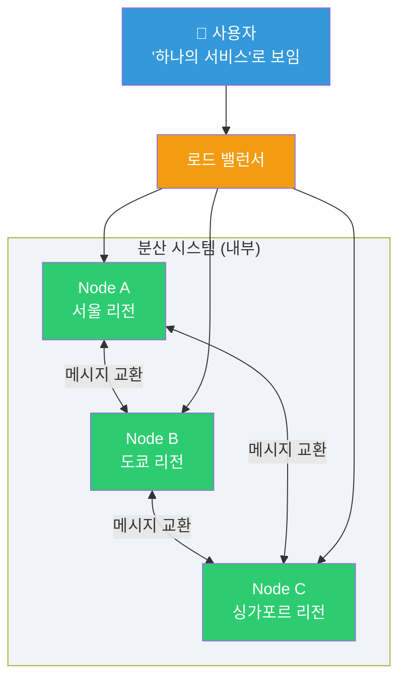
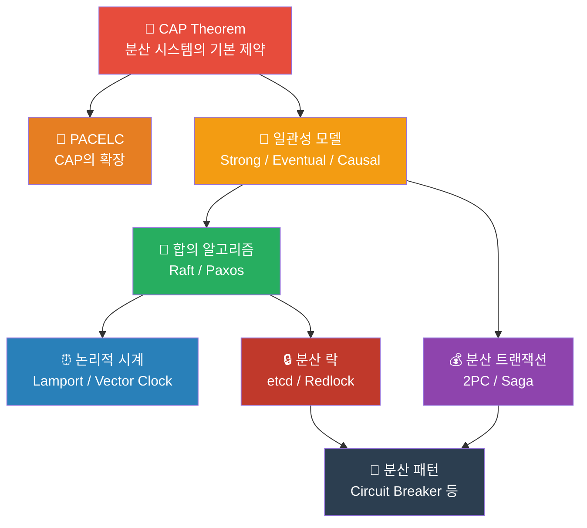
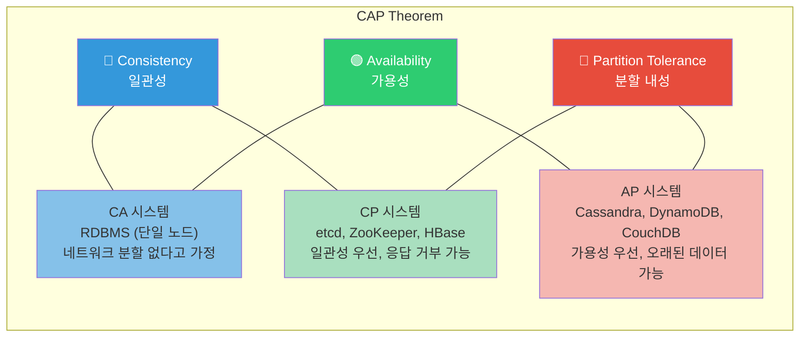
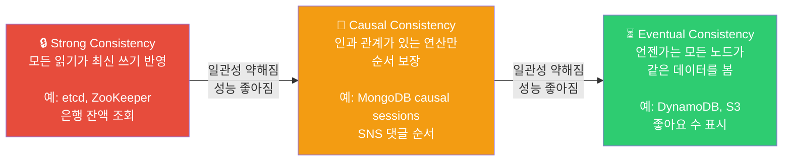
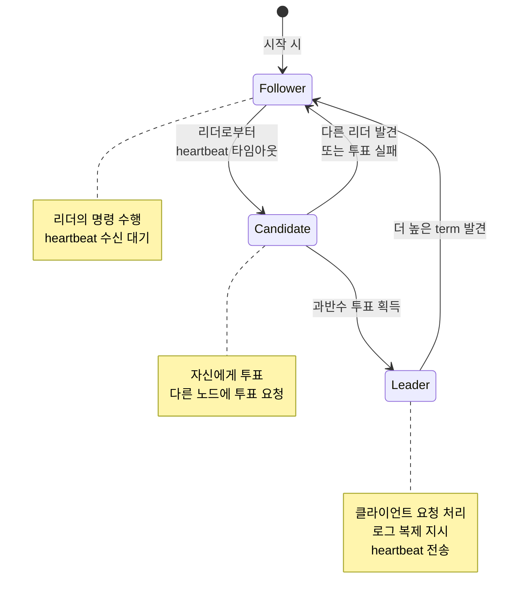
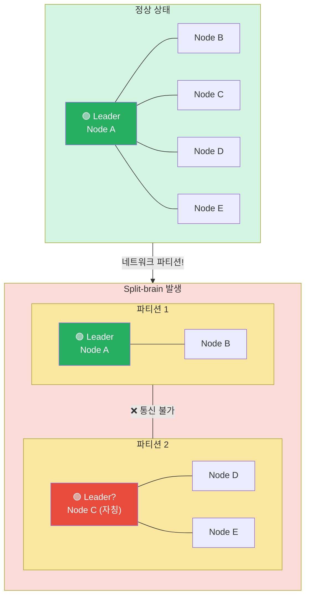
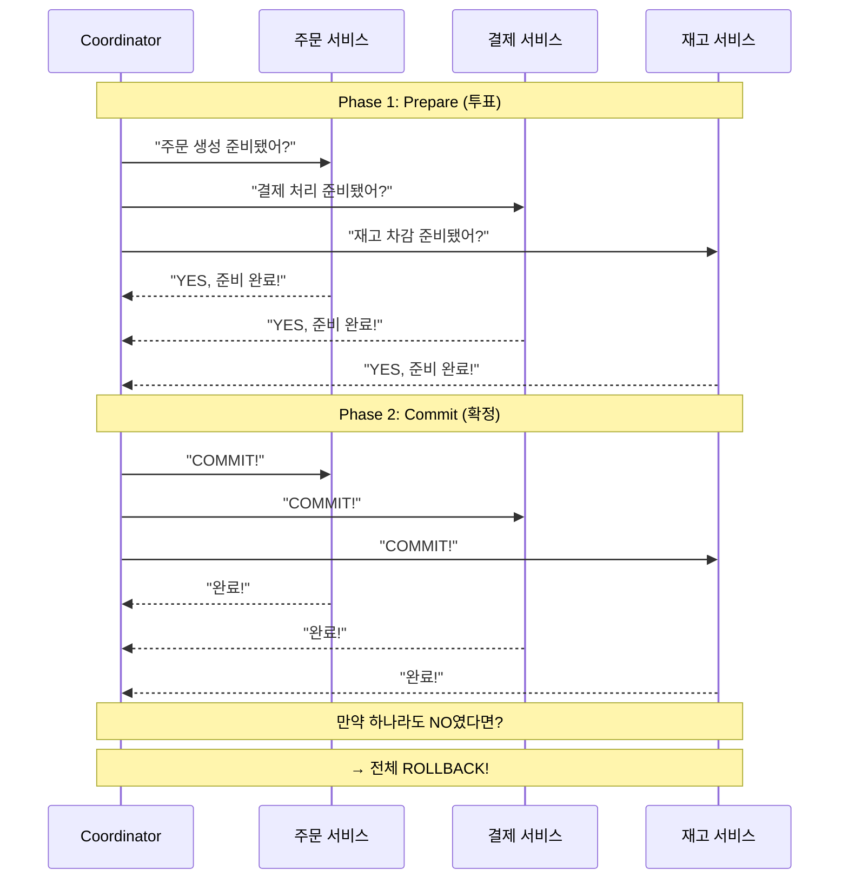
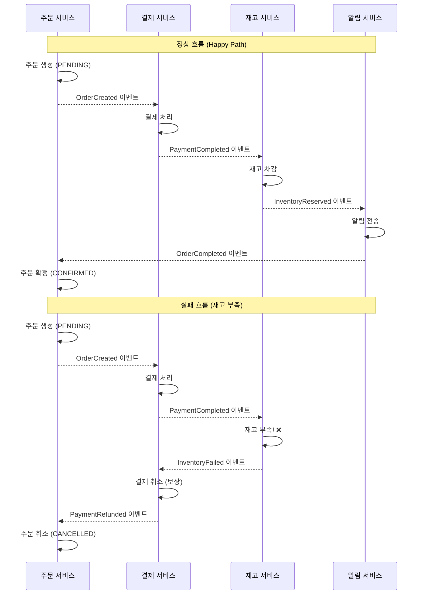
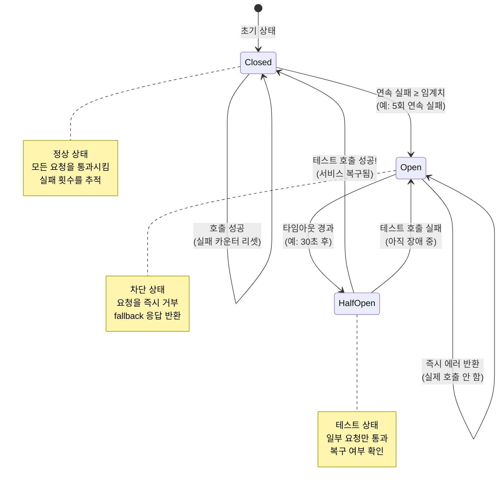

# 분산 시스템 이론

> 하나의 서버로는 한계가 있어요. 여러 서버가 **함께 일하면서도 하나처럼 보이게** 만드는 것, 그게 분산 시스템이에요. 이전에 배운 [데이터베이스 서비스](../05-cloud-aws/05-database)나 [Kubernetes 아키텍처](../04-kubernetes/01-architecture)가 모두 분산 시스템 위에서 돌아가고 있어요.

---

## 🎯 왜 분산 시스템 이론을 알아야 하나요?

DevOps 엔지니어로 일하다 보면 이런 상황을 반드시 마주치게 돼요.

```
"DB에 쓴 데이터가 다른 서버에서 안 읽혀요!"      → Consistency 모델 이해 필요
"etcd 클러스터 노드 하나 죽었는데 괜찮나요?"       → Consensus 알고리즘 이해 필요
"마이크로서비스 간 트랜잭션이 꼬였어요!"           → 분산 트랜잭션 패턴 필요
"두 서버가 서로 자기가 리더라고 주장해요!"          → Split-brain 문제 이해 필요
"서비스 디스커버리가 안 돼서 통신이 끊겼어요!"      → Service Discovery 패턴 필요
```

### 분산 시스템을 모르면 생기는 일

| 상황 | 모르면 | 알면 |
|------|--------|------|
| DB 복제 지연 | "버그인가?" 삽질 | "Eventual Consistency 때문이네" 즉시 파악 |
| etcd 장애 | 패닉, 무작정 재시작 | "과반수(quorum) 살아있으니 괜찮아" |
| 결제 중복 처리 | 고객 돈 두 번 빠져나감 | 멱등성(idempotency) 설계로 방지 |
| 네트워크 파티션 | "네트워크 안 끊기겠지" 낙관 | 파티션은 **반드시** 일어난다고 가정 |

### 일상 비유: 단체 카톡방

분산 시스템을 **단체 카톡방**에 비유해 볼게요.

- **서버** = 카톡방 멤버들
- **데이터** = 공유된 정보 (약속 장소, 시간)
- **네트워크** = 카톡 메시지 전달
- **파티션** = 누군가 지하철 타서 메시지를 못 받는 상태
- **일관성 문제** = "약속 장소 변경됐어!" 메시지를 일부만 받은 상태

> 현실 세계에서도 **모든 사람이 항상 같은 정보를 동시에 가질 수는 없어요.** 분산 시스템도 마찬가지예요.

---

## 🧠 핵심 개념 잡기

### 분산 시스템이란?

네트워크로 연결된 **여러 컴퓨터가 협력**해서 하나의 시스템처럼 동작하는 것이에요. 사용자 입장에서는 하나의 서비스처럼 보이지만, 내부적으로는 여러 노드가 메시지를 주고받으며 일하고 있어요.



### 왜 분산시키나요?

| 이유 | 설명 | 예시 |
|------|------|------|
| **확장성(Scalability)** | 서버 한 대로 감당 안 되는 트래픽 | 초당 100만 요청 처리 |
| **가용성(Availability)** | 서버 하나 죽어도 서비스 유지 | Multi-AZ 배포 |
| **지연시간(Latency)** | 사용자와 가까운 곳에서 응답 | 글로벌 CDN, 리전 분산 |
| **데이터 안전성** | 데이터를 여러 곳에 복제 | DB 복제, 백업 |

### 핵심 이론 로드맵



### 분산 컴퓨팅의 8가지 오류 (Fallacies of Distributed Computing)

분산 시스템을 설계할 때 **절대 하면 안 되는 가정** 8가지가 있어요. 1994년 Sun Microsystems의 Peter Deutsch가 정리한 것으로, 30년이 지난 지금도 여전히 유효해요.

| # | 오류 (잘못된 가정) | 현실 |
|---|-------------------|------|
| 1 | 네트워크는 신뢰할 수 있다 | 패킷은 유실되고, 케이블은 끊어져요 |
| 2 | 지연 시간은 0이다 | 서울-미국 왕복 200ms, 같은 DC 내에서도 0.5ms |
| 3 | 대역폭은 무한하다 | 네트워크 병목은 항상 존재해요 |
| 4 | 네트워크는 안전하다 | Man-in-the-middle, 스니핑 등 위협이 있어요 |
| 5 | 토폴로지는 변하지 않는다 | 노드 추가/제거, 라우팅 변경은 수시로 일어나요 |
| 6 | 관리자는 한 명이다 | 클라우드 환경에서 수많은 팀이 인프라를 공유해요 |
| 7 | 전송 비용은 0이다 | 데이터 전송에는 실제 비용(AWS 전송 요금)이 들어요 |
| 8 | 네트워크는 동질적이다 | 다양한 하드웨어, 프로토콜, 버전이 혼재해요 |

> 이 8가지를 기억하세요: **네트워크는 불안정하고, 느리고, 제한적이고, 위험해요.** 이걸 전제로 설계해야 해요.

---

## 🔍 하나씩 자세히 알아보기

### 1. CAP Theorem (CAP 정리)

2000년 Eric Brewer가 제안한 분산 시스템의 가장 유명한 정리예요.

**분산 시스템은 다음 세 가지를 동시에 모두 만족할 수 없어요:**

| 속성 | 의미 | 비유 |
|------|------|------|
| **C** (Consistency, 일관성) | 모든 노드가 같은 시점에 같은 데이터를 봄 | 모든 사람의 시계가 정확히 같은 시간 |
| **A** (Availability, 가용성) | 모든 요청에 대해 응답을 줌 (에러가 아닌) | 언제든 전화하면 받아줌 |
| **P** (Partition Tolerance, 분할 내성) | 네트워크 분할이 일어나도 동작함 | 전화가 끊겨도 각자 알아서 일함 |



#### 왜 세 가지를 동시에 못 갖나요?

실제 분산 환경에서 **네트워크 파티션(P)은 반드시 일어나요.** 케이블이 끊기고, 스위치가 고장 나고, 클라우드 AZ 간 통신이 끊어지는 일은 피할 수 없어요. 그래서 현실적으로는 **P는 필수**이고, C와 A 중 하나를 선택하게 돼요.

**시나리오: 네트워크 파티션 발생 시**

```
Node A <--X--> Node B    (네트워크 끊김!)

사용자가 Node A에 "잔액 = 1000원" 기록

이때 Node B에 "잔액 조회" 요청이 오면?

선택 1 (CP): "지금 최신 데이터 확인 불가" → 에러 반환 (Consistency 유지)
선택 2 (AP): "마지막으로 알고 있던 잔액 = 500원" → 응답 반환 (Availability 유지)
```

#### AWS 서비스별 CAP 분류

| 서비스 | CAP 선택 | 설명 |
|--------|---------|------|
| **RDS (Single-AZ)** | CA | 단일 노드라 파티션 개념 없음 |
| **DynamoDB** | AP (기본) | Eventual Consistency가 기본, Strong 옵션 있음 |
| **DynamoDB (Strong Read)** | CP | Strongly Consistent Read 사용 시 |
| **ElastiCache (Redis Cluster)** | AP | 복제 지연 허용 |
| **etcd** | CP | Raft 합의로 강한 일관성 보장 |
| **S3** | AP | 강한 일관성을 2020년부터 보장하지만 가용성 우선 설계 |

> 더 자세한 AWS 데이터베이스 서비스 비교는 [데이터베이스 강의](../05-cloud-aws/05-database)를 참고하세요.

---

### 2. PACELC Theorem (PACELC 정리)

CAP만으로는 부족해요. **네트워크가 정상일 때**의 트레이드오프도 중요하거든요.

**PACELC** = "Partition이 있으면 A vs C, Else(정상이면) L(Latency) vs C(Consistency)"

```
if (Partition) {
    choose: Availability or Consistency     // CAP과 동일
} else {
    choose: Latency or Consistency          // 추가된 부분!
}
```

| 시스템 | P 발생 시 | 정상 시 (E) | 설명 |
|--------|----------|------------|------|
| **DynamoDB** | PA | EL | 파티션 시 가용성 우선, 정상 시 낮은 지연 우선 |
| **Cassandra** | PA | EL | 같은 패턴, 빠른 응답이 목표 |
| **etcd / ZooKeeper** | PC | EC | 항상 일관성 우선 (느려도 정확하게) |
| **MongoDB** | PA | EC | 파티션 시 가용성, 정상 시 일관성 |
| **MySQL (Galera)** | PC | EC | 항상 일관성 |

> **핵심**: 네트워크가 정상일 때도 "빠른 응답 vs 정확한 데이터" 사이에서 선택해야 해요.

---

### 3. 일관성 모델 (Consistency Models)

"모든 노드가 같은 데이터를 본다"는 게 어느 정도까지 보장되느냐에 따라 여러 레벨이 있어요.

#### 일관성 스펙트럼



#### Strong Consistency (강한 일관성)

- 쓰기가 완료되면 이후 **모든 읽기가 반드시 그 값을 반환**해요
- 구현 방법: 모든 복제본이 쓰기를 확인(acknowledge)한 뒤에야 성공 반환
- 대가: **느린 응답**, 복제본 하나라도 죽으면 쓰기 불가 가능

```
시간 →→→→→→→→→→→→→→→→

Client A:  WRITE(x=5) ──────────── OK
Client B:                    READ(x) → 5  ✅ 반드시 5
Client C:                         READ(x) → 5  ✅ 반드시 5
```

**사용 사례**: 은행 잔액, 재고 수량, 좌석 예약 등 **숫자 하나가 돈인 곳**

#### Eventual Consistency (최종 일관성)

- 쓰기 후 **일정 시간이 지나면** 모든 노드가 같은 값을 가지게 돼요
- 그 "일정 시간" 동안은 **오래된 데이터를 읽을 수 있어요**
- 대가: **데이터 불일치 허용**, 하지만 성능이 빠름

```
시간 →→→→→→→→→→→→→→→→

Client A:  WRITE(x=5) ─── OK (Primary에만 기록)
Client B:         READ(x) → 3  ❌ 아직 전파 안 됨
Client C:                      READ(x) → 5  ✅ 전파 완료
Client B:                           READ(x) → 5  ✅ 이제 전파됨
```

**사용 사례**: SNS 좋아요 수, 상품 리뷰 수, 로그 집계 등 **약간 오래된 데이터도 괜찮은 곳**

#### Causal Consistency (인과적 일관성)

- **인과 관계가 있는** 연산들은 순서가 보장돼요
- 인과 관계가 없는 연산들은 순서가 다를 수 있어요

```
예시: SNS 게시글과 댓글

Alice: "오늘 날씨 좋다!" (게시글)
Bob:   "맞아 완전 화창해!" (Alice 글에 대한 댓글)

Causal Consistency 보장:
→ 어느 노드에서든 Bob의 댓글은 Alice의 게시글 이후에 보임 ✅

인과 관계 없는 경우:
Alice: "오늘 날씨 좋다!"
Carol: "저녁 뭐 먹지?" (독립적인 게시글)

→ 이 두 글의 순서는 노드마다 다를 수 있음 (괜찮음)
```

**사용 사례**: 소셜 미디어 타임라인, 채팅 메시지, 협업 문서 편집

---

### 4. 합의 알고리즘 (Consensus Algorithms)

분산 시스템에서 여러 노드가 **하나의 값에 합의**하는 방법이에요. "이 데이터의 최신 값은 뭐야?" "지금 리더는 누구야?"와 같은 결정을 내려야 하거든요.

#### 왜 합의가 어려운가요?

```
상황: 3개 노드가 "다음 리더"를 정해야 해요

Node A: "내가 리더 할게!"
Node B: "내가 리더 할게!" (동시에 발언)
Node C: "Node A 메시지가 먼저 도착했으니 A한테 투표할게"

그런데... Node B와 C 사이 네트워크가 끊기면?
Node B는 자기가 리더라고 생각하고,
Node A와 C는 A가 리더라고 생각해요.

→ 이것이 바로 Split-brain 문제예요!
```

#### Raft 합의 알고리즘 (이해하기 쉬운 버전)

etcd, Consul 등에서 사용하는 알고리즘이에요. Paxos보다 이해하기 쉽게 설계됐어요.

**핵심 개념 3가지**:

1. **Leader Election (리더 선출)**: 한 번에 하나의 리더만 존재
2. **Log Replication (로그 복제)**: 리더가 모든 변경사항을 팔로워에게 전파
3. **Safety (안전성)**: 한 번 커밋된 데이터는 절대 사라지지 않음

**노드의 3가지 상태**:



**Raft 동작 흐름 (5-노드 클러스터)**:

```
정상 상태:
┌──────────┐     heartbeat     ┌──────────┐
│  Leader   │ ────────────────→ │ Follower │
│  Node A   │ ────────────────→ │ Node B   │
│  (term=3) │ ────────────────→ │ Node C   │
│           │ ────────────────→ │ Node D   │
│           │ ────────────────→ │ Node E   │
└──────────┘                    └──────────┘

리더 장애 발생:
┌──────────┐                    ┌──────────┐
│  Leader   │ ──── ✕ ────────→ │ Follower │
│  Node A   │   (장애!)        │ Node B   │  ← heartbeat 타임아웃!
│  (dead)   │                   │ Node C   │  ← "선거 시작!"
│           │                   │ Node D   │
│           │                   │ Node E   │
└──────────┘                    └──────────┘

선거 과정:
Node C: "나를 term=4의 리더로 투표해 주세요!"
Node B: "OK, 투표!" ✅
Node D: "OK, 투표!" ✅  → 과반수(3/5) 달성!
Node E: "OK, 투표!" ✅

결과: Node C가 새로운 리더 (term=4)
```

**Quorum (정족수)**:

```
N개 노드 중 과반수 = floor(N/2) + 1

3-노드 클러스터: 최소 2개 동의 필요 → 1개까지 장애 허용
5-노드 클러스터: 최소 3개 동의 필요 → 2개까지 장애 허용
7-노드 클러스터: 최소 4개 동의 필요 → 3개까지 장애 허용
```

> **실무 팁**: etcd는 보통 3 또는 5노드로 구성해요. 짝수는 피하세요! 4-노드 클러스터는 3-노드와 장애 허용 수가 같아요 (둘 다 1개). Kubernetes의 etcd도 이 Raft를 사용해요 - [Kubernetes 아키텍처](../04-kubernetes/01-architecture)를 참고하세요.

#### Paxos 알고리즘 (개념만 간단히)

Leslie Lamport이 1989년에 제안한 최초의 실용적 합의 알고리즘이에요. Raft의 아버지 격이지만, **이해하기 매우 어렵기로 유명**해요.

**핵심 역할 3가지**:
- **Proposer**: 값을 제안하는 역할
- **Acceptor**: 제안을 받아들이거나 거부하는 역할
- **Learner**: 합의된 결과를 학습하는 역할

**2단계 프로토콜**:

```
Phase 1: Prepare (준비)
  Proposer → Acceptor: "제안 번호 N으로 준비해 주세요"
  Acceptor → Proposer: "OK, 이전에 수락한 값은 이거예요" (또는 없음)

Phase 2: Accept (수락)
  Proposer → Acceptor: "그러면 이 값으로 결정합시다"
  Acceptor → Proposer: "수락!" (과반수가 수락하면 합의 완료)
```

> **Raft vs Paxos**: Raft는 "이해하기 쉬운 Paxos"를 목표로 만들어졌어요. 실무에서는 대부분 Raft 기반 시스템(etcd, Consul)을 사용해요. Paxos는 Google Chubby, Spanner 같은 시스템에서 사용돼요.

---

### 5. Leader Election (리더 선출)

분산 시스템에서 **하나의 노드를 리더로 선출**하는 패턴이에요. 리더는 쓰기 요청을 받고, 팔로워에게 복제하는 역할을 해요.

#### 리더 선출이 필요한 이유

```
리더 없이 모든 노드가 쓰기를 받으면:

Node A: "재고 = 1개, 주문 처리!" → 재고 = 0
Node B: "재고 = 1개, 주문 처리!" → 재고 = 0  (동시에!)

결과: 재고 1개인데 2개 주문이 처리됨 😱

리더가 있으면:
모든 쓰기 → Leader만 처리 → 순서대로 실행 → 충돌 없음 ✅
```

#### 리더 선출 구현 도구

| 도구 | 방식 | 특징 |
|------|------|------|
| **etcd** | Raft | K8s control plane에서 사용, 강한 일관성 |
| **ZooKeeper** | ZAB (Paxos 변형) | Kafka, Hadoop 등에서 사용 |
| **Consul** | Raft | Service Discovery + KV Store |
| **Redis (Redlock)** | 분산 락 기반 | 간단하지만 약한 보장 |

---

### 6. Split-brain 문제

네트워크 파티션으로 인해 **두 그룹이 각각 자기가 "정상"이라고 생각**하는 상태예요. 가장 위험한 분산 시스템 문제 중 하나예요.



#### Split-brain 방지 전략

| 전략 | 설명 | 도구 예시 |
|------|------|----------|
| **Quorum 기반** | 과반수 파티션만 작동 | etcd, ZooKeeper |
| **Fencing Token** | 이전 리더의 쓰기를 거부하는 토큰 | etcd lease |
| **STONITH** | 의심스러운 노드를 강제 종료 | Pacemaker (Linux HA) |
| **Epoch/Term 번호** | 새 리더마다 번호 증가, 옛 리더 무시 | Raft term, ZK epoch |

```
Quorum 방지 예시 (5-노드):

파티션 1: [A, B]       → 2/5 = 과반수 X → 서비스 중단 (스스로 강등)
파티션 2: [C, D, E]    → 3/5 = 과반수 ✅ → 새 리더 선출, 정상 운영

→ 두 개의 리더가 동시에 존재하는 일이 없어요!
```

---

### 7. 시계 동기화 (Clock Synchronization)

분산 시스템에서 **"이 이벤트가 먼저 일어났는가?"를 판단하는 건 매우 어려운 문제**예요. 각 서버의 물리적 시계는 미세하게 달라요 (clock drift).

#### 물리적 시계의 한계

```
Server A의 시계: 10:00:00.000
Server B의 시계: 10:00:00.150  (150ms 차이!)

Server A에서 10:00:00.100에 주문 생성
Server B에서 10:00:00.050에 주문 취소

물리적 시간으로 보면: 생성이 먼저
Server B의 시계로 보면: 취소가 먼저

→ 누가 맞는 거예요? 😱
```

#### Lamport Clock (람포트 시계)

Leslie Lamport이 1978년에 제안한 **논리적 시계**예요. 물리적 시간 대신 **이벤트의 순서**만 추적해요.

**규칙**:
1. 각 프로세스는 자신의 카운터를 가짐 (초기값 0)
2. 이벤트가 발생할 때마다 카운터 +1
3. 메시지를 보낼 때 자신의 카운터를 함께 보냄
4. 메시지를 받으면: max(내 카운터, 받은 카운터) + 1

```
Process A:  [1] ─── send(1) ──→  [2] ──────────── [3]
Process B:  [1] ──── [2] ── receive → [3] ── send(3) ──→ [4]
Process C:  [1] ───────────── [2] ───── receive → [4] ── [5]

→ Lamport Clock은 "A → B이면 LC(A) < LC(B)"를 보장
→ 하지만 "LC(A) < LC(B)라고 해서 A → B"는 아닐 수 있음 (동시 이벤트)
```

#### Vector Clock (벡터 시계)

Lamport Clock의 한계를 보완해요. **어떤 이벤트들이 동시에(concurrent) 일어났는지** 구분할 수 있어요.

**규칙**: 각 프로세스가 **모든 프로세스의 카운터를 벡터로** 관리

```
3개 프로세스 (A, B, C):

A의 벡터: [A의카운터, B의카운터, C의카운터]

A: [1,0,0] → send → [2,0,0]
B: receive → [2,1,0] → [2,2,0] → send → [2,3,0]
C: [0,0,1] → receive → [2,3,2]

비교:
[2,3,0] vs [0,0,1] → 어느 쪽이 크다고 할 수 없음 → 동시 이벤트!
[2,3,0] vs [2,3,2] → [2,3,0] < [2,3,2] → 순서 관계 있음
```

> **실무에서의 활용**: DynamoDB는 내부적으로 Vector Clock과 유사한 메커니즘을 사용해서 충돌을 감지해요. 애플리케이션에서 직접 구현할 일은 드물지만, **"왜 데이터 충돌이 발생하는지"** 이해하는 데 필수적인 개념이에요.

---

### 8. 분산 락 (Distributed Locks)

여러 프로세스(서버)가 **동시에 같은 자원에 접근하지 못하도록** 하는 메커니즘이에요.

#### 언제 필요한가요?

```
상황: 쿠폰 재고 1개 남음

서버 A: "재고 확인 → 1개 있음 → 쿠폰 발급!"
서버 B: "재고 확인 → 1개 있음 → 쿠폰 발급!"  (거의 동시)

결과: 쿠폰 2장 발급됨 💀 (재고는 1개였는데)

분산 락 사용 시:
서버 A: 락 획득 → 재고 확인 → 발급 → 락 해제
서버 B: 락 획득 시도 → 대기... → 재고 확인 → 0개 → 발급 거부 ✅
```

#### etcd 기반 분산 락

```bash
# etcd의 lease와 lock 메커니즘

# 1. Lease 생성 (TTL = 10초, 자동 만료로 데드락 방지)
etcdctl lease grant 10
# lease 694d8257012ce034 granted with TTL(10s)

# 2. 락 획득 (lease에 연결)
etcdctl lock /my-resource --lease=694d8257012ce034
# /my-resource/694d8257012ce034

# 3. 작업 수행...

# 4. 락 해제 (키 삭제 또는 lease 만료)
etcdctl lease revoke 694d8257012ce034
```

#### Redis Redlock 알고리즘

Martin Kleppmann과 Redis 개발자 Salvatore Sanfilippo 사이에 유명한 논쟁이 있었던 알고리즘이에요.

**기본 원리**:
1. N개의 **독립적인** Redis 인스턴스 사용 (보통 5개)
2. 클라이언트가 모든 인스턴스에 **동시에** 락 요청
3. **과반수(N/2 + 1)**에서 락을 획득하면 성공
4. TTL 내에 과반수를 못 얻으면 모든 인스턴스의 락 해제

```python
import redis
import time
import uuid

class SimpleRedlock:
    def __init__(self, redis_instances):
        self.instances = redis_instances  # 5개의 독립적 Redis
        self.quorum = len(redis_instances) // 2 + 1  # 과반수 = 3

    def acquire(self, resource, ttl_ms=10000):
        lock_value = str(uuid.uuid4())
        acquired = 0
        start_time = time.time()

        for instance in self.instances:
            try:
                # SET resource lock_value NX PX ttl
                if instance.set(resource, lock_value, nx=True, px=ttl_ms):
                    acquired += 1
            except redis.RedisError:
                pass  # 인스턴스 장애 시 건너뜀

        # 과반수 획득 + 소요 시간이 TTL 이내인지 확인
        elapsed = (time.time() - start_time) * 1000
        if acquired >= self.quorum and elapsed < ttl_ms:
            return lock_value  # 락 획득 성공!
        else:
            self.release(resource, lock_value)  # 실패 시 정리
            return None

    def release(self, resource, lock_value):
        """자신이 획득한 락만 해제 (lock_value 확인)"""
        for instance in self.instances:
            try:
                # Lua script로 atomic하게 확인 후 삭제
                script = """
                if redis.call("get", KEYS[1]) == ARGV[1] then
                    return redis.call("del", KEYS[1])
                end
                return 0
                """
                instance.eval(script, 1, resource, lock_value)
            except redis.RedisError:
                pass
```

> **주의**: Redlock은 **"정확성이 중요한 곳"에서 사용하면 안 된다**는 주장도 있어요 (Martin Kleppmann의 "How to do distributed locking" 참고). 정확성이 최우선이면 etcd나 ZooKeeper 기반 락을 사용하세요.

---

### 9. 분산 트랜잭션 (Distributed Transactions)

여러 서비스에 걸친 작업을 **원자적으로(all or nothing)** 처리하는 방법이에요.

#### 2PC (Two-Phase Commit)

전통적인 분산 트랜잭션 프로토콜이에요. **Coordinator(조정자)**가 모든 참여자를 관리해요.



**2PC의 문제점**:

| 문제 | 설명 |
|------|------|
| **블로킹** | Coordinator 장애 시 모든 참여자가 멈춤 |
| **성능** | 모든 참여자가 응답할 때까지 대기 (느림) |
| **단일 장애점** | Coordinator가 SPOF (Single Point of Failure) |
| **락 점유** | Prepare~Commit 사이에 리소스 락을 계속 잡고 있음 |

#### Saga 패턴 (마이크로서비스 추천)

2PC의 단점을 보완하기 위해 나온 패턴이에요. **각 서비스가 로컬 트랜잭션을 실행**하고, 실패 시 **보상 트랜잭션(compensation)**으로 되돌려요.

**Choreography (이벤트 기반) 방식**:



**Saga 패턴 비교**:

| 방식 | 장점 | 단점 |
|------|------|------|
| **Choreography** (이벤트) | 느슨한 결합, 간단한 구조 | 흐름 추적 어려움, 순환 위험 |
| **Orchestration** (중앙 조정) | 흐름이 명확, 관리 용이 | 조정자에 로직 집중, 복잡도 |

> **실무 권장**: 서비스 3~4개까지는 Choreography, 그 이상이면 Orchestration을 고려하세요. AWS에서는 Step Functions이 Orchestration 방식의 Saga를 구현하는 좋은 도구예요.

---

### 10. Service Discovery (서비스 디스커버리)

마이크로서비스 환경에서 **"이 서비스가 어디에 있어?"를 동적으로 알아내는** 방법이에요. IP 주소가 수시로 바뀌는 컨테이너 환경에서 특히 중요해요.

#### 왜 필요한가요?

```
모놀리스:
  모든 기능이 한 서버에 → 내부 함수 호출 → IP 불필요

마이크로서비스:
  주문 서비스 → 결제 서비스 호출이 필요
  결제 서비스 IP는? → 172.17.0.5... 아 방금 재배포돼서 172.17.0.12로 바뀜 💀
```

#### Service Discovery 패턴

| 패턴 | 설명 | 도구 |
|------|------|------|
| **Client-side Discovery** | 클라이언트가 레지스트리에 질의 후 직접 접속 | Eureka, Consul |
| **Server-side Discovery** | 로드밸런서가 레지스트리 확인 후 라우팅 | AWS ALB, K8s Service |
| **DNS 기반** | DNS로 서비스 IP 조회 | CoreDNS (K8s), Route53 |
| **Service Mesh** | 사이드카 프록시가 알아서 라우팅 | Istio, Linkerd |

```
Client-side Discovery:

┌────────┐  1. "결제 서비스 어디야?"  ┌──────────────┐
│ 주문   │ ──────────────────────→ │ Service      │
│ 서비스 │ ←────────────────────── │ Registry     │
│        │  2. "172.17.0.12:8080"  │ (Consul/etcd)│
│        │                         └──────────────┘
│        │  3. 직접 요청
│        │ ────────────────────────→ 결제 서비스 (172.17.0.12)
└────────┘
```

> [Kubernetes Service와 Ingress](../04-kubernetes/05-service-ingress)는 Server-side Discovery 패턴의 대표적인 구현이에요. [Service Mesh](../04-kubernetes/18-service-mesh)도 함께 참고하세요.

---

### 11. Circuit Breaker 패턴

**연쇄 장애(cascading failure)를 방지**하는 패턴이에요. 전기 회로의 차단기에서 이름을 따왔어요.

#### 왜 필요한가요?

```
결제 서비스가 응답을 안 해요 (3초 타임아웃)

Circuit Breaker 없이:
  주문 서비스 → 결제 호출 → 3초 대기 → 타임아웃
  주문 서비스 → 결제 호출 → 3초 대기 → 타임아웃
  주문 서비스 → 결제 호출 → 3초 대기 → 타임아웃
  ... (스레드 풀 고갈 → 주문 서비스도 죽음 → 연쇄 장애)

Circuit Breaker 있으면:
  주문 서비스 → 결제 호출 → 실패 (1회)
  주문 서비스 → 결제 호출 → 실패 (2회)
  주문 서비스 → 결제 호출 → 실패 (3회, 임계치 도달!)
  → Circuit OPEN! 즉시 에러 반환 (대기 없음)
  → 주문 서비스는 살아있음, 대체 로직 실행 가능
```

#### Circuit Breaker 상태 전이



#### 구현 예시 (Python)

```python
import time
from enum import Enum
from functools import wraps

class CircuitState(Enum):
    CLOSED = "closed"        # 정상 - 요청 통과
    OPEN = "open"            # 차단 - 즉시 에러
    HALF_OPEN = "half_open"  # 테스트 - 일부만 통과

class CircuitBreaker:
    def __init__(self, failure_threshold=5, recovery_timeout=30):
        self.failure_threshold = failure_threshold
        self.recovery_timeout = recovery_timeout
        self.state = CircuitState.CLOSED
        self.failure_count = 0
        self.last_failure_time = None

    def call(self, func, *args, **kwargs):
        if self.state == CircuitState.OPEN:
            if self._should_try_recovery():
                self.state = CircuitState.HALF_OPEN
            else:
                raise CircuitOpenError("Circuit is OPEN - 서비스 호출 차단됨")

        try:
            result = func(*args, **kwargs)
            self._on_success()
            return result
        except Exception as e:
            self._on_failure()
            raise e

    def _on_success(self):
        self.failure_count = 0
        self.state = CircuitState.CLOSED

    def _on_failure(self):
        self.failure_count += 1
        self.last_failure_time = time.time()
        if self.failure_count >= self.failure_threshold:
            self.state = CircuitState.OPEN

    def _should_try_recovery(self):
        return (time.time() - self.last_failure_time) > self.recovery_timeout


class CircuitOpenError(Exception):
    pass


# 사용 예시
cb = CircuitBreaker(failure_threshold=3, recovery_timeout=10)

def call_payment_service(order_id):
    try:
        result = cb.call(payment_api.process, order_id)
        return result
    except CircuitOpenError:
        # fallback: 결제 보류 후 나중에 재시도
        return {"status": "PENDING", "message": "결제 서비스 일시 불가, 보류 처리됨"}
```

> **실무 도구**: Spring Cloud의 Resilience4j, Netflix의 Hystrix(deprecated), Envoy proxy의 outlier detection 등이 있어요. Kubernetes에서는 [Service Mesh](../04-kubernetes/18-service-mesh)의 Istio가 Circuit Breaker를 인프라 레벨에서 제공해요.

---

## 💻 직접 해보기

### 실습 1: etcd 클러스터로 Raft 합의 관찰하기

```bash
# Docker Compose로 3-노드 etcd 클러스터 구성
cat << 'EOF' > docker-compose-etcd.yaml
version: '3.8'
services:
  etcd1:
    image: quay.io/coreos/etcd:v3.5.9
    container_name: etcd1
    command:
      - etcd
      - --name=etcd1
      - --initial-advertise-peer-urls=http://etcd1:2380
      - --listen-peer-urls=http://0.0.0.0:2380
      - --listen-client-urls=http://0.0.0.0:2379
      - --advertise-client-urls=http://etcd1:2379
      - --initial-cluster=etcd1=http://etcd1:2380,etcd2=http://etcd2:2380,etcd3=http://etcd3:2380
      - --initial-cluster-state=new
    ports:
      - "2379:2379"

  etcd2:
    image: quay.io/coreos/etcd:v3.5.9
    container_name: etcd2
    command:
      - etcd
      - --name=etcd2
      - --initial-advertise-peer-urls=http://etcd2:2380
      - --listen-peer-urls=http://0.0.0.0:2380
      - --listen-client-urls=http://0.0.0.0:2379
      - --advertise-client-urls=http://etcd2:2379
      - --initial-cluster=etcd1=http://etcd1:2380,etcd2=http://etcd2:2380,etcd3=http://etcd3:2380
      - --initial-cluster-state=new
    ports:
      - "2381:2379"

  etcd3:
    image: quay.io/coreos/etcd:v3.5.9
    container_name: etcd3
    command:
      - etcd
      - --name=etcd3
      - --initial-advertise-peer-urls=http://etcd3:2380
      - --listen-peer-urls=http://0.0.0.0:2380
      - --listen-client-urls=http://0.0.0.0:2379
      - --advertise-client-urls=http://etcd3:2379
      - --initial-cluster=etcd1=http://etcd1:2380,etcd2=http://etcd2:2380,etcd3=http://etcd3:2380
      - --initial-cluster-state=new
    ports:
      - "2383:2379"

networks:
  default:
    name: etcd-net
EOF

# 클러스터 시작
docker compose -f docker-compose-etcd.yaml up -d

# 클러스터 상태 확인 - 누가 리더인지 확인
docker exec etcd1 etcdctl endpoint status --cluster -w table

# 데이터 쓰기
docker exec etcd1 etcdctl put /app/config "hello distributed world"

# 다른 노드에서 읽기 (복제 확인)
docker exec etcd2 etcdctl get /app/config
docker exec etcd3 etcdctl get /app/config

# 리더 노드 강제 종료해서 Leader Election 관찰
# (먼저 리더가 누구인지 확인 후 해당 노드 중지)
docker stop etcd1

# 새 리더 선출 확인 (몇 초 내에 자동 선출)
docker exec etcd2 etcdctl endpoint status --cluster -w table

# 데이터 정합성 확인 (리더가 바뀌어도 데이터 유지)
docker exec etcd2 etcdctl get /app/config

# etcd1 복구
docker start etcd1
sleep 3
docker exec etcd1 etcdctl endpoint status --cluster -w table

# 정리
docker compose -f docker-compose-etcd.yaml down
```

### 실습 2: Redis로 분산 락 체험하기

```bash
# Redis 시작
docker run -d --name redis-lock -p 6379:6379 redis:7

# 터미널 1: 락 획득
docker exec -it redis-lock redis-cli
> SET mylock "worker-1" NX EX 10
# OK  (락 획득 성공!)

# 터미널 2: 동시에 락 획득 시도
docker exec -it redis-lock redis-cli
> SET mylock "worker-2" NX EX 10
# (nil)  (실패! 이미 worker-1이 가지고 있음)

# 터미널 1에서 10초 후 (TTL 만료) 또는 수동 해제
> DEL mylock
# (integer) 1

# 이제 터미널 2에서 다시 시도
> SET mylock "worker-2" NX EX 10
# OK  (이제 성공!)

# 정리
docker stop redis-lock && docker rm redis-lock
```

### 실습 3: Consul로 Service Discovery 체험하기

```bash
# Consul 에이전트 시작 (dev 모드)
docker run -d --name consul -p 8500:8500 -p 8600:8600/udp \
  hashicorp/consul:1.16 agent -dev -client=0.0.0.0

# 서비스 등록
curl -X PUT http://localhost:8500/v1/agent/service/register \
  -H 'Content-Type: application/json' \
  -d '{
    "ID": "payment-1",
    "Name": "payment",
    "Address": "172.17.0.5",
    "Port": 8080,
    "Check": {
      "HTTP": "http://172.17.0.5:8080/health",
      "Interval": "10s"
    }
  }'

# 두 번째 인스턴스 등록
curl -X PUT http://localhost:8500/v1/agent/service/register \
  -H 'Content-Type: application/json' \
  -d '{
    "ID": "payment-2",
    "Name": "payment",
    "Address": "172.17.0.6",
    "Port": 8080,
    "Check": {
      "HTTP": "http://172.17.0.6:8080/health",
      "Interval": "10s"
    }
  }'

# 서비스 조회 (Service Discovery!)
curl -s http://localhost:8500/v1/catalog/service/payment | python -m json.tool

# DNS로도 조회 가능
dig @127.0.0.1 -p 8600 payment.service.consul SRV

# UI 확인: http://localhost:8500/ui

# 정리
docker stop consul && docker rm consul
```

### 실습 4: Circuit Breaker 동작 확인 (Python)

```python
# circuit_breaker_demo.py
import time
import random

class CircuitBreaker:
    """간단한 Circuit Breaker 데모"""
    def __init__(self, name, failure_threshold=3, recovery_timeout=5):
        self.name = name
        self.failure_threshold = failure_threshold
        self.recovery_timeout = recovery_timeout
        self.state = "CLOSED"
        self.failure_count = 0
        self.last_failure_time = 0

    def execute(self, func):
        if self.state == "OPEN":
            elapsed = time.time() - self.last_failure_time
            if elapsed > self.recovery_timeout:
                print(f"  [{self.name}] HALF_OPEN: {self.recovery_timeout}초 경과, 테스트 호출 시도...")
                self.state = "HALF_OPEN"
            else:
                remaining = self.recovery_timeout - elapsed
                print(f"  [{self.name}] OPEN: 호출 차단! ({remaining:.1f}초 후 재시도)")
                return None

        try:
            result = func()
            if self.state == "HALF_OPEN":
                print(f"  [{self.name}] 복구 확인! CLOSED로 전환")
            self.state = "CLOSED"
            self.failure_count = 0
            return result
        except Exception as e:
            self.failure_count += 1
            self.last_failure_time = time.time()
            print(f"  [{self.name}] 실패 {self.failure_count}/{self.failure_threshold}: {e}")
            if self.failure_count >= self.failure_threshold:
                self.state = "OPEN"
                print(f"  [{self.name}] ⚡ OPEN으로 전환! (연속 {self.failure_count}회 실패)")
            return None


# 시뮬레이션
def unreliable_service():
    """70% 확률로 실패하는 서비스"""
    if random.random() < 0.7:
        raise ConnectionError("서비스 응답 없음")
    return {"status": "ok", "data": "payment processed"}

cb = CircuitBreaker("결제서비스", failure_threshold=3, recovery_timeout=5)

print("=== Circuit Breaker 데모 ===\n")
for i in range(20):
    print(f"\n[요청 #{i+1}] 상태: {cb.state}")
    result = cb.execute(unreliable_service)
    if result:
        print(f"  성공! {result}")
    time.sleep(1)
```

```bash
# 실행
python circuit_breaker_demo.py
```

---

## 🏢 실무에서는?

### 실무 기술 선택 가이드

| 상황 | 추천 기술 | 이유 |
|------|----------|------|
| K8s 클러스터 상태 관리 | **etcd** (Raft) | K8s 기본 내장, 강한 일관성 |
| 마이크로서비스 Config | **Consul** 또는 **etcd** | KV Store + Service Discovery |
| 분산 캐시 락 | **Redis + Redlock** | 빠르고 구현 간단 |
| 정확한 분산 락 | **etcd lease** 또는 **ZooKeeper** | Fencing token 지원 |
| 분산 트랜잭션 | **Saga + 이벤트** | 2PC는 마이크로서비스에 부적합 |
| Service Discovery | **K8s Service** 또는 **Consul** | K8s 환경이면 내장 기능 활용 |
| 연쇄 장애 방지 | **Circuit Breaker** (Istio/Resilience4j) | Service Mesh면 인프라 레벨 |

### 실제 장애 사례에서 배우기

#### 사례 1: GitHub (2012) - Split-brain

```
무슨 일이?
- MySQL 주-부 구조에서 네트워크 장애
- 두 노드가 모두 자신이 Primary라고 판단
- 양쪽에서 동시에 쓰기 발생 → 데이터 불일치

원인:
- 자동 Failover 도구의 Split-brain 방지 미비

교훈:
- Quorum 기반 합의 없이 자동 Failover 위험
- Fencing mechanism 필수
```

#### 사례 2: Amazon DynamoDB (설계 철학)

```
DynamoDB의 선택:
- 기본: Eventual Consistency (AP)
- 옵션: Strongly Consistent Read (CP, 2배 비용)

이유:
- 쇼핑카트: "잠깐 이전 상태를 봐도 괜찮아" (Eventual)
- 결제 잔액: "반드시 최신이어야 해" (Strong)

→ 같은 DB에서 읽기 모드를 요청별로 선택 가능!
```

#### 사례 3: Netflix의 Circuit Breaker

```
Netflix 아키텍처:
- 수백 개의 마이크로서비스
- 하나가 느려지면 전체가 죽을 수 있음

Hystrix 도입 결과:
- 장애 서비스 자동 격리
- fallback으로 캐시된 데이터 또는 기본값 반환
- 예: 추천 서비스 장애 → 인기순으로 대체 표시

→ 현재는 Hystrix가 deprecated되고 Resilience4j로 전환
→ 또는 Istio 같은 Service Mesh로 인프라 레벨 처리
```

### 규모별 적용 전략

```
스타트업 (서버 1~5대):
├─ 분산 시스템 불필요할 수 있음
├─ RDS Multi-AZ 정도로 충분
└─ 오버엔지니어링 주의!

성장기 (서버 10~50대):
├─ K8s + etcd (Service Discovery + 상태 관리)
├─ Redis (캐시 + 간단한 분산 락)
├─ 이벤트 기반 비동기 통신 시작
└─ Circuit Breaker 도입 고려

대규모 (서버 100대+):
├─ Consul/etcd 전용 클러스터
├─ Service Mesh (Istio/Linkerd)
├─ Saga 패턴 본격 도입
├─ 분산 트레이싱 (Jaeger/Zipkin) 필수
└─ Chaos Engineering으로 장애 대응 훈련
```

---

## ⚠️ 자주 하는 실수

### 실수 1: "네트워크는 안 끊어지겠지"

```
❌ 잘못된 가정:
  "같은 데이터센터 안이니까 네트워크 파티션은 안 일어나"
  → 스위치 고장, 케이블 단선, NIC 장애, 라우팅 오류...

✅ 올바른 접근:
  "네트워크 파티션은 반드시 일어난다" 전제로 설계
  → timeout, retry, circuit breaker, fallback 모두 준비
```

### 실수 2: 분산 락 해제 안 함 (데드락)

```
❌ 이렇게 하면 안 돼요:
  lock = redis.set("mylock", "1", nx=True)
  process_order()  # 여기서 예외 발생!
  redis.delete("mylock")  # 실행 안 됨 → 영원히 잠김

✅ TTL + try/finally:
  lock = redis.set("mylock", "1", nx=True, ex=10)  # 10초 TTL
  try:
      process_order()
  finally:
      redis.delete("mylock")  # 반드시 해제
```

### 실수 3: etcd 클러스터를 짝수로 구성

```
❌ 4-노드 etcd:
  Quorum = 3 → 장애 허용 = 1대
  비용은 4대지만 3-노드와 장애 허용 수가 같음

✅ 홀수로 구성:
  3-노드: Quorum 2, 장애 허용 1대
  5-노드: Quorum 3, 장애 허용 2대
  7-노드: Quorum 4, 장애 허용 3대 (보통 여기까지)
```

### 실수 4: 모든 곳에 Strong Consistency

```
❌ 과도한 일관성:
  "좋아요 수"를 Strong Consistency로 → 성능 저하, 비용 증가
  DynamoDB Strongly Consistent Read = 비용 2배!

✅ 요구사항에 맞는 선택:
  은행 잔액     → Strong Consistency (필수)
  좋아요 수     → Eventual Consistency (OK)
  장바구니 목록  → Eventual Consistency (OK)
  재고 수량     → Strong Consistency (중요)
```

### 실수 5: 2PC를 마이크로서비스에 적용

```
❌ 마이크로서비스 + 2PC:
  - 서비스 간 강한 결합 발생
  - Coordinator가 SPOF
  - 성능 병목 (모든 서비스가 동시에 응답해야 함)
  - 서비스 독립 배포 불가능

✅ 마이크로서비스에는 Saga 패턴:
  - 각 서비스가 로컬 트랜잭션만 실행
  - 실패 시 보상 트랜잭션으로 되돌림
  - 서비스 간 느슨한 결합 유지
  - 이벤트 기반으로 비동기 처리
```

### 실수 6: Retry 폭풍 (Retry Storm)

```
❌ 단순 재시도:
  실패 → 즉시 재시도 → 실패 → 즉시 재시도 → ...
  100개 클라이언트 × 무한 재시도 = 서버에 폭탄

✅ Exponential Backoff + Jitter:
  1차 재시도: 1초 후 + 랜덤(0~500ms)
  2차 재시도: 2초 후 + 랜덤(0~500ms)
  3차 재시도: 4초 후 + 랜덤(0~500ms)
  최대 재시도 횟수 제한 (예: 5회)

  Jitter가 핵심! → 클라이언트들이 동시에 재시도하는 것을 방지
```

### 실수 7: Split-brain 대비 없이 자동 Failover

```
❌ 위험한 자동 Failover:
  Primary 응답 없음 → 바로 Secondary를 Primary로 승격
  → 실은 네트워크만 잠깐 끊겼던 거라면?
  → 두 개의 Primary (Split-brain) 발생!

✅ 안전한 Failover:
  1. Quorum 확인 (과반수 노드가 Primary 장애에 동의)
  2. Fencing (이전 Primary의 쓰기 권한 제거)
  3. 새 Primary 승격
  4. Epoch/Term 번호 증가
```

---

## 📝 마무리

### 핵심 요약표

| 개념 | 한 줄 요약 | 핵심 키워드 |
|------|-----------|------------|
| **CAP Theorem** | C, A, P 중 최대 2가지만 보장 가능 | P는 필수, C vs A 선택 |
| **PACELC** | 정상 시에도 L vs C 트레이드오프 존재 | Latency vs Consistency |
| **Strong Consistency** | 쓰기 후 모든 읽기가 최신값 반환 | 느리지만 정확 |
| **Eventual Consistency** | 시간이 지나면 모든 노드 동기화 | 빠르지만 일시적 불일치 |
| **Raft** | 이해하기 쉬운 합의 알고리즘 | Leader, Term, Quorum |
| **Split-brain** | 파티션으로 두 리더 공존 | Quorum, Fencing으로 방지 |
| **Lamport/Vector Clock** | 물리적 시계 대신 논리적 순서 추적 | 이벤트 인과 관계 |
| **분산 락** | 여러 프로세스의 동시 접근 방지 | etcd, Redlock, TTL |
| **2PC** | 분산 트랜잭션 (블로킹 단점) | 전통적, 모놀리스 적합 |
| **Saga** | 보상 트랜잭션 기반 분산 처리 | 마이크로서비스 표준 |
| **Service Discovery** | 동적 서비스 위치 탐색 | Consul, K8s Service |
| **Circuit Breaker** | 장애 서비스 자동 격리 | Open/Closed/HalfOpen |

### 결정 플로우차트

```
Q: 데이터 정확성이 최우선?
├─ YES → Strong Consistency (etcd, ZooKeeper)
├─ NO → Eventual Consistency (DynamoDB, Cassandra)
└─ 상황에 따라 → Causal Consistency (MongoDB)

Q: 분산 트랜잭션이 필요?
├─ 모놀리스 → 2PC (DB 레벨)
├─ 마이크로서비스 (3개 이하) → Saga (Choreography)
└─ 마이크로서비스 (4개 이상) → Saga (Orchestration)

Q: 서비스 간 연쇄 장애가 걱정?
├─ K8s + Service Mesh → Istio Circuit Breaker
├─ Spring Boot → Resilience4j
└─ 직접 구현 → Circuit Breaker 패턴 + Retry with Backoff
```

### 기억하세요

1. **네트워크 파티션은 반드시 일어나요** - 이걸 전제로 설계하세요
2. **일관성 레벨은 비즈니스 요구사항에 맞춰 선택**하세요 - 무조건 Strong이 좋은 게 아니에요
3. **홀수 노드로 클러스터를 구성**하세요 - Quorum 기반 합의의 기본이에요
4. **분산 락에는 반드시 TTL**을 설정하세요 - 데드락 방지의 기본이에요
5. **마이크로서비스에서는 Saga** 패턴을 쓰세요 - 2PC는 적합하지 않아요
6. **분산 컴퓨팅의 8가지 오류**를 늘 기억하세요 - 30년 된 교훈이지만 여전히 유효해요

---

## 🔗 다음 단계

### 바로 이어서 학습하기

- **[분산 시스템 패턴](./02-patterns)** - 오늘 배운 이론을 실제 아키텍처 패턴으로 적용하는 방법을 배워요 (CQRS, Event Sourcing, Outbox Pattern 등)

### 관련 강의 다시 보기

- **[AWS 데이터베이스 서비스](../05-cloud-aws/05-database)** - DynamoDB의 Eventual/Strong Consistency, Aurora의 Multi-AZ 복제
- **[Kubernetes 아키텍처](../04-kubernetes/01-architecture)** - etcd 기반 클러스터 상태 관리
- **[Kubernetes Service & Ingress](../04-kubernetes/05-service-ingress)** - Server-side Service Discovery 구현
- **[Kubernetes Service Mesh](../04-kubernetes/18-service-mesh)** - Istio 기반 Circuit Breaker, 분산 트레이싱

### 더 깊이 공부하기

| 자료 | 설명 |
|------|------|
| "Designing Data-Intensive Applications" (Martin Kleppmann) | 분산 시스템 바이블, 이 강의의 모든 주제를 깊이 다룸 |
| "The Raft Consensus Algorithm" (raft.github.io) | Raft 논문의 시각화 자료, 애니메이션으로 이해 |
| "How to do distributed locking" (Martin Kleppmann 블로그) | Redlock 논쟁의 원문, 분산 락의 함정 |
| "Life beyond Distributed Transactions" (Pat Helland) | Saga 패턴의 이론적 배경 |
| "Jepsen.io" (Kyle Kingsbury) | 실제 분산 DB들의 일관성 테스트 결과 |
