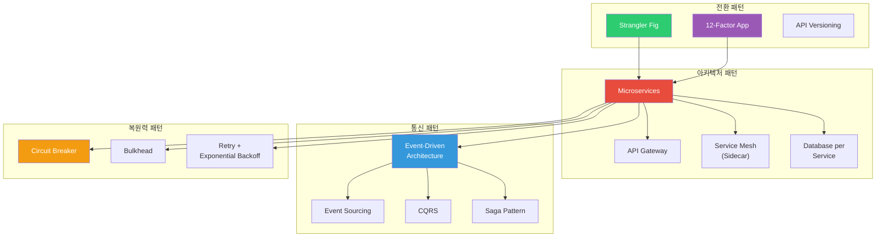
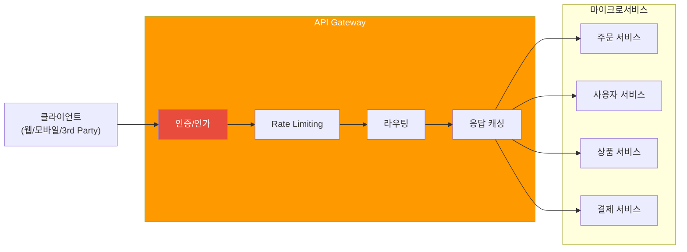
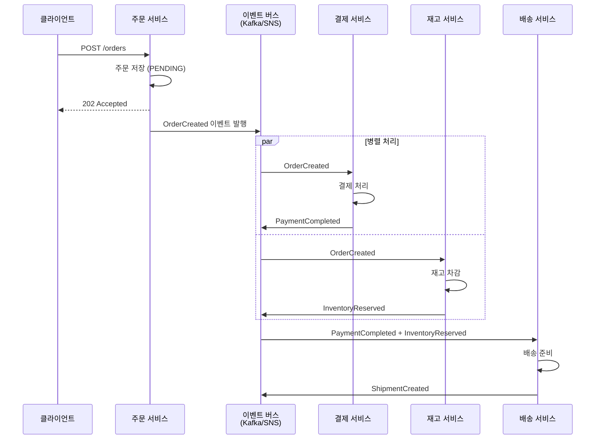
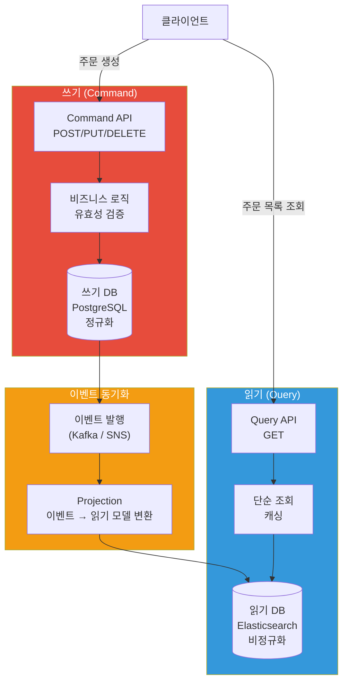
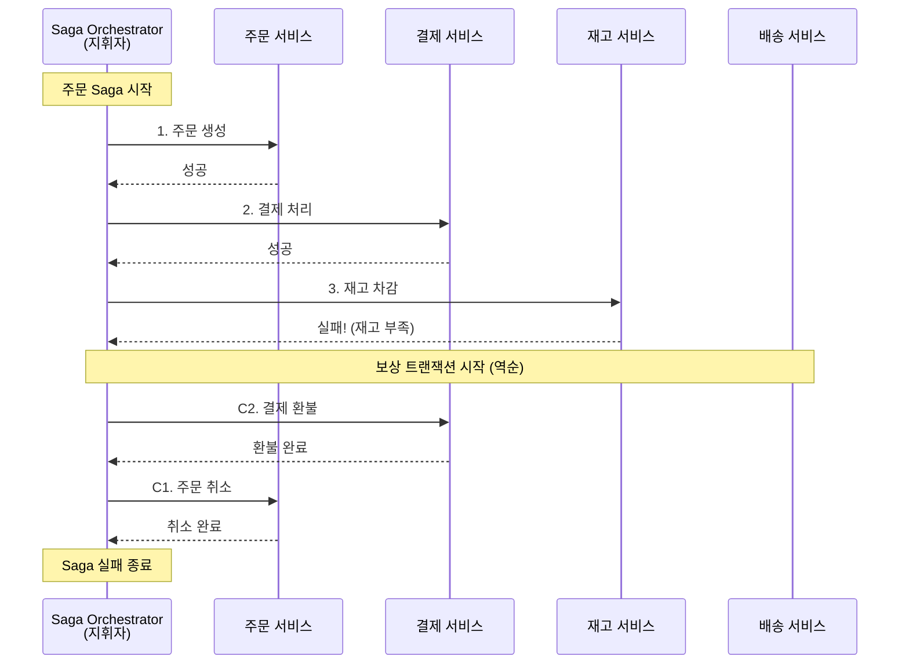
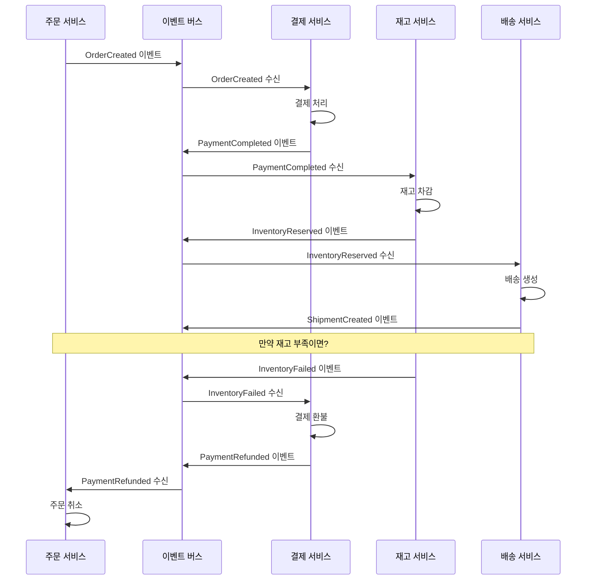
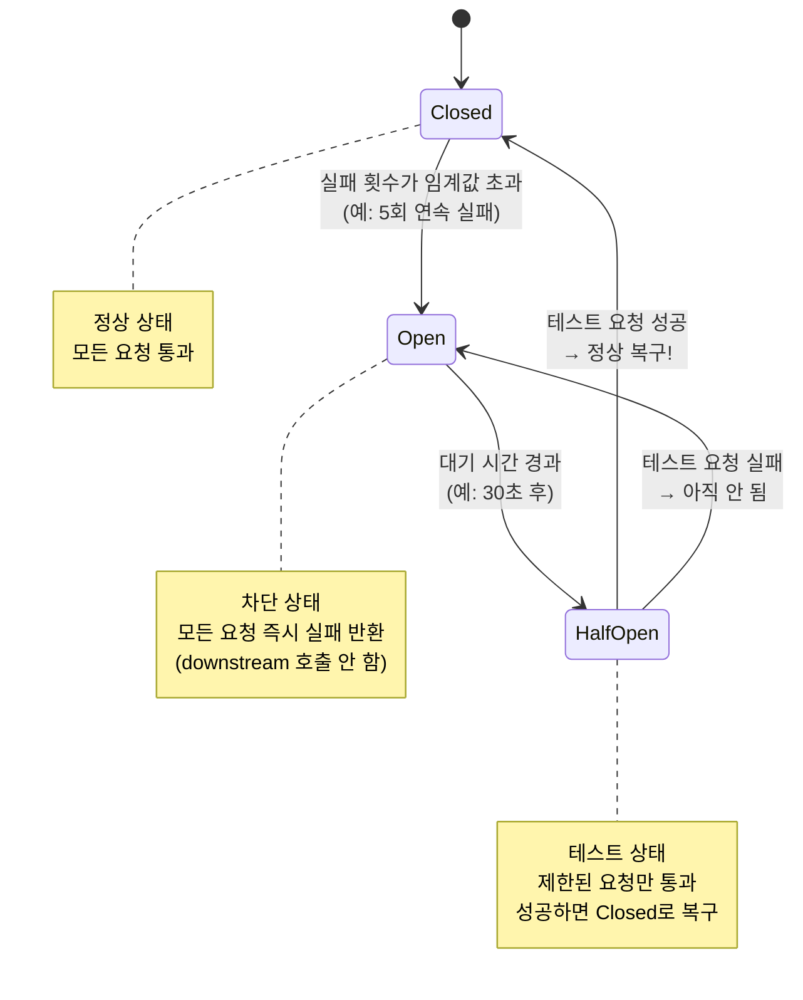
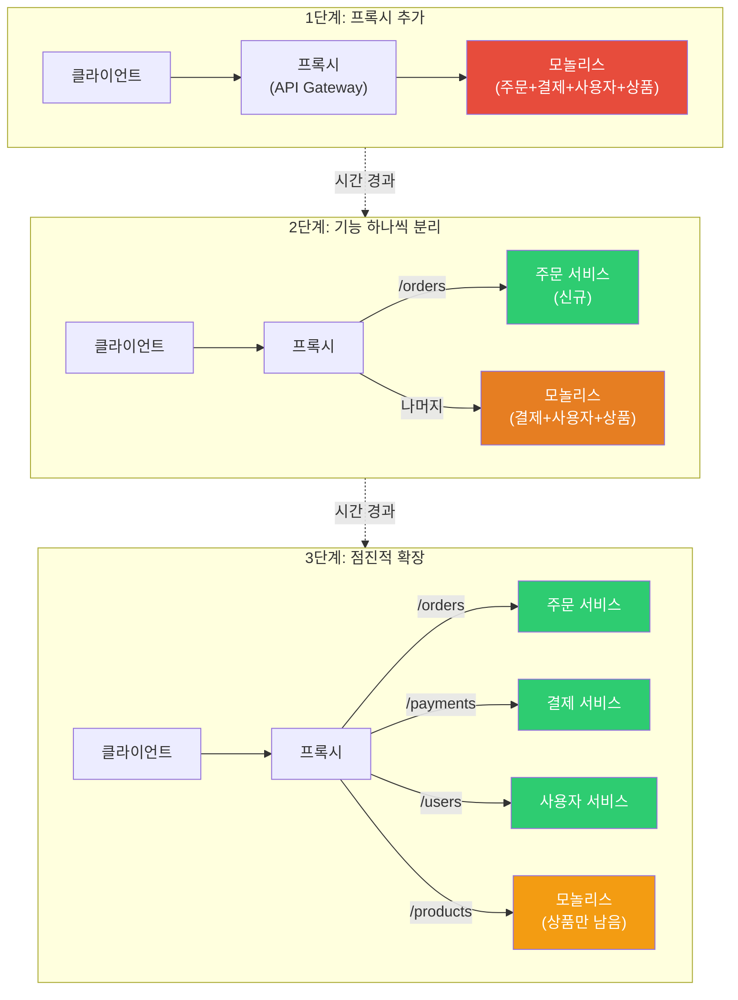
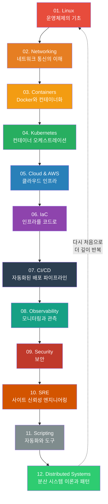

# 분산 시스템 패턴

> [이전 강의](./01-theory)에서 CAP 정리, 합의 알고리즘(Raft), 분산 시스템의 이론적 기초를 배웠어요. 이번에는 그 이론 위에 세워진 **실전 패턴**들을 다뤄요. Microservices 아키텍처, Event-Driven Architecture, CQRS, Saga, 12-Factor App까지 — 현대 분산 시스템을 설계할 때 반드시 알아야 하는 핵심 패턴을 총정리해요. 이 강의는 전체 DevOps 로드맵의 **마지막 강의**예요.

---

## 🎯 왜 분산 시스템 패턴을 알아야 하나요?

```
분산 시스템 패턴이 필요한 순간:
• "모놀리스가 너무 커져서 배포할 때마다 전체가 멈춰요"           → Microservices 분리
• "주문 서비스가 죽으면 결제, 배송까지 전부 죽어요"              → Bulkhead / Circuit Breaker
• "주문 → 결제 → 재고 → 배송, 이 긴 트랜잭션을 어떻게?"       → Saga 패턴
• "읽기 트래픽이 쓰기의 100배인데 같은 DB로 버텨요"             → CQRS
• "이벤트가 발생한 순서와 이력을 전부 추적하고 싶어요"           → Event Sourcing
• "레거시 모놀리스를 점진적으로 마이크로서비스로 바꾸고 싶어요"   → Strangler Fig
• "컨테이너 12개가 각각 다른 설정 방식이라 운영이 미쳐요"       → 12-Factor App
• 면접: "Saga 패턴에서 Orchestration vs Choreography 차이는?"  → 이 강의에서 다뤄요
```

---

## 🧠 핵심 개념 잡기

### 비유: 분산 시스템은 대형 쇼핑몰이에요

모놀리스는 **1인 가게**예요. 사장님 혼자 주문받고, 만들고, 포장하고, 배달까지 해요. 작을 때는 빠르지만, 손님이 많아지면 혼자서는 감당이 안 돼요.

마이크로서비스는 **대형 쇼핑몰**이에요. 음식점, 의류매장, 영화관이 각각 독립적으로 운영되지만, 손님 입장에서는 하나의 쇼핑몰이에요.

| 쇼핑몰 구성요소 | 분산 시스템 패턴 | 역할 |
|---------------|---------------|------|
| **안내 데스크** | API Gateway | 모든 요청의 단일 진입점 |
| **건물 관리실** | Service Mesh | 매장 간 통신 규칙, 보안, 모니터링 |
| **관내 방송** | Event-Driven Architecture | "3층 화재 발생" → 모든 매장이 듣고 각자 대응 |
| **매장별 금고** | Database per Service | 각 매장이 자기 돈은 자기가 관리 |
| **비상 셔터** | Circuit Breaker | 화재 난 매장으로 손님 못 가게 차단 |
| **비상구 분리** | Bulkhead | 한 구역 문제가 전체로 번지지 않도록 격리 |
| **쇼핑몰 리모델링** | Strangler Fig | 영업하면서 한 층씩 리모델링 |

### 패턴 전체 지도



---

## 🔍 하나씩 자세히 알아보기

### 1. Microservices 아키텍처 패턴

#### API Gateway 패턴

클라이언트가 수십 개의 마이크로서비스를 직접 호출하면 어떻게 될까요? URL이 수십 개가 되고, 각각 인증을 처리해야 하고, 모바일과 웹의 요구사항도 다르죠. **API Gateway**는 이 모든 것을 한 곳에서 처리해요.

```
API Gateway가 하는 일:
• 라우팅         — /orders → 주문 서비스, /users → 사용자 서비스
• 인증/인가      — JWT 검증을 Gateway에서 한 번만
• Rate Limiting  — 초당 요청 수 제한
• 응답 합성      — 여러 서비스의 응답을 하나로 합쳐서 반환
• 프로토콜 변환  — 외부 REST ↔ 내부 gRPC
• 로깅/모니터링  — 모든 요청을 한 곳에서 추적
```



**실무에서 많이 쓰는 API Gateway:**

| 도구 | 특징 | 적합한 상황 |
|------|------|-----------|
| **Kong** | 오픈소스, 플러그인 풍부 | 범용, 대규모 |
| **AWS API Gateway** | 서버리스, Lambda 연동 | AWS 환경 |
| **Nginx** | 경량, 고성능 | 심플한 라우팅 |
| **Envoy** | gRPC 지원, Service Mesh 연계 | K8s 환경 |
| **Spring Cloud Gateway** | Java 생태계 통합 | Spring Boot 프로젝트 |

> **BFF (Backend For Frontend)** 패턴도 알아두세요. 모바일용 Gateway, 웹용 Gateway를 따로 두는 거예요. 모바일은 데이터를 적게, 웹은 풍부하게 — 각 클라이언트에 최적화된 응답을 줄 수 있어요.

#### Service Mesh / Sidecar 패턴

[Service Mesh 강의](../04-kubernetes/18-service-mesh)에서 자세히 다뤘지만, 여기서 패턴 관점에서 다시 정리할게요.

**Sidecar 패턴**은 각 서비스 옆에 **보조 프로세스(프록시)**를 붙이는 거예요. 서비스 코드를 건드리지 않고도 네트워크 기능을 추가할 수 있어요.

```
Sidecar가 대신 처리하는 것들:
• mTLS (상호 인증)          — 서비스 간 통신 암호화
• 트래픽 라우팅              — 카나리 배포, A/B 테스트
• Circuit Breaker           — 장애 전파 차단
• Retry / Timeout           — 자동 재시도, 타임아웃
• 분산 트레이싱              — 요청 흐름 추적
• 로드 밸런싱                — 클라이언트 사이드 LB
```

핵심 도구:
- **Istio** — 가장 기능이 풍부하지만 복잡해요. 대규모 조직에 적합
- **Linkerd** — 가볍고 심플. 빠르게 도입하고 싶을 때
- **Consul Connect** — HashiCorp 생태계와 통합

#### Database per Service 패턴

마이크로서비스의 **핵심 원칙** 중 하나예요. 각 서비스가 자기만의 데이터베이스를 갖는 거예요.

```
왜 DB를 분리해야 하나요?

공유 DB의 문제:
• 주문 서비스가 DB 스키마를 바꾸면 → 결제 서비스도 영향받음
• 주문 서비스의 대량 쿼리가 → 사용자 서비스까지 느리게 만듦
• 서비스 독립 배포가 불가능 → 모놀리스와 다를 게 없음

DB 분리의 이점:
• 각 서비스가 최적의 DB를 선택 가능 (주문=PostgreSQL, 상품=MongoDB, 세션=Redis)
• 서비스 간 결합도 최소화
• 독립적인 스케일링 가능
```

| 서비스 | DB 선택 | 이유 |
|--------|---------|------|
| 주문 서비스 | PostgreSQL | 트랜잭션 무결성 필요 |
| 상품 카탈로그 | MongoDB | 유연한 스키마, 읽기 최적화 |
| 사용자 세션 | Redis | 초고속 읽기/쓰기 |
| 검색 서비스 | Elasticsearch | 전문 검색(Full-text Search) |
| 분석 서비스 | ClickHouse | 대용량 분석 쿼리 |

> 주의: DB를 분리하면 **서비스 간 데이터 조인**이 안 돼요. 이때 API Composition이나 CQRS로 해결해요.

---

### 2. Event-Driven Architecture (EDA)

[메시징 강의](../05-cloud-aws/11-messaging)에서 SQS/SNS/Kinesis를 배웠죠? EDA는 그 메시징 인프라 위에서 돌아가는 **아키텍처 패턴**이에요.

#### 핵심 개념

```
동기 방식 (전화 통화):
  주문 서비스 → 결제 서비스 호출 → 재고 서비스 호출 → 배송 서비스 호출
  → 하나라도 느리면 전체가 느려지고, 하나라도 죽으면 전체가 실패

비동기 방식 (방송):
  주문 서비스 → "주문 생성됨" 이벤트 발행
  → 결제 서비스: "주문 생성됨" 들음 → 결제 처리
  → 재고 서비스: "주문 생성됨" 들음 → 재고 차감
  → 배송 서비스: "주문 생성됨" 들음 → 배송 준비
  → 각자 독립적으로 처리, 서로 기다리지 않음
```



#### Event Sourcing

일반적인 DB는 **현재 상태**만 저장해요. Event Sourcing은 **상태가 변한 모든 이벤트**를 저장해요.

```
일반 방식 (현재 상태만 저장):
  계좌 잔액: 50,000원

Event Sourcing (모든 변경 이력 저장):
  1. AccountCreated    → 잔액: 0원
  2. MoneyDeposited    → +100,000원
  3. MoneyWithdrawn    → -30,000원
  4. MoneyWithdrawn    → -20,000원
  → 현재 잔액: 50,000원 (이벤트를 순서대로 재생하면 계산됨)
```

**Event Store**는 이 이벤트들을 저장하는 전용 저장소예요.

```python
# Event Sourcing 개념 코드 (Python)

from dataclasses import dataclass, field
from datetime import datetime
from typing import List

@dataclass
class Event:
    event_type: str
    data: dict
    timestamp: datetime = field(default_factory=datetime.now)
    version: int = 0

class EventStore:
    """이벤트 저장소 — append-only로 이벤트를 쌓아요"""
    def __init__(self):
        self._events: dict[str, List[Event]] = {}

    def append(self, aggregate_id: str, event: Event):
        """이벤트 추가 (수정/삭제 없음, 오직 추가만!)"""
        if aggregate_id not in self._events:
            self._events[aggregate_id] = []
        event.version = len(self._events[aggregate_id]) + 1
        self._events[aggregate_id].append(event)

    def get_events(self, aggregate_id: str) -> List[Event]:
        """특정 엔티티의 모든 이벤트 조회"""
        return self._events.get(aggregate_id, [])

class BankAccount:
    """이벤트를 재생해서 현재 상태를 구성하는 Aggregate"""
    def __init__(self, account_id: str):
        self.account_id = account_id
        self.balance = 0
        self.is_open = False

    def apply(self, event: Event):
        """이벤트 하나를 적용해서 상태 업데이트"""
        if event.event_type == "AccountOpened":
            self.is_open = True
            self.balance = 0
        elif event.event_type == "MoneyDeposited":
            self.balance += event.data["amount"]
        elif event.event_type == "MoneyWithdrawn":
            self.balance -= event.data["amount"]

    @classmethod
    def rebuild_from_events(cls, account_id: str, events: List[Event]):
        """이벤트 목록을 순서대로 재생 → 현재 상태 복원"""
        account = cls(account_id)
        for event in events:
            account.apply(event)
        return account

# 사용 예시
store = EventStore()
store.append("ACC-001", Event("AccountOpened", {}))
store.append("ACC-001", Event("MoneyDeposited", {"amount": 100000}))
store.append("ACC-001", Event("MoneyWithdrawn", {"amount": 30000}))
store.append("ACC-001", Event("MoneyWithdrawn", {"amount": 20000}))

# 이벤트 재생으로 현재 상태 복원
events = store.get_events("ACC-001")
account = BankAccount.rebuild_from_events("ACC-001", events)
print(f"현재 잔액: {account.balance:,}원")  # 현재 잔액: 50,000원
```

**Event Sourcing의 장단점:**

| 장점 | 단점 |
|------|------|
| 완전한 감사 추적(Audit Trail) | 이벤트 스키마 변경이 어려움 |
| 시간 여행(Time Travel) — 과거 시점 상태 복원 | 이벤트 재생 시간이 길어질 수 있음 → Snapshot 필요 |
| 이벤트 재생으로 버그 재현 가능 | 학습 곡선이 높음 |
| 다른 시스템과 이벤트 공유 쉬움 | 결과적 일관성(Eventual Consistency) 이해 필요 |

---

### 3. CQRS (Command Query Responsibility Segregation)

쉽게 말하면 **쓰기(Command)와 읽기(Query)를 분리**하는 패턴이에요.

```
왜 분리하나요?

보통 시스템은:
• 쓰기: 복잡한 비즈니스 로직, 유효성 검증, 트랜잭션
• 읽기: 여러 테이블 JOIN, 다양한 뷰, 트래픽의 90%

문제:
• 읽기 최적화하면 쓰기가 느려지고
• 쓰기 최적화하면 읽기가 불편하고
• 하나의 모델로 양쪽을 만족시키기 어려움

해결:
• 쓰기 모델(Command): 비즈니스 로직에 최적화
• 읽기 모델(Query): 조회 성능에 최적화
• 각각 다른 DB를 쓸 수도 있어요!
```



**CQRS + Event Sourcing 조합이 강력한 이유:**
- Event Sourcing으로 모든 변경 이벤트 저장
- 이벤트를 Projection해서 읽기 모델 생성
- 읽기 모델은 용도에 따라 여러 개 만들 수 있음 (검색용, 리포트용, 대시보드용...)

```
주의: CQRS는 모든 시스템에 필요한 게 아니에요!

CQRS가 적합한 경우:
✅ 읽기/쓰기 비율이 극단적으로 다를 때 (읽기 >> 쓰기)
✅ 읽기 모델이 여러 서비스의 데이터를 합쳐야 할 때
✅ Event Sourcing을 이미 사용할 때

CQRS가 과한 경우:
❌ 단순 CRUD 애플리케이션
❌ 읽기/쓰기 비율이 비슷할 때
❌ 팀 규모가 작고 복잡도를 감당하기 어려울 때
```

---

### 4. Saga 패턴

마이크로서비스에서 **여러 서비스에 걸친 트랜잭션**을 어떻게 처리할까요? 전통적인 분산 트랜잭션(2PC, 2-Phase Commit)은 느리고 단일 장애점이 생겨요. Saga는 이 문제를 **로컬 트랜잭션의 연쇄**로 해결해요.

```
주문 처리 Saga 예시:

정상 흐름:
  T1: 주문 생성 → T2: 결제 처리 → T3: 재고 차감 → T4: 배송 생성

실패 시 보상 트랜잭션 (역순으로):
  T3 실패 → C2: 결제 환불 → C1: 주문 취소

핵심: 각 단계(Ti)마다 실패 시 되돌리는 보상(Ci)이 짝을 이뤄요
```

#### Orchestration (오케스트레이션) 방식

**중앙 조율자(Orchestrator)**가 전체 흐름을 관리해요. 마치 **오케스트라 지휘자**가 각 악기 파트에 "지금 연주해!" 하고 지시하는 것과 같아요.



#### Choreography (코레오그래피) 방식

중앙 조율자 없이 각 서비스가 **이벤트를 주고받으며 알아서 진행**해요. 마치 **무용수들**이 서로의 움직임을 보고 다음 동작을 결정하는 것과 같아요.



#### Orchestration vs Choreography 비교

| 기준 | Orchestration | Choreography |
|------|-------------|-------------|
| **중앙 제어** | Orchestrator가 전체 관리 | 없음, 각 서비스가 자율적 |
| **가시성** | 전체 흐름을 한곳에서 볼 수 있음 | 흐름이 여러 서비스에 분산 |
| **결합도** | Orchestrator가 모든 서비스를 알아야 함 | 서비스 간 느슨한 결합 |
| **복잡도** | 단계가 많아져도 비교적 관리 쉬움 | 3~4단계 넘어가면 추적 어려움 |
| **단일 장애점** | Orchestrator가 죽으면 전체 중단 | 단일 장애점 없음 |
| **적합한 경우** | 복잡한 비즈니스 워크플로우 | 단순한 이벤트 체인 |
| **도구** | AWS Step Functions, Temporal, Camunda | Kafka, SNS/SQS, EventBridge |

> **실무 팁:** 단계가 3개 이하이고 단순하면 Choreography, 4개 이상이거나 비즈니스 로직이 복잡하면 Orchestration을 추천해요. 많은 팀이 처음에 Choreography로 시작했다가 복잡해지면 Orchestration으로 전환해요.

#### Temporal.io: Saga 패턴의 프로덕션 구현

[Temporal](https://temporal.io/)은 CNCF Sandbox 프로젝트로, 분산 시스템에서 Saga 패턴과 같은 복잡한 워크플로를 안정적으로 실행할 수 있게 해주는 **Durable Execution** 플랫폼이에요. 직접 메시지 큐, 상태 관리, 재시도 로직을 구현하는 대신 Temporal이 이를 모두 처리해줘요.

```
Durable Execution이란?

  기존 방식 (DIY):
    코드 실행 → 서버 크래시 → 상태 유실 → 어디서 실패했는지 모름
    → 직접 체크포인트, 재시도, 상태 저장 구현 필요

  Temporal 방식:
    코드 실행 → 서버 크래시 → Temporal이 상태 보존 → 정확히 중단 지점에서 재개
    → 일반 코드처럼 작성하면 Temporal이 내구성 보장

  핵심 개념:
  ┌──────────────────────────────────────────────────────────┐
  │ Workflow  = 전체 비즈니스 프로세스 (주문 처리 전체 흐름) │
  │ Activity  = 개별 작업 단위 (결제, 재고 확인, 배송 등)   │
  │ Worker    = Workflow/Activity를 실행하는 프로세스        │
  │ Task Queue = Worker가 작업을 가져가는 큐                 │
  └──────────────────────────────────────────────────────────┘
```

Saga 패턴을 Temporal Workflow로 구현하면 보상 트랜잭션 관리가 단순해져요:

```python
# order_workflow.py - Temporal Workflow 정의
from temporalio import workflow
from temporalio.common import RetryPolicy
from datetime import timedelta

@workflow.defn
class OrderSagaWorkflow:
    """주문 처리 Saga - Temporal이 상태 관리와 보상을 자동 처리"""

    @workflow.run
    async def run(self, order: dict) -> dict:
        # 보상 작업 스택 (실패 시 역순으로 실행)
        compensations = []

        try:
            # 1단계: 결제
            payment = await workflow.execute_activity(
                process_payment,
                args=[order["payment_info"]],
                start_to_close_timeout=timedelta(seconds=30),
                retry_policy=RetryPolicy(maximum_attempts=3),
            )
            compensations.append(("refund_payment", payment["payment_id"]))

            # 2단계: 재고 확인 및 예약
            reservation = await workflow.execute_activity(
                reserve_inventory,
                args=[order["items"]],
                start_to_close_timeout=timedelta(seconds=10),
            )
            compensations.append(("release_inventory", reservation["reservation_id"]))

            # 3단계: 배송 생성
            shipment = await workflow.execute_activity(
                create_shipment,
                args=[order["shipping_info"]],
                start_to_close_timeout=timedelta(seconds=15),
            )

            return {"status": "completed", "shipment_id": shipment["id"]}

        except Exception as e:
            # 실패 시 보상 트랜잭션 역순 실행
            for compensation_name, compensation_id in reversed(compensations):
                await workflow.execute_activity(
                    compensation_name,
                    args=[compensation_id],
                    start_to_close_timeout=timedelta(seconds=30),
                )
            return {"status": "failed", "reason": str(e)}
```

```python
# activities.py - 개별 작업 정의
from temporalio import activity

@activity.defn
async def process_payment(payment_info: dict) -> dict:
    """결제 처리 - 실패 시 Temporal이 자동 재시도"""
    # 실제 PG사 API 호출
    result = await payment_gateway.charge(payment_info)
    return {"payment_id": result.id, "amount": result.amount}

@activity.defn
async def reserve_inventory(items: list) -> dict:
    """재고 예약"""
    reservation = await inventory_service.reserve(items)
    return {"reservation_id": reservation.id}

@activity.defn
async def refund_payment(payment_id: str) -> None:
    """결제 환불 (보상 트랜잭션)"""
    await payment_gateway.refund(payment_id)

@activity.defn
async def release_inventory(reservation_id: str) -> None:
    """재고 예약 해제 (보상 트랜잭션)"""
    await inventory_service.release(reservation_id)
```

```python
# worker.py - Worker 실행
from temporalio.client import Client
from temporalio.worker import Worker

async def main():
    client = await Client.connect("localhost:7233")

    worker = Worker(
        client,
        task_queue="order-saga",
        workflows=[OrderSagaWorkflow],
        activities=[
            process_payment,
            reserve_inventory,
            create_shipment,
            refund_payment,
            release_inventory,
        ],
    )
    await worker.run()
```

```
DIY Saga vs Temporal 비교:

┌─────────────────────┬──────────────────────┬──────────────────────┐
│ 항목                │ DIY (직접 구현)       │ Temporal             │
├─────────────────────┼──────────────────────┼──────────────────────┤
│ 상태 관리           │ DB + 상태 머신 직접   │ 자동 (Event Sourcing)│
│                     │ 구현 필요             │                      │
│ 재시도 로직         │ 직접 구현             │ RetryPolicy 선언만   │
│ 보상 트랜잭션       │ 직접 추적/실행        │ try/except로 자연스럽│
│                     │                      │ 게 처리              │
│ 타임아웃 관리       │ 타이머 + 스케줄러     │ timeout 파라미터     │
│ 가시성              │ 로그 파싱 필요        │ Web UI에서 실시간    │
│                     │                      │ 워크플로 상태 확인   │
│ 장애 복구           │ 체크포인트 직접 구현  │ 자동 (Durable        │
│                     │                      │ Execution)           │
│ 코드 복잡도         │ 매우 높음             │ 일반 코드 수준       │
│ 인프라 의존성       │ 메시지 큐 + DB +      │ Temporal Server      │
│                     │ 스케줄러              │ (또는 Temporal Cloud)│
│ 적합한 규모         │ 단순한 2-3단계        │ 복잡한 다단계        │
│                     │ 워크플로              │ 비즈니스 워크플로    │
└─────────────────────┴──────────────────────┴──────────────────────┘

Temporal을 고려해야 하는 경우:
  • Saga 단계가 5개 이상이고 보상 로직이 복잡
  • 워크플로 실행이 수 분~수 시간 이상 걸림
  • 장애 시 정확한 지점에서 재개해야 함
  • 워크플로 실행 상태를 실시간으로 모니터링해야 함
  • 기존 메시지 큐 기반 구현이 디버깅하기 너무 어려움

Temporal 대안:
  • AWS Step Functions: AWS 네이티브, 서버리스
  • Azure Durable Functions: Azure 생태계
  • Camunda: BPMN 기반, 엔터프라이즈
  • Restate: 새로운 Durable Execution 플랫폼
```

---

### 5. 복원력(Resilience) 패턴

#### Circuit Breaker (서킷 브레이커)

집의 **누전 차단기**를 생각해보세요. 전기 과부하가 걸리면 자동으로 전원을 끊어서 화재를 방지하듯, Circuit Breaker는 장애가 난 서비스로의 호출을 **자동으로 차단**해요.



**Resilience4j (Java)**와 **Istio (K8s)** 에서의 Circuit Breaker 설정:

```java
// Resilience4j — Java/Spring Boot에서 Circuit Breaker 설정
import io.github.resilience4j.circuitbreaker.CircuitBreakerConfig;
import io.github.resilience4j.circuitbreaker.CircuitBreaker;
import java.time.Duration;

CircuitBreakerConfig config = CircuitBreakerConfig.custom()
    .failureRateThreshold(50)           // 실패율 50% 넘으면 Open
    .waitDurationInOpenState(Duration.ofSeconds(30))  // 30초 대기 후 Half-Open
    .slidingWindowSize(10)              // 최근 10개 요청 기준
    .minimumNumberOfCalls(5)            // 최소 5번 호출 후 판단
    .permittedNumberOfCallsInHalfOpenState(3) // Half-Open에서 3번 테스트
    .build();

CircuitBreaker circuitBreaker = CircuitBreaker.of("paymentService", config);

// 사용
String result = circuitBreaker.executeSupplier(() -> {
    return paymentService.processPayment(order);
});
```

```yaml
# Istio DestinationRule — K8s에서 Circuit Breaker 설정
apiVersion: networking.istio.io/v1beta1
kind: DestinationRule
metadata:
  name: payment-service-cb
spec:
  host: payment-service
  trafficPolicy:
    connectionPool:
      tcp:
        maxConnections: 100           # 최대 동시 연결 수
      http:
        h2UpgradePolicy: DEFAULT
        http1MaxPendingRequests: 50   # 대기 큐 최대 크기
        http2MaxRequests: 100         # 최대 동시 요청 수
    outlierDetection:                  # Istio의 Circuit Breaker
      consecutive5xxErrors: 5          # 5xx 에러 5회 연속 → 제거
      interval: 10s                    # 10초 간격으로 검사
      baseEjectionTime: 30s            # 30초 동안 트래픽에서 제외
      maxEjectionPercent: 50           # 전체 인스턴스의 최대 50%만 제거
```

#### Bulkhead (격벽) 패턴

배가 한 곳에 구멍이 나도 **격벽(Bulkhead)**이 있으면 물이 다른 구역으로 넘어가지 않아요. 마찬가지로, 하나의 서비스 호출이 전체 리소스를 고갈시키지 않도록 **리소스를 격리**해요.

```
Bulkhead 적용 예시:

Thread Pool Bulkhead:
• 결제 서비스 호출 → 전용 스레드 풀 10개
• 재고 서비스 호출 → 전용 스레드 풀 10개
• 배송 서비스 호출 → 전용 스레드 풀 5개
→ 결제 서비스가 느려져도 결제용 스레드 10개만 점유됨
→ 재고/배송 서비스는 영향 없음!

Semaphore Bulkhead:
• 동시 실행 가능한 호출 수를 제한
• 더 가벼운 격리 방식
```

```java
// Resilience4j Bulkhead 설정
BulkheadConfig config = BulkheadConfig.custom()
    .maxConcurrentCalls(10)              // 최대 동시 호출 10개
    .maxWaitDuration(Duration.ofMillis(500)) // 대기 최대 500ms
    .build();

Bulkhead bulkhead = Bulkhead.of("paymentService", config);

// Circuit Breaker + Bulkhead 조합
Supplier<String> decoratedSupplier = Decorators.ofSupplier(() ->
        paymentService.processPayment(order))
    .withCircuitBreaker(circuitBreaker)
    .withBulkhead(bulkhead)
    .withRetry(retry)
    .decorate();
```

#### Retry with Exponential Backoff

실패하면 **점점 더 긴 간격**으로 재시도해요. 그냥 바로 재시도하면 장애난 서비스에 부하만 더 줘요.

```
단순 재시도의 문제:
  실패 → 즉시 재시도 → 또 실패 → 즉시 재시도 → 또 실패...
  → 장애난 서비스에 트래픽 폭탄 → 복구 불가

Exponential Backoff:
  1차 실패 → 1초 후 재시도
  2차 실패 → 2초 후 재시도
  3차 실패 → 4초 후 재시도
  4차 실패 → 8초 후 재시도
  → 점점 간격을 늘려서 서비스가 복구할 시간을 줌

+ Jitter (랜덤 지터):
  1차: 1초 + 랜덤(0~500ms)
  2차: 2초 + 랜덤(0~500ms)
  → 여러 클라이언트가 동시에 재시도하는 "Thundering Herd" 방지
```

```python
# Python — Exponential Backoff with Jitter
import time
import random
import requests
from functools import wraps

def retry_with_backoff(max_retries=5, base_delay=1.0, max_delay=60.0):
    """지수 백오프 + 지터 데코레이터"""
    def decorator(func):
        @wraps(func)
        def wrapper(*args, **kwargs):
            for attempt in range(max_retries):
                try:
                    return func(*args, **kwargs)
                except Exception as e:
                    if attempt == max_retries - 1:
                        raise  # 마지막 시도면 예외 발생

                    # Exponential Backoff + Full Jitter
                    delay = min(base_delay * (2 ** attempt), max_delay)
                    jitter = random.uniform(0, delay)
                    actual_delay = jitter

                    print(f"[시도 {attempt + 1}/{max_retries}] "
                          f"실패: {e}. {actual_delay:.1f}초 후 재시도...")
                    time.sleep(actual_delay)
        return wrapper
    return decorator

@retry_with_backoff(max_retries=5, base_delay=1.0)
def call_payment_service(order_id):
    """결제 서비스 호출 (실패 시 자동 재시도)"""
    response = requests.post(
        "https://payment-service/api/v1/charge",
        json={"order_id": order_id},
        timeout=5
    )
    response.raise_for_status()
    return response.json()
```

---

### 6. Strangler Fig 패턴 (모놀리스 → 마이크로서비스 전환)

**교살무화과(Strangler Fig)**는 큰 나무에 뿌리를 내려 서서히 감싸면서 결국 자리를 차지하는 식물이에요. 이 패턴도 마찬가지 — 기존 모놀리스를 **운영하면서 점진적으로** 새로운 마이크로서비스로 교체해요.

```
Big Bang 전환 (위험!):
  월요일: 모놀리스 운영 중
  금요일: "자, 이제 마이크로서비스로 바꿉니다!" → 전부 교체
  → 실패 확률 매우 높음, 롤백도 어려움

Strangler Fig (안전!):
  1개월차: 모놀리스 100% / 마이크로서비스 0%
  3개월차: "주문" 기능만 마이크로서비스로 분리
  6개월차: "결제" 기능도 분리
  12개월차: "사용자" 기능도 분리
  → 점진적으로, 실패해도 해당 기능만 롤백
```



**실무 전환 체크리스트:**

```
Step 1: 프록시(API Gateway) 설치
  → 모든 트래픽이 프록시를 거치게 만듦
  → 이 시점에서는 100% 모놀리스로 라우팅

Step 2: 가장 독립적인 기능부터 분리
  → 다른 서비스와 의존성이 적은 것부터
  → 예: 알림 서비스, 인증 서비스

Step 3: 프록시에서 라우팅 전환
  → 새 마이크로서비스로 트래픽 전환
  → 카나리 배포로 10% → 50% → 100%

Step 4: 모놀리스에서 해당 코드 제거
  → 더 이상 호출되지 않는 코드 정리
  → 공유 DB 테이블 분리

Step 5: 반복
  → 다음 기능으로 이동
```

---

### 7. 12-Factor App

Heroku의 공동 창립자가 만든 **클라우드 네이티브 애플리케이션의 12가지 원칙**이에요. 2012년에 나왔지만 지금도 컨테이너/K8s 환경에서 표준처럼 사용돼요.

| # | Factor | 한줄 설명 | 실무 예시 |
|---|--------|---------|---------|
| 1 | **Codebase** | 하나의 코드베이스, 여러 배포 | Git 레포 1개 → dev/staging/prod 배포 |
| 2 | **Dependencies** | 명시적 의존성 선언 | `requirements.txt`, `package.json` |
| 3 | **Config** | 환경 변수로 설정 | `DATABASE_URL=...` (코드에 하드코딩 금지) |
| 4 | **Backing Services** | 부착된 리소스로 취급 | DB, Redis, S3를 URL로 연결 (교체 가능) |
| 5 | **Build, Release, Run** | 빌드/릴리스/실행 단계 분리 | Docker build → tag → run |
| 6 | **Processes** | 무상태(Stateless) 프로세스 | 세션은 Redis에, 파일은 S3에 |
| 7 | **Port Binding** | 포트 바인딩으로 서비스 노출 | `app.listen(8080)` |
| 8 | **Concurrency** | 프로세스 모델로 확장 | 수평 확장 (Pod 개수 늘리기) |
| 9 | **Disposability** | 빠른 시작과 Graceful Shutdown | K8s의 preStop hook, SIGTERM 처리 |
| 10 | **Dev/Prod Parity** | 개발/프로덕션 환경 동일하게 | Docker Compose로 로컬 환경 구성 |
| 11 | **Logs** | 로그를 이벤트 스트림으로 취급 | stdout으로 출력 → Fluentbit가 수집 |
| 12 | **Admin Processes** | 관리 작업도 동일 환경에서 | `kubectl exec` 으로 마이그레이션 실행 |

```yaml
# 12-Factor App 원칙을 따르는 K8s Deployment 예시
apiVersion: apps/v1
kind: Deployment
metadata:
  name: order-service
spec:
  replicas: 3                          # Factor 8: Concurrency (수평 확장)
  selector:
    matchLabels:
      app: order-service
  template:
    metadata:
      labels:
        app: order-service
    spec:
      containers:
      - name: order-service
        image: myregistry/order-service:v1.2.3   # Factor 5: Build, Release, Run
        ports:
        - containerPort: 8080                     # Factor 7: Port Binding

        env:                                       # Factor 3: Config (환경 변수)
        - name: DATABASE_URL
          valueFrom:
            secretKeyRef:
              name: order-db-secret
              key: url
        - name: REDIS_URL                          # Factor 4: Backing Services
          value: "redis://redis-service:6379"
        - name: LOG_LEVEL
          value: "info"

        livenessProbe:                             # Factor 9: Disposability
          httpGet:
            path: /healthz
            port: 8080
          initialDelaySeconds: 5
          periodSeconds: 10

        lifecycle:                                 # Factor 9: Graceful Shutdown
          preStop:
            exec:
              command: ["/bin/sh", "-c", "sleep 5"]

        resources:
          requests:
            memory: "256Mi"
            cpu: "250m"
          limits:
            memory: "512Mi"
            cpu: "500m"
```

---

### 8. API Versioning & Backward Compatibility

마이크로서비스에서 **API를 변경할 때 기존 클라이언트가 깨지지 않게** 하는 전략이에요.

```
API 버전 관리 전략:

1. URI 버전 관리 (가장 흔함):
   GET /api/v1/orders
   GET /api/v2/orders     ← 새 버전

2. Header 버전 관리:
   Accept: application/vnd.myapp.v2+json

3. Query Parameter 버전 관리:
   GET /api/orders?version=2
```

**하위 호환성(Backward Compatibility) 규칙:**

```
안전한 변경 (기존 클라이언트 깨지지 않음):
✅ 새 필드 추가 (응답에 새 필드 추가)
✅ 선택적(optional) 파라미터 추가
✅ 새 API 엔드포인트 추가
✅ 새 enum 값 추가 (클라이언트가 unknown 처리 필요)

위험한 변경 (기존 클라이언트가 깨질 수 있음):
❌ 기존 필드 제거 또는 이름 변경
❌ 필드 타입 변경 (string → int)
❌ 필수 파라미터 추가
❌ URL 구조 변경
❌ HTTP 상태 코드 변경
→ 이런 변경이 필요하면 새 버전(v2)을 만드세요!
```

```
버전 폐기(Deprecation) 절차:

1. v2 출시 → v1에 Sunset 헤더 추가
   Sunset: Sat, 31 Dec 2025 23:59:59 GMT
   Deprecation: true

2. v1 사용자에게 공지 (최소 3~6개월 전)

3. v1 트래픽 모니터링 → 0에 가까워지면

4. v1 종료
```

---

## 💻 직접 해보기

### 실습 1: Python으로 간단한 Saga Orchestrator 만들기

```python
"""
간단한 Saga Orchestrator 구현

실제로는 Temporal, AWS Step Functions 같은 도구를 쓰지만,
Saga의 원리를 이해하기 위해 직접 구현해봐요.
"""
from dataclasses import dataclass
from typing import Callable, List, Optional
from enum import Enum

class SagaStepStatus(Enum):
    PENDING = "pending"
    COMPLETED = "completed"
    COMPENSATED = "compensated"
    FAILED = "failed"

@dataclass
class SagaStep:
    name: str
    action: Callable                    # 실행 함수
    compensation: Callable              # 보상(롤백) 함수
    status: SagaStepStatus = SagaStepStatus.PENDING

class SagaOrchestrator:
    """Saga 패턴 Orchestrator"""

    def __init__(self, name: str):
        self.name = name
        self.steps: List[SagaStep] = []
        self.completed_steps: List[SagaStep] = []

    def add_step(self, name: str, action: Callable, compensation: Callable):
        """Saga 단계 추가"""
        self.steps.append(SagaStep(name=name, action=action, compensation=compensation))

    def execute(self, context: dict) -> bool:
        """Saga 실행 — 실패 시 자동으로 보상 트랜잭션 실행"""
        print(f"\n{'='*50}")
        print(f"Saga '{self.name}' 시작")
        print(f"{'='*50}")

        for step in self.steps:
            try:
                print(f"\n[실행] {step.name}...")
                step.action(context)
                step.status = SagaStepStatus.COMPLETED
                self.completed_steps.append(step)
                print(f"[성공] {step.name} 완료")

            except Exception as e:
                print(f"\n[실패] {step.name}: {e}")
                step.status = SagaStepStatus.FAILED
                self._compensate(context)
                return False

        print(f"\n{'='*50}")
        print(f"Saga '{self.name}' 성공 완료!")
        print(f"{'='*50}")
        return True

    def _compensate(self, context: dict):
        """보상 트랜잭션 실행 (완료된 단계를 역순으로)"""
        print(f"\n--- 보상 트랜잭션 시작 (역순) ---")
        for step in reversed(self.completed_steps):
            try:
                print(f"[보상] {step.name} 되돌리기...")
                step.compensation(context)
                step.status = SagaStepStatus.COMPENSATED
                print(f"[보상 완료] {step.name}")
            except Exception as e:
                print(f"[보상 실패] {step.name}: {e} — 수동 처리 필요!")
        print(f"--- 보상 트랜잭션 종료 ---")


# === 각 서비스의 액션과 보상 함수 정의 ===

def create_order(ctx):
    ctx["order_id"] = "ORD-12345"
    print(f"  주문 생성: {ctx['order_id']}")

def cancel_order(ctx):
    print(f"  주문 취소: {ctx['order_id']}")
    del ctx["order_id"]

def process_payment(ctx):
    ctx["payment_id"] = "PAY-67890"
    print(f"  결제 처리: {ctx['payment_id']} (50,000원)")

def refund_payment(ctx):
    print(f"  결제 환불: {ctx['payment_id']}")
    del ctx["payment_id"]

def reserve_inventory(ctx):
    # 재고 부족 시뮬레이션! (실패 케이스)
    available_stock = 0  # 재고 0개
    if available_stock <= 0:
        raise Exception("재고 부족! 현재 재고: 0개")
    ctx["inventory_reserved"] = True

def release_inventory(ctx):
    print(f"  재고 복원")
    ctx["inventory_reserved"] = False

def create_shipment(ctx):
    ctx["shipment_id"] = "SHIP-11111"
    print(f"  배송 생성: {ctx['shipment_id']}")

def cancel_shipment(ctx):
    print(f"  배송 취소: {ctx['shipment_id']}")
    del ctx["shipment_id"]


# === Saga 실행 ===

saga = SagaOrchestrator("주문 처리 Saga")
saga.add_step("주문 생성", create_order, cancel_order)
saga.add_step("결제 처리", process_payment, refund_payment)
saga.add_step("재고 차감", reserve_inventory, release_inventory)
saga.add_step("배송 생성", create_shipment, cancel_shipment)

context = {"customer_id": "CUST-001", "amount": 50000}
result = saga.execute(context)

print(f"\n최종 결과: {'성공' if result else '실패 (모두 롤백됨)'}")
print(f"컨텍스트: {context}")
```

**실행 결과:**
```
==================================================
Saga '주문 처리 Saga' 시작
==================================================

[실행] 주문 생성...
  주문 생성: ORD-12345
[성공] 주문 생성 완료

[실행] 결제 처리...
  결제 처리: PAY-67890 (50,000원)
[성공] 결제 처리 완료

[실행] 재고 차감...

[실패] 재고 차감: 재고 부족! 현재 재고: 0개

--- 보상 트랜잭션 시작 (역순) ---
[보상] 결제 처리 되돌리기...
  결제 환불: PAY-67890
[보상 완료] 결제 처리
[보상] 주문 생성 되돌리기...
  주문 취소: ORD-12345
[보상 완료] 주문 생성
--- 보상 트랜잭션 종료 ---

최종 결과: 실패 (모두 롤백됨)
```

### 실습 2: Circuit Breaker 직접 구현하기

```python
"""
Circuit Breaker 패턴 구현

상태 전이: Closed → Open → Half-Open → Closed (또는 Open)
"""
import time
import random
from enum import Enum
from threading import Lock

class CircuitState(Enum):
    CLOSED = "CLOSED"          # 정상 — 요청 통과
    OPEN = "OPEN"              # 차단 — 요청 즉시 실패
    HALF_OPEN = "HALF_OPEN"    # 테스트 — 제한된 요청만 통과

class CircuitBreakerOpenError(Exception):
    """서킷 브레이커가 열려 있을 때 발생하는 에러"""
    pass

class CircuitBreaker:
    def __init__(
        self,
        name: str,
        failure_threshold: int = 5,     # 실패 몇 번이면 Open?
        recovery_timeout: float = 30.0, # Open 후 몇 초 뒤에 Half-Open?
        half_open_max_calls: int = 3    # Half-Open에서 몇 번 테스트?
    ):
        self.name = name
        self.failure_threshold = failure_threshold
        self.recovery_timeout = recovery_timeout
        self.half_open_max_calls = half_open_max_calls

        self._state = CircuitState.CLOSED
        self._failure_count = 0
        self._success_count = 0
        self._last_failure_time = 0
        self._half_open_calls = 0
        self._lock = Lock()

    @property
    def state(self) -> CircuitState:
        """현재 상태 확인 (Open → Half-Open 자동 전환 포함)"""
        if self._state == CircuitState.OPEN:
            elapsed = time.time() - self._last_failure_time
            if elapsed >= self.recovery_timeout:
                self._state = CircuitState.HALF_OPEN
                self._half_open_calls = 0
                print(f"  [{self.name}] OPEN → HALF_OPEN (대기 시간 경과)")
        return self._state

    def call(self, func, *args, **kwargs):
        """보호된 함수 호출"""
        with self._lock:
            current_state = self.state

            if current_state == CircuitState.OPEN:
                raise CircuitBreakerOpenError(
                    f"[{self.name}] 서킷 브레이커 OPEN 상태 — 요청 차단됨"
                )

            if current_state == CircuitState.HALF_OPEN:
                if self._half_open_calls >= self.half_open_max_calls:
                    raise CircuitBreakerOpenError(
                        f"[{self.name}] HALF_OPEN 테스트 한도 초과"
                    )
                self._half_open_calls += 1

        # 실제 호출 (락 밖에서)
        try:
            result = func(*args, **kwargs)
            self._on_success()
            return result
        except CircuitBreakerOpenError:
            raise
        except Exception as e:
            self._on_failure()
            raise

    def _on_success(self):
        """호출 성공 시"""
        with self._lock:
            if self._state == CircuitState.HALF_OPEN:
                self._success_count += 1
                if self._success_count >= self.half_open_max_calls:
                    self._state = CircuitState.CLOSED
                    self._failure_count = 0
                    self._success_count = 0
                    print(f"  [{self.name}] HALF_OPEN → CLOSED (복구 완료!)")
            else:
                self._failure_count = 0  # 연속 실패 카운트 리셋

    def _on_failure(self):
        """호출 실패 시"""
        with self._lock:
            self._failure_count += 1
            self._last_failure_time = time.time()

            if self._state == CircuitState.HALF_OPEN:
                self._state = CircuitState.OPEN
                self._success_count = 0
                print(f"  [{self.name}] HALF_OPEN → OPEN (테스트 실패)")
            elif self._failure_count >= self.failure_threshold:
                self._state = CircuitState.OPEN
                print(f"  [{self.name}] CLOSED → OPEN "
                      f"(실패 {self._failure_count}회 — 임계값 도달)")


# === 시뮬레이션 ===

def unreliable_service():
    """불안정한 서비스 (70% 확률로 실패)"""
    if random.random() < 0.7:
        raise Exception("서비스 응답 없음 (timeout)")
    return "성공!"

cb = CircuitBreaker("결제서비스", failure_threshold=3, recovery_timeout=5)

print("=== Circuit Breaker 시뮬레이션 ===\n")
for i in range(15):
    try:
        result = cb.call(unreliable_service)
        print(f"요청 {i+1}: {result} (상태: {cb.state.value})")
    except CircuitBreakerOpenError as e:
        print(f"요청 {i+1}: 차단됨! (상태: {cb.state.value})")
    except Exception as e:
        print(f"요청 {i+1}: 실패 — {e} (상태: {cb.state.value})")

    time.sleep(1)
```

### 실습 3: 12-Factor App 점검 스크립트

```bash
#!/bin/bash
# 12-Factor App 준수 여부 체크 스크립트

echo "============================================"
echo "  12-Factor App 준수 체크"
echo "============================================"

SCORE=0
TOTAL=12

# Factor 1: Codebase — Git 사용 여부
echo ""
echo "[1/12] Codebase — Git 레포지토리 확인"
if [ -d ".git" ]; then
    echo "  ✅ Git 레포지토리 발견"
    SCORE=$((SCORE + 1))
else
    echo "  ❌ Git 레포지토리 없음"
fi

# Factor 2: Dependencies — 의존성 파일 확인
echo "[2/12] Dependencies — 의존성 파일 확인"
if [ -f "requirements.txt" ] || [ -f "package.json" ] || [ -f "go.mod" ] || [ -f "pom.xml" ]; then
    echo "  ✅ 의존성 파일 발견"
    SCORE=$((SCORE + 1))
else
    echo "  ❌ 의존성 파일 없음"
fi

# Factor 3: Config — 하드코딩된 설정 확인
echo "[3/12] Config — 하드코딩된 설정 확인"
HARDCODED=$(grep -r "localhost\|127.0.0.1\|password.*=" --include="*.py" --include="*.js" --include="*.ts" --include="*.java" . 2>/dev/null | grep -v "node_modules\|venv\|.git\|test" | wc -l)
if [ "$HARDCODED" -lt 3 ]; then
    echo "  ✅ 하드코딩된 설정 거의 없음 ($HARDCODED건)"
    SCORE=$((SCORE + 1))
else
    echo "  ⚠️  하드코딩된 설정 발견 ($HARDCODED건) — 환경 변수로 변경 필요"
fi

# Factor 5: Build, Release, Run — Dockerfile 확인
echo "[5/12] Build, Release, Run — Dockerfile 확인"
if [ -f "Dockerfile" ] || [ -f "docker-compose.yml" ]; then
    echo "  ✅ Docker 설정 발견"
    SCORE=$((SCORE + 1))
else
    echo "  ❌ Docker 설정 없음"
fi

# Factor 6: Processes — 상태 저장 코드 확인
echo "[6/12] Processes — 로컬 상태 저장 확인"
LOCAL_STATE=$(grep -r "open(\|write_file\|session\[" --include="*.py" --include="*.js" . 2>/dev/null | grep -v "node_modules\|venv\|.git\|test\|log" | wc -l)
if [ "$LOCAL_STATE" -lt 5 ]; then
    echo "  ✅ 로컬 상태 저장 적음 ($LOCAL_STATE건)"
    SCORE=$((SCORE + 1))
else
    echo "  ⚠️  로컬 파일/세션 저장 발견 ($LOCAL_STATE건)"
fi

# Factor 9: Disposability — Graceful Shutdown 확인
echo "[9/12] Disposability — Graceful Shutdown 확인"
GRACEFUL=$(grep -r "SIGTERM\|SIGINT\|graceful\|shutdown" --include="*.py" --include="*.js" --include="*.go" --include="*.java" . 2>/dev/null | grep -v "node_modules\|venv\|.git" | wc -l)
if [ "$GRACEFUL" -gt 0 ]; then
    echo "  ✅ Graceful Shutdown 처리 발견 ($GRACEFUL건)"
    SCORE=$((SCORE + 1))
else
    echo "  ⚠️  Graceful Shutdown 처리 없음"
fi

# Factor 11: Logs — stdout 로깅 확인
echo "[11/12] Logs — stdout 로깅 확인"
STDOUT_LOG=$(grep -r "print\|console.log\|log.Info\|logger" --include="*.py" --include="*.js" --include="*.go" . 2>/dev/null | grep -v "node_modules\|venv\|.git" | wc -l)
if [ "$STDOUT_LOG" -gt 0 ]; then
    echo "  ✅ stdout 로깅 사용 중 ($STDOUT_LOG건)"
    SCORE=$((SCORE + 1))
else
    echo "  ⚠️  로깅 코드 없음"
fi

echo ""
echo "============================================"
echo "  결과: $SCORE / $TOTAL (체크 가능한 항목 기준)"
echo "============================================"
```

---

## 🏢 실무에서는?

### 시나리오 1: 이커머스 플랫폼 아키텍처

```
요구사항:
• 일 주문량 100만 건
• 블랙프라이데이 때 트래픽 10배
• 99.9% 가용성 SLA
• 실시간 재고 관리 필요

적용 패턴:
1. Microservices — 주문, 결제, 재고, 배송, 사용자 서비스 분리
2. API Gateway — Kong으로 단일 진입점 + Rate Limiting
3. CQRS — 상품 카탈로그 읽기는 Elasticsearch, 쓰기는 PostgreSQL
4. Saga (Orchestration) — 주문 워크플로우는 AWS Step Functions
5. Circuit Breaker — 외부 결제 PG사 연동에 적용
6. Event-Driven — 주문 이벤트 → Kafka → 재고/배송/알림
7. Bulkhead — 결제 서비스 전용 커넥션 풀 격리
```

### 시나리오 2: 레거시 전환 프로젝트 (실제 타임라인)

```
기존: 10년 된 모놀리스 (Spring MVC + Oracle DB, 100만 줄)
목표: 마이크로서비스로 점진적 전환

1개월차: 준비
  → API Gateway(Kong) 설치, 모든 트래픽 프록시 경유
  → 서비스 경계 식별 (DDD의 Bounded Context)
  → 모니터링 기반 구축 (Prometheus + Grafana)

3개월차: 첫 번째 서비스 분리 (알림 서비스)
  → Strangler Fig으로 알림 기능만 새 서비스로
  → Kafka로 이벤트 연동
  → 모놀리스의 알림 코드는 유지 (fallback)

6개월차: 인증 서비스 분리
  → OAuth2 + JWT 기반 인증 서비스
  → API Gateway에서 JWT 검증
  → 모놀리스 세션 → JWT 전환

9개월차: 주문 서비스 분리
  → 가장 핵심적이고 복잡한 도메인
  → Saga 패턴으로 주문 워크플로우 관리
  → Database per Service 적용 (PostgreSQL)
  → CQRS로 주문 조회 최적화

12개월차: 결제/재고 서비스 분리
  → Circuit Breaker + Retry로 PG사 연동 보호
  → Event Sourcing으로 재고 변경 이력 관리

18개월차: 모놀리스 최소화
  → 모놀리스에는 전환하기 어려운 레거시 기능만 남음
  → 새 기능은 전부 마이크로서비스로 개발
```

### 시나리오 3: 장애 대응에서 패턴의 위력

```
장애: 결제 PG사(외부 서비스) 3분간 응답 없음

Circuit Breaker 없을 때:
  → 주문 서비스의 스레드가 전부 결제 대기로 점유
  → 주문 서비스도 응답 불가
  → 상품 조회, 장바구니까지 연쇄 장애
  → 전체 서비스 30분 다운
  → 매출 손실 수억 원

Circuit Breaker + Bulkhead + Retry 있을 때:
  → Circuit Breaker: 결제 실패 5회 → 결제 호출 차단
  → Bulkhead: 결제 전용 스레드만 영향, 다른 기능 정상
  → 사용자에게: "결제가 일시적으로 불가합니다. 잠시 후 다시 시도해주세요"
  → 주문/상품/장바구니는 정상 운영
  → PG사 복구 후 Half-Open → Closed로 자동 복구
  → 다운타임 0분, 결제만 3분 지연
```

### 도구 선택 가이드

| 패턴 | 도구/프레임워크 | 적합한 규모 |
|------|---------------|-----------|
| API Gateway | Kong, AWS API Gateway, Envoy | 모든 규모 |
| Service Mesh | Istio, Linkerd, Consul Connect | 서비스 10개 이상 |
| Event Bus | Kafka, AWS SNS/SQS, RabbitMQ | 이벤트 기반 시스템 |
| Saga Orchestration | Temporal, AWS Step Functions, Camunda | 복잡한 워크플로우 |
| Circuit Breaker | Resilience4j(Java), Polly(.NET), Istio | 외부 연동 있는 곳 |
| Event Store | EventStoreDB, Kafka(로그 기반), DynamoDB Streams | Event Sourcing 도입 시 |
| CQRS 읽기 DB | Elasticsearch, Redis, DynamoDB | 읽기 트래픽 높은 곳 |

---

## ⚠️ 자주 하는 실수

### 실수 1: 처음부터 마이크로서비스로 시작하기

```
❌ "우리도 넷플릭스처럼 마이크로서비스로 하자!"
  → 팀 3명인데 서비스 15개
  → 서비스 간 통신 복잡도 폭발
  → 분산 시스템 디버깅 지옥
  → 결국 "분산 모놀리스"가 됨

✅ 올바른 접근:
  → 모놀리스로 시작 (Modular Monolith)
  → 도메인 경계가 명확해지면 분리
  → "서비스를 분리할 이유"가 생기면 그때 분리
  → Martin Fowler: "Monolith First"
```

### 실수 2: 분산 모놀리스 만들기

```
❌ 마이크로서비스라고 해놓고 실제로는:
  → 모든 서비스가 하나의 DB를 공유
  → 서비스 A를 배포하려면 B, C도 같이 배포
  → 동기 호출 체인이 10단계
  → 모놀리스보다 느리고 복잡하기만 함

✅ 진짜 마이크로서비스인지 확인하는 체크리스트:
  → 각 서비스를 독립적으로 배포할 수 있나? (Yes면 통과)
  → 서비스 하나가 죽어도 나머지가 돌아가나? (Yes면 통과)
  → 각 서비스가 자기 DB를 갖고 있나? (Yes면 통과)
  → 하나라도 No면 = 분산 모놀리스
```

### 실수 3: Event Sourcing을 모든 곳에 적용하기

```
❌ "Event Sourcing이 좋다니까 전부 적용하자!"
  → 단순 CRUD까지 Event Sourcing
  → 개발 속도 급격히 느려짐
  → 이벤트 스키마 변경 지옥
  → 팀원 학습 곡선으로 생산성 저하

✅ Event Sourcing이 진짜 필요한 곳:
  → 감사 추적이 법적으로 필요한 금융 도메인
  → 시간 여행(과거 상태 복원)이 필요한 곳
  → 복잡한 비즈니스 이벤트 흐름이 있는 핵심 도메인
  → 그 외에는 일반 CRUD로 충분해요!
```

### 실수 4: Saga 보상 트랜잭션을 대충 구현하기

```
❌ 보상 트랜잭션 실수:
  → 보상 함수가 멱등성(idempotent)이 아님
    → 같은 환불을 2번 실행하면 2번 환불됨!
  → 보상 실패 시 처리가 없음
    → 결제는 됐는데 주문은 취소 → 데이터 불일치
  → 타임아웃 설정 없음
    → 보상 트랜잭션이 영원히 걸려도 기다림

✅ 보상 트랜잭션 체크리스트:
  → 모든 보상 함수는 멱등성 보장 (같은 요청 N번 해도 결과 동일)
  → 보상 실패 시 재시도 + DLQ로 빠짐
  → 타임아웃 설정 필수
  → 모니터링/알림 설정 (보상 실패 = 심각한 문제)
```

### 실수 5: Circuit Breaker 임계값을 감으로 설정하기

```
❌ 잘못된 설정:
  → 실패 1회만에 Open → 일시적 네트워크 지터에도 차단
  → 대기 시간 5분 → 장애 복구 후에도 5분간 서비스 불가
  → 임계값 없이 기본값 사용 → 서비스 특성에 안 맞음

✅ 올바른 접근:
  → 정상 상태의 에러율을 먼저 측정 (기준선)
  → 기준선의 2~3배를 임계값으로 설정
  → 대기 시간은 downstream 서비스의 평균 복구 시간 기반
  → 프로덕션에서 모니터링하면서 조정
  → Grafana 대시보드에 Circuit Breaker 상태 표시 필수
```

---

## 📝 마무리

### 패턴 선택 가이드 (의사결정 트리)

```
서비스가 몇 개인가요?
├─ 1개 (모놀리스) → 12-Factor App 원칙 적용 → 필요하면 Strangler Fig으로 분리
├─ 2~5개 → API Gateway + Circuit Breaker + Retry
├─ 5~20개 → + Event-Driven + Saga + Database per Service
└─ 20개+ → + Service Mesh + CQRS + Event Sourcing (필요한 곳만)
```

### 핵심 요약 테이블

| 패턴 | 해결하는 문제 | 핵심 한줄 | 주의사항 |
|------|-------------|---------|---------|
| **API Gateway** | 클라이언트-서비스 결합 | 단일 진입점 + 횡단 관심사 처리 | 단일 장애점 되지 않게 이중화 |
| **Service Mesh** | 서비스 간 통신 관리 | 앱 코드 밖에서 네트워크 정책 적용 | 서비스 적으면 오버헤드 |
| **Database per Service** | 서비스 간 DB 결합 | 각 서비스가 자기 DB 소유 | 서비스 간 조인 불가 |
| **EDA** | 동기 호출 체인 | 이벤트로 비동기 통신 | 결과적 일관성 이해 필요 |
| **Event Sourcing** | 상태 변경 이력 추적 | 이벤트를 저장, 상태는 재생 | 모든 곳에 적용하지 말 것 |
| **CQRS** | 읽기/쓰기 최적화 충돌 | 읽기 모델과 쓰기 모델 분리 | 단순 CRUD엔 과한 패턴 |
| **Saga** | 분산 트랜잭션 | 로컬 트랜잭션 + 보상 트랜잭션 | 보상의 멱등성 필수 |
| **Circuit Breaker** | 장애 전파 | 실패 감지 → 자동 차단 → 자동 복구 | 임계값 모니터링 기반 설정 |
| **Bulkhead** | 리소스 고갈 전파 | 리소스 격리 (스레드풀/커넥션풀) | 격리 단위 설계 중요 |
| **Retry + Backoff** | 일시적 실패 | 점점 긴 간격으로 재시도 + 지터 | Thundering Herd 주의 |
| **Strangler Fig** | 레거시 전환 | 운영 중 점진적 교체 | 가장 독립적인 기능부터 |
| **12-Factor App** | 클라우드 비호환 앱 | 12가지 원칙으로 클라우드 네이티브 | 원칙이지 규칙은 아님 |

### 면접 대비 질문 Top 5

```
Q1: "Saga 패턴에서 Orchestration과 Choreography의 차이는?"
A: Orchestration은 중앙 조율자가 전체 흐름을 관리하고,
   Choreography는 각 서비스가 이벤트를 보고 자율적으로 행동해요.
   복잡한 워크플로우는 Orchestration, 단순한 이벤트 체인은 Choreography가 적합해요.

Q2: "CQRS를 왜 쓰나요? 단점은?"
A: 읽기/쓰기 최적화를 분리해서 각각에 맞는 DB를 쓸 수 있어요.
   단점은 결과적 일관성(읽기 모델 동기화 지연)과 시스템 복잡도 증가예요.

Q3: "Circuit Breaker의 3가지 상태를 설명해주세요"
A: Closed(정상-통과), Open(차단-즉시실패), Half-Open(테스트-일부만 통과).
   Closed에서 실패가 임계값을 넘으면 Open,
   Open에서 대기 시간 후 Half-Open,
   Half-Open에서 테스트 성공하면 Closed로 복구돼요.

Q4: "모놀리스에서 마이크로서비스로 어떻게 전환하나요?"
A: Strangler Fig 패턴으로 점진적으로 전환해요.
   API Gateway를 앞에 두고, 가장 독립적인 기능부터 하나씩 분리해요.
   Big Bang 전환은 위험하고, 카나리 배포로 트래픽을 점진적으로 옮겨요.

Q5: "이벤트 소싱과 일반 CRUD의 차이는?"
A: CRUD는 현재 상태만 저장하고, Event Sourcing은 상태 변경 이벤트를 전부 저장해요.
   이벤트를 재생하면 어떤 시점의 상태든 복원할 수 있어요.
   감사 추적, 디버깅, 시간 여행이 필요한 도메인에 적합해요.
```

---

## 🔗 전체 로드맵 마무리

🎉 **12-Distributed Systems 카테고리 완료! 그리고 — 전체 DevOps 로드맵 완주!**

2개 강의를 통해 분산 시스템의 이론(CAP, 합의 알고리즘, 일관성 모델)과 실전 패턴(Microservices, CQRS, Saga, Circuit Breaker)까지 — 대규모 시스템 설계의 기초를 다졌어요.

### 축하해요! DevOps 로드맵 전체를 완주했어요!

이 강의가 전체 시리즈의 마지막이에요. 지금까지 배운 여정을 되돌아볼게요.



### 전체 여정 되돌아보기

```
Section 01 — Linux
  파일 시스템, 프로세스, systemd, SSH, 커널까지
  → 모든 인프라의 기반이 되는 운영체제를 배웠어요

Section 02 — Networking
  OSI 모델, TCP/IP, DNS, TLS, 로드밸런싱
  → 서비스 간 통신의 원리를 이해했어요

Section 03 — Containers
  Docker, Dockerfile, 이미지 최적화, 보안
  → 애플리케이션 패키징의 표준을 배웠어요

Section 04 — Kubernetes
  Pod, Service, Ingress, Helm, Operator, Service Mesh
  → 컨테이너 오케스트레이션의 사실상 표준을 마스터했어요

Section 05 — Cloud & AWS
  VPC, EC2, RDS, Lambda, SQS, Well-Architected Framework
  → 클라우드 인프라를 설계하고 운영하는 방법을 배웠어요

Section 06 — IaC
  Terraform, Ansible, CloudFormation
  → 인프라를 코드로 관리하는 방법을 배웠어요

Section 07 — CI/CD
  Git, GitHub Actions, GitLab CI, ArgoCD, GitOps
  → 코드에서 프로덕션까지 자동화된 파이프라인을 구축했어요

Section 08 — Observability
  Prometheus, Grafana, ELK, OpenTelemetry
  → "무엇이 일어나고 있는지" 볼 수 있게 되었어요

Section 09 — Security
  OAuth2, Vault, OPA, Supply Chain Security
  → 인프라와 애플리케이션을 안전하게 지키는 방법을 배웠어요

Section 10 — SRE
  SLO/SLI, Incident Management, Chaos Engineering
  → 시스템 신뢰성을 측정하고 개선하는 방법을 배웠어요

Section 11 — Scripting
  Python, Go, YAML/JSON, 자동화 도구
  → 반복 작업을 코드로 해결하는 기술을 쌓았어요

Section 12 — Distributed Systems (지금 여기!)
  CAP, Raft, Microservices, CQRS, Saga, Circuit Breaker
  → 대규모 시스템을 설계하는 패턴과 원리를 배웠어요
```

### 이 다음에는 뭘 하면 좋을까요?

```
1. 직접 만들어보기 (가장 중요!)
   → 간단한 마이크로서비스 프로젝트를 하나 만들어보세요
   → 주문-결제-재고 3개 서비스 + Kafka + Docker Compose
   → 실제로 만들어봐야 "아, 이래서 이 패턴이 필요하구나" 체감돼요

2. 깊이 파기
   → "Designing Data-Intensive Applications" (Martin Kleppmann)
   → "Building Microservices" (Sam Newman)
   → "Release It!" (Michael Nygard)
   → 이 책들은 이 강의 시리즈의 다음 단계예요

3. 자격증 도전
   → AWS Solutions Architect Associate / Professional
   → Certified Kubernetes Administrator (CKA)
   → HashiCorp Terraform Associate

4. 커뮤니티 참여
   → 오픈소스 프로젝트에 기여해보세요 (문서화부터 시작!)
   → 배운 내용을 블로그에 정리해보세요
   → 스터디 그룹이나 밋업에 참여하세요

5. 다시 처음부터
   → 이 로드맵을 다시 처음부터 훑어보세요
   → 처음 봤을 때와 완전히 다른 관점으로 보일 거예요
   → "아, Linux의 cgroups가 컨테이너의 기반이고,
      컨테이너가 K8s의 기반이고,
      K8s 위에서 Service Mesh가 돌아가고,
      Service Mesh가 Circuit Breaker를 구현하는구나"
   → 전체가 하나로 연결되는 순간이 올 거예요
```

### 마지막 한마디

```
DevOps는 도구나 기술이 아니라 문화예요.

"배포가 무서운 게 아니라, 배포할 준비가 안 된 게 무서운 것"

이 강의 시리즈를 통해 여러분은:
• 서버 위에서 무슨 일이 일어나는지 이해하고 (Linux, Networking)
• 애플리케이션을 패키징하고 운영하고 (Containers, K8s)
• 인프라를 코드로 관리하고 (IaC, Cloud)
• 안전하고 빠르게 배포하고 (CI/CD, Security)
• 문제를 감지하고 대응하고 (Observability, SRE)
• 대규모 시스템을 설계하는 (Distributed Systems)

기초 체력을 갖추게 되었어요.

이제 남은 건 실전이에요.
직접 만들고, 부수고, 고치면서 배워보세요.

수고하셨어요! 🎉
```
