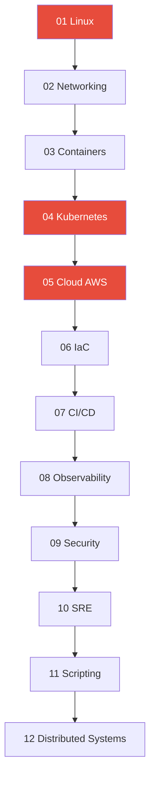

# DevOps 강의 시리즈 — 제작 플랜

---

## 📐 강의 설계 원칙

### 대상
* DevOps를 처음 공부하는 개발자 / 인프라 엔지니어
* Linux 기본 명령어 정도는 아는 수준

### 강의 1개 파일 구성 (템플릿)
```
# 제목

## 🎯 이걸 왜 알아야 하나?
→ 실무에서 이걸 모르면 어떤 문제가 생기는지 (동기 부여)

## 🧠 핵심 개념
→ 비유 + 그림(mermaid)으로 개념 설명
→ 처음 보는 사람도 "아 그거구나" 할 수 있는 수준

## 🔍 상세 설명
→ 각 항목별 깊이 있는 설명
→ 코드/명령어 예시 포함
→ mermaid 다이어그램 적극 활용

## 💻 실습 예제
→ 직접 따라할 수 있는 hands-on
→ 복사 붙여넣기로 바로 실행 가능

## 🏢 실무에서는?
→ 실제 회사에서 이걸 어떻게 쓰는지
→ 실무 시나리오 / 장애 사례
→ "이런 상황에서 이걸 씁니다"

## ⚠️ 자주 하는 실수
→ 초보자가 반드시 빠지는 함정

## 📝 정리
→ 한눈에 보는 요약 표 or 체크리스트

## 🔗 다음 강의
→ 연결되는 다음 주제 안내
```

### 스타일 가이드
* 존댓말 (~~해요 체)
* 비유는 일상생활 기반 (아파트, 택배, 도로 등)
* 코드 블록은 주석 풍부하게
* mermaid는 flowchart, sequence, architecture 위주
* 한 파일당 읽는 시간 약 15~25분 분량

---

## 📁 폴더 구조

```
devops-lectures/
├── 00-overview.md                    # 전체 로드맵 소개
│
├── 01-linux/
│   ├── 01-filesystem.md              # 파일 시스템 구조
│   ├── 02-permissions.md             # 권한 / ACL
│   ├── 03-users-groups.md            # 사용자 / 그룹
│   ├── 04-process.md                 # 프로세스 lifecycle / signals
│   ├── 05-systemd.md                 # systemd / service 관리
│   ├── 06-cron.md                    # cron / timers
│   ├── 07-disk.md                    # 디스크 / LVM / RAID
│   ├── 08-log.md                     # syslog / journald / rotation
│   ├── 09-network-commands.md        # iproute2 / ss / tcpdump / iptables
│   ├── 10-ssh.md                     # SSH / bastion / tunneling
│   ├── 11-bash-scripting.md          # bash scripting / pipeline
│   ├── 12-performance.md            # top / vmstat / iostat / sar / perf
│   ├── 13-kernel.md                  # cgroups / namespaces / sysctl / ulimit
│   └── 14-security.md               # SELinux / AppArmor / seccomp
│
├── 02-networking/
│   ├── 01-osi-tcp-udp.md            # OSI / TCP / UDP / ports / sockets
│   ├── 02-http.md                    # HTTP/1.1 ~ HTTP/3 / QUIC / gRPC / WebSocket
│   ├── 03-dns.md                     # DNS 전체
│   ├── 04-network-structure.md       # CIDR / subnetting / routing / NAT
│   ├── 05-tls-certificate.md         # TLS / 인증서 / mTLS
│   ├── 06-load-balancing.md          # L4 vs L7 / reverse proxy / sticky session
│   ├── 07-nginx-haproxy.md           # Nginx / HAProxy 실무
│   ├── 08-debugging.md              # ping ~ wireshark 디버깅
│   ├── 09-network-security.md        # WAF / DDoS / Zero Trust
│   ├── 10-vpn.md                     # VPN / 터널링
│   ├── 11-cdn.md                     # CDN / Anycast / CloudFront / Cloudflare
│   ├── 12-service-discovery.md       # CoreDNS / Consul / etcd
│   └── 13-api-management.md          # API Gateway / rate limiting / OpenAPI
│
├── 03-containers/
│   ├── 01-concept.md                 # container vs VM / OCI
│   ├── 02-docker-basics.md           # docker CLI / 기본 명령어
│   ├── 03-dockerfile.md              # Dockerfile 작성법
│   ├── 04-runtime.md                 # containerd / CRI-O / runc
│   ├── 05-networking.md              # bridge / overlay / host
│   ├── 06-image-optimization.md      # multi-stage / distroless / multi-arch
│   ├── 07-registry.md                # registry / Harbor
│   ├── 08-troubleshooting.md         # inspect / stats / 디버깅
│   └── 09-security.md               # rootless / scanning / signing
│
├── 04-kubernetes/
│   ├── 01-architecture.md            # 클러스터 구조 전체
│   ├── 02-pod-deployment.md          # Pod / Deployment / ReplicaSet
│   ├── 03-statefulset-daemonset.md   # StatefulSet / DaemonSet / Job
│   ├── 04-config-secret.md           # ConfigMap / Secret / External Secrets
│   ├── 05-service-ingress.md         # Service / Ingress / Gateway API
│   ├── 06-cni.md                     # CNI / Calico / Cilium / Flannel
│   ├── 07-storage.md                 # CSI / PV / PVC / StorageClass
│   ├── 08-healthcheck.md             # liveness / readiness / startup probe
│   ├── 09-operations.md              # rolling update / canary / blue-green
│   ├── 10-autoscaling.md             # HPA / VPA / Cluster Autoscaler / KEDA
│   ├── 11-rbac.md                    # RBAC / ServiceAccount
│   ├── 12-helm-kustomize.md          # Helm / Kustomize
│   ├── 13-kubectl-tips.md            # kubectl 확장 / krew
│   ├── 14-troubleshooting.md         # 트러블슈팅 전체
│   ├── 15-security.md               # NetworkPolicy / PSS / OPA / Falco
│   ├── 16-backup-dr.md              # etcd backup / Velero
│   ├── 17-operator-crd.md           # Operator / CRD
│   ├── 18-service-mesh.md           # Envoy / Istio / Linkerd
│   └── 19-multi-cluster.md          # federation / hybrid K8s
│
├── 05-cloud-aws/
│   ├── 01-iam.md                     # IAM 전체
│   ├── 02-vpc.md                     # VPC / subnet / routing / peering
│   ├── 03-ec2-autoscaling.md         # EC2 / Auto Scaling
│   ├── 04-storage.md                 # S3 / EBS / EFS
│   ├── 05-database.md               # RDS / Aurora / DynamoDB / ElastiCache
│   ├── 06-db-operations.md           # DB 운영 (backup, replication, pooling)
│   ├── 07-load-balancing.md          # ELB / ALB / NLB / Global Accelerator
│   ├── 08-route53-cloudfront.md      # Route53 / CloudFront
│   ├── 09-container-services.md      # ECR / ECS / EKS / Fargate
│   ├── 10-serverless.md              # Lambda / API Gateway / EventBridge
│   ├── 11-messaging.md              # SQS / SNS / Kinesis / MSK
│   ├── 12-security.md               # KMS / Secrets Manager / WAF / Shield
│   ├── 13-management.md             # CloudWatch / CloudTrail / SSM / Config
│   ├── 14-cost.md                    # Cost Explorer / Budgets / Savings Plans
│   ├── 15-multi-account.md           # Organizations / Control Tower
│   ├── 16-well-architected.md        # Well-Architected Framework 6대 축
│   ├── 17-disaster-recovery.md       # RTO / RPO / DR 전략 / chaos engineering
│   └── 18-multi-cloud.md            # 멀티 클라우드 / 하이브리드
│
├── 06-iac/
│   ├── 01-concept.md                 # IaC 왜 필요한가
│   ├── 02-terraform-basics.md        # HCL / provider / resource
│   ├── 03-terraform-advanced.md      # module / state / workspace / import
│   ├── 04-ansible.md                 # Ansible 전체
│   ├── 05-cloudformation-pulumi.md   # CloudFormation / Pulumi / CDK
│   └── 06-testing-policy.md          # Terratest / checkov / OPA / tfsec
│
├── 07-cicd/
│   ├── 01-git-basics.md              # Git 기본 ~ 심화
│   ├── 02-branching.md              # 브랜칭 전략 / versioning
│   ├── 03-ci-pipeline.md             # CI 개념 / build / cache / parallel
│   ├── 04-cd-pipeline.md             # CD 개념 / rollback / preview env
│   ├── 05-github-actions.md          # GitHub Actions 실무
│   ├── 06-gitlab-ci.md              # GitLab CI 실무
│   ├── 07-jenkins.md                 # Jenkins 실무
│   ├── 08-artifact.md                # registry / Nexus / Artifactory
│   ├── 09-testing.md                 # 테스트 자동화 전체
│   ├── 10-deployment-strategy.md     # rolling / blue-green / canary
│   ├── 11-gitops.md                  # ArgoCD / Flux
│   ├── 12-pipeline-security.md       # secrets / SAST / SBOM
│   └── 13-change-management.md       # 변경 관리 / feature flag
│
├── 08-observability/
│   ├── 01-concept.md                 # Observability 왜 필요한가
│   ├── 02-prometheus.md              # Prometheus 아키텍처 / PromQL
│   ├── 03-grafana.md                 # Grafana 대시보드
│   ├── 04-logging.md                 # structured logging / ELK / Loki
│   ├── 05-log-collection.md          # Fluentbit / Fluentd / Logstash
│   ├── 06-tracing.md                 # OpenTelemetry / Jaeger / Zipkin
│   ├── 07-k8s-monitoring.md          # kube-state-metrics / node-exporter
│   ├── 08-apm.md                     # Datadog / NewRelic
│   ├── 09-profiling.md              # continuous profiling
│   ├── 10-dashboard-design.md        # RED / USE / Golden Signals
│   └── 11-alerting.md               # Alertmanager / PagerDuty
│
├── 09-security/
│   ├── 01-identity.md                # OAuth2 / OIDC / SAML / JWT
│   ├── 02-secrets.md                 # Vault / SOPS / rotation
│   ├── 03-container-security.md      # image scanning / runtime protection
│   ├── 04-network-security.md        # WAF / Zero Trust
│   ├── 05-compliance.md             # CIS / SOC2 / GDPR
│   ├── 06-devsecops.md              # DevSecOps 파이프라인
│   └── 07-incident-response.md      # 보안 인시던트 대응
│
├── 10-sre/
│   ├── 01-principles.md             # SRE 원칙 / 문화
│   ├── 02-sli-slo.md                # SLO / SLI / SLA / nines / MTTR
│   ├── 03-incident-management.md    # on-call / escalation / runbook
│   ├── 04-capacity-planning.md      # 용량 계획 / 성능 모델링
│   ├── 05-chaos-engineering.md      # chaos engineering / game day
│   └── 06-platform-engineering.md    # IDP / Backstage / golden paths
│
├── 11-scripting/
│   ├── 01-bash.md                    # Bash 스크립팅
│   ├── 02-python.md                  # Python 자동화
│   ├── 03-go.md                      # Go CLI / K8s controllers
│   ├── 04-regex-jq.md               # 정규식 / jq / yq
│   └── 05-automation.md             # 자동화 도구 / Makefile / Taskfile
│
└── 12-distributed-systems/
    ├── 01-theory.md                  # CAP / consensus / Raft
    └── 02-patterns.md               # circuit breaker / retry / idempotency
```

---

## 📊 강의 통계

| 카테고리 | 파일 수 | 예상 제작 시간 |
|---------|--------|-------------|
| 00 Overview | 1 | — |
| 01 Linux | 14 | 가장 먼저 |
| 02 Networking | 13 | |
| 03 Containers | 9 | |
| 04 Kubernetes | 19 | 가장 많음 |
| 05 Cloud AWS | 18 | |
| 06 IaC | 6 | |
| 07 CI/CD | 13 | |
| 08 Observability | 11 | |
| 09 Security | 7 | |
| 10 SRE | 6 | |
| 11 Scripting | 5 | |
| 12 Distributed Systems | 2 | |
| **합계** | **124개** | |

---

## 🔄 제작 순서 (추천)

실제 학습 순서 = 제작 순서



빨간색 = 분량 많음, 우선 착수

---

## 📌 강의별 mermaid 활용 계획

| 주제 | mermaid 유형 | 예시 |
|------|------------|------|
| Linux 파일 시스템 | flowchart | 디렉토리 트리 구조 |
| 프로세스 lifecycle | stateDiagram | created → running → zombie |
| OSI model | flowchart | 7계층 데이터 흐름 |
| TCP handshake | sequenceDiagram | SYN → SYN-ACK → ACK |
| DNS 조회 | sequenceDiagram | client → resolver → root → TLD |
| Container vs VM | flowchart | 구조 비교 |
| K8s 아키텍처 | flowchart | control plane ↔ node 구조 |
| K8s Service 흐름 | sequenceDiagram | client → ingress → service → pod |
| VPC 구조 | flowchart | public/private subnet + NAT |
| CI/CD 파이프라인 | flowchart | commit → build → test → deploy |
| Terraform workflow | flowchart | write → plan → apply |
| Prometheus 흐름 | flowchart | exporter → prometheus → grafana |
| Incident 대응 | sequenceDiagram | alert → on-call → escalation |
| Circuit breaker | stateDiagram | closed → open → half-open |

---

## ⚡ 제작 방식

### 한 번에 1개 파일씩
1. 사용자가 "01-linux/01-filesystem.md 만들어줘" 요청
2. 템플릿에 맞춰 완성
3. 리뷰 후 다음 파일로

### 또는 배치로
1. 사용자가 "01-linux 전체 만들어줘" 요청
2. 14개 파일 순서대로 제작
3. 카테고리 단위로 리뷰

---

## 🎯 품질 체크리스트 (매 파일)

- [ ] 비유가 최소 1개 이상 있는가?
- [ ] mermaid 다이어그램이 최소 1개 있는가?
- [ ] 실행 가능한 코드/명령어 예시가 있는가?
- [ ] "실무에서는?" 섹션이 있는가?
- [ ] "자주 하는 실수" 섹션이 있는가?
- [ ] 다음 강의로의 연결이 자연스러운가?
- [ ] 처음 공부하는 사람이 읽고 이해할 수 있는가?
